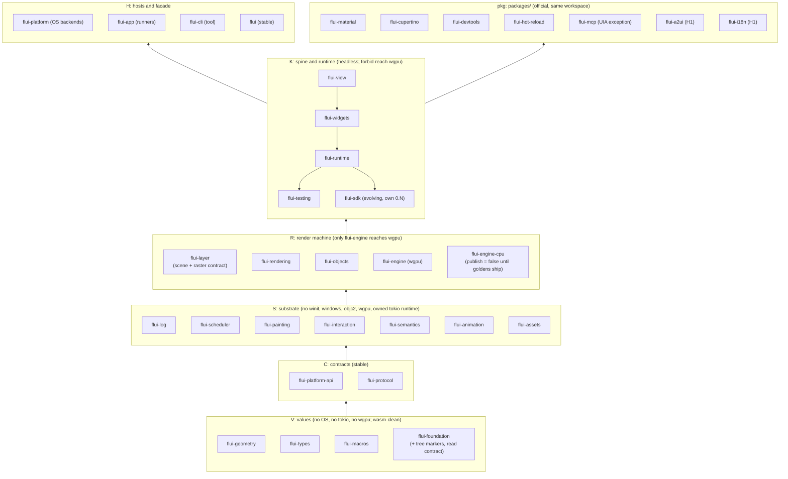

# FLUI target architecture

- **Status:** Proposed. Every decision below is carried by an ADR in `Proposed` state; none is
  accepted by this document.
- **Date:** 2026-09-25
- **Baseline:** `main` at `cab06137d`. Every `path:line` below was re-read at that commit.
- **Sources:** the architecture review in
  [`docs/research/2026-09-25-architecture-review/`](../docs/research/2026-09-25-architecture-review/),
  mainly [`report-architecture.ru.md`](../docs/research/2026-09-25-architecture-review/report-architecture.ru.md)
  and [`report-decisions.ru.md`](../docs/research/2026-09-25-architecture-review/report-decisions.ru.md).
  Where the two disagree, the decisions report wins: it amends the architecture after
  verification, and so does this document.
- **Related:** [decision index](decisions.md), [open questions](open-questions.md),
  [dynamic linking study](dynamic-linking.md), [research findings not yet acted on](research-findings.md),
  [migration plan](../docs/plans/2026-09-25-architecture-migration-plan.md) (the order of the work).

This document describes where FLUI's workspace, runtime and ecosystem should end up, and why.
[`docs/architecture.md`](../docs/architecture.md) describes the architecture as it is today and
stays authoritative for the code until the ADRs here are accepted and implemented; the folder
index is [`design/README.md`](README.md).
It does not order the work; the [migration plan](../docs/plans/2026-09-25-architecture-migration-plan.md)
does. It does not replace the ADRs; each section names the ADR that records the decision, and the
ADR is the place to argue with it.

---

## 1. Summary

**Positioning.** The owner set the product promise on 2026-09-25: FLUI is a UI runtime that
people and agents can trust. Frames are deterministic, realms hold their state without process
globals, one protocol serves tests, devtools and agents, and generative UI arrives through A2UI.
The Flutter model (views, elements, render objects, the lifecycle) stays as the familiar shape a
developer recognises; it is not the headline promise. Notes is the beta hero application, and
live platform evidence comes in the order Windows, macOS, Linux, web
([decisions](decisions.md#strategy)).

The review's six design variants and its judges agreed on one direction. The owner's decisions
then narrowed it. The target is:

1. **Layers become tiers with reach facts.** A tier has a direction rule, a declared order inside
   the tier, and a list of crates that must not be reachable from it. A crate also declares what
   kind of promise it makes: `stable`, `evolving`, `internal`, `official` or `tool`
   ([ADR-0081](../docs/adr/ADR-0081-workspace-tiers-and-reach-facts.md)). Today one import,
   `use flui_platform::traits::PlatformTextInput;` (`crates/flui-interaction/src/text_input.rs:27`,
   via `crates/flui-interaction/Cargo.toml:31`), pulls every OS backend into the headless stack,
   and nothing flags it.
2. **Contracts are separate crates.** `flui-platform-api` holds the platform traits and FLUI's own
   input vocabulary; the OS backends stay in `flui-platform`
   ([ADR-0082](../docs/adr/ADR-0082-platform-api-contract-crate.md)). `flui-protocol` is the typed
   schema that tests, devtools and agents share
   ([ADR-0095](../docs/adr/ADR-0095-agent-protocol-schema-crate.md)).
3. **One frame transaction.** It lives in a new `flui-runtime`, above `flui-widgets`, and
   `flui-app` and `flui-testing` both drive it
   ([ADR-0083](../docs/adr/ADR-0083-one-frame-transaction-in-flui-runtime.md)). Today
   `flui-testing` has its own frame driver (`HeadlessBinding::pump_frame`,
   `crates/flui-testing/src/lib.rs:955`).
4. **Signals are the realm's graph.** The graph is realm-owned, read through a read-only
   `ReadScope`, and written only through an `EventCx` that a `WriterSource` opens
   ([ADR-0085](../docs/adr/ADR-0085-reactive-core-placement-and-phase-subscribers.md),
   [ADR-0086](../docs/adr/ADR-0086-signal-writes-through-event-context.md)). The graph stays in
   `flui-view`; the read contract that render and animation code name lives in `flui-foundation`.
5. **One raster contract, two backends.** The GPU-free lowering and `RasterBackend` move to
   `flui-layer`; wgpu and a CPU backend implement it; retained layer identity produces damage
   ([ADR-0087](../docs/adr/ADR-0087-raster-contract-and-cpu-backend.md)).
6. **Official packages build on `flui-sdk`, in this workspace.** Material, Cupertino, devtools and
   hot reload become official packages under `packages/`, members of the root workspace. They depend
   on `flui-sdk`, a host-free Evolving crate versioned per release train. The facade names none of
   them and has no `material` feature
   ([ADR-0088](../docs/adr/ADR-0088-official-packages-sdk-and-facade.md)).
7. **Stable signatures own their types.** No upstream type crosses a Stable signature except
   raw-window-handle's handle traits
   ([ADR-0089](../docs/adr/ADR-0089-upstream-types-in-stable-signatures.md)).
8. **Capabilities are an open, typed set in two classes.** Core-required capabilities are
   backend methods no backend can omit; optional ones are plugins registered explicitly. Widgets
   acquire both through one door, `cx.capability::<C>()`, in `init_state` as before
   ([ADR-0084](../docs/adr/ADR-0084-open-capability-seam-and-plugins.md)).
9. **No process-global state, gated.** One named trampoline cell for OS callbacks; everything else is
   realm-owned or passed explicitly, and a scan with an allowlist that can only shrink enforces it
   ([ADR-0097](../docs/adr/ADR-0097-no-process-global-state-gate.md)).
10. **Text per realm over Parley** ([ADR-0092](../docs/adr/ADR-0092-per-realm-text-over-parley.md)),
    **IME as a pull text store** ([ADR-0090](../docs/adr/ADR-0090-ime-pull-text-store-contract.md)),
    **one owner thread with isolated realms and one raster thread per GPU context**
    ([ADR-0091](../docs/adr/ADR-0091-one-owner-thread-isolated-realms-raster-thread.md)),
    **Router first** ([ADR-0093](../docs/adr/ADR-0093-router-is-the-primary-navigation-api.md)),
    **hot reload through Subsecond** ([ADR-0094](../docs/adr/ADR-0094-hot-reload-through-subsecond.md)).

What this architecture deliberately does **not** do:

- merge crates to hit a count (geometry into types, animation into scheduler, semantics into
  rendering, backends into app);
- create `flui-text` before a post-Parley measurement;
- lay out in parallel inside a realm;
- delete `HeadlessRenderer`, `StateCell`, the CLI's `test`/`analyze`, or the current hot-reload path
  before their replacement passes the same tests;
- move the OS backends into `flui-app`.

---

## 2. Principles

The owner's seven principles stand unchanged. The review added six; each names what enforces it,
because a principle with no enforcer is a wish.

| # | Principle | Enforced by |
|---|---|---|
| P1 | The user's mental model is sacred: View → Element → Render, keys, the lifecycle (`create_state` → `init_state` → `did_change_dependencies` → `build`), constraints down and sizes up. | Lifecycle and render conformance kits (§12). |
| P2 | One language, one toolchain, one raster contract. `cargo build` is the whole build. wgpu renders in production; a CPU backend is an equal implementation of the same contract, not a second design. | The raster conformance suite ([ADR-0087](../docs/adr/ADR-0087-raster-contract-and-cpu-backend.md)). |
| P3 | No global state. Immutable shared infrastructure (font collection, GPU device, pipeline cache) may be app-scoped but is passed explicitly. The one named exception class: OS-callback trampolines reach exactly one host cell. | `cargo xtask globals` ([ADR-0097](../docs/adr/ADR-0097-no-process-global-state-gate.md)). |
| P4 | Everything is machine-readable: semantics, diagnostics, frame events, the catalog and test results share one vocabulary with devtools and agents. | `flui-protocol` as the only schema crate ([ADR-0095](../docs/adr/ADR-0095-agent-protocol-schema-crate.md)). |
| P5 | Evidence, not claims: a platform or performance status needs dated, recorded evidence. | `docs/evidence/<platform>.toml`, checked for freshness by `cargo xtask release-check` (owner decision 8). |
| P6 | Break explicitly: every break is an ADR with `Supersedes`, a CHANGELOG entry and a `flui migrate` rule. | ADR front-matter review; `flui migrate` rules as data. |
| P7 | Look at the market before deciding. Flutter is a reference, not a spec. | Review; each ADR's alternatives section. |
| S1 | One implementation per contract: one frame transaction, one `BuildContext`, one raster lowering, one reactive graph, one protocol schema. | The deletions in §17. |
| P8 | A crate costs money. A new crate needs an ADR that names its second consumer, or the compile or semver seam it buys. | ADR review; `cargo xtask workspace`. |
| P9 | A seam exists only when a second implementation passes its conformance kit. Unwired `pub` surface is removed in the next minor. | Conformance kits; the public-API closure check. |
| P10 | No Stable signature carries an upstream type whose major moves faster than FLUI's Stable cycle. The only named exception is raw-window-handle, through its handle traits. serde and cursor-icon are allowed as 1.x crates. | `cargo xtask api-closure` over rustdoc JSON ([ADR-0089](../docs/adr/ADR-0089-upstream-types-in-stable-signatures.md)). |
| S2 | Thread affinity is a type. Realm state is `!Send` and lock-free; `Send` appears only at lane boundaries (`Scene`, mailboxes, window-handle proxies, `SignalSender`, IO results). | `static_assertions::assert_not_impl_any!`; clippy `disallowed_types` in frame-path crates. |

The existing rule "make rules types, not reviews" (ADR-0078) still decides the enforcer: a type
first, a clippy lint second, an `xtask` scan with `--self-test` last.

---

## 3. Tiers and crates

### 3.1 Tiers

The eleven numbered layers (`Cargo.toml:91-103`) become seven tiers. Each crate's manifest
declares `tier`, `tier-kind` and its order inside the tier in `[package.metadata.flui]`; `cargo
xtask workspace` checks direct edges, and a new `cargo xtask reach` checks transitive absence
over the resolved `cargo metadata` graph, for every facade feature combination (default, none,
all, and each single feature)
([ADR-0081](../docs/adr/ADR-0081-workspace-tiers-and-reach-facts.md), which supersedes in part
[ADR-0041](../docs/adr/ADR-0041-workspace-topology-contract.md): its layer table goes, its
manifest-as-source rule stays).



Rules:

- **Direction.** A normal or build edge points down, or sideways to a crate earlier in the
  tier's declared order. Dev edges go through `allowed-dev-dependents`, the mechanism that exists
  today (`tools/xtask/src/workspace.rs:9-13`); `flui-view` already has a dev cycle with
  `flui-testing` (`crates/flui-view/Cargo.toml:63-67`).
- **Reach facts** (implemented: `cargo xtask reach`, ADR-0081 §2). The K forbid set is
  `flui-platform`, `winit`, `android-activity`, `ndk`, the `windows` crate (not `windows-sys`),
  `objc2-app-kit`, `objc2-ui-kit`, `wgpu`, `flui-engine`, `flui-app`. Generic FFI crates (`jni`,
  `windows-sys`, `core-foundation`, bare `objc2`, their bindings) are on a `generic-ffi`
  allowlist with reasons, because `reqwest → rustls-platform-verifier → jni` arrives through the
  `network-images` feature. Packages get the same set plus the OS crates by glob. Each root build
  (the facade's feature combinations, each facade feature alone, each crate at its defaults and
  with all features) is resolved on its own; a `reach-exceptions` entry excuses the paths through
  its crate and goes stale when it excuses nothing. Three are seeded: `flui-hot-reload` →
  `windows` and `android_log-sys` (exit ADR-0094), and `flui-engine` → `wgpu` (a grant). None
  names `flui-platform`: ADR-0082's trait move landed before the gate. The three hot-reload
  `cargo tree` facts are reach facts now.
- **Core names no official crate.** No core crate depends on an `official` crate in any form,
  optional and dev included. The exceptions are named, each with a reason and an exit
  ([ADR-0088](../docs/adr/ADR-0088-official-packages-sdk-and-facade.md)):
  `flui-testing` → `flui-devtools` (dev, `crates/flui-testing/Cargo.toml:106`);
  `flui-app` → `flui-hot-reload` (optional, `crates/flui-app/Cargo.toml:65,108`) and the facade's
  optional and dev edges to it (`Cargo.toml:519,554`), all deleted in the change that moves
  `flui-hot-reload` into `packages/` (ADR-0094 §2); the facade's `material`/`cupertino` edges
  (`Cargo.toml:525-526`), deleted by ADR-0088 §6. `flui-cli`'s dev edge to `flui-hot-reload`
  (`crates/flui-cli/Cargo.toml:114`) needs no exception: `flui-cli` has kind `tool`. Because
  `pkg` is ordered after H, these H → `pkg` edges are also the only exceptions to the direction
  rule (ADR-0081 §1). The gate generalizes the existing `allowed-dependents`
  mechanism (`crates/flui-material/Cargo.toml:87-88`) instead of adding a parallel rule.
- **The crate count is not a goal.** It is a reported fact of the tier table.

**Why the runtime sits above `flui-widgets`.** The realm composes widget-level roots:
`flui-app`'s realm attach code imports `FocusRoot`, `GestureArenaScope` and `VsyncScope` from
`flui_widgets` (`crates/flui-app/src/app/ui_realm/attach.rs:6`), and the command channel carries
`NavigatorCommand` (`crates/flui-app/src/app/ui_realm/commands.rs:8,95`). Extracting the runtime above
widgets needs no preparatory moves. `NavigatorCommand` later becomes a design-neutral navigation
intent (§10.4).

**Types reached through `LifecycleContext` stay at the view layer or lower.** `LifecycleContext`
lives in `flui-view` (`crates/flui-view/src/context/build_context.rs:377`) and cannot name a type
from `flui-runtime`. So the *type* stays low and the runtime owns the *instance*: `AsyncDriver`
stays in `flui-scheduler` (returned at `build_context.rs:406`), `GlobalKeyScope` in `flui-view`,
`FontContext` in `flui-painting`.

### 3.2 Stability kinds

| Kind | Crates | Promise |
|---|---|---|
| `stable` | `flui`, `flui-platform-api`, `flui-protocol` (Evolving until H3) | Semver on the measured transitive closure of public types, gated by `cargo-semver-checks` from H3. |
| `evolving` | `flui-sdk` | `0.N`, bumped on every release train, published by the same run; no promise across trains. |
| `internal` | every other core crate | Exact train pins; may change in any release. `#[doc(hidden)] pub mod __runtime` replaces the `runtime-internals` feature (`crates/flui-view/Cargo.toml:118`, enabled by `crates/flui-app/Cargo.toml:90`). |
| `official` | `packages/*` | Same train, same publish run, built on `flui-sdk`. |
| `tool` | `flui-cli`, `tools/*` | `flui-cli` versions on its own; `tools/*` are `publish = false` and never a dependency. |

"Three Stable crates" is not the size of the promise. The real Stable surface is the transitive
closure of public types reachable from their modules; `RenderBox` alone pulls in its contexts,
`SemanticsConfiguration`, geometry and `Arity`. [ADR-0081](../docs/adr/ADR-0081-workspace-tiers-and-reach-facts.md)
records that closure as a measured number, not an estimate.

### 3.3 Fate of each crate

The sizes are `src/**/*.rs` line counts, inline tests included
(`find crates/<c>/src -name '*.rs' | xargs cat | wc -l`), so they overstate production code where
inline test modules are large.

| Crate | Today (layer, src lines) | Target tier / kind | Fate | Why |
|---|---|---|---|---|
| flui-geometry | 0, 19.3k | V / internal | Keep, shrink | Drop unused GPUI-era vocabulary and the no-op `mint` feature; fix `Pixels` Eq/Hash consistency (§15). Merging into types is rejected: types has many more dependents. |
| flui-types | 0, 21.8k | V / internal | Keep, compress | Physics duplicates `flui-animation`'s simulations; the second `BoxConstraints` and `MaterialColors` move to their owners. Rule: a type lives here only with two consumers. |
| flui-foundation | 1, 11.3k | V / internal | Keep, absorb tree markers | Takes `Arity`/`Slot`/depth markers from flui-tree. Runtime-protocol identities go behind `#[doc(hidden)]`. Carries `links = "flui_train"` (§6.2). Takes the signal read contract (`read_scope`, ADR-0085 §2); the reactive graph does **not** go here: a foundation edit re-checks 15 crates, a graph edit in `flui-view` 3 (`cargo check -p flui-app`, one run). |
| flui-macros | 1, 0.9k | V / internal | Keep, extend | `RenderView`, `Store`, `Catalog` and `Route` derives, `#[flui::main]`, `#[flui::test]`. Already resolves its runtime path through `proc_macro_crate` with a fallback to `flui` (`crates/flui-macros/src/runtime_path.rs:21-24`), so derives work from packages. |
| flui-tree | 2, 6.9k | — | **Delete** (owner-confirmed, recorded in ADR-0081); markers merge into foundation | The `TreeRead`/`TreeNav`/`TreeWrite` traits have eight implementations outside the crate (`crates/flui-layer/src/tree/tree_traits.rs:18,45`, `crates/flui-rendering/src/storage/tree.rs:953,980,1028`, `crates/flui-semantics/src/tree.rs:643,676,737`) and no generic consumer; call sites become inherent methods. |
| flui-platform | 2, 46.3k | H / internal | **Split**: contracts to `flui-platform-api`, backends stay | Its only production import below the app is `crates/flui-interaction/src/text_input.rs:27`. Delete the no-op `desktop = ["dep:winit"]` feature (`crates/flui-platform/Cargo.toml:303`, zero `feature = "desktop"` sites in `src/`) and `LinuxPlatform` (`crates/flui-platform/src/platforms/linux/mod.rs:108`, whose methods are `unimplemented!`). `PlatformAccessibility` stays here, with its only consumer. |
| flui-scheduler | 2, 20.6k | S / internal | Keep, lighten | An owner-local core with a `Send` waker instead of the mutexes inside the scheduler. `AsyncDriver` and `Spawner` stay here as `!Send` types. `TIME_DILATION` (`crates/flui-scheduler/src/config.rs:43`) becomes a property of each presentation's clock. |
| flui-painting | 2, 7.0k | S / internal | Keep | `FONT_SYSTEM` (`crates/flui-painting/src/text_layout/layout.rs:124`) becomes an injected per-realm `FontContext` ([ADR-0092](../docs/adr/ADR-0092-per-realm-text-over-parley.md)). |
| flui-interaction | 2, 40.3k | S / internal | Keep | Depends on `flui-platform-api` instead of `flui-platform`. The gesture arena keeps its shape ([ADR-0086](../docs/adr/ADR-0086-signal-writes-through-event-context.md)). |
| flui-assets | 2, 5.1k | S / internal | Keep, detach from the runtime | Delete `AssetRegistry::global()` (`crates/flui-assets/src/registry/mod.rs:83`) and its own tokio runtime (`crates/flui-assets/src/registry/bridge.rs:66`). |
| flui-log | 2, 3.7k | S / internal | Keep | Linked only by composition roots; merging it into the app closes no exit criterion. |
| flui-layer | 3, 5.0k | R / internal | Keep, grow | Takes the GPU-free lowering, `LayerStateStack`, `RasterBackend` (`crates/flui-engine/src/raster.rs:100`), `PresentDisposition` (`raster.rs:54`) and a wgpu-free `RasterError`; stable layer identity, a differ, `DamageRegion::Partial`, `Layer::External`. |
| flui-semantics | 3, 10.9k | S / internal | Keep | Action targets run on the owner lane; the role and action vocabulary moves to `flui-protocol` (§11.3). |
| flui-animation | 3, 16.2k | S / internal | Keep | A `!Send` controller, one clock per presentation. |
| flui-rendering | 4, 55.8k | R / internal | Keep, tighten | A transactional topology API; catalog knowledge and `testing`-feature layout changes leave the core. Render contexts implement `ReadScope` once the graph has render subscribers. |
| flui-objects | 4, 38.3k | R / internal | Keep | Its harness becomes the first client of the render conformance kit. |
| flui-engine | 4, 72.5k | R / internal | Keep, narrow | The wgpu backend of the raster contract. Remove `pub use ::wgpu` (`crates/flui-engine/src/lib.rs:229`) from every Stable-reachable path; GPU interop moves to `flui_sdk::gpu`. `RasterOwner` stays here in H0. |
| flui-view | 5, 52.7k | K / internal | Keep, cut | The element protocol stops depending on objects and animation; `ElementBuildContext` (`crates/flui-view/src/context/element_build_context.rs:39`) is deleted; `BuildContext::reactive()` (`build_context.rs:132`) is deleted when signal writes move to `EventCx`; `WidgetsBinding` moves into the runtime. |
| flui-widgets | 6, 82.1k | K / internal | **One crate**, module-DAG gate | The 2026-09-23 decision stands. `cargo xtask module-dag -p flui-widgets` enforces import direction between modules. Raw primitives move down from Material; Router and Form arrive; `__private` (`crates/flui-widgets/src/lib.rs:75`) goes. The harness-reaching tests of the 22 `src/` files that used `crate::testing` moved to `tests/`; `__test_access` is temporary ([ADR-0083](../docs/adr/ADR-0083-one-frame-transaction-in-flui-runtime.md) §4). |
| flui-testing | 6, 3.7k | K / internal (dev) | **Move above the runtime** | Drives the real transaction under a manual clock; absorbs `flui_widgets::testing`; the optional `flui-widgets → flui-testing` edge (`crates/flui-widgets/Cargo.toml:89`) is removed. |
| flui-hot-reload | 6, 2.9k | pkg / official | **Rewrite over Subsecond** as an official package | The dlopen design carries a documented residual risk; the three-crate template and its examples go only after the Subsecond spike ([ADR-0094](../docs/adr/ADR-0094-hot-reload-through-subsecond.md)). It links the `windows` crate directly today (`crates/flui-hot-reload/Cargo.toml:47`), which the package reach set forbids; the rewrite removes it. |
| flui-material | 7, 26.9k | pkg / official | Official package on `flui-sdk` | 14 exact internal pins today (`grep -c '=0.2.0-dev' crates/flui-material/Cargo.toml`). Moves to `packages/flui-material` in the same change that ports it to `flui-sdk`; gains `flui_material::prelude`. |
| flui-cupertino | 7, 4.3k | pkg / official | Official package on `flui-sdk` | Same; gains focus and keyboard activation from the Raw primitives. |
| flui-localizations | 8, 0.3k | — | **Delete** (owner-confirmed, recorded in ADR-0081) | 281 lines in a layer of its own. The RTL table moves to `flui_widgets::localization`, strings to the packages, ICU4X to `flui-i18n` (H1). |
| flui-app | 9, 52.1k | H / internal | **Shrink to runners** | Realm, frame, lanes, semantics host and retained input move to `flui-runtime`. Keeps the one trampoline cell (`APP_RUNTIME`, `crates/flui-app/src/app/runner/host.rs:25-47`). `realm_dispatch.rs` is 7,149 lines, but production code ends at line 1690 and the rest is one test module (`crates/flui-app/src/app/runner/realm_dispatch.rs:1691-1692`): the file-length gate counts production lines only, so it is within the limit and needs neither a move nor dissolving. |
| flui-cli | 9, 18.6k | H / tool | Keep, own version | `mcp`, `devtools`, `test --golden --accept` with per-test NDJSON, `catalog`; absorbs `tools/web-server`. |
| flui-devtools | 9, 2.5k | pkg / official | Official package | The in-process protocol server. It does not merge with `flui-protocol`: schema and server stay apart. |

### 3.4 New crates

Each passes P8 by naming its second consumer or the seam it buys.

| Crate | Tier / kind | Seam it buys | ADR |
|---|---|---|---|
| `flui-platform-api` | C / stable | Plugins and the headless stack compile without OS crates. | [ADR-0082](../docs/adr/ADR-0082-platform-api-contract-crate.md) |
| `flui-protocol` | C / stable (Evolving until H3) | One schema for `flui-testing`, `flui-devtools` and `flui-mcp`. | [ADR-0095](../docs/adr/ADR-0095-agent-protocol-schema-crate.md) |
| `flui-runtime` | K / internal | One frame transaction for app, testing and perf. | [ADR-0083](../docs/adr/ADR-0083-one-frame-transaction-in-flui-runtime.md) |
| `flui-sdk` | K / evolving | Package-author surface without the host; breaks without a `flui` major. | [ADR-0088](../docs/adr/ADR-0088-official-packages-sdk-and-facade.md) |
| `flui-engine-cpu` | R / internal, `publish = false` until goldens ship | The second backend of the raster contract: goldens, GPU-free CI, a fallback. | [ADR-0087](../docs/adr/ADR-0087-raster-contract-and-cpu-backend.md) |

The owner decided that each name is checked on crates.io before its crate is created, with
nothing reserved ahead; `flui-runtime` and `flui-sdk` were free on 2026-09-26, when each was
created, and the other names are unchecked
([open questions](open-questions.md#7-cratesio-names)).

---

## 4. Core, official packages, community, tools

- **Core** is one release train: `cargo publish --workspace` in tier order (§7). Internal edges
  keep exact pins, generated from `[workspace.dependencies]` instead of written by hand. Today
  there are 145 hand-written `version = "=0.2.0-dev"` pins in `crates/*/Cargo.toml` and 27 more in
  the root `Cargo.toml` (172 in total; always state the scope with the number).
- **Official packages** live in `packages/` as **members of the root workspace**: one
  `Cargo.lock`, one `cargo metadata`, path dependencies with exact train pins
  ([ADR-0088](../docs/adr/ADR-0088-official-packages-sdk-and-facade.md), owner decision 1).
  - Parity with an outside author is proven on every pull request, not after publication:
    `cargo package` of `flui-sdk` and the official packages builds each one from its packaged
    tarball against its neighbours' tarballs in a temporary local registry. That catches missing
    `include`s, path-only features and pin errors.
  - An out-of-tree fixture package, outside `members`, depends only on `flui-sdk` and uses the
    public extension points: a custom widget, a theme extension, a plugin.
  - `cargo-semver-checks` runs advisory on `flui-sdk` from its first publication.
  - A package leaves for its own repository only on a recorded trigger: its cadence diverges from
    the train for two trains running, it gains an outside maintainer, or its share of
    core-coupled commits falls below a threshold. A split-out repository stays lockstep with the
    train. OS plugins and `flui-a2ui` go first; Material and Cupertino last.
  - A nested workspace and separate repositories now were both rejected: before the first
    publication a nested workspace is path dependencies plus a second compile of the core, and
    separate repositories need a roller bot. The verification also showed that a scheduled
    "build against the last published train" job cannot work under lockstep pins.
- **Community** crates earn `flui verify` badges from the conformance kits (builds against the
  current train, harness green, semantics declared, unsafe budget declared): a points model
  instead of a curating committee that a project with one maintainer cannot staff.
- **Tools** are `publish = false` and never a dependency: `xtask`, `live-smoke` (a scenario runner
  over the `flui-mcp` driver) and `decoy-face`. `web-server` is deleted in favour of
  `flui run --device browser`. `text-spike` is archived after the Parley spike.

---

## 5. Feature policy

1. **Features are additive**, and every optional dependency sits behind a `dep:` feature. A
   feature with zero `cfg` sites fails `cargo xtask workspace`.
2. **A feature is never a visibility switch.** `runtime-internals` becomes
   `#[doc(hidden)] pub mod __runtime`. Experimental API is `#[cfg(flui_unstable)]`, set through
   `RUSTFLAGS=--cfg flui_unstable`, because a Cargo feature leaks through feature unification
   (owner decision 2).
3. **A feature never changes the layout of a production type.** Per-crate `testing` features that
   reshape `PipelineOwner` become hook registries the harness installs; a size assertion pins the
   type.
4. **Backends are chosen by target, not by a user feature.** The Windows and macOS accessibility
   adapters are unconditional target dependencies; Linux AT-SPI is `a11y-linux`, on by default and
   removable.
5. **Signals are not a feature.** The first reactive step removed the `signals` feature and every
   `cfg(feature = "signals")`, because a supertrait cannot be gated by `cfg`
   ([ADR-0085](../docs/adr/ADR-0085-reactive-core-placement-and-phase-subscribers.md) §5, which
   records the field-mask registry and the ADR-0074 measurement as the met preconditions). The
   facade has no `signals` feature. `flui-view`, `flui-testing`, `flui-widgets` and `flui-app`
   keep an empty `signals = []` that is accepted and ignored, only because CI's `test-features`
   job still names it; that step, the matching step of `cargo xtask test-features` and the four
   empty features go together.
6. **The facade has `default = []`**, and its features switch core capabilities only (`testing`,
   `serde`, image loading such as `network-images`, which today is a `flui-widgets` feature). It
   has no `material`, `cupertino`, `devtools` or `hot-reload` feature (owner decision 6). The reason is
   semver and train order, not a Cargo cycle: a Stable crate that publicly re-exports an Evolving
   package turns every Material major into a `flui` major, and `flui` must not wait for a package
   to publish. (A Cargo cycle appears only when a package depends on the facade, which the tier
   gate forbids.) There is no dynamic-linking feature before H1; §16.2 and
   [ADR-0096](../docs/adr/ADR-0096-dev-build-dynamic-linking.md) set the conditions for one.

Today the facade has `default = ["material"]` (`Cargo.toml:598`) and a `hot-reload` feature that
pulls `flui-hot-reload` (`Cargo.toml:630`).

---

## 6. Facade, SDK and prelude

### 6.1 The facade

```rust
// flui (Stable): curated modules only. No `pub use flui_x as x` (removes src/lib.rs:126-152).
pub mod prelude;     // enumerated, catalog-neutral, snapshotted; no tracing macros, no BuildOwner
pub mod view;        // StatelessView, StatefulView, ViewState, InheritedView, RenderView, keys, contexts
pub mod state;       // Signal, Computed, Effect, Store, EventCx; state::low = StateCell / StateHandle
pub mod widgets;     // core catalog, Raw primitives, Router, Form
pub mod rendering;   // RenderBox / RenderSliver authoring, ViewportOffset, LayerLink
pub mod painting; pub mod interaction; pub mod animation; pub mod geometry;
pub mod platform;    // re-export of flui-platform-api
#[cfg(feature = "testing")]
pub mod testing;     // WidgetTester, finders, goldens, conformance kits
#[cfg(flui_unstable)] pub mod unstable;
#[doc(hidden)] pub mod __runtime;
```

- The facade **does not re-export `flui-sdk`** and depends on no official package.
- Today it re-exports whole crates (`src/lib.rs:126-152`), the Android activity crate
  (`src/lib.rs:157`), and a Material half of its prelude behind the `material` feature
  (`src/lib.rs:267-276`). All three go.
- Material apps import two preludes: `flui::prelude::*` and `flui_material::prelude::*`. The
  Material prelude re-exports no `flui_widgets` names, so the two globs never collide, and a
  doctest pins that. `flui create` writes `flui-material = "<version>"` explicitly.

### 6.2 `flui-sdk`

`flui-sdk` is the package-author surface (owner decision 2,
[ADR-0088](../docs/adr/ADR-0088-official-packages-sdk-and-facade.md)). It exists, with no
consumer yet: whole-module re-exports of `animation`, `foundation`, `types`, `view` and `widgets`,
subsets of the facade's curated `interaction`, `painting` and `rendering` modules at the same
paths, and three Evolving items in `pipeline`, measured from what Material and Cupertino import
(`crates/flui-sdk/ARCHITECTURE.md`). The train guard below is on `flui-foundation`.

- Host-free: no `flui-app`, `flui-engine` or `wgpu` in its normal closure. With the facade the
  closure is 191 unique crates; with `flui-material` it is 127 (`cargo tree -p <crate> -e normal
  --prefix none --locked | sed -E 's/ \(.*//' | sort -u | wc -l`; the `sed` strips the `(*)` and
  `(proc-macro)` suffixes, without which `sort -u` counts duplicates). A package built on the facade would pay the
  difference in every build.
- Two parts. The **Stable closure**: whole-module re-exports at the same paths as the facade
  (`pub use flui_x as x`), no wrappers, so `flui_sdk::m::T` and `flui::m::T` are one type, and a
  test says so. The **Evolving** part: only the named modules `pipeline`, `hooks` and `gpu`
  (Evolving painting items go in `pipeline`, since `painting` is the facade's Stable path); a
  package's exposure to them is a grep for `flui_sdk::(pipeline|hooks|gpu)::`.
- `0.N`, bumped on every train, published by the same run as the core, patches included.
- **One train per graph.** `links = "flui_train"` with a trivial build script sits in one low crate
  every train crate depends on (`flui-foundation`). Without it, an app on `flui = "1"` and a
  package on an older `flui-sdk` resolve two copies of the internals and fail with E0308; with it
  the resolver picks one train. A resolver test in `tools/xtask`
  (`two_trains_refuse_to_resolve`) proves "one train or resolver error, never E0308".
  The same guard protects facade and Material pairs.
- **A ceiling.** If the Evolving surface outside the hooks grows past about 30 items at its first
  measurement, the decision is revisited, because the sdk is turning into a second facade.
- **Graduation after H3.** An item moves into a Stable `flui` module after it survives N trains
  unchanged and has a second consumer; the sdk keeps a re-export at the old path. `gpu` and the
  dev hooks may stay Evolving for good.
- Until `flui-sdk` exists, no documentation invites outside authors to depend on internal crates.
  The lockstep price for third-party packages (an app's minor `flui` upgrade waits for them) is
  accepted until H3; see [open questions](open-questions.md).

---

## 7. Publish order

The order is generated from tiers and in-tier order, never kept by hand:

V (geometry, types, macros, foundation) → C (platform-api, protocol) → S (log,
scheduler, painting, interaction, semantics, animation, assets) → R (layer, rendering, objects,
engine) → K (view, widgets, runtime, testing, sdk) → H (platform, app, flui) → pkg (official
packages, same run).

- Dev dependencies that point up are path-only without a version, so Cargo drops them from the
  published manifest.
- `cargo xtask release-check` dry-runs `cargo package` in that order, runs `cargo-semver-checks`
  against the last tag, and checks platform evidence freshness. Today the release workflow does
  not publish (`.github/workflows/release.yml:17`).
- `flui-engine-cpu` stays `publish = false` until its own decision.
- `flui-cli` has its own version.

---

## 8. Runtime model

### 8.1 Trees and identity

- The five trees stay. `ElementId`, `RenderId` and `RealmId` are already generational
  (`crates/flui-foundation/src/id.rs:10,723,740`). `LayerId` and `SemanticsId` (`id.rs:674,680`) are plain
  reused slab indices; the module itself names them as the next generational candidates
  (`id.rs:766`). They become generational before caches and agent handles key on them.
  The AGENTS.md "ID offset" row describes 1-based slab indices, which no longer matches every ID;
  it is corrected in the change that touches the IDs.
- View configurations are shared (`Rc`) or moved, not deep-cloned per level.
- **The tree that stores the topology owns it.** `PipelineOwner::set_children(parent, &[RenderId])`
  and `move_subtree` check arity and depth; the global render-children synchronisation pass becomes
  a debug verifier.
- **Build inside layout stays as it is for now.** Today a fixpoint services child requests between
  passes, bounded by `MAX_LAYOUT_BUILD_PASSES = 10` and `MAX_LAZY_BAND_PASSES = 6`
  (`crates/flui-view/src/owner/layout_builder.rs:64,74`), because `PipelineCell` is
  `Rc<RefCell<PipelineOwner>>` (`crates/flui-rendering/src/pipeline/owner/cell.rs:51`) and is
  borrowed during layout. A Flutter-style `invokeLayoutCallback` scope would let a lazy band
  converge in one pass, but it contradicts ADR-0017 §3 ("build never runs during layout") and the
  ADR-0003 fixpoint. It enters the frame order only through its own ADR that supersedes those,
  after a spike; see [open questions](open-questions.md). A 2026-09-26 spike reached one pass for
  plain lazy rows but not soundly; ADR-0017 stays (its "Revisited" section). The budget is written
  as "passes ≤ N, target 1".
- **Layer identity is retained:** every repaint boundary is an `Arc` subtree keyed by `RenderId`.
  `LayerNode` already carries `render_id: Option<RenderId>` (`crates/flui-layer/src/tree/layer_tree.rs:38`);
  grafting is O(1) and damage becomes a pointer diff.

### 8.2 Realms and threads

```text
App (flui-app runners) ── one OS-trampoline host cell (P3's named exception)
 └─ OwnerHost (flui-runtime)
     ├─ Realm (!Send): reactive graph, GlobalKey scope, capability registry, focus coordinator,
     │                 scheduler core, Spawner, FontContext, image-cache handle, observer
     │   └─ Presentation × N: element tree + BuildOwner, PipelineOwner, frame clock (demand mask),
     │                        vsync, semantics host → frame sink
     └─ Shared engine services: GpuContext, font Collection { shared: true }
```

- **One owner thread per process hosts N isolated realms, through H2**
  ([ADR-0091](../docs/adr/ADR-0091-one-owner-thread-isolated-realms-raster-thread.md), amending
  ADR-0027). Realms are isolated, not concurrent: today one `thread_local!` `APP_RUNTIME` hosts all
  of them (`crates/flui-app/src/app/runner/host.rs:25-47`), and ADR-0027's verdict that "multiple
  realms may execute concurrently" overstates the code. Per-realm owner threads on Win32 and
  Linux are an H2 spike behind an `OwnerExecutor` trait.
- **The host narrows TLS to one cell; it does not remove it.** While platform callbacks require
  `Send` (for example `set_exit_policy_hook(&self, hook: Box<dyn Fn() -> bool + Send>)`,
  `crates/flui-platform/src/traits/platform.rs:158`), the `!Send` realm lives in owner TLS; the
  host module says so itself (`host.rs:32-36`). Removing `Send` from those callbacks is per-backend
  work after the contract crate exists
  ([ADR-0082](../docs/adr/ADR-0082-platform-api-contract-crate.md) §4). Win32 has done step one:
  its callbacks live in owner-thread-only state and an off-owner registration is refused, with
  every signature still `+ Send`. The bound drops only after every backend, headless included, has
  done the same and registration goes through owner-proof types. The AppKit and Win32
  trampolines keep reaching one cell for good; that is the recorded exception class
  ([ADR-0097](../docs/adr/ADR-0097-no-process-global-state-gate.md)).
- **No parallel layout inside a realm**, and that is written down. What rules it out today is
  `PipelineCell`, not the render-object types.

### 8.3 One frame transaction

`Realm::pump(&mut self, clock: &mut dyn FrameClockSource, sink: &mut dyn FrameSink) -> FrameOutcome`
fixes the order: apply input → begin frame (transient callbacks, so tickers advance, then
microtasks) → draw frame (persistent callbacks) → drain build → effects (the ADR-0075 slot) →
layout → compositing → paint (retained layers) → semantics (incremental) → layer diff → damage →
`SceneSnapshot` → end frame (post-frame callbacks). `flui-app` drives it with platform clocks and
the raster lane, and `flui-testing` with a manual clock and a headless or CPU sink
([ADR-0083](../docs/adr/ADR-0083-one-frame-transaction-in-flui-runtime.md), which amends
ADR-0037 §12: one production consumer plus the test driver).

"One transaction" is defined by type, not by function names: the entry points that drive frame
phases (`drive_frame_with_lane`, `crates/flui-scheduler/src/scheduler.rs:1874`; the scheduler's
begin/draw frame handlers; the view binding's frame entry) are unreachable outside `flui-runtime`,
through `pub(crate)`, a sealed token or a capability type. A syn scan with `--self-test` is the
fallback if no type works. Banning `pub fn pump_frame` would not be enough: a rename defeats it,
and `HeadlessBinding::pump_frame` already reaches the scheduler through `drive_frame_with_lane`
(`crates/flui-testing/src/lib.rs:1017`). Per-presentation failure containment (ADR-0048,
`draw_frame_entered` at `crates/flui-app/src/app/ui_realm/frame.rs:74`) moves with the transaction.

### 8.4 Scheduling and demand

Each presentation has one demand authority, `FrameClock::mark_demand(reason)`, with classes
INPUT, CONTINUOUS_INPUT, ANIMATION and BACKGROUND. Today redraw demand is spread across several
carriers, including one `needs_redraw: Arc<AtomicBool>` shared by the whole loop
(`crates/flui-app/src/app/runtime.rs:727`). Every presentation gets a virtual clock; the wall-clock
ticker path retires; time dilation becomes a clock property.

### 8.5 Lanes and async

- **Raster lane.** Win32 and Linux run it on a thread; macOS and wasm run it inline, each with the
  reason recorded. The lane protocol is already mode-agnostic: "threading the lane later changes
  who calls `pump`, not what a frame is" (`crates/flui-app/src/app/raster_lane.rs:11-13`). One
  raster thread per `GpuContext` serves every presentation through H2, so glyph and image atlases
  have a single owner and need no lock
  ([ADR-0091](../docs/adr/ADR-0091-one-owner-thread-isolated-realms-raster-thread.md), amending
  ADR-0045). Per-window lanes are a spike metric ("one hung window keeps the other in budget"), not
  the design.
- **IO and compute.** A `Spawner` is acquired in `init_state` and cancelled on unmount. Owner-lane
  futures are `!Send`, pool futures are `Send`; results arrive as commands in the next frame's
  input step through `SignalSender`. **tokio has one owner:** the runtime's default executor behind
  a feature, or one the host injects (ADR-0047 `HostExecutors`). The runtimes that `flui-platform`
  (`crates/flui-platform/src/executor.rs:66`) and `flui-assets`
  (`crates/flui-assets/src/registry/bridge.rs:66`) build for themselves go away.

### 8.6 Process-global state

The known entries, each with its exit:

| Global | Where | Exit |
|---|---|---|
| `APP_RUNTIME` | `crates/flui-app/src/app/runner/host.rs:46` | Stays: the one named trampoline cell. |
| `FONT_SYSTEM` | `crates/flui-painting/src/text_layout/layout.rs:124` | Per-realm `FontContext` ([ADR-0092](../docs/adr/ADR-0092-per-realm-text-over-parley.md)). |
| `TIME_DILATION` | `crates/flui-scheduler/src/config.rs:43` | Presentation clock property ([ADR-0097](../docs/adr/ADR-0097-no-process-global-state-gate.md)). |
| `REQUEST_REBUILD` | `crates/flui-hot-reload/src/dispatch.rs:24` | Subsecond runtime hook ([ADR-0094](../docs/adr/ADR-0094-hot-reload-through-subsecond.md)). |
| `REGISTRY_STACK` | `crates/flui-view/src/key/registry.rs:204` | Realm-owned GlobalKey scope ([ADR-0094](../docs/adr/ADR-0094-hot-reload-through-subsecond.md) removes its `ManuallyDrop` form). |
| `NAVIGATOR_COMMAND_TARGETS` | `crates/flui-widgets/src/navigator/navigator.rs:91` | Router handle from `init_state` ([ADR-0093](../docs/adr/ADR-0093-router-is-the-primary-navigation-api.md)). |
| `AssetRegistry::global` | `crates/flui-assets/src/registry/mod.rs:83` | Realm image-cache handle ([ADR-0097](../docs/adr/ADR-0097-no-process-global-state-gate.md)). |

The list above is not the allowlist. The allowlist is the `[package.metadata.flui] globals` key
of each crate manifest, seeded by the scan itself in the change that added the gate; it can only
shrink ([ADR-0097](../docs/adr/ADR-0097-no-process-global-state-gate.md)). Regex estimates never
seed it.

---

## 9. State

[ADR-0085](../docs/adr/ADR-0085-reactive-core-placement-and-phase-subscribers.md) and
[ADR-0086](../docs/adr/ADR-0086-signal-writes-through-event-context.md) amend ADR-0074; owner
decisions 5 and 7.

- **The instance belongs to the realm.** The graph is a field of each presentation's
  `BuildOwner` (`crates/flui-view/src/owner/build_owner.rs:444`, exposed at `:973`).
  `UiCommand::SignalWrite` used to apply to the primary presentation's graph, a conformance
  defect against ADR-0074, which already says "realm-scoped". It now carries its target slot and
  is routed by `SignalSlot::graph` to the presentation whose graph minted it
  (`UiRealm::signal_graph_for` in `crates/flui-app/src/app/ui_realm/presentations.rs`); a write
  no presentation of the realm owns is dropped and counted as stale. The multi-window test that
  failed with `ForeignGraph` before the fix is
  `crates/flui-app/src/app/ui_realm/tests/signal_write_routing.rs`. This landed before the
  write-signature change.
- **Reads go through `ReadScope`.** The read contract (`Signal<T>`, `SignalSlot`, `SignalError`,
  `ReadGraph`, `ReaderSink`, `ScopeRef`, `ReadScope`) lives in `flui_foundation::read_scope`.
  `Signal::get/with/try_*` take `&S where S: ReadScope + ?Sized`, and `BuildContext: ReadScope`,
  so `count.get(cx)` keeps its spelling. `ReadScope` is read-only: it reads and identifies its
  graph, and it never hands out the owning graph handle. Subscription goes through a
  `ReaderSink`, and `flui-view`'s sinks are private: today the one sink, `ElementReads`, is
  minted by `make_build_ctx` for the element about to build (and by the `ElementBuildContext`
  test seam for its own element), so a holder of the graph cannot subscribe an arbitrary node.
  A handle of the wrong type is `SignalError::TypeMismatch`. Writes are the `SignalWriteExt`
  trait in `flui_view::prelude` until `EventCx` replaces `&Reactive`.
- **The graph stays in `flui-view`, in three steps.**
  1. Shipped: the contract in foundation, `BuildContext: ReadScope`, the sealed
     `SignalWriteExt`, `TypeMismatch`, and the removal of the `signals` feature (four empty
     stubs remain, §5 item 5).
  2. Readers generalise from `ElementId` to
     `Element(ElementId) | Layout(RenderId) | Paint(RenderId)`, with phase guards that reject or
     defer writes during layout and paint, like `WrittenDuringBuild`, and writes that mark
     `Layout`/`Paint` readers. The same step brings what step 1 left for its first production
     caller: a one-method `RebuildSink` instead of `ExternalBuildScheduler`; two non-`Clone`
     drivers the realm mints, an `ElementDriver` for `BuildOwner` and a `RenderDriver` that
     `PipelineOwner` reaches through a trait `flui-rendering` declares, which then mint the
     sinks; and `ScopeRef::detached` with `SignalError::NoGraph`.
  3. The first render subscriber, with no move: a render-object field read in paint through
     `PaintCx: ReadScope` and written outside the frame phases, with a test that shows the
     repaint itself. `ScrollPosition` is not that first consumer, because it is written from
     `perform_layout`. If no render consumer exists by then, the render-phase readers and
     `RenderDriver` are removed.
  There is no `flui-reactive` crate. A prototype measured the warm edit: 15 crates in 5.74 s for
  an edit to the foundation contract against 3 crates in 3.07 s for one to the graph in
  `flui-view`; the contract already lets render code name `Signal<T>`
  ([ADR-0085](../docs/adr/ADR-0085-reactive-core-placement-and-phase-subscribers.md) §6).
- **Writes go through `EventCx`.** Framework-issued event callbacks receive `&mut EventCx<'_>`,
  borrowed and created per dispatch, which derefs to `Writer`. A `WriterSource`, acquired from
  `LifecycleContext`, `!Send` and realm-bound, is the only way to open one, for catalog widgets,
  third-party widgets and the internal continuation path alike. `Signal::set/update` take the
  writer, so a write from `build` fails to compile. Today `set` takes `&Reactive`
  (`mod.rs:774`), which any context can hand out (`build_context.rs:132`).
  - The run-time guard of ADR-0074 stays authoritative; `Writer` narrows it, it does not replace
    it. Writes from computations and from nested synchronous callbacks during build are still
    caught at run time.
  - The gesture arena does not change. Widgets capture a `WriterSource` and call
    `source.write(|cx| user_cb(cx, details))`.
  - Listener, animation-status and post-frame callbacks are `Send + Sync` today
    (`crates/flui-foundation/src/notifier.rs:46,78`); they receive `cx` only when their `Send`
    bound is removed. Platform hooks write through `SignalSender`.
  - Query callbacks (route generators, drag will-accept, anything returning a verdict) get no
    writer. The ADR classifies all 92 `pub fn on_*` setters (`grep -rhoE 'pub fn on_[a-z_]+'
    crates/flui-widgets/src crates/flui-material/src crates/flui-cupertino/src | wc -l`).
  - `StateCell` and `RebuildHandle` stay a guarded runtime tier and move to `flui::state::low`.
  - A `callback(|cx| ..)` helper ships with the signature change (closures otherwise hit a
    higher-ranked lifetime error). A rollback trigger to "guard plus realm from the handle" is
    written down before the codemod starts.
- **Creation stays in `init_state`** (the ADR-0074 idiom; `cx.signal(v)` through
  `BuildContextExt`, `build_context.rs:569`). No `create(cx)` hook is added.
  `Signal::default()` is an uninitialised slot, which removes `Option<Signal<T>>`.
- **Effects and visibility** belong to ADR-0075 (Proposed). The frame transaction names its slot
  without accepting it.
- **Collections:** `#[derive(Store)]` with path triggers, keyed access by the same keys the
  reconciler uses, `Patch` for bulk and A2UI updates; one prop type, `impl Into<Bind<T>>`. A test
  pins that moving a row keeps its element and does not rebuild its siblings.
- **Text fields:** `TextFieldState` on the graph with an `edit(|buf| ..)` transaction, transforms
  and undo, replacing `Arc<Mutex<ControllerInner>>`
  (`crates/flui-widgets/src/text/controller.rs:263`).
- **The `!Send` flip.** One breaking change before the first crates.io publication removes
  `Send + Sync` from UI traits:
  `RenderView::RenderObject` (`crates/flui-view/src/view/render.rs:451`), render `metadata()`
  (`crates/flui-rendering/src/traits/render_object.rs:661`), `Listenable`, `CustomPainter`
  (`crates/flui-rendering/src/delegates/custom_painter.rs:105`) and the rest. ADR-0027 already
  says UI callbacks are `!Send`; the code disagrees.
  [ADR-0091](../docs/adr/ADR-0091-one-owner-thread-isolated-realms-raster-thread.md) §1 owns and
  schedules the flip: before the first crates.io publication, together with the callback
  signature change of ADR-0086, as the owner decided on 2026-09-25. Each callback family loses
  `Send` in the same change that gives it its event context (ADR-0086 §5).

---

## 10. Rendering, text and engine

### 10.1 One raster contract

[ADR-0087](../docs/adr/ADR-0087-raster-contract-and-cpu-backend.md), amending ADR-0006, ADR-0061
and ADR-0068; decisions D5 and D6.

- The contract lives in `flui-layer`: walk order, clip and opacity discipline, decomposition of
  effects into neutral steps, `CommandRenderer`, `LayerStateStack`, the differ and the conformance
  suite.
- First, `RasterBackend` (`crates/flui-engine/src/raster.rs:100`), `PresentDisposition`
  (`raster.rs:54`) and a wgpu-free `RasterError` move to `flui-layer`; `flui-engine` maps its own
  error into it. Only then *may* `RasterOwner` move towards the runtime, and not in H0.
- This supersedes the engine's position that "No other rasteriser (Vello, Skia, a software path)
  is planned, and nothing here exists to make one pluggable" (`crates/flui-engine/ARCHITECTURE.md:8-13`);
  the engine's `## Mapping decisions` records it.
- **External content** is one open variant, `Layer::External { id, rect }`, with typed registries.
  `DrawOp` and `Layer` stay closed otherwise; the `Layer` enum has 19 variants today
  (`crates/flui-layer/src/layer/mod.rs:80-116`).
- **Damage.** A differ over retained trees emits `DamageRegion::Partial` with a fallback to
  `Full`. Today `DamageRegion` has only `Full` (`crates/flui-layer/src/scene_snapshot.rs:18-21`)
  and the lane always sends it (`crates/flui-app/src/app/raster_lane.rs:291`). wgpu has no buffer
  age, so the presenter renders into a retained target and blits; the retained target is
  conditional, because a blit on tile-based mobile GPUs costs bandwidth (hypothesis; the damage
  spike measures it). Damage has an off switch that really removes its cost. Pixel claims need a
  readback whose sample points tell the fixed code from the broken code.
- **CPU backend.** `flui-engine-cpu` (vello_cpu or tiny-skia behind the contract, chosen by a
  spike) gives CPU goldens, GPU-free CI and a fallback where no GPU backend works. Today
  `select_backend` picks one backend per OS (`crates/flui-engine/src/renderer.rs:1383`), so a
  machine without it gets no renderer. `HeadlessRenderer` stays until the CPU backend passes
  conformance.

### 10.2 Text

[ADR-0092](../docs/adr/ADR-0092-per-realm-text-over-parley.md) supersedes ADR-0077 and, on
acceptance, ADR-0016 and ADR-0059; decision D12.

- One font `Collection { shared: true }`, immutable after load, and a lock-free per-realm
  `FontContext`/`LayoutContext` replace `static FONT_SYSTEM: OnceLock<Arc<Mutex<FontState>>>`
  (`crates/flui-painting/src/text_layout/layout.rs:124`).
- The display list carries **neutral shaped runs** (font blob id, glyph id, size, variations,
  subpixel bin) and a `GlyphRasterizer` trait, instead of `Paragraph { layout: Arc<TextLayout> }`
  (`crates/flui-painting/src/display_list/command.rs:167-174`). Glyph keys carry the font blob's
  identity instead of cosmic-text's process-global key
  (`crates/flui-painting/src/text_layout/glyphs.rs:23`).
- The atlas lives on the `GpuContext` and rasterisation happens on the raster side.
- ICU4X is the one Unicode source. The system font scan is asynchronous: bundled fonts are
  available in the first frame, system fonts arrive as a realm event.
- One shaper on every platform; only rasterisation and hinting may vary.
- ADR-0077's precondition is a gate: a Parley glyph accepted by the existing atlas with a stable
  key. The gate is met (swash rasterizes; 2026-09-26); ADR-0092 stays Proposed until the migration
  lands. `flui-text` is not created before a post-Parley measurement.

### 10.3 GPU

One `GpuContext` per application holds the instance, adapter, device, queue, `wgpu::PipelineCache`,
a closed, pre-warmed effect catalog, and the atlases. Surfaces come from the same instance; each
window is a presentation. Today each window builds its own instance
(`crates/flui-engine/src/renderer.rs:1140`) and requests its own adapter
(`renderer.rs:1167-1168`). The `GpuContext` is app-owned and injected, never a process global,
which is what ADR-0045 rejected when it rejected process-wide GPU services.

### 10.4 Navigation

[ADR-0093](../docs/adr/ADR-0093-router-is-the-primary-navigation-api.md) supersedes ADR-0024 and
in part ADR-0019; decision D14. Router is the primary navigation API: derive-generated routes, the
URL as the source of truth, and a handle to the nearest ancestor Router acquired in `init_state`
(Flutter's `Navigator.of` contract). `Router::of(cx)` from a callback cannot work, because a
writer has no tree position. The Navigator is frozen, and the thread-local command-target registry
(`crates/flui-widgets/src/navigator/navigator.rs:91`) goes. Every push is URL-addressable: a
route that enters the stack has a path, and there are no pageless pages. Dialogs, popups, sheets
and menus are overlay entries owned by the page that opened them and never appear in the URL.

---

## 11. Platform, IME and accessibility

### 11.1 The platform contract

[ADR-0082](../docs/adr/ADR-0082-platform-api-contract-crate.md) and
[ADR-0089](../docs/adr/ADR-0089-upstream-types-in-stable-signatures.md); decisions D1 and P10,
owner decision 3.

`flui-platform-api` contains owner-affine `!Send` windows plus a `Send` window-handle proxy with a
closed set of verbs; the single lifecycle state machine; FLUI's own input vocabulary
(`PointerEvent`, `KeyEvent`, `Key`, `NamedKey`, `Code`, `Modifiers`, `ScrollDelta`, `PointerId`,
with `NamedKey` and `Code` generated from keyboard-types and round-trip tested); the shared owner
loop behind a small `NativeLoop` trait; the backend-minting seam; and a backend conformance kit.

- One backend per OS: Win32, AppKit, UIKit, Android, web, and winit as *the* Linux backend.
  Live evidence arrives in the order Windows, macOS, Linux, web. On the web, the H0 exit covers
  rendering and pointer input only; web text entry and IME, and a DOM/ARIA mirror for
  accessibility, are H1 items of their own.
- **Capability classes** ([ADR-0084](../docs/adr/ADR-0084-open-capability-seam-and-plugins.md)
  §5). Core-required capabilities are methods of the backend traits, so a backend without them
  does not compile: clipboard and data transfer, text input and IME, accessibility, cursor, and
  window chrome basics. Today `text_input()` and `accessibility()` default to `None`
  (`PlatformWindow::text_input` in `crates/flui-platform-api/src/platform_window.rs`,
  `HostWindow::accessibility` in `crates/flui-platform/src/traits/host_window.rs`). They become
  required and return an object, not an `Option`: `text_input()` on `PlatformWindow`,
  `accessibility()` on `HostWindow`, the backend extension trait ADR-0082 §3 moved it to. A backend or build that cannot serve one returns
  `InertTextInput`/`InertAccessibility` and says so in its evidence record. Only clipboard and
  data transfer are reachable through `cx.capability::<C>()`; text input, accessibility and the
  cursor stay on the framework's own routes. Everything else (haptics, camera, geolocation, notifications, file dialogs) is
  an optional plugin with a typed `Unsupported`. A capability is core-required when a
  Stable-surface widget or protocol needs it on every supported platform and every supported
  platform has the OS service; it moves between classes only by an ADR, keeping its type.
- The work comes in two steps: a mechanical move of the traits with a re-export, then the removal of
  `Send` from callbacks, one backend at a time. Win32, AppKit, UIKit and Android are clippy-only in
  CI, so each backend step needs a recorded live run.
- `fn raw_window_handle(&self) -> RawWindowHandle` (`crates/flui-platform/src/window.rs:196`) is
  replaced by the `HasWindowHandle`/`HasDisplayHandle` traits before any freeze. raw-window-handle
  0.6 is the one named P10 exception, with its price recorded: rwh 0.7 means a
  `flui-platform-api` major.
- Never in a Stable signature: accesskit, ui-events, keyboard-types, dpi, wgpu, kurbo, peniko,
  parley, fontique, cosmic-text, android-activity. Today `flui_app` re-exports `android_activity`
  (`crates/flui-app/src/lib.rs:116`) and `flui-testing` re-exports accesskit types
  (`crates/flui-testing/src/a11y.rs:36`); both move to Evolving or internal paths.

### 11.2 IME

[ADR-0090](../docs/adr/ADR-0090-ime-pull-text-store-contract.md) supersedes ADR-0030 §1 and its
push-only shape; decision D10, owner decision 8.

- A **pull text store** on the owner thread, in UTF-16 offsets, for **reading and editing**: text
  in a range, selection, composition range, rect for a range, index at a point, replace a range and
  insert at the selection; with a lock or edit-session model in which a lock may be granted later
  (TSF's `RequestLock` with `TS_S_ASYNC`). `TextFieldState` plus Parley implement it.
- Windows uses TSF (`ITextStoreACP`) and UIA TextPattern/ValuePattern from the first day. Win32
  has no IME code today, and IME `text_input` exists only in the headless, macOS and winit
  backends (`crates/flui-platform/src/platforms/headless/platform.rs:1250`,
  `macos/window.rs:944`, `winit/window.rs:313`).
- **The H0 gate is a headless conformance kit**, public and versioned, that external crates run on
  their own widgets and that the built-in text field passes too. It drives the store the way TSF
  does: asynchronous lock requests and edits from the IME side, surrogates, graphemes, composition
  ranges.
- The live session (Japanese IME composition and Narrator reading label and field) stays an exit
  B1 criterion, recorded in `docs/evidence/windows.toml`, and is never a merge gate. A record is
  fresh when its commit is an ancestor of the release commit and no trigger path changed in
  between.

### 11.3 Accessibility

- On by default: the Windows and macOS adapters are unconditional, AT-SPI is on and removable;
  `accesskit_android` and `accesskit_ios` arrive in H1; a `tree_id` per window.
- Enabling is a realm capability: a ref-counted semantics handle shared by assistive technology,
  agents and devtools. Today that handle has no production caller
  (`crates/flui-runtime/src/semantics_host.rs:34-42`), so an agent sees the tree only while a
  screen reader is running.
- **FLUI owns its vocabulary.** `SemanticsRole` (33 roles plus flags) and `SemanticsAction` become
  `#[non_exhaustive]` and move to `flui-protocol`; names follow AccessKit or ARIA where the concept
  exists, as guidance rather than a 1:1 contract. The outgoing mapping is pinned by a test over a
  generated `ALL` list; the incoming mapping keeps exhaustive matches without a wildcard only on
  `accesskit::Action` and `ActionData` (today both end in `_ => None`,
  `crates/flui-semantics/src/accesskit_translation.rs:316,359`). `PlatformAccessibility` stays in
  the internal `flui-platform`. Roles outside the 33 arrive through an Evolving hook in
  `flui_sdk`, added with its first consumer. ADR-0080's wire contract (AccessKit role names) is
  unchanged: the own enum maps to those wire strings.
- Semantics is part of a widget's definition of done: a generated test enumerates the catalog and
  fails on a widget with neither a configuration nor an explicit "none".

### 11.4 The agent protocol

[ADR-0095](../docs/adr/ADR-0095-agent-protocol-schema-crate.md) amends ADR-0080 (without
reversing it) and closes
its open in-process transport question; decision D16. MCP stays the transport and AccessKit names
the vocabulary. `flui-protocol` is the typed schema for what MCP lacks (queries, actions, the
outline, the catalog, the event journal), shared by `flui-testing`, `flui-devtools` and
`flui-mcp`. The UIA backend and the in-process backend are compared on a **normalised outline
projection** (roles folded to what UIA can express, OS chrome filtered), not on identical wire
output. The role enum copied into `tools/desktop-mcp` is replaced by the protocol type. Devtools
listens only in debug builds, over a named pipe or Unix socket with a launch token; `flui mcp`
speaks stdio.

---

## 12. Extension points per horizon

| Horizon | Extension point | Seam | Second implementation (P9) | Conformance kit |
|---|---|---|---|---|
| H0 | Third-party `RenderBox`/`RenderSliver` | `flui::rendering` + `#[derive(RenderView)]` + the public element protocol | `flui-objects` plus an out-of-tree fixture with a custom `RenderSliver` | `check_box`/`check_sliver`: dry layout equals layout, intrinsics finite and monotone, baseline inside the size, hit-test in bounds, idempotent relayout, semantics stable over two frames |
| H0 | Raster backends | `flui-layer` lowering | wgpu + CPU | raster conformance scenes |
| H0 | Agent and devtools protocol | `flui-protocol` over MCP | UIA backend + in-process backend | normalised outline projection matches on both |
| H0 | Catalog as data | `#[derive(Catalog)]` | Raw primitives + Material components of Notes | examples as tests, schema round-trip |
| H0 | IME text store | `flui-platform-api` text-store trait | built-in text field + third-party fields | the public text-store kit (§11.2) |
| H1 | `PlatformCapability` | `flui-platform-api` + the realm's registry | core-required clipboard (wired for text fields in B1); optional haptics and file dialogs | headless fake + typed `Unsupported` |
| H1 | Themes as data | serde token maps in `flui_sdk` + `InheritedView` + field masks | Material + Cupertino | round-trip |
| H1 | Generative UI | `flui-a2ui` (official, Evolving): catalogs are values the app passes (`App::catalog(flui_material::catalog())`), no LLM client in core | — | catalog negotiation tests |
| H1 spike → H2 | External GPU content | `Layer::External` + a texture-registry capability on `GpuContext` + a `Presenter` trait | swapchain + OS compositor | readback through the real app path |
| H2 | Custom shaders | `DrawOp::Custom(ProgramId)` registered at app build (WGSL, uniforms, optional CPU path), part of pre-warm | wgpu + CPU | — |
| H3 | Protocol v1 | `flui-protocol`, versioned on its own, with a reserved MCP extension namespace | — | schema snapshot |
| H4 | Community catalogs, backends, embedders | `flui verify`; the backend-minting seam; a `Host` trait for a foreign event loop | community | all kits |

**Registration is explicit.** Rust has no link-time auto-registration without `inventory` or
`linkme`, and both have caveats on wasm and static libraries. A plugin is one line:
`Application::new(factory).plugin(flui_camera::Plugin::default())` (the sketches in §13 shorten
the builder to `App`). It installs a default
`CapabilityProvider` from its own target dependencies, and the app overrides it with
`.capability::<Camera>(my_provider)` ([ADR-0084](../docs/adr/ADR-0084-open-capability-seam-and-plugins.md)).
Capabilities are still acquired only in `init_state`/`did_change_dependencies`, through a sealed,
object-safe method plus an extension trait, because `&dyn LifecycleContext` appears 136 times
(`grep -rn '&dyn LifecycleContext' crates src examples --include=*.rs | wc -l`) and a generic
method on the trait would break every one of them. Only optional capabilities need a plugin:
the core-required class of ADR-0084 §5 (clipboard and data transfer among them, as ADR-0038 §9
already requires) is reached through built-in providers behind the same door. Copy and paste in
text fields land in B1 together with Form: today the runtime's clipboard accessor has no
production caller (`crates/flui-app/src/app/runtime.rs:1632-1641`).

**External GPU content stays Evolving.** wgpu interop lives in `flui_sdk::gpu` behind a `wgpu-NN`
feature, re-pinned to the current wgpu major on every train; it is never part of Stable `flui`.

### How the architecture evolves without rewrites

Each horizon adds implementations behind contracts that a second implementation proved earlier.

- **H0** builds the contracts and their second implementations: tiers and reach facts,
  platform-api, the runtime transaction, the realm graph, the raster contract with a CPU backend,
  the protocol with two backends, the text-store kit.
- **H1** adds mobile hosts as runners of the same runtime, plugins over platform-api, and WebGL2
  through the same wgpu path; no core contract changes shape. Before that claim holds, iOS must
  host realms through the same `AppRuntime` path as desktop, and Android and web must install the
  exit-policy hook (see [research findings](research-findings.md)).
- **H2** switches the raster lane to its threaded mode on the platforms that allow it, puts caches
  on the existing layer identity, uses the CPU backend as the fallback, adds render subscribers
  where measured, and spikes per-realm owner threads behind `OwnerExecutor`.
- **H3** freezes the measured closure of the three Stable crates, and `cargo-semver-checks` moves
  from advisory to gating. `flui-sdk` items graduate by rule, not by vote.
- **H4** runs on badges, the minting seam and `Host`.

The one planned break that cannot wait past the first publication is the `!Send` flip with the
callback signature change: ADR-0091 schedules both before the first crates.io publication.

---

## 13. API and DX: before and after

The honest comparison: the new counter is not shorter than today's. The gains are that a write
from `build` does not compile, any `View` can be the root, there is one entry point, and nothing is
cloned to be captured.

### 13.1 Counter

**Before** (`examples/counter.rs:14-63`, shortened):

```rust
#[derive(Clone, StatelessView)] struct CounterApp;   // run_app requires StatelessView + Clone
#[derive(Clone, StatefulView)] struct CounterView;
struct CounterState { count: StateCell<usize> }
impl StatefulView for CounterView {
    type State = CounterState;
    fn create_state(&self) -> Self::State { CounterState { count: StateCell::new(0) } }
}
impl ViewState<CounterView> for CounterState {
    fn init_state(&mut self, ctx: &dyn LifecycleContext) { self.count.bind(ctx); }
    fn build(&self, _: &CounterView, _: &dyn BuildContext) -> impl IntoView {
        let count = self.count.clone();
        Column::new(column![
            Text::new(self.count.get().to_string()),
            ElevatedButton::new(Text::new("Increment")).on_pressed(move || count.update(|n| n + 1)),
        ])
    }
}
fn main() { run_app(CounterApp); }
```

`run_app` calls `run_app_impl`, which requires `V: View + StatelessView + Clone` (`crates/flui-app/src/app/runner/mod.rs:214-216`),
hence the wrapper view.

**After** (catalog-neutral, facade only):

```rust
use flui::prelude::*;

#[flui::main]                                    // replaces run_app / run_app_android / ...
fn main() -> App { App::new(Counter) }           // the root is any View

#[derive(Clone, StatefulView)]
#[state(CounterState)]                           // the derive supplies `type State`; create_state = Default
struct Counter;

#[derive(Default)]
struct CounterState { count: Signal<u32> }       // Signal::default() is an uninitialised slot

impl ViewState<Counter> for CounterState {
    fn init_state(&mut self, cx: &dyn LifecycleContext) {
        self.count = cx.signal(0);               // ADR-0074: created here, never in build
    }
    fn build(&self, _: &Counter, cx: &dyn BuildContext) -> impl IntoView {
        let count = self.count;                  // Copy
        Column::new((
            Text::new(count.get(cx).to_string()),   // cx satisfies ReadScope
            RawButton::new(Text::new("+"))
                .on_press(move |cx| count.update(cx, |n| *n += 1)),  // cx: &mut EventCx<'_>
        ))
    }
}
```

With Material, the manifest names both crates and the source imports both preludes:

```toml
[dependencies]
flui = "0.2"
flui-material = "0.2"   # `flui create` writes this line; the facade has no `material` feature
```

```rust
use flui::prelude::*;
use flui_material::prelude::*;   // re-exports no flui_widgets names, so the globs never collide
```

### 13.2 A form

```rust
#[derive(Store, Default, Clone)]
struct Draft { title: String, due: Option<Date> }

#[derive(Default)]
struct TodoState { draft: Store<Draft>, items: Store<Vec<Todo>> }

impl ViewState<TodoPage> for TodoState {
    fn init_state(&mut self, cx: &dyn LifecycleContext) {
        self.draft = cx.store(Draft::default());
        self.items = cx.store(Vec::new());
    }
    fn build(&self, _: &TodoPage, _cx: &dyn BuildContext) -> impl IntoView {
        let (draft, items) = (self.draft, self.items);
        Column::new((
            Form::new(draft, (
                TextField::bound(draft.title()).validator(validators::non_empty()),
                RawButton::new(Text::new("Add")).on_press(move |cx| {
                    if draft.validate(cx) {
                        let d = draft.take(cx);
                        items.update(cx, |v| v.push(Todo::from(d)));
                    }
                }),
            )),
            ListView::keyed(items, |t| t.id, |t, _cx| TodoRow::new(t.clone())), // reconciler keys = Store keys
        ))
    }
}
```

Today there is no `Form`, no validators, no `Store` and no keyed collection; the same screen is
assembled from `StateCell` and a text controller behind `Arc<Mutex<..>>`
(`crates/flui-widgets/src/text/controller.rs:263`).

### 13.3 Two screens

```rust
#[derive(Route, Clone, PartialEq)]
enum AppRoute { #[route("/")] Home, #[route("/note/:id")] Note { id: NoteId } }

fn main() -> App {
    App::new(Router::new(|r: &AppRoute, _cx| match r {
        AppRoute::Home => Home.boxed(),
        AppRoute::Note { id } => NoteView(*id).boxed(),
    }))
}

struct HomeState { router: Option<RouterHandle<AppRoute>> }
impl ViewState<Home> for HomeState {
    fn init_state(&mut self, cx: &dyn LifecycleContext) {
        self.router = Some(Router::<AppRoute>::handle(cx));   // nearest ancestor Router
    }
    fn build(&self, _: &Home, _cx: &dyn BuildContext) -> impl IntoView {
        let router = self.router.clone().expect("BUG: router handle acquired in init_state");
        RawButton::new(Text::new("Open"))
            .on_press(move |cx| router.push(cx, AppRoute::Note { id: NoteId(1) }))
    }
}
```

### 13.4 A plugin

```rust
// crate flui-haptics-api: depends on flui-platform-api only
pub struct Haptics;
impl PlatformCapability for Haptics { type Handle = HapticsHandle; const NAME: &'static str = "flui.haptics"; }

// crate flui-haptics: flui-sdk plus per-target providers
pub struct Plugin;
impl flui_sdk::Plugin for Plugin {
    fn name(&self) -> &'static str { "flui-haptics" }
    fn install(&self, registrar: &mut CapabilityRegistrar<'_>) {
        #[cfg(target_os = "android")] registrar.capability::<Haptics>(android::Provider);
        #[cfg(target_os = "ios")]     registrar.capability::<Haptics>(ios::Provider);
    }
}

// the app
fn main() -> App { App::new(Root).plugin(flui_haptics::Plugin) }

impl ViewState<Root> for RootState {
    fn init_state(&mut self, cx: &dyn LifecycleContext) {
        self.haptics = cx.capability::<Haptics>().ok();   // Err(Unsupported) on desktop
    }
}
```

The seam stays object-safe:

```rust
pub trait LifecycleContext: BuildContext /* sealed */ {
    #[doc(hidden)]
    fn capability_erased(&self, id: TypeId, name: &'static str) -> Result<Rc<dyn Any>, Unsupported>;
}
pub trait LifecycleContextExt: LifecycleContext {
    fn capability<C: PlatformCapability>(&self) -> Result<C::Handle, Unsupported> {
        self.capability_erased(TypeId::of::<C>(), C::NAME)
            .map(|rc| rc.downcast_ref::<C::Handle>().expect("BUG: registry type mismatch").clone())
    }
}
impl<T: LifecycleContext + ?Sized> LifecycleContextExt for T {}
```

### 13.5 A custom render object and a test

```rust
#[derive(Clone, RenderView)]
#[render(object = RenderBadge, protocol = Box, update(set_color = color))]
struct Badge { color: Color, #[view(child)] child: BoxedView }

#[flui::test]   // seeded executor, virtual clock, CPU backend
fn signup_rejects_bad_email(t: &mut WidgetTester) {
    t.mount(Signup);
    t.find(Query::text_field().label("Email")).type_text("nope");
    t.find(Query::button().label("Sign up")).act(SemanticsAction::Tap);
    t.expect(Query::text().label_contains("invalid email"));
    t.golden_semantics("signup_error");   // the outline format is the agent's reply format
}
```

**Conventions**, each with a lint where one exists: lengths take `impl Into<Pixels>`; UI callbacks
are never `Send`; widgets are `#[non_exhaustive]` builders; `View` for `Option<V>` and `Either`;
tuples instead of `column!`/`row!`; `Theme::of` falls back to a default instead of panicking.

**Generated from code, not written by hand:** the catalog, the A2UI catalog, `llms.txt`, the
catalog index in the `flui create` AGENTS.md, `docs/crates.md`, the ADR index. Book examples are
included from compiled files.

---

## 14. Performance model and budgets

**Invariant: cost is proportional to change.** Deterministic counters on the virtual clock gate
every pull request; wall time is a nightly trend per OS.

| Invariant | Violated today by | Fix |
|---|---|---|
| Rebuild ∝ dirty elements × config size | deep configuration clones per level | `Rc` or moved configurations |
| Topology ∝ changed parents | one global render-children pass | local commits owned by the render tree |
| Layout ∝ relaid nodes | slab scans per dirty root, a per-pass arena, up to 10 build-in-layout passes (`layout_builder.rs:64`) | disjoint indexing, a persistent arena, epochs; one-pass lazy bands once their ADR lands |
| Paint ∝ dirty boundaries | the root boundary is never retained | `Arc` subtrees keyed by `RenderId` |
| Raster ∝ damage | always `Full` (`raster_lane.rs:291`) | differ + conditional retained target |
| Idle = 0 frames | several demand carriers, one loop-wide redraw flag (`runtime.rs:727`) | one demand mask per presentation |
| No per-node locks | `ChildManagerRegistry = Arc<Mutex<HashMap<.., Arc<Mutex<dyn ChildManager>>>>>` (`crates/flui-view/src/element/child_manager.rs:56`) | the `!Send` flip, owner-local state |
| A glyph miss does not stall the UI | one process-wide font mutex (`layout.rs:124`) | per-realm text, rasterisation on the raster side |

**Budgets:**

| Scenario | Gate on every pull request | Trend (exit H2) |
|---|---|---|
| Idle for 10 s | 0 frames per presentation | wakeups per second |
| 10k-row static list, one screen of scroll | nodes laid out ≤ visible + cache band; passes ≤ N (target 1) | p99 below the panel period |
| 100k-row fling | rows built ≤ band delta | p99, max |
| One text change | elements ≤ 3; damage ≤ text box + AA margin | GPU time |
| Opacity animation | 0 rebuilds, 0 relayouts, 1 layer patch | — |
| Cold start | per-phase counters; font scan off the critical path | < 300 ms (fonts, adapter, pipelines, first build) |
| Keystroke in a 1 MB editor | shaped runs ∝ the changed paragraph | p99 |
| Multi-window (spike) | atlas contention counter | a hung window keeps the other in budget |

- Phase counters in `PipelineOwner` and `BuildOwner` plus `cargo xtask perf` with the idle and
  10k-list scenarios arrive with the first gates, as a ratchet: current values are recorded and
  may only fall. The runtime extraction and the `!Send` flip are measured against them. `perf
  --check` does not block at B0 and blocks from exit B1. **Shipped, non-blocking:**
  `PipelineOwner::counters()`, `FrameBuildReport::builds_run`,
  `HeadlessBinding::last_frame_report()`, the idle, 10k-list scroll, text-change and
  full-reassemble scenarios in `crates/flui-widgets/tests/perf.rs` with their budgets, and
  `cargo xtask perf` against `crates/flui-widgets/perf/baseline.toml`; only `perf --self-test`
  runs in `cargo xtask checks` until the CI `perf` job exists. Idle is measured headlessly as
  "no frame committed", not through the `FrameClock` demand mask.
- `bench-collect` stops skipping benches with `required-features`
  (`tools/xtask/src/bench.rs:36`), so ADR-0061's baseline, 2901 µs for a full 64-layer frame
  against 56 µs with damage (`docs/adr/ADR-0061-damage-needs-layer-identity.md:31`), is
  collected again.
- **Compile time is a budget too.** Every cut is measured with `cargo build --timings` before and
  after. Fan-out figures ("a Win32 edit rebuilds three crates", "a plugin depends on about 30
  crates") are targets until measured.

---

## 15. Safety model

Gates come first: each arrives in one change with a justified allowlist that only shrinks, and
each is both a `cargo xtask` command and a step of the `checks` job. Each has a `--self-test`
that plants a violation, following `wgsl --self-test`
(`tools/xtask/src/tasks/checks.rs:112`). None of the new gates exists today: the in-process check
list is `docs-links`, `workspace`, `toolchain`, `wgsl`, `paths-filter` and `font-assets`
(`checks.rs:100-123`).

Several of these scans reverse an earlier deliberate deletion: the runtime-contract ratchet, the
panic allowlist and the publish dry-run were removed on the grounds that ADR-0078 had made them
types and lints. [ADR-0097](../docs/adr/ADR-0097-no-process-global-state-gate.md) and
[ADR-0081](../docs/adr/ADR-0081-workspace-tiers-and-reach-facts.md) say why a type or clippy lint
does not cover each gate they add.

| Invariant | Gate | Today |
|---|---|---|
| Tier direction and in-tier order | `cargo xtask workspace` (tiers) | 11 numbered layers |
| Transitive absence | `cargo xtask reach` over `cargo metadata`, all facade feature combinations | implemented, green with three seeded `reach-exceptions`, none for `flui-platform` |
| Core names no official crate | `cargo xtask workspace` | facade `material` and `hot-reload` features |
| No new process global | `cargo xtask globals`: syn scan of every `static` (atomics included), `thread_local!` entry and `static` in FLUI's own macro tokens, `#[cfg(test)]` excluded | gated; `cargo xtask globals` prints the counts |
| Module direction inside flui-widgets | `cargo xtask module-dag -p flui-widgets` | implemented (`[package.metadata.flui.modules]` in flui-widgets) |
| No upstream type in Stable signatures | `cargo xtask api-closure` over rustdoc JSON, proven first against a planted `pub fn f() -> accesskit::Role` | re-exports of wgpu, accesskit, android-activity |
| UI state is `!Send` | `assert_not_impl_any!`; clippy `disallowed_types` (`Mutex`, `RwLock`, `DashMap`) in frame-path crates, allowlist for mailboxes | `Send + Sync` bounds on UI traits |
| No lock in a public signature | public-API snapshot filter | — |
| The harness stays above the runtime | no `flui_testing` in `src/` of crates below the runtime | optional `flui-widgets → flui-testing` edge |
| File length | ≤ 3000 lines, allowlist that only shrinks | — |
| Unsafe in named islands | per-module ledger; `undocumented_unsafe_blocks` switched on module by module; Miri on the subtree arena; a live-run record for unexecuted backends | backends CI does not execute |
| Panics are classified | a lint: an `expect`/`panic!` literal starts with `BUG:` or names its `try_` twin; `guarded_call(node, phase, f)` also wraps hit-test, intrinsics and semantics | — |
| Eq and Hash agree | property tests | `Pixels` derives `PartialEq` on `f32` but hashes the bits, so `0.0` and `-0.0` are equal and hash differently (`crates/flui-geometry/src/units.rs:91,575,592-595`) |
| Determinism | realm-scoped IDs for anything serialised; per-realm fonts; a seeded executor in `#[flui::test]` | static ID counters (whether they reach snapshots is unverified) |
| Devtools is not an attack surface | debug builds only; named pipe or Unix socket with a launch token; `flui mcp` over stdio | — |
| Docs do not lie | ADR front-matter validation; process-marker scan | free text |
| Dependencies | `multiple-versions = "warn"` with justified skips, ratchet | `multiple-versions = "allow"` (`deny.toml:103`) |

**B0 exit** (owner decision 4) groups these as: gates wired and able to fail; structural
invariants green (tiers, reach with the K set above, which is red today only through two
direct edges to `flui-platform`, from `flui-interaction` and from `flui-widgets` under its
`testing` feature (`crates/flui-widgets/Cargo.toml:94`, turned on by the facade's `testing`
feature, `Cargo.toml:592`), the widgets module DAG, and the frame entry points reachable
only from the runtime if that work stays in B0); debt frozen by ratchets; hygiene (`cargo xtask ci`
green on macOS, workspace version `0.2.0`). The crate count is not a criterion. ADR-0081 §5
records the criterion; the
[migration plan](../docs/plans/2026-09-25-architecture-migration-plan.md) maps it to steps.

---

## 16. Development builds

### 16.1 Hot reload

[ADR-0094](../docs/adr/ADR-0094-hot-reload-through-subsecond.md); decision D15. Hot reload goes
through Subsecond behind a `DevReloadHook` the runtime exposes. The hook is called at the element
seam, for each framework call into a user `View` or `ViewState` method, not once per frame: a
patch reaches only calls the hook wraps. A logic edit keeps state; an edit to a `View` or
`ViewState` type restarts the realm, detected by a derive-generated structural hash over both.
Core names no reload package: the `flui-app → flui-hot-reload` edge and the facade's
`hot-reload` feature go. The dlopen path, its three-crate template and `--scene` are deleted only
after a Subsecond spike passes on Windows, macOS and Android, and only after the globals it
depends on (`REQUEST_REBUILD`, `REGISTRY_STACK`) are gone. The Windows spike failed on
2026-09-26, so the dlopen path stays until a later spike passes. Windows builds keep MSVC's PDBs
(`.cargo/config.toml:19-21`), which Subsecond reads.

### 16.2 Dynamic linking

[ADR-0096](../docs/adr/ADR-0096-dev-build-dynamic-linking.md) and the
[dynamic linking study](dynamic-linking.md). FLUI does not build its own crates, tests or CI
through a framework dylib. A Bevy-style dylib for application authors is deferred to H1 or later,
as an optional, desktop-only, dev-only convenience:

- It helps only when the app crate is edited; on this Windows host the study measured 1.4-2.9 s
  static against 1.0-1.3 s dynamic for a one-line app edit (0.3-1.5 s saved), and framework edits
  got slower, because the whole dylib relinks.
- The blocker is the Windows limit of 65,535 exported symbols. With FLUI crates at the dev
  profile's `opt-level = 1` (`Cargo.toml:780`; dependencies are at 3, `Cargo.toml:807-813`) the
  prototype exported 64,336 symbols with the default facade features and failed to link with all
  of them. Shared generic instances cause most of it.
- The shape, if adopted, follows Bevy: a dev-only dylib crate that depends on the core crates,
  never on the facade (a facade → dylib → facade edge pair would be a Cargo cycle), and a facade
  switch limited to non-wasm, non-mobile targets. It ships only with its
  Windows guard: FLUI crates at `opt-level` 2 or higher in the profile that builds it, and a gate
  that counts exports against a budget.
- It is not a hot-reload mechanism and does not replace Subsecond.
- It is not a lever for the workspace's own test and build time, disk use or memory: it shortens
  only an application's final link. The owner deferred it on 2026-09-25 and asked for a
  build-footprint study, done with the CI redesign
  ([open questions](open-questions.md#build-footprint-study)).

---

## 17. Delete, merge, replace

| Delete or merge | Replace with |
|---|---|
| `flui-tree` (the trait trio) | markers in `flui-foundation`, inherent methods |
| `flui-localizations` | a widgets module, strings in packages, `flui-i18n` (ICU4X, H1) |
| `ElementBuildContext`, `__private`, `ListenerRegistry`, `ViewId`, the second `Window` family in `flui-platform/src/window.rs`, `PlatformEmbedder`, `PlatformCapabilities`, `LinuxPlatform`, dead features, `BuildContext::reactive()` | — |
| physics, the second `BoxConstraints` and `MaterialColors` in types; GPUI-era vocabulary in geometry | their owners in animation and rendering |
| `HeadlessBinding::pump_frame` | the runtime transaction under a manual clock |
| the `HeadlessRenderer` walker, after the CPU backend passes conformance | any backend rendering into the caller's target |
| cosmic-text, `FONT_SYSTEM`, unicode-segmentation | Parley, fontique, HarfRust, ICU4X |
| dlopen hot reload, the three-crate template, `--scene` (after the spike) | Subsecond |
| the hand-written CPU reference | vello_cpu or tiny-skia behind the contract (spike) |
| `tools/web-server` | `flui run --device browser` |
| tokio runtimes in platform and assets | the runtime's single executor |
| four desktop-automation drivers (the COM UIA code in `xtask device`, `desktop-mcp`, `live-smoke`, the Python and Swift checks) | the `flui-mcp` driver library |
| the role enum copied into `tools/desktop-mcp` | `flui_protocol::SemanticsRole` |
| `flui test/analyze/format` as silent wrappers | real per-item NDJSON; **not deleted before the replacement** |
| the facade's `material`, `cupertino`, `localizations` and `hot-reload` features | explicit package dependencies |

**Kept explicitly**, against proposals to delete or merge them: `flui-assets`, `flui-log`,
`flui-semantics`, `flui-animation`, `flui-geometry`, `StateCell`/`StateHandle` (demoted),
`HeadlessRenderer` (until conformance), `flui-hot-reload` and `flui-devtools` (until replaced), the
CLI's `test` and `analyze`, the OS backends in their own crate.

---

## 18. Decisions and where they are recorded

The full index, with each decision's alternatives, is [decisions.md](decisions.md).

| Decision | ADR |
|---|---|
| D1 platform contract crate | [ADR-0082](../docs/adr/ADR-0082-platform-api-contract-crate.md) |
| D2 one frame transaction in `flui-runtime` | [ADR-0083](../docs/adr/ADR-0083-one-frame-transaction-in-flui-runtime.md) |
| D3 open capability seam | [ADR-0084](../docs/adr/ADR-0084-open-capability-seam-and-plugins.md) |
| D4 reactive graph placement (owner decision 5) | [ADR-0085](../docs/adr/ADR-0085-reactive-core-placement-and-phase-subscribers.md) |
| D5 raster contract, D6 damage | [ADR-0087](../docs/adr/ADR-0087-raster-contract-and-cpu-backend.md) |
| D7 packages in this workspace (owner decision 1) | [ADR-0088](../docs/adr/ADR-0088-official-packages-sdk-and-facade.md) |
| D8 stability kinds, D11 `__runtime` | [ADR-0081](../docs/adr/ADR-0081-workspace-tiers-and-reach-facts.md) |
| D9 realms and threads, D13 raster lane | [ADR-0091](../docs/adr/ADR-0091-one-owner-thread-isolated-realms-raster-thread.md) |
| D10 IME (owner decision 8) | [ADR-0090](../docs/adr/ADR-0090-ime-pull-text-store-contract.md) |
| D12 text | [ADR-0092](../docs/adr/ADR-0092-per-realm-text-over-parley.md) |
| D14 navigation | [ADR-0093](../docs/adr/ADR-0093-router-is-the-primary-navigation-api.md) |
| D15 hot reload | [ADR-0094](../docs/adr/ADR-0094-hot-reload-through-subsecond.md) |
| D16 agent protocol | [ADR-0095](../docs/adr/ADR-0095-agent-protocol-schema-crate.md) |
| D17 `flui-sdk` and the facade (owner decisions 2 and 6) | [ADR-0088](../docs/adr/ADR-0088-official-packages-sdk-and-facade.md) |
| P10 upstream types (owner decision 3) | [ADR-0089](../docs/adr/ADR-0089-upstream-types-in-stable-signatures.md) |
| Signal writes (owner decision 7) | [ADR-0086](../docs/adr/ADR-0086-signal-writes-through-event-context.md) |
| Process-global state | [ADR-0097](../docs/adr/ADR-0097-no-process-global-state-gate.md) |
| Dynamic linking for development builds | [ADR-0096](../docs/adr/ADR-0096-dev-build-dynamic-linking.md) |
| B0 exit (owner decision 4) | [ADR-0081](../docs/adr/ADR-0081-workspace-tiers-and-reach-facts.md) §5; steps in the [migration plan](../docs/plans/2026-09-25-architecture-migration-plan.md) |

The owner settled the questions this document left open on 2026-09-25
([open questions](open-questions.md), [owner decisions](decisions.md#owner-decisions-of-2026-09-25)):
the frame transaction belongs to B0; escape modules come on demand except `flui_sdk::gpu`; the
lockstep lag is accepted until H3; the typed writer ships with its pilot and rollback trigger;
crate names are checked as each crate is created; the build-in-layout scope waits for a three-day
spike. Still open: the workflow changes, which become one CI redesign together with a
build-footprint study ([open questions](open-questions.md#still-open)).
