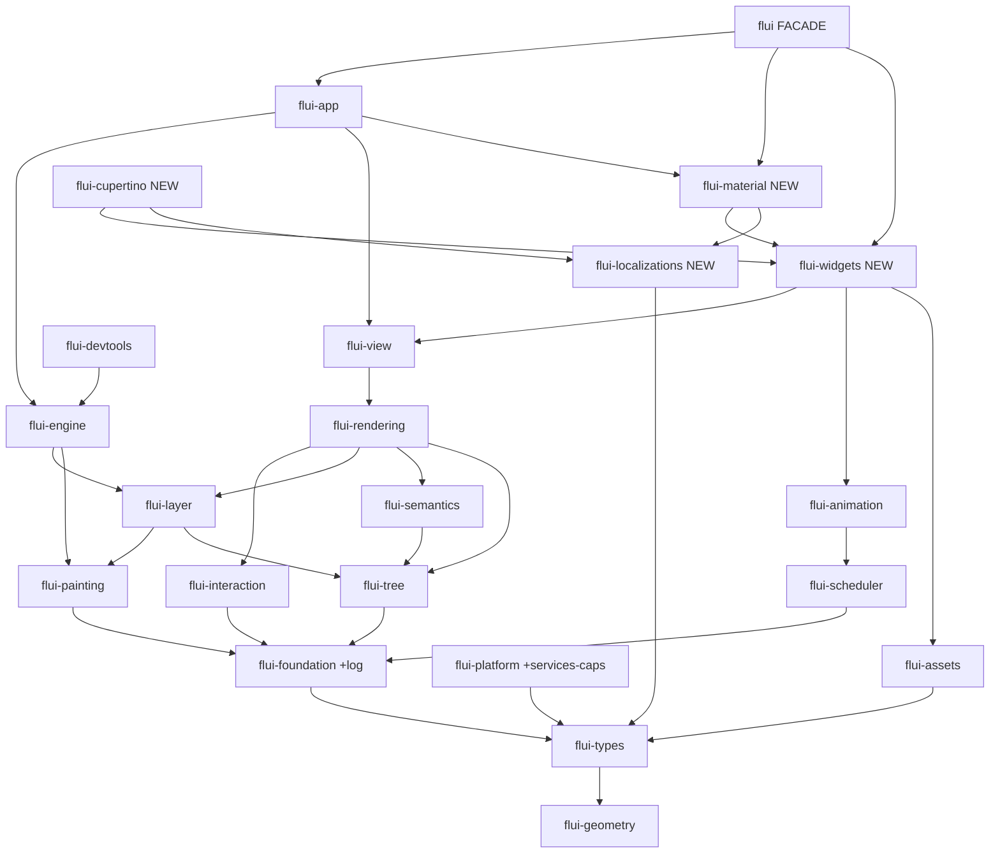

[STRATEGY](../STRATEGY.md) · [Port Methodology](PORT.md) · [Roadmap →](ROADMAP.md) · [Back to README](../README.md)

# FLUI Architecture Foundations

> The architecture contract for the Flutter → Rust port. It defines the **target** — the complete FLUI product — and the rules that target is built to. It is written **forward**: the benchmark is released Flutter; the goal is the finished framework; the current `~236k`-LOC codebase is a head start measured *against* that target, never the other way around.

This document is the bedrock under [`ROADMAP.md`](ROADMAP.md). The roadmap sequences construction; this document says *what is being constructed and to what rules*. It is the "right contract" — the set of decisions that, if settled wrong, force a catalog-wide rewrite later.

---

## How to read this document

- **Benchmark / specification — released Flutter.** `.flutter/flutter-master/packages/flutter/lib/src/` is a shipped, mature product (~480k LOC of framework logic across 12 packages). It defines *done* and it defines *correct behavior*. FLUI is measured against it.
- **Target — the complete FLUI.** Flutter behavior parity, Rust-native structure, and **better than Flutter wherever Rust permits at no behavior cost**.
- **Current code — a flawed head start.** The existing 21 crates are an inventory, not an anchor. Where the current code matches the target it is kept (a genuine head start — the render *machine* is gold-standard); where it does not, that is an unbuilt or wrong delta of **low narrative weight**, closed as normal construction reaches it. The current code does not anchor the target architecture — the target does. Where current-code defect *patterns* inform the standing quality discipline of Part VI, that is deliberate and forward-looking: a rule that refuses an observed mistake protects the finished product.
- **The three port rules** (from [`STRATEGY.md`](../STRATEGY.md)): *behavior loyal* (algorithms 1:1 from `.flutter/`), *structure Rust-native*, *sync hot path, async at the edges*. This document adds a fourth: **better-than-Flutter where Rust permits** — type-safety, determinism, ergonomics — never at the cost of behavior parity.

**Backing research** (read for the per-decision depth this document synthesizes):

| Document | What it establishes |
|---|---|
| [`research/2026-05-22-flutter-flui-gap-matrix.md`](research/2026-05-22-flutter-flui-gap-matrix.md) | Flutter↔FLUI coverage across all 12 packages |
| [`research/2026-05-22-port-phasing-dependency-order.md`](research/2026-05-22-port-phasing-dependency-order.md) | Dependency graph, critical path, phase order |
| [`research/2026-05-22-architectural-contracts.md`](research/2026-05-22-architectural-contracts.md) | The high-stakes public-surface contracts |
| [`research/2026-05-22-rust-ui-ecosystem-lessons.md`](research/2026-05-22-rust-ui-ecosystem-lessons.md) | Lessons from GPUI / Xilem / Druid / Iced / Vello |
| [`research/2026-05-22-technology-adoption-matrix.md`](research/2026-05-22-technology-adoption-matrix.md) | Per-subsystem behavior/structure adoption decisions |
| [`research/2026-05-22-architecture-correction-plan.md`](research/2026-05-22-architecture-correction-plan.md) | The systemic-defect inventory + 6 new refusal triggers |
| [`research/2026-05-22-crate-decomposition-redesign.md`](research/2026-05-22-crate-decomposition-redesign.md) | The target workspace topology |

**Grounding.** Architecture decisions in this document are graded against *A Philosophy of Software Design* (Ousterhout) — deep vs shallow modules, information hiding, "different layer, different abstraction" — the canonical Rust corpus named in [`CLAUDE.md`](../CLAUDE.md) (*Programming Rust*, *Rust for Rustaceans*, *Rust Atomics and Locks*, *The Rust Performance Book*), and the Rust API Guidelines. [`STRATEGY.md`](../STRATEGY.md) is the product-philosophy anchor: FLUI's product is developer experience, and the success metric is whether an external contributor finds the mental model legible from outside.

---

## Part I — The target architecture

FLUI is the Flutter three-tree: immutable **View** configuration → mutable **Element** lifecycle → layout/paint **Render** objects, with a **Layer** compositing tree and a **Semantics** accessibility tree. This shape is not FLUI's idiosyncrasy — it is the validated answer. Linebender's Xilem, the most serious attempt to solve retained reactive UI in Rust, converged independently on the same split (a retained Masonry widget layer beneath a transient reactive view layer). The architecture is correct; the discipline is to *hold it* against simplification proposals (GPUI's drop-the-tree-per-frame model is productive for a code editor and inadequate for a full toolkit — accessibility, IME, and layout caching all require stable node identity across frames).

Every subsystem has two axes. **Behavior** is always Flutter — the constraint, not a decision. **Structure** is a decision: the Rust shape may come from Flutter, GPUI, Xilem/Masonry, Vello, or be Rust-native original. The target structure per subsystem:

| Subsystem | Behavior source (`.flutter/`) | Structure source | Target shape |
|---|---|---|---|
| Three trees & ownership | `widgets/framework.dart`, `rendering/object.dart` | Flutter + Masonry | `Slab` arenas, `NonZeroUsize` IDs, library-owns-nodes |
| Reconciliation | `framework.dart` `updateChildren` | Xilem `rebuild` + Flutter keyed algo | Typed `rebuild`, keyed O(N) linear, `key` on every node |
| Layout protocol | `rendering/box.dart` | Flutter + FLUI arity type-state | Constraints down / sizes up, `RenderBox<A: Arity>` |
| Paint & display list | `rendering/object.dart`, `dart:ui` | Flutter / Skia / Vello record-replay | `Canvas` → `DisplayList` of `DrawCommand`, GPU-free |
| Layer / compositor tree | `rendering/layer.dart` | Flutter retained-layer lifecycle | Layer tree + `LayerHandle` RAII + dirty bit + retained `engine_layer` |
| GPU engine / tessellation | n/a (Flutter's C++ engine) | lyon now → Vello-hybrid later | `RasterBackend` trait seam; lyon impl now |
| Text / shaping / IME | `painting/text_painter.dart`, `services/text_input.dart` | Rust-native (cosmic-text) + GPUI for IME | cosmic-text/glyphon; `PlatformTextInput` capability trait |
| Scheduler & frame loop | `scheduler/binding.dart`, `ticker.dart` | Flutter phases + winit `ControlFlow::Wait` | Phase model, on-demand wakeup |
| Gestures / hit-testing | `gestures/*` | Flutter 1:1 | Arena + recognizer FSMs, `ui-events` vocabulary |
| Animation | `animation/*` | Flutter on FLUI `Listenable` | `AnimationController`/`Curve`/`Tween`, lock-free dirty-mark |
| Reactivity / state | `framework.dart` `setState`, `InheritedWidget` | Flutter `setState` + Xilem `memoize` | `setState` canonical; typed `can_update` + `Memo<V>`; signals out |
| `BuildContext` & inherited data | `framework.dart` `dependOnInheritedWidgetOfExactType` | Flutter semantics + GPUI lease | Object-safe trait, callback-form lookup, `TypeId` registry |
| Heterogeneous children | `framework.dart` `MultiChildRenderObjectWidget` | **Xilem `ViewSequence`** (deliberately *not* Flutter) | Tuple `ViewSeq` trait + `column!`/`row!` macros |
| Hot-reload | Flutter VM hot reload (not portable) | Makepad designed-in + Rust `cdylib` | Hot-*restart*; `State` owned by `Element` |
| Platform abstraction | `services/*` (dissolved) | GPUI platform traits | `Platform`/`PlatformWindow` traits, callback registry |
| Asset pipeline | `painting/image_provider.dart` | Flutter `ImageProvider` + Rust async IO | `ImageProvider` trait, async confined to `flui-assets` |

Four subsystems require FLUI's current code to **change direction** before the widget catalog leans on them — reconciliation, layer lifecycle, reactivity (additively), and heterogeneous children. Those changes are the locked contracts of [Part III](#part-iii--the-locked-contracts). The other twelve subsystems are structurally correct today and the discipline is to *hold the line*. The per-subsystem reasoning is in [`research/2026-05-22-technology-adoption-matrix.md`](research/2026-05-22-technology-adoption-matrix.md).

---

## Part II — Where FLUI is better than Flutter

A port is not a transliteration. Flutter's *behavior* is the specification; Flutter's *Dart structure* is an implementation detail of a garbage-collected language. Rust permits genuine improvements at the structure layer — and FLUI takes them, deliberately, where they cost nothing in behavior parity.

| # | Area | Flutter (Dart) | FLUI target (Rust) | Why it is better |
|---|---|---|---|---|
| 1 | **Child-count safety** | `RenderObjectWithChildMixin` vs `ContainerRenderObjectMixin`; a missing child is a runtime null/assert at paint | `Arity` sealed trait — `Leaf`/`Single`/`Optional`/`Variable` ZST markers; `RenderBox<A: Arity>` | An arity mismatch is a **compile error**, not a paint-time crash. Zero runtime cost (markers are zero-sized). *Programming Rust* — states encoded in types. |
| 2 | **Error model** | Dart exceptions; `FlutterError` | `Result<T, E>` + `thiserror`, `#[non_exhaustive]` error enums; `build()` stays infallible behind an internal `catch_unwind` error-view boundary | Errors are typed and exhaustive; the compiler forces handling. No `unwrap()`/`panic!` in library code (Constitution Principle 6). Ousterhout — "define errors out of existence." |
| 3 | **References & memory** | `Element? _parent`, GC-managed pointers | `NonZeroUsize` newtype IDs; `Option<ElementId>` is **8 bytes** via niche optimization; `Slab` arena, library-owns-nodes | 8 bytes saved on every optional tree link; the whole tree is iterable for an inspector or focus routing without walking the ownership chain. *The Rust Performance Book* — niche optimization; Masonry RFC. |
| 4 | **Subtree memoization** | Internal `const`-constructor + `Widget.canUpdate` short-circuit; not author-visible | Typed `View::can_update(&self, prev: &Self) -> bool` defaulting to `PartialEq`; a `Memo<V>` combinator | The `build()`-skip optimization is **first-class and composable**, not a framework-internal trick. Xilem's `memoize` lesson. |
| 5 | **Dispatch** | Open class hierarchies | Sealed traits (`Arity`, `PlatformBuilder`); enum dispatch over `dyn` by default | Exhaustive `match`; the closed set is enforced; `dyn` is the justified exception, not the default. *Rust for Rustaceans* — sealed traits. |
| 6 | **Resource lifecycle** | Manual `LayerHandle` ref-counting; GC for everything else | RAII — `Drop`; `LayerHandle<L>` releases the retained engine layer deterministically | Deterministic release is **more correct** than Dart's manual ref-counting and removes a whole class of leak. *Programming Rust* — RAII guards. |
| 7 | **Frame cadence** | Event-driven | `ControlFlow::Wait` — an idle UI burns zero CPU; render only when dirty | Battery and thermal headroom by construction; Constitution Principle 7. |
| 8 | **Developer surface** | One import: `package:flutter/material.dart` | A `flui` **facade crate** + `flui::prelude`; app authors depend on one crate, framework authors on the granular crates | A 24-crate workspace presents as a single dependency to an app author — the `STRATEGY.md` legibility metric, served. GPUI/`xilem` facade precedent. |
| 9 | **No GC** | GC pauses possible mid-frame | Sync render hot path, arena allocation, zero hot-path allocations after build | Predictable frame budget; no GC jank. *STRATEGY.md* — sync hot path. |

These are not "nice to have." Items 1, 2, and 4 are *contracts* — they are baked into the `View`/`RenderBox` trait surfaces and cannot be added later without a rewrite. They are settled in Part III.

---

## Part III — The locked contracts

These nine decisions are the "right contract." Each is committed by the **first widget written**; changing one after the catalog exists is a catalog-wide rewrite, not a refactor. They must be locked before [ROADMAP Core.1 — Vertical slice](ROADMAP.md#core1--vertical-slice-core--business-integration--was-phase-1).

### C1 — Reactivity: `setState` canonical, signals out, `memoize` added

Flutter's `setState` + `InheritedWidget` + depth-ordered dirty-element list is the **sole** canonical state model. The catalog crates — `flui-widgets`, `flui-material`, `flui-cupertino` — never take a dependency on `flui-reactivity` (signals). `STRATEGY.md` mandates this explicitly ("реинвент … откатывается к Flutter-семантике"); the ecosystem research confirms it (Xilem converged away from signals; Druid died of the `Data: Clone + PartialEq` constraint-creep). **The one addition:** Xilem's `memoize`, surfaced as the typed `View::can_update` of Part II item 4 plus a `Memo<V>` combinator — Flutter's own internal short-circuit, made first-class. Application state carries **no trait bound beyond `'static`** — the Druid mistake is the one most dangerous trap; do not repeat it. Signals are not banned outright: an *application-author* signal crate that drives `Element::mark_needs_build` from outside the catalog is a permitted post-parity opt-in, gated by a refusal trigger barring signal subscriptions from `build`/`layout`/`paint`. What is locked is the catalog's independence from signals — not a blanket language prohibition.

### C2 — Heterogeneous children: a `ViewSeq` trait with two load-bearing paths

`Column { children: [Text(…), Button(…), Image(…)] }` — mixed child types — is the spine of every real UI. Dart gets it free (`List<Widget>`); Rust cannot (`Vec<T>` is homogeneous). **This is the one subsystem where FLUI deliberately does not copy Flutter's structure.** The target is Xilem's `ViewSequence` — a `ViewSeq` trait the design must build along **two equally load-bearing paths**:

- **Static heterogeneous** — tuples `(A, B, C)` implement `ViewSeq` via a macro for arities `0..=16`; `column! { … }` / `row! { … }` macros give the literal call site. Each child keeps its concrete type to the `Slab` boundary and the reconciler is monomorphic per position. This serves hand-written `Column`/`Row`/`Stack`.
- **Dynamic** (child count not statically known) — `Vec<BoxedView>`. This is **not a rare fallback**: it is the primary path for the entire scrolling and data-display half of the catalog — `ListView`, `GridView`, `CustomScrollView`, `DataTable`, every `Vec`/iterator-driven widget, much of Material. It pays the `dyn` erasure cost and uses the non-monomorphic reconciler path.

The C2 design document must specify **both** paths to equal depth — most real lists are dynamic, so the dynamic path's reconciliation, keyed-reorder behavior, and erasure cost are as catalog-critical as the tuple path's ergonomics. This contract decides whether the catalog reads as well as the Flutter it ports; it needs its own design document before any widget code.

### C3 — Widget-authoring API: `impl IntoView`, derive, `bon`

`View::build()` returns `impl IntoView`, never `Box<dyn View>` (the trait `IntoView` exists — verified at `crates/flui-view/src/view/into_view.rs`; the change is half-applied — doc-comments were updated to show `impl IntoView` but the signatures still return `Box<dyn View>`, verified at `crates/flui-view/src/view/stateful.rs:116`). A `#[derive(StatelessView)]` (or a coherent blanket impl) removes the hand-written `impl View` boilerplate. Many-field widget constructors use `bon` builders (the workspace's stated builder dependency, currently unused). This is the single most-touched public surface in the framework — it is the adoption metric. It needs its own design document.

### C4 — `View` trait & element storage

The `View` trait stays object-safe (the children machinery needs it) with **no lifetime parameter** on the public surface. Element storage moves from `Box<dyn ElementBase>` toward a **closed `enum ElementNode`** over the finite element-behavior set (Stateless/Stateful/Proxy/Inherited/Render/Animation) — so reconciliation `match`es instead of vtable-dispatching, and the runtime `downcast_ref::<V>()` in the update path becomes a typed match arm. `Downcast`/`DynClone` leave the public bound surface where possible. Co-designed with C6.

### C5 — `BuildContext`: callback-form, no lifetime, single-threaded

`BuildContext` is an object-safe trait threaded into `build()` as `&dyn BuildContext`, with **no lifetime parameter** (widget code stays clean; matches Flutter's "context is a handle" feel). Inherited-data lookup is the **callback form** — `depend_on::<T, R>(|t| …) -> Option<R>` — which threads the borrow safely instead of leaking a lifetime into every `build()` signature. `InheritedView` resolution uses the `TypeId` registry — the single sanctioned runtime-reflection window. `Send + Sync` is dropped from `BuildContext` (build is single-threaded). Internally the endgame is the GPUI lease pattern (`BuildPhase` owns `&mut ElementTree` exclusively, no runtime lock); the public trait surface is locked now so that endgame is non-breaking.

### C6 — Reconciliation: keyed

Variable-arity child reconciliation is the keyed O(N) linear algorithm (match-from-top, match-from-bottom, keyed-`HashMap` middle, inflate the rest) — Flutter's exact algorithm, which already exists in the codebase, tested, with zero production callers. Every `ElementNode` carries `key: Option<Key>`, set at insert from `View::key()`. The positional index-match path is deleted. Without this, every list/grid/table silently loses widget state on reorder. Co-designed with C2 (a tuple `ViewSeq` spine makes the contiguous fast-path monomorphic) and C4.

### C7 — Error model: `build()` infallible, `Result` everywhere else

Library crates use `Result<T, E>` + per-crate `#[non_exhaustive]` `thiserror` enums; `anyhow` only at application/binary edges. **`View::build()` is infallible** — forcing `Result` on the most-written method taxes every widget and breaks Flutter-parity feel. A failed widget is contained by an internal `std::panic::catch_unwind` boundary around the build that substitutes an `ErrorView` — the tree survives, exactly as Flutter's error-widget behavior. A deliberate framework-level panic boundary is the standard Rust pattern here and is *not* the sloppy `unwrap()` Constitution Principle 6 forbids.

### C8 — Async edges: the render path is strictly synchronous

`async fn` is forbidden on `build`/`layout`/`paint`/`perform_layout`/`composite` (PORT.md refusal trigger 3). Async lives only at three named edges — IO (`flui-assets`), the scheduler (`flui-scheduler`), the build pipeline (`flui-build`). Async may *deliver work to* a frame (an asset finishes loading → mark dirty → next frame uses it); it may never run *inside* one.

### C9 — The type-erasure boundary

Concrete types are preserved from `View::build()`'s return value down to the `Slab` node. `dyn` erasure happens at exactly **two** sanctioned points and nowhere else: (1) **element storage** — the `Slab<ElementNode>`, ideally the closed enum of C4; (2) the **dynamic-children fallback** — `Vec<BoxedView>`, opt-in per C2. The platform backend (`Box<dyn PlatformWindow>`) is the one further justified `dyn` — selected once at startup, genuinely open, off the hot path. Everywhere else is concrete and monomorphic.

**Three of these need a dedicated `/speckit.plan` design document before any widget code is written:** C2 (heterogeneous children), C3 (widget-authoring API), and the C4+C6 pair (the `View`/element-storage/reconciliation core — one system, the same files). The remaining contracts are settled by this document and either lock an already-correct design (C5, C8) or are ratified here directly (C1, C7, C9).

---

## Part IV — The target crate decomposition

The workspace is healthier than its 21-crate count suggests: **19 of 21 crates are deep modules** (substantial complexity behind a small interface — Ousterhout's keep criterion). One earlier concern is already closed: `flui-tree`'s speculative `visitor`/`diff`/`cursor` surface (~10k LOC of zero-consumer scaffolding) was deleted in Cycle 3 — the crate is now lean, and its surviving unified `TreeRead`/`TreeNav`/`TreeWrite` trait trio is consumed by every production tree. The decomposition needs **two structural changes and one documentation fix**, not a churn.

**Changes from the current workspace:**

- **Split `flui-types`.** At 36k LOC it spans two unrelated domains. Extract **`flui-geometry`** (L0, ~19k LOC — the entire `geometry/` family: typed units, `Point`/`Rect`/`Matrix4`, Bézier, superellipse). The remainder stays `flui-types` (~17k — styling, painting-values, layout enums, typography, gestures, physics, platform). This localizes the compile-time blast radius and isolates a matrix-SIMD `unsafe` block currently in violation of Constitution Principle III.
- **Merge `flui-log` into `flui-foundation`.** A 983-LOC `tracing` wrapper whose interface ≈ its implementation — a shallow crate. Its one real asset (per-platform log sinks) survives as `flui_foundation::log`. Removes ~20 dependency edges.
- **Formalize the `flui` facade.** The root `flui` crate already exists (its `lib.rs` is currently parked as `src/lib.rs.disabled`) wired to eight crates — it predates the widget layer. Re-enable and re-scope it: narrow to the *public* surface, add `flui-widgets`/`flui-material`/`flui-cupertino` re-exports (feature-flagged) and a `flui::prelude` as those crates land. App authors depend on `flui`; framework authors depend on the granular crates.

**Four new crates** are created over the roadmap: `flui-widgets` (the user-facing catalog), `flui-material`, `flui-cupertino`, `flui-localizations` (shared l10n — a common ancestor the two design-system siblings both need). **No `flui-physics`** — Flutter's `physics` package is already ported into `flui-types/src/physics/`; this overrides the port-phasing research's proposal of a separate crate (~1k LOC of simulation math folded into `flui-types` is the correct shape — a standalone crate would be shallow). **No `flui-services`** — Flutter's `services` is deliberately dissolved; its residue (IME/text-input, system chrome, haptics) becomes capability traits on `flui-platform` (`PlatformTextInput`, `PlatformSystemChrome`, `PlatformHaptics`).

**Target — 24 library crates + 1 `flui` facade = 25 publishable units** (`flui-reactivity` is one of the 24, kept dormant and off the catalog dependency graph):

| Layer | Crates |
|---|---|
| L0 — Foundation | **`flui-geometry`** (new), `flui-types`, `flui-reactivity` (dormant) |
| L1 — Framework primitives | `flui-foundation` (absorbs `flui-log`) |
| L2 — Substrate | `flui-tree`, `flui-platform`, `flui-scheduler`, `flui-painting`, `flui-interaction`, `flui-assets` |
| L3 — Compositing / a11y / animation | `flui-semantics`, `flui-layer`, `flui-animation` |
| L4 — Render machine | `flui-engine`, `flui-rendering` |
| L5 — Framework spine + inspector | `flui-view`, `flui-devtools` |
| L6 — Catalog + DX tooling | **`flui-widgets`** (new), **`flui-localizations`** (new), `flui-hot-reload`, `flui-cli`, `flui-build` |
| L7 — Design systems | **`flui-material`** (new), **`flui-cupertino`** (new) |
| L8 — Application | `flui-app` |
| Facade | **`flui`** (formalized) |

The DAG is acyclic and downward-correct. The Constitution **v2.3.0** layer table reflects the pre-PR-C-2 layering snapshot (geometry was in `flui-types`; since [PR #138](https://github.com/vanyastaff/flui/pull/138) it lives in the dedicated `flui-geometry` crate and is re-exported via `flui_types::geometry::*` for compatibility — edition 2024 / Rust 1.95, accurate workspace member list otherwise); the **target graph above** is the forward-looking Part IV decomposition that Part V's roadmap migrates the workspace toward. The constitution remains "current state, locked"; this document is "target state, in progress." Full reasoning and the ordered migration delta: [`research/2026-05-22-crate-decomposition-redesign.md`](research/2026-05-22-crate-decomposition-redesign.md).

---

## Part V — Current code versus the target

This section is deliberately short. The current code's unfinished and wrong parts carry **low narrative weight** — they are deltas to the target, closed as construction reaches them, not a foundation to build the plan around.

**What matches the target — the head start.** The render *machine* is gold-standard Rust and every audit independently says do not touch it: the typestate `PipelineOwner` pipeline, lock-free `AtomicRenderFlags`, the arity system, `Slab` + `NonZeroUsize` ID-offset storage, the bounded crossbeam channel. Twelve of the sixteen subsystems in Part I are structurally correct today. `flui-interaction` (gestures, ~95% ported) and `flui-scheduler` are near-complete. This is real, kept progress — an estimated **22% of Flutter's framework logic** (a coverage-weighted estimate of what is built and working, not a raw line-count ratio).

**What does not match the target — the gap.** Read across fourteen prior audits, the current defects are not a random scatter; they cluster into **eight systemic patterns** — a repeated mistake class, which Ousterhout diagnoses as a missing *rule*: stubbed-but-called methods, written-but-uncalled "correct" implementations, parallel cross-crate types, speculative scaffolding, absent lifecycle protocols, lock misplacement, pass-through indirection, constructor panics. The **gating** subset — the deltas that make the spine not-yet-finished-to-spec — is small and well-understood:

| Delta | What is not yet at target spec |
|---|---|
| Layout phase | The layout walk never invokes per-node `layout()` — constraints are not propagated in production |
| Reconciliation | The positional index-match path is live; the correct keyed reconciler exists with zero callers (contract C6) |
| Compositing | `run_compositing` is a no-op |
| Paint | `run_paint` clears the dirty flag on nodes it never paints |
| Contracts | C2 / C3 / C4+C6 are not yet locked with design docs |

These are not a "repair project." They are the first stretch of normal construction — bringing the spine to its target specification — and [ROADMAP Core.0 — Spine to target spec](ROADMAP.md#core0--spine-to-target-spec--was-phase-0) closes them. The full inventory, prioritized, with the per-defect blast radius, is [`research/2026-05-22-architecture-correction-plan.md`](research/2026-05-22-architecture-correction-plan.md).

---

## Part VI — The standing quality discipline

The eight systemic patterns above are closed *durably* by turning each detectable pattern into a **refusal trigger** — a rule [`PORT.md`](PORT.md) refuses to let regrow, enforced by `scripts/port-check.sh`. This is the difference between "we fixed the defects" (a snapshot that decays as 480k LOC of catalog is written) and "the defects cannot recur."

PORT.md carries **7 refusal triggers** today. The foundations add **6** (full text and detection regexes in the architecture-correction research doc):

| # | Refuses |
|---|---|
| 8 | A production-reachable `fn` whose body is empty / a lone `tracing::warn!` / `unimplemented!` while its name asserts an effect |
| 9 | Two functions or types implementing the same responsibility, one with zero production callers |
| 10 | A public type/trait name defined in two `flui-*` crates without one re-exporting the other |
| 11 | A `pub` module/trait family with zero production consumers, not behind an `unstable-*` feature gate |
| 12 | `RwLock`/`Mutex` appearing in a `pub fn` return type or public field type |
| 13 | `unwrap`/`expect`/`panic!`/`unimplemented!`/`assert!` reachable from a `pub fn` on its arguments, in a library crate |

Two patterns (absent lifecycle protocols; pass-through hierarchies) are not mechanically detectable and become **construction rules** in PORT.md: every resource-owning type implements the lifecycle protocol (`dispose` + disposed-assert + a dirty bit for frame-loop types); Flutter abstract-class chains port to behavior-carrying Rust shapes, never to mirror trait hierarchies.

The **Mythos methodology** (audit → design → plan → atomic-commit waves, `port-check.sh` on every PR) is not a temporary remediation effort — after it finishes hardening the existing crates it becomes the *standing discipline* embedded in every roadmap phase's exit gate. Every render object, every widget, every Material component is built to this bar.

---

## Governance

This document is the **architecture contract** for the port. Its relationship to the other governing documents:

- [`STRATEGY.md`](../STRATEGY.md) — *why* (target problem, the three port rules, product philosophy). Upstream of this document.
- **`FOUNDATIONS.md`** (this document) — *what* (the target architecture, the locked contracts, the crate graph).
- [`PORT.md`](PORT.md) — *how* (the port methodology, refusal triggers, mapping rules).
- [`ROADMAP.md`](ROADMAP.md) — *when / in what order* (the dependency-ordered construction phases).
- [`.specify/memory/constitution.md`](../.specify/memory/constitution.md) — the ratified rules. **It requires amendment** (MINOR bump): the layer table must be replaced with Part IV's, and the edition/Rust-version line corrected to 2024 / 1.95.

**Amendment.** A change to a locked contract (Part III) or the target crate graph (Part IV) requires: documented rationale, a corresponding `STRATEGY.md`/`PORT.md`/constitution sync if affected, and — once construction has begun — an explicit migration assessment, because a contract change after Phase 1 has catalog-wide blast radius. The contracts are locked precisely so that they are *not* casually amended.

---

[STRATEGY](../STRATEGY.md) · [Port Methodology](PORT.md) · [Roadmap →](ROADMAP.md) · [Back to README](../README.md)
