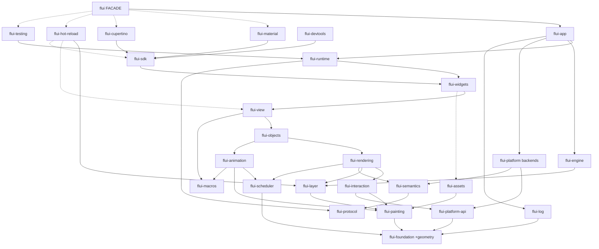

[Roadmap →](ROADMAP.md) · [Back to README](../README.md)

# FLUI Architecture Foundations

> The architecture contract for FLUI, a declarative UI framework for Rust that takes Flutter as its reference, not as a spec to port. It defines the **target** — the complete FLUI product — and the rules that target is built to. It is written **forward**: the benchmark is released Flutter; the goal is the finished framework; the current codebase is a head start measured *against* that target, never the other way around.

This document is the bedrock under [`ROADMAP.md`](ROADMAP.md). The roadmap sequences construction; this document says *what is being constructed and to what rules*. It is the "right contract" — the set of decisions that, if settled wrong, force a catalog-wide rewrite later.

---

## How to read this document

- **Benchmark / floor — released Flutter.** `.flutter/flutter-master/packages/flutter/lib/src/` is a shipped, mature product (framework logic across 12 packages) with a test corpus to match. It defines the *minimum* observable behavior and the cheapest oracle for it; it does not define the ceiling, the architecture, or the idiom. FLUI is measured as *at least* this, and expected to be more.
- **Target — the complete FLUI.** Flutter's behavior as the floor, Rust-native structure, and **better than Flutter wherever a better solution is known** — in functionality, architecture, and code style — with each improvement pinned by a FLUI test.
- **Current code — a flawed head start.** The existing crates are an inventory, not an anchor. Where the current code matches the target it is kept (a genuine head start — the render *machine* is gold-standard); where it does not, that is an unbuilt or wrong delta of **low narrative weight**, closed as normal construction reaches it. The current code does not anchor the target architecture — the target does. Where current-code defect *patterns* inform the standing quality discipline of Part VI, that is deliberate and forward-looking: a rule that refuses an observed mistake protects the finished product.
- **The three architectural rules**: *behavior as floor, everything else designed for Rust* (observable contracts from `.flutter/` are the minimum, improved wherever a better solution is known and the improvement pinned by a test), *compile-time over runtime*, *sync hot path, async at the edges*. What "better" may never cost is an edge case lost by accident: a Flutter behavior is dropped only by decision, with its test replaced.

**Backing research** (read for the per-decision depth this document synthesizes):

| Document | What it establishes |
|---|---|
| [`research/2026-05-22-flutter-flui-gap-matrix.md`](https://github.com/vanyastaff/flui/blob/e30ab7194d50ac1c11ffe17c59230958d2fbeecd/docs/research/2026-05-22-flutter-flui-gap-matrix.md) | Flutter↔FLUI coverage across all 12 packages |
| [`research/2026-05-22-port-phasing-dependency-order.md`](https://github.com/vanyastaff/flui/blob/e30ab7194d50ac1c11ffe17c59230958d2fbeecd/docs/research/2026-05-22-port-phasing-dependency-order.md) | Dependency graph, critical path, phase order |
| [`research/2026-05-22-architectural-contracts.md`](https://github.com/vanyastaff/flui/blob/e30ab7194d50ac1c11ffe17c59230958d2fbeecd/docs/research/2026-05-22-architectural-contracts.md) | The high-stakes public-surface contracts |
| [`research/2026-05-22-rust-ui-ecosystem-lessons.md`](https://github.com/vanyastaff/flui/blob/e30ab7194d50ac1c11ffe17c59230958d2fbeecd/docs/research/2026-05-22-rust-ui-ecosystem-lessons.md) | Lessons from GPUI / Xilem / Druid / Iced / Vello |
| [`research/2026-05-22-technology-adoption-matrix.md`](https://github.com/vanyastaff/flui/blob/e30ab7194d50ac1c11ffe17c59230958d2fbeecd/docs/research/2026-05-22-technology-adoption-matrix.md) | Per-subsystem behavior/structure adoption decisions |
| [`research/2026-05-22-architecture-correction-plan.md`](https://github.com/vanyastaff/flui/blob/e30ab7194d50ac1c11ffe17c59230958d2fbeecd/docs/research/2026-05-22-architecture-correction-plan.md) | The systemic-defect inventory |
| [`research/2026-05-22-crate-decomposition-redesign.md`](https://github.com/vanyastaff/flui/blob/e30ab7194d50ac1c11ffe17c59230958d2fbeecd/docs/research/2026-05-22-crate-decomposition-redesign.md) | The target workspace topology |
| [`research/2026-08-01-ui-runtime-evolution-study.md`](https://github.com/vanyastaff/flui/blob/e30ab7194d50ac1c11ffe17c59230958d2fbeecd/docs/research/2026-08-01-ui-runtime-evolution-study.md) | Cross-framework runtime, multi-window, concurrency, embedding, and frame-pacing evidence |
| [`research/2026-08-01-runtime-architecture-execution-plan.md`](research/2026-08-01-runtime-architecture-execution-plan.md) | Dependency-ordered completion plan for ADR-0027/0037 and hostable runtime foundations |

**Grounding.** Architecture decisions in this document are graded against *A Philosophy of Software Design* (Ousterhout): deep vs shallow modules, information hiding, "different layer, different abstraction". The other anchors are the canonical Rust corpus (*Programming Rust*, *Rust for Rustaceans*, *Rust Atomics and Locks*, *The Rust Performance Book*) and the Rust API Guidelines. FLUI's product is developer experience: the success metric is whether an external contributor finds the mental model legible from outside.

---

## Part I — The target architecture

FLUI keeps Flutter's tree architecture — five trees: immutable **View** configuration → mutable **Element** lifecycle → layout/paint **Render** objects → a **Layer** compositing tree, with a **Semantics** accessibility tree alongside. This shape is not FLUI's idiosyncrasy — it is the validated answer. Linebender's Xilem, the most serious attempt to solve retained reactive UI in Rust, converged independently on the same split (a retained Masonry widget layer beneath a transient reactive view layer). The architecture is correct; the discipline is to *hold it* against simplification proposals (GPUI's drop-the-tree-per-frame model is productive for a code editor and inadequate for a full toolkit — accessibility, IME, and layout caching all require stable node identity across frames).

Every subsystem has two axes. **Behavior** is always Flutter — the constraint, not a decision. **Structure** is a decision: the Rust shape may come from Flutter, GPUI, Xilem/Masonry, Vello, or be Rust-native original. The target structure per subsystem:

| Subsystem | Behavior source (`.flutter/`) | Structure source | Target shape |
|---|---|---|---|
| Three trees & ownership | `widgets/framework.dart`, `rendering/object.dart` | Flutter + Masonry | `Slab` arenas, niche-optimized IDs (plain slab-backed ids are the slot plus one; element and render-object keys are generational, built from the 0-based slot with `new_gen`), library-owns-nodes |
| Reconciliation | `framework.dart` `updateChildren` | Xilem `rebuild` + Flutter keyed algo | Typed `rebuild`, keyed O(N) linear, `key` on every node |
| Layout protocol | `rendering/box.dart` | Flutter + FLUI arity type-state | Constraints down / sizes up, `RenderBox` with an associated `type Arity` |
| Paint & display list | `rendering/object.dart`, `dart:ui` | Flutter / Skia / Vello record-replay | `Canvas` → `DisplayList` of `DrawCommand`, GPU-free |
| Layer / compositor tree | `rendering/layer.dart` | Flutter layer tree, not its retained engine layers | Append-only `LayerTree` built per frame; cross-frame reuse and damage keyed on repaint boundaries ([ADR-0087](adr/ADR-0087-raster-contract-and-cpu-backend.md), `crates/flui-layer/ARCHITECTURE.md`) |
| GPU engine / tessellation | n/a (Flutter's C++ engine) | lyon now → Vello-hybrid later | `RasterBackend` trait seam; lyon impl now |
| Text / shaping / IME | `painting/text_painter.dart`, `services/text_input.dart` | Rust-native (cosmic-text, moving to Parley per [ADR-0092](adr/ADR-0092-per-realm-text-over-parley.md)) + GPUI for IME | cosmic-text in `flui-painting` by default; its `parley-layout` feature measures `TextPainter` with Parley over a per-realm `TextContext` while glyphs and carets stay on cosmic-text (`parley` alone only compiles the Parley path); engine glyph atlas; `PlatformTextInput` capability trait |
| Scheduler & frame loop | `scheduler/binding.dart`, `ticker.dart` | Flutter phases + winit `ControlFlow::Wait` | Phase model, on-demand wakeup |
| Gestures / hit-testing | `gestures/*` | Flutter 1:1 | Arena + recognizer FSMs, `ui-events` vocabulary |
| Animation | `animation/*` | Flutter on FLUI `Listenable` | `AnimationController`/`Curve`/`Tween`, lock-free dirty-mark |
| Reactivity / state | `framework.dart` `setState`, `InheritedWidget` | Flutter `setState` + Xilem `memoize` + realm-scoped signals (ADR-0074) | `setState` canonical mechanism; typed `can_update` + `Memo<V>`; signals read in `build`, written outside it |
| `BuildContext` & inherited data | `framework.dart` `dependOnInheritedWidgetOfExactType` | Flutter semantics + GPUI lease | Object-safe trait, callback-form lookup, `TypeId` registry |
| Heterogeneous children | `framework.dart` `MultiChildRenderObjectWidget` | **Xilem `ViewSequence`** (deliberately *not* Flutter) | Tuple `ViewSeq` trait + `column!`/`row!` macros |
| Hot-reload | Flutter VM hot reload (not portable) | Makepad designed-in + Rust `cdylib` | Hot-*restart*; `State` owned by `Element` |
| Platform abstraction | `services/*` (dissolved) | GPUI platform traits | `Platform` trait (`flui-platform`), `PlatformWindow` and capability traits (`flui-platform-api`), callback registry |
| Asset pipeline | `painting/image_provider.dart` | Flutter `ImageProvider` + Rust async IO | `ImageProvider` trait, async confined to `flui-assets` |

Four subsystems needed FLUI's code to **change direction** before the widget catalog leaned on them — reconciliation, layer lifecycle, reactivity (additively), and heterogeneous children; those changes are the locked contracts of [Part III](#part-iii--the-locked-contracts). For the rest the discipline is to *hold the line*. The per-subsystem reasoning is in [`research/2026-05-22-technology-adoption-matrix.md`](https://github.com/vanyastaff/flui/blob/e30ab7194d50ac1c11ffe17c59230958d2fbeecd/docs/research/2026-05-22-technology-adoption-matrix.md).

---

## Part II — Where FLUI is better than Flutter

FLUI is not a transliteration of Flutter. Flutter's *behavior* is the reference to start from; Flutter's *Dart structure* is an implementation detail of a garbage-collected language. Rust permits genuine improvements at both layers, and FLUI takes them wherever the result is better.

| # | Area | Flutter (Dart) | FLUI target (Rust) | Why it is better |
|---|---|---|---|---|
| 1 | **Child-count safety** | `RenderObjectWithChildMixin` vs `ContainerRenderObjectMixin`; a missing child is a runtime null/assert at paint | `Arity` sealed trait — `Leaf`/`Optional`/`Single`/`Exact<N>`/`AtLeast<N>`/`Range<MIN, MAX>`/`Variable` ZST markers; `RenderBox::Arity` types the layout context | The child count is part of the type, not a paint-time crash. Zero runtime cost (markers are zero-sized). *Programming Rust* — states encoded in types. |
| 2 | **Error model** | Dart exceptions; `FlutterError` | `Result<T, E>` + `thiserror`, `#[non_exhaustive]` error enums; `build()` stays infallible behind an internal `catch_unwind` error-view boundary | Errors are typed and exhaustive; the compiler forces handling. No bare `unwrap()` in library code (`clippy::unwrap_used`, [`PANIC-POLICY.md`](PANIC-POLICY.md)). Ousterhout — "define errors out of existence." |
| 3 | **References & memory** | `Element? _parent`, GC-managed pointers | Newtype IDs with a niche: plain slab-backed IDs are the slot plus one in a `NonZeroUsize`; element and render-object keys are generational, the 0-based slot and a non-zero generation packed in a `NonZeroU64`; `Option<ElementId>` is **8 bytes** via niche optimization; `Slab` arena, library-owns-nodes | 8 bytes saved on every optional tree link; the whole tree is iterable for an inspector or focus routing without walking the ownership chain. *The Rust Performance Book* — niche optimization; Masonry RFC. |
| 4 | **Subtree memoization** | Internal `const`-constructor + `Widget.canUpdate` short-circuit; not author-visible | `View::can_update` (type + key matchability gate) + `View::should_skip_rebuild` defaulting to `false` (always rebuild — Flutter parity); `PartialEq`-skip is opt-in via `Memo<V>` or a per-view override | The `build()`-skip optimization is **first-class and composable**, not a framework-internal trick. Default is always-rebuild (safe); `Memo<V>` is the opt-in. No blanket `PartialEq` bound on `View` (the Druid trap). Xilem's `memoize` lesson. |
| 5 | **Dispatch** | Open class hierarchies | Sealed traits (`Arity`); enum dispatch over `dyn` by default | Exhaustive `match`; the closed set is enforced; `dyn` is the justified exception, not the default. *Rust for Rustaceans* — sealed traits. |
| 6 | **Resource lifecycle** | Manual `LayerHandle` ref-counting; GC for everything else | RAII — `Drop`; the layer tree is rebuilt each frame and holds no ref-counted engine layers | Deterministic release is **more correct** than Dart's manual ref-counting and removes a whole class of leak. *Programming Rust* — RAII guards. |
| 7 | **Frame cadence** | Event-driven | `ControlFlow::Wait` — an idle UI burns zero CPU; render only when dirty | Battery and thermal headroom by construction. |
| 8 | **Developer surface** | One import: `package:flutter/material.dart` | A `flui` **facade crate** + `flui::prelude`; app authors depend on one crate, framework authors on the granular crates | A multi-crate workspace presents as a single dependency to an app author — the product legibility metric, served. GPUI/`xilem` facade precedent. |
| 9 | **No GC** | GC pauses possible mid-frame | Sync render hot path, arena allocation, zero hot-path allocations after build | Predictable frame budget; no GC jank. Sync hot path. |

These are not "nice to have." Items 1, 2, and 4 are *contracts* — they are baked into the `View`/`RenderBox` trait surfaces and cannot be added later without a rewrite. They are settled in Part III.

---

## Part III — The locked contracts

These nine decisions are the "right contract." Each is committed by the **first widget written**; changing one after the catalog exists is a catalog-wide rewrite, not a refactor. They were locked before the first vertical slice of the widget catalog was built; the historical roadmap is in [`archive/ROADMAP.md`](https://github.com/vanyastaff/flui/blob/e30ab7194d50ac1c11ffe17c59230958d2fbeecd/docs/archive/ROADMAP.md).

### C1 — Reactivity: `setState` canonical, `memoize` added, realm-scoped signals (amended by ADR-0074)

Flutter's `setState` + `InheritedWidget` + depth-ordered dirty-element list is the **sole** canonical state model. The catalog crates — `flui-widgets`, `flui-material`, `flui-cupertino` — never take a dependency on a signals crate. This is mandated explicitly: signals are not the *external* model, and the mechanisms beneath it are open to improvement; the ecosystem research confirms it (Xilem converged away from signals; Druid died of the `Data: Clone + PartialEq` constraint-creep). **The one addition:** Xilem's `memoize`, surfaced as the typed `View::can_update` of Part II item 4 plus a `Memo<V>` combinator — Flutter's own internal short-circuit, made first-class. Application state carries **no trait bound beyond `'static`** — the Druid mistake is the one most dangerous trap; do not repeat it. **Amended by [ADR-0074](adr/ADR-0074-realm-scoped-signals.md) (2026-09-22, beta-roadmap mandate that locked contracts are revisable explicitly):** a realm-owned reactive graph (`Signal<T>` and its reader registry) is a first-class application-state layer of the view crate; derived values and effects are ADR-0075's subject (Proposed) and not yet part of the contract. Reading a signal in `build` is the sanctioned subscription path — the same class of edge as `depend_on`, so reading needs no `LifecycleContext` capability; **writing** or **creating** a signal inside `build`/`layout`/`paint` is refused at run time (`SignalError::{WrittenDuringBuild, CreatedDuringBuild}`). The catalog crates may accept `Signal<T>` values as widget inputs but never own application state, and `setState`/`InheritedWidget`/the depth-ordered dirty list remain the mechanism a signal write feeds: the smallest sound invalidation unit stays the Element.

### C2 — Heterogeneous children: a `ViewSeq` trait with two load-bearing paths

`Column { children: [Text(…), Button(…), Image(…)] }` — mixed child types — is the spine of every real UI. Dart gets it free (`List<Widget>`); Rust cannot (`Vec<T>` is homogeneous). **This is the one subsystem where FLUI deliberately does not copy Flutter's structure.** The target is Xilem's `ViewSequence` — a `ViewSeq` trait the design must build along **two equally load-bearing paths**:

- **Static heterogeneous** — tuples `(A, B, C)` implement `ViewSeq` via a macro for arities `0..=16`; `column! { … }` / `row! { … }` macros give the literal call site. Each child keeps its concrete type to the `Slab` boundary and the reconciler is monomorphic per position. This serves hand-written `Column`/`Row`/`Stack`.
- **Dynamic** (child count not statically known) — `Vec<BoxedView>`. This is **not a rare fallback**: it is the primary path for the entire scrolling and data-display half of the catalog — `ListView`, `GridView`, `CustomScrollView`, `DataTable`, every `Vec`/iterator-driven widget, much of Material. It pays the `dyn` erasure cost and uses the non-monomorphic reconciler path.

The C2 design document must specify **both** paths to equal depth — most real lists are dynamic, so the dynamic path's reconciliation, keyed-reorder behavior, and erasure cost are as catalog-critical as the tuple path's ergonomics. This contract decides whether the catalog reads as well as the Flutter it ports; it needs its own design document before any widget code.

### C3 — Widget-authoring API: `impl IntoView`, derive, `bon`

`StatelessView::build()` and `ViewState::build()` return `impl IntoView`, never `Box<dyn View>`. `IntoView` is the authoring bridge; `View::create_element()` returns the closed `ElementKind` storage enum, and the derive macros emit that boilerplate for ordinary stateless/stateful views. Many-field widget constructors use `bon` builders where the field surface is large enough to justify them. This is the single most-touched public surface in the framework — it is the adoption metric.

### C4 — `View` trait & element storage

The `View` trait stays object-safe (the children machinery needs it) with **no lifetime parameter** on the public surface. Element storage is slab-backed `ElementNode` carrying the closed `ElementKind` enum over the finite element families (Stateless/Stateful/Proxy/Inherited/Notification/Render/Root/Error, with animation and parent-data folded into their host families). Reconciliation and lifecycle drive the `ElementBase` surface through this closed storage boundary; the runtime `downcast_ref::<V>()` update path is replaced by typed dispatch. Co-designed with C6.

### C5 — `BuildContext`: callback-form, no lifetime, single-threaded

`BuildContext` is an object-safe trait threaded into `build()` as `&dyn BuildContext`, with **no lifetime parameter** (widget code stays clean; matches Flutter's "context is a handle" feel). Inherited-data lookup is the **callback form** — `depend_on::<T, R>(|t| …) -> Option<R>` — which threads the borrow safely instead of leaking a lifetime into every `build()` signature. `InheritedView` resolution uses the `TypeId` registry — the single sanctioned runtime-reflection window. `Send + Sync` is dropped from `BuildContext` (build is single-threaded). Internally the endgame is the GPUI lease pattern (`BuildPhase` owns `&mut ElementTree` exclusively, no runtime lock); the public trait surface is locked now so that endgame is non-breaking.

### C6 — Reconciliation: keyed

Variable-arity child reconciliation is the keyed O(N) linear algorithm (match-from-top, match-from-bottom, keyed-`HashMap` middle, inflate the rest): `reconcile_children_by_id` (`crates/flui-view/src/tree/id_reconcile.rs`), which `BuildOwner` calls for every variable-arity child list (`rg -n reconcile_children_by_id crates/flui-view/src/owner` shows the call). A keyed child keeps its element, and its state, across a reorder; a keyless child matches only by position. Co-designed with C2 (a tuple `ViewSeq` spine makes the contiguous fast-path monomorphic) and C4.

### C7 — Error model: `build()` infallible, `Result` everywhere else

Library crates use `Result<T, E>` + per-crate `#[non_exhaustive]` `thiserror` enums; `anyhow` only at application/binary edges. **`View::build()` is infallible** — forcing `Result` on the most-written method taxes every widget and breaks Flutter-parity feel. A failed widget is contained by an internal `std::panic::catch_unwind` boundary around the build that substitutes an `ErrorView` — the tree survives, exactly as Flutter's error-widget behavior. A deliberate framework-level panic boundary is the standard Rust pattern here and is *not* the bare `unwrap()` that `clippy::unwrap_used` and [`PANIC-POLICY.md`](PANIC-POLICY.md) forbid.

### C8 — Async edges: the render path is strictly synchronous

`async fn` is forbidden on `build`/`layout`/`paint`/`perform_layout`/`composite`; the trait signatures are synchronous, so an `async` implementation does not compile. Async lives only at three named edges — IO (`flui-assets`), the scheduler (`flui-scheduler`), the build pipeline (`flui-cli`'s `build` module). Async may *deliver work to* a frame (an asset finishes loading → mark dirty → next frame uses it); it may never run *inside* one.

### C9 — The type-erasure boundary

Concrete types are preserved from `View::build()`'s return value down to the `Slab` node. `dyn` erasure happens at exactly **two** sanctioned points and nowhere else: (1) **element storage** — the `Slab<ElementNode>`, ideally the closed enum of C4; (2) the **dynamic-children fallback** — `Vec<BoxedView>`, opt-in per C2. The platform boundary is the one further justified `dyn`: the backend (`Box<dyn Platform>`) is selected once at startup, and each window it opens is an `Arc<dyn HostWindow>`, one per window; both are genuinely open and off the hot path. Everywhere else is concrete and monomorphic.

**Three of these needed a dedicated design document before any widget code was written:** C2 (heterogeneous children), C3 (widget-authoring API), and the C4+C6 pair (the `View`/element-storage/reconciliation core — one system, the same files). All three are implemented: `ViewSeq` with the `column!`/`row!` macros, `IntoView`, the closed `ElementKind` storage enum, and the keyed `reconcile_children_by_id`. The remaining contracts are settled by this document and either lock an already-correct design (C5, C8) or are ratified here directly (C1, C7, C9).

---

## Part IV — The target crate decomposition

The workspace is healthier than its crate count suggests: most crates are deep modules (substantial complexity behind a small interface — Ousterhout's keep criterion). Several earlier structural do-nows have already landed: there is no catch-all value-types crate — each value type lives with its owner, geometry as plain `f64` values in `flui_foundation::geometry` ([ADR-0098](adr/ADR-0098-owned-f64-geometry-values.md)) — `flui-objects` and `flui-widgets` exist, and `flui-animation` is active again. `flui-log` returned as a *composition-only* backend — not the shallow, universally depended-on wrapper that was deleted, but the one crate allowed to install a subscriber, restricted by `allowed-dependents` in its manifest to `flui-app`, `flui-cli`, and the facade. The remaining decomposition work is targeted, not churn.

**Settled decompositions:**

- **The `flui` facade** is the public surface: app authors depend on `flui` (with `material`/`cupertino` features naming the official packages), framework authors on the granular crates, and package authors on `flui-sdk` ([ADR-0088](adr/ADR-0088-official-packages-sdk-and-facade.md)).
- **The design systems are official packages.** `flui-material` and `flui-cupertino` live under `packages/` and build on `flui-sdk` alone, as a third-party package would.
- **No global-localizations crate.** `flui-localizations` was deleted by [ADR-0081](adr/ADR-0081-workspace-tiers-and-reach-facts.md): it held no translated strings, only the RTL table and its delegate, which now live in `flui_widgets::localization` beside the contract they implement. Translated catalogs, when they arrive, belong to the catalog that defines each contract.

**No `flui-physics`** — Flutter's `physics` package is already ported into `flui-animation`'s simulations, beside the controllers that drive them ([ADR-0098](adr/ADR-0098-owned-f64-geometry-values.md) §8); a standalone crate of simulation math would be shallow. **No `flui-services`** — Flutter's `services` is deliberately dissolved; its residue (IME/text-input, system chrome, haptics) becomes capability traits on `flui-platform-api` (`PlatformTextInput`, `PlatformHaptics`, and `PlatformSystemChrome` once it exists), implemented by the backends in `flui-platform` ([ADR-0082](adr/ADR-0082-platform-api-contract-crate.md)).

**The workspace by layer, with each crate's tier in brackets:**

> **This table is a rendering of the manifests, not the source of truth.** Each crate declares `[package.metadata.flui] layer`, `tier` and `order` (named in the root `[workspace.metadata.flui] layers` and `tiers`), and `cargo xtask workspace` validates every **normal** and build Cargo edge against them — [ADR-0041](adr/ADR-0041-workspace-topology-contract.md), [ADR-0081](adr/ADR-0081-workspace-tiers-and-reach-facts.md). If the two ever disagree, the manifests and Cargo are right and this table is stale.

| Layer | Crates |
|---|---|
| L0 — Foundation | — (value types live with their owners, ADR-0098) |
| L1 — Framework primitives | `flui-foundation` [V], `flui-macros` [V], `flui-platform-api` [C], `flui-protocol` [C] |
| L2 — Substrate | `flui-log` [S], `flui-scheduler` [S], `flui-painting` [S], `flui-interaction` [S], `flui-assets` [S] |
| L3 — Compositing / a11y / animation | `flui-layer` [R], `flui-semantics` [S], `flui-animation` [S], `flui-platform` [H] |
| L4 — Render machine + render catalog | `flui-rendering` [R], `flui-objects` [R], `flui-engine` [R] |
| L5 — Framework spine | `flui-view` [K] |
| L6 — Widget catalog + DX tooling | `flui-widgets` [K], `flui-runtime` [K], `flui-sdk` [K], `flui-testing` [K], `flui-hot-reload` [pkg] |
| L7 — Design systems | `flui-material` [pkg], `flui-cupertino` [pkg] |
| L8 — (empty) | — (`flui-localizations` deleted, ADR-0081) |
| L9 — Application / tooling | `flui-app` [H], `flui-cli` [H], `flui-devtools` [pkg] |
| L10 — Facade | **`flui`** [H] |

The graph below draws the normal dependency edges from the manifests, leaving out each crate's edge to `flui-foundation` (nearly every crate has one) and edges implied by a longer path. Dashed edges are optional dependencies.

```mermaid
graph TD
    foundation[flui-foundation +geometry]
    macros[flui-macros]
    protocol[flui-protocol]
    platformapi[flui-platform-api]
    log[flui-log]
    scheduler[flui-scheduler]
    painting[flui-painting]
    interaction[flui-interaction]
    assets[flui-assets]
    semantics[flui-semantics]
    layer[flui-layer]
    animation[flui-animation]
    platform[flui-platform backends]
    rendering[flui-rendering]
    objects[flui-objects]
    engine[flui-engine]
    view[flui-view]
    widgets[flui-widgets]
    runtime[flui-runtime]
    sdk[flui-sdk]
    testing[flui-testing]
    hotreload[flui-hot-reload]
    material[flui-material]
    cupertino[flui-cupertino]
    devtools[flui-devtools]
    app[flui-app]
    facade[flui FACADE]

    platformapi --> foundation
    painting --> foundation
    scheduler --> foundation
    log --> foundation
    assets --> painting
    interaction --> painting
    interaction --> platformapi
    semantics --> protocol
    layer --> painting
    animation --> scheduler
    animation --> painting
    animation --> macros
    platform --> platformapi
    platform --> semantics
    rendering --> interaction
    rendering --> layer
    rendering --> semantics
    rendering --> scheduler
    objects --> rendering
    objects --> animation
    engine --> layer
    view --> objects
    view --> macros
    widgets --> view
    widgets -.-> assets
    runtime --> widgets
    runtime --> protocol
    sdk --> widgets
    testing --> runtime
    hotreload --> layer
    hotreload -.-> view
    hotreload -.-> sdk
    material --> sdk
    cupertino --> sdk
    devtools --> sdk
    app --> runtime
    app --> engine
    app --> platform
    app --> log
    facade --> app
    facade -.-> material
    facade -.-> cupertino
    facade -.-> hotreload
    facade -.-> testing
```

`flui-foundation`'s manifest is deliberately leaf-like: no internal-crate runtime dependency. `flui-cli` has no normal dependency on a framework crate. The graph is the architectural spine, not the full edge set — the complete, checked edge list is whatever `cargo metadata` reports, validated against the manifests' layers and tiers.

Edges worth knowing the reason for:

- **`rendering --> scheduler`.** `flui_rendering::view::ScrollPosition` holds a `flui_scheduler::PostFrameHandle` for its coalesced content-dimension notify: a post-frame callback that fires a scroll listener after `RenderViewport::perform_layout` commits extents, instead of notifying mid-layout.
- **`view --> objects`.** `flui-view` names concrete render types in production — `RenderLayoutBuilder` and `LayoutConstraintsCell` among them — for framework machinery whose element and render halves cooperate (layout builders, lazy slivers). So `flui-objects` sits in L4 below `flui-view`, and `flui-rendering --> flui-objects` would close a cycle, which Cargo rejects.
- **`interaction --> platformapi`** ([ADR-0037](adr/ADR-0037-presentation-ownership-domains.md), [ADR-0082](adr/ADR-0082-platform-api-contract-crate.md)). `flui-platform-api` defines the OS-facing `PlatformTextInput` capability and the backends in `flui-platform` implement it; `flui-interaction` owns the owner-local `TextInputOwner` (client, token and event-session state), so it names and stores the injected capability directly. Naming the contract crate rather than `flui-platform` keeps every OS backend, winit and tokio out of `flui-interaction` and everything above it; `flui-platform`'s `allowed-dependents` lets only `flui-app` depend on the backends.
- **`runtime`, not `app`, holds the frame transaction** ([ADR-0083](adr/ADR-0083-one-frame-transaction-in-flui-runtime.md)). The product runners and the headless test driver run the same frame transaction, so `flui-runtime` (tier K, above `flui-widgets`) holds it and `flui-testing` drives it; `flui-app` keeps the runners, platform wiring and raster lane. The runtime's normal graph reaches no platform backend, windowing, GPU or engine crate, and the realm renders through a `FrameSink` the host implements. Its `allowed-dependents` are `flui-app` and `flui-testing`.
- **`flui-log`** is composition-only: it exists so that installing a process-global subscriber is not `flui-foundation`'s business, and its `allowed-dependents` (`flui-app`, `flui-cli`, the facade) stop it becoming universal again.

The guarantee: every crate declares its layer and tier in its own manifest, and `cargo xtask workspace` validates **every** in-workspace normal and build edge against them — same layer or lower, a lower tier or a smaller `order` in the same tier, never an example or tool, and no crate without a layer; Cargo rejects cycles itself. Dev edges may point up (tests use `flui-testing`), except where the kind rule reads them: only applications name an official package in any dependency kind, dev included, and any other crate that does lists the edge in its `edge-exceptions` ([ADR-0028](adr/ADR-0028-design-system-decoupling-contract.md), ADR-0081 §3, ADR-0088 §2). `cargo xtask reach` separately checks what each tier may reach transitively. Full reasoning behind the original decomposition: [`research/2026-05-22-crate-decomposition-redesign.md`](https://github.com/vanyastaff/flui/blob/e30ab7194d50ac1c11ffe17c59230958d2fbeecd/docs/research/2026-05-22-crate-decomposition-redesign.md).

---

## Part V — Current code versus the target

This section is deliberately short. The current code's unfinished and wrong parts carry **low narrative weight** — they are deltas to the target, closed as construction reaches them, not a foundation to build the plan around.

**What matches the target — the head start.** The render *machine* is the part to keep: the typestate `PipelineOwner` pipeline, lock-free `AtomicRenderFlags`, the arity system, slab storage behind plain (slot + 1) and generational IDs, the bounded crossbeam invalidation channel.

**The spine deltas are closed.** Audits of the earlier code found its defects clustered into **eight systemic patterns** — a repeated mistake class, which Ousterhout diagnoses as a missing *rule*: stubbed-but-called methods, written-but-uncalled "correct" implementations, parallel cross-crate types, speculative scaffolding, absent lifecycle protocols, lock misplacement, pass-through indirection, constructor panics. The deltas that gated the spine are no longer open:

| Delta | Where it stands in the code |
|---|---|
| Layout phase | `PipelineOwner::run_layout` lays out each dirty root through its subtree, shallow-first |
| Reconciliation | Children reconcile through the keyed `reconcile_children_by_id` (contract C6); keyless children match positionally |
| Compositing | `run_compositing` walks the dirty nodes shallow-first and updates their compositing bits |
| Paint | `run_paint` refuses to run with layout pending (`RenderError::PaintBeforeLayout`) and tracks which queued nodes its descent reached |
| Contracts | C2 / C3 / C4+C6 are implemented (`ViewSeq`, `IntoView`, `ElementKind`, keyed reconciliation) |

Open work is tracked in [`ROADMAP.md`](ROADMAP.md), [`BETA.md`](BETA.md) and the Status lines of the ADRs, not here. The original inventory, with the per-defect blast radius, is [`research/2026-05-22-architecture-correction-plan.md`](https://github.com/vanyastaff/flui/blob/e30ab7194d50ac1c11ffe17c59230958d2fbeecd/docs/research/2026-05-22-architecture-correction-plan.md).

---

## Part VI — Keeping the defects closed

A defect class stays closed when the compiler or clippy rejects it, not when a document forbids
it. Presentation capabilities are reachable only through `LifecycleContext` (ADR-0078); lock
guards in branch scrutinees, `todo!`/`unimplemented!`/`dbg!`, and printing from foundation
crates are clippy lints; unit-wrapper conversions are `compile_fail` doctests. What no tool can
see — resource-owning types implement the lifecycle protocol (`dispose` + disposed-assert + a
dirty bit for frame-loop types), Flutter abstract-class chains become behavior-carrying Rust
shapes rather than mirror trait hierarchies, no speculative public surface — is design guidance
in `AGENTS.md` and each crate's `ARCHITECTURE.md`, checked in review.

---

## Governance

This document is the **architecture contract** for FLUI. Its relationship to the other governing documents:

- **`FOUNDATIONS.md`** (this document) — *what* (the target architecture, the locked contracts, the crate graph).
- [`ROADMAP.md`](ROADMAP.md) — *when / in what order* (the dependency-ordered construction phases).
- [`AGENTS.md`](../AGENTS.md) — the cross-tool rules and what the compiler and gates enforce.

**Amendment.** A change to a contract (Part III) or the crate graph (Part IV) is made by an ADR that says what changes and why, and names the migration. Pre-1.0 that is the cheap time to do it; the contracts are written down so a change is deliberate, not so it is avoided.

---

[Roadmap →](ROADMAP.md) · [Back to README](../README.md)
