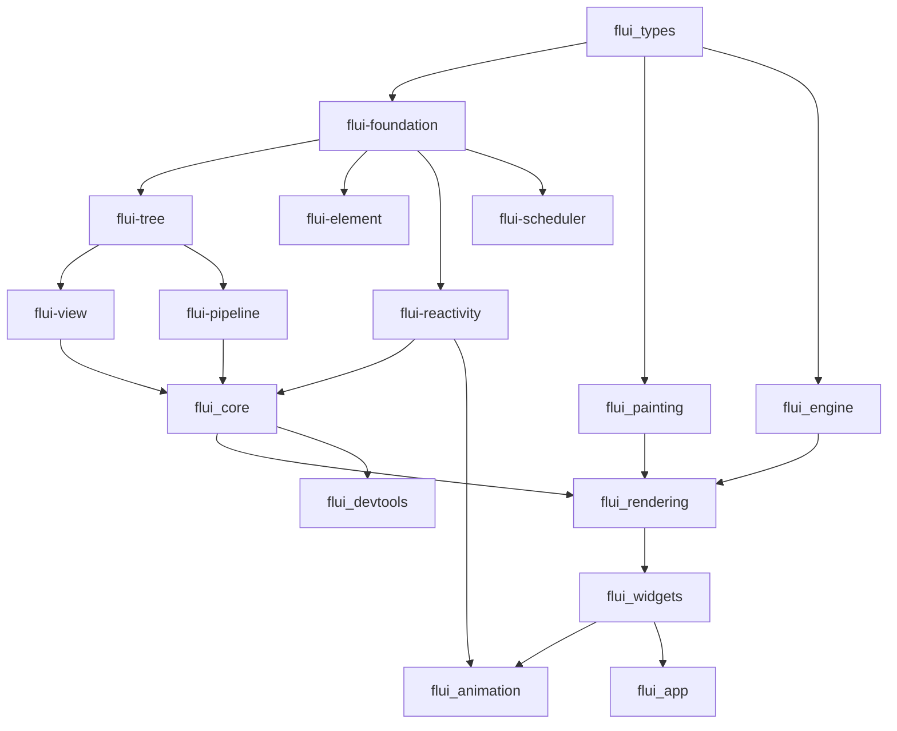

# FLUI Modular Architecture

**Complete Guide to FLUI's New Crate Structure**

> **Version:** v0.1.0  
> **Last Updated:** January 2025  
> **Status:** Current Architecture

---

## Executive Summary

FLUI v0.1.0 introduces a **modular crate architecture** that replaces the previous monolithic design. The framework is now organized into 20+ specialized crates, each with clear responsibilities and minimal dependencies.

**Key Benefits:**
- ✅ **Focused Responsibilities** - Each crate has a single, well-defined purpose
- ✅ **Flexible Composition** - Use only the crates you need
- ✅ **Abstract Interfaces** - Extensible through trait-based design
- ✅ **Independent Evolution** - Crates can evolve at different paces
- ✅ **Testing Isolation** - Focused test suites with clear boundaries
- ✅ **Documentation Quality** - Each crate is fully documented

---

## Architecture Layers

FLUI follows a strict **5-layer architecture** with clear dependency rules:

```
┌─────────────────────────────────────────────────────────────┐
│                    Layer 4: Applications                    │
│  flui_app │ flui_devtools │ flui_cli │ flui_build          │
├─────────────────────────────────────────────────────────────┤
│                    Layer 3: Widgets                         │
│  flui_widgets │ flui_animation │ flui_interaction           │
├─────────────────────────────────────────────────────────────┤
│                    Layer 2: Rendering                       │
│  flui_rendering │ flui_assets │ flui_log                   │
├─────────────────────────────────────────────────────────────┤
│                    Layer 1: Framework                       │
│  flui_core │ flui-view │ flui-pipeline │ flui-reactivity   │
│  flui-scheduler │ flui_painting │ flui_engine              │
├─────────────────────────────────────────────────────────────┤
│                    Layer 0: Foundation                      │
│  flui_types │ flui-foundation │ flui-tree │ flui-element   │
└─────────────────────────────────────────────────────────────┘
```

**Dependency Rules:**
- ✅ Higher layers can depend on lower layers
- ❌ Lower layers CANNOT depend on higher layers
- ❌ Crates within the same layer should minimize cross-dependencies
- ✅ Abstract interfaces preferred over concrete implementations

---

## Foundation Layer (Layer 0)

### flui_types
**Purpose:** Basic geometry and mathematical types  
**Dependencies:** None (zero-dependency)  
**Exports:** `Size`, `Rect`, `Offset`, `Color`, `EdgeInsets`, `Transform`

```rust
use flui_types::{Size, Rect, Color};

let size = Size::new(100.0, 200.0);
let rect = Rect::from_size(size);
let color = Color::rgb(255, 0, 0);
```

**Design Principles:**
- Zero external dependencies
- Copy/Clone semantics for all types
- Optimized for GPU rendering (f32 everywhere)
- Platform-agnostic abstractions

### flui-foundation
**Purpose:** Core types, change notification, diagnostics  
**Dependencies:** Minimal (parking_lot, once_cell)  
**Exports:** `ElementId`, `Key`, `ChangeNotifier`, `DiagnosticsNode`

```rust
use flui_foundation::{ElementId, ChangeNotifier};

let element_id = ElementId::new(42);
let mut notifier = ChangeNotifier::new();
let listener = notifier.add_listener(Arc::new(|| {
    println!("Changed!");
}));
```

**Key Features:**
- `ElementId` with niche optimization (Option<ElementId> = 8 bytes)
- Thread-safe change notification
- Rich diagnostics for debugging
- Lock-free atomic utilities

### flui-tree
**Purpose:** Tree abstractions and visitor patterns  
**Dependencies:** `flui-foundation`  
**Exports:** Tree traits, visitor patterns, traversal algorithms

```rust
use flui_tree::{TreeVisitor, TreeTraversal};

struct MyVisitor;
impl TreeVisitor<MyNode> for MyVisitor {
    fn visit(&mut self, node: &MyNode) -> VisitResult {
        // Custom tree traversal logic
        VisitResult::Continue
    }
}
```

**Design Patterns:**
- Visitor pattern for tree operations
- Generic over node types
- Efficient traversal algorithms
- Immutable and mutable variants

### flui-element
**Purpose:** Element abstractions and tree structure  
**Dependencies:** `flui-foundation`, `flui-tree`  
**Exports:** Element traits, tree management, lifecycle

```rust
use flui_element::{Element, ElementTree};

let mut tree = ElementTree::new();
let root_id = tree.create_root(root_element);
tree.attach_child(parent_id, child_id);
```

---

## Framework Layer (Layer 1)

### flui-view
**Purpose:** View traits and element creation  
**Dependencies:** Foundation layer  
**Exports:** `View` trait, `IntoElement`, element builders

```rust
use flui_view::View;

#[derive(Debug)]
struct MyWidget {
    text: String,
}

impl View for MyWidget {
    fn build(self, ctx: &BuildContext) -> impl IntoElement {
        // Return element structure
        text(self.text)
    }
}
```

**Key Concepts:**
- Declarative UI descriptions
- Automatic element tree management
- Type-safe element creation
- Builder patterns for complex views

### flui-pipeline
**Purpose:** Abstract pipeline traits and coordination  
**Dependencies:** Foundation layer  
**Exports:** `BuildPhase`, `LayoutPhase`, `PaintPhase`, `PipelineCoordinator`

```rust
use flui_pipeline::{BuildPhase, PipelineCoordinator};

struct MyBuildPhase;
impl BuildPhase for MyBuildPhase {
    type Tree = MyElementTree;
    
    fn schedule(&mut self, element_id: ElementId) {
        // Custom scheduling logic
    }
}
```

**Abstract Design:**
- Trait-based pipeline phases
- Extensible coordination patterns
- Performance metrics integration
- Error recovery strategies

### flui-reactivity
**Purpose:** Reactive state management with signals and hooks  
**Dependencies:** Foundation layer  
**Exports:** `Signal`, `use_signal`, `use_effect`, hooks system

```rust
use flui_reactivity::{Signal, use_signal, batch};

// Copy-based signals (thread-safe)
let count = Signal::new(0);
let count_copy = count; // No .clone() needed

// Hooks in components
let state = use_signal(ctx, "initial");
```

**Reactive System:**
- Copy-based Signal<T> (8 bytes, thread-safe)
- Fine-grained change tracking
- Lock-free storage with DashMap
- Batching for performance
- Comprehensive hook system

### flui-scheduler
**Purpose:** Frame scheduling and task prioritization  
**Dependencies:** Foundation layer  
**Exports:** Frame scheduler, priority queues, budget management

```rust
use flui_scheduler::{FrameScheduler, TaskPriority};

let mut scheduler = FrameScheduler::new();
scheduler.schedule_task(task, TaskPriority::High);
```

**Scheduling Features:**
- Priority-based task queues
- Frame budget management
- Vsync synchronization
- Performance monitoring

### flui_core
**Purpose:** Concrete implementations of abstract traits  
**Dependencies:** All foundation + framework abstractions  
**Exports:** `PipelineOwner`, concrete element types, hook implementations

```rust
use flui_core::pipeline::PipelineOwner;

let mut pipeline = PipelineOwner::new();
pipeline.set_root(root_element);
let layer = pipeline.build_frame(constraints)?;
```

**Implementation Details:**
- Concrete pipeline implementations
- Element tree management
- Hook state management
- Performance optimizations

### flui_painting
**Purpose:** 2D graphics primitives and canvas API  
**Dependencies:** `flui_types`, `flui-foundation`  
**Exports:** `Canvas`, `Paint`, `Path`, display list

```rust
use flui_painting::{Canvas, Paint};

let mut canvas = Canvas::new();
let paint = Paint::new().with_color(Color::RED);
canvas.draw_rect(rect, &paint);
```

### flui_engine
**Purpose:** GPU rendering engine with wgpu  
**Dependencies:** Foundation + painting  
**Exports:** GPU rendering, shader management, texture handling

```rust
use flui_engine::{RenderEngine, RenderContext};

let engine = RenderEngine::new(device, queue);
engine.render_frame(layers, &render_context);
```

---

## Rendering Layer (Layer 2)

### flui_rendering
**Purpose:** RenderObject implementations  
**Dependencies:** Core framework + painting  
**Exports:** 80+ RenderObjects (`RenderText`, `RenderFlex`, etc.)

```rust
use flui_rendering::{RenderText, RenderFlex};

let text_render = RenderText::new("Hello World");
let flex_render = RenderFlex::column();
```

### flui_assets
**Purpose:** Asset management (images, fonts)  
**Dependencies:** Foundation + core  
**Exports:** `AssetRegistry`, `ImageAsset`, `FontAsset`

```rust
use flui_assets::{AssetRegistry, ImageAsset};

let registry = AssetRegistry::global();
let image = ImageAsset::file("logo.png");
let handle = registry.load(image).await?;
```

### flui_log
**Purpose:** Cross-platform logging  
**Dependencies:** Logging ecosystem  
**Exports:** Structured logging, tracing integration

```rust
use flui_log::{info, debug};

info!("Frame rendered", fps = 60.0);
debug!(element_id = ?id, "Element updated");
```

---

## Widget Layer (Layer 3)

### flui_widgets
**Purpose:** High-level widget library  
**Dependencies:** Rendering layer  
**Exports:** 60+ widgets (`Text`, `Button`, `Column`, etc.)

```rust
use flui_widgets::{Text, Button, Column};

Column::new()
    .children(vec![
        Text::new("Hello"),
        Button::new("Click me"),
    ])
```

### flui_animation
**Purpose:** Animation system  
**Dependencies:** Widgets + reactivity  
**Exports:** Animation controllers, tweens, curves

```rust
use flui_animation::{AnimationController, Tween};

let controller = AnimationController::new(duration);
let tween = Tween::new(0.0, 1.0);
```

### flui_interaction
**Purpose:** Event handling and gestures  
**Dependencies:** Widgets + assets  
**Exports:** Event handling, gesture recognition, hit testing

```rust
use flui_interaction::{GestureDetector, TapGesture};

GestureDetector::new()
    .on_tap(TapGesture::new(|details| {
        println!("Tapped at {:?}", details.position);
    }))
```

---

## Application Layer (Layer 4)

### flui_app
**Purpose:** Application framework  
**Dependencies:** Widget layer  
**Exports:** `FluiApp`, platform integration, window management

```rust
use flui_app::{FluiApp, WindowBuilder};

FluiApp::new()
    .window(WindowBuilder::new().title("My App"))
    .run(MyRootWidget);
```

### flui_devtools
**Purpose:** Development and debugging tools  
**Dependencies:** All layers (dev-only)  
**Exports:** Profiler, inspector, debug overlays

```rust
use flui_devtools::{Profiler, Inspector};

#[cfg(debug_assertions)]
let profiler = Profiler::new();
```

### flui_cli
**Purpose:** CLI tool for project management  
**Dependencies:** Build system  
**Exports:** CLI commands, project scaffolding

```bash
cargo install flui_cli
flui new my_project
flui build --target android
```

### flui_build
**Purpose:** Cross-platform build system  
**Dependencies:** Build tooling  
**Exports:** Build scripts, platform targets

```rust
use flui_build::{BuildTarget, BuildConfig};

let config = BuildConfig::new()
    .target(BuildTarget::Android)
    .release();
```

---

## Crate Relationships

### Dependency Graph



### Feature Dependencies

**Optional Features:**
- `parallel`: Enable rayon-based parallel processing
- `serde`: Enable serialization support
- `async`: Enable async utilities
- `devtools`: Enable development tools

```toml
# Minimal setup
[dependencies]
flui_types = "0.1"
flui_core = "0.1"
flui_widgets = "0.1"

# With reactivity
flui-reactivity = { version = "0.1", features = ["hooks"] }

# With assets
flui_assets = { version = "0.1", features = ["images"] }

# Full setup
flui = { version = "0.1", features = ["full"] }
```

---

## Migration Benefits

### From Monolithic to Modular

**Before (v0.7.0):**
```rust
use flui_core::everything::*; // 500+ exports
```

**After (v0.1.0):**
```rust
use flui-reactivity::Signal;           // Focused imports
use flui_widgets::Text;               // Clear dependencies
use flui-pipeline::BuildPhase;        // Abstract interfaces
```

### Development Workflow

**Focused Testing:**
```bash
# Test specific layer
cargo test -p flui-reactivity
cargo test -p flui-pipeline

# Test integration
cargo test --workspace
```

**Targeted Documentation:**
```bash
# Document specific crate
cargo doc -p flui-foundation --open

# Document layer
cargo doc -p flui-reactivity -p flui-scheduler --open
```

**Incremental Compilation:**
- Only changed crates recompile
- Parallel compilation of independent crates
- Reduced memory usage during builds

---

## Best Practices

### Crate Usage Patterns

#### Foundation Layer Usage
```rust
// Good: Use foundation types everywhere
use flui_types::{Size, Color};
use flui-foundation::{ElementId, Key};

// Good: Zero-cost abstractions
let size = Size::new(100.0, 200.0); // Stack allocated
let id = ElementId::new(42);        // 8 bytes total
```

#### Framework Layer Usage
```rust
// Good: Use abstract traits for extensibility
use flui_pipeline::{BuildPhase, LayoutPhase};

impl BuildPhase for CustomBuildPhase {
    // Custom implementation
}

// Good: Compose reactive state
use flui_reactivity::{Signal, batch};

batch(|| {
    signal1.set(value1);
    signal2.set(value2); 
}); // Single update notification
```

#### Widget Layer Usage
```rust
// Good: Compose widgets declaratively
use flui_widgets::{Column, Text, Button};

Column::new()
    .spacing(16.0)
    .children(vec![
        Text::new("Title"),
        Button::new("Action"),
    ])
```

### Anti-Patterns

**❌ Don't skip layers:**
```rust
// Bad: Widget directly using foundation
use flui_widgets::Text;
use flui-foundation::ElementId; // Should use flui_core types
```

**❌ Don't create circular dependencies:**
```rust
// Bad: Foundation depending on framework
// flui-foundation -> flui-reactivity (circular!)
```

**❌ Don't bypass abstractions:**
```rust
// Bad: Using concrete types instead of traits
use flui_core::pipeline::ConcretePipeline; // Use flui-pipeline traits

// Good: Use abstract interface
use flui_pipeline::PipelineCoordinator;
```

---

## Performance Characteristics

### Build Time
- **Parallel compilation**: Independent crates compile in parallel
- **Incremental builds**: Only changed crates recompile
- **Reduced dependencies**: Smaller dependency trees per crate

### Runtime
- **Zero-cost abstractions**: Abstract traits compile to direct calls
- **Optimized composition**: No runtime overhead from modular design
- **Selective features**: Only pay for what you use

### Memory Usage
- **Reduced binary size**: Tree shaking eliminates unused crates
- **Efficient types**: Foundation types designed for minimal overhead
- **Lock-free operations**: Atomic operations where possible

---

## Future Evolution

### Planned Additions

**New Foundation Crates:**
- `flui-async`: Async utilities and futures
- `flui-collections`: Specialized collection types
- `flui-math`: Extended mathematical operations

**New Framework Crates:**
- `flui-layout`: Advanced layout algorithms
- `flui-text`: Rich text processing
- `flui-accessibility`: A11y support

**New Application Crates:**
- `flui-platform`: Platform-specific implementations
- `flui-testing`: Testing frameworks
- `flui-analytics`: Usage analytics

### Migration Strategy

1. **Foundation First**: Establish stable foundation types
2. **Framework Next**: Build framework abstractions
3. **Applications Last**: Develop high-level applications
4. **Backward Compatibility**: Maintain migration paths

---

## Comparison with Other Architectures

### vs. Monolithic (Old FLUI)

| Aspect | Monolithic | Modular |
|--------|------------|---------|
| **Compile Time** | All-or-nothing | Incremental |
| **Dependencies** | Everything | Minimal |
| **Testing** | Large test suite | Focused tests |
| **Documentation** | Single large doc | Per-crate docs |
| **Reusability** | Framework only | Mix and match |
| **Maintenance** | Coordinated changes | Independent evolution |

### vs. Other UI Frameworks

**Tauri:**
- FLUI: Rust-native with direct GPU access
- Tauri: Web view wrapper with JS bridge

**egui:**
- FLUI: Three-tree architecture with GPU rendering
- egui: Immediate mode with CPU rendering

**Dioxus:**
- FLUI: Signal-based reactivity
- Dioxus: Virtual DOM with diffing

**Iced:**
- FLUI: Modular crate architecture
- Iced: Monolithic with fewer abstractions

---

## Troubleshooting

### Common Issues

**Build Errors:**
```bash
# Dependency version mismatch
cargo update
cargo clean && cargo build

# Missing features
cargo build -p flui-reactivity --features hooks
```

**Runtime Issues:**
```bash
# Enable logging
RUST_LOG=debug cargo run

# Check feature flags
cargo tree -f "{p} {f}"
```

**Performance Issues:**
```bash
# Profile specific crate
cargo bench -p flui-pipeline

# Check parallel compilation
cargo build --timings
```

---

## References

- **[Main README](../README.md)** - Project overview
- **[CLAUDE.md](../CLAUDE.md)** - Development guidelines
- **[Architecture Overview](arch/README.md)** - Detailed architecture docs
- **[Individual Crate READMEs](../crates/)** - Per-crate documentation

---

**Last Updated:** January 2025  
**Next Review:** April 2025 (Quarterly)  
**Maintainers:** Core Architecture Team