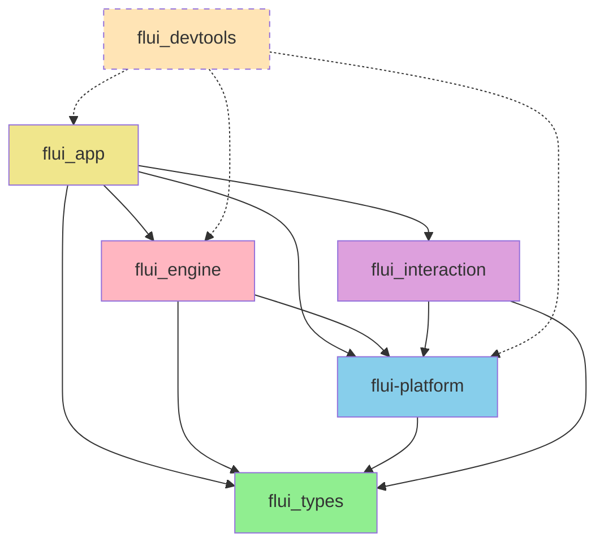
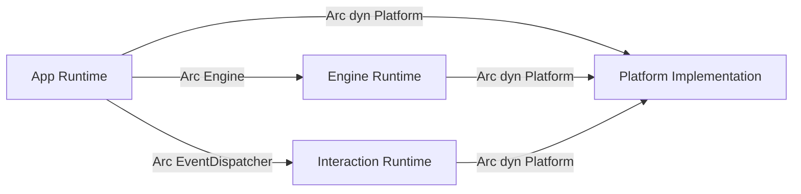

# FLUI Core Architecture Design Plan

> **For Claude:** REQUIRED SUB-SKILL: Use superpowers:executing-plans to implement this plan task-by-task.

**Goal:** Design and implement a production-ready, maintainable architecture for FLUI's 6 core crates following SOLID, DRY, and industry best practices.

**Architecture:** Layered architecture inspired by Flutter, GPUI, and modern GUI frameworks. Each crate has single responsibility, clear boundaries, and minimal coupling. Platform abstraction enables 7+ platform support (Windows, macOS, Linux X11/Wayland, Android, iOS, Web).

**Tech Stack:** 
- Rust 2021 edition, MSRV 1.91
- winit 0.30 for cross-platform windowing
- wgpu 25.x for GPU rendering
- tokio 1.43 for async runtime
- parking_lot 0.12 for synchronization
- tracing for diagnostics

**Design Principles:**
1. **SOLID**: Each crate has single responsibility, open for extension, LSP-compliant
2. **DRY**: Shared utilities in foundation, trait-based abstractions
3. **Testability**: Headless mode, dependency injection, trait-based APIs
4. **Performance**: Zero-cost abstractions, compile-time dispatch where possible
5. **Cross-platform**: Works on 7+ platforms without platform-specific code in high-level APIs

---

## Table of Contents

1. [Architecture Overview](#1-architecture-overview)
2. [Crate Dependency Graph](#2-crate-dependency-graph)
3. [Crate Design Details](#3-crate-design-details)
   - [flui_types](#31-flui_types)
   - [flui-platform](#32-flui-platform)
   - [flui_engine](#33-flui_engine)
   - [flui_interaction](#34-flui_interaction)
   - [flui_app](#35-flui_app)
   - [flui_devtools](#36-flui_devtools)
4. [Cross-Cutting Concerns](#4-cross-cutting-concerns)
5. [Implementation Phases](#5-implementation-phases)

---

## 1. Architecture Overview

### 1.1 Layered Architecture

```
┌─────────────────────────────────────────────────────────────┐
│                      Application Layer                       │
│                        flui_app                              │
│  - App lifecycle management                                  │
│  - Window creation & routing                                 │
│  - Platform initialization                                   │
└──────────────────────────┬──────────────────────────────────┘
                           │
┌──────────────────────────┴──────────────────────────────────┐
│                     Framework Layer                          │
│                 flui_interaction                             │
│  - Event routing & dispatching                               │
│  - Hit testing                                               │
│  - Gesture recognition                                       │
│  - Focus management                                          │
└─────────────┬────────────────────────────────────┬──────────┘
              │                                    │
┌─────────────┴─────────────┐   ┌─────────────────┴──────────┐
│     Rendering Layer       │   │     Platform Layer         │
│      flui_engine          │   │     flui-platform          │
│  - wgpu integration       │   │  - Platform traits         │
│  - Scene graph            │   │  - Window abstraction      │
│  - Compositor             │   │  - Input abstraction       │
│  - Render pipeline        │   │  - Display management      │
└────────────┬──────────────┘   └────────────┬───────────────┘
             │                               │
             └───────────────┬───────────────┘
                             │
                  ┌──────────┴──────────┐
                  │   Foundation Layer  │
                  │     flui_types      │
                  │  - Geometry types   │
                  │  - Color types      │
                  │  - Unit types       │
                  │  - Math utilities   │
                  └─────────────────────┘

                  ┌─────────────────────┐
                  │   Developer Tools   │
                  │   flui_devtools     │
                  │  - Inspector        │
                  │  - Performance      │
                  │  - Diagnostics      │
                  └─────────────────────┘
```

### 1.2 SOLID Principles Application

**Single Responsibility Principle (SRP):**
- `flui_types`: Only type definitions, no behavior
- `flui-platform`: Only platform abstraction, no rendering
- `flui_engine`: Only rendering, no application logic
- `flui_interaction`: Only event handling, no rendering
- `flui_app`: Only application lifecycle, delegates everything else
- `flui_devtools`: Only development tools, no runtime overhead in production

**Open/Closed Principle (OCP):**
- Platform backends extend `Platform` trait without modifying core
- Custom render passes extend `RenderPass` trait
- New event types extend `Event` enum via trait implementations
- Extensibility through traits, not modifications

**Liskov Substitution Principle (LSP):**
- All `Platform` implementations fully interchangeable
- `HeadlessPlatform` for testing substitutes real platforms
- Mock implementations for unit testing

**Interface Segregation Principle (ISP):**
- `Platform` trait split into focused traits:
  - `PlatformLifecycle`: App lifecycle
  - `PlatformWindow`: Window management
  - `PlatformDisplay`: Display information
  - `PlatformExecutor`: Task execution
  - `PlatformTextSystem`: Text rendering
- Clients depend only on what they use

**Dependency Inversion Principle (DIP):**
- High-level modules (flui_app) depend on abstractions (Platform trait)
- Low-level modules (platform implementations) implement abstractions
- No direct dependencies on concrete implementations

---

## 2. Crate Dependency Graph

### 2.1 Static Dependencies (compile-time)



**Legend:**
- Green: Foundation (no dependencies)
- Blue: Platform abstraction
- Pink: Rendering layer
- Purple: Framework layer
- Yellow: Application layer
- Dashed: Optional development tools

### 2.2 Runtime Dependencies (trait objects)



---

## 3. Crate Design Details

## 3.1 flui_types

**Purpose:** Foundation types with zero dependencies. Mathematical and geometric primitives.

**Key Characteristics:**
- **Zero dependencies** (except num-traits, optional serde)
- **#[repr(C)]** for FFI compatibility
- **Generic over Unit types** (Logical, Physical, Device pixels)
- **const fn** where possible for compile-time computation
- **SIMD-friendly** data layout

### 3.1.1 Module Structure

```
flui_types/
├─ src/
│  ├─ lib.rs                 # Public API, re-exports
│  ├─ units/
│  │  ├─ mod.rs              # Unit trait and type markers
│  │  ├─ logical.rs          # LogicalPixels (density-independent)
│  │  ├─ physical.rs         # PhysicalPixels (screen pixels)
│  │  └─ device.rs           # DevicePixels (for rendering)
│  ├─ geometry/
│  │  ├─ mod.rs
│  │  ├─ point.rs            # Point<T, U>
│  │  ├─ size.rs             # Size<T, U>
│  │  ├─ rect.rs             # Rect<T, U>
│  │  ├─ offset.rs           # Offset<T, U>
│  │  ├─ vector.rs           # Vector<T, U>
│  │  ├─ corners.rs          # RoundedCorners<T, U>
│  │  ├─ edges.rs            # EdgeInsets<T, U>
│  │  └─ transform.rs        # Transform2D<T, Src, Dst>
│  ├─ color/
│  │  ├─ mod.rs
│  │  ├─ rgb.rs              # Rgb, Rgba
│  │  ├─ hsl.rs              # Hsl, Hsla
│  │  ├─ hsv.rs              # Hsv, Hsva
│  │  ├─ linear.rs           # Linear RGB (for blending)
│  │  ├─ space.rs            # Color space traits
│  │  └─ palette.rs          # Common color palettes
│  ├─ layout/
│  │  ├─ mod.rs
│  │  ├─ constraints.rs      # BoxConstraints<U>
│  │  ├─ alignment.rs        # Alignment, AlignmentGeometry
│  │  ├─ axis.rs             # Axis, AxisDirection
│  │  └─ fit.rs              # BoxFit enum
│  ├─ text/
│  │  ├─ mod.rs
│  │  ├─ style.rs            # TextStyle
│  │  ├─ decoration.rs       # TextDecoration
│  │  └─ baseline.rs         # TextBaseline
│  ├─ animation/
│  │  ├─ mod.rs
│  │  ├─ curve.rs            # Curve trait, common curves
│  │  └─ easing.rs           # Easing functions
│  └─ errors.rs              # Type-specific errors
```

### 3.1.2 Core Type Design

**Generic Unit System:**

```rust
/// Unit marker trait
pub trait Unit: Copy + Clone + Debug + 'static {
    const NAME: &'static str;
}

/// Logical pixels (density-independent, 96 DPI baseline)
#[derive(Copy, Clone, Debug)]
pub struct LogicalPixels;
impl Unit for LogicalPixels {
    const NAME: &'static str = "logical";
}

/// Physical pixels (actual screen pixels)
#[derive(Copy, Clone, Debug)]
pub struct PhysicalPixels;
impl Unit for PhysicalPixels {
    const NAME: &'static str = "physical";
}

/// Device pixels (GPU/rendering pixels)
#[derive(Copy, Clone, Debug)]
pub struct DevicePixels;
impl Unit for DevicePixels {
    const NAME: &'static str = "device";
}

/// Generic point type
#[repr(C)]
#[derive(Copy, Clone, Debug, PartialEq)]
pub struct Point<T, U: Unit = LogicalPixels> {
    pub x: T,
    pub y: T,
    _unit: PhantomData<U>,
}

impl<T: Num, U: Unit> Point<T, U> {
    #[inline]
    pub const fn new(x: T, y: T) -> Self {
        Self { x, y, _unit: PhantomData }
    }
    
    #[inline]
    pub fn cast_unit<V: Unit>(self) -> Point<T, V> {
        Point::new(self.x, self.y)
    }
}

// Scale conversions
impl<T: Mul<Output = T> + Copy> Point<T, LogicalPixels> {
    pub fn to_physical(self, scale: T) -> Point<T, PhysicalPixels> {
        Point::new(self.x * scale, self.y * scale)
    }
}
```

**Benefits:**
- Type-safe unit conversions at compile-time
- No runtime overhead (zero-sized PhantomData)
- Clear API (impossible to mix logical/physical accidentally)

### 3.1.3 Design Patterns

**Pattern 1: Builder Pattern for Complex Types**

```rust
impl<T, U: Unit> Rect<T, U> {
    pub fn builder() -> RectBuilder<T, U> {
        RectBuilder::default()
    }
}

pub struct RectBuilder<T, U: Unit> {
    origin: Option<Point<T, U>>,
    size: Option<Size<T, U>>,
}

impl<T, U: Unit> RectBuilder<T, U> {
    pub fn origin(mut self, origin: Point<T, U>) -> Self {
        self.origin = Some(origin);
        self
    }
    
    pub fn size(mut self, size: Size<T, U>) -> Self {
        self.size = Some(size);
        self
    }
    
    pub fn build(self) -> Result<Rect<T, U>, BuildError> {
        // validation
    }
}
```

**Pattern 2: From/Into Conversions**

```rust
// Seamless conversions between related types
impl<T, U: Unit> From<(T, T)> for Point<T, U> {
    fn from((x, y): (T, T)) -> Self {
        Self::new(x, y)
    }
}

impl<T, U: Unit> From<[T; 2]> for Point<T, U> {
    fn from([x, y]: [T; 2]) -> Self {
        Self::new(x, y)
    }
}
```

### 3.1.4 Testing Strategy

```rust
#[cfg(test)]
mod tests {
    use super::*;
    
    #[test]
    fn test_unit_type_safety() {
        let logical = Point::<f32, LogicalPixels>::new(100.0, 200.0);
        let physical = logical.to_physical(2.0);
        
        // This would be a compile error:
        // let _ = logical + physical; // ❌ Cannot add different units
        
        assert_eq!(physical.x, 200.0);
        assert_eq!(physical.y, 400.0);
    }
    
    #[test]
    fn test_rect_contains() {
        let rect = Rect::new(Point::new(0.0, 0.0), Size::new(100.0, 100.0));
        assert!(rect.contains(Point::new(50.0, 50.0)));
        assert!(!rect.contains(Point::new(150.0, 50.0)));
    }
}
```

---

## 3.2 flui-platform

**Purpose:** Complete platform abstraction enabling cross-platform development without platform-specific code in higher layers.

**Key Characteristics:**
- **Trait-based** abstractions for all platform APIs
- **Conditional compilation** for platform-specific implementations
- **Runtime platform selection** via `current_platform()`
- **Headless mode** for testing
- **Zero overhead** abstractions (static dispatch where possible)

### 3.2.1 Module Structure

```
flui-platform/
├─ src/
│  ├─ lib.rs                    # Public API, platform selection
│  ├─ traits/
│  │  ├─ mod.rs
│  │  ├─ platform.rs            # Platform trait (central)
│  │  ├─ window.rs              # PlatformWindow trait
│  │  ├─ display.rs             # PlatformDisplay trait
│  │  ├─ input.rs               # Input events and state
│  │  ├─ lifecycle.rs           # PlatformLifecycle trait
│  │  ├─ executor.rs            # PlatformExecutor trait
│  │  ├─ text_system.rs         # PlatformTextSystem trait
│  │  ├─ clipboard.rs           # Clipboard trait
│  │  └─ capabilities.rs        # PlatformCapabilities
│  ├─ shared/
│  │  ├─ mod.rs
│  │  ├─ handlers.rs            # Callback registry
│  │  ├─ event_queue.rs         # Platform event queue
│  │  └─ window_state.rs        # Shared window state
│  ├─ platforms/
│  │  ├─ mod.rs
│  │  ├─ headless/              # Testing platform
│  │  │  ├─ mod.rs
│  │  │  ├─ platform.rs
│  │  │  ├─ window.rs
│  │  │  └─ display.rs
│  │  ├─ winit/                 # Cross-platform (desktop + mobile + web)
│  │  │  ├─ mod.rs
│  │  │  ├─ platform.rs
│  │  │  ├─ window.rs
│  │  │  ├─ display.rs
│  │  │  ├─ events.rs
│  │  │  └─ clipboard.rs
│  │  ├─ windows/               # Native Win32 (future)
│  │  │  ├─ mod.rs
│  │  │  ├─ platform.rs
│  │  │  ├─ window.rs
│  │  │  ├─ events.rs
│  │  │  └─ dwm.rs
│  │  ├─ macos/                 # Native Cocoa (future)
│  │  │  └─ ...
│  │  ├─ linux/                 # Native Wayland/X11 (future)
│  │  │  ├─ wayland/
│  │  │  └─ x11/
│  │  ├─ android/               # Native Android (future)
│  │  │  └─ ...
│  │  ├─ ios/                   # Native iOS (future)
│  │  │  └─ ...
│  │  └─ web/                   # Native Web (future)
│  │     └─ ...
│  └─ testing/
│     ├─ mod.rs
│     └─ mock_platform.rs       # Mock for unit tests
```

### 3.2.2 Core Trait Design

**Central Platform Trait:**

```rust
/// Central platform abstraction
///
/// All platform-specific functionality is accessed through this trait.
/// Implementations provide platform-specific behavior while maintaining
/// a unified API for higher layers.
pub trait Platform: Send + Sync + 'static {
    /// Platform name for debugging
    fn name(&self) -> &str;
    
    /// Platform capabilities
    fn capabilities(&self) -> &dyn PlatformCapabilities;
    
    // === Lifecycle ===
    
    /// Start the platform event loop
    fn run(&self, on_ready: Box<dyn FnOnce() + Send>);
    
    /// Request the application to quit
    fn quit(&self);
    
    /// Request a new frame
    fn request_frame(&self);
    
    // === Windows ===
    
    /// Create a new window
    fn create_window(
        &self,
        options: WindowOptions,
    ) -> Result<Arc<dyn PlatformWindow>, PlatformError>;
    
    /// Get all open windows
    fn windows(&self) -> Vec<Arc<dyn PlatformWindow>>;
    
    // === Displays ===
    
    /// Get all available displays
    fn displays(&self) -> Vec<Arc<dyn PlatformDisplay>>;
    
    /// Get the primary display
    fn primary_display(&self) -> Option<Arc<dyn PlatformDisplay>>;
    
    // === Executors ===
    
    /// Get the background executor for async tasks
    fn background_executor(&self) -> Arc<dyn PlatformExecutor>;
    
    /// Get the foreground executor (runs on main thread)
    fn foreground_executor(&self) -> Arc<dyn PlatformExecutor>;
    
    // === Text System ===
    
    /// Get the text system for font loading and rendering
    fn text_system(&self) -> Arc<dyn PlatformTextSystem>;
    
    // === Clipboard ===
    
    /// Get clipboard access
    fn clipboard(&self) -> Arc<dyn Clipboard>;
}
```

**Trait Segregation:**

```rust
/// Lifecycle management (ISP: separated concern)
pub trait PlatformLifecycle {
    fn on_app_start(&self, callback: Box<dyn FnOnce() + Send>);
    fn on_app_stop(&self, callback: Box<dyn FnOnce() + Send>);
    fn on_suspend(&self, callback: Box<dyn Fn() + Send + Sync>);
    fn on_resume(&self, callback: Box<dyn Fn() + Send + Sync>);
}

/// Window management (ISP: separated concern)
pub trait PlatformWindow: Send + Sync {
    fn id(&self) -> WindowId;
    fn title(&self) -> String;
    fn set_title(&self, title: &str);
    fn size(&self) -> Size<f32, PhysicalPixels>;
    fn set_size(&self, size: Size<f32, PhysicalPixels>);
    fn position(&self) -> Point<f32, PhysicalPixels>;
    fn set_position(&self, position: Point<f32, PhysicalPixels>);
    fn scale_factor(&self) -> f64;
    fn is_visible(&self) -> bool;
    fn set_visible(&self, visible: bool);
    fn close(&self);
    
    // Event callbacks
    fn on_resize(&self, callback: Box<dyn Fn(Size<f32, PhysicalPixels>) + Send + Sync>);
    fn on_close_requested(&self, callback: Box<dyn Fn() -> bool + Send + Sync>);
    fn on_scale_changed(&self, callback: Box<dyn Fn(f64) + Send + Sync>);
    
    // Raw handle for wgpu integration
    fn raw_window_handle(&self) -> RawWindowHandle;
    fn raw_display_handle(&self) -> RawDisplayHandle;
}
```

### 3.2.3 Platform Selection Strategy

**Compile-Time Selection (cfg attributes):**

```rust
/// Get the appropriate platform for the current target
pub fn current_platform() -> Arc<dyn Platform> {
    // Environment variable override for testing
    if std::env::var("FLUI_HEADLESS").is_ok() {
        return Arc::new(HeadlessPlatform::new());
    }
    
    // Platform-specific selection
    #[cfg(target_os = "windows")]
    {
        #[cfg(feature = "native-windows")]
        return Arc::new(WindowsPlatform::new());
        
        #[cfg(not(feature = "native-windows"))]
        return Arc::new(WinitPlatform::new());
    }
    
    #[cfg(target_os = "macos")]
    {
        #[cfg(feature = "native-macos")]
        return Arc::new(MacOSPlatform::new());
        
        #[cfg(not(feature = "native-macos"))]
        return Arc::new(WinitPlatform::new());
    }
    
    #[cfg(target_os = "linux")]
    {
        return Arc::new(WinitPlatform::new());
    }
    
    #[cfg(target_os = "android")]
    {
        return Arc::new(WinitPlatform::new());
    }
    
    #[cfg(target_os = "ios")]
    {
        return Arc::new(WinitPlatform::new());
    }
    
    #[cfg(target_arch = "wasm32")]
    {
        return Arc::new(WinitPlatform::new());
    }
    
    // Fallback to headless for unknown platforms
    Arc::new(HeadlessPlatform::new())
}
```

### 3.2.4 Winit Implementation

**Strategy:** Winit as foundation, extensible for platform-specific features

```rust
pub struct WinitPlatform {
    event_loop: RefCell<Option<EventLoop<UserEvent>>>,
    windows: Arc<DashMap<WindowId, Arc<WinitWindow>>>,
    handlers: Arc<PlatformHandlers>,
    capabilities: WinitCapabilities,
}

impl Platform for WinitPlatform {
    fn name(&self) -> &str {
        "Winit"
    }
    
    fn run(&self, on_ready: Box<dyn FnOnce() + Send>) {
        let event_loop = self.event_loop.borrow_mut().take()
            .expect("Event loop already started");
        
        // Call on_ready after platform is initialized
        on_ready();
        
        // Run the event loop
        let windows = Arc::clone(&self.windows);
        let handlers = Arc::clone(&self.handlers);
        
        event_loop.run(move |event, elwt| {
            match event {
                Event::WindowEvent { window_id, event } => {
                    if let Some(window) = windows.get(&window_id) {
                        window.handle_event(event);
                    }
                }
                Event::AboutToWait => {
                    handlers.trigger_frame_requested();
                }
                _ => {}
            }
        }).expect("Event loop error");
    }
    
    fn create_window(
        &self,
        options: WindowOptions,
    ) -> Result<Arc<dyn PlatformWindow>, PlatformError> {
        let event_loop = self.event_loop.borrow();
        let el = event_loop.as_ref()
            .ok_or(PlatformError::EventLoopNotAvailable)?;
        
        let winit_window = winit::window::WindowBuilder::new()
            .with_title(options.title)
            .with_inner_size(winit::dpi::LogicalSize::new(
                options.size.width,
                options.size.height,
            ))
            .build(el)
            .map_err(|e| PlatformError::WindowCreationFailed(e.to_string()))?;
        
        let window = Arc::new(WinitWindow::new(winit_window, Arc::clone(&self.handlers)));
        self.windows.insert(window.id(), Arc::clone(&window) as Arc<dyn PlatformWindow>);
        
        Ok(window)
    }
}
```

### 3.2.5 Testing Infrastructure

**Mock Platform for Unit Tests:**

```rust
pub struct MockPlatform {
    windows: Arc<Mutex<Vec<Arc<MockWindow>>>>,
    frame_requests: Arc<AtomicUsize>,
}

impl Platform for MockPlatform {
    fn name(&self) -> &str {
        "Mock"
    }
    
    fn run(&self, on_ready: Box<dyn FnOnce() + Send>) {
        // Immediately call on_ready in tests
        on_ready();
    }
    
    fn create_window(&self, options: WindowOptions) 
        -> Result<Arc<dyn PlatformWindow>, PlatformError> 
    {
        let window = Arc::new(MockWindow::new(options));
        self.windows.lock().unwrap().push(Arc::clone(&window));
        Ok(window)
    }
    
    // ... other methods with test-friendly implementations
}

// Usage in tests
#[test]
fn test_window_creation() {
    let platform = MockPlatform::new();
    let window = platform.create_window(WindowOptions {
        title: "Test".into(),
        size: Size::new(800.0, 600.0),
    }).unwrap();
    
    assert_eq!(window.title(), "Test");
    assert_eq!(platform.windows().len(), 1);
}
```

---

## 3.3 flui_engine

**Purpose:** GPU-accelerated rendering engine using wgpu. Scene graph management, compositor, and render pipeline.

**Key Characteristics:**
- **wgpu 25.x** for cross-platform GPU rendering
- **Scene graph** with automatic batching
- **Layered compositing** with transparency
- **Text rendering** via glyphon
- **Path rendering** via lyon
- **No platform knowledge** (uses Platform trait)

### 3.3.1 Module Structure

```
flui_engine/
├─ src/
│  ├─ lib.rs                    # Public API
│  ├─ engine.rs                 # Engine struct (central coordinator)
│  ├─ scene/
│  │  ├─ mod.rs
│  │  ├─ scene.rs               # Scene graph
│  │  ├─ layer.rs               # Layer (compositing unit)
│  │  ├─ primitive.rs           # Rendering primitives
│  │  └─ transform.rs           # Transform stack
│  ├─ renderer/
│  │  ├─ mod.rs
│  │  ├─ backend.rs             # wgpu backend
│  │  ├─ pipeline.rs            # Render pipeline
│  │  ├─ texture.rs             # Texture management
│  │  ├─ buffer.rs              # Buffer management
│  │  └─ atlas.rs               # Texture atlas
│  ├─ text/
│  │  ├─ mod.rs
│  │  ├─ font.rs                # Font loading
│  │  ├─ layout.rs              # Text layout
│  │  └─ shaping.rs             # Text shaping (via glyphon)
│  ├─ shapes/
│  │  ├─ mod.rs
│  │  ├─ path.rs                # Path definition
│  │  ├─ tessellation.rs        # Path tessellation (via lyon)
│  │  ├─ rect.rs                # Rectangle rendering
│  │  ├─ circle.rs              # Circle rendering
│  │  └─ rounded_rect.rs        # Rounded rectangle
│  ├─ compositor/
│  │  ├─ mod.rs
│  │  ├─ layer_tree.rs          # Layer tree management
│  │  ├─ blend.rs               # Blend modes
│  │  └─ effects.rs             # Visual effects (blur, shadow)
│  └─ shaders/
│     ├─ rect.wgsl              # Rectangle shader
│     ├─ text.wgsl              # Text shader (via glyphon)
│     └─ path.wgsl              # Path shader (via lyon)
```

### 3.3.2 Core Engine Design

**Engine as Coordinator (Single Responsibility):**

```rust
/// GPU rendering engine
///
/// Coordinates the rendering pipeline: scene graph → tessellation →
/// GPU upload → rendering → presentation.
pub struct Engine {
    /// wgpu device and queue
    device: Arc<wgpu::Device>,
    queue: Arc<wgpu::Queue>,
    
    /// Surface for each window
    surfaces: Arc<DashMap<WindowId, Surface>>,
    
    /// Render pipeline
    pipeline: Arc<RenderPipeline>,
    
    /// Text renderer
    text_renderer: Arc<Mutex<glyphon::TextRenderer>>,
    
    /// Path tessellator
    path_tessellator: Arc<Mutex<lyon::tessellation::FillTessellator>>,
    
    /// Texture atlas for sprites/images
    atlas: Arc<Mutex<TextureAtlas>>,
    
    /// Compositor for layer blending
    compositor: Arc<Compositor>,
}

impl Engine {
    /// Create a new engine
    pub async fn new(adapter: &wgpu::Adapter) -> Result<Self, EngineError> {
        let (device, queue) = adapter
            .request_device(&wgpu::DeviceDescriptor::default(), None)
            .await
            .map_err(EngineError::DeviceRequest)?;
        
        let device = Arc::new(device);
        let queue = Arc::new(queue);
        
        let pipeline = Arc::new(RenderPipeline::new(&device)?);
        let text_renderer = Arc::new(Mutex::new(
            glyphon::TextRenderer::new(&device, &queue)?
        ));
        let path_tessellator = Arc::new(Mutex::new(
            lyon::tessellation::FillTessellator::new()
        ));
        let atlas = Arc::new(Mutex::new(TextureAtlas::new(&device, 2048, 2048)?));
        let compositor = Arc::new(Compositor::new(&device)?);
        
        Ok(Self {
            device,
            queue,
            surfaces: Arc::new(DashMap::new()),
            pipeline,
            text_renderer,
            path_tessellator,
            atlas,
            compositor,
        })
    }
    
    /// Create a surface for a window
    pub fn create_surface(
        &self,
        window: &dyn PlatformWindow,
    ) -> Result<(), EngineError> {
        let surface = Surface::new(
            &self.device,
            window.raw_window_handle(),
            window.raw_display_handle(),
            window.size(),
        )?;
        
        self.surfaces.insert(window.id(), surface);
        Ok(())
    }
    
    /// Render a scene to a window
    pub fn render(
        &self,
        window_id: WindowId,
        scene: &Scene,
    ) -> Result<(), EngineError> {
        let Some(surface) = self.surfaces.get(&window_id) else {
            return Err(EngineError::SurfaceNotFound(window_id));
        };
        
        // Get the next frame
        let frame = surface.acquire_frame()?;
        
        // Create command encoder
        let mut encoder = self.device.create_command_encoder(
            &wgpu::CommandEncoderDescriptor {
                label: Some("Render Encoder"),
            }
        );
        
        // Render the scene
        {
            let mut render_pass = encoder.begin_render_pass(&wgpu::RenderPassDescriptor {
                label: Some("Main Render Pass"),
                color_attachments: &[Some(wgpu::RenderPassColorAttachment {
                    view: &frame.view,
                    resolve_target: None,
                    ops: wgpu::Operations {
                        load: wgpu::LoadOp::Clear(wgpu::Color::WHITE),
                        store: wgpu::StoreOp::Store,
                    },
                })],
                depth_stencil_attachment: None,
                timestamp_writes: None,
                occlusion_query_set: None,
            });
            
            // Render each layer in the scene
            for layer in scene.layers() {
                self.render_layer(&mut render_pass, layer)?;
            }
        }
        
        // Submit commands and present
        self.queue.submit(Some(encoder.finish()));
        frame.present();
        
        Ok(())
    }
    
    fn render_layer(
        &self,
        render_pass: &mut wgpu::RenderPass,
        layer: &Layer,
    ) -> Result<(), EngineError> {
        // Set transform
        render_pass.set_viewport(/* ... */);
        
        // Render primitives in this layer
        for primitive in layer.primitives() {
            match primitive {
                Primitive::Rect(rect) => self.render_rect(render_pass, rect)?,
                Primitive::Text(text) => self.render_text(render_pass, text)?,
                Primitive::Path(path) => self.render_path(render_pass, path)?,
                Primitive::Image(image) => self.render_image(render_pass, image)?,
            }
        }
        
        Ok(())
    }
}
```

### 3.3.3 Scene Graph Design

**Scene as Data (Separation of Data and Behavior):**

```rust
/// Scene graph (immutable once built)
///
/// The scene is built by the framework and passed to the engine for rendering.
/// It's a tree of layers, each containing rendering primitives.
#[derive(Clone)]
pub struct Scene {
    layers: Vec<Layer>,
    viewport: Rect<f32, DevicePixels>,
}

impl Scene {
    pub fn builder() -> SceneBuilder {
        SceneBuilder::default()
    }
    
    pub fn layers(&self) -> &[Layer] {
        &self.layers
    }
    
    pub fn viewport(&self) -> Rect<f32, DevicePixels> {
        self.viewport
    }
}

/// Builder for constructing scenes
pub struct SceneBuilder {
    layers: Vec<Layer>,
    current_layer: Option<LayerBuilder>,
}

impl SceneBuilder {
    pub fn push_layer(&mut self) -> &mut LayerBuilder {
        if let Some(layer) = self.current_layer.take() {
            self.layers.push(layer.build());
        }
        
        self.current_layer = Some(LayerBuilder::default());
        self.current_layer.as_mut().unwrap()
    }
    
    pub fn build(mut self, viewport: Rect<f32, DevicePixels>) -> Scene {
        if let Some(layer) = self.current_layer.take() {
            self.layers.push(layer.build());
        }
        
        Scene {
            layers: self.layers,
            viewport,
        }
    }
}

/// Layer (compositing unit with transform and blend mode)
#[derive(Clone)]
pub struct Layer {
    primitives: Vec<Primitive>,
    transform: Transform2D,
    opacity: f32,
    blend_mode: BlendMode,
    clip: Option<Rect<f32, DevicePixels>>,
}

/// Rendering primitives (what to draw)
#[derive(Clone)]
pub enum Primitive {
    Rect {
        rect: Rect<f32, DevicePixels>,
        color: Rgba,
        border_radius: f32,
    },
    Text {
        text: String,
        position: Point<f32, DevicePixels>,
        style: TextStyle,
        color: Rgba,
    },
    Path {
        path: Path,
        fill: Option<Rgba>,
        stroke: Option<(Rgba, f32)>,
    },
    Image {
        texture_id: TextureId,
        src_rect: Rect<f32, DevicePixels>,
        dst_rect: Rect<f32, DevicePixels>,
    },
}
```

**Benefits:**
- Scene is **immutable** → can be cached, diffed, replayed
- Engine doesn't mutate scene → clear ownership
- Scene can be built on any thread → parallelizable
- Easy to serialize/deserialize for debugging

### 3.3.4 Dependency Injection

```rust
// Engine depends on Platform trait (DIP)
impl Engine {
    pub async fn from_platform(
        platform: &dyn Platform,
    ) -> Result<Self, EngineError> {
        // Request GPU adapter
        let instance = wgpu::Instance::new(wgpu::InstanceDescriptor {
            backends: wgpu::Backends::all(),
            ..Default::default()
        });
        
        let adapter = instance
            .request_adapter(&wgpu::RequestAdapterOptions {
                power_preference: wgpu::PowerPreference::HighPerformance,
                compatible_surface: None,
                force_fallback_adapter: false,
            })
            .await
            .ok_or(EngineError::NoAdapter)?;
        
        Self::new(&adapter).await
    }
}
```

---

## 3.4 flui_interaction

**Purpose:** Event routing, hit testing, gesture recognition, and focus management. Bridge between platform events and application logic.

**Key Characteristics:**
- **Event routing** via hit testing
- **Gesture recognition** (tap, drag, pinch, etc.)
- **Focus management** (keyboard focus, accessibility focus)
- **Pointer capture** for dragging
- **Event bubbling/capturing** (DOM-style)
- **Platform-agnostic** (works with any Platform impl)

### 3.4.1 Module Structure

```
flui_interaction/
├─ src/
│  ├─ lib.rs                     # Public API
│  ├─ dispatcher.rs              # Event dispatcher (central)
│  ├─ events/
│  │  ├─ mod.rs
│  │  ├─ pointer.rs              # PointerEvent (mouse/touch)
│  │  ├─ keyboard.rs             # KeyboardEvent
│  │  ├─ gesture.rs              # GestureEvent
│  │  ├─ focus.rs                # FocusEvent
│  │  └─ lifecycle.rs            # LifecycleEvent
│  ├─ hit_testing/
│  │  ├─ mod.rs
│  │  ├─ hit_test.rs             # Hit testing algorithm
│  │  ├─ hittable.rs             # Hittable trait
│  │  └─ result.rs               # HitTestResult
│  ├─ gestures/
│  │  ├─ mod.rs
│  │  ├─ recognizer.rs           # GestureRecognizer trait
│  │  ├─ tap.rs                  # Tap gesture
│  │  ├─ drag.rs                 # Drag gesture
│  │  ├─ pinch.rs                # Pinch gesture
│  │  ├─ pan.rs                  # Pan gesture
│  │  └─ arena.rs                # Gesture arena (conflict resolution)
│  ├─ focus/
│  │  ├─ mod.rs
│  │  ├─ manager.rs              # Focus manager
│  │  ├─ scope.rs                # Focus scope
│  │  └─ traversal.rs            # Focus traversal
│  └─ routing/
│     ├─ mod.rs
│     ├─ router.rs               # Event router
│     ├─ bubble.rs               # Bubbling phase
│     └─ capture.rs              # Capture phase
```

### 3.4.2 Event Dispatcher Design

**Central Event Dispatcher (Mediator Pattern):**

```rust
/// Event dispatcher
///
/// Routes platform events to the appropriate handlers based on hit testing.
/// Manages gesture recognition and focus.
pub struct EventDispatcher {
    /// Pointer state (position, buttons)
    pointer_state: Arc<RwLock<PointerState>>,
    
    /// Keyboard state (modifiers, keys down)
    keyboard_state: Arc<RwLock<KeyboardState>>,
    
    /// Focus manager
    focus_manager: Arc<FocusManager>,
    
    /// Gesture recognizers
    gesture_arena: Arc<Mutex<GestureArena>>,
    
    /// Event handlers (registered by widgets)
    handlers: Arc<DashMap<EventHandlerId, EventHandler>>,
}

impl EventDispatcher {
    pub fn new() -> Self {
        Self {
            pointer_state: Arc::new(RwLock::new(PointerState::default())),
            keyboard_state: Arc::new(RwLock::new(KeyboardState::default())),
            focus_manager: Arc::new(FocusManager::new()),
            gesture_arena: Arc::new(Mutex::new(GestureArena::new())),
            handlers: Arc::new(DashMap::new()),
        }
    }
    
    /// Register an event handler
    pub fn register_handler(
        &self,
        handler: EventHandler,
    ) -> EventHandlerId {
        let id = EventHandlerId::new();
        self.handlers.insert(id, handler);
        id
    }
    
    /// Dispatch a platform event
    pub fn dispatch(&self, event: PlatformEvent) -> EventResult {
        match event {
            PlatformEvent::PointerEvent(e) => self.dispatch_pointer(e),
            PlatformEvent::KeyboardEvent(e) => self.dispatch_keyboard(e),
            PlatformEvent::FocusEvent(e) => self.dispatch_focus(e),
            PlatformEvent::LifecycleEvent(e) => self.dispatch_lifecycle(e),
        }
    }
    
    fn dispatch_pointer(&self, event: RawPointerEvent) -> EventResult {
        // Update pointer state
        self.pointer_state.write().update(&event);
        
        // Perform hit testing
        let hit_results = self.hit_test(event.position);
        
        // Feed gesture recognizers
        let gesture_events = self.gesture_arena.lock()
            .process_pointer_event(&event, &hit_results);
        
        // Route events (capture → target → bubble)
        for target in hit_results {
            // Capture phase (root → target)
            if let EventPhase::Capture = target.phase {
                if let Some(handler) = self.handlers.get(&target.handler_id) {
                    let result = handler.handle_pointer(&event);
                    if result.stop_propagation {
                        return EventResult::Handled;
                    }
                }
            }
            
            // Target phase
            if let EventPhase::Target = target.phase {
                if let Some(handler) = self.handlers.get(&target.handler_id) {
                    let result = handler.handle_pointer(&event);
                    if result.stop_propagation {
                        return EventResult::Handled;
                    }
                }
            }
            
            // Bubble phase (target → root)
            if let EventPhase::Bubble = target.phase {
                if let Some(handler) = self.handlers.get(&target.handler_id) {
                    let result = handler.handle_pointer(&event);
                    if result.stop_propagation {
                        return EventResult::Handled;
                    }
                }
            }
        }
        
        EventResult::Unhandled
    }
    
    fn hit_test(&self, position: Point<f32, PhysicalPixels>) -> Vec<HitTestTarget> {
        // Perform hit testing against the widget tree
        // This will be provided by the app layer
        todo!("Hit testing implementation")
    }
}
```

### 3.4.3 Hit Testing

**Hit Testing Algorithm:**

```rust
/// Hittable trait (widgets implement this)
pub trait Hittable {
    /// Test if this widget is hit by the given point
    fn hit_test(
        &self,
        position: Point<f32, PhysicalPixels>,
        result: &mut HitTestResult,
    ) -> bool;
    
    /// Get the event handler ID for this widget
    fn handler_id(&self) -> EventHandlerId;
}

/// Hit test result
pub struct HitTestResult {
    targets: Vec<HitTestTarget>,
}

impl HitTestResult {
    pub fn new() -> Self {
        Self { targets: Vec::new() }
    }
    
    pub fn add(&mut self, target: HitTestTarget) {
        self.targets.push(target);
    }
    
    pub fn targets(&self) -> &[HitTestTarget] {
        &self.targets
    }
}

#[derive(Clone)]
pub struct HitTestTarget {
    pub handler_id: EventHandlerId,
    pub local_position: Point<f32, PhysicalPixels>,
    pub phase: EventPhase,
    pub depth: usize,
}

#[derive(Clone, Copy, PartialEq, Eq)]
pub enum EventPhase {
    Capture,
    Target,
    Bubble,
}
```

### 3.4.4 Gesture Recognition

**Gesture Arena (Conflict Resolution):**

```rust
/// Gesture arena
///
/// Manages gesture recognizers and resolves conflicts when multiple
/// gestures compete for the same pointer events.
pub struct GestureArena {
    recognizers: Vec<Box<dyn GestureRecognizer>>,
    active_gestures: HashMap<PointerId, GestureState>,
}

impl GestureArena {
    pub fn add_recognizer(&mut self, recognizer: Box<dyn GestureRecognizer>) {
        self.recognizers.push(recognizer);
    }
    
    pub fn process_pointer_event(
        &mut self,
        event: &RawPointerEvent,
        hit_results: &[HitTestTarget],
    ) -> Vec<GestureEvent> {
        let mut gesture_events = Vec::new();
        
        // Feed event to all recognizers
        for recognizer in &mut self.recognizers {
            if let Some(result) = recognizer.process_event(event, hit_results) {
                match result {
                    RecognizerResult::Possible => {
                        // Gesture is possible, continue tracking
                    }
                    RecognizerResult::Recognized(gesture) => {
                        // Gesture recognized! Reject competing recognizers
                        gesture_events.push(gesture);
                        self.reject_competitors(recognizer.id());
                    }
                    RecognizerResult::Failed => {
                        // This gesture failed, remove from arena
                    }
                }
            }
        }
        
        gesture_events
    }
    
    fn reject_competitors(&mut self, winner_id: RecognizerId) {
        for recognizer in &mut self.recognizers {
            if recognizer.id() != winner_id {
                recognizer.reject();
            }
        }
    }
}

/// Gesture recognizer trait
pub trait GestureRecognizer: Send + Sync {
    fn id(&self) -> RecognizerId;
    
    fn process_event(
        &mut self,
        event: &RawPointerEvent,
        hit_results: &[HitTestTarget],
    ) -> Option<RecognizerResult>;
    
    fn reject(&mut self);
}

pub enum RecognizerResult {
    Possible,
    Recognized(GestureEvent),
    Failed,
}

/// Example: Tap gesture recognizer
pub struct TapRecognizer {
    id: RecognizerId,
    start_position: Option<Point<f32, PhysicalPixels>>,
    max_duration: Duration,
    max_drift: f32,
}

impl GestureRecognizer for TapRecognizer {
    fn process_event(
        &mut self,
        event: &RawPointerEvent,
        hit_results: &[HitTestTarget],
    ) -> Option<RecognizerResult> {
        match event.kind {
            PointerEventKind::Down => {
                self.start_position = Some(event.position);
                Some(RecognizerResult::Possible)
            }
            PointerEventKind::Move => {
                let start = self.start_position?;
                let distance = (event.position - start).length();
                
                if distance > self.max_drift {
                    Some(RecognizerResult::Failed)
                } else {
                    Some(RecognizerResult::Possible)
                }
            }
            PointerEventKind::Up => {
                let start = self.start_position?;
                
                // Check if duration and drift are within limits
                if event.timestamp - start_timestamp < self.max_duration {
                    Some(RecognizerResult::Recognized(GestureEvent::Tap {
                        position: event.position,
                    }))
                } else {
                    Some(RecognizerResult::Failed)
                }
            }
            _ => Some(RecognizerResult::Possible),
        }
    }
}
```

---

## 3.5 flui_app

**Purpose:** Application lifecycle management. Entry point for FLUI applications. Coordinates platform, engine, and interaction.

**Key Characteristics:**
- **App struct** (central coordinator)
- **Window management** (creates and manages windows)
- **Event loop integration** (runs on platform event loop)
- **Dependency injection** (provides platform, engine, dispatcher)
- **Minimal API surface** (delegates to specialized crates)

### 3.5.1 Module Structure

```
flui_app/
├─ src/
│  ├─ lib.rs                    # Public API
│  ├─ app.rs                    # App struct (central)
│  ├─ builder.rs                # AppBuilder (fluent API)
│  ├─ window.rs                 # Window management
│  ├─ context.rs                # AppContext (dependency container)
│  └─ runner.rs                 # App runner (event loop)
```

### 3.5.2 App Design

**App as Coordinator (Facade Pattern):**

```rust
/// FLUI application
///
/// Central coordinator for platform, engine, and interaction.
/// Entry point for all FLUI applications.
pub struct App {
    /// Platform implementation
    platform: Arc<dyn Platform>,
    
    /// Rendering engine
    engine: Arc<Engine>,
    
    /// Event dispatcher
    dispatcher: Arc<EventDispatcher>,
    
    /// Window registry
    windows: Arc<DashMap<WindowId, AppWindow>>,
    
    /// Application context (shared state)
    context: Arc<AppContext>,
}

impl App {
    /// Create a new app with builder pattern
    pub fn builder() -> AppBuilder {
        AppBuilder::default()
    }
    
    /// Run the application
    pub fn run(self) {
        let platform = Arc::clone(&self.platform);
        let engine = Arc::clone(&self.engine);
        let dispatcher = Arc::clone(&self.dispatcher);
        let windows = Arc::clone(&self.windows);
        let context = Arc::clone(&self.context);
        
        // Start platform event loop
        platform.run(Box::new(move || {
            tracing::info!("App started on platform: {}", platform.name());
            
            // Platform is ready, trigger on_start callback
            if let Some(on_start) = context.on_start.take() {
                on_start(&context);
            }
        }));
    }
    
    /// Create a new window
    pub fn create_window(&self, options: WindowOptions) -> Result<WindowHandle, AppError> {
        // Create platform window
        let platform_window = self.platform.create_window(options.clone())?;
        
        // Create engine surface
        self.engine.create_surface(platform_window.as_ref())?;
        
        // Create app window (wraps platform window)
        let app_window = AppWindow::new(
            platform_window,
            Arc::clone(&self.engine),
            Arc::clone(&self.dispatcher),
        );
        
        let window_id = app_window.id();
        self.windows.insert(window_id, app_window);
        
        Ok(WindowHandle { id: window_id })
    }
}

/// App builder (fluent API)
pub struct AppBuilder {
    platform: Option<Arc<dyn Platform>>,
    on_start: Option<Box<dyn FnOnce(&AppContext) + Send>>,
}

impl AppBuilder {
    pub fn platform(mut self, platform: Arc<dyn Platform>) -> Self {
        self.platform = Some(platform);
        self
    }
    
    pub fn on_start<F>(mut self, callback: F) -> Self
    where
        F: FnOnce(&AppContext) + Send + 'static,
    {
        self.on_start = Some(Box::new(callback));
        self
    }
    
    pub async fn build(self) -> Result<App, AppError> {
        // Get platform (or use default)
        let platform = self.platform.unwrap_or_else(|| flui_platform::current_platform());
        
        // Create engine
        let engine = Arc::new(Engine::from_platform(platform.as_ref()).await?);
        
        // Create event dispatcher
        let dispatcher = Arc::new(EventDispatcher::new());
        
        // Create context
        let context = Arc::new(AppContext {
            platform: Arc::clone(&platform),
            engine: Arc::clone(&engine),
            dispatcher: Arc::clone(&dispatcher),
            on_start: Mutex::new(self.on_start),
        });
        
        Ok(App {
            platform,
            engine,
            dispatcher,
            windows: Arc::new(DashMap::new()),
            context,
        })
    }
}

/// Application context (dependency container)
pub struct AppContext {
    pub platform: Arc<dyn Platform>,
    pub engine: Arc<Engine>,
    pub dispatcher: Arc<EventDispatcher>,
    on_start: Mutex<Option<Box<dyn FnOnce(&AppContext) + Send>>>,
}
```

### 3.5.3 Window Management

**AppWindow (Coordinates platform window + rendering):**

```rust
/// Application window
///
/// Wraps a platform window and coordinates rendering and event handling.
pub struct AppWindow {
    /// Platform window
    platform_window: Arc<dyn PlatformWindow>,
    
    /// Rendering engine
    engine: Arc<Engine>,
    
    /// Event dispatcher
    dispatcher: Arc<EventDispatcher>,
    
    /// Window-specific state
    state: Arc<RwLock<WindowState>>,
}

impl AppWindow {
    pub fn new(
        platform_window: Arc<dyn PlatformWindow>,
        engine: Arc<Engine>,
        dispatcher: Arc<EventDispatcher>,
    ) -> Self {
        let window_id = platform_window.id();
        
        // Register event handlers
        let dispatcher_clone = Arc::clone(&dispatcher);
        platform_window.on_resize(Box::new(move |size| {
            // Notify engine of resize
            // Notify dispatcher of resize
        }));
        
        Self {
            platform_window,
            engine,
            dispatcher,
            state: Arc::new(RwLock::new(WindowState::default())),
        }
    }
    
    pub fn id(&self) -> WindowId {
        self.platform_window.id()
    }
    
    pub fn render(&self, scene: &Scene) -> Result<(), AppError> {
        self.engine.render(self.id(), scene)?;
        Ok(())
    }
}

#[derive(Default)]
struct WindowState {
    last_size: Option<Size<f32, PhysicalPixels>>,
    last_frame_time: Option<Instant>,
}
```

---

## 3.6 flui_devtools

**Purpose:** Development and debugging tools. Performance monitoring, widget inspector, diagnostics.

**Key Characteristics:**
- **Zero runtime cost in production** (feature-gated)
- **Inspector UI** (overlay on app)
- **Performance profiler** (frame timing, render stats)
- **Event logging** (debug event flow)
- **Widget tree visualization**
- **Optional dependency** (doesn't affect production builds)

### 3.6.1 Module Structure

```
flui_devtools/
├─ src/
│  ├─ lib.rs                    # Public API
│  ├─ inspector/
│  │  ├─ mod.rs
│  │  ├─ ui.rs                  # Inspector UI
│  │  ├─ widget_tree.rs         # Widget tree view
│  │  └─ property_editor.rs     # Property editor
│  ├─ profiler/
│  │  ├─ mod.rs
│  │  ├─ frame_timing.rs        # Frame timing statistics
│  │  ├─ render_stats.rs        # Render statistics
│  │  └─ memory.rs              # Memory usage
│  ├─ logging/
│  │  ├─ mod.rs
│  │  ├─ event_log.rs           # Event logging
│  │  └─ tracing_layer.rs       # Tracing integration
│  └─ overlay/
│     ├─ mod.rs
│     ├─ debug_overlay.rs       # Debug overlay
│     └─ fps_counter.rs         # FPS counter
```

### 3.6.2 Feature-Gated Design

```rust
// Public API (always available)
pub struct DevTools {
    #[cfg(feature = "devtools")]
    inner: Option<DevToolsImpl>,
}

impl DevTools {
    pub fn new() -> Self {
        Self {
            #[cfg(feature = "devtools")]
            inner: Some(DevToolsImpl::new()),
        }
    }
    
    #[cfg(feature = "devtools")]
    pub fn inspector(&self) -> &Inspector {
        &self.inner.as_ref().unwrap().inspector
    }
    
    #[cfg(not(feature = "devtools"))]
    pub fn inspector(&self) -> &Inspector {
        // No-op implementation
        &NOOP_INSPECTOR
    }
}

// Implementation (only compiled with feature)
#[cfg(feature = "devtools")]
struct DevToolsImpl {
    inspector: Inspector,
    profiler: Profiler,
    event_log: EventLog,
}
```

---

## 4. Cross-Cutting Concerns

### 4.1 Error Handling

**Consistent Error Strategy:**

```rust
// Each crate defines its own error type
#[derive(Debug, thiserror::Error)]
pub enum PlatformError {
    #[error("Window creation failed: {0}")]
    WindowCreationFailed(String),
    
    #[error("Event loop not available")]
    EventLoopNotAvailable,
    
    #[error("Surface not found: {0:?}")]
    SurfaceNotFound(WindowId),
}

// Errors can be converted between crates
impl From<PlatformError> for AppError {
    fn from(e: PlatformError) -> Self {
        AppError::Platform(e)
    }
}
```

### 4.2 Logging and Tracing

**Structured Logging with tracing:**

```rust
// In each crate, use tracing macros
use tracing::{debug, info, warn, error, span, Level};

pub fn create_window(&self, options: WindowOptions) -> Result<...> {
    let span = span!(Level::INFO, "create_window", title = %options.title);
    let _enter = span.enter();
    
    info!("Creating window");
    
    // ... implementation
    
    debug!(window_id = ?window.id(), "Window created successfully");
    Ok(window)
}
```

### 4.3 Testing Strategy

**Unit Tests:**
- Each crate has `tests/` directory
- Mock implementations for dependencies
- Property-based testing where applicable

**Integration Tests:**
- `flui_app` has integration tests using HeadlessPlatform
- Test full app lifecycle without requiring windowing system

**Example:**

```rust
#[cfg(test)]
mod tests {
    use flui_platform::HeadlessPlatform;
    use flui_app::App;
    
    #[tokio::test]
    async fn test_app_creation() {
        let platform = Arc::new(HeadlessPlatform::new());
        
        let app = App::builder()
            .platform(platform)
            .build()
            .await
            .unwrap();
        
        let window = app.create_window(WindowOptions::default()).unwrap();
        assert_eq!(app.windows().len(), 1);
    }
}
```

---

## 5. Implementation Phases

### Phase 1: Foundation (Week 1-2)

**Goal:** Establish foundation types and platform abstraction

**Tasks:**
1. Finalize `flui_types` (geometry, color, layout types)
2. Implement `flui-platform` core traits
3. Implement HeadlessPlatform (for testing)
4. Implement WinitPlatform (basic, no native backends yet)
5. Write comprehensive tests

**Deliverables:**
- `flui_types` 0.1.0
- `flui-platform` 0.1.0 with winit backend
- 90%+ test coverage for both crates

### Phase 2: Rendering (Week 3-4)

**Goal:** Get basic rendering working

**Tasks:**
1. Implement `flui_engine` core (wgpu setup)
2. Implement Scene graph
3. Implement rectangle rendering
4. Integrate text rendering (glyphon)
5. Test on all desktop platforms

**Deliverables:**
- `flui_engine` 0.1.0
- Can render colored rectangles and text
- Works on Windows, macOS, Linux

### Phase 3: Interaction (Week 5)

**Goal:** Event handling and hit testing

**Tasks:**
1. Implement `flui_interaction` event dispatcher
2. Implement hit testing
3. Implement basic gesture recognition (tap, drag)
4. Integrate with platform events

**Deliverables:**
- `flui_interaction` 0.1.0
- Can handle pointer and keyboard events
- Gesture recognition working

### Phase 4: Application Layer (Week 6)

**Goal:** Complete app lifecycle

**Tasks:**
1. Implement `flui_app` App and AppBuilder
2. Implement window management
3. Integrate all layers
4. Write example applications

**Deliverables:**
- `flui_app` 0.1.0
- Working example app on all desktop platforms
- Documentation and examples

### Phase 5: Developer Tools (Week 7)

**Goal:** Development experience

**Tasks:**
1. Implement `flui_devtools` inspector
2. Implement profiler
3. Implement debug overlay
4. Write developer documentation

**Deliverables:**
- `flui_devtools` 0.1.0
- Inspector and profiler working
- Developer guide published

### Phase 6: Polish & Documentation (Week 8)

**Goal:** Production readiness

**Tasks:**
1. Performance optimization
2. API documentation
3. Architecture documentation
4. Example gallery
5. Migration guide (if applicable)

**Deliverables:**
- All crates at 0.1.0
- Comprehensive documentation
- Production-ready architecture

---

## Execution Recommendations

This plan is comprehensive and requires careful execution. Recommended approach:

1. **Start with Phase 1** - Foundation is critical
2. **Use TDD** - Write tests first for each module
3. **Commit frequently** - Small, focused commits
4. **Review after each phase** - Validate architecture decisions
5. **Use superpowers:executing-plans** - Task-by-task execution with checkpoints

---

## Next Steps

**Plan complete and saved to `docs/plans/2026-01-22-core-architecture-design.md`.**

**Two execution options:**

**1. Subagent-Driven (this session)** - I dispatch fresh subagent per phase, review between phases, fast iteration

**2. Parallel Session (separate)** - Open new session with executing-plans, batch execution with checkpoints

**Which approach do you prefer?**
