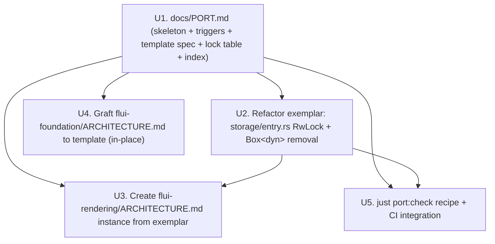

# feat: Flutter → FLUI port methodology playbook

## Summary

Implement the Flutter → FLUI port methodology as three coordinated artifacts plus a verification recipe: a top-level `docs/PORT.md` (refusal triggers, lock-decision table, per-crate template specification, doc index); an exemplar refactor of `crates/flui-rendering/src/storage/entry.rs` that eliminates the `RwLock<Box<dyn RenderObject<P>>>` hot-path violation by adopting the lock-free pattern already in place at `crates/flui-rendering/src/storage/state.rs`; the first per-crate `ARCHITECTURE.md` template instance grafted onto `flui-rendering` documenting that refactor; a graft of the existing `crates/flui-foundation/ARCHITECTURE.md` onto the template; and a `just port:check` grep regression recipe wired into the workspace `justfile`.

---

## Problem Frame

The brainstorm (see origin) established that ~65-75% of the Flutter surface is already ported, but the port has accumulated friction shapes that violate the strategy's own constraints — most acutely the `RwLock<Box<dyn RenderObject<P>>>` field on the hot-path storage type at `crates/flui-rendering/src/storage/entry.rs:46`, whose `layout()` method takes `self.render_object.write()` inside the layout call. Without an executable methodology, future ports and refactor passes will repeat the same shape because the rules for Dart → Rust translation are tacit. This plan turns those tacit rules into concrete artifacts and a verification recipe so the solo maintainer can refuse the same patterns at write time and downstream agents (`/aif-implement`, `ce-work`) can pick up from `Outstanding refactors` without a fresh brainstorm.

---

## Requirements

- R1. Methodology is authored and consumed by the solo maintainer (A1); external-contributor onboarding and agent-only consumption are out of scope.
- R2. Three coordinated artifacts ship: the refactored exemplar in `flui-rendering`, a per-crate `ARCHITECTURE.md` template applied to active crates, and a top-level `docs/PORT.md` index.
- R3. `docs/PORT.md` does NOT duplicate per-crate detail; it indexes the per-crate `ARCHITECTURE.md` files and lists refusal triggers plus shared mapping rules, deferring to `.specify/memory/constitution.md` and `.ai-factory/ARCHITECTURE.md` for already-codified anti-patterns.
- R4. The exemplar is a refactor of an existing friction zone in `flui-rendering`, not a fresh port.
- R5. The exemplar is `crates/flui-rendering/src/storage/entry.rs` (the `RwLock<Box<dyn RenderObject<P>>>` violation). The maintainer-decision to pick this specific candidate from the brainstorm's two options is recorded in Key Technical Decisions.
- R6. Decisions taken during the exemplar refactor are recorded in `crates/flui-rendering/ARCHITECTURE.md` in the same commit as the code change.
- R7. The per-crate `ARCHITECTURE.md` template has five fixed sections — expanded from origin's four by promoting `## Thread safety` to mandatory: `## Flutter source mapping`, `## Mapping decisions`, `## Thread safety` (lock-decision table per crate, newly mandatory; lifted from `crates/flui-interaction/docs/ARCHITECTURE.md` precedent so every templated crate must declare its locks and rationale), `## Friction log`, `## Outstanding refactors`. The promotion rationale is recorded under Key Technical Decisions. Optional sections may be added per crate.
- R8. Crates adopt the template incrementally as a port or refactor touches them; no workspace-wide big-bang sweep in this plan.
- R9. The three existing port-flavoured docs (`crates/flui-foundation/ARCHITECTURE.md`, `crates/flui-rendering/flutter-rendering-hierarchy.md`, `crates/flui-view/UNIFIED_ELEMENT.md`) are integrated into the template in place. `flutter-rendering-hierarchy.md` remains as a sibling appendix linked from `crates/flui-rendering/ARCHITECTURE.md`.
- R10. The initial refusal-trigger list in `docs/PORT.md` contains all six items from the brainstorm: `RwLock` field on a type used inside `perform_layout`/`paint`; `Box<dyn RenderObject<_>>` stored in render-tree storage hot path; `async fn` on `View::build`, `RenderObject::layout`, `RenderObject::paint`; `Mutex` on dirty-list state mutated during the build/layout/paint cycle; `Arc::clone` performed inside the per-frame paint loop on a per-render-object basis; recursive `Box<dyn View>` stored in element child collections. Forward-looking triggers (zero current production violations) are labelled as such.
- R11. Refusal triggers grow reactively — a new entry is added only when an anti-pattern is caught in review.
- R12. A refusal trigger is promoted from doc-only to a clippy lint only after the same pattern has been caught at least twice in review. The first-promotion mechanism is a `[workspace.lints.clippy]` deny entry in the root `Cargo.toml` (not `dylint`, not a dedicated `crates/flui-lints/`).
- R13. Flutter semantics primacy on Dart ↔ Rust conflicts (per origin and `STRATEGY.md` "behavior loyal, structure Rust-native") — with the carve-out that a Flutter binding may be deleted, not ported, when a Rust-native crate stack already owns the responsibility. The carve-out is grounded in the `PlatformTextSystem` removal precedent (see `docs/plans/2026-03-31-platform-roadmap.md`).
- R14. Compile-time over runtime where both express the same constraint (arity, typestate, sealed traits required).
- R15. `async fn` is forbidden in the render hot path; permitted only at IO, scheduler, and build-pipeline boundaries.

**Origin actors:** A1 (solo maintainer `vanyastaff`), A2 (implementation agent: Claude Code in `/aif-implement`).
**Origin flows:** F1 (port a fresh Flutter file), F2 (refactor an existing friction zone), F3 (extend refusal triggers).
**Origin acceptance examples:** AE1 (covers R4, R5, R6 — exemplar refactor), AE2 (covers R10, R11, R12 — trigger growth + lint promotion), AE3 (covers R13 — Flutter FSM preserved), AE4 (covers R15 — async-in-build rejected).

---

## Scope Boundaries

- Codemod or AST-driven migration tooling — rejected; carrying cost > gain at solo-maintainer scale.
- External-contributor onboarding doc or `CONTRIBUTING.md` expansion — different consumer; separate brainstorm if needed.
- Roadmap and re-enable ordering of currently disabled crates (`flui-animation`, `flui-reactivity`, `flui-devtools`, `flui-cli`, `flui-build`) — separate sequencing brainstorm.
- Upfront custom `dylint` plugin or dedicated `crates/flui-lints/` crate — reactive per R12.
- Full widget catalog API surface specification — separate brainstorm.
- Any methodology entry legitimising `async fn` on the render hot path — strategy clause excludes.
- Heavy methodology-supporting dependencies (`tree-sitter`, large `syn` analyzers, custom doc generators) — strategy clause "heavy dep tree" rejects.

### Deferred to Follow-Up Work

- CLAUDE.md drift fix: CLAUDE.md still lists `flui-rendering`, `flui-view`, `flui-app`, `flui-hot-reload` as disabled while `AGENTS.md`/`docs/crates.md` correctly mark them active. Separate housekeeping PR.
- Workspace-wide sweep of all per-crate `ARCHITECTURE.md` files onto the template — incremental per R8; subsequent ports/refactors apply the template as they touch each crate.
- Relocating the four `crates/<crate>/docs/ARCHITECTURE.md` files (`flui-painting`, `flui-animation`, `flui-assets`, `flui-interaction`) to the crate root per the `AGENTS.md:111` convention — separate doc-tidying PR. This plan does not touch them.
- Applying the playbook to `flui-animation` re-enable as a second exemplar — separate plan keyed off the animation re-enable brainstorm.
- Formalising the "Accepted trade-offs" exception template from `docs/plans/2026-03-31-custom-render-callback-design.md` as a reusable per-crate `ARCHITECTURE.md` sub-section — used informally in this plan, formalised when a second exception appears.

---

## Context & Research

### Relevant Code and Patterns

- `crates/flui-rendering/src/storage/entry.rs` lines 46, 236-253 — the `RwLock<Box<dyn RenderObject<P>>>` violator and its `layout()` method that takes `self.render_object.write()` inside the layout call. The exemplar's target.
- `crates/flui-rendering/src/storage/state.rs` lines 23-28 — positive exemplar already in the same crate. `AtomicRenderFlags` + `OnceCell` + `AtomicOffset`. Module docstring: "Atomic flags for lock-free dirty tracking (10x faster than RwLock)." The exemplar refactor mirrors this pattern.
- `crates/flui-rendering/src/storage/tree.rs` lines 182, 191, 204, 227, 500 — insertion API (`insert_box`/`insert_sliver`) that accepts `Box<dyn RenderObject<_>>` as funnel. The bare `Box<dyn RenderObject<_>>` constructor signatures at the insertion boundary are a legitimate funnel; only the stored-under-`RwLock` shape is the refusal-trigger target.
- `crates/flui-rendering/src/storage/node.rs` lines 52-91, 342-355 — `RenderNode` enum constructors and `box_render_object()` / `box_render_object_mut()` re-exports that propagate lock guards. Blast radius for the exemplar.
- `crates/flui-rendering/src/pipeline/owner.rs` lines 831, 886, 953 — paint-loop hot-path call sites that consume the guard. Must continue to compile and behave identically after the refactor.
- `crates/flui-view/src/element/behavior.rs:453` — view → render boundary, `From<Box<dyn RenderObjectTrait<P>>>` constraint. Funnel from `flui-view`; may need signature adjustment but constructor surface stays.
- `crates/flui-interaction/docs/ARCHITECTURE.md` — precedent for per-crate Thread Safety table format (FocusManager / GestureArena / HitTestResult / recognizers with lock kind + rationale). Lifted into the per-crate template as `## Thread safety`.
- `crates/flui-foundation/ARCHITECTURE.md` — existing port-flavoured doc with Flutter walk + Architecture Decision Summary. Graft target for R9; add the missing `## Friction log` + `## Outstanding refactors` sections without rewriting body.
- `crates/flui-rendering/flutter-rendering-hierarchy.md` — Flutter class hierarchy dump (1352 LOC). Stays as sibling appendix, linked from the new `crates/flui-rendering/ARCHITECTURE.md`.
- `crates/flui-view/UNIFIED_ELEMENT.md` — element behaviour taxonomy. Linked from the future `crates/flui-view/ARCHITECTURE.md` when that crate is templated (out of this plan's scope — R8 incremental rule).
- `justfile` lines 1-30 — recipe layout with `[group("...")]` annotations. The `port:check` recipe adopts the same grouping convention under a new `[group("lint")]` (or appended to an existing group if one fits).
- `Cargo.toml` lines 179-198 — `[workspace.lints]` block already in place with `clippy::all` + `clippy::pedantic` at warn. The R12 first-promotion mechanism adds a `deny` entry here when fired.
- `deny.toml` (root) — existing `cargo-deny` config with `[advisories]`, `[licenses]`, and a populated `[bans]` section at lines 86-112 (dependency-level bans: `multiple-versions`, `wildcards`, explicit `deny = [...]` list). Not used for refusal-trigger enforcement in this plan because `cargo-deny[bans]` operates at the crate-dependency level while the refusal triggers operate at the language/AST level — different vocabularies. The existing `[bans]` section is unaffected.

### Institutional Learnings

- `STRATEGY.md` (dated 2026-05-19) — port-not-redesign rationale, Bun precedent ([oven-sh/bun#30412](https://github.com/oven-sh/bun/pull/30412)), three architectural rules (behavior loyal / compile-time over runtime / sync hot path). Source for R13-R15.
- `.specify/memory/constitution.md` (v2.2.0) — anti-pattern list already codifies "no `Arc<Mutex<>>` for tree structures", "no `dyn Widget` without justification", "no Dart-to-Rust transliteration". Refusal triggers in this plan are refinements that cite the constitution, not new rules.
- `.ai-factory/ARCHITECTURE.md` — full anti-pattern list with code examples (e.g., `RenderBad { children: Vec<Box<dyn RenderObject>> }` labelled forbidden). `docs/PORT.md` indexes this rather than restating.
- `docs/plans/2026-03-31-core-crates-hardening.md` Task 7 — established the precedent that `RwLock` on shared infrastructure (`PipelineOwner`) is allowed and even *added* in a soundness fix (replacing a raw pointer with `Weak<RwLock<PipelineOwner>>`), while `RwLock` *inside* per-RenderObject storage is forbidden. The lock-decision table in `docs/PORT.md` codifies this categorisation.
- `docs/plans/2026-03-31-platform-roadmap.md` Task 1 — `PlatformTextSystem` was deleted rather than ported because cosmic-text + glyphon + flui-assets already own the responsibility. Source for the R13 carve-out (binding deletion when Rust crate stack already owns).
- `docs/plans/2026-03-31-custom-render-callback-design.md` — canonical justified `Box<dyn>` exception (`ErasedCallback` for user-defined render callbacks). "Accepted trade-offs" format used informally in `crates/flui-rendering/ARCHITECTURE.md` Mapping decisions entries when an exception is needed.
- `docs/plans/2026-03-31-engine-hardening.md` — precedent for multi-source citation (GPUI, Makepad, Iced, Vello, Skia). The per-crate template's `## Mapping decisions` section accepts references to any of these reference codebases, not Flutter only.

### External References

None — local research is sufficient. The methodology is internal-tooling work and builds on existing in-repo patterns; the Bun precedent is the only external anchor and is already cited in `STRATEGY.md`.

---

## Key Technical Decisions

- **Exemplar selection — `crates/flui-rendering/src/storage/entry.rs:46` over `crates/flui-view/src/view/root.rs:482,489`:** the entry.rs violation activates both R10 trigger #1 (`RwLock`) and trigger #2 (`Box<dyn RenderObject<_>>` in storage) on a single line, gives the playbook its highest-value demonstration of the lock-free pattern, and has an in-crate positive precedent in `state.rs`. The `root.rs` `unimplemented!()` is a self-contained migration with smaller scope; queued as an Outstanding refactor.
- **`## Thread safety` as a fixed template section, not optional:** the 62 `RwLock` sites surfaced by research require per-crate triage. Lifting `crates/flui-interaction/docs/ARCHITECTURE.md`'s table format into the template forces every templated crate to declare which locks are present and why.
- **Lock-decision categorisation in `docs/PORT.md`:** two categories — "Shared infrastructure / setup-time (allowed)" covers `PipelineOwner`, `ElementTree`, `BuildOwner`, `WidgetsBinding`, route plumbing, listener lists, process-wide singletons (`static ERROR_VIEW_BUILDER`), and the `Weak<RwLock<PipelineOwner>>` back-references; "Per-node storage / in-loop mutation (forbidden)" covers `RenderEntry.render_object` and any future analogue. The full categorisation is captured as a table in `docs/PORT.md` with file:line citations so reviewers can spot-check.
- **`BuildContext` and `element_build_context.rs` lock usage flagged as latent friction, not in-scope:** `Arc<RwLock<ElementTree>>` and `Arc<RwLock<BuildOwner>>` are build-phase (not layout/paint); R10 trigger #1 is intentionally scoped to `perform_layout`/`paint`. The `Friction log` for `flui-view` records this as a tracked-but-deferred concern.
- **R12 first-promotion target — `[workspace.lints.clippy]` in `Cargo.toml`:** zero new infrastructure (the block exists already), zero new dependencies, fits constitution's strict-clippy baseline. `dylint` and a dedicated `crates/flui-lints/` crate are heavier than the first promotion warrants and stay deferred.
- **Verification via `just port:check` grep recipe, not custom lint:** R12 keeps lints reactive. Pre-lint verification is a discoverable check the maintainer runs on demand and CI can call optionally. The recipe documents the exact grep patterns the refusal-trigger doc entries describe, so a violation found in CI references the same regex the doc says is forbidden.
- **`flutter-rendering-hierarchy.md` kept as sibling appendix, not folded into `ARCHITECTURE.md`:** 1352 LOC of Flutter class dump would drown the templated sections. The new `crates/flui-rendering/ARCHITECTURE.md` links to it from `## Flutter source mapping` as a navigational pointer.
- **R13 carve-out — binding deletion when Rust crate stack already owns:** added explicitly so AE3 does not ossify Flutter bindings already removed (e.g., `PlatformTextSystem`). The carve-out is named in `docs/PORT.md` under `## Mapping rules` with the platform-roadmap citation.
- **Multi-source references in `## Mapping decisions`:** per-crate docs may cite `.flutter/`, `.gpui/`, Iced, Makepad, Vello, Skia. Not Flutter-only.
- **`docs/PORT.md` slots into `docs/architecture.md` nav between `architecture.md` and `crates.md`:** matches the existing footer nav convention (`[← Prev] · [Back to README] · [Next →]`).

---

## Open Questions

### Resolved During Planning

- "Markdown shape of the `ARCHITECTURE.md` template (frontmatter? ToC? merging `## Friction log` and `## Outstanding refactors`?)" — resolved: no frontmatter (matches `crates/flui-foundation/ARCHITECTURE.md`), no required ToC (rendered by editor/repo viewer), `## Friction log` and `## Outstanding refactors` kept separate (the first is descriptive — what is broken now; the second is prescriptive — what to fix next).
- "Of the 62 `RwLock` sites, which are hot-path violations?" — resolved: exactly one (`crates/flui-rendering/src/storage/entry.rs:46`). All others are shared infrastructure / setup-time and are documented as the "allowed" category in `docs/PORT.md`. Detailed file:line list lives in Context & Research → Relevant Code and Patterns.
- "Mechanism for the first clippy lint when needed" — resolved: `[workspace.lints.clippy]` deny entry in root `Cargo.toml`. `dylint`/`cargo-deny[bans]` deferred.
- "Where does `docs/PORT.md` live in the docs nav?" — resolved: between `docs/architecture.md` and `docs/crates.md` in the footer nav.

### Deferred to Implementation

- **Exact replacement shape for `RenderEntry.render_object`** — the lock-free pattern requires choosing between (a) `OnceCell<Box<dyn RenderObject<P>>>` (single-write-then-read; matches `state.rs` precedent if mutation can be moved out), (b) an arity-keyed enum of concrete render-object variants (compile-time dispatch; eliminates `Box<dyn>` entirely but requires the trait → enum translation per arity), or (c) a `Cell<RenderObjectId>` indirection where the actual object lives in a separate arena keyed by id. The choice depends on what the existing `layout()` mutation path actually needs to mutate, which is best discovered by reading the call graph at refactor time. Recorded as a U2 implementation-time question with characterization-tests gating the choice.
- **Exact `just port:check` recipe shape on Windows** — `justfile` already has `set windows-shell := ["powershell.exe", ...]` (line 8). The grep recipes need PowerShell-compatible syntax (`Select-String` or piped `rg` if available). Resolution at U5 implementation time; both `bash` and PowerShell branches may be needed.
- **Whether `crates/flui-view/src/element/child_storage.rs` `Box<dyn View>` parameter signatures count as the R10 trigger #6 violation, or only the stored fields** — the trigger wording says "stored in element child collections." Reading the implementations at refactor time will clarify whether transient parameters count. Recorded for the future `flui-view` `ARCHITECTURE.md` templating; not blocking this plan.

---

## High-Level Technical Design

> *This illustrates the intended approach and is directional guidance for review, not implementation specification. The implementing agent should treat it as context, not code to reproduce.*

**Dependency graph across implementation units:**



**Lock-decision matrix (becomes a table in `docs/PORT.md`):**

| Site | Category | Disposition |
| --- | --- | --- |
| `RenderEntry.render_object` (`storage/entry.rs:46`) — per-node storage, locked inside `layout()` | Per-node storage / in-loop mutation | **Forbidden** (R10 trigger #1, #2) — exemplar target |
| `PipelineOwner` parents / shared (`pipeline/owner.rs`, `storage/tree.rs`, `view/root.rs`, `binding.rs`, `view/render_view.rs`) | Shared infrastructure / setup-time | Allowed — soundness rewrite precedent (`core-crates-hardening` Task 7) |
| `ViewportOffset` listener lists (`view/viewport_offset.rs`) | Listener registry, not on layout/paint | Allowed |
| `BuildContext` tree/owner refs (`element_build_context.rs`) | Build phase, not layout/paint | Allowed; flagged as latent friction in `flui-view` `Friction log` (out-of-scope here) |
| `MouseTracker` maps (`input/mouse_tracker.rs`) | Tracker state, not on layout/paint | Allowed |
| `static ERROR_VIEW_BUILDER` (`view/error.rs:40`) | Process-wide singleton | Allowed |
| `image cache + listeners` (`flui-painting/src/binding.rs`) | Off the recording hot path | Allowed |

The recipe set in `just port:check` mirrors the six refusal-trigger entries. Each recipe runs a `rg`/`Select-String` invocation scoped to the relevant crates and a whitelist of acceptable file paths; a match outside the whitelist exits non-zero with a pointer to `docs/PORT.md#refusal-triggers`.

---

## Implementation Units

### U1. Author `docs/PORT.md` (skeleton, refusal triggers, lock-decision table, template spec, index)

**Goal:** ship the top-level methodology index and template specification so subsequent units have a single artifact to instantiate against.

**Requirements:** R1, R2, R3, R7, R10, R11, R12, R13, R14, R15.

**Dependencies:** none.

**Files:**
- Create: `docs/PORT.md`
- Modify: `docs/architecture.md` — update existing footer nav `[← Getting Started] · [Back to README] · [Crates Map →]` so the `Crates Map →` link points through `docs/PORT.md` (e.g., change to `[Port →]`).
- Modify: `docs/crates.md` — update existing footer nav `[← Architecture] · [Back to README] · [Testing →]` so the back-link reflects the new chain (e.g., change `← Architecture` to `← Port`).
- The new `docs/PORT.md` opens with its own footer line `[← Architecture] · [Back to README] · [Crates Map →]` matching the existing chain shape.

**Approach:**
- Section layout: `## Refusal triggers` (six entries, each with rule + one-line rationale + back-reference to constitution/`.ai-factory/ARCHITECTURE.md` where applicable + on-disk regex the `just port:check` recipe uses) → `## Lock decisions` (the table from High-Level Technical Design) → `## Mapping rules` (Flutter primacy with R13 carve-out, compile-time over runtime, sync hot path, multi-source reference scope) → `## Per-crate ARCHITECTURE.md template` (the five fixed sections + guidance on optional sections + graft instructions for existing port docs) → `## Index` (links to per-crate `ARCHITECTURE.md` files, current state of each, plus links to `.specify/memory/constitution.md`, `.ai-factory/ARCHITECTURE.md`, `STRATEGY.md`).
- Forward-looking triggers (4, 5 — `Mutex` on dirty lists, `Arc::clone` in per-frame paint loop) are labelled "Forward-looking — no current production violations; enforced on introduction." This avoids false-positive perception when readers cross-reference the code.
- The R13 carve-out is a named sub-bullet under `## Mapping rules`, citing `docs/plans/2026-03-31-platform-roadmap.md` Task 1 and naming the test of fit: "If a Rust-native crate stack already owns the responsibility end-to-end (e.g., cosmic-text + glyphon + flui-assets for text rendering), the Flutter binding is deleted, not ported."
- `## Index` entry for `crates/flui-rendering/ARCHITECTURE.md` is added as a placeholder ("⏳ U3 will populate") to be replaced by U3.

**Patterns to follow:**
- Section ordering mirrors `crates/flui-foundation/ARCHITECTURE.md` shape (top-down, narrative-to-table).
- Footer nav matches `docs/architecture.md` and `docs/contributing.md` convention.

**Test scenarios:**
- Integration scenario (Covers R3): a reader on `docs/PORT.md` can navigate to the constitution anti-pattern list in two clicks (`## Mapping rules` link → constitution) without `docs/PORT.md` restating the rule body.
- Integration scenario: forward-looking triggers (4, 5) are visually distinguished from active triggers (e.g., a `🔮` glyph or a "Forward-looking" tag) so the reader knows zero current violations is expected.
- Test expectation: no behavioural tests. Manual review against the brainstorm Acceptance Examples is the primary check.

**Verification:**
- Every refusal trigger in the file maps 1:1 to one of the six items in origin R10.
- The lock-decision table file:line citations resolve in the current workspace.
- The footer nav line in `docs/PORT.md` matches the existing convention character-for-character (chevron arrows, spacing).
- `docs/architecture.md` nav entry to `docs/PORT.md` is reachable from `docs/getting-started.md` via the existing footer chain.

---

### U2. Refactor exemplar — eliminate `RwLock<Box<dyn RenderObject<P>>>` from `RenderEntry`

**Goal:** remove the R10 trigger #1 + #2 violation at `crates/flui-rendering/src/storage/entry.rs:46` while preserving observed behaviour of every existing `flui-rendering` and `flui-view` test.

**Requirements:** R4, R5, R6, R10, R13, R14.

**Dependencies:** U1 (the refusal triggers and lock-decision table must be authored first so the refactor commit can cite them).

**Files:**
- Modify: `crates/flui-rendering/src/storage/entry.rs` (the violator, lines 46-253)
- Modify: `crates/flui-rendering/src/storage/node.rs` (constructors at 52-91, accessors at 342-355)
- Modify: `crates/flui-rendering/src/storage/tree.rs` (insertion API at 182, 191, 204, 227, 500)
- Modify: `crates/flui-rendering/src/pipeline/owner.rs` (paint-loop call sites at 831, 886, 953)
- Modify: `crates/flui-rendering/src/traits/render_object.rs` (trait bound at 274 if the From conversion changes)
- Modify: `crates/flui-view/src/element/behavior.rs` (`From<Box<dyn RenderObjectTrait<P>>>` at 453 if the boundary signature changes)
- Test: `crates/flui-rendering/tests/*` plus per-module `#[cfg(test)] mod tests` blocks in the modified files

**Approach:**
- Open with a characterization pass: enumerate every public path that takes `box_render_object()` / `box_render_object_mut()` (research located these at `pipeline/owner.rs:831, 886, 953` and `storage/node.rs:342, 351`). Capture the existing behaviour — particularly that `layout()` at `entry.rs:236-253` holds a write lock across `perform_layout()` — in a test fixture that exercises a multi-child render tree through one paint cycle. This test fixture stays after the refactor as a regression guard.
- The replacement shape is decided at implementation time per the Open Questions deferred item; the three candidates (`OnceCell<Box<dyn>>`, arity-keyed enum, `RenderObjectId` indirection) are evaluated against the captured behaviour. The choice is justified inline in `crates/flui-rendering/ARCHITECTURE.md` (U3) — same commit per R6.
- The `state` field at `entry.rs:49` is already lock-free; the new shape for `render_object` mirrors its discipline (atomics / `OnceCell` / id-keyed lookup). Cite `state.rs:23-28` module docstring ("10x faster than RwLock") as the in-crate precedent in the U3 Mapping decisions entry.
- Insertion-funnel signatures (`insert_box`, `insert_sliver` at `tree.rs:182-500`) may keep `Box<dyn RenderObject<_>>` as the parameter type — the violation is *stored* shape, not transient construction. The shape transformation happens inside `RenderEntry::new` / equivalent.

**Execution note:** characterization-first. Before any production change, land a regression test fixture that captures current observable behaviour of `RenderEntry::layout()` through a multi-child paint cycle so the refactor has a behavioural pin.

**Technical design:**

> *Directional guidance, not implementation specification.*

```text
RenderEntry<P> { render_object: RwLock<Box<dyn RenderObject<P>>>, state, links }
        │
        ▼  (refactor)
RenderEntry<P> { render_object: <lock-free shape — chosen at impl time>, state, links }

Hot path callers (must keep compiling, unchanged semantics):
  pipeline/owner.rs:831  paint_node_recursive  → reads
  pipeline/owner.rs:886  paint_node_recursive  → reads
  pipeline/owner.rs:953  set_was_repaint_boundary → mutates
  entry.rs:236-253       layout() → mutates inside perform_layout

Funnel (parameter shape OK to keep):
  tree.rs:182, 191, 204, 227, 500  insert_box / insert_sliver
  flui-view/element/behavior.rs:453  From<Box<dyn RenderObjectTrait<P>>>
```

**Patterns to follow:**
- `crates/flui-rendering/src/storage/state.rs` — `AtomicRenderFlags`, `OnceCell`, `AtomicOffset` (the canonical in-crate lock-free shape).
- `docs/plans/2026-03-31-core-crates-hardening.md` Task 7 — "use safe abstraction instead of unsafe" rewrite mode (precedent for behaviour-preserving structural refactors).
- `docs/plans/2026-03-31-custom-render-callback-design.md` — review-round + accepted-trade-off note format for the U3 Mapping decisions entry justifying the chosen replacement shape.

**Test scenarios:**
- Happy path (Covers R4): a multi-child render tree (`RenderFlex` with three `RenderColoredBox` children) completes one full pipeline cycle (mark dirty → layout → paint) without panic and produces identical paint output (display-list comparison) before and after the refactor.
- Happy path: `RenderEntry::layout()` mutates the inner render object's geometry (size, offset) and the post-layout query returns the mutated values, matching pre-refactor behaviour bit-for-bit.
- Edge case: `RenderEntry` constructed but never laid out is dropped cleanly — no leaks, no double-free, no remaining strong references that would block arena reuse.
- Edge case: concurrent `paint_node_recursive` reads from `pipeline/owner.rs:831, 886` against an in-flight `set_was_repaint_boundary` mutation at line 953 still serialise correctly under the new shape — the previous `RwLock` invariant of "many readers OR one writer" is preserved by whatever lock-free / single-writer discipline replaces it.
- Error path: invalid replacement-shape consumption (e.g., reading a not-yet-initialised `OnceCell` if that's the chosen shape) returns a typed `RenderError`, not a panic — preserves R10's no-`unwrap` discipline.
- Integration (Covers AE1): after the refactor, `rg "RwLock<Box<dyn RenderObject" crates/flui-rendering crates/flui-view -t rust` returns zero matches; `rg "RwLock<Box<dyn RenderObject" crates/flui-rendering/src/storage/entry.rs -t rust` returns zero matches.
- Integration: every existing `cargo test -p flui-rendering` and `cargo test -p flui-view` test continues to pass with no test code modifications (a behaviour-preserving refactor by definition).

**Verification:**
- `cargo test -p flui-rendering` and `cargo test -p flui-view` both green.
- `cargo clippy -p flui-rendering -p flui-view -- -D warnings` clean.
- The grep regression from AE1 (`rg "RwLock<Box<dyn RenderObject" crates/flui-rendering crates/flui-view -t rust`) returns zero matches.
- `crates/flui-rendering/ARCHITECTURE.md` (U3, same commit) records the chosen replacement shape with rationale, per R6.

---

### U3. Create `crates/flui-rendering/ARCHITECTURE.md` instance documenting U2

**Goal:** ship the first per-crate `ARCHITECTURE.md` template instance, documenting the U2 refactor and recording the lock-decision categorisation for `flui-rendering` in template-compliant shape.

**Requirements:** R2, R6, R7, R9.

**Dependencies:** U1 (the template spec), U2 (the refactor whose decisions are recorded). Co-committed with U2 per R6.

**Files:**
- Create: `crates/flui-rendering/ARCHITECTURE.md`
- (No modification to the existing `crates/flui-rendering/flutter-rendering-hierarchy.md` — kept as sibling appendix, linked from the new file's `## Flutter source mapping`.)
- (No modification to existing `crates/flui-rendering/docs/*.md` files — they remain as deeper-dive companions, not template instances.)

**Approach:**
- Five fixed sections per R7: `## Flutter source mapping` (link to `flutter-rendering-hierarchy.md` + a compact summary table of `.flutter/src/rendering/*` → `crates/flui-rendering/src/*` correspondence at directory level), `## Mapping decisions` (entry for the U2 refactor naming the chosen replacement shape with rationale citing `state.rs:23-28` precedent and the constitution's "no `Arc<Mutex<>>` for tree structures" rule; entry for the `flutter-rendering-hierarchy.md`-as-appendix decision), `## Thread safety` (table mirroring `crates/flui-interaction/docs/ARCHITECTURE.md` format — `RwLock`/`Mutex` sites in `flui-rendering` with kind + rationale + on-hot-path/off-hot-path classification, repeating the lock-decision table entries from `docs/PORT.md` that are scoped to this crate), `## Friction log` (remaining latent friction not refactored in this plan — `BuildContext` lock guards as referenced in research, any remaining `Box<dyn RenderObject<_>>` in funnels even if not stored), `## Outstanding refactors` (named items with file:line: the `flui-view/src/view/root.rs:482,489` `unimplemented!()` blockers are the canonical first entry, ready for a follow-up plan).
- The Mapping decisions entry for U2 follows the "Accepted trade-offs" shape from `docs/plans/2026-03-31-custom-render-callback-design.md` — state the rule (R10 trigger #1, #2), state the choice, state the alternatives considered, state what trade-off was accepted.
- Optional section: `## Test parity notes` — only if U2's characterization fixture surfaces a Flutter test it deliberately diverges from.

**Patterns to follow:**
- `crates/flui-foundation/ARCHITECTURE.md` — section ordering, prose tone, no frontmatter.
- `crates/flui-interaction/docs/ARCHITECTURE.md` — Thread safety table format.
- `docs/plans/2026-03-31-custom-render-callback-design.md` — Accepted trade-offs entry format for Mapping decisions.

**Test scenarios:**
- Test expectation: none — pure documentation. Manual review verifies that every required template section is present and that the Mapping decisions entry for U2 is internally consistent with the actual code shape U2 lands.
- Integration scenario: the `## Outstanding refactors` entry for `flui-view/src/view/root.rs:482,489` is detailed enough that a fresh `/aif-implement` dispatch could pick it up without out-of-band clarification — names the lines, names the migration goal, names the success criterion. Satisfies origin Success Criterion #3.

**Verification:**
- File exists at `crates/flui-rendering/ARCHITECTURE.md` (crate root, per `AGENTS.md:111`).
- All five fixed template sections present in the order specified by U1.
- `## Index` entry in `docs/PORT.md` for `flui-rendering` no longer reads `⏳ U3 will populate` — replaced by the real link and one-line state ("Current — last updated 2026-05-19, exemplar refactor landed in U2").
- The Mapping decisions entry for the U2 refactor references the same Cargo commit as the U2 code change (R6 same-commit-window verification).

---

### U4. Graft `crates/flui-foundation/ARCHITECTURE.md` onto the template

**Goal:** demonstrate the R9 graft pattern by extending the existing `flui-foundation` doc with the two missing template sections, without rewriting the existing Flutter walk or Architecture Decision Summary.

**Requirements:** R2, R7, R8, R9.

**Dependencies:** U1 (the template spec to graft against).

**Files:**
- Modify: `crates/flui-foundation/ARCHITECTURE.md`

**Approach:**
- The existing file already provides equivalents of `## Flutter source mapping` (Flutter-API reference walk) and `## Mapping decisions` (Architecture Decision Summary table). Add the missing `## Thread safety` (audit `flui-foundation`'s lock surface — research found minimal locks here; the section may be small and that is the point: an empty-by-truth table is itself a useful signal), `## Friction log` (any known shape issues from existing TODOs in `crates/flui-foundation/src/`), `## Outstanding refactors` (empty acceptable; an explicit "None at time of grafting" entry is documentation).
- Add an opening line under the title noting the graft event and date so future readers know the doc was retro-fitted to the template, not authored against it.
- Do not move the file. It already lives at crate root per `AGENTS.md:111`.
- Do not rewrite or reflow the existing body. The graft is additive only.

**Patterns to follow:**
- `crates/flui-interaction/docs/ARCHITECTURE.md` — Thread safety table format.
- `crates/flui-foundation/ARCHITECTURE.md` itself — preserve existing prose style.

**Test scenarios:**
- Test expectation: none — pure documentation graft. Manual diff review confirms the existing body is byte-for-byte unchanged outside the appended sections.
- Integration scenario (Covers R9): a reader can find the same Architecture Decision Summary at the same relative position in the file pre- and post-graft.

**Verification:**
- `git diff crates/flui-foundation/ARCHITECTURE.md` shows additions only in the new sections; no edits to the existing Flutter walk or Architecture Decision Summary.
- The new `## Thread safety` / `## Friction log` / `## Outstanding refactors` sections follow the template-defined order (after `## Mapping decisions`).
- `docs/PORT.md` `## Index` entry for `flui-foundation` updated to reflect graft state.

---

### U5. Verification recipe — `just port:check` grep regressions + optional CI hook

**Goal:** make the refusal triggers automatically checkable on demand and optionally in CI, without promoting any of them to a clippy lint (R12 reactive-only).

**Requirements:** R10, R11, R12 (negative — does not promote).

**Dependencies:** U1 (regex source-of-truth), U2 (post-refactor code is the green baseline).

**Files:**
- Modify: `justfile` — add `port:check` recipe (and `port` group if helpful) using the existing `[group("...")]` convention.
- Modify: `docs/PORT.md` — add `## Verification` section pointing to `just port:check` with usage notes.
- Optional: Modify a CI workflow under `.github/workflows/` (verify path exists) to invoke `just port:check` as a non-blocking step. If no workflow file exists yet, defer the CI hook to a follow-up and document the manual invocation only.

**Approach:**
- One `rg`/`Select-String` invocation per active refusal trigger (six total), each scoped to the relevant crate set with a whitelist file-path exclusion list for off-hot-path occurrences (the categorisation from `docs/PORT.md`'s lock-decision table). Exit non-zero on any match outside whitelist.
- Cross-platform discipline: `justfile` already declares `set shell := ["bash", "-euo", "pipefail", "-c"]` and `set windows-shell := ["powershell.exe", ...]`. Branch the recipe body or use a tool (`rg` is cross-platform) that works under both.
- Output on violation: print the offending file:line plus the matching refusal-trigger ID and a link-style reference to `docs/PORT.md#refusal-triggers`. This closes the loop — the violation message points the reviewer at the exact rule they violated.
- Forward-looking triggers (4, 5 — `Mutex` on dirty lists, `Arc::clone` in per-frame paint loop) included in the recipe set; their current expected count is zero, so any match is by definition new.
- The recipe is NOT added to `just ci` by default; add a one-line note in the new `## Verification` section of `docs/PORT.md` saying "Run before each PR touching `flui-rendering` or `flui-view`."

**Patterns to follow:**
- Existing `justfile` group/recipe layout.
- The lock-decision table in `docs/PORT.md` (U1) for the whitelist file-path lists.

**Test scenarios:**
- Happy path: `just port:check` on the post-U2 baseline exits 0 — no current violations.
- Edge case (Covers AE2 negative direction): introduce a deliberate violation in a scratch test file (e.g., `crates/flui-rendering/src/__port_check_self_test.rs` declaring `let _: RwLock<Box<dyn RenderObject<_>>> = ...;`) and verify `just port:check` exits non-zero, prints the violating file:line, and references the correct refusal-trigger ID. Then delete the scratch file.
- Edge case: the whitelist correctly excludes `crates/flui-rendering/src/pipeline/owner.rs` `Arc<RwLock<PipelineOwner>>` references (the soundness-rewrite precedent) — the recipe does not flag them.
- Integration: on Windows, the PowerShell branch of the recipe produces the same exit semantics as the bash branch (zero on clean, non-zero on violation, identical messaging).
- Integration: when run from CI (if hook lands), the recipe completes in <10 seconds against the full workspace — six `rg` passes over ~21 crates is well under that budget.

**Verification:**
- `just port:check` runs cleanly on `main` after U2 lands.
- `just port:check` produces a useful error on a self-introduced regression (positive negative-test).
- The recipe is documented in `docs/PORT.md` under `## Verification` with the exact `just` command and an example output line.
- The recipe is NOT promoted to `just ci` (R12 reactive-only).

---

## System-Wide Impact

- **Interaction graph:** the U2 refactor touches the paint loop in `crates/flui-rendering/src/pipeline/owner.rs` at three call sites (831, 886, 953) and the view → render boundary in `crates/flui-view/src/element/behavior.rs:453`. Every caller of `RenderEntry::box_render_object()` / `box_render_object_mut()` recompiles; behaviour preservation is the contract.
- **Error propagation:** the lock-free replacement should preserve typed `RenderError` returns where the original `RwLock` operations could panic. New error paths (e.g., reading an uninitialised `OnceCell`) must route through `RenderError`, never `unwrap()` / `expect()`.
- **State lifecycle risks:** the U2 refactor changes how `RenderEntry` owns its inner render object. If the replacement shape requires explicit init/deinit sequencing (e.g., `OnceCell::set` once at construction), the existing mount/unmount paths in `crates/flui-rendering/src/storage/tree.rs` must call it at the right point. Characterization tests are the safety net.
- **API surface parity:** the bare `Box<dyn RenderObject<_>>` constructor signatures at `tree.rs:182, 191, 204, 227, 500` and `flui-view/element/behavior.rs:453` are deliberately left as funnels — the stored shape changes, not the transient construction shape. Public insertion API is preserved.
- **Integration coverage:** the characterization fixture from U2 stays in the test tree as a regression guard — any future change that reverts to a locked storage shape breaks it.
- **Unchanged invariants:** the arity system (`Leaf`/`Single`/`Optional`/`Variable`), the `NonZeroUsize` ID offset pattern, the `Protocol` generic on `RenderEntry<P>`, the `ambassador` delegation surface, and the constitution's "Strict crate dependency DAG" are explicitly not touched by this plan. The exemplar refactor is local to the storage type.
- **Unsafe-impl soundness narrative:** `crates/flui-rendering/src/storage/tree.rs:498-503` carries `unsafe impl Send for RenderTree {}` and `unsafe impl Sync for RenderTree {}` whose justification ("RenderNode contains Box<dyn RenderObject> which is Send + Sync") rests on the current `Box<dyn>` + `RwLock` shape providing the interior-mutability-with-Sync invariant. The U2 refactor must re-establish this safety narrative under the chosen replacement shape (e.g., `OnceCell` carries Sync only when `T: Sync`; a custom cell with `UnsafeCell` would change the invariant entirely). U2 verification includes updating the `unsafe impl` comment block to reflect the new shape's safety argument.

---

## Risks & Dependencies

| Risk | Mitigation |
| --- | --- |
| U2's replacement shape choice changes more than just `RenderEntry` — the lock-free shape may require touching `state.rs` or `node.rs` invariants in ways not yet foreseen. | Characterization-first execution (U2 Execution note). Land regression fixture before refactor. If the chosen shape's blast radius exceeds the listed Files set, U2 stops and the plan is updated rather than expanding silently. |
| Doc graft of `flui-foundation/ARCHITECTURE.md` (U4) accidentally mutates existing prose. | `git diff` discipline in U4 verification; explicit "no body edits" rule in the Approach. |
| `just port:check` (U5) produces false positives because the whitelist is incomplete. | Whitelist is sourced from the U1 lock-decision table, which itself is sourced from the research file:line list. Self-correcting: a false positive surfaces a missing whitelist entry, which is fixed in `docs/PORT.md` and propagated to the recipe. |
| Cross-platform recipe shape (bash vs PowerShell) under `justfile` `set shell` / `set windows-shell` discipline. | `rg` is cross-platform; use it as the primary engine. If a recipe truly needs branching, split into `port:check-unix` and `port:check-windows` with `port:check` dispatching by platform. |
| The R12 first-promotion mechanism choice (workspace `[workspace.lints.clippy]`) cannot express a clippy rule that catches the violation a future trigger needs (e.g., "field of type `RwLock<X>` where X is a trait object"). | When that limitation is hit, the trigger remains in `docs/PORT.md` + `just port:check`; promotion is deferred until clippy / `dylint` / `cargo-deny[bans]` actually supports the shape. The R12 rule does not commit to "must be a lint" — only "promote when caught twice." |
| CLAUDE.md drift confuses downstream `/aif-implement` agents that read it as authoritative. | Out of scope here (Deferred to Follow-Up Work). The plan does not silently fix CLAUDE.md, but Risks calls it out so the follow-up doesn't fall through. |

---

## Documentation / Operational Notes

- `docs/PORT.md` is the durable artifact for the methodology; it lives in the same nav chain as `docs/architecture.md` and `docs/crates.md`. New per-crate `ARCHITECTURE.md` files are linked from its `## Index` section.
- `AGENTS.md` already declares the per-crate `ARCHITECTURE.md` convention at line 111. No change needed there.
- `crates/flui-rendering/docs/*.md` (deeper architecture write-ups) and `crates/flui-rendering/migration/*.md` are unaffected; they remain as companion docs to the new `ARCHITECTURE.md` instance.
- `STRATEGY.md` and `.specify/memory/constitution.md` v2.2.0 are the cited upstream sources. If either changes, refusal triggers in `docs/PORT.md` are re-examined against the new clauses.
- The `just port:check` recipe is documented under `docs/PORT.md` `## Verification`. No separate runbook needed for solo-maintainer scale.

---

## Sources & References

- **Origin document:** [docs/brainstorms/flutter-port-methodology-requirements.md](docs/brainstorms/flutter-port-methodology-requirements.md)
- **Strategy and constitution:** [STRATEGY.md](STRATEGY.md), [.specify/memory/constitution.md](.specify/memory/constitution.md), [.ai-factory/ARCHITECTURE.md](.ai-factory/ARCHITECTURE.md)
- **Workspace truth:** [AGENTS.md](AGENTS.md), [docs/crates.md](docs/crates.md), [docs/architecture.md](docs/architecture.md), [docs/contributing.md](docs/contributing.md)
- **Existing port-flavoured docs (graft / link targets):** [crates/flui-foundation/ARCHITECTURE.md](crates/flui-foundation/ARCHITECTURE.md), [crates/flui-rendering/flutter-rendering-hierarchy.md](crates/flui-rendering/flutter-rendering-hierarchy.md), [crates/flui-view/UNIFIED_ELEMENT.md](crates/flui-view/UNIFIED_ELEMENT.md), [crates/flui-interaction/docs/ARCHITECTURE.md](crates/flui-interaction/docs/ARCHITECTURE.md), [crates/flui-painting/docs/ARCHITECTURE.md](crates/flui-painting/docs/ARCHITECTURE.md)
- **Refactor target and surrounding code:** [crates/flui-rendering/src/storage/entry.rs](crates/flui-rendering/src/storage/entry.rs), [crates/flui-rendering/src/storage/state.rs](crates/flui-rendering/src/storage/state.rs) (positive precedent), [crates/flui-rendering/src/storage/node.rs](crates/flui-rendering/src/storage/node.rs), [crates/flui-rendering/src/storage/tree.rs](crates/flui-rendering/src/storage/tree.rs), [crates/flui-rendering/src/pipeline/owner.rs](crates/flui-rendering/src/pipeline/owner.rs), [crates/flui-view/src/element/behavior.rs](crates/flui-view/src/element/behavior.rs)
- **Precedent plans:** [docs/plans/2026-03-31-core-crates-hardening.md](docs/plans/2026-03-31-core-crates-hardening.md) (Task 7 — `Weak<RwLock<PipelineOwner>>` rewrite), [docs/plans/2026-03-31-platform-roadmap.md](docs/plans/2026-03-31-platform-roadmap.md) (Task 1 — `PlatformTextSystem` removal; source of R13 carve-out), [docs/plans/2026-03-31-custom-render-callback-design.md](docs/plans/2026-03-31-custom-render-callback-design.md) (canonical justified `Box<dyn>` exception)
- **Build automation:** [justfile](justfile), [Cargo.toml](Cargo.toml) (workspace lints at lines 179-198 — first lint-promotion target), [deny.toml](deny.toml) (existing `cargo-deny` config, not used for trigger enforcement)
- **External anchor:** [oven-sh/bun#30412](https://github.com/oven-sh/bun/pull/30412) — Bun Zig+C++ → Rust rewrite precedent, cited in `STRATEGY.md`
