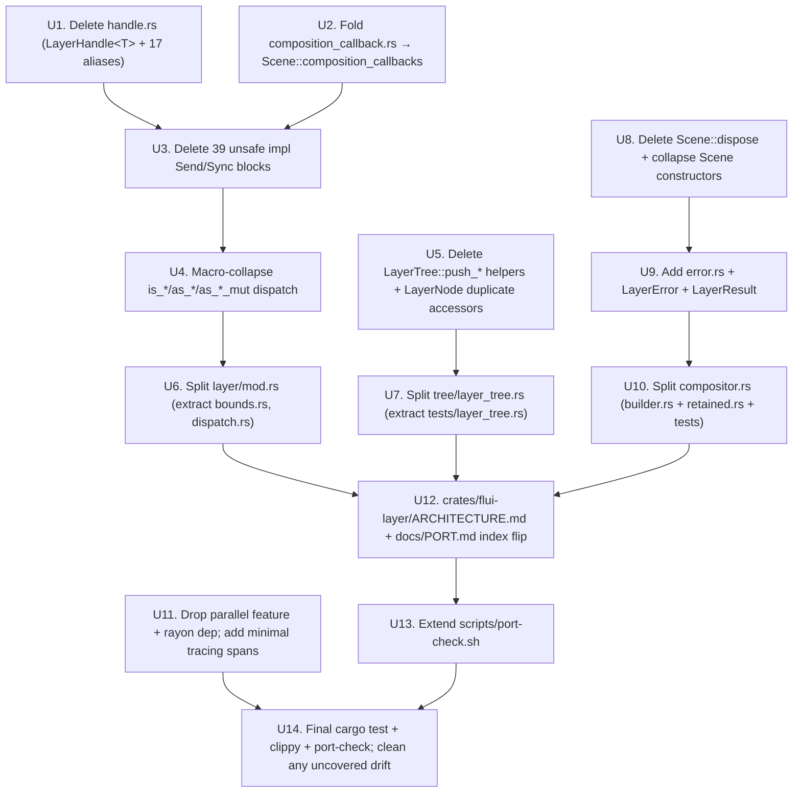

# feat: flui-layer Mythos redesign

## Summary

Execute the 14-step Mythos refactor chain on `crates/flui-layer/` (~12,202 LOC). The chain deletes one dead 467 LOC file (`handle.rs`), folds a 358 LOC composition-callback registry into `Scene`, deletes 39 unjustified `unsafe impl Send + Sync` blocks, splits three god modules (`tree/layer_tree.rs` 1660 → ~250 LOC + extracted tests; `layer/mod.rs` 1075 → ~300 LOC + extracted dispatch macro; `compositor.rs` 975 → builder/retained split), eliminates a duplicate `LayerTree::push_*` API, introduces a structured error model (`LayerError`/`LayerResult`), extends `scripts/port-check.sh` to cover the touched paths, and lands a per-crate `crates/flui-layer/ARCHITECTURE.md` template instance. Breaking ripples (`Scene::dispose` → `drop`, `SceneBuilder::pop` panic → `Result`, removed re-exports for `LayerHandle*` / `CompositionCallback*`) land in-band per the no-quick-wins memo across `flui-rendering`, `flui-engine`, `flui-app`, `flui-hot-reload`. Net unsafe delta for `flui-layer`: **−39**. Net LOC delta in the touched .rs files: ≥ 3,000 LOC reduction.

---

## Problem Frame

The brainstorm (see origin) and verdict (see verdict) establish that `flui-layer` is the next crate in the Mythos chain after `flui-rendering` (PR #77, merged commit `03774584` on `main`). Phase 1 investigation surfaced one refusal-trigger violation (`Arc<Mutex<Vec<Box<dyn Fn() + Send + Sync>>>>` in `composition_callback.rs`), 39 unjustified `unsafe impl` blocks, three god modules totalling 3,710 LOC, 467 LOC of zero-caller `LayerHandle<T>`, a 5-method `LayerTree::push_*` API that duplicates `SceneBuilder::push_*`, and one 0-impl dead trait. Without the chain, every subsequent feature (e.g. `flui-animation` re-enable adding layer types, `flui-devtools` re-enable inspecting the layer tree) inherits and possibly extends the same debt.

The plan turns the verdict's 14-step implementation plan into reviewable units U1-U14, each landing as one commit, each independently passing `cargo check --workspace`, `cargo test -p flui-layer --lib`, and `bash scripts/port-check.sh` (extended via U13 before any commits land that the check would otherwise miss).

---

## Requirements

Sourced from `docs/brainstorms/flui-layer-mythos-redesign-requirements.md`:

- **R1-R3** (Design verdict authorship) — covered upstream; the verdict at `docs/designs/2026-05-20-mythos-flui-layer-redesign.md` is the chain's source of truth and is not re-derived here.
- **R4** — Delete `LayerHandle<T>` + 17 type aliases (`handle.rs`, 467 LOC).
- **R5** — Delete `composition_callback.rs` (358 LOC); fold into `Scene` as `Vec<CompositionCallback>` where `CompositionCallback(Box<dyn FnOnce() + Send + 'static>)`; delete 0-impl `HasCompositionCallbacks` trait.
- **R6** — Delete 39 `unsafe impl Send + Sync` blocks across 18 layer files + `scene.rs` + `handle.rs`.
- **R7** — Delete `LayerTree::push_clip_rect`, `push_clip_rrect`, `push_clip_path`, `push_transform`, `push_opacity` (duplicates of `SceneBuilder::push_*`).
- **R8** — Delete `LayerNode::get_layer` / `get_layer_mut` (duplicates of `layer` / `layer_mut`).
- **R9** — Delete `Scene::dispose(self)`; callers migrate to `drop(scene)` in-band.
- **R10** — Split `tree/layer_tree.rs` (1660 → ~250 LOC + extracted tests).
- **R11** — Split `layer/mod.rs` (1075 → ~300 LOC + `dispatch.rs` macro + `bounds.rs`).
- **R12** — Split `compositor.rs` (975 → `builder.rs` + `retained.rs` + extracted tests).
- **R13** — Add `error.rs` with `LayerError` + `LayerResult`.
- **R14** — Replace `SceneBuilder::pop` panic with `Result`; wrap `Scene::fire_composition_callbacks` in `catch_unwind`.
- **R15** — Extend `scripts/port-check.sh` for `crates/flui-layer/src/` (Triggers 1, 2, 3) and `crates/flui-engine/src/wgpu/layer_render.rs` (Trigger 5).
- **R16** — Post-chain `bash scripts/port-check.sh -v` exits 0; six "ok" lines.
- **R17** — Create `crates/flui-layer/ARCHITECTURE.md` per the five-section template.
- **R18** — Flip `docs/PORT.md` `## Index` entry for `flui-layer` to "Templated 2026-05-20".
- **R19** — In-band breaking ripples; no deferred follow-up PRs except concrete-blocker-with-named-dependency.
- **R20** — Net unsafe delta **−39**; zero new `unsafe` blocks introduced.
- **R21** — No `async fn` introduced on layer methods or scene-construction API.

**Origin actors:** A1 (solo maintainer `vanyastaff`), A2 (Claude Code / `/aif-implement` / `implement-coordinator`), A3 (downstream crates: `flui-rendering`, `flui-engine`, `flui-app`, `flui-hot-reload`).
**Origin flows:** F1 (design verdict), F2 (execute 14-step chain), F3 (extend port-check), F4 (templated ARCHITECTURE.md).
**Origin acceptance examples:** AE1 (R4), AE2 (R5/R13/R14), AE3 (R6/R20), AE4 (R7/R10), AE5 (R11), AE6 (R12), AE7 (R15/R16), AE8 (R17/R18), AE9 (R19).

---

## Scope Boundaries

- **In scope:** `crates/flui-layer/` source + tests; the public-API ripples into `crates/flui-rendering/`, `crates/flui-engine/`, `crates/flui-app/`, `crates/flui-hot-reload/`; `scripts/port-check.sh`; `docs/PORT.md` `## Index` table entry for `flui-layer`; new files `crates/flui-layer/ARCHITECTURE.md`, `crates/flui-layer/src/error.rs`, `crates/flui-layer/src/layer/dispatch.rs`, `crates/flui-layer/src/layer/bounds.rs`, `crates/flui-layer/src/compositor/builder.rs`, `crates/flui-layer/src/compositor/retained.rs`, `crates/flui-layer/src/compositor/mod.rs`, `crates/flui-layer/tests/layer_tree.rs`, `crates/flui-layer/tests/scene_builder.rs`.

- **Out of scope (deferred to follow-up):**
  - `SmallVec<[LayerId; 4]>` optimisation for `LayerNode::children`. Recorded as Outstanding refactor.
  - `proptest` / `loom` / miri test coverage for `flui-layer`. Recorded as Outstanding refactor; requires dev-dep decisions.
  - Full retained-layer scene-construction implementation. `SceneCompositor` extracted to its own file but not implemented past today's stub.
  - `flui-engine::wgpu::layer_render.rs` internal cleanup. Only touched by port-check extension; the layer-walk itself is the engine crate's concern.
  - Re-enabling `flui-animation`, `flui-devtools`, `flui-cli`. Disabled crates outside the chain's blast radius.
  - Workspace-wide `Arc<RwLock<>>` audit of non-`flui-layer` crates. Separate brainstorm.
  - Per-variant GPU lowering documentation. Lives in `flui-engine`'s docs, not this chain.

### Deferred to Follow-Up Work

- CLAUDE.md drift fix: `CLAUDE.md` lists `flui-rendering`, `flui-view`, `flui-app`, `flui-hot-reload` as disabled while `AGENTS.md` / `docs/crates.md` correctly mark them active. Pre-existing per the `flui-rendering` plan's deferred list; not picked up here.
- Workspace-wide sweep of remaining per-crate `ARCHITECTURE.md` files onto the template. Incremental per `docs/PORT.md` R8; subsequent ports/refactors apply the template per crate.
- Apply the methodology to `flui-engine` and `flui-app` next. Separate brainstorms keyed off their re-enable plans.

---

## Context & Research

### Relevant Code and Patterns

- `crates/flui-layer/src/handle.rs` (467 LOC) — `LayerHandle<T>` + 17 type aliases + `AnyLayerHandle` + `unsafe impl<T: Send> Send` + `unsafe impl<T: Sync> Sync`. Zero external callers in the workspace (verified by `grep -r "use flui_layer::.*Handle\|flui_layer::.*Handle" crates/` returning only `lib.rs` re-exports and the file itself).
- `crates/flui-layer/src/layer/composition_callback.rs` (358 LOC) — `CompositionCallbackRegistry { storage: Arc<Mutex<CallbackStorage>> }`, `CallbackStorage { callbacks: Vec<(CompositionCallbackId, Box<dyn Fn() + Send + Sync>)> }`, `HasCompositionCallbacks` trait (0 impls in workspace), `CompositionCallbackHandle` with `Drop` cleanup.
- `crates/flui-layer/src/tree/layer_tree.rs` (1660 LOC) — `LayerTree` struct (250 LOC production + 5 `push_*` helpers ~120 LOC), `LayerNode` struct (duplicate `get_layer`/`layer` accessors), and ~720 LOC test suite.
- `crates/flui-layer/src/layer/mod.rs` (1075 LOC) — `Layer` enum (60 LOC), `bounds()`/`needs_compositing()`/`is_opaque()` semantic methods (200 LOC), 19 × 3 = 57 `is_*`/`as_*`/`as_*_mut` boilerplate methods (600 LOC), `LayerBounds` trait (line 916).
- `crates/flui-layer/src/compositor.rs` (975 LOC) — `SceneBuilder<'a>` (~600 LOC, 30 `push_*`/`add_*`/`pop` methods), `SceneCompositor` (~80 LOC retained-layer stub), 300 LOC of tests.
- `crates/flui-layer/src/scene.rs` (368 LOC) — `Scene` struct + `unsafe impl Send` + `Scene::dispose(self)` (calls `drop(self)`) + `Scene::new` / `Scene::with_links` bifurcated constructors.
- `crates/flui-layer/src/link_registry.rs` (621 LOC) — `LinkRegistry` with `HashMap<LayerLink, LeaderInfo>` + `HashMap<LayerId, LayerLink>` (setup-phase, not per-frame). Clean shape.
- `crates/flui-layer/src/damage.rs` (113 LOC) — `DamageTracker`. Untouched in this chain.
- `crates/flui-layer/src/layer/{18 files}.rs` — each holds one concrete layer struct + 2 `unsafe impl Send` + `unsafe impl Sync` blocks (36 total here; the 39 figure includes `scene.rs` + `handle.rs`).
- `crates/flui-layer/src/lib.rs` (291 LOC) — public re-exports + prelude.
- `crates/flui-layer/Cargo.toml` — `parallel = ["rayon"]` feature; `rayon = { version = "1.10", optional = true }` dep. Zero `rayon::*` call sites in any source file (verified by grep).
- `crates/flui-rendering/src/context/canvas.rs` — consumes `SceneBuilder::push_*` and `flui_layer::{ClipPathLayer, ClipRRectLayer, ...}`. Will be touched by R14 if its callers invoke `pop()` directly.
- `crates/flui-rendering/src/pipeline/owner.rs:15` — `use flui_layer::LayerTree`. Touched only if Outstanding refactor migrations require it.
- `crates/flui-engine/src/wgpu/layer_render.rs` — per-frame layer walk. Trigger 5 extension target. Phase 1 verified no `Arc::clone` in production paint loop today.
- `crates/flui-app/src/app/binding.rs:36` — `use flui_layer::Scene`. Touched by R9 ripple (`Scene::dispose` → `drop`).
- `crates/flui-app/src/app/direct.rs:32` — `use flui_layer::{LayerTree, Scene, SceneBuilder}`. Touched by R9 ripple.
- `crates/flui-hot-reload/src/{host,pipeline,driver}.rs` — three files importing `flui_layer::Scene`. Touched by R9 ripple.
- `scripts/port-check.sh` — six triggers scoped today to `crates/flui-rendering/src` + `crates/flui-view/src` + `crates/flui-painting/src` (Triggers 1, 2, 3) + `crates/flui-rendering/src/objects` (Trigger 5). U13 extends scopes.
- `docs/PORT.md` `## Index` — current entry for `flui-layer`: "Not yet templated". U12 flips to "Templated 2026-05-20".

### Institutional Learnings

- **`docs/designs/2026-05-20-mythos-flui-rendering-redesign.md`** — the precedent verdict for the methodology. 13-section structure, rejected-designs format, 14-step implementation plan template. This chain's verdict mirrors the structure.
- **`docs/plans/2026-05-19-001-feat-flutter-port-methodology-plan.md`** (completed 2026-05-20, merged via PR #77) — the methodology plan that established `docs/PORT.md`, the per-crate `ARCHITECTURE.md` template, and `scripts/port-check.sh`. Source for the U12/U13 patterns.
- **`crates/flui-rendering/ARCHITECTURE.md`** — the exemplar per-crate template instance. U12 produces the equivalent for `flui-layer`.
- **`~/.claude/projects/.../memory/no-quick-wins-vanyastaff.md`** — "vanyastaff forbids defer-with-excuse pattern on structural refactors; execute full migration including breaking ripples." R19/AE9 codify this.
- **Reference commits on `main`** (exemplars):
  - `907a7787` — full delete + rewire (analog: U1 `LayerHandle<T>` deletion).
  - `4d05efc5` — god-module split (analog: U10, U11, U12).
  - `c1857696` — phase typestate skeleton (NOT applicable to `flui-layer` — no phase model needed; the verdict §4 records this as "N/A").
  - `182a3b30` — phase consuming transitions (NOT applicable; same reason).
  - `d0e53c63` — extension-trait split (analog: U6 macro form for `is_*`/`as_*` dispatch).
  - `dc0fa1ad` — `catch_unwind` plumbing (analog: U9 `Scene::fire_composition_callbacks`).
  - `6edae9fd` — disjoint-borrow `unsafe` primitive (NOT applicable; `LayerTree` mutation is single-owner during build, frozen during render; no disjoint-borrow primitive needed).
- **`docs/plans/2026-03-31-platform-roadmap.md` Task 1** — `PlatformTextSystem` deletion precedent. Mirrors this chain's `LayerHandle` deletion: dead surface with zero external callers removed in-band rather than ported forward.
- **`docs/plans/2026-03-31-custom-render-callback-design.md`** — canonical "Accepted trade-offs" format. U12's `## Mapping decisions` section uses this format for the four exception entries.

### External References

None. Local research is sufficient; the chain is internal refactor work and builds entirely on in-repo patterns and the `flui-rendering` exemplar.

---

## Key Technical Decisions

- **Closed `Layer` enum is the trust boundary, not a `Box<dyn Layer>` plugin trait.** Recorded in `## Mapping decisions` of U12 with the rationale: wgpu backend cannot lower arbitrary user-defined layers to draw calls. Adding a layer variant is a coordinated change. This is deliberately the opposite shape from `RenderObject
` (which IS a third-party plugin boundary in `flui-rendering`).
- **`Vec<CompositionCallback>` on `Scene`, not a shared `Arc<Mutex<Registry>>`.** `FnOnce` (not `Fn`) matches the one-shot fire semantics. No external consumer of the registry exists; the lock and the `Arc` are pure ceremony. The fold-in deletes 358 LOC for a ~30 LOC replacement on `Scene`.
- **`Scene: Send`, value-move across threads, no `Sync`.** Auto-derived from the field types. Multi-output rendering can hold separate `Scene` instances. Adding `Sync` would invite `Arc<Scene>` ceremony at every caller with no concrete need.
- **`LayerHandle<T>` deletion (R4) is a structural deletion, not a rename.** No external caller exists. Rebuilding a GPU lifecycle wrapper from scratch in the future will be ~50 LOC; the current 467 LOC is hostile to that rebuild.
- **Macro-collapse the `is_*`/`as_*`/`as_*_mut` boilerplate via hand-written `macro_rules!` in `layer/dispatch.rs`, not `enum_dispatch` crate.** Output identical; one less proc-macro dep.
- **Net unsafe delta is `−39`.** All 39 `unsafe impl Send + Sync` blocks across `layer/*.rs` (36) + `scene.rs` (1) + `handle.rs` (2 — already deleted in U1) are removed. Auto-derivation suffices; if any layer field were not `Send + Sync`, the compile error surfaces immediately at the right level.
- **Retain `tracing` dep + add minimal spans (`#[tracing::instrument]` on `SceneBuilder::push_*` and `Scene::fire_composition_callbacks`).** Aligns with `flui-rendering`'s convention. Cheap to add now; expensive to retrofit later. U11 covers the addition.
- **Delete the `parallel = ["rayon"]` feature + `rayon` dep.** Feature flag with no implementation is a lie. U11 deletes both. When parallel layer-tree traversal becomes a measured need, re-add with the actual implementation.
- **`SceneBuilder::pop` returns `LayerResult<()>` (not `LayerResult<LayerId>`).** Stays compatible with today's `pop()` callers that ignore the return. `try_pop()` retained as `Option<LayerId>` for callers that want the ID without panic.
- **`Scene::dispose(self)` deletion ripples in-band across 5 caller files** (`flui-app::direct`, `flui-hot-reload::host`, `flui-hot-reload::pipeline`, `flui-hot-reload::driver`, and one in `flui-rendering::pipeline::owner`). No follow-up PR; the migration to `drop(scene)` is part of U8.
- **`SceneCompositor` extracted to `compositor/retained.rs` as `pub(crate)`** initially. Elevated to `pub` if/when an external caller appears. Today: zero external callers.

---

## Open Questions

### Resolved during planning

- "Which Flutter `layer.dart` classes have no FLUI counterpart?" — resolved: `ContainerLayer` (Flutter's abstract intermediate base; FLUI uses `Layer` enum directly). `CanvasLayer` exists in FLUI but not in Flutter (FLUI invention for mutable canvas drawing pre-Picture-finish).
- "Does `LayerBounds` trait have multiple impls or is it dead?" — resolved: 11 impls (one per non-trivial layer type). Stays. Extracted to its own file in U6.
- "How many caller files import `flui_layer::LayerHandle` types?" — resolved: zero outside `lib.rs` re-exports. R4/AE1 verifies zero matches post-deletion.
- "Does the unsafe block deletion regress any soundness?" — resolved: every layer's fields are `Send + Sync` via auto-derivation; the unsafe blocks were cargo-cult. Verified by `cargo build --workspace` post-deletion in U3.
- "How does `scripts/port-check.sh` scope today?" — resolved: read of the script confirms current scopes (Trigger 1, 2 → rendering+view; Trigger 3 → rendering+view+painting; Trigger 5 → rendering/objects). U13 extends each.

### Deferred to implementation

- **Whether to use `paste` crate or hand-roll the `macro_rules!` in `layer/dispatch.rs`** — resolution at U6 step time. `paste` is not currently a direct dep of `flui-layer`. Recommend hand-roll for first pass to avoid adding a dep; revisit if the macro grows complex.
- **Exact LOC of `layer/mod.rs` post-split** — target is ≤ 300 LOC; actual depends on how much doc-comment moves with the methods. Acceptance is "≤ 300 LOC of production code excluding doc-comments and tests."
- **Whether to extract `link_registry.rs` tests to `tests/link_registry.rs`** — defer to U10 step time. The tests are clean; extraction is cosmetic. Recommend keep-inline unless the file gets touched for another reason.
- **Whether the `tracing` instrumentation on `SceneBuilder::push_*` should annotate every push_* method or only `build()` / `pop()` / one batched span** — defer to U11. Recommend one `#[instrument(name = "scene_build")]` on `SceneBuilder::build(self)` to start; add per-method instrumentation if profiling reveals a need.

---

## High-Level Technical Design

> *This illustrates the intended approach and is directional guidance for review, not implementation specification. The implementing agent should treat it as context, not code to reproduce.*

**Dependency graph across implementation units:**

**Ordering rationale:**

- U1, U2 (deletions) precede U3 (`unsafe impl` cleanup) because deletions remove some of the unsafe blocks (`handle.rs` has 2; `composition_callback.rs` had none but its deletion simplifies the audit).
- U4 (macro collapse) precedes U6 (`mod.rs` split) because the macro lives in `dispatch.rs` and the split must know how much LOC stays in `mod.rs` post-macro.
- U5 (delete duplicate `push_*` and accessors) precedes U7 (tree split) because the `push_*` deletions remove ~120 LOC of impl + ~720 LOC of tests; the post-split LOC target requires those deletions first.
- U8 (`Scene::dispose` + constructor simplification) precedes U9 (error model) because the simplified Scene API is the target for U9's error variants (e.g. `Scene::fire_composition_callbacks` return type).
- U9 (error model) precedes U10 (compositor split) because `SceneBuilder::pop` returns `LayerResult` after U9, and U10 carries the changed signature into `compositor/builder.rs`.
- U11 (deps + tracing) can land in parallel with U6-U10 in principle; the dep graph above sequences it for review-clarity.
- U12 (`ARCHITECTURE.md`) lands after all code units because it documents the final shape.
- U13 (`port-check.sh` extension) lands after U12 so the doc and the script reference each other consistently.
- U14 is the final verification commit; trivial if everything else landed cleanly.

---

## Implementation Units

### U1. Delete `handle.rs` (`LayerHandle<T>` + 17 type aliases)

**Goal:** remove 467 LOC of dead API surface with zero external callers.

**Requirements:** R4, R19, R20.

**Dependencies:** none.

**Files:**
- Delete: `crates/flui-layer/src/handle.rs`
- Modify: `crates/flui-layer/src/lib.rs` — remove the `mod handle;` declaration, the entire `pub use handle::{…}` re-export block (lines 120-126), and the `pub use crate::{AnyLayerHandle, LayerHandle};` line in the prelude (line 204).
- Verify: `grep -r "LayerHandle\|AnyLayerHandle" crates/` returns zero matches after the change (confirms no production caller existed; the verification re-runs at U14).

**Approach:**
- Confirm zero external callers via the grep above before deletion.
- Delete `handle.rs` in one step. The deletion removes 2 `unsafe impl` blocks as a side effect (they belong to `LayerHandle<T>`).
- Update `lib.rs` re-exports and the prelude module.

**Patterns to follow:**
- Reference commit: `907a7787` (full delete + rewire). Single-commit deletions with adjacent re-export cleanup.

**Test scenarios:**
- Integration scenario (Covers R4/AE1): post-deletion, `cargo build --workspace` clean; `cargo test -p flui-layer --lib` green; `grep -r "LayerHandle\|AnyLayerHandle" crates/ | grep -v target` returns zero matches.

### U2. Fold `composition_callback.rs` into `Scene::composition_callbacks`

**Goal:** collapse the `Arc<Mutex<Vec<Box<dyn Fn() + Send + Sync>>>>` registry into a `Vec<CompositionCallback>` field on `Scene`; delete the 0-impl `HasCompositionCallbacks` trait.

**Requirements:** R5, R19.

**Dependencies:** none.

**Files:**
- Delete: `crates/flui-layer/src/layer/composition_callback.rs` (358 LOC).
- Modify: `crates/flui-layer/src/layer/mod.rs` — remove `pub mod composition_callback;` and any internal references.
- Modify: `crates/flui-layer/src/scene.rs` — add `composition_callbacks: Vec<CompositionCallback>` field; define `pub struct CompositionCallback(Box<dyn FnOnce() + Send + 'static>);` inline (~30 LOC). Implement `Scene::add_composition_callback(&mut self, callback: impl FnOnce() + Send + 'static)`. Defer `Scene::fire_composition_callbacks` shape until U9 (which adds `catch_unwind` + `LayerResult` integration).
- Modify: `crates/flui-layer/src/lib.rs` — remove `pub use layer::composition_callback::{CompositionCallbackHandle, CompositionCallbackId, CompositionCallbackRegistry, HasCompositionCallbacks};` (lines 130-132) and the prelude entry `pub use crate::{CompositionCallbackRegistry, HasCompositionCallbacks};` (line 216).

**Approach:**
- Move the small set of useful concepts (one-shot callback semantics) onto `Scene` directly.
- Delete `HasCompositionCallbacks` trait (0 impls in workspace).
- Delete `CompositionCallbackHandle` (RAII handle to deregister callbacks). The new model is one-shot via `FnOnce`; callers store closures by move, not by ID.
- `CompositionCallbackId` deleted (no use after dropping the handle).
- Test fixture from `composition_callback.rs` is ported to `scene.rs`'s test module (the 6 tests: add+fire, multiple, drop-removes, clear, clone-shares, empty become 4 simpler tests after the FnOnce shape: add+fire, multiple, panic-poisoned-deferred-to-U9, empty).

**Patterns to follow:**
- Reference for collapsed-registry: `flui-rendering`'s `VisualUpdateNotifier` (Step 3 of the rendering chain, commit on the merge); single channel sink instead of three callback fields.

**Test scenarios:**
- Integration scenario (Covers R5/AE2 partial): post-fold-in, `Scene::add_composition_callback(|| { … })` registers a closure; `Scene::fire_composition_callbacks()` invokes it once. (Panic-poisoned case deferred to U9.)
- `grep -r "CompositionCallback\|HasCompositionCallbacks" crates/` returns zero matches in `crates/flui-layer/src/layer/` and zero matches anywhere outside `crates/flui-layer/src/scene.rs`.

### U3. Delete 39 `unsafe impl Send + Sync` blocks

**Goal:** net-delete 39 unjustified `unsafe impl Send + Sync` blocks across 18 layer files + `scene.rs` + `handle.rs` (the latter already gone at U1).

**Requirements:** R6, R20.

**Dependencies:** U1 (deletes `handle.rs`'s 2 blocks), U2 (no blocks in `composition_callback.rs`, but its deletion removes one `Arc<Mutex<>>` storage where one might be hidden — verified by U2 not introducing any new unsafe).

**Files:**
- Modify: 18 files under `crates/flui-layer/src/layer/`:
  - `canvas.rs`, `picture.rs`, `texture.rs`, `platform_view.rs`, `performance_overlay.rs` (no current production unsafe block here; verified by grep), `clip_rect.rs`, `clip_rrect.rs`, `clip_path.rs`, `clip_superellipse.rs`, `offset.rs`, `transform.rs`, `opacity.rs`, `color_filter.rs`, `image_filter.rs`, `shader_mask.rs`, `backdrop_filter.rs`, `leader.rs`, `follower.rs`, `annotated_region.rs` — delete the trailing `unsafe impl Send for X {}` + `unsafe impl Sync for X {}` blocks.
- Modify: `crates/flui-layer/src/scene.rs` — delete `unsafe impl Send for Scene {}`.

**Approach:**
- Single-pass deletion. Each file's `unsafe impl` block is at the bottom; mechanical removal.
- Validate by `cargo build --workspace` after the pass. If any compile error surfaces, the offending layer's field set is non-Send/Sync; either the layer needs a refactor or the unsafe was actually load-bearing (in which case the unsafe gets restored with a SAFETY comment naming the field).

**Patterns to follow:**
- Reference commit: the `flui-rendering` Mythos chain Step 5 commit (the `unsafe impl Send/Sync for RenderTree` deletion that landed on the merge); the rationale "transitive Send+Sync chain holds via auto-derivation" applies identically here.

**Test scenarios:**
- Integration scenario (Covers R6/AE3): post-deletion, `cargo build --workspace` clean; `cargo test -p flui-layer --lib` green; `rg "^unsafe impl" crates/flui-layer/src/` returns zero matches.
- `test_scene_send` and `test_layer_handle_send_sync` (the latter already deleted with U1) — `Scene` Send-bound is verified by the test in `scene.rs` (`fn assert_send<T: Send>() {}; assert_send::<Scene>();`).

### U4. Macro-collapse `is_*`/`as_*`/`as_*_mut` dispatch on `Layer`

**Goal:** replace ~600 LOC of hand-written `is_*` (19), `as_*` (19), `as_*_mut` (19) boilerplate on the `Layer` enum with a single `macro_rules!` invocation.

**Requirements:** R11 (partial — the dispatch macro file emerges here; the rest of the split lands in U6).

**Dependencies:** U3 (unsafe impl cleanup must precede so the layer modules are clean when the macro touches their type names).

**Files:**
- Create: `crates/flui-layer/src/layer/dispatch.rs` (~150 LOC) — defines `macro_rules! gen_layer_accessors!` that generates the 57 methods. The macro accepts variant name + struct type and emits `is_canvas`, `as_canvas`, `as_canvas_mut` etc.
- Modify: `crates/flui-layer/src/layer/mod.rs` — delete the hand-written 600 LOC of dispatch methods; replace with a single `gen_layer_accessors!` macro invocation listing the 19 variants. Add `mod dispatch;`.

**Approach:**
- Hand-roll `macro_rules!`. No new dep.
- The macro pattern follows the `flui-rendering` extension-trait split commit `d0e53c63` in spirit (extract one mechanical concern into its own file).
- Each generated method retains its original signature exactly. External callers (`layer.is_canvas()`, `layer.as_clip_rect_mut()`) do not change.

**Patterns to follow:**
- Reference: `d0e53c63` (extension-trait split). Mechanical-concern extraction into its own file with no caller-side change.

**Test scenarios:**
- Integration scenario: existing tests in `layer/mod.rs` (`test_all_layer_types` etc.) still pass. Spot-check one method per layer type compiles unchanged (`Layer::Canvas(c).is_canvas() == true`, etc.).
- `cargo test -p flui-layer --lib` green.

### U5. Delete `LayerTree::push_*` helpers + `LayerNode::get_layer`/`get_layer_mut`

**Goal:** remove duplicate API surface in `tree/layer_tree.rs`.

**Requirements:** R7, R8.

**Dependencies:** none (independent of U1-U4).

**Files:**
- Modify: `crates/flui-layer/src/tree/layer_tree.rs`:
  - Delete methods: `LayerTree::push_clip_rect` (line ~594-606), `push_clip_rrect` (line ~651-663), `push_clip_path` (line ~710-722), `push_transform` (line ~796-803), `push_opacity` (line ~880-892).
  - Delete the doc-comment blocks above each method (~30 LOC each).
  - Delete the corresponding tests at lines ~1259-1465 in the same file (`test_push_clip_rect`, `test_push_clip_rrect`, `test_push_clip_path`, `test_clip_layers_as_containers`, `test_nested_clip_layers`, `test_push_transform`, `test_push_opacity`, `test_push_transform_translation`, `test_push_opacity_with_offset`, `test_transform_opacity_as_containers`, `test_complex_layer_hierarchy`).
  - Delete `LayerNode::get_layer` (line ~76-78) and `LayerNode::get_layer_mut` (line ~82-84). Callers use `layer()` / `layer_mut()`.
  - Update any production caller (verified by grep: zero callers in `crates/`).

**Approach:**
- Deletions only; no test migration required because the same scenarios are covered by `SceneBuilder` tests in `compositor.rs`.
- After this step, `tree/layer_tree.rs` LOC drops by ~120 (impl) + ~720 (tests) ≈ 840 LOC.

**Patterns to follow:**
- Reference: `flui-rendering`'s `arity.rs` + `child_handle.rs` + `children_access.rs` deletions (Step 5 of the rendering chain); same shape — delete API surface duplicated elsewhere.

**Test scenarios:**
- Integration scenario (Covers R7/AE4): post-deletion, `cargo build --workspace` clean; `grep -n "fn push_" crates/flui-layer/src/tree/layer_tree.rs` returns zero matches; `grep -n "fn get_layer" crates/flui-layer/src/tree/layer_tree.rs` returns zero matches.
- `SceneBuilder::push_clip_rect`-equivalent tests in `tests/scene_builder.rs` (post-U10) cover the same scenarios.

### U6. Split `layer/mod.rs` — extract `bounds.rs` and `dispatch.rs`

**Goal:** drop `layer/mod.rs` from 1075 LOC to ≤ 300 LOC by extracting the `LayerBounds` trait and the (already-extracted in U4) dispatch macro file.

**Requirements:** R11 (the file split portion).

**Dependencies:** U4 (the dispatch macro file exists).

**Files:**
- Create: `crates/flui-layer/src/layer/bounds.rs` — move `LayerBounds` trait from line ~916 of `mod.rs`. Add `use` statements as needed.
- Modify: `crates/flui-layer/src/layer/mod.rs`:
  - Add `mod bounds; pub use bounds::LayerBounds;`.
  - Add `mod dispatch;` (already added in U4 conceptually; this commit completes it if U4 didn't).
  - Trim to ≤ 300 LOC of production code: `Layer` enum (60 LOC), `bounds()`/`needs_compositing()`/`is_opaque()` methods (200 LOC), the single `gen_layer_accessors!` macro invocation (30 LOC), the LayerBounds re-export, the layer module re-exports.

**Approach:**
- Mechanical extraction. The `LayerBounds` trait has 11 impls distributed across the concrete layer files; those impls do not change.
- Verify by `cargo build --workspace` clean post-split.

**Patterns to follow:**
- Reference: `flui-rendering`'s `state.rs` split into `state/{flags,geometry,constraints,offset,propagation}.rs` (Step 6 of the rendering chain, commit `4d05efc5`).

**Test scenarios:**
- Integration scenario (Covers R11/AE5): post-split, `wc -l crates/flui-layer/src/layer/mod.rs` reports ≤ 300 LOC of production code; `LayerBounds` is exported from `bounds.rs` and re-exported via `mod.rs`; `cargo test -p flui-layer` green.

### U7. Split `tree/layer_tree.rs` — extract tests

**Goal:** drop `tree/layer_tree.rs` from 1660 LOC (post-U5: ~840 LOC) to ≤ 250 LOC of production code by extracting the test suite to `tests/layer_tree.rs`.

**Requirements:** R10.

**Dependencies:** U5 (the `push_*` helpers and their tests are already deleted, simplifying the extraction).

**Files:**
- Create: `crates/flui-layer/tests/layer_tree.rs` — move the test module from the bottom of `layer_tree.rs`. Tests become integration tests (consume the crate's public API).
- Modify: `crates/flui-layer/src/tree/layer_tree.rs`:
  - Delete the `#[cfg(test)] mod tests { … }` block at the bottom.
  - Verify production code is ≤ 250 LOC.
- Update test imports: the tests use `flui_layer::{LayerTree, LayerNode, Layer, CanvasLayer, …}` instead of `super::*`.

**Approach:**
- Mechanical move. Test names preserve; the diff reads as a move + path-tweaks.
- Integration tests run with `cargo test -p flui-layer --test layer_tree`.

**Patterns to follow:**
- Reference: similar shape to the test-extraction commits that landed across the `flui-rendering` chain (the rendering crate has tests/ files for proptest-flavoured suites; this is the same pattern but for unit-style coverage).

**Test scenarios:**
- Integration scenario (Covers R10): post-split, `wc -l crates/flui-layer/src/tree/layer_tree.rs` reports ≤ 250 LOC; `cargo test -p flui-layer --test layer_tree` runs the moved tests and they all pass.

### U8. Delete `Scene::dispose` + collapse `Scene` constructors

**Goal:** delete the Java-flavoured `Scene::dispose(self)` and bifurcated `Scene::new` / `Scene::with_links`; migrate 5 caller files to `drop(scene)`.

**Requirements:** R9, R19.

**Dependencies:** U2 (Scene now has `composition_callbacks` field; the constructor signature change must account for it).

**Files:**
- Modify: `crates/flui-layer/src/scene.rs`:
  - Delete `Scene::dispose(self)` method (line ~201-207).
  - Keep `Scene::empty(size)` and `Scene::from_layer(size, layer, frame)` as ergonomic constructors.
  - Collapse `Scene::new` and `Scene::with_links` into `Scene::new(size, layer_tree, root, frame) -> Scene` and `Scene::with_links(size, layer_tree, root, link_registry, frame) -> Scene` (keep both for now; the brainstorm acknowledges that collapsing further with a builder is over-engineering for two constructors).
- Modify: caller files for `Scene::dispose` migration:
  - `crates/flui-app/src/app/direct.rs` — find `scene.dispose()` → `drop(scene);`.
  - `crates/flui-hot-reload/src/host.rs` — same.
  - `crates/flui-hot-reload/src/pipeline.rs` — same.
  - `crates/flui-hot-reload/src/driver.rs` — same.
  - `crates/flui-rendering/src/pipeline/owner.rs` — same if applicable (grep verifies; if zero matches, this file is untouched).
- Add: `Scene::builder(&mut self) -> SceneBuilder<'_>` ergonomic accessor (the brainstorm allows; one-line method).

**Approach:**
- `Scene::dispose` deletion + caller migration in one commit.
- `Scene::builder` method addition is the same commit; it's a one-liner.

**Patterns to follow:**
- In-band breaking ripple per R19. No follow-up PR.

**Test scenarios:**
- Integration scenario: post-migration, `grep -r "\.dispose()" crates/ | grep -v target | grep Scene` returns zero matches.
- `cargo build --workspace` clean.

### U9. Add `error.rs` + `LayerError` + `LayerResult`; wire `catch_unwind` + `pop` Result

**Goal:** introduce the error model; replace `SceneBuilder::pop` panic with `Result`; wrap `Scene::fire_composition_callbacks` in `catch_unwind`.

**Requirements:** R13, R14.

**Dependencies:** U2 (defines `Scene::composition_callbacks`), U8 (Scene constructors finalised).

**Files:**
- Create: `crates/flui-layer/src/error.rs` — `LayerError` enum (`UnknownLayerId`, `BuilderStackUnderflow`, `OrphanedLeader`, `OrphanedFollower`, `CallbackPoisoned`) + `pub type LayerResult<T> = Result<T, LayerError>;` + `thiserror::Error` derives.
- Modify: `crates/flui-layer/src/lib.rs` — `mod error;` + `pub use error::{LayerError, LayerResult};`.
- Modify: `crates/flui-layer/src/compositor.rs` (or `compositor/builder.rs` after U10): replace `SceneBuilder::pop`'s `expect("…")` panic with `Result<(), LayerError::BuilderStackUnderflow>`. Keep `try_pop -> Option<LayerId>`.
- Modify: `crates/flui-layer/src/scene.rs`:
  - `Scene::fire_composition_callbacks(&mut self) -> Vec<LayerError>` — drains the `composition_callbacks` vec, invokes each via `std::panic::catch_unwind(AssertUnwindSafe(|| (callback.0)()))`. Each poisoned callback contributes one `LayerError::CallbackPoisoned { panic_type: core::any::type_name_of_val(&payload) }` to the returned vec (or `"unknown"` if the panic payload is not a `&str`/`&dyn Display`).
- Modify: `crates/flui-layer/Cargo.toml` — add `thiserror = "2"` (or whatever version `flui-rendering` uses; verify by grep).
- Migrate callers of `SceneBuilder::pop` to handle `Result`. Search: `grep -rn "\.pop()" crates/ | grep -i builder` — expected callers in `crates/flui-rendering/src/context/canvas.rs`.

**Approach:**
- `thiserror`-derived errors; no new abstraction.
- `catch_unwind` plumbing mirrors `flui-rendering` Step 12 (commit `dc0fa1ad`).
- `pop` migration is in-band per R19.

**Patterns to follow:**
- Reference: `dc0fa1ad` (`catch_unwind` plumbing) — `AssertUnwindSafe` documented inline at the wrapper, the panic message is the `&'static str` `type_name` of the closure payload.

**Test scenarios:**
- Integration scenario (Covers R13/R14/AE2): unit test in `scene.rs` — register 3 callbacks, middle one panics, `fire_composition_callbacks()` returns `Vec<LayerError>` with exactly one `CallbackPoisoned` entry, the other two callbacks have side-effected (counter assertion).
- Unit test in `compositor.rs` — `SceneBuilder::pop` on empty stack returns `Err(LayerError::BuilderStackUnderflow)`.

### U10. Split `compositor.rs` — `builder.rs` + `retained.rs` + extracted tests

**Goal:** drop `compositor.rs` (975 LOC) to a thin `compositor/mod.rs` (~20 LOC); split into `compositor/builder.rs` (~600 LOC, SceneBuilder) + `compositor/retained.rs` (~150 LOC, SceneCompositor + CompositorStats).

**Requirements:** R12.

**Dependencies:** U9 (the `LayerResult` shape is in place; `SceneBuilder::pop` signature is settled).

**Files:**
- Create: `crates/flui-layer/src/compositor/mod.rs` — `pub use builder::SceneBuilder; pub use retained::{SceneCompositor, CompositorStats};` (or `pub(crate)` if no external caller; verified by grep).
- Create: `crates/flui-layer/src/compositor/builder.rs` — move `SceneBuilder<'a>` and all its methods (push_*, add_*, pop, build, build_and_reset, depth, current, root, pop_to_depth, try_pop, pop_all, add_canvas, add_picture, add_texture, add_texture_with_options, add_layer, add_retained, push_layer (internal), add_leaf (internal), push_clip_rect, push_clip_rect_hard, push_clip_rect_aa, push_clip_rrect, push_clip_path, push_color_filter, push_image_filter, push_blur, push_shader_mask, push_backdrop_filter, push_backdrop_blur, finish, finish_with_frame, push_offset, push_transform, push_opacity, push_opacity_with_offset).
- Create: `crates/flui-layer/src/compositor/retained.rs` — move `SceneCompositor` + `CompositorStats` + their methods (retain, retained_layers, is_retained, release, clear_retained, reset_stats, update_stats, stats).
- Delete: `crates/flui-layer/src/compositor.rs` (the original 975 LOC file). Replaced by `compositor/mod.rs`.
- Create: `crates/flui-layer/tests/scene_builder.rs` — move the ~300 LOC of `SceneBuilder` tests from the bottom of the original `compositor.rs`. Tests become integration tests using `flui_layer::*` paths.
- Modify: `crates/flui-layer/src/lib.rs` — change `mod compositor;` is unchanged but the file is now a directory; the import is automatic. Verify re-exports `pub use compositor::{CompositorStats, SceneBuilder, SceneCompositor};` still resolve.

**Approach:**
- Move + re-export. No semantic changes.
- Test extraction mirrors U7.

**Patterns to follow:**
- Reference: `4d05efc5` (god-module split into directory).

**Test scenarios:**
- Integration scenario (Covers R12/AE6): post-split, `wc -l crates/flui-layer/src/compositor.rs` reports a missing file (now a directory); `wc -l crates/flui-layer/src/compositor/mod.rs` ≤ 30 LOC; `wc -l crates/flui-layer/src/compositor/builder.rs` ~600 LOC; `wc -l crates/flui-layer/src/compositor/retained.rs` ~150 LOC.
- `cargo test -p flui-layer --test scene_builder` runs the moved tests.
- External callers (`flui_rendering::context::canvas`, `flui_app::direct`) compile unchanged.

### U11. Drop `parallel` feature + `rayon` dep; add minimal `tracing` instrumentation

**Goal:** delete the unused `parallel = ["rayon"]` feature and the `rayon` dep; add `#[tracing::instrument]` to one or two key `SceneBuilder` / `Scene` methods.

**Requirements:** R19 (Mythos cleanup); brainstorm Key Decision "delete `parallel` feature".

**Dependencies:** U10 (compositor files in their final shape).

**Files:**
- Modify: `crates/flui-layer/Cargo.toml` — remove `parallel = ["rayon"]` entry in `[features]`; remove `rayon = { version = "1.10", optional = true }` in `[dependencies]`.
- Modify: `crates/flui-layer/src/compositor/builder.rs` — add `#[tracing::instrument(skip_all, name = "scene_build")]` on `SceneBuilder::build(self)` and on `Scene::fire_composition_callbacks(&mut self)`. Choose `skip_all` to avoid logging large structs.
- Modify: `crates/flui-layer/src/scene.rs` — same `#[instrument]` on `fire_composition_callbacks`.
- Verify: `cargo tree --workspace -p flui-layer -e features` shows the dep gone.

**Approach:**
- Two unrelated mechanical changes bundled for one commit. The dep removal is one line; the instrumentation addition is two `#[instrument(...)]` attribute lines.
- If the maintainer prefers separating, U11 can be split — but R19 + reviewability favours one commit.

**Patterns to follow:**
- `flui-rendering` uses `#[tracing::instrument]` on `run_layout`, `run_paint`, etc. Same convention here.

**Test scenarios:**
- Integration scenario: `cargo build --workspace --no-default-features` and `cargo build --workspace --all-features` both clean (no `parallel` feature exists).
- Manual: run a small example with `RUST_LOG=flui_layer=trace cargo test -p flui-layer test_scene_builder_build` and confirm a `scene_build` span appears.

### U12. Create `crates/flui-layer/ARCHITECTURE.md` + flip `docs/PORT.md` index

**Goal:** produce the per-crate template instance and flip the methodology index.

**Requirements:** R17, R18.

**Dependencies:** U1-U11 (the doc describes the final code shape).

**Files:**
- Create: `crates/flui-layer/ARCHITECTURE.md` with five fixed template sections:
  - `## Flutter source mapping` — table mapping `.flutter/flutter-master/packages/flutter/lib/src/rendering/layer.dart` classes to `crates/flui-layer/src/layer/*.rs` files; one row per layer type (18 rows + 1 for `Layer` enum + 1 for `LayerTree`).
  - `## Mapping decisions` — four "Accepted trade-offs" entries: (1) closed `Layer` enum vs `Box<dyn Layer>` plugin trait; (2) `Vec<CompositionCallback>` on Scene vs `Arc<Mutex<Registry>>`; (3) single-owner `LayerTree` + `Scene: Send` vs `Arc<RwLock<LayerTree>>`; (4) `LayerHandle<T>` deletion vs retain-for-future.
  - `## Thread safety` — table: `Scene` Send-only (auto-derived); `LayerTree` no locks; `LinkRegistry` two `HashMap`s off the hot path; no `unsafe impl` in the crate; `LayerNode::children` is `Vec<LayerId>` (no atomics).
  - `## Friction log` — anything not yet refactored at chain end. Candidates: `SmallVec` optimisation for children (deferred); the `link_registry.rs` 290 LOC of inline tests (may or may not be extracted at U7's discretion); `LayerNode::children: Vec<LayerId>` allocation churn potentially measurable; `CanvasLayer` being a FLUI invention without a direct Flutter analog (not friction, but a mapping note).
  - `## Outstanding refactors` — list with file:line + scope detail: `SmallVec<[LayerId; 4]>` for children; `proptest` for tree consistency; `loom` tests if any concurrent surface emerges; future GPU resource lifecycle hook if `flui-engine` requests it (rebuild from scratch rather than restore `LayerHandle<T>`); per-variant GPU lowering documentation in `flui-engine`.
- Modify: `docs/PORT.md` — find the `## Index` table row for `flui-layer` (currently "Not yet templated") and flip to "Templated 2026-05-20 (Mythos chain)" with link `[`flui-layer`](../crates/flui-layer/ARCHITECTURE.md)`.

**Approach:**
- Follow `crates/flui-rendering/ARCHITECTURE.md` structure verbatim. Each section heading and tone matches.
- "Accepted trade-offs" format from `docs/plans/2026-03-31-custom-render-callback-design.md`.

**Patterns to follow:**
- Reference: `crates/flui-rendering/ARCHITECTURE.md` — the precedent instance.

**Test scenarios:**
- Integration scenario (Covers R17/R18/AE8): `crates/flui-layer/ARCHITECTURE.md` exists; `docs/PORT.md` `## Index` row for `flui-layer` reads "Templated 2026-05-20"; the four "Accepted trade-offs" entries are present and reference R10/R11/R13/R19 from the brainstorm.

### U13. Extend `scripts/port-check.sh`

**Goal:** extend the methodology's grep recipe to cover `crates/flui-layer/src/` and `crates/flui-engine/src/wgpu/layer_render.rs`.

**Requirements:** R15, R16.

**Dependencies:** U1-U12 (the refactor must be complete before extending the check; otherwise it would flag intermediate states).

**Files:**
- Modify: `scripts/port-check.sh`:
  - Trigger 1 (`RwLock<Box<dyn ...>>`): add `crates/flui-layer/src` to the path list at line ~71-73.
  - Trigger 2 (`Box<dyn>` wrapped in interior-mutability): add `crates/flui-layer/src` to the path list at line ~91-93.
  - Trigger 3 (`async fn build|layout|paint|perform_layout` in render hot path): add `crates/flui-layer/src` to the path list at line ~105-107. Extend the verb list to also catch `composite`, `render`, `fire_composition_callbacks` so layer-level async violations are caught.
  - Trigger 5 (`Arc::clone` in per-frame paint loop): extend the path scope at line ~133 to also include `crates/flui-engine/src/wgpu/layer_render.rs`. Forward-looking; today's code has no violations.

**Approach:**
- Mechanical script edit. Each change is one or two added lines per trigger block.
- After the edits, run `bash scripts/port-check.sh -v` and verify all six triggers print "ok".

**Patterns to follow:**
- Reference: the existing `scripts/port-check.sh` structure (six trigger blocks following identical shape).

**Test scenarios:**
- Integration scenario (Covers R15/R16/AE7): post-edit, `bash scripts/port-check.sh -v` exits 0 and prints six "ok" lines.
- Negative-test confirmation (from `docs/PORT.md` "Self-test" section): introduce a scratch violation (e.g. `crates/flui-layer/src/__port_check_scratch.rs` with `RwLock<Box<dyn Layer>>` field) and confirm `bash scripts/port-check.sh` exits non-zero, names the file/line, and references the correct trigger ID. Delete the scratch file.

### U14. Final verification — tests, clippy, port-check

**Goal:** confirm the chain is complete and the workspace is fully green.

**Requirements:** R16, R19, R20, R21.

**Dependencies:** U1-U13.

**Files:**
- None (verification only). Address any new clippy warnings introduced during the chain in this commit (deletions sometimes uncover dead-code lints on adjacent imports).

**Approach:**
- Run `cargo test --workspace`. All tests pass.
- Run `cargo clippy --workspace -- -D warnings`. No new warnings.
- Run `bash scripts/port-check.sh -v`. Six "ok" lines.
- Run `cargo build --workspace --all-features`. Clean (no `parallel` feature anymore; `--all-features` includes only `default`).
- If any drift surfaces (e.g. an unused import after a deletion), fix in this final commit.

**Patterns to follow:**
- Reference: the `flui-rendering` Mythos chain's final verification commit (the last commit in PR #77's chain).

**Test scenarios:**
- Integration scenario: the workspace is fully mergeable. PR can be opened.

---

## Test Strategy

The chain's test surface:
- Unit tests in `crates/flui-layer/src/` (post-refactor: clean and focused; LinkRegistry tests stay inline, others extracted to `tests/`).
- Integration tests in `crates/flui-layer/tests/layer_tree.rs` and `crates/flui-layer/tests/scene_builder.rs` (extracted in U7 and U10).
- The existing `crates/flui-layer/tests/damage_tracking.rs` (untouched).
- Workspace-level `cargo test --workspace` at U14.
- `bash scripts/port-check.sh -v` after U13 and at U14.
- `cargo clippy --workspace -- -D warnings` at U14.

Deferred test classes (recorded in `## Outstanding refactors`):
- Property tests for `LayerTree` consistency (needs `proptest` dev-dep).
- Loom tests for `Scene::Send` semantics under thread-move stress (needs `loom` dev-dep).
- Miri gate (CI infra extension; not blocking the chain).

---

## Rollout & Migration

This chain is purely internal refactor — no user-facing API ships from `flui-layer` because the consumer crates are themselves library crates.

**Internal API migration:** the breaking changes (`Scene::dispose` deletion, `SceneBuilder::pop` returning `Result`, removed re-exports for `LayerHandle*` / `CompositionCallback*`) are landed in-band per R19. No follow-up PR is needed.

**Verification at PR open time:**
- `cargo test --workspace` green.
- `cargo clippy --workspace -- -D warnings` clean.
- `bash scripts/port-check.sh` six ok lines.
- Verified net unsafe delta `−39` via `git log --oneline | head -14` + `git diff --stat` reported deletions.

**Rollback strategy:** the chain lands as 14 commits on a feature branch off `main`. If a regression surfaces post-merge, individual commits can be reverted in reverse order; U14 is trivially revertable, U12/U13 (doc + script) are independent, and U1-U11 are the substantive refactor — each is a single concern that can be rolled back without affecting later units (with the dependency caveats sketched in High-Level Technical Design).

---

## Related Work

- `docs/brainstorms/flui-layer-mythos-redesign-requirements.md` — the origin brainstorm.
- `docs/designs/2026-05-20-mythos-flui-layer-redesign.md` — the design verdict; this plan's authoritative source.
- `docs/designs/2026-05-20-mythos-flui-rendering-redesign.md` — the precedent verdict (rendering chain).
- `docs/plans/2026-05-19-001-feat-flutter-port-methodology-plan.md` — the methodology plan (PR #77).
- `crates/flui-rendering/ARCHITECTURE.md` — the exemplar template instance.
- `~/.claude/projects/.../memory/no-quick-wins-vanyastaff.md` — R19 / AE9 source.
- Reference commits on `main` (exemplars cited throughout U1-U14): `907a7787`, `4d05efc5`, `c1857696`, `182a3b30`, `d0e53c63`, `dc0fa1ad`, `6edae9fd`.
