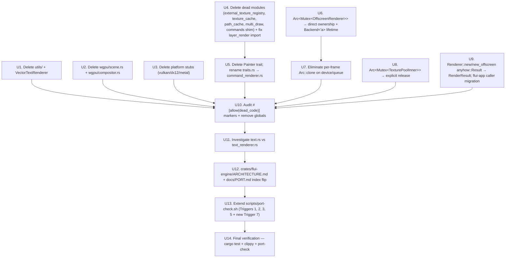

# feat: flui-engine Mythos redesign

## Summary

Execute the 14-step Mythos refactor chain on `crates/flui-engine/` (~25,119 LOC). The chain deletes ~6,000 LOC of dead modules and fake abstractions (`utils/text.rs` `VectorTextRenderer` 802 LOC; `wgpu/scene.rs` parallel scene-graph 1,820 LOC; `wgpu/compositor.rs` dead `Compositor`/`TransformStack` 365 LOC; three platform-capability stubs `wgpu/{vulkan, dx12, metal}.rs` totalling 2,182 LOC; four dead infrastructure modules `wgpu/{external_texture_registry, texture_cache, path_cache, multi_draw}.rs` totalling 1,955 LOC plus `wgpu/commands.rs` 6 LOC re-export shim; `pub trait Painter` with 1 production impl and 6 default `not implemented` warnings, ~380 LOC), replaces `Arc<parking_lot::Mutex<OffscreenRenderer>>` with direct ownership in `Renderer` and lifetime-borrowed `Backend<'a>`, replaces `Arc<Mutex<TexturePoolInner>>` with explicit `TexturePool::release`, eliminates per-frame `Arc::clone(&device)` / `Arc::clone(&queue)` calls in `Renderer::render_scene` and `Backend::render_shader_mask`, migrates `Renderer::new` / `new_offscreen` from `anyhow::Result` to `RenderResult`, audits all `#[allow(dead_code)]` markers (global + per-module), investigates `wgpu/text.rs` vs `wgpu/text_renderer.rs` duplication, extends `scripts/port-check.sh` to cover engine paths and add a new Trigger 7 for `Arc<Mutex<wgpu::*|*Renderer|*Pool>>` shapes, and lands a per-crate `crates/flui-engine/ARCHITECTURE.md` template instance with a `## wgpu / Vulkan / Metal mapping` section (in place of `## Flutter source mapping`, since the engine has no Flutter parity). Breaking ripples in `flui-app` (the `anyhow::Result` → `RenderResult` migration in `binding.rs` / `direct.rs` / `runner.rs`) land in-band per the no-quick-wins memo. Net unsafe delta: **0** (the single existing `unsafe { instance.create_surface_unsafe(...) }` in `Renderer::new` is required by wgpu's API contract and stays). Net LOC delta in production code: ≥ 6,000 LOC reduction.

---

## Problem Frame

The brainstorm (see origin) and verdict (see verdict) establish that `flui-engine` is the next crate in the Mythos chain after `flui-rendering` (PR #77, merged commit `03774584` on `main`) and `flui-layer` (PR #78, merged commit `a78cdd69` on `main`). Phase 1 investigation surfaced ≥ 6,000 LOC of dead modules, two `Arc<Mutex<>>` smells around `OffscreenRenderer` / `TexturePool`, per-frame `Arc::clone` on the hot path, an `anyhow::Result` inconsistency, a fake `Painter` trait (1 production impl + 6 default `tracing::warn!("not implemented")` impls), and a global `#![allow(dead_code)]` at the crate root. Without the chain, every subsequent feature (a real second backend, HDR/EDR rendering, custom render callbacks, hot-reload integration) inherits and possibly extends the same debt.

The plan turns the verdict's 14-step implementation plan into reviewable units U1-U14, each landing as one commit, each independently passing `cargo check --workspace`, `cargo test -p flui-engine --lib`, and `bash scripts/port-check.sh` (extended via U13 before any commits land that the check would otherwise miss).

---

## Requirements

Sourced from `docs/brainstorms/flui-engine-mythos-redesign-requirements.md`:

- **R1-R3** (Design verdict authorship) — covered upstream; the verdict at `docs/designs/2026-05-20-mythos-flui-engine-redesign.md` is the chain's source of truth and is not re-derived here.
- **R4** — Delete `crates/flui-engine/src/utils/` (utils/text.rs 802 LOC + utils/mod.rs 7 LOC; `VectorTextRenderer`).
- **R5** — Delete `wgpu/scene.rs` (1,820 LOC) + `wgpu/compositor.rs` (365 LOC).
- **R6** — Delete `wgpu/vulkan.rs` (826 LOC) + `wgpu/dx12.rs` (769 LOC) + `wgpu/metal.rs` (587 LOC).
- **R7** — Delete `wgpu/external_texture_registry.rs` (315 LOC) + `wgpu/texture_cache.rs` (1,000 LOC) + `wgpu/path_cache.rs` (336 LOC) + `wgpu/multi_draw.rs` (304 LOC) + `wgpu/commands.rs` (6 LOC re-export shim).
- **R8** — Delete `pub trait Painter` from `traits.rs` (~380 LOC). `WgpuPainter` methods become inherent. `RenderError::PainterError(String)` deleted.
- **R9** — Replace `Arc<parking_lot::Mutex<OffscreenRenderer>>` with direct ownership in `Renderer` + lifetime-borrowed `Backend<'a>`.
- **R10** — Replace `Arc<Mutex<TexturePoolInner>>` with direct ownership + explicit `TexturePool::release`.
- **R11** — Eliminate per-frame `Arc::clone(&device)` / `Arc::clone(&queue)` in `Renderer::render_scene`. `RenderContext` borrows references.
- **R12** — Migrate `Renderer::new` / `new_offscreen` from `anyhow::Result` to `RenderResult`. Ripple into `flui-app`.
- **R13** — Audit `#[allow(dead_code)]` markers (global + per-module); remove or justify.
- **R14** — Investigate `wgpu/text.rs` vs `wgpu/text_renderer.rs` duplication; merge or rename for clarity.
- **R15** — Extend `scripts/port-check.sh`: add `crates/flui-engine/src` to Triggers 1, 2, 3 path scopes; extend Trigger 3 verb set with `submit|present|render_scene|render_layer_recursive|handle_backdrop_filter`; extend Trigger 5 scope; add new Trigger 7 for `Arc<(parking_lot::)?(Mutex|RwLock)<*Renderer|*Pool|wgpu::*>` in `crates/flui-engine/src/wgpu/`.
- **R16** — Post-chain `bash scripts/port-check.sh -v` exits 0; seven "ok" lines.
- **R17** — Create `crates/flui-engine/ARCHITECTURE.md` per the five-section template; `## Flutter source mapping` replaced with `## wgpu / Vulkan / Metal mapping`.
- **R18** — Flip `docs/PORT.md` `## Index` entry for `flui-engine` to "Templated 2026-05-20".
- **R19** — In-band breaking ripples in `flui-app`; no deferred follow-up PRs except concrete-blocker-with-named-dependency.
- **R20** — Net unsafe delta **0**; zero new `unsafe` blocks introduced.
- **R21** — No `async fn` introduced on rendering methods or hot-path APIs.

**Origin actors:** A1 (solo maintainer `vanyastaff`), A2 (Claude Code / `/aif-implement` / `implement-coordinator`), A3 (downstream crate: `flui-app`).
**Origin flows:** F1 (design verdict), F2 (execute 14-step chain), F3 (extend port-check), F4 (templated ARCHITECTURE.md).
**Origin acceptance examples:** AE1 (R4), AE2 (R5), AE3 (R6), AE4 (R7), AE5 (R8), AE6 (R9), AE7 (R10), AE8 (R11), AE9 (R12), AE10 (R13), AE11 (R15/R16), AE12 (R17/R18), AE13 (R19).

---

## Scope Boundaries

- **In scope:** `crates/flui-engine/` source + tests; the public-API ripples into `crates/flui-app/`; `scripts/port-check.sh`; `docs/PORT.md` `## Index` table entry for `flui-engine`; new file `crates/flui-engine/ARCHITECTURE.md`.

- **Out of scope (deferred to follow-up):**
  - `painter/` directory split (`wgpu/painter.rs` 3,772 LOC into `painter/{batch, segment, layer, gradient, text, render}.rs`). Mechanical LOC redistribution; if chain bandwidth permits, lands in U10; if not, Outstanding refactor.
  - `offscreen/` directory split (`wgpu/offscreen.rs` 1,525 LOC into `offscreen/{mask, blur, morph}.rs`). Same defer-or-include decision.
  - `proptest` / `loom` / miri test coverage for `flui-engine`. Recorded as Outstanding refactor; requires dev-dep decisions.
  - Implementing missing `BackdropFilter`, `ImageFilter::ColorAdjust`, `ImageFilter::Compose` GPU paths (current code has fallback paths logged at warn). Separate feature plan, not Mythos.
  - Second rendering backend (Skia, Vello, software). Deleting the `Painter` trait does not preclude future backends; rebuilding the abstraction when a real backend lands.
  - HDR / WCG / EDR rendering. The deleted `wgpu/metal.rs::EdrConfig` was a stub; HDR via wgpu's `Adapter::features()` remains available.
  - Re-enabling `flui-devtools`, `flui-cli`. Disabled crates outside the chain's blast radius.
  - Workspace-wide `Arc<RwLock<>>` audit of non-`flui-engine` crates. Separate brainstorm.
  - Per-shader-stage GPU lowering documentation for every WGSL file in `wgpu/shaders/`. Recorded as Outstanding refactor in ARCHITECTURE.md.
  - Custom-render-callback integration with `WgpuPainter`. Separate feature plan.

### Deferred to Follow-Up Work

- CLAUDE.md drift fix: `CLAUDE.md` "Current Development Focus" section still lists active/disabled crates per the older snapshot. Pre-existing per both `flui-rendering` and `flui-layer` chains' deferred lists; not picked up here.
- Workspace-wide sweep of remaining per-crate `ARCHITECTURE.md` files onto the template (`flui-painting`, `flui-interaction`, etc.). Incremental per `docs/PORT.md` R8; subsequent ports/refactors apply the template per crate.
- Apply the methodology to `flui-app`, `flui-view`, `flui-platform`, `flui-painting`, `flui-interaction` next. Separate brainstorms keyed off their re-enable plans.

---

## Context & Research

### Relevant Code and Patterns

- `crates/flui-engine/src/utils/text.rs` (802 LOC) — `VectorTextRenderer`, `TextRenderParams`, `TextVertex`, `VectorTextError`. Zero external callers (verified by `grep -rn "VectorTextRenderer\|utils::text" crates/` returning only module-internal references and tests).
- `crates/flui-engine/src/wgpu/scene.rs` (1,820 LOC) — `Scene`, `SceneBuilder`, `Layer`, `Primitive`, `PrimitiveBatch`, `PrimitiveType`, `LayerBatch`, `BlendMode`. Only consumed by `wgpu/compositor.rs` (itself dead). The crate-level re-exports collide with `flui_layer::Scene` / `flui_layer::SceneBuilder`.
- `crates/flui-engine/src/wgpu/compositor.rs` (365 LOC) — `Compositor`, `TransformStack`, `RenderContext`. Zero external callers; consumes the dead `LayerBatch` type from `wgpu/scene.rs`.
- `crates/flui-engine/src/wgpu/vulkan.rs` (826 LOC) — `VulkanFeatures`, `PipelineCacheConfig`, etc. Zero callers outside doc comments.
- `crates/flui-engine/src/wgpu/dx12.rs` (769 LOC) — `Dx12Features`, `AutoHdrConfig`, etc. Zero callers.
- `crates/flui-engine/src/wgpu/metal.rs` (587 LOC) — `MetalFxUpscaler`, `EdrConfig`, etc. Zero callers.
- `crates/flui-engine/src/wgpu/external_texture_registry.rs` (315 LOC) — `ExternalTextureRegistry`, `ExternalTextureEntry`. Zero external callers.
- `crates/flui-engine/src/wgpu/texture_cache.rs` (1,000 LOC) — `TextureCache`. Zero external callers (distinct from `texture_pool.rs` which IS consumed).
- `crates/flui-engine/src/wgpu/path_cache.rs` (336 LOC) — `PathCache`. Zero external callers.
- `crates/flui-engine/src/wgpu/multi_draw.rs` (304 LOC) — `MultiDrawBatcher`, `DrawCommand` (name-collides with `flui_painting::DrawCommand`), `DrawIndexedIndirectArgs`, etc. Zero external callers.
- `crates/flui-engine/src/wgpu/commands.rs` (6 LOC) — re-export shim: `pub use crate::{commands::{dispatch_command, dispatch_commands}, traits::CommandRenderer};`. Used only by `wgpu/layer_render.rs:17`.
- `crates/flui-engine/src/traits.rs` (~780 LOC total) — `CommandRenderer` trait (~410 LOC, kept) + `Painter` trait (~370 LOC, deleted). The Painter trait has 30+ methods with 6 default impls printing `tracing::warn!("Painter::draw_path: not implemented")`.
- `crates/flui-engine/src/wgpu/painter.rs` (3,772 LOC) — `WgpuPainter`. Largest file in workspace. Mixes `DrawSegment` recording, layer save/restore, gradient generation, text rendering integration. Has `impl Painter for WgpuPainter` block which becomes inherent in U5.
- `crates/flui-engine/src/wgpu/renderer.rs` (977 LOC) — `Renderer`, `GpuCapabilities`, `RenderContext` (private). `offscreen: Option<Arc<parking_lot::Mutex<OffscreenRenderer>>>` field at line 143. `Arc::clone(&self.device)` / `Arc::clone(&self.queue)` at lines 636-637. `pub async fn new<W>(...) -> Result<Self>` at line 172 returns `anyhow::Result`.
- `crates/flui-engine/src/wgpu/backend.rs` (1,199 LOC) — `Backend`, `CommandRenderer` impl. `offscreen: Option<Arc<parking_lot::Mutex<OffscreenRenderer>>>` field at line 26. `Arc::clone(device)` / `Arc::clone(queue)` calls at lines 121-122, 408-409. `offscreen_arc.lock()` calls in `render_shader_mask`.
- `crates/flui-engine/src/wgpu/offscreen.rs` (1,525 LOC) — `OffscreenRenderer`. Wraps mask, blur, morphological filter pipelines. `texture_pool: Arc<TexturePool>` field (Arc wrap to be removed in U7). `pipelines: HashMap<ShaderType, Arc<wgpu::RenderPipeline>>` with per-frame `Arc::clone` on cache hits at lines 659-660, 1051-1053.
- `crates/flui-engine/src/wgpu/texture_pool.rs` (523 LOC) — `TexturePool` with `pool: Arc<Mutex<TexturePoolInner>>` (line 71), `PooledTexture` with `inner: Arc<Mutex<TexturePoolInner>>` for release-on-drop (line 224). Mutex deletion target for U8.
- `crates/flui-engine/src/wgpu/layer_render.rs` (1,191 LOC) — `LayerRender<R>` trait (generic, static dispatch), 19 per-variant impls, `impl LayerRender<R> for Layer` enum dispatch. `thread_local! SUPERELLIPSE_CACHE: RefCell<HashMap<SuperellipseKey, Path>>` at line 71-76 (canonical single-threaded hot-path cache; NOT a refusal trigger violation). `import super::commands::{CommandRenderer, dispatch_commands}` at line 17 (fixed in U4 to use `crate::`). ~521 LOC of `MockRenderer` test fixture in tests module.
- `crates/flui-engine/src/wgpu/text.rs` (436 LOC) — `TextRenderer` (glyphon-based). U11 investigation target.
- `crates/flui-engine/src/wgpu/text_renderer.rs` (297 LOC) — `TextRenderingSystem`, `TextRun`. Possible duplicate of `text.rs`; U11 investigation target.
- `crates/flui-engine/src/error.rs` (271 LOC) — `RenderError` (`#[non_exhaustive]`, 13 variants), `RenderResult<T>`. `PainterError(String)` variant deleted in U5.
- `crates/flui-engine/src/lib.rs` (106 LOC) — re-exports + module declarations. `#![allow(dead_code, missing_debug_implementations)]` at line 4 (audited in U10).
- `crates/flui-engine/src/wgpu/mod.rs` (147 LOC) — re-exports. `#[allow(dead_code)]` markers on `pub mod effects` (line 59), `mod instancing` (line 64), `mod pipeline` (line 75), `mod shader_compiler` (line 80). U10 audit target.
- `crates/flui-engine/src/wgpu/effects.rs` (543 LOC) — `GradientStop`, `LinearGradientInstance`, `RadialGradientInstance`, `SweepGradientInstance` (used by `painter.rs`), `ShadowParams`, `ShadowInstance`, `BlurParams`, `BlurIntensity`, `LinearGradientBuilder` (audit consumers in U10).
- `crates/flui-engine/src/wgpu/instancing.rs` (701 LOC) — `RectInstance`, `CircleInstance`, `ArcInstance`, `ShadowInstance`, `TextureInstance`, `LinearGradientInstance`, etc. + `InstanceBatch<T>`. Used by `painter.rs`.
- `crates/flui-engine/src/wgpu/shader_compiler.rs` (608 LOC) — `ShaderCache`, `ShaderType`, `CompiledShader`. `cache: RwLock<HashMap<ShaderType, Arc<CompiledShader>>>` (line 128). Used by `offscreen.rs`. Per-frame `Arc::clone(shader)` on cache hits at lines 149, 158, 189, 200 (setup-phase acceptable; shader cache is populated lazily and the clone amortises).
- `crates/flui-engine/src/wgpu/pipelines.rs` (372 LOC) — `PipelineBuilder`, `PipelineCache`. Used by `painter.rs`.
- `crates/flui-engine/src/wgpu/pipeline.rs` (316 LOC) — pipeline keys + single-pipeline descriptors. `#[allow(dead_code)]` at module decl. Used by `painter.rs`.
- `crates/flui-app/src/app/binding.rs:33` — `use flui_engine::{RenderError, wgpu::Renderer};`. Touched by R12 ripple.
- `crates/flui-app/src/app/direct.rs:31` — `use flui_engine::wgpu::Renderer;`. Touched by R12 ripple.
- `crates/flui-app/src/app/runner.rs:95, 341, 506` — `use flui_engine::wgpu::Renderer;`. Touched by R12 ripple.
- `scripts/port-check.sh` — seven triggers (six original + the to-be-added Trigger 7). Today scopes Triggers 1, 2, 3 to `flui-rendering/src` + `flui-view/src` + `flui-painting/src` + `flui-layer/src`. Trigger 5 already scoped to `flui-rendering/src/objects` + `flui-engine/src/wgpu/layer_render.rs` (by `flui-layer` chain U13). U13 extends scopes + adds Trigger 7.
- `docs/PORT.md` `## Index` — current entry for `flui-engine`: "Not yet templated". U12 flips to "Templated 2026-05-20 (Mythos chain)".

### Institutional Learnings

- **`docs/designs/2026-05-20-mythos-flui-rendering-redesign.md`** — the precedent verdict for the methodology. 13-section structure, rejected-designs format, 14-step implementation plan template. This chain's verdict mirrors the structure.
- **`docs/designs/2026-05-20-mythos-flui-layer-redesign.md`** — the second-iteration precedent verdict. Established the "Mythos refusal trigger Arc-Mutex over single-mutator data" pattern.
- **`docs/brainstorms/flui-layer-mythos-redesign-requirements.md`** — the precedent brainstorm structure (R/AE/Actors/Flows/Scope Boundaries/Key Decisions/Open Questions).
- **`docs/plans/2026-05-20-002-feat-flui-layer-mythos-redesign-plan.md`** (completed 2026-05-20, merged via PR #78) — the precedent implementation plan structure. Source for the U1-U14 unit numbering, the dependency graph format, and the per-unit acceptance test format. This plan mirrors layer's plan structure exactly.
- **`crates/flui-rendering/ARCHITECTURE.md`** — the exemplar per-crate template instance (Flutter-parity crate).
- **`crates/flui-layer/ARCHITECTURE.md`** — the exemplar per-crate template instance (Mythos-cleaned crate; established the "Accepted trade-offs" format for divergence decisions).
- **`~/.claude/projects/.../memory/no-quick-wins-vanyastaff.md`** — "vanyastaff forbids defer-with-excuse pattern on structural refactors; execute full migration including breaking ripples." R19/AE13 codify this for this chain.
- **Reference commits on `main`** (exemplars):
  - `907a7787` — full delete + rewire (analog: U1-U7 dead-code deletions).
  - `4d05efc5` — god-module split (analog: U10/U11 painter/ / offscreen/ splits, **if** they land in this chain).
  - `c1857696` / `182a3b30` — phase typestate skeleton (NOT applicable to `flui-engine` — no phase model needed; the verdict §4 records this as "N/A").
  - `dc0fa1ad` — `catch_unwind` plumbing (NOT applied here; deferred per §12 rejected design).
  - `d0e53c63` — extension-trait split (analog: U5 `Painter` trait deletion).
  - `6edae9fd` — disjoint-borrow `unsafe` primitive (NOT applicable; `Renderer` is single-owner; no disjoint-borrow primitive needed).
  - `702e8751` through `5dda0350` — the `flui-layer` chain (15 commits, PR #78). Commit message format and "Mythos Step N" convention mirror this chain.

### External References

None. Local research is sufficient; the chain is internal refactor work and builds entirely on in-repo patterns and the `flui-rendering` / `flui-layer` exemplars.

---

## Key Technical Decisions

- **Direct ownership of `OffscreenRenderer` over `Arc<Mutex<>>`.** Single-mutator data. `Backend<'a>` becomes generic over a frame lifetime, holding `&'a mut OffscreenRenderer` borrowed from `Renderer`.
- **Explicit `TexturePool::release` over `Arc<Mutex<>>` Drop.** Removes the back-reference on `PooledTexture`. Drop becomes a no-op or drops the wgpu::Texture directly.
- **Borrow references over per-frame `Arc::clone`.** `RenderContext` is a per-frame struct that borrows `&wgpu::Device` / `&wgpu::Queue` references with a frame lifetime.
- **Closed `CommandRenderer` visitor + closed `LayerRender<R>` extension over `Box<dyn Backend>` plugin trait.** Static dispatch via generics. 1 production impl + 1 test mock for `CommandRenderer`. Closed dispatch over the closed `Layer` enum from `flui-layer`.
- **Delete `Painter` trait over keep for second backend.** 1 production impl, 6 default `not implemented` warnings. No second backend exists or is planned.
- **Delete dead modules over keep as internal IR.** `wgpu/scene.rs` was claimed as "internal IR for batching"; rejected because `WgpuPainter` already batches via `DrawSegment`.
- **Migrate to `RenderResult` over keep `anyhow::Result`.** Consistency with the rest of the engine's public API.
- **Audit `#[allow(dead_code)]` instead of trusting it.** Each suppression is a canary that an item lost its consumer.
- **Keep the single `unsafe { instance.create_surface_unsafe(...) }` block.** wgpu's API requires it. Net unsafe delta is zero.
- **`Renderer: Send` (not `Sync`).** Cross-thread frame production via value-move. No `Arc<Renderer>` ceremony.
- **Land breaking ripples in-band over deferred.** R12's `anyhow::Result` → `RenderResult` migration in `flui-app` lands in the same chain.
- **`painter/` and `offscreen/` directory splits are chain-bandwidth-dependent.** If U10 has room, the splits land; else Outstanding refactors with concrete blocker "no semantic change."

---

## Open Questions

### Resolved during planning

- "How many `unsafe impl` blocks does `flui-engine` carry?" — resolved: zero. The Mythos pass nets out at zero unsafe delta.
- "Does any external caller actually use `Painter` trait outside `flui-engine`?" — resolved: zero.
- "Does `wgpu/scene.rs` have any production caller?" — resolved: zero. Only `wgpu/compositor.rs` (itself dead) references it.
- "How many per-frame `Arc::clone(&device)` / `Arc::clone(&queue)` sites are on the hot path?" — resolved: two confirmed (`renderer.rs:636-637`, `backend.rs:408-409`); plus initialisation-time sites that amortise across the renderer's lifetime.
- "How does `scripts/port-check.sh` scope today?" — resolved: read of the script confirms Triggers 1, 2, 3 scopes plus Trigger 5's already-extended layer_render.rs scope from `flui-layer` U13.

### Deferred to implementation

- **Whether `traits.rs` should be renamed to `command_renderer.rs` after `Painter` deletion.** Resolution at U5. Recommend: rename in U5 (single commit since file shrinks); new name clarifies the surviving trait.
- **Whether `painter/` and `offscreen/` directory splits land in U10 or are deferred.** Resolution at U10. Recommend: defer both to Outstanding refactors with concrete blocker "no semantic change; mechanical LOC redistribution; in scope for a follow-up housekeeping PR."
- **Whether `text.rs` vs `text_renderer.rs` is duplication or two-stage architecture.** Resolution at U11. Recommend: read both files end-to-end at U11.
- **Whether the existing `unsafe { instance.create_surface_unsafe(...) }` block needs an explicit `// SAFETY:` comment.** Resolution at U14 cleanup. Recommend: add a SAFETY block naming the window-handle-lifetime invariant.
- **Whether the new Trigger 7 forward-looking regex catches `*Renderer`/`*Pool`/`wgpu::*` shapes too broadly.** Resolution at U13. Recommend: test with `--glob '!**/test*.rs'` and `--glob '!**/tests/**'` exclusions to avoid catching test-only Arc<Mutex<>> uses.

---

## High-Level Technical Design

> *This illustrates the intended approach and is directional guidance for review, not implementation specification. The implementing agent should treat it as context, not code to reproduce.*

**Dependency graph across implementation units:**

**Ordering rationale:**

- **U1 → U4 (deletions of dead code) run first.** They have no semantic dependencies on each other; ordered for review clarity (smallest first, then by category).
- **U5 (`Painter` trait deletion) lands after U4 (dead-commands shim deletion)** because U5 fixes the `wgpu/layer_render.rs:17` import to `use crate::traits::CommandRenderer` — U4 already deleted the `wgpu/commands.rs` shim that was the alternative path.
- **U6 (Arc-Mutex OffscreenRenderer removal) precedes U7 (per-frame Arc::clone elimination)** because the `Backend<'a>` lifetime introduced in U6 also changes how `RenderContext` is structured, simplifying U7's borrow lifetime.
- **U8 (Arc-Mutex TexturePool removal) is independent of U6/U7.** Can land in parallel with U7 in terms of review-clarity sequencing; arranged after for incremental landing.
- **U9 (anyhow::Result → RenderResult migration) is independent of U1-U8.** Sequenced after locks to keep public-API change in a single PR location.
- **U10 (allow(dead_code) audit) is a final cleanup pass.** Must follow U1-U9 because dead-code lints may surface only after deletions remove the items that were "using" each suspect.
- **U11 (text.rs vs text_renderer.rs investigation) is independent.** Sequenced before U12 because the outcome (merge or split) affects what ARCHITECTURE.md says.
- **U12 (ARCHITECTURE.md) lands after all code units** because the doc describes the final shape.
- **U13 (port-check.sh extension) lands after U12** so the doc and script reference each other consistently.
- **U14 is the final verification commit.** Trivial if everything else landed cleanly.

---

## Implementation Units

### U1. Delete `utils/text.rs` + `VectorTextRenderer`

**Goal:** remove 809 LOC of dead vector-text experiment with zero external callers.

**Requirements:** R4, R19, R20.

**Dependencies:** none.

**Files:**
- Delete: `crates/flui-engine/src/utils/text.rs` (802 LOC).
- Delete: `crates/flui-engine/src/utils/mod.rs` (7 LOC).
- Modify: `crates/flui-engine/src/lib.rs` — remove `pub mod utils;` declaration (line ~77 in current `lib.rs`).
- Verify: `grep -r "VectorTextRenderer\|utils::text\|utils/text" crates/` returns zero matches after the change.

**Approach:**
- Confirm zero external callers via grep before deletion.
- Delete both files in one commit.
- Update `lib.rs` to remove the module declaration.

**Patterns to follow:**
- Reference commit: `907a7787` (full delete + rewire). Single-commit deletion with adjacent declaration cleanup.

**Test scenarios:**
- Integration scenario (Covers R4/AE1): post-deletion, `cargo build --workspace` clean; `cargo test -p flui-engine --lib` green; `grep -r "VectorTextRenderer\|utils::text" crates/ | grep -v target` returns zero matches.

### U2. Delete `wgpu/scene.rs` + `wgpu/compositor.rs`

**Goal:** remove 2,185 LOC of dead scene-graph/compositor duplicating `flui_layer::Scene` and `WgpuPainter::save/restore`.

**Requirements:** R5, R19.

**Dependencies:** none.

**Files:**
- Delete: `crates/flui-engine/src/wgpu/scene.rs` (1,820 LOC).
- Delete: `crates/flui-engine/src/wgpu/compositor.rs` (365 LOC).
- Modify: `crates/flui-engine/src/wgpu/mod.rs`:
  - Remove `mod scene;` (line ~78).
  - Remove `mod compositor;` (line ~53).
  - Remove `pub use scene::{Scene, SceneBuilder};` (line ~130).
  - Remove `pub use compositor::{Compositor, RenderContext, TransformStack};` (line ~112).

**Approach:**
- Confirm zero external callers (only internal: `compositor.rs` consumes types from `scene.rs`; both gone simultaneously).
- Delete both files + the mod.rs entries in one commit.
- Verify the crate-root re-export now resolves only to `flui_layer::Scene`.

**Patterns to follow:**
- Reference commit: `907a7787` (delete + rewire).

**Test scenarios:**
- Integration scenario (Covers R5/AE2): post-deletion, `cargo build --workspace` clean; `cargo test -p flui-engine` green; `grep -r "wgpu::Scene\|wgpu::SceneBuilder\|wgpu::Compositor\|wgpu::TransformStack" crates/ | grep -v target` returns zero matches.

### U3. Delete platform stubs `wgpu/{vulkan, dx12, metal}.rs`

**Goal:** remove 2,182 LOC of zero-caller platform capability files.

**Requirements:** R6, R19.

**Dependencies:** none.

**Files:**
- Delete: `crates/flui-engine/src/wgpu/vulkan.rs` (826 LOC).
- Delete: `crates/flui-engine/src/wgpu/dx12.rs` (769 LOC).
- Delete: `crates/flui-engine/src/wgpu/metal.rs` (587 LOC).
- Modify: `crates/flui-engine/src/wgpu/mod.rs`:
  - Remove `#[cfg(target_os = "windows")] pub mod dx12;` (line ~57).
  - Remove `#[cfg(target_os = "macos")] pub mod metal;` (line ~68).
  - Remove `#[cfg(any(target_os = "linux", target_os = "android"))] pub mod vulkan;` (line ~89).

**Approach:**
- Confirm zero callers (only doc-comment references inside the deleted files themselves).
- Delete all three files + the mod.rs entries in one commit.
- Per-target builds verified.

**Test scenarios:**
- Integration scenario (Covers R6/AE3): post-deletion, `cargo build --target x86_64-pc-windows-msvc` clean (Windows). On Linux/macOS, the corresponding `cargo build --target <target>` is also clean. `grep -r "wgpu::vulkan::\|wgpu::dx12::\|wgpu::metal::" crates/ | grep -v target` returns zero matches outside doc comments.

### U4. Delete dead modules + fix layer_render import

**Goal:** remove 1,961 LOC of dead infrastructure (`external_texture_registry`, `texture_cache`, `path_cache`, `multi_draw`, `commands` shim) and fix the import in `layer_render.rs` to use the canonical crate-level path.

**Requirements:** R7.

**Dependencies:** none.

**Files:**
- Delete: `crates/flui-engine/src/wgpu/external_texture_registry.rs` (315 LOC).
- Delete: `crates/flui-engine/src/wgpu/texture_cache.rs` (1,000 LOC).
- Delete: `crates/flui-engine/src/wgpu/path_cache.rs` (336 LOC).
- Delete: `crates/flui-engine/src/wgpu/multi_draw.rs` (304 LOC).
- Delete: `crates/flui-engine/src/wgpu/commands.rs` (6 LOC re-export shim).
- Modify: `crates/flui-engine/src/wgpu/mod.rs`:
  - Remove `mod external_texture_registry;` (line ~61).
  - Remove `pub mod texture_cache;` (line ~85).
  - Remove `pub mod path_cache;` (line ~73).
  - Remove `mod multi_draw;` (line ~69).
  - Remove `mod commands;` (line ~51).
  - Remove `pub use external_texture_registry::{ExternalTextureEntry, ExternalTextureRegistry};` (line ~116).
  - Remove `pub use multi_draw::{DrawCommand, DrawIndexedIndirectArgs, MultiDrawBatcher, MultiDrawStats, PipelineId};` (line ~120).
  - Remove `pub use commands::{CommandRenderer, dispatch_command, dispatch_commands};` (line ~110); the canonical re-export `pub use crate::commands::{dispatch_command, dispatch_commands}` and `pub use crate::traits::CommandRenderer` stay (already at lib.rs).
- Modify: `crates/flui-engine/src/wgpu/layer_render.rs:17` — change `use super::commands::{CommandRenderer, dispatch_commands};` → `use crate::{commands::dispatch_commands, traits::CommandRenderer};`.

**Approach:**
- Confirm zero external callers via grep.
- Delete all five files + update mod.rs + fix one import in one commit.

**Test scenarios:**
- Integration scenario (Covers R7/AE4): post-deletion, `cargo build --workspace` clean; `cargo test -p flui-engine` green; `grep -r "ExternalTextureRegistry\|TextureCache\|PathCache\|MultiDrawBatcher" crates/ | grep -v target` returns zero matches; `grep -rn "super::commands" crates/flui-engine/src/` returns zero matches.

### U5. Delete `Painter` trait; rename `traits.rs` → `command_renderer.rs`

**Goal:** remove the ~380 LOC `Painter` trait (1 production impl, 6 default-not-implemented warnings); make `WgpuPainter`'s methods inherent; rename `traits.rs` to clarify what remains.

**Requirements:** R8, R19.

**Dependencies:** U4 (dead `commands.rs` shim already removed; the `traits::CommandRenderer` re-export is the canonical path).

**Files:**
- Modify: `crates/flui-engine/src/traits.rs` — remove `pub trait Painter` (~380 LOC, lines ~365-781). Keep `pub trait CommandRenderer` (~365 LOC).
- Optionally rename: `crates/flui-engine/src/traits.rs` → `crates/flui-engine/src/command_renderer.rs`. Update `mod traits;` declaration in `lib.rs` to `mod command_renderer;` if renamed. (Decision deferred to implementation; the rename is optional but recommended for clarity.)
- Modify: `crates/flui-engine/src/lib.rs`:
  - Remove `pub use traits::Painter;` re-export (line ~101) — only `pub use traits::CommandRenderer;` stays.
- Modify: `crates/flui-engine/src/wgpu/mod.rs`:
  - Remove `pub use crate::traits::Painter;` (line ~147).
- Modify: `crates/flui-engine/src/wgpu/painter.rs`:
  - Remove `impl Painter for WgpuPainter { ... }` block (~30 methods, lines TBD). The methods stay as inherent impls on `WgpuPainter` (they already exist as inherent impls; the trait impl was a thin re-export of them).
  - Remove `use crate::traits::Painter;` import (line ~27).
- Modify: `crates/flui-engine/src/wgpu/backend.rs`:
  - Remove `use crate::traits::Painter;` (line ~17) — replace with `use crate::traits::CommandRenderer;`.
- Modify: `crates/flui-engine/src/error.rs`:
  - Delete `RenderError::PainterError(String)` variant (lines ~117-119).
  - Delete `RenderError::painter()` constructor (lines ~173-176).

**Approach:**
- Move careful: the `Painter` trait has methods with same names as `WgpuPainter::inherent_methods`. Verify by `cargo build --workspace` that the inherent methods are picked up after trait removal.
- Each removed default impl that printed `tracing::warn!("not implemented")` is gone; callers (only `Backend` and `WgpuPainter` itself) compile because they call inherent methods.

**Patterns to follow:**
- Reference: `d0e53c63` (extension-trait split). Mechanical-concern extraction; same shape but for deletion.

**Test scenarios:**
- Integration scenario (Covers R8/AE5): post-deletion, `cargo build --workspace` clean; `cargo test -p flui-engine` green; `grep -r "pub trait Painter\|impl Painter for\|<.*as Painter>\|RenderError::Painter\|RenderError::painter" crates/ | grep -v target` returns zero matches.

### U6. Replace `Arc<Mutex<OffscreenRenderer>>` with direct ownership + `Backend<'a>` lifetime

**Goal:** remove the Arc<Mutex<>> wrap on `OffscreenRenderer`; introduce a frame lifetime on `Backend<'a>` for borrowed access.

**Requirements:** R9.

**Dependencies:** U5 (Painter trait gone; backend.rs simpler).

**Files:**
- Modify: `crates/flui-engine/src/wgpu/renderer.rs`:
  - `Renderer::offscreen: Option<Arc<parking_lot::Mutex<OffscreenRenderer>>>` (line ~143) → `offscreen: Option<OffscreenRenderer>`.
  - `Renderer::new`: remove `let offscreen = Some(Arc::new(parking_lot::Mutex::new(offscreen)));` (lines ~272-272); replace with `let offscreen = Some(offscreen);`.
  - `Renderer::render_scene`: where `Backend::with_offscreen(painter, Arc::clone(offscreen))` is called (line ~650), update to pass `&mut self.offscreen.as_mut().unwrap()` or similar lifetime-borrowed pattern.
  - `Renderer::handle_backdrop_filter`: replace `offscreen_arc.lock()` calls (lines ~878, 904) with `&mut self.offscreen.as_mut().unwrap()` (or equivalent).
- Modify: `crates/flui-engine/src/wgpu/backend.rs`:
  - `pub struct Backend` → `pub struct Backend<'a>` (introduce lifetime).
  - `painter: WgpuPainter` → `painter: &'a mut WgpuPainter` (lifetime-borrowed).
  - `offscreen: Option<Arc<parking_lot::Mutex<OffscreenRenderer>>>` → `offscreen: Option<&'a mut OffscreenRenderer>`.
  - `Backend::new(painter: WgpuPainter) -> Self` → `Backend::new(painter: &'a mut WgpuPainter) -> Self`.
  - `Backend::with_offscreen(painter, offscreen)` signature change to match.
  - `Backend::offscreen()` returns `Option<&&'a mut OffscreenRenderer>` or `Option<&OffscreenRenderer>`.
  - `Backend::render_shader_mask`: replace `let offscreen = offscreen_arc.lock();` (line ~407) and the second `let mut offscreen = offscreen_arc.lock();` (line ~464) with `let offscreen = self.offscreen.as_mut().unwrap();` (with appropriate borrowing patterns to avoid double-borrow at the encoder.submit boundary).
  - `Backend::into_painter` return type changes accordingly.
- Update callers in `flui-app` if needed (the `Backend<'a>` lifetime should not escape `Renderer::render_scene`; `flui-app` only interacts with `Renderer`).
- Verify the borrow checker accepts the lifetimes. If borrow conflicts surface at the `encoder.submit` boundary, restructure with explicit `drop(offscreen)` between phases or use a `RenderFrame<'_>` struct that owns the per-frame borrows.

**Approach:**
- The biggest risk is the borrow checker rejecting the new lifetime structure because `Backend::render_shader_mask` needs both `&mut painter` and `&mut offscreen` at different points. Solution: drop the offscreen borrow after Step 1 (acquire device/queue/format/child_tex), then re-borrow at Step 5 (apply mask).
- Test by `cargo check -p flui-engine` after the type-only changes; iterate on the borrow checker.

**Patterns to follow:**
- Reference: `flui-rendering`'s `RenderTree` and `PipelineOwner` ownership refactor (the soundness-rewrite precedent in `docs/plans/2026-03-31-core-crates-hardening.md` Task 7) — similar shape: replace Arc<RwLock<>> with direct ownership where the access pattern is single-mutator.

**Test scenarios:**
- Integration scenario (Covers R9/AE6): post-refactor, `cargo build --workspace` clean; `cargo test -p flui-engine` green; `grep -rn "Arc<parking_lot::Mutex<OffscreenRenderer>>\|Arc<Mutex<OffscreenRenderer>>" crates/flui-engine/src/` returns zero matches; manual smoke test: `Renderer::render_scene` with a shader mask layer succeeds without panic.

### U7. Eliminate per-frame `Arc::clone(&device)` / `Arc::clone(&queue)`

**Goal:** remove the per-frame Arc clones in `Renderer::render_scene` (`RenderContext` construction); change `RenderContext` to borrow references.

**Requirements:** R11.

**Dependencies:** U6 (the lifetime work on `Backend<'a>` simplifies the related lifetime structure).

**Files:**
- Modify: `crates/flui-engine/src/wgpu/renderer.rs`:
  - `RenderContext` struct (lines ~125-131): change `device: Arc<wgpu::Device>` → `device: &'frame wgpu::Device`; `queue: Arc<wgpu::Queue>` → `queue: &'frame wgpu::Queue` (with `'frame` lifetime introduced).
  - `Renderer::render_scene` body: replace `device: Arc::clone(&self.device), queue: Arc::clone(&self.queue),` (lines ~636-637) with `device: &self.device, queue: &self.queue,`.
  - `Renderer::handle_backdrop_filter`: take `ctx: &RenderContext<'_>` (with new lifetime), use `ctx.device` and `ctx.queue` as references.
- Modify: `crates/flui-engine/src/wgpu/backend.rs`:
  - `Backend::get_or_create_offscreen_painter`: takes `device: &Arc<wgpu::Device>` (already; no change). The internal `Arc::clone(device)` at lines 121-122 stays because the new `WgpuPainter` owns its own `Arc<wgpu::Device>` (initialization-time clone, acceptable per the verdict §9 "where Arc/Mutex are acceptable").
  - Document the setup-vs-per-frame distinction via a comment at the clone site.
- Modify: `crates/flui-engine/src/wgpu/offscreen.rs`:
  - Setup-phase `Arc::clone(&device)` calls at lines 93, 659-660, 1051-1053 stay; add comments documenting setup-phase rationale.

**Approach:**
- Verify `RenderContext` with lifetime compiles cleanly. The lifetime is tied to `&self.device` and `&self.queue` borrows, which live as long as `render_scene` is on the stack.
- Borrow checker may complain about overlapping borrows if `self.device` is borrowed via `&self.device` for `RenderContext` and then mutated; verify `&self.device` is a shared borrow throughout the frame.

**Test scenarios:**
- Integration scenario (Covers R11/AE8): post-refactor, `cargo build --workspace` clean; `grep -rn "Arc::clone(&self.device)\|Arc::clone(&self.queue)" crates/flui-engine/src/wgpu/renderer.rs` returns zero matches inside the `render_scene` function body (matches in `Renderer::new` are acceptable; document them).

### U8. Replace `Arc<Mutex<TexturePoolInner>>` with explicit `TexturePool::release`

**Goal:** remove the back-reference Arc<Mutex<>> on PooledTexture; introduce explicit `pool.release(tex)` API.

**Requirements:** R10.

**Dependencies:** none (independent of U6/U7).

**Files:**
- Modify: `crates/flui-engine/src/wgpu/texture_pool.rs`:
  - `TexturePool::pool: Arc<Mutex<TexturePoolInner>>` (line ~71) → `TexturePool` directly owns `available: Vec<TextureSlot>` (no Arc, no Mutex).
  - `PooledTexture` struct (line ~219): remove `inner: Arc<Mutex<TexturePoolInner>>` field (line ~224); replace with `id: u64`.
  - `PooledTexture::drop` (line ~277 area): change from "return to pool via inner.lock()" to no-op (or drop the `wgpu::Texture` directly, releasing GPU memory if not pooled).
  - Add: `pub fn release(&mut self, texture: PooledTexture)` method on `TexturePool` (after acquire).
  - Change: `TexturePool::acquire` signature from `&self` to `&mut self` (per `pool: Arc<Mutex<TexturePoolInner>>` removal — now needs `&mut self`).
- Modify: `crates/flui-engine/src/wgpu/offscreen.rs`:
  - `OffscreenRenderer::texture_pool: Arc<TexturePool>` (line ~46) → `texture_pool: TexturePool` (direct ownership).
  - `OffscreenRenderer::with_caches` constructor: change `texture_pool: Arc<TexturePool>` parameter to `texture_pool: TexturePool` (direct).
  - Where `OffscreenRenderer::texture_pool().acquire(...)` is called (lines ~411, 877-880), change to `self.texture_pool.acquire(...)`. The acquire return value is a `PooledTexture` that drops at end-of-scope; if explicit release is desired, call `self.texture_pool.release(tex)` after the texture is no longer needed (e.g. after the masked render or backdrop blur completes).
- Verify: every consumer of `PooledTexture` either calls `pool.release(tex)` explicitly or accepts drop semantics. Drop semantics are acceptable for one-frame textures (the GPU memory is released; the pool slot is reused on next acquire only if explicitly released — otherwise the pool may grow to its `max_pool_size`).

**Approach:**
- The cleanest model is "explicit release at the workflow boundary." E.g., in `Backend::render_shader_mask`, after the masked render texture is queued for compositing, the `child_tex` and `masked_texture` `PooledTexture`s are released back to the pool.
- If the explicit-release model conflicts with the current "queue offscreen result" workflow (where the texture is held until the painter's render pass consumes it), introduce a `WgpuPainter::queue_offscreen_result_and_release(texture, bounds, pool: &mut TexturePool)` variant that takes the pool reference and releases after the queue.

**Patterns to follow:**
- Reference: `flui-layer`'s `Scene::dispose` → `drop` migration (U8 of layer chain). Same pattern: replace implicit-cleanup-via-Drop with explicit-method-call-at-boundary.

**Test scenarios:**
- Integration scenario (Covers R10/AE7): post-refactor, `cargo build --workspace` clean; `cargo test -p flui-engine` green; `grep -rn "Arc<Mutex<TexturePoolInner>>\|Arc::clone(&self.inner)" crates/flui-engine/src/wgpu/texture_pool.rs` returns zero matches.

### U9. `Renderer::new` / `new_offscreen` migration from `anyhow::Result` to `RenderResult`

**Goal:** consistent error model in the engine's public API; remove `anyhow::Error` from `Renderer` constructors.

**Requirements:** R12, R19.

**Dependencies:** U5 (RenderError::PainterError already deleted; safe to refactor error returns).

**Files:**
- Modify: `crates/flui-engine/src/wgpu/renderer.rs`:
  - `pub async fn new<W>(window: &W) -> Result<Self>` (line ~172) → `pub async fn new<W>(window: &W) -> crate::RenderResult<Self>`.
  - `pub async fn new_offscreen() -> Result<Self>` (line ~293) → `pub async fn new_offscreen() -> crate::RenderResult<Self>`.
  - In body: convert wgpu errors to `RenderError`:
    - `request_adapter().await.ok_or(...)` → use `RenderError::NoAdapter`.
    - `request_device(...).await?` → on Err, use `RenderError::device_creation(e)`.
    - `create_surface_unsafe(...)?` → on Err, use `RenderError::surface_creation(e)`.
  - Remove `use anyhow::Result;` and `use anyhow;` from `renderer.rs`.
- Modify: `crates/flui-app/src/app/binding.rs`:
  - Update `Renderer::new(...).await?` call sites to handle `RenderError` directly (instead of converting via `anyhow::Error::from(...)`).
- Modify: `crates/flui-app/src/app/direct.rs`:
  - Same as above.
- Modify: `crates/flui-app/src/app/runner.rs:95, 341, 506`:
  - Same as above.
- Verify: `cargo build -p flui-app` clean.

**Approach:**
- Replace `anyhow::Result<Self>` with `RenderResult<Self>` in `renderer.rs`.
- Replace `?` propagation via `From<wgpu::CreateSurfaceError>` or `From<wgpu::RequestDeviceError>` impls on `RenderError` — or use explicit `.map_err(RenderError::surface_creation)` / `.map_err(RenderError::device_creation)`.
- In `flui-app`, the callers expect to convert errors back to `anyhow::Error` for unified handling — since `RenderError: Error + Send + Sync`, the conversion is automatic via `?` if the caller uses `anyhow::Result`. **Verify** by reading the call sites and confirming no manual conversion is needed.

**Patterns to follow:**
- Reference: `dc0fa1ad` (catch_unwind plumbing) — same general shape of replacing one error type with another at the boundary.

**Test scenarios:**
- Integration scenario (Covers R12/AE9): post-refactor, `cargo build --workspace` clean; `grep -rn "anyhow::Result\|anyhow::Error" crates/flui-engine/src/` returns zero matches in production code (acceptable in test modules); `cargo build -p flui-app` clean.

### U10. Audit `#[allow(dead_code)]` markers + remove globals

**Goal:** every `#[allow(dead_code)]` is either justified (with a documented consumer or feature-gated path) or removed (with the dead item deleted).

**Requirements:** R13.

**Dependencies:** U1-U9 (dead modules deleted, dead trait removed, error variant deleted, Arc-Mutex patterns removed; dead-code lints may surface as a result of these deletions).

**Files:**
- Modify: `crates/flui-engine/src/lib.rs:4` — remove `#![allow(dead_code, missing_debug_implementations)]`. Keep only `#![allow(missing_debug_implementations)]` because wgpu types don't impl Debug.
- Modify: `crates/flui-engine/src/wgpu/mod.rs`:
  - Audit `#[allow(dead_code)]` markers on `pub mod effects` (line ~59), `mod instancing` (line ~64), `mod pipeline` (line ~75), `mod shader_compiler` (line ~80).
  - For each marker: run `cargo check --workspace` after removing the allow. For items that fail the check: either delete (if truly unused) or document the consumer.
  - **`wgpu::effects.rs`**: audit `ShadowInstance`, `ShadowParams`, `BlurParams`, `BlurIntensity`, `LinearGradientBuilder`. Probable consumers in `painter.rs` or `offscreen.rs`. If used: keep + remove allow. If unused: delete.
  - **`wgpu::instancing.rs`**: audit every `*Instance` type and `InstanceBatch`. All confirmed consumed by `painter.rs`'s `DrawSegment`. Remove `#[allow(dead_code)]`.
  - **`wgpu::pipeline.rs`**: audit `PipelineKey`, single-pipeline descriptors. Consumed by `painter.rs:22` (`use super::pipeline::{self, PipelineCache, PipelineKey}`). Remove `#[allow(dead_code)]`.
  - **`wgpu::shader_compiler.rs`**: audit `ShaderCache`, `ShaderType`, `CompiledShader`. Consumed by `offscreen.rs` (`use super::shader_compiler::{ShaderCache, ShaderType}`). Remove `#[allow(dead_code)]`.
- Modify individual items found to be dead (per the audit). Document the deletion or the retention in the commit message.

**Approach:**
- Iterative: remove one `#[allow(dead_code)]` at a time, run `cargo check`, address warnings, commit.
- The global allow at `lib.rs:4` is removed last after per-module allows are resolved.

**Patterns to follow:**
- Reference: `flui-layer` U11 (drop `parallel` feature + tracing instrumentation). Same shape: audit each suppression, decide keep-or-remove.

**Test scenarios:**
- Integration scenario (Covers R13/AE10): post-audit, `cargo clippy --workspace -- -D warnings` clean (no new dead-code warnings); `cargo build --workspace` clean.

### U11. Investigate `text.rs` vs `text_renderer.rs` duplication

**Goal:** clarify the relationship between `wgpu/text.rs` (436 LOC) and `wgpu/text_renderer.rs` (297 LOC); either merge them or document why both exist.

**Requirements:** R14.

**Dependencies:** none (independent investigation).

**Files:**
- Read: `crates/flui-engine/src/wgpu/text.rs` (436 LOC, `TextRenderer`).
- Read: `crates/flui-engine/src/wgpu/text_renderer.rs` (297 LOC, `TextRenderingSystem`, `TextRun`).
- Decide based on read:
  - If duplicate (same functionality, two impls): delete one, update imports.
  - If complementary (recording vs rendering, or recording vs caching): rename for clarity (e.g. `text/recording.rs` + `text/rendering.rs` directory split), document the split in ARCHITECTURE.md.
  - If one is feature-gated (e.g. for headless rendering): document the gate, keep both.

**Approach:**
- 30-minute investigation: read both files, identify the producer-consumer chain.
- Outcome decision is implementation-time; do not pre-commit to merge or split in this plan.

**Test scenarios:**
- Integration scenario (Covers R14): post-decision, `cargo build --workspace` clean; text-rendering integration tests (if any in `flui-engine`) still pass; whichever module survives is documented in ARCHITECTURE.md U12.

### U12. Create `crates/flui-engine/ARCHITECTURE.md` + flip `docs/PORT.md` index

**Goal:** produce the per-crate template instance and flip the methodology index. Document divergence: `## Flutter source mapping` replaced with `## wgpu / Vulkan / Metal mapping`.

**Requirements:** R17, R18.

**Dependencies:** U1-U11 (the doc describes the final code shape).

**Files:**
- Create: `crates/flui-engine/ARCHITECTURE.md` with five fixed template sections:
  - `## wgpu / Vulkan / Metal mapping` (replaces `## Flutter source mapping`) — table listing each major engine module + the wgpu API surface it touches + Vulkan/Metal spec references where applicable. Cite wgpu docs for surface acquisition, device requests, render pass descriptors, pipeline construction, etc.
  - `## Mapping decisions` — Accepted trade-offs for: (1) closed `LayerRender<R>` static dispatch vs `Box<dyn Backend>` plugin trait; (2) direct ownership of `OffscreenRenderer` vs `Arc<Mutex<>>`; (3) explicit `TexturePool::release` vs `Arc<Mutex<>>` Drop; (4) deletion of `Painter` trait vs retain for future backends; (5) deletion of dead modules (`wgpu/scene.rs`, `wgpu/compositor.rs`, three platform stubs, four caches/registries, vector-text experiment) vs retain as "internal IR" or "future infra"; (6) `RenderResult` migration vs `anyhow::Result`; (7) borrow-references vs per-frame `Arc::clone` on device/queue. Each entry follows the "Accepted trade-offs" format from `docs/plans/2026-03-31-custom-render-callback-design.md`.
  - `## Thread safety` — table: `Renderer` Send (not Sync) for cross-thread frame production; `WgpuPainter` Send; `OffscreenRenderer` Send; `TexturePool` Send; `Arc<wgpu::Device>` / `Arc<wgpu::Queue>` Send+Sync (wgpu convention; cheap ref-counted handles, not lock-protected); `RwLock<HashMap<ShaderType, Arc<CompiledShader>>>` in `ShaderCache` (setup-phase shader cache; off the per-frame walk); `thread_local! RefCell<HashMap<SuperellipseKey, Path>>` in `layer_render.rs` (single-threaded hot-path cache; canonical Rust pattern, not a refusal trigger violation). One `unsafe` block (in `Renderer::new` for wgpu surface creation, required by wgpu API contract).
  - `## Friction log` — anything not yet refactored at chain end. Candidates: `painter.rs` 3,772 LOC un-split (if U10 deferral); `offscreen.rs` 1,525 LOC un-split (if U10 deferral); the `unsafe { instance.create_surface_unsafe(...) }` block at `renderer.rs:189` (kept; SAFETY comment added in U14); `text.rs` vs `text_renderer.rs` outcome (if duplicate kept for now); `#[allow(missing_debug_implementations)]` retention (necessary because wgpu doesn't impl Debug).
  - `## Outstanding refactors` — concrete-blocker-with-named-dependency entries. Candidates: `painter/` directory split (no semantic change; deferred for review-clarity); `offscreen/` directory split (same); `catch_unwind` boundary on `render_scene` (forward-looking; no current production panic); second-backend abstraction (Skia/Vello/software — rebuild when real backend lands, not retrofit); per-shader-stage GPU lowering documentation; HDR rendering implementation; custom-render-callback integration; property tests / loom tests / miri gate (requires dev-dep decisions); migration of remaining workspace `Arc<Mutex<>>` shapes from non-engine crates (separate brainstorm).
- Modify: `docs/PORT.md` — find the `## Index` table row for `flui-engine` (currently "Not yet templated") and flip to "Templated 2026-05-20 (Mythos chain)" with link `[flui-engine](../crates/flui-engine/ARCHITECTURE.md)`.

**Approach:**
- Follow `crates/flui-layer/ARCHITECTURE.md` structure verbatim, adapting for the `wgpu / Vulkan / Metal mapping` deviation.
- Each Accepted trade-off entry uses the format: **Rule:** / **Choice:** / **Alternatives:** / **Accepted trade-off:** with citations.

**Patterns to follow:**
- Reference: `crates/flui-layer/ARCHITECTURE.md` — the precedent template instance for a Mythos-cleaned crate.

**Test scenarios:**
- Integration scenario (Covers R17/R18/AE12): `crates/flui-engine/ARCHITECTURE.md` exists; `docs/PORT.md` `## Index` row for `flui-engine` reads "Templated 2026-05-20"; the seven "Accepted trade-offs" entries are present and reference R8/R9/R10/R11/R12 from the brainstorm.

### U13. Extend `scripts/port-check.sh`

**Goal:** the methodology refuses the same patterns on next introduction in `flui-engine`. Add new Trigger 7 forward-looking guard.

**Requirements:** R15, R16.

**Dependencies:** U1-U12 (the refactor must be complete before extending the check; otherwise it would flag intermediate states).

**Files:**
- Modify: `scripts/port-check.sh`:
  - Trigger 1 (`RwLock<Box<dyn ...>>`): add `crates/flui-engine/src` to the path list. Extend the regex to also catch `RwLock<wgpu::*|*Renderer|*Pool>` shapes (forward-looking; no current violations). Specifically, augment the pattern: `(RwLock<\s*Box<\s*dyn\s+(RenderObject|Layer\b|ContainerLayer))` → `(RwLock<\s*Box<\s*dyn\s+(RenderObject|Layer\b|ContainerLayer))|RwLock<\s*(wgpu::Device|wgpu::Queue|wgpu::Surface|OffscreenRenderer|WgpuPainter|TexturePool)`.
  - Trigger 2 (`Box<dyn>` wrapped in interior-mutability): add `crates/flui-engine/src` to path list.
  - Trigger 3 (`async fn` on hot-path methods): add `crates/flui-engine/src` to path list; extend verb set to include `submit|present|render_scene|render_layer_recursive|handle_backdrop_filter`. Whitelist file glob `!**/renderer.rs` is NOT applied; instead the verb set excludes `new|new_offscreen` (the setup-phase async methods).
  - Trigger 5 (`Arc::clone` in per-frame paint/composite loop): scope already includes `crates/flui-engine/src/wgpu/layer_render.rs`. Extend to also include `crates/flui-engine/src/wgpu/renderer.rs` and `crates/flui-engine/src/wgpu/backend.rs`. Excludes setup-phase paths via `--glob '!**/test*.rs'` and `--glob '!**/tests/**'` (already in place). Whitelist function names `new|new_offscreen|with_shared_device` if rg supports function-aware filtering — otherwise add a comment in the script explaining the per-frame vs setup-phase distinction.
  - **New Trigger 7** — `Arc<(parking_lot::)?(Mutex|RwLock)<*Renderer|*Pool|wgpu::*>` shape on a struct field in `crates/flui-engine/src/wgpu/`. Forward-looking: catches regressions of the `Arc<Mutex<OffscreenRenderer>>` (R9) and `Arc<Mutex<TexturePoolInner>>` (R10) patterns deleted in this chain. Pattern: `Arc<(parking_lot::)?(Mutex|RwLock)<\s*(wgpu::|OffscreenRenderer|WgpuPainter|TexturePool|TextureCache|Renderer|Backend)`. Constrained to `crates/flui-engine/src/wgpu/`.

**Approach:**
- Each change is one or two added lines per trigger block, mirroring the structure used by `flui-layer` U13.
- After the edits, run `bash scripts/port-check.sh -v` and verify all seven triggers print "ok".

**Patterns to follow:**
- Reference: `flui-layer` U13 commit `389e4897` (extend triggers to cover flui-layer). Same script structure.

**Test scenarios:**
- Integration scenario (Covers R15/R16/AE11): post-edit, `bash scripts/port-check.sh -v` exits 0 and prints seven "ok" lines.
- Negative-test confirmation (from `docs/PORT.md` "Self-test" section): introduce a scratch violation (e.g. `crates/flui-engine/src/wgpu/__port_check_scratch.rs` with `Arc<Mutex<OffscreenRenderer>>` field) and confirm `bash scripts/port-check.sh` exits non-zero, names the file/line, and references the correct trigger ID. Delete the scratch file.

### U14. Final verification — tests, clippy, port-check

**Goal:** confirm the chain is complete and the workspace is fully green.

**Requirements:** R16, R19, R20, R21.

**Dependencies:** U1-U13.

**Files:**
- None (verification only). Address any new clippy warnings introduced during the chain in this commit (deletions sometimes uncover dead-code lints on adjacent imports).
- Add `// SAFETY:` comment to the `unsafe { instance.create_surface_unsafe(...) }` block at `crates/flui-engine/src/wgpu/renderer.rs:189` if not already added (per R20).

**Approach:**
- Run `cargo test --workspace`. All tests pass.
- Run `cargo clippy --workspace -- -D warnings`. No new warnings.
- Run `bash scripts/port-check.sh -v`. Seven "ok" lines.
- Run `cargo build --workspace --all-features`. Clean.
- Run `cargo build --workspace --no-default-features`. Clean (engine feature-gated paths verified).
- If any drift surfaces (e.g., unused import after a deletion), fix in this final commit.
- Flip this plan's `status:` to `completed`.

**Patterns to follow:**
- Reference: `flui-layer` U14 commit `5dda0350` (final verification + flip plan to completed). Same verification gate set.

**Test scenarios:**
- Integration scenario: the workspace is fully mergeable. PR can be opened.

---

## Test Strategy

The chain's test surface:
- Unit tests in `crates/flui-engine/src/` (post-refactor: clean and focused; many test modules stay inline).
- Existing `LayerRender` tests in `crates/flui-engine/src/wgpu/layer_render.rs` (16 tests + MockRenderer fixture, ~521 LOC). Stay inline unless `painter/` split lands and motivates extraction.
- Workspace-level `cargo test --workspace` at U14.
- `bash scripts/port-check.sh -v` after U13 and at U14.
- `cargo clippy --workspace -- -D warnings` at U14.

Deferred test classes (recorded in `## Outstanding refactors`):
- Property tests for `WgpuPainter::save`/`restore` balance (needs `proptest` dev-dep).
- Loom tests for `Renderer::Send` semantics under thread-move stress (needs `loom` dev-dep).
- Miri gate (CI infra extension; not blocking the chain).
- GPU-required integration tests gated behind `--features enable-wgpu-tests` (already in place; chain does not extend).

---

## Rollout & Migration

This chain is purely internal refactor — no user-facing API ships from `flui-engine` because the only consumer (`flui-app`) is itself a library crate.

**Internal API migration:** the breaking changes (R9 `Backend<'a>` lifetime, R10 `TexturePool` API, R12 `Renderer::new` return type) are landed in-band per R19. No follow-up PR is needed. The `flui-app` migration (R12 ripple) is in the same chain.

**Verification at PR open time:**
- `cargo test --workspace` green.
- `cargo clippy --workspace -- -D warnings` clean.
- `bash scripts/port-check.sh` seven ok lines.
- Verified net unsafe delta `0` via `git log --oneline | head -14` + `git diff --stat` reported deletions.

**Rollback strategy:** the chain lands as 14 commits on a feature branch off `main`. If a regression surfaces post-merge, individual commits can be reverted in reverse order; U14 is trivially revertable, U12/U13 (doc + script) are independent, and U1-U11 are the substantive refactor — each is a single concern that can be rolled back without affecting later units (with the dependency caveats sketched in High-Level Technical Design).
