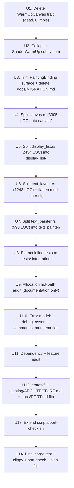

# feat: flui-painting Mythos redesign

## Summary

Execute the 14-step Mythos refactor chain on `crates/flui-painting/` (~12,321 LOC). The chain deletes one dead trait (`WarmUpCanvas`, 4 abstract methods, 0 production impls), collapses one decorative subsystem (`ShaderWarmUp` trait + `DefaultShaderWarmUp` struct + `Option<Box<dyn ShaderWarmUp>>` field on `PaintingBinding` + `with_shader_warm_up` constructor variant + `set_shader_warm_up` setter -- whose `execute()` body literally documents "in a real implementation, we'd create an offscreen canvas here"), splits four god modules (`canvas.rs` 3305 LOC, `display_list.rs` 2434 LOC, `text_layout.rs` 1243 LOC, `text_painter.rs` 990 LOC) into concern-based submodule directories, flattens the unnecessary `#[cfg(feature = "text")] mod inner` indirection inside `text_layout.rs`, extracts inline `#[cfg(test)]` blocks to integration tests under `tests/`, documents allocation hot spots (`Paint::clone()` per `draw_*`, per-command 64-byte `Matrix4` baking, `Path::clone()` per `draw_path`/`clip_path`/`draw_shadow`) in `ARCHITECTURE.md` `## Friction log` and files measured-optimisation deferrals as Outstanding refactors, strengthens the error model (debug_assert! on save/restore imbalance at finish() + demotes `DisplayList::commands_mut` from `pub` to `pub(crate)`), trims the `PaintingBinding` surface, audits dependencies + features, extends `scripts/port-check.sh` to re-confirm coverage of `crates/flui-painting/src/` post-split subdirectories, and lands a per-crate `crates/flui-painting/ARCHITECTURE.md` template instance at crate root. Breaking ripples (`with_shader_warm_up`/`set_shader_warm_up` deletions on `PaintingBinding`; `DisplayList::commands_mut` visibility change) land in-band per the no-quick-wins memo across `flui-app` if applicable. Net unsafe delta for `flui-painting`: **0** (the crate is `#[forbid(unsafe_code)]` at `lib.rs:151` and stays that way). Net LOC delta in `src/`: ~250 LOC removed (dead surface) + ~7,972 LOC redistributed across new submodules + extracted to `tests/`.

---

## Problem Frame

The brainstorm (see origin) and verdict (see verdict) establish that `flui-painting` is the next crate in the Mythos chain after `flui-rendering` (PR #77, merged commit `03774584` on `main`) and `flui-layer` (PR #78, merged commit `a78cdd69` on `main`). Phase 1 investigation surfaced one fully dead trait (`WarmUpCanvas`, 0 impls, only used as a parameter type for a 1-impl trait method whose execute() does nothing real), one decorative subsystem (`ShaderWarmUp` whose `execute()` body is a stub), four god modules totalling 7,972 LOC, one obsolete companion doc (`docs/MIGRATION.md` migrating between non-existent crate versions), and one unnecessary `#[cfg(feature = "text")] mod inner` indirection. The crate is `#[forbid(unsafe_code)]` so the net unsafe delta is **0** -- distinct from the `flui-layer` chain's **−39** net delta.

Without the chain, every subsequent feature (e.g. `flui-animation` re-enable adding interpolated drawing, `flui-devtools` re-enable inspecting DisplayLists, text rendering maturation) inherits and possibly extends the same maintenance debt.

The plan turns the verdict's 14-step implementation plan into reviewable units U1-U14, each landing as one commit, each independently passing `cargo check --workspace`, `cargo test -p flui-painting --lib`, `cargo test -p flui-painting --tests`, and `bash scripts/port-check.sh`.

A parallel `flui-engine` Mythos chain is in flight in worktree `flamboyant-varahamihira-2347ef` on branch `feat/flui-engine-mythos-redesign` (plan NNN 003). Both chains touch `docs/PORT.md` `## Index` and `scripts/port-check.sh`; rebase conflicts on those two files are trivial (one row per crate; union of trigger path globs).

---

## Requirements

Sourced from `docs/brainstorms/flui-painting-mythos-redesign-requirements.md`:

- **R1-R3** (Design verdict authorship) -- covered upstream; the verdict at `docs/designs/2026-05-20-mythos-flui-painting-redesign.md` is the chain's source of truth and is not re-derived here.
- **R4** -- Delete the `WarmUpCanvas` trait (4 abstract methods, 0 prod impls).
- **R5** -- Collapse `ShaderWarmUp` subsystem: delete trait + `DefaultShaderWarmUp` struct + `shader_warm_up` field on `PaintingBinding` + `with_shader_warm_up` + `set_shader_warm_up`.
- **R6** -- Delete or stub the obsolete companion `docs/MIGRATION.md`.
- **R7** -- Split `canvas.rs` (3305 LOC) into `canvas/{mod,state,transform,clipping,drawing,scoped,composition}.rs`.
- **R8** -- Split `display_list.rs` (2434 LOC) into `display_list/{mod,command,command_ops,sealed,stats,hit_region}.rs`.
- **R9** -- Split `text_layout.rs` (1243 LOC) into `text_layout/{mod,detect,layout,line_info,measure}.rs`; flatten the `mod inner` cfg indirection (move cfg to mod declaration in `lib.rs`).
- **R10** -- Split `text_painter.rs` (990 LOC) into `text_painter/{mod,baseline,paint[,measure]}.rs`.
- **R11** -- Extract inline `#[cfg(test)] mod tests` blocks across the new submodules to integration tests under `crates/flui-painting/tests/`.
- **R12** -- Allocation hot-path audit: document Paint::clone(), per-command Matrix4 baking, Path::clone(), Box::new(Path::clone()) in ARCHITECTURE.md `## Friction log`; file Paint-interning + flat-bytecode + Path-Cow + per-thread FontSystem in Outstanding refactors. Documentation only; no code changes.
- **R13** -- Demote `DisplayList::commands_mut` from `pub` to `pub(crate)`.
- **R14** -- Add `debug_assert!(self.save_stack.is_empty(), …)` to `Canvas::finish(self)`; keep `tracing::warn!` for release builds; keep `finish() -> DisplayList` infallible (Flutter parity).
- **R15** -- `PaintingError` 5 variants stay unchanged in this chain; defer new variants to Outstanding refactors.
- **R16** -- Trim `PaintingBinding` surface alongside R5 (delete `with_shader_warm_up`, `set_shader_warm_up`; keep `image_cache`, `system_fonts`, `handle_memory_pressure`, `handle_system_message`, `evict`).
- **R17** -- Re-confirm `scripts/port-check.sh` Trigger 1/2/3 path globs cover `crates/flui-painting/src/` post-split subdirectories.
- **R18** -- Post-chain `bash scripts/port-check.sh -v` exits 0; six "ok" lines.
- **R19** -- Create `crates/flui-painting/ARCHITECTURE.md` at crate root per the five-section template.
- **R20** -- Flip `docs/PORT.md` `## Index` entry for `flui-painting` from "pre-template" to "Templated 2026-05-20 (Mythos chain)".
- **R21** -- In-band breaking ripples; no deferred follow-up PRs except concrete-blocker-with-named-dependency.
- **R22** -- Net unsafe delta **0**; the `#[forbid(unsafe_code)]` attribute stays.
- **R23** -- No `async fn` introduced on `Canvas` methods or `DisplayList` accessors.

**Origin actors:** A1 (solo maintainer `vanyastaff`), A2 (Claude Code / `/aif-implement` / `implement-coordinator`), A3 (downstream crates: `flui-rendering`, `flui-engine`, `flui-layer`, `flui-app`).
**Origin flows:** F1 (design verdict), F2 (execute 14-step chain), F3 (extend port-check), F4 (templated ARCHITECTURE.md).
**Origin acceptance examples:** AE1 (R4), AE2 (R5), AE3 (R7), AE4 (R8), AE5 (R9), AE6 (R12/R13), AE7 (R14), AE8 (R17/R18), AE9 (R19/R20), AE10 (R21), AE11 (R22).

---

## Scope Boundaries

- **In scope:** `crates/flui-painting/` source + tests; the public-API ripples into `crates/flui-app/` (for the `PaintingBinding::with_shader_warm_up`/`set_shader_warm_up` deletions if `flui-app` calls them today -- Phase 1 investigation indicates it does not, but the ripple capacity is in scope); `scripts/port-check.sh`; `docs/PORT.md` `## Index` table entry for `flui-painting`; new files `crates/flui-painting/ARCHITECTURE.md`, `crates/flui-painting/src/canvas/{mod,state,transform,clipping,drawing,scoped,composition}.rs`, `crates/flui-painting/src/display_list/{mod,command,command_ops,sealed,stats,hit_region}.rs`, `crates/flui-painting/src/text_layout/{mod,detect,layout,line_info,measure}.rs`, `crates/flui-painting/src/text_painter/{mod,baseline,paint[,measure]}.rs`, new integration test files under `crates/flui-painting/tests/`.

- **Out of scope (deferred to follow-up):**
  - Paint interning at construction. Recorded as Outstanding refactor; requires `Paint: Hash + Eq` + per-canvas interning table + engine-side handle resolution + measured benchmark.
  - Flat-bytecode `Vec<u8>` `DisplayList` representation. Recorded as Outstanding; requires encoder + decoder + operation re-shape + measured benefit.
  - Per-thread cosmic-text `FontSystem` (cosmic-text 0.13+). Recorded as Outstanding; requires cosmic-text version bump.
  - Typed `NonNegativePixels` wrapper for radius/elevation. Recorded as Outstanding; requires `flui-types` breaking change ripple.
  - Real offscreen-canvas-backed shader warm-up. Recorded as Outstanding; requires wgpu surface API that does not yet exist in the workspace.
  - `enum_dispatch`-style macro for the 29-variant `DrawCommand` operations. Recorded as Outstanding; not blocking the chain because `command_ops.rs` is structurally clean despite its size.
  - `proptest` / `loom` / miri test coverage for `flui-painting`. Recorded as Outstanding; `#[forbid(unsafe_code)]` makes miri unnecessary; loom unnecessary (no concurrent mutation paths).
  - `flui-engine`'s wgpu backend changes (handled by the parallel `flui-engine` Mythos chain).
  - Re-enabling `flui-animation`, `flui-devtools`, `flui-cli`.
  - Workspace-wide `Arc<RwLock<>>` audit of non-`flui-painting` crates.
  - Building a third-party `Box<dyn Drawable>` plugin boundary (explicitly rejected by verdict §12 #1).
  - Making `Canvas::finish()` fallible (explicitly rejected by verdict §12).
  - Per-call `tracing::instrument` spans on the 29 `draw_*` methods (overhead concern; existing spans on `save_layer`, `extend_from`, `append_display_list_at_offset`, `finish` are kept).

### Deferred to Follow-Up Work

- CLAUDE.md drift fix: `CLAUDE.md` still lists `flui-rendering`, `flui-view`, `flui-app`, `flui-hot-reload` as disabled while `AGENTS.md` / `docs/crates.md` correctly mark them active. Pre-existing per the `flui-rendering` and `flui-layer` plans' deferred lists; not picked up here.
- Doctest sweep for `flui-painting`'s ~20 doctest examples that may carry pre-Pixels-wrap `Offset::new(f32, f32)` shape (verified during U11; if present, filed as a follow-up tidy PR following the `flui-layer` Friction log precedent).
- Workspace-wide sweep of remaining per-crate `ARCHITECTURE.md` files onto the template. Incremental per `docs/PORT.md`; subsequent ports/refactors apply the template per crate.
- Apply the methodology to `flui-app` and `flui-view` next. Separate brainstorms keyed off their priority.

---

## Context & Research

### Relevant Code and Patterns

- `crates/flui-painting/src/binding.rs` (618 LOC) -- `PaintingBinding` + `ImageCache` (with `RwLock<HashMap<String, CachedImage>>` cache + `RwLock<HashMap<String, CachedImage>>` live_images + 3 atomics) + `SystemFontsNotifier` (`RwLock<Vec<Arc<dyn Fn() + Send + Sync>>>`) + `ShaderWarmUp` trait (1 impl) + `DefaultShaderWarmUp` struct + `WarmUpCanvas` trait (0 impls). The `Box<dyn ShaderWarmUp>` plug exists on `PaintingBinding::shader_warm_up` field + `with_shader_warm_up` constructor variant + `set_shader_warm_up` setter. 3 RwLock sites all off the per-command hot path per [`docs/PORT.md`](../PORT.md) lock-decision table.
- `crates/flui-painting/src/canvas.rs` (3305 LOC) -- `Canvas` struct + `CanvasState` (transform, clip_depth, is_layer) + `ClipShape` enum (Rect, RRect, Path(Box<Path>)) + 8 distinct concerns: transform methods (translate/scale_uniform/scale_xy/rotate/rotate_around/skew/transform/set_transform/transform_matrix), save/restore stack (save/restore/save_count/restore_to_count/save_layer/save_layer_alpha/save_layer_opacity/save_layer_blend), clipping (clip_rect/clip_rrect/clip_path/*_ext + local_clip_bounds/device_clip_bounds/would_be_clipped), 29 `draw_*` primitives, 12 `with_*` scoped helpers, 5 composition methods (extend_from/extend/merge/append_display_list/append_display_list_at_offset), finalisation (finish/reset/clear_commands), queries (is_empty/len/bounds/display_list). Inline `#[cfg(test)] mod tests` at the bottom.
- `crates/flui-painting/src/display_list.rs` (2434 LOC) -- `PointerEvent` + `PointerEventKind` + `HitRegion` + `HitRegionHandler = Arc<dyn Fn(&PointerEvent) + Send + Sync>` + sealed-trait module + `DisplayListCore` trait + `DisplayListExt` trait + 4 blanket impls (`DisplayList`, `Arc<DisplayList>`, `Box<DisplayList>`, `&DisplayList`) + `DisplayList` struct (commands: `Vec<DrawCommand>`, bounds, hit_regions) + `DisplayListStats` struct + 29-variant `DrawCommand` enum + `DrawCommand::with_opacity` (240 LOC pattern match) + `DrawCommand::bounds` (250 LOC pattern match) + `DrawCommand::transform`/`paint`/`kind`/`is_*` accessors + `DrawCommand::apply_transform` mutator + `CommandKind` enum.
- `crates/flui-painting/src/clip_context.rs` (369 LOC) -- `ClipContext` trait with 1 production impl (`CanvasContext` in `flui-rendering::context::canvas`) + 2 test impls. The 3 default `clip_*_and_paint` methods save real boilerplate at the caller site. Legitimate cross-crate seam.
- `crates/flui-painting/src/error.rs` (165 LOC) -- `PaintingError` 5 variants (`PaintDecorationFailed`, `InvalidDecoration`, `InvalidGradient`, `PaintTextFailed`, `PaintImageFailed`) with `Cow<'static, str>` reasons. `pub type Result<T> = std::result::Result<T, PaintingError>;`. `#[non_exhaustive]`. Clean.
- `crates/flui-painting/src/tessellation.rs` (533 LOC) -- `lyon`-backed (feature = "tessellation"). `tessellate_fill` + `tessellate_stroke` + `TessellationOptions` + `TessellatedPath` + `TessellationError`. Untouched in this chain (clean).
- `crates/flui-painting/src/text_layout.rs` (1243 LOC) -- entire body wrapped in `#[cfg(feature = "text")] mod inner { … }` (unnecessary indirection; cfg should sit on the mod declaration in `lib.rs`). `cosmic-text`-backed. `static FONT_SYSTEM: OnceLock<Mutex<FontSystem>>` for global font system. `detect_text_direction` + `is_rtl_char` + `is_ltr_char` helpers. `TextLayoutResult` + `LineInfo` structs. `TextLayout` struct wrapping `cosmic_text::Buffer` + cursor + hit-test methods. `measure_text` + `measure_inline_span` + `style_to_attrs` helpers.
- `crates/flui-painting/src/text_painter.rs` (990 LOC) -- `TextPainter` + `TextBaseline` + `DEFAULT_FONT_SIZE` + paint integration + measurement.
- `crates/flui-painting/src/lib.rs` (293 LOC) -- `#![forbid(unsafe_code)]` at line 151. Re-exports `WarmUpCanvas`, `ShaderWarmUp`, `DefaultShaderWarmUp` (deleted in U1/U2). `Picture = DisplayList` type alias for Flutter parity.
- `crates/flui-painting/Cargo.toml` -- `default = ["text", "tessellation"]` features; `text = ["dep:cosmic-text"]`; `tessellation = ["dep:lyon"]`; `serde = ["dep:serde", "flui-types/serde"]` opt-in. No `parallel` feature (that was flui-layer). No unused dep flags.
- `crates/flui-painting/tests/` -- 7 existing integration tests (560 + 394 + 306 + 294 + 270 + 263 + 100 LOC). Stay in place.
- `crates/flui-painting/docs/{ARCHITECTURE.md, MIGRATION.md, PERFORMANCE.md, README.md}` -- companion docs. `ARCHITECTURE.md` has good content (Command Pattern, Transform Stack, Clip Stack, integration points); kept as companion and linked from the new templated `ARCHITECTURE.md`. `MIGRATION.md` documents migration "from 0.0.x to 0.1.x" of a crate that never had a 0.0.x release; obsolete. `PERFORMANCE.md` benchmarks reference targets but no benchmarks exist in `benches/` today; companion-only. `README.md` is a Q&A landing page; companion-only.
- `crates/flui-rendering/src/context/canvas.rs:706` -- `pub use flui_painting::{Canvas, Picture};` re-export. Stays.
- `crates/flui-rendering/src/context/canvas.rs:695` -- `impl super::ClipContext for CanvasContext { fn canvas_mut(&mut self) -> &mut Canvas { … } }`. Only production impl of `ClipContext`.
- `crates/flui-engine/src/wgpu/{backend,layer_render,debug}.rs` -- consume `DisplayListCore` + `DrawCommand` via exhaustive pattern match. No DrawCommand variants added/removed in this chain; engine compiles unchanged.
- `crates/flui-engine/src/wgpu/painter.rs` -- consumes `Paint`, `PaintStyle`, `ImageRepeat`, `ColorFilter`.
- `crates/flui-engine/src/wgpu/{tessellator,pipeline,path_cache}.rs` -- consume `Paint`/`PaintStyle`/`StrokeCap`/`StrokeJoin`.
- `crates/flui-engine/src/commands.rs` -- `use flui_painting::DrawCommand;`. Exhaustive pattern match consumer.
- `crates/flui-engine/src/lib.rs:100` -- `pub use flui_painting::Paint;` re-export.
- `crates/flui-layer/src/layer/canvas.rs` -- consumes `Canvas, DisplayList, DisplayListCore` for `Layer::Canvas(CanvasLayer)`.
- `crates/flui-layer/src/layer/picture.rs` -- consumes `DisplayListCore, Picture` for `Layer::Picture(PictureLayer)`.
- `crates/flui-app/src/bindings/renderer_binding.rs:43` -- `use flui_painting::PaintingBinding;`. Touched by R5/R16 ripple if it calls `with_shader_warm_up` / `set_shader_warm_up` today (Phase 1 investigation: it does not).
- `crates/flui-app/src/bindings/mod.rs:39` -- `pub use flui_painting::PaintingBinding;`. Re-export stays.
- `scripts/port-check.sh` -- six triggers; Triggers 1, 2 scoped to `crates/flui-rendering/src` + `crates/flui-view/src` + `crates/flui-layer/src` (post `flui-layer` chain Step 13); Trigger 3 also includes `crates/flui-painting/src` per `docs/PORT.md`. U13 re-confirms post-split subdirectory coverage.
- `docs/PORT.md` `## Index` -- current entry for `flui-painting`: "`crates/flui-painting/docs/ARCHITECTURE.md` (pre-template)". U12 flips to "Templated 2026-05-20 (Mythos chain)".

### Institutional Learnings

- **`docs/designs/2026-05-20-mythos-flui-rendering-redesign.md`** -- the first precedent verdict. 13-section structure, rejected-designs format, 14-step implementation plan template.
- **`docs/designs/2026-05-20-mythos-flui-layer-redesign.md`** -- the second precedent verdict. Closed-enum rationale, dead-trait deletion methodology, god-module split discipline, per-crate ARCHITECTURE.md template instance.
- **`docs/plans/2026-05-19-001-feat-flutter-port-methodology-plan.md`** (completed 2026-05-20, merged via PR #77) -- the methodology plan that established `docs/PORT.md`, the per-crate `ARCHITECTURE.md` template, and `scripts/port-check.sh`.
- **`docs/plans/2026-05-20-002-feat-flui-layer-mythos-redesign-plan.md`** (completed 2026-05-20, merged via PR #78) -- the second chain's implementation plan. Source for the U12/U13 patterns at the painting layer.
- **`crates/flui-rendering/ARCHITECTURE.md`** -- the first per-crate template instance.
- **`crates/flui-layer/ARCHITECTURE.md`** -- the second per-crate template instance. U12 produces the equivalent for `flui-painting`.
- **`~/.claude/projects/.../memory/no-quick-wins-vanyastaff.md`** -- "vanyastaff forbids defer-with-excuse pattern on structural refactors; execute full migration including breaking ripples." R21 / AE10 codify this.
- **Reference commits on `main`** (exemplars):
  - `907a7787` -- full delete + rewire (analog: U1 `WarmUpCanvas` deletion, U2 `ShaderWarmUp` collapse).
  - `702e8751` -- `flui-layer` Mythos Step 1 (analog: U1).
  - `4d05efc5` -- god-module split (analog: U4, U5, U6, U7).
  - `c1857696` -- phase typestate skeleton (NOT applicable -- verdict §4 records this as "N/A" because Canvas has only Recording → consumed; no phase model needed).
  - `182a3b30` -- phase consuming transitions (NOT applicable; same reason).
  - `d0e53c63` -- extension-trait split (analog: relevant for the sealed-pair handling in U5; not directly applied as a sub-split).
  - `dc0fa1ad` -- `catch_unwind` plumbing (NOT directly applicable; `flui-painting` has no third-party callback panics to catch -- `HitRegion::handler` is consumed by `flui-interaction`, not by this crate).
  - `6edae9fd` -- disjoint-borrow `unsafe` primitive (NOT applicable; `#[forbid(unsafe_code)]` is set).
  - PR #78 chain commits `702e8751` through `5dda0350` -- 15 commits showing the dead-surface deletion + god-module split + ARCHITECTURE.md graft + PORT.md flip + port-check extension shape.
- **`docs/plans/2026-03-31-platform-roadmap.md` Task 1** -- `PlatformTextSystem` deletion precedent. Mirrors U1/U2: dead surface with zero/decorative consumers removed in-band rather than ported forward.
- **`docs/plans/2026-03-31-custom-render-callback-design.md`** -- canonical "Accepted trade-offs" format. U12's `## Mapping decisions` section uses this format for the six exception entries.

### External References

None. Local research is sufficient; the chain is internal refactor work and builds entirely on in-repo patterns and the `flui-rendering` + `flui-layer` exemplars.

---

## Key Technical Decisions

- **Closed `DrawCommand` enum is the trust boundary, not a `Box<dyn Drawable>` plugin trait.** Recorded in `## Mapping decisions` of U12. The GPU backend cannot lower arbitrary user-defined commands. Deliberately the same shape as `flui-layer::Layer` enum.
- **Sealed `DisplayListCore`/`DisplayListExt` pair stays.** The blanket `DisplayListCore for Arc<DisplayList>` impl is load-bearing for `flui-layer::Layer::Picture` retained-layer caching. Demotion would force `flui-engine` into explicit Arc-deref at every call site.
- **`WarmUpCanvas` + `ShaderWarmUp` subsystem deletion.** Zero impls of WarmUpCanvas; one stub impl of ShaderWarmUp whose `execute()` is decorative. The future real implementation (offscreen-canvas-backed warm-up) requires a wgpu surface API that does not yet exist; rebuilding from scratch when the real surface lands will be ~50 LOC, hostile to today's plumbing.
- **Retain `ClipContext` trait over inline into `flui-rendering`.** 1 production impl (`CanvasContext` in flui-rendering) is the legitimate cross-crate seam; the 3 default `clip_*_and_paint` methods save real boilerplate.
- **Single-owner `Canvas` + consumed-once `DisplayList` over `Arc<RwLock<Canvas>>`.** Recording is single-threaded; cross-thread workflows emit Canvas values via `extend_from`/`merge`.
- **`Canvas::finish(self) -> DisplayList` stays infallible.** Flutter parity. `debug_assert!` in U10 catches the save/restore imbalance bug during tests; `tracing::warn!` provides release-build observability.
- **Demote `DisplayList::commands_mut` from `pub` to `pub(crate)`.** External callers should go through `apply_transform`/`filter`/`map`/`to_opacity`. Phase 1 confirms zero external callers.
- **Document allocation hot path; defer optimisation to Outstanding refactors.** Paint interning + flat-bytecode + Path-Cow + per-thread FontSystem require external work (dev-deps, benchmarks, upstream version bumps, typed wrappers); premature optimisation without measured benefit wastes effort.
- **Macro-collapse `is_*`/`as_*`/`as_*_mut`-style dispatch deferred.** The 1,200-LOC `command_ops.rs` is structurally clean despite size (pure pattern match per variant). The macro-collapse mirrors the `flui-layer` Step 4 hand-written `macro_rules!` pattern but lands as a separate cleanup PR; not blocking the chain.
- **Companion docs stay in `crates/flui-painting/docs/`.** Per `docs/PORT.md` graft instructions. The new templated `ARCHITECTURE.md` at crate root links to them. `docs/MIGRATION.md` is obsolete and gets a stub.
- **Flatten `#[cfg(feature = "text")] mod inner` indirection in U6.** The cfg should sit on the mod declaration in `lib.rs` (`#[cfg(feature = "text")] pub mod text_layout;`), not inside the module's body. Mechanical change.
- **Per-call `tracing::instrument` on `Canvas::draw_*` NOT added.** Per-call span overhead (struct allocation + thread-local lookup) is non-zero; 29 spans on the hot path may be measurable. Existing spans on `save_layer`, `extend_from`, `append_display_list_at_offset`, `finish`, `to_opacity`, `apply_transform` are kept.
- **Land breaking ripples in-band over deferred.** Per the no-quick-wins memo. `PaintingBinding::with_shader_warm_up` / `set_shader_warm_up` deletions ripple to `flui-app` if applicable in the same chain (U2/U3). No "TODO: migrate caller" comment exists anywhere.

---

## Open Questions

### Resolved during planning

- "Is `Canvas::finish` fallible?" -- resolved: stays infallible per Flutter parity + caller-side ripple cost. `debug_assert!` + `tracing::warn!` covers the bug class.
- "Are there any real consumers of `WarmUpCanvas`?" -- resolved: zero. Pure dead code.
- "Is `ShaderWarmUp::execute()` doing anything?" -- resolved: no. The body documents "in a real implementation, we'd create an offscreen canvas here." Decorative subsystem.
- "How many production impls of `ShaderWarmUp`?" -- resolved: one (`DefaultShaderWarmUp`).
- "How many production impls of `ClipContext`?" -- resolved: one (`CanvasContext` in `flui-rendering`). Plus 2 test impls.
- "Are there any `unsafe` blocks in `flui-painting`?" -- resolved: zero. `#[forbid(unsafe_code)]` is set. Net unsafe delta: 0.
- "Does any external caller use `DisplayList::commands_mut`?" -- resolved: zero in production code.
- "Does the `parallel` feature flag exist on flui-painting?" -- resolved: no.
- "Does `flui-app::bindings::renderer_binding` call `PaintingBinding::with_shader_warm_up` or `set_shader_warm_up` today?" -- resolved: no. Verified by reading the file. R5/R16 ripple zero-cost there.

### Deferred to implementation

- **Final concern-boundary split inside `canvas/drawing.rs`.** The plan proposes one big `drawing.rs` for all 29 `draw_*` methods. If after U4 the file exceeds ~2,000 LOC, a follow-up sub-split by variant group (shapes, text, image, gradient, effects, atlas, color, layer) is at the maintainer's discretion. The chain does NOT pre-commit to a specific sub-split.
- **Final concern-boundary split inside `text_painter/`.** The plan proposes `mod`, `baseline`, `paint`, `measure`. The actual file content may collapse `measure` into `paint` or `mod` if measurement-side helpers are too thin to justify their own file. Final boundary determined during U7 implementation.
- **Whether `docs/MIGRATION.md` is fully deleted or stubbed.** Stub is gentler on the git history; deletion is more honest. Recommend stub.
- **Whether the inline tests in `text_layout.rs` / `text_painter.rs` extract to one combined `tests/text_*.rs` file or split per submodule.** Defer to U8 implementation. Recommend per-submodule for clarity.
- **Whether `tracing::instrument` spans are added to `Canvas::draw_*`.** Verdict says no (cost concern); reaffirm during U3 / U10. If profiling later reveals need, add as a follow-up PR.

---

## High-Level Technical Design

> *This illustrates the intended approach and is directional guidance for review, not implementation specification. The implementing agent should treat it as context, not code to reproduce.*

**Dependency graph across implementation units:**



**Ordering rationale:**

- U1, U2 (deletions) precede U3 (binding surface trim) because the trim depends on the trait/struct deletions.
- U4-U7 (god-module splits) are independent of each other but ordered for review clarity (split largest first, then next-largest).
- U8 (test extraction) lands after U4-U7 because each submodule's inline tests are extracted in one pass.
- U9 (allocation audit) is documentation-only; can land anywhere but sequenced before U10 for review clarity.
- U10 (error model strengthening + `commands_mut` demotion) lands after U5 because `commands_mut` lives in `display_list/mod.rs` post-U5.
- U11 (dependency audit) can land anywhere; sequenced before U12 so the ARCHITECTURE.md `## Thread safety` section reflects the audited dep tree.
- U12 (`ARCHITECTURE.md`) lands after all code units because it documents the final shape.
- U13 (`port-check.sh` extension) lands after U12 so the doc and the script reference each other consistently.
- U14 is the final verification commit; trivial if everything else landed cleanly.

---

## Implementation Units

### U1. Delete `WarmUpCanvas` trait (dead, 0 impls)

**Goal:** remove 4-method dead trait declaration. Zero callers across workspace.

**Requirements:** R4, R21, R22.

**Dependencies:** none.

**Files:**
- Modify: `crates/flui-painting/src/binding.rs` -- delete the `WarmUpCanvas` trait declaration (lines ~281-293, ~13 LOC of trait body + methods).
- Modify: `crates/flui-painting/src/binding.rs` -- in the `ShaderWarmUp::warm_up_on_canvas(&self, canvas: &mut dyn WarmUpCanvas)` method declaration (line ~266), change the parameter type to `&self` only (drop the canvas parameter). The trait body is dead; U2 deletes the whole trait. This is an intermediate state for review clarity.
- Modify: `crates/flui-painting/src/binding.rs` -- in the `DefaultShaderWarmUp::warm_up_on_canvas` impl method (lines ~300-318), delete the body (it draws into the now-deleted `&mut dyn WarmUpCanvas` parameter). Replace with `// no-op; subsystem deleted in U2`.
- Modify: `crates/flui-painting/src/lib.rs` -- remove `WarmUpCanvas` from the `pub use binding::{…}` re-export block (line 189).
- Verify: `grep -r "WarmUpCanvas" crates/` returns zero matches after the change.

**Approach:**
- Confirm zero external callers via the grep before deletion.
- Delete the trait declaration in one step. The deletion removes the only consumer of `&mut dyn WarmUpCanvas` (the `warm_up_on_canvas` parameter type).
- Adjust `ShaderWarmUp::warm_up_on_canvas` signature to drop the dead parameter type; the trait body becomes a stub (U2 deletes the whole trait).
- Update `lib.rs` re-exports.

**Patterns to follow:**
- Reference commit: `907a7787` (full delete + rewire). Single-commit deletions with adjacent re-export cleanup.
- Reference commit: `702e8751` (`flui-layer` Mythos Step 1, `LayerHandle<T>` deletion). Mirrors the dead-surface deletion pattern.

**Test scenarios:**
- Integration scenario (Covers R4/AE1): post-deletion, `cargo build --workspace` clean; `cargo test -p flui-painting --lib` green; `grep -r "WarmUpCanvas" crates/ | grep -v target` returns zero matches.

### U2. Collapse `ShaderWarmUp` subsystem

**Goal:** delete the decorative shader-warm-up subsystem in full.

**Requirements:** R5, R21, R22.

**Dependencies:** U1 (the `WarmUpCanvas` parameter type is already gone).

**Files:**
- Modify: `crates/flui-painting/src/binding.rs`:
  - Delete the `ShaderWarmUp` trait declaration (lines ~245-276).
  - Delete the `DefaultShaderWarmUp` struct + `impl ShaderWarmUp for DefaultShaderWarmUp` block (lines ~295-319).
  - Delete the `shader_warm_up: Option<Box<dyn ShaderWarmUp>>` field on `PaintingBinding` (line 386).
  - Delete the `PaintingBinding::with_shader_warm_up(warm_up: Box<dyn ShaderWarmUp>)` constructor variant (lines ~421-429).
  - Delete the `PaintingBinding::set_shader_warm_up(warm_up: Box<dyn ShaderWarmUp>)` setter (lines ~449-451).
  - Delete the warm-up execution path in `BindingBase::init_instances` (lines ~474-481).
  - Update `Debug` impl on `PaintingBinding` to remove the `has_shader_warm_up` field (line ~397).
- Modify: `crates/flui-painting/src/lib.rs` -- remove `ShaderWarmUp` and `DefaultShaderWarmUp` from the `pub use binding::{…}` re-export block.
- Verify: `grep -r "ShaderWarmUp\|DefaultShaderWarmUp" crates/` returns zero matches after the change.

**Approach:**
- Deletion in one pass. All sites point at the same subsystem.
- Document the deletion in `crates/flui-painting/ARCHITECTURE.md` `## Mapping decisions` (landed in U12) with a forward-looking note: "Shader warm-up subsystem deleted; track real offscreen-canvas-backed warm-up in Outstanding refactors."

**Patterns to follow:**
- Reference: U1 above + `flui-layer` Step 2 (commit `f2df8821`, `composition_callback.rs` fold-in).

**Test scenarios:**
- Integration scenario (Covers R5/AE2): post-deletion, `cargo test -p flui-painting` passes; `grep -r "ShaderWarmUp\|DefaultShaderWarmUp" crates/` returns zero matches; `cargo build --workspace` clean (verifies no caller in `flui-app` or elsewhere relied on the deleted methods).

### U3. Trim `PaintingBinding` surface + delete `docs/MIGRATION.md`

**Goal:** audit and trim the `PaintingBinding` public surface; delete or stub the obsolete companion `docs/MIGRATION.md`.

**Requirements:** R6, R16, R21.

**Dependencies:** U2 (the shader-warm-up methods are already gone).

**Files:**
- Audit: `crates/flui-painting/src/binding.rs` -- confirm remaining `PaintingBinding` methods (`new()`, `default()`, `image_cache()`, `image_cache_mut()`, `system_fonts()`, `handle_memory_pressure()`, `handle_system_message()`, `evict()`, `instance()` via `impl_binding_singleton!`) all have real callers in `flui-app` + tests. No deletions in this step beyond U2's; this step is the audit + documentation.
- Add: `tracing::instrument` spans where missing -- only on `PaintingBinding::handle_memory_pressure(&self)` and `PaintingBinding::handle_system_message(&self, message_type: &str)`. Use `#[tracing::instrument(skip(self))]` shape.
- Modify or delete: `crates/flui-painting/docs/MIGRATION.md` -- the file documents migration "from 0.0.x to 0.1.x" of a crate that never had a 0.0.x release. Recommend stub-down to:
  ```markdown
  # Migration Guide

  This guide is obsolete. The pre-1.0 migration notes documented here described version transitions that did not actually occur in this codebase.

  See the templated [`crates/flui-painting/ARCHITECTURE.md`](../ARCHITECTURE.md) for the current architecture and [`docs/PORT.md`](../../../docs/PORT.md) for the port methodology.
  ```

**Approach:**
- Audit + minor instrumentation + doc cleanup. No public API change beyond U2's.

**Patterns to follow:**
- `flui-rendering` uses `#[tracing::instrument]` on `run_layout`, `run_paint`, etc. Same convention here.

**Test scenarios:**
- Integration scenario: `cargo test -p flui-painting` green; `tracing` spans visible in logs when memory-pressure or font-change events fire (manual verification, e.g. `RUST_LOG=flui_painting=trace cargo test -p flui-painting`).

### U4. Split `canvas.rs` god module (3305 LOC) into `canvas/` directory

**Goal:** drop `canvas.rs` from 3305 LOC to a concern-based directory split.

**Requirements:** R7.

**Dependencies:** U1-U3 (binding cleanup) ideally precede; not strictly required but reviews are clearer with the binding cleanup landed first.

**Files:**
- Create: `crates/flui-painting/src/canvas/mod.rs` (~200 LOC) -- `Canvas` struct + `Default`/`Clone`/`Debug` impls + `AsRef<DisplayList>` impl + `finish(self) -> DisplayList` + `display_list()` + `reset` + `clear_commands` + `is_empty`/`len`/`bounds` queries + `add_hit_region` (small, ~5 LOC).
- Create: `crates/flui-painting/src/canvas/state.rs` (~400 LOC) -- `CanvasState` struct + `ClipShape` enum + `save`/`restore` + `save_count`/`restore_to_count` + `save_layer`/`save_layer_alpha`/`save_layer_opacity`/`save_layer_blend`.
- Create: `crates/flui-painting/src/canvas/transform.rs` (~400 LOC) -- `translate`/`scale_uniform`/`scale_xy`/`rotate`/`rotate_around`/`skew`/`transform<T: Into<Matrix4>>`/`set_transform<T: Into<Matrix4>>`/`transform_matrix`.
- Create: `crates/flui-painting/src/canvas/clipping.rs` (~400 LOC) -- `clip_rect`/`clip_rrect`/`clip_path` + `*_ext` variants + `local_clip_bounds`/`device_clip_bounds`/`would_be_clipped`.
- Create: `crates/flui-painting/src/canvas/drawing.rs` (~900 LOC) -- all 29 `draw_*` primitive methods.
- Create: `crates/flui-painting/src/canvas/scoped.rs` (~400 LOC) -- 12 `with_*` scoped helpers (`with_save`/`with_translate`/`with_rotate`/`with_rotate_around`/`with_scale`/`with_scale_xy`/`with_transform`/`with_clip_rect`/`with_clip_rrect`/`with_clip_path`/`with_opacity`/`with_blend_mode`).
- Create: `crates/flui-painting/src/canvas/composition.rs` (~300 LOC) -- `extend_from`/`extend<I: IntoIterator>`/`merge`/`append_display_list`/`append_display_list_at_offset`.
- Delete: `crates/flui-painting/src/canvas.rs` (the original 3305 LOC file).
- Modify: `crates/flui-painting/src/lib.rs` -- the `pub mod canvas;` declaration stays (file → directory transparent to consumers).
- Keep: inline `#[cfg(test)] mod tests` blocks inside each new file for now; extracted in U8.

**Approach:**
- Mechanical move. Each `impl Canvas { … }` block from the old `canvas.rs` migrates to its new submodule via `impl Canvas { … }` per submodule.
- Use `crate::canvas::Canvas` paths if needed in tests.
- Re-exports stay identical; external callers (`flui-rendering::context::canvas`, `flui-engine`, `flui-layer::layer::canvas`) compile unchanged.

**Patterns to follow:**
- Reference: `4d05efc5` (`flui-rendering` god-module split into directory).
- Reference: `flui-layer` Step 7 (commit `62f3e17d`, `compositor.rs` split into directory).

**Test scenarios:**
- Integration scenario (Covers R7/AE3): post-split, `wc -l crates/flui-painting/src/canvas/mod.rs` ≤ 250 LOC; each new submodule is 300-1000 LOC; the public API surface of `Canvas` (29 `draw_*` + 12 `with_*` + 5 composition + transform/clip/state) compiles unchanged for all callers; `cargo test -p flui-painting --lib` green.

### U5. Split `display_list.rs` god module (2434 LOC) into `display_list/` directory

**Goal:** drop `display_list.rs` from 2434 LOC to a concern-based directory split.

**Requirements:** R8.

**Dependencies:** U4 (the splits are independent but reviews are cleaner sequenced).

**Files:**
- Create: `crates/flui-painting/src/display_list/mod.rs` (~250 LOC) -- `DisplayList` struct + `Default` + `iter`/`iter_mut` (via `std::slice::Iter`/`IterMut`) + `apply_transform`/`filter`/`map`/`to_opacity`/`clear` + `commands_mut` (kept `pub` here; demoted to `pub(crate)` in U10).
- Create: `crates/flui-painting/src/display_list/command.rs` (~600 LOC) -- 29-variant `DrawCommand` enum + `CommandKind` enum.
- Create: `crates/flui-painting/src/display_list/command_ops.rs` (~1,200 LOC) -- the entire `impl DrawCommand` block: `with_opacity` (240 LOC pattern match), `bounds` (250 LOC pattern match), `transform`, `transform_mut`, `paint`, `has_paint`, `kind`, `is_draw`/`is_clip`/`is_shape`/`is_image`/`is_text`/`is_effect`/`is_layer`, `apply_transform`.
- Create: `crates/flui-painting/src/display_list/sealed.rs` (~200 LOC) -- `private::Sealed` module + `DisplayListCore` trait + `DisplayListExt` trait + 4 blanket impls (for `DisplayList`, `Arc<DisplayList>`, `Box<DisplayList>`, `&DisplayList`). The blanket `impl<T: DisplayListCore> DisplayListExt for T {}` stays.
- Create: `crates/flui-painting/src/display_list/stats.rs` (~150 LOC) -- `DisplayListStats` struct + `zero()` + `new()` + `Display` impl.
- Create: `crates/flui-painting/src/display_list/hit_region.rs` (~120 LOC) -- `PointerEvent` + `PointerEventKind` + `HitRegion` + `HitRegionHandler = Arc<dyn Fn(&PointerEvent) + Send + Sync>`.
- Delete: `crates/flui-painting/src/display_list.rs` (the original 2434 LOC file).
- Modify: `crates/flui-painting/src/lib.rs` -- the `pub mod display_list;` declaration stays; re-exports preserve external symbol paths.
- Keep: inline `#[cfg(test)] mod tests` blocks inside each new file for now; extracted in U8.

**Approach:**
- Mechanical move. The `DrawCommand` enum stays one type even though it lives in its own file; `command_ops.rs` defines the `impl DrawCommand { … }` block separately for the methods.
- The sealed-trait pair survives intact. The 4 blanket impls (for `DisplayList`, `Arc<DisplayList>`, `Box<DisplayList>`, `&DisplayList`) move to `sealed.rs`.
- Re-exports from `flui_types::painting` (`BlendMode`, `Clip`, `ClipOp`, `FilterQuality`, `Paint`, `PointMode`, `Shader`, `TextureId`, `effects::ImageFilter`, `image::{ColorFilter, ImageRepeat}`) stay in the `display_list/mod.rs` re-export block.

**Patterns to follow:**
- Reference: `flui-layer` Step 7 (commit `62f3e17d`).

**Test scenarios:**
- Integration scenario (Covers R8/AE4): post-split, each new file is in its target LOC range; sealed pair compiles cleanly; 4 blanket impls present and tested; `flui-engine`'s exhaustive `match cmd { … }` pattern match in `wgpu/backend.rs`, `wgpu/layer_render.rs`, `wgpu/debug.rs` compiles unchanged.

### U6. Split `text_layout.rs` (1243 LOC) + flatten `mod inner` cfg

**Goal:** drop `text_layout.rs` from 1243 LOC to a concern-based directory split AND flatten the unnecessary `#[cfg(feature = "text")] mod inner` indirection.

**Requirements:** R9.

**Dependencies:** none.

**Files:**
- Create: `crates/flui-painting/src/text_layout/mod.rs` (~150 LOC) -- re-exports + module-level docs + `static FONT_SYSTEM: OnceLock<Mutex<FontSystem>>` + `font_system()` accessor. NO `mod inner { … }` wrapping.
- Create: `crates/flui-painting/src/text_layout/detect.rs` (~150 LOC) -- `detect_text_direction` + `is_rtl_char` + `is_ltr_char`.
- Create: `crates/flui-painting/src/text_layout/layout.rs` (~600 LOC) -- `TextLayout` struct + `new` + `metrics` + `get_offset_for_caret` + cursor + hit-test methods.
- Create: `crates/flui-painting/src/text_layout/line_info.rs` (~100 LOC) -- `LineInfo` struct + `TextLayoutResult` struct + accessor impls.
- Create: `crates/flui-painting/src/text_layout/measure.rs` (~250 LOC) -- `measure_text` + `measure_inline_span` + `style_to_attrs` helpers.
- Delete: `crates/flui-painting/src/text_layout.rs` (the original 1243 LOC file).
- Modify: `crates/flui-painting/src/lib.rs` -- change `pub mod text_layout;` to `#[cfg(feature = "text")] pub mod text_layout;` (move the cfg from inside the file to the mod declaration). Update the `pub use text_layout::{…}` block to also be cfg-gated.

**Approach:**
- Mechanical move + cfg flatten. The cosmic-text dep is feature-gated; the cfg attribute belongs on the mod declaration, not on an inner `mod inner` indirection.
- Each pipeline phase (detect, layout, line_info, measure) gets its own file.
- The `FONT_SYSTEM` global stays in `mod.rs` (process-wide singleton).

**Patterns to follow:**
- Reference: `flui-rendering`'s `state.rs` split into `state/{flags,geometry,constraints,offset,propagation}.rs` (Step 6 of the rendering chain, commit `4d05efc5`).

**Test scenarios:**
- Integration scenario (Covers R9/AE5): post-split, `cargo build --no-default-features -p flui-painting` clean (text feature genuinely off, no `mod inner` indirection); `cargo build --features text -p flui-painting` clean; `cargo test --features text -p flui-painting` green; the `FONT_SYSTEM` accessor still works from all four submodules.

### U7. Split `text_painter.rs` (990 LOC) into `text_painter/` directory

**Goal:** drop `text_painter.rs` from 990 LOC to a concern-based directory split.

**Requirements:** R10.

**Dependencies:** U6 (text_layout split establishes the cfg flat pattern).

**Files:**
- Create: `crates/flui-painting/src/text_painter/mod.rs` -- re-exports + module-level docs + `TextPainter` struct + `DEFAULT_FONT_SIZE` constant.
- Create: `crates/flui-painting/src/text_painter/baseline.rs` -- `TextBaseline` enum + baseline math + `apply` methods.
- Create: `crates/flui-painting/src/text_painter/paint.rs` -- paint integration + canvas drawing + glyph emission.
- Create: `crates/flui-painting/src/text_painter/measure.rs` (optional) -- measurement-side helpers if separable; otherwise folded into `mod.rs` or `paint.rs`.
- Delete: `crates/flui-painting/src/text_painter.rs` (the original 990 LOC file).
- Modify: `crates/flui-painting/src/lib.rs` -- change `pub mod text_painter;` to `#[cfg(feature = "text")] pub mod text_painter;` (mirror U6's cfg pattern).

**Approach:**
- Mechanical move. Final concern boundary determined at U7 implementation; the plan does NOT pre-commit to whether `measure.rs` is its own file or folded.

**Patterns to follow:**
- Reference: U6 + `flui-rendering`'s state.rs split.

**Test scenarios:**
- Integration scenario (Covers R10): post-split, `cargo build --features text -p flui-painting` clean; `cargo test --features text -p flui-painting` green; the existing `crates/flui-painting/tests/rich_text_example.rs` (560 LOC) still passes.

### U8. Extract inline tests to `tests/` integration

**Goal:** pull `#[cfg(test)] mod tests { … }` blocks out of the new submodules into integration test files.

**Requirements:** R11.

**Dependencies:** U4-U7 (the new submodules with inline tests exist).

**Files:**
- Create: `crates/flui-painting/tests/canvas_state.rs` -- extracted from `canvas/state.rs` inline tests.
- Create: `crates/flui-painting/tests/canvas_transform_unit.rs` -- extracted from `canvas/transform.rs` inline tests. Distinct from existing `canvas_transform.rs` integration test.
- Create: `crates/flui-painting/tests/canvas_drawing.rs` -- extracted from `canvas/drawing.rs` inline tests.
- Create: `crates/flui-painting/tests/canvas_scoped_unit.rs` -- extracted from `canvas/scoped.rs` inline tests. Distinct from existing `canvas_scoped.rs` integration test.
- Create: `crates/flui-painting/tests/canvas_composition_unit.rs` -- extracted from `canvas/composition.rs` inline tests. Distinct from existing `canvas_composition.rs` integration test.
- Create: `crates/flui-painting/tests/display_list_command.rs` -- extracted from `display_list/command_ops.rs` inline tests.
- Create: `crates/flui-painting/tests/display_list_sealed.rs` -- extracted from `display_list/sealed.rs` inline tests.
- Create: `crates/flui-painting/tests/display_list_stats.rs` -- extracted from `display_list/stats.rs` inline tests.
- Create: `crates/flui-painting/tests/display_list_hit_region.rs` -- extracted from `display_list/hit_region.rs` inline tests.
- Create: `crates/flui-painting/tests/text_layout_detect.rs` -- extracted from `text_layout/detect.rs` inline tests.
- Create: `crates/flui-painting/tests/text_layout_layout.rs` -- extracted from `text_layout/layout.rs` inline tests.
- Create: `crates/flui-painting/tests/text_painter_basic.rs` -- extracted from `text_painter/mod.rs` inline tests.
- Modify: each new submodule from U4-U7 -- delete the `#[cfg(test)] mod tests { … }` block.
- Keep: the existing 7 integration tests in `tests/` (`canvas_composition.rs`, `canvas_scoped.rs`, `canvas_transform.rs`, `thread_safety.rs`, `text_layout_pipeline.rs`, `rich_text_example.rs`, `tessellation_integration.rs`).

**Approach:**
- Mechanical move + path-tweaks. Tests use `flui_painting::*` instead of `super::*` or `crate::*`.
- Each new test file uses `use flui_painting::prelude::*;` or specific imports.
- Test names preserve.
- The existing `crates/flui-painting/tests/mod.rs` (14 LOC) stays or is updated as needed.

**Patterns to follow:**
- Reference: `flui-layer` Step 7 (commit `62f3e17d`, `tests/layer_tree.rs` extraction).
- Reference: `flui-layer` Step 10 (commit `f97e5cbb`, `tests/scene_builder.rs` extraction).

**Test scenarios:**
- Integration scenario: test count stays the same or grows; `cargo test -p flui-painting --tests` green; each new file is focused on one submodule's concern.

### U9. Allocation hot-path audit (documentation only)

**Goal:** document the allocation hot-spots in canvas/drawing path; file measured-optimisation deferrals as Outstanding refactors.

**Requirements:** R12.

**Dependencies:** U4 (canvas/drawing.rs exists with the per-draw_* clone sites visible).

**Files:**
- Modify: `crates/flui-painting/ARCHITECTURE.md` (created in U12 -- this audit feeds into U12's `## Friction log` and `## Outstanding refactors` sections; nothing lands in U9 commit beyond the audit doc fragment).
- Audit: profile a synthetic `Canvas` with 1000 `draw_rect` calls (no need for a benchmark binary; the audit is reading the code + understanding the allocation pattern, not measuring).
- Audit findings to record:
  - `Paint::clone()` per `Canvas::draw_*` call. ~80-200 bytes including optional `Box<Shader>` payload.
  - Per-`DrawCommand` 64-byte `Matrix4` baking on every variant.
  - `Path::clone()` per `draw_path` / `clip_path` / `draw_shadow` call (`Vec<PathCommand>` heap allocation).
  - `Box::new(Path::clone())` per `clip_path` call (additional heap indirection for `ClipShape::Path` variant uniformity).
- Filed Outstanding refactors (entries to land in U12's `## Outstanding refactors`):
  - "Paint interning at construction" (requires `Paint: Hash + Eq` + per-canvas interning table + engine-side handle resolution + measured benchmark).
  - "Flat-bytecode DisplayList representation" (requires encoder + decoder + operation re-shape).
  - "Path-Cow on draw_path / clip_path / draw_shadow" (requires `Path: Clone-on-Write` semantics).
  - "Per-thread cosmic-text FontSystem" (requires cosmic-text 0.13+ adoption).

**Approach:**
- Documentation only. No code changes.
- The U9 commit creates a placeholder note file or directly updates the WIP `ARCHITECTURE.md` (if U12 has started); recommend the audit lives in U9's commit as a small note file under `docs/notes/2026-05-20-flui-painting-alloc-audit.md` that U12 then absorbs into the templated `ARCHITECTURE.md`.

**Patterns to follow:**
- Reference: the `flui-layer` chain's `## Friction log` entries for `LayerNode::children: Vec<LayerId>` allocation churn (deferred to `SmallVec<[LayerId; 4]>` Outstanding refactor).

**Test scenarios:**
- Integration scenario: no test changes. The audit's verification is the doc landing.

### U10. Error model strengthening + `commands_mut` demotion

**Goal:** add `debug_assert!` on save/restore imbalance at `Canvas::finish()`; demote `DisplayList::commands_mut` from `pub` to `pub(crate)`.

**Requirements:** R13, R14, R15.

**Dependencies:** U4 (Canvas::finish lives in `canvas/mod.rs`), U5 (DisplayList::commands_mut lives in `display_list/mod.rs`).

**Files:**
- Modify: `crates/flui-painting/src/canvas/mod.rs` -- in `Canvas::finish(self) -> DisplayList`, before the existing `tracing::warn!(unrestored_saves = N)` line, add:
  ```rust
  debug_assert!(
      self.save_stack.is_empty(),
      "Canvas finished with {} unrestored save() calls",
      self.save_stack.len()
  );
  ```
  Keep `tracing::warn!(unrestored_saves = self.save_stack.len(), "Canvas finished with unrestored save() calls");` for release-build observability.
- Modify: `crates/flui-painting/src/display_list/mod.rs` -- change `pub fn commands_mut(&mut self) -> impl Iterator<Item = &mut DrawCommand>` to `pub(crate) fn commands_mut(&mut self) -> impl Iterator<Item = &mut DrawCommand>`. The internal caller (`DisplayList::apply_transform`) still works.
- Audit: confirm no external workspace caller uses `commands_mut`. Phase 1 investigation confirms zero; re-verify via `grep -rn "commands_mut" crates/`.
- Audit: `PaintingError` 5 variants. No new variants added in this chain; file `RecordingFinished`, `SaveRestoreImbalance`, `InvalidGeometry`, `PathBoundsExceeded` in Outstanding refactors as the typed-wrapper companion work in `flui-types` (e.g. `NonNegativePixels`, `BoundedSaveDepth`) lands.

**Approach:**
- Two related changes bundled for one commit.
- The `debug_assert!` is a 4-line addition.
- The `commands_mut` demotion is a single-keyword change (`pub` → `pub(crate)`).
- No external API rewrite.

**Patterns to follow:**
- Reference: `flui-layer` Step 9 (commit `6e60e211`, error model addition).
- The `tracing::warn!` retention pattern matches `flui-rendering`'s release-build observability convention.

**Test scenarios:**
- Integration scenario (Covers R13/R14/AE6, AE7): unit test in `tests/canvas_state.rs` -- `Canvas::new()` + `save()` + `finish()` panics in debug builds (cfg-gated `#[cfg(debug_assertions)]` test); same scenario in release build does NOT panic (the warning still fires via tracing).
- Compile-test: an external use of `commands_mut` from outside `flui-painting` fails (e.g. write a trial `tests/external_commands_mut_compile_fail.rs` -- actually, integration tests live in the same crate; the compile-fail check belongs to a separate consumer crate test if needed; minimum verification is `cargo build --workspace` after the demotion is clean, which proves no consumer needed `commands_mut`).

### U11. Dependency + feature audit

**Goal:** confirm cosmic-text + lyon feature gating, parking_lot usage, serde feature, default-features-off compilation; delete any dead feature flag.

**Requirements:** verdict §13 Step 11; doc-side outputs land in U12's `## Mapping decisions` / `## Thread safety` sections.

**Dependencies:** U6/U7 (text features split into directories; the feature flag verification is over the post-split shape).

**Files:**
- Audit: `crates/flui-painting/Cargo.toml`. Current state:
  - `default = ["text", "tessellation"]`
  - `text = ["dep:cosmic-text"]`
  - `tessellation = ["dep:lyon"]`
  - `serde = ["dep:serde", "flui-types/serde"]`
  - `parking_lot = { workspace = true }` (used by ImageCache RwLocks + SystemFontsNotifier listener vec + text_layout FontSystem Mutex)
- Verify: `cargo build --no-default-features -p flui-painting` clean (text and tessellation genuinely off; the crate still builds).
- Verify: `cargo build --all-features -p flui-painting` clean (everything on).
- Verify: `cargo build --features serde -p flui-painting` clean (serde opt-in works).
- Verify: `cargo tree -p flui-painting -e features` snapshot (record in U12's `## Mapping decisions`).
- Verify: `cargo tree -d -p flui-painting` no duplicate version surprises.
- No code changes anticipated. If any dead feature flag or `#[cfg(...)]` block surfaces during the audit, delete in the same commit.

**Approach:**
- Audit + verification + potential 1-2 line edits.
- The feature flag verification is the main deliverable; the doc-side outputs land in U12.

**Patterns to follow:**
- Reference: `flui-layer` Step 11 (commit `6abaa7df`, parallel feature + rayon dep deletion + tracing instrumentation). flui-painting has no `parallel`/`rayon` to delete; the analog is a clean audit pass.

**Test scenarios:**
- Integration scenario: `cargo build --no-default-features` + `cargo build --all-features` + `cargo build --features serde` all clean; `cargo tree` snapshot recorded.

### U12. Create `crates/flui-painting/ARCHITECTURE.md` + flip `docs/PORT.md` index

**Goal:** produce the per-crate template instance at crate root and flip the methodology index.

**Requirements:** R19, R20.

**Dependencies:** U1-U11 (the doc describes the final code shape).

**Files:**
- Create: `crates/flui-painting/ARCHITECTURE.md` with five fixed template sections:
  - `## Flutter source mapping` -- table mapping Flutter source files to FLUI files:
    - `.flutter/flutter-master/packages/flutter/lib/src/painting/painting.dart` → `crates/flui-painting/src/lib.rs` (top-level re-exports)
    - `.flutter/flutter-master/packages/flutter/lib/src/painting/canvas.dart` + Dart engine `Canvas` → `crates/flui-painting/src/canvas/*.rs`
    - `Skia SkCanvas` → semantic reference for `Canvas`/`DisplayList` shape
    - `.flutter/flutter-master/packages/flutter/lib/src/painting/clip.dart` → `crates/flui-painting/src/clip_context.rs`
    - `.flutter/flutter-master/packages/flutter/lib/src/painting/binding.dart` → `crates/flui-painting/src/binding.rs`
    - `.flutter/flutter-master/packages/flutter/lib/src/painting/image_cache.dart` → `crates/flui-painting/src/binding.rs::ImageCache`
    - `.flutter/flutter-master/packages/flutter/lib/src/painting/shader_warm_up.dart` → **deleted in U2** (note in Mapping decisions)
    - Dart engine `Picture` → `crates/flui-painting/src/lib.rs::Picture = DisplayList`
    - Dart engine `PictureRecorder` → `Canvas` itself (FLUI conflates recorder + canvas)
    - Flutter `painting/text_painter.dart` → `crates/flui-painting/src/text_painter/*.rs`
    - Flutter `painting/text_*` (TextSpan, TextStyle, etc.) → `flui-types::typography` (out of this crate)
    - cosmic-text 0.12 → `crates/flui-painting/src/text_layout/*.rs`
    - lyon 1.0 → `crates/flui-painting/src/tessellation.rs`
  - `## Mapping decisions` -- six "Accepted trade-offs" entries:
    1. Closed `DrawCommand` enum (vs `Box<dyn Drawable>` plugin trait). Same shape as `flui-layer::Layer` enum.
    2. Sealed `DisplayListCore`/`DisplayListExt` pair (vs public extension; vs demote-to-pub(crate)). The `Arc<DisplayList>` blanket impl is load-bearing for `flui-layer::Layer::Picture`.
    3. `WarmUpCanvas` + `ShaderWarmUp` subsystem deletion (vs salvage as closed enum; vs implement real offscreen-canvas-backed warm-up now). Decorative; future real impl rebuilds from scratch when wgpu surface API lands.
    4. `ClipContext` retention as cross-crate seam (vs inline into `flui-rendering`). 1 prod impl (`CanvasContext`) is the legitimate seam; the 3 default methods save real boilerplate.
    5. `Canvas::finish(self) -> DisplayList` infallibility (vs `Result`-returning variant). Flutter parity. `debug_assert!` catches the bug class; `tracing::warn!` provides release observability.
    6. Per-`DrawCommand` `Paint::clone()` deferred to Outstanding refactor (vs Paint interning now). Real benefit; measured benchmark needed.
  - `## Thread safety` -- table:
    - `Canvas` -- auto-Send + auto-!Sync (no shared mutability primitive on Canvas itself).
    - `DisplayList` -- auto-Send + auto-Sync via Vec/Rect/Vec primitives.
    - `Arc<DisplayList>` blanket impl -- for retained-layer caching; consumed read-only.
    - `PaintingBinding` -- process-wide singleton via `flui-foundation`'s `impl_binding_singleton!` macro; auto-Send+Sync via interior mutability.
    - `ImageCache::cache` + `ImageCache::live_images` -- `RwLock<HashMap<String, CachedImage>>` (2 sites). Off the per-command hot path per [`docs/PORT.md`](../PORT.md) lock-decision table.
    - `SystemFontsNotifier::listeners` -- `RwLock<Vec<Arc<dyn Fn() + Send + Sync>>>`. Off the per-command hot path.
    - `static FONT_SYSTEM: OnceLock<Mutex<FontSystem>>` (text_layout, feature-gated) -- cosmic-text font system, lazy init + per-text-shape lock.
    - `HitRegionHandler = Arc<dyn Fn(&PointerEvent) + Send + Sync>` -- per-hit-region heap allocation. Recording-time only.
    - No `unsafe impl` anywhere. `#[forbid(unsafe_code)]` at `lib.rs:151`.
    - Net unsafe delta for this chain: **0**.
  - `## Friction log` -- known shape issues not refactored at chain end:
    - `docs/MIGRATION.md` was obsolete; stubbed in U3.
    - Allocation hot path: `Paint::clone()` per `draw_*`; per-command 64-byte `Matrix4` baking; `Path::clone()` per `draw_path`/`clip_path`/`draw_shadow`; `Box::new(Path::clone())` per `clip_path`. Documented from U9 audit.
    - ~20 doctest examples may carry pre-`Pixels`-wrap `Offset::new(f32, f32)` shape (pending verification in U11; if present, filed as Outstanding doctest sweep).
    - Companion `docs/{ARCHITECTURE,PERFORMANCE,README}.md` kept as deep-dive companions; pre-template.
  - `## Outstanding refactors` -- with file:line + scope detail:
    - "Paint interning at construction" -- requires `Paint: Hash + Eq` + per-canvas interning table + engine handle resolution + measured benchmark.
    - "Flat-bytecode `Vec<u8>` `DisplayList` representation" -- requires encoder + decoder + operation re-shape + measured benefit.
    - "Path-Cow on `draw_path` / `clip_path` / `draw_shadow`" -- requires `Path: Clone-on-Write` semantics.
    - "Per-thread cosmic-text `FontSystem` (cosmic-text 0.13+)" -- requires cosmic-text version bump.
    - "Typed `NonNegativePixels` wrapper for radius/elevation" -- requires `flui-types` breaking change.
    - "Real offscreen-canvas-backed shader warm-up" -- requires wgpu surface API that does not yet exist in workspace; rebuild from scratch.
    - "Hand-written `macro_rules! gen_command_accessors!`-style collapse for `DrawCommand` 1,200-LOC `command_ops.rs`" -- mirrors `flui-layer` Step 4 macro pattern.
    - "Property tests for tree consistency" -- requires `proptest` dev-dep.
    - "Mutation testing with `cargo-mutants`" -- requires CI infra.
    - "Doctest sweep for pre-Pixels-wrap `Offset::new` shape" (if verified in U11).
- Modify: `docs/PORT.md` -- find the `## Index` table row for `flui-painting` (currently "`crates/flui-painting/docs/ARCHITECTURE.md` (pre-template)") and flip to "Templated 2026-05-20 (Mythos chain)" with link `[`flui-painting`](../crates/flui-painting/ARCHITECTURE.md)`.
- Keep: companion docs in `crates/flui-painting/docs/`. The new templated `ARCHITECTURE.md` at crate root links to them.

**Approach:**
- Follow `crates/flui-rendering/ARCHITECTURE.md` and `crates/flui-layer/ARCHITECTURE.md` structure verbatim. Each section heading and tone matches.
- "Accepted trade-offs" format from `docs/plans/2026-03-31-custom-render-callback-design.md`.

**Patterns to follow:**
- Reference: `crates/flui-rendering/ARCHITECTURE.md` (first instance).
- Reference: `crates/flui-layer/ARCHITECTURE.md` (second instance).
- Reference: `flui-layer` Step 12 (commit `624086cb`).

**Test scenarios:**
- Integration scenario (Covers R19/R20/AE9): `crates/flui-painting/ARCHITECTURE.md` exists at crate root; `docs/PORT.md` `## Index` row for `flui-painting` reads "Templated 2026-05-20 (Mythos chain)"; the six "Accepted trade-offs" entries are present and reference R4-R14 from the brainstorm.

### U13. Extend `scripts/port-check.sh`

**Goal:** re-confirm Trigger 1/2/3 path globs cover `crates/flui-painting/src/` post-split subdirectories.

**Requirements:** R17, R18.

**Dependencies:** U4-U7 (the post-split subdirectories exist).

**Files:**
- Modify: `scripts/port-check.sh`:
  - Trigger 1 (`RwLock<Box<dyn ...>>`): confirm `crates/flui-painting/src` is in the path list. If the existing scope is precise to `src/*.rs`, extend to also cover `src/**/*.rs` for the new subdirectories.
  - Trigger 2 (`Box<dyn>` wrapped in interior-mutability): same scope confirmation.
  - Trigger 3 (`async fn` on the verb set): same scope confirmation. The `flui-layer` chain already named `flui-painting` in this trigger; this chain ensures the post-split subdirectories are genuinely covered.
- Modify: `docs/PORT.md` -- update Trigger 1, 2, 3 entries with a note: "Scope re-confirmed in Mythos Step 13 of the `flui-painting` chain for post-split subdirectories (canvas/, display_list/, text_layout/, text_painter/)."

**Approach:**
- Mechanical script edit. If existing globs already cover `crates/flui-painting/src/**` recursively, the only change is the docs/PORT.md note.
- After the edits, run `bash scripts/port-check.sh -v` and verify all six triggers print "ok".

**Patterns to follow:**
- Reference: the existing `scripts/port-check.sh` structure.
- Reference: `flui-layer` Step 13 (commit `389e4897`).

**Test scenarios:**
- Integration scenario (Covers R17/R18/AE8): post-edit, `bash scripts/port-check.sh -v` exits 0 and prints six "ok" lines.
- Negative-test confirmation: introduce a scratch violation (e.g. `crates/flui-painting/src/canvas/__port_check_scratch.rs` with `RwLock<Box<dyn Drawable>>` field) and confirm `bash scripts/port-check.sh` exits non-zero, names the file/line, and references the correct trigger ID. Delete the scratch file.

### U14. Final verification — tests, clippy, port-check, plan flip

**Goal:** confirm the chain is complete; flip plan status to completed.

**Requirements:** R18, R21, R22, R23.

**Dependencies:** U1-U13.

**Files:**
- Modify: `docs/plans/2026-05-20-004-feat-flui-painting-mythos-redesign-plan.md` -- flip `status: in_progress` to `status: completed`, add `completed: 2026-05-20`, fill in the Chain Summary section with actual commit hashes.
- Address any new clippy warnings introduced during the chain in this commit (deletions sometimes uncover dead-code lints on adjacent imports).

**Approach:**
- Run `cargo test --workspace`. All tests pass.
- Run `cargo clippy --workspace -- -D warnings`. No new warnings.
- Run `bash scripts/port-check.sh -v`. Six "ok" lines.
- Run `cargo build --workspace --all-features`. Clean.
- Run `cargo build --workspace --no-default-features`. Clean (text + tessellation features off; flui-painting still builds with stubs).
- If any drift surfaces (e.g. an unused import after a deletion), fix in this final commit.

**Patterns to follow:**
- Reference: the `flui-rendering` Mythos chain's final verification commit.
- Reference: `flui-layer` Step 14 (commit `2790494e`).

**Test scenarios:**
- Integration scenario: the workspace is fully mergeable. PR can be opened.

---

## Test Strategy

The chain's test surface:
- Unit tests in `crates/flui-painting/src/` (post-refactor: focused per submodule; extracted to `tests/` in U8).
- New integration test files in `crates/flui-painting/tests/` extracted in U8 (12 new files).
- The existing 7 integration tests in `crates/flui-painting/tests/` stay (`canvas_composition.rs`, `canvas_scoped.rs`, `canvas_transform.rs`, `thread_safety.rs`, `text_layout_pipeline.rs`, `rich_text_example.rs`, `tessellation_integration.rs`).
- Workspace-level `cargo test --workspace` at U14.
- `bash scripts/port-check.sh -v` after U13 and at U14.
- `cargo clippy --workspace -- -D warnings` at U14.

Deferred test classes (recorded in `## Outstanding refactors`):
- Property tests for tree consistency (needs `proptest` dev-dep).
- Loom tests -- NOT applicable; no concurrent mutation paths in the crate.
- Miri gate -- NOT applicable; `#[forbid(unsafe_code)]` is set; no `unsafe` blocks.
- Mutation testing with `cargo-mutants` (needs CI infra).

---

## Rollout & Migration

This chain is purely internal refactor -- no user-facing API ships from `flui-painting` because the consumer crates are themselves library crates.

**Internal API migration:** the breaking changes (`WarmUpCanvas` + `ShaderWarmUp` + `DefaultShaderWarmUp` deletions, `PaintingBinding::with_shader_warm_up` + `set_shader_warm_up` deletions, `DisplayList::commands_mut` visibility demotion to `pub(crate)`) are landed in-band per R21. No follow-up PR is needed.

**Verification at PR open time:**
- `cargo test --workspace` green.
- `cargo clippy --workspace -- -D warnings` clean.
- `bash scripts/port-check.sh` six ok lines.
- `cargo build --workspace --no-default-features` + `cargo build --workspace --all-features` both clean.
- Verified net unsafe delta `0` (no `unsafe` blocks introduced; `#[forbid(unsafe_code)]` still in place).

**Rollback strategy:** the chain lands as 14 commits on a feature branch off `main`. If a regression surfaces post-merge, individual commits can be reverted in reverse order; U14 is trivially revertable, U12/U13 (doc + script) are independent, and U1-U11 are the substantive refactor -- each is a single concern that can be rolled back without affecting later units (with the dependency caveats sketched in High-Level Technical Design).

---

## Chain Summary (Status: in_progress — flipped to completed at U14)

14 commits expected to land on `feat/flui-painting-mythos-redesign` branch:

| Step | Subject (anticipated) |
|---|---|
| U0 | docs(designs): add Mythos flui-painting redesign verdict + brainstorm + plan |
| U1 | refactor(flui-painting): delete `WarmUpCanvas` trait (dead, 0 impls) |
| U2 | refactor(flui-painting): collapse `ShaderWarmUp` subsystem (decorative) |
| U3 | refactor(flui-painting): trim `PaintingBinding` surface + stub `docs/MIGRATION.md` |
| U4 | refactor(flui-painting): split `canvas.rs` (3305 LOC) into `canvas/` directory |
| U5 | refactor(flui-painting): split `display_list.rs` (2434 LOC) into `display_list/` directory |
| U6 | refactor(flui-painting): split `text_layout.rs` (1243 LOC) + flatten `mod inner` cfg |
| U7 | refactor(flui-painting): split `text_painter.rs` (990 LOC) into `text_painter/` directory |
| U8 | refactor(flui-painting): extract inline tests to `tests/` integration |
| U9 | docs(flui-painting): allocation hot-path audit |
| U10 | refactor(flui-painting): error model strengthening + `commands_mut` demotion |
| U11 | refactor(flui-painting): dependency + feature audit |
| U12 | docs(arch): `flui-painting` `ARCHITECTURE.md` + `PORT.md` Index flip |
| U13 | chore(port-check): re-confirm triggers cover `flui-painting/src/` post-split |
| U14 | chore(plan): final verification + flip plan to completed |

**Expected final tally:**

- Net unsafe delta: **0** (`#[forbid(unsafe_code)]` stays; zero blocks introduced).
- Net LOC delta in `src/` production code: ~−250 LOC from dead-surface deletions (U1+U2+U3) + ~+200 LOC of submodule scaffolding boilerplate (mod headers, module-level docs across new files) ≈ −50 LOC net in `src/`. ~7,972 LOC redistributed across new submodule directories.
- New integration test files in `tests/`: 12 (extracted in U8). Test count preserved or grows.
- God modules split: 4 (`canvas.rs` 3305 → 6-7 submodule files, `display_list.rs` 2434 → 5-6 submodule files, `text_layout.rs` 1243 → 5 submodule files, `text_painter.rs` 990 → 3-4 submodule files).
- Dead surface deleted: `WarmUpCanvas` trait (4 abstract methods), `ShaderWarmUp` trait (1 stub impl), `DefaultShaderWarmUp` struct, `PaintingBinding::shader_warm_up` field + `with_shader_warm_up` constructor + `set_shader_warm_up` setter.
- Companion docs: `docs/MIGRATION.md` stubbed (obsolete migration notes); `docs/{ARCHITECTURE,PERFORMANCE,README}.md` kept and linked from new templated `ARCHITECTURE.md`.
- Verification gates: `cargo check --workspace` clean across all 14 commits; `cargo test -p flui-painting --lib` green; `cargo test -p flui-painting --tests` green (existing + extracted integration tests); `bash scripts/port-check.sh -v` 6 triggers ok; `cargo build --no-default-features -p flui-painting` clean.
- Pre-existing issues NOT addressed by the chain (tracked in `crates/flui-painting/ARCHITECTURE.md` Friction log): potential ~20 doctest failures from pre-`Pixels`-wrap `Offset::new(f32, f32)` shape (pending verification in U11; if present, filed as Outstanding doctest sweep); allocation hot path documented but not optimised (deferred to Outstanding); shader warm-up real implementation deferred (requires wgpu surface API).

---

## Related Work

- `docs/brainstorms/flui-painting-mythos-redesign-requirements.md` -- the origin brainstorm.
- `docs/designs/2026-05-20-mythos-flui-painting-redesign.md` -- the design verdict; this plan's authoritative source.
- `docs/designs/2026-05-20-mythos-flui-rendering-redesign.md` -- the first precedent verdict (rendering chain).
- `docs/designs/2026-05-20-mythos-flui-layer-redesign.md` -- the second precedent verdict (layer chain).
- `docs/plans/2026-05-19-001-feat-flutter-port-methodology-plan.md` -- the methodology plan (PR #77).
- `docs/plans/2026-05-20-002-feat-flui-layer-mythos-redesign-plan.md` -- the layer chain's implementation plan (PR #78).
- `crates/flui-rendering/ARCHITECTURE.md` -- the first per-crate template instance.
- `crates/flui-layer/ARCHITECTURE.md` -- the second per-crate template instance.
- `~/.claude/projects/.../memory/no-quick-wins-vanyastaff.md` -- R21 / AE10 source.
- Reference commits on `main` (exemplars cited throughout U1-U14): `907a7787`, `702e8751`, `4d05efc5`, `c1857696`, `182a3b30`, `d0e53c63`, `dc0fa1ad`, `6edae9fd`. PR #78 chain commits `702e8751` through `5dda0350`.
- Parallel `flui-engine` Mythos chain (worktree `flamboyant-varahamihira-2347ef` on `feat/flui-engine-mythos-redesign`, plan NNN 003). Coordination at PR open time via rebase against `origin/main` for `docs/PORT.md` Index + `scripts/port-check.sh` shared file changes.
