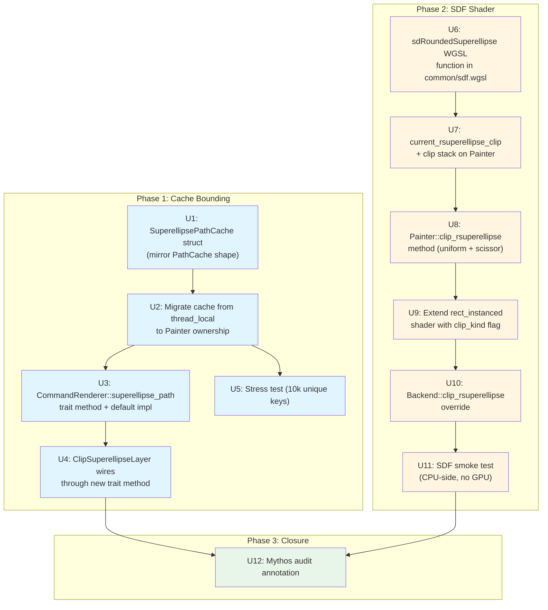

# feat: SUPERELLIPSE_CACHE bounding + real iOS-squircle SDF clip

## Summary

Bound `SUPERELLIPSE_CACHE` by mirroring the `PathCache` shape (max_entries / last_used_frame / advance_frame eviction) and migrating it from a `thread_local!` static onto the `Painter` struct, then add a real iOS-squircle SDF clip (`sdRoundedSuperellipse` WGSL function + per-instance `clip_kind` flag + `Painter::clip_rsuperellipse` method + `Backend::clip_rsuperellipse` override) so the immediate-mode superellipse clip produces pixel-perfect iOS-squircle geometry instead of falling back to the `clip_rrect` approximation introduced in PR #82. Twelve atomic commits sequenced so workspace build, test suite, clippy, and `port-check.sh` stay green after each.

## Problem Frame

PR #82 ([refactor(painting): ClipContext consolidation + RSuperellipse parity (#82)](https://github.com/vanyastaff/flui/pull/82), merged commit `a6094c00`) landed the `RSuperellipse` clip stack — `DrawCommand::ClipRSuperellipse` variant, `Canvas::clip_rsuperellipse` op, `CommandRenderer::clip_rsuperellipse` trait method with a default fallback that routes to `clip_rrect` — but left two follow-up obligations explicitly tied to Mythos audit Step 5 item 14:

1. **`SUPERELLIPSE_CACHE` is unbounded.** [crates/flui-engine/src/wgpu/layer_render.rs](../../crates/flui-engine/src/wgpu/layer_render.rs) declares `thread_local! { static SUPERELLIPSE_CACHE: RefCell<HashMap<SuperellipseKey, Path>> = RefCell::new(HashMap::new()); }` with no eviction. Long-running apps that produce a variety of superellipse keys (animation frames with shifting corner radii, dynamic UI surfaces) leak memory monotonically. The audit's verbatim ask: "Mirror the `PathCache` shape (max_entries, last_used_frame, advance_frame eviction). Add a memory-budget metric so this never recurs invisibly. Add a stress test that emits 10k unique superellipse keys and asserts cache size stays ≤ max_entries."

2. **The immediate-mode SDF is missing.** `CommandRenderer::clip_rsuperellipse` ([crates/flui-engine/src/traits.rs](../../crates/flui-engine/src/traits.rs)) defaults to `self.clip_rrect(approximating_rrect, ...)` — rendering identical to a rounded rectangle. The iOS-squircle parametric `|x/rx|^n + |y/ry|^n = 1` curve (Flutter uses `n = 4`) requires a real WGSL fragment-shader SDF; the brainstorm bundles the shader work into this plan per user "do full" decision.

Predecessor PR's [doc-clarification commit `85b3aa26`](https://github.com/vanyastaff/flui/commit/85b3aa26) explicitly hedged the trait method's doc comments — "exact rendering is backend-dependent; default approximates via clip_rrect" — anticipating this follow-up. This plan delivers the real SDF.

## Requirements

Carries forward from origin (see [origin: docs/brainstorms/superellipse-cache-and-sdf-requirements.md](../brainstorms/superellipse-cache-and-sdf-requirements.md)). R1-R13 are functional consolidation requirements; R14-R17 are verification gates that apply across all units. AE1-AE4 from origin are exercised by U1, U6, U11 test scenarios.

**Cache bounding (mirror PathCache):**
- **R1**: Replace `thread_local!` static with bounded `SuperellipsePathCache` struct owned by `Painter`. Mirror `PathCache` shape: `HashMap<SuperellipseKey, CachedSuperellipsePath>` + `max_entries: usize` + `current_frame: u64` + `hits`/`misses` + `EVICTION_THRESHOLD = 120` + per-entry `last_used_frame`.
- **R2**: `advance_frame()` increments counter and evicts entries older than threshold. Called once per frame from `Painter::render`.
- **R3**: `insert()` evicts LRU when at `max_entries` capacity.
- **R4**: Default `max_entries = 256`. Configurable via `SuperellipsePathCache::new(max_entries)`.
- **R5**: `stats() -> (u64, u64, usize)` returns hits/misses/current_entries. `tracing::debug!` on eviction events.
- **R6**: Stress test asserts 10k unique key inserts → cache size = `max_entries` exactly (AE2).

**SDF shader (real iOS-squircle clip):**
- **R7**: Add `sdRoundedSuperellipse` to `common/sdf.wgsl` implementing per-pixel `(|dx/rx|^n + |dy/ry|^n)^(1/n)` in corner regions with `n = 4`.
- **R8**: Add `current_rsuperellipse_clip: [f32; 12]` storage on `Painter` (4 floats outer rect + 8 floats per-corner radii; exponent `n = 4` hardcoded in shader, no uniform slot needed).
- **R9**: Override `CommandRenderer::clip_rsuperellipse` in `Backend` to call `Painter::clip_rsuperellipse` (new method, parallel to `Painter::clip_rrect`). Default fallback in trait stays as safety net for backends that don't implement the shader.
- **R10**: `rsuperellipse_clip_stack: Vec<[f32; 12]>` on Painter for save/restore semantics, matching the existing `rrect_clip_stack` shape.
- **R11**: Visual smoke test verifies SDF produces different sample value than `sdRoundedBox` at a known corner-curvature point (CPU-side test against the WGSL math, no GPU device needed) (AE4).

**Layer-tree path preservation:**
- **R12**: `ClipSuperellipseLayer::render` keeps using path-tessellation route via new `CommandRenderer::superellipse_path(rse) -> Path` trait method with default impl that calls a free-function fallback (preserves backward-compat for non-Painter backends). Bounded cache (R1-R6) serves the path-tessellation route; the SDF (R7-R11) serves the immediate-mode dispatch route. Both coexist.
- **R13**: Existing `generate_superellipse_path` math (`n = 4`, 64 sample points per corner) stays as reference implementation for the path-tessellation route.

**Verification gates:**
- **R14**: `cargo build --workspace` passes after each commit.
- **R15**: `cargo test --workspace --lib --tests` passes; stress test (R6) and SDF smoke test (R11) live in `flui-engine`'s test suite.
- **R16**: `cargo clippy --workspace --all-targets -- -D warnings` passes after the final commit.
- **R17**: `bash scripts/port-check.sh -v` reports 7/7 institutional refusal triggers ok after each commit.

---

## Output Structure

No new directory hierarchy. All edits modify existing files except U7's new `sdRoundedSuperellipse` function which lands inside the existing [crates/flui-engine/src/wgpu/shaders/common/sdf.wgsl](../../crates/flui-engine/src/wgpu/shaders/common/sdf.wgsl). The bounded cache may extract to its own module (`crates/flui-engine/src/wgpu/superellipse_cache.rs`) per the implementer's call — see Key Decisions.

---

## High-Level Technical Design



This dependency graph is directional guidance for review, not implementation specification. The implementing agent should treat it as context.

---

## Key Technical Decisions

- **Cache moves from `thread_local!` static to `Painter` field (research-resolved Q from origin).** `PathCache` lives on `Painter` as `path_cache: PathCache`; `Painter::render` calls `self.path_cache.advance_frame()` at frame start. The bounded `SuperellipsePathCache` mirrors this ownership pattern exactly. The `thread_local!` was a workaround predating Painter-owned cache infrastructure; eliminating it removes a static-mutable smell while preserving the single-threaded-rendering invariant (each Painter owns its cache, same as PathCache).

- **`CommandRenderer::superellipse_path` trait method preserves backward-compat (research-resolved).** `ClipSuperellipseLayer::render` currently calls the free function `get_or_generate_superellipse_path(superellipse)` and passes the resulting `Path` to `renderer.push_clip_path(...)`. Moving cache ownership onto Painter would break this call site if it directly accessed the cache. Solution: add a `fn superellipse_path(&mut self, rse: RSuperellipse) -> Path` method on `CommandRenderer` with a default impl that calls the existing free function (uses a still-thread_local-or-static fallback cache for non-Painter backends), and `Backend` overrides to consult its `Painter::superellipse_cache`. `DebugBackend` and `MockRenderer` inherit the default; only `Backend` needs the override.

- **Tuple shape `[f32; 12]` for `current_rsuperellipse_clip` (research-resolved Q1).** Mirrors `current_rrect_clip: [f32; 8]` tuple convention (verified at [crates/flui-engine/src/wgpu/painter.rs:356](../../crates/flui-engine/src/wgpu/painter.rs)). 4 floats for outer rect (x, y, w, h) + 8 floats for per-corner radii (rx/ry per corner × 4 corners). Exponent `n = 4` is **hardcoded in the WGSL shader**, not a uniform slot — Flutter's iOS-squircle is fixed at `n = 4`, configurable exponents are explicitly out of scope.

- **Outer-rect scissor clip alongside SDF (research-resolved Q2).** `Painter::clip_rrect` ([crates/flui-engine/src/wgpu/painter.rs:3411](../../crates/flui-engine/src/wgpu/painter.rs)) calls `self.clip_rect(rrect.rect)` after setting the SDF uniform. The scissor provides early rasterizer rejection outside the bounding box, saving fragment-shader work. `Painter::clip_rsuperellipse` follows the same pattern with `self.clip_rect(rse.outer_rect())`.

- **SDF function in `common/sdf.wgsl`, NOT shared with `sdRoundedBox` (research-resolved Q4).** The existing `sdRoundedBox` uses standard SDF (`min(max(q.x, q.y), 0.0) + length(max(q, 0)) - r`). Rounded superellipse needs `(|dx/rx|^n + |dy/ry|^n)^(1/n) - 1` in the corner region with `n = 4` — not a parameterization of the rrect SDF (which corresponds to `n = 2` in the L2-norm sense, but the corner-radius selection logic differs). Add `sdRoundedSuperellipse` as a sibling function in `common/sdf.wgsl`; share `sdfToAlpha` for antialiasing.

- **`clip_kind: u32` per-instance flag in rect_instanced shader (planning-time decision).** The existing `rect_instanced.wgsl` carries `clip_bounds: vec4<f32>` + `clip_radii: vec4<f32>` per instance and calls `sdRoundedBox(clip_p, clip_half, in.clip_radii)` for the clip portion. Adding superellipse clip support without doubling the per-instance buffer size: add a `clip_kind: u32` field (0 = none, 1 = rrect, 2 = rsuperellipse) — reuses the existing 8 floats with a different SDF function call site. `Painter::clip_rsuperellipse` populates `clip_kind = 2`, the shader branches between `sdRoundedBox` and `sdRoundedSuperellipse`. Touches only `rect_instanced.wgsl` + `instancing.rs::InstanceData`. Other shaders (circle, gradient, texture) keep the existing rrect-only clip path; superellipse clipping of those primitives uses bounding-rect rrect approximation (audit-aligned, since the audit's mandate is the immediate-mode clip operation, not pixel-perfect clipping of every primitive type).

- **SDF smoke test is CPU-side, not GPU-side (research-resolved Q3).** `crates/flui-engine/tests/` does not exist (verified — only `src/` test modules). Writing GPU-device integration tests would require new infra (wgpu device fixture, golden-image pipeline) that is explicitly out of scope (see brainstorm Deferred to Follow-Up Work). Smoke test transliterates the WGSL `sdRoundedSuperellipse` math into a Rust helper, evaluates at a known sample point (e.g., 30px inside a corner of a 200×200 squircle with radius 80), and asserts the result differs from the same evaluation through `sdRoundedBox`. Locks in that the SDF is doing different math; full visual regression is follow-up.

- **`SuperellipseKey` struct stays as-is.** Verified at [crates/flui-engine/src/wgpu/layer_render.rs:27](../../crates/flui-engine/src/wgpu/layer_render.rs): already derives `Hash, PartialEq, Eq, Clone` with f32-to-bits representation. Works unchanged as the bounded cache's HashMap key.

- **Atomic-commit-per-finding shape per PR #81 / #82 precedent.** 12 units land as 12 atomic commits. Each unit's verification keeps workspace build green; each commit message includes the `Co-Authored-By: Claude Opus 4.7 (1M context) <noreply@anthropic.com>` trailer per CLAUDE.md.

- **Commit-scope tags.** `feat(engine):` for U1-U10 (SDF + cache + override are net-new functionality, not refactors). `test(engine):` for U5 + U11 (test-only commits). `docs(research):` for U12.

- **Line-number policy: symbol-based discovery.** Implementer uses `rg` on symbol names at edit time; cited positions are illustrative only.

---

## Implementation Units

### U1. Introduce `SuperellipsePathCache` struct (mirror PathCache shape)

**Goal:** Add a bounded cache type that mirrors `PathCache`'s shape — `HashMap`-backed with `max_entries` cap, `current_frame` counter, per-entry `last_used_frame`, LRU-by-capacity + by-frame eviction, and `stats()` accessor. Do not yet wire it onto Painter or migrate the thread_local — that's U2.

**Requirements:** R1, R2, R3, R4, R5.

**Dependencies:** None — leaf change, lands first.

**Files:**
- New module: [crates/flui-engine/src/wgpu/superellipse_cache.rs](../../crates/flui-engine/src/wgpu/superellipse_cache.rs) carrying `SuperellipsePathCache` struct + impl + tests. (The implementer may instead extend [crates/flui-engine/src/wgpu/layer_render.rs](../../crates/flui-engine/src/wgpu/layer_render.rs) in place if extraction adds little value; default is extraction for parallelism with `path_cache.rs`.)
- [crates/flui-engine/src/wgpu/mod.rs](../../crates/flui-engine/src/wgpu/mod.rs) — add `mod superellipse_cache;` declaration and `pub use` if extracted.

**Approach:**
- Read [crates/flui-engine/src/wgpu/path_cache.rs](../../crates/flui-engine/src/wgpu/path_cache.rs) as the canonical reference. Mirror every named field and method shape: `entries: HashMap<SuperellipseKey, CachedSuperellipsePath>`, `max_entries: usize`, `hits: u64`, `misses: u64`, `current_frame: u64`, plus `EVICTION_THRESHOLD: u64 = 120` const matching PathCache.
- `CachedSuperellipsePath` struct: `path: flui_types::painting::Path` + `last_used_frame: u64`.
- `SuperellipsePathCache::new(max_entries: usize)` — default = 256 in the eventual caller (Painter); the cache itself accepts any value.
- `get(&mut self, key: &SuperellipseKey) -> Option<flui_types::painting::Path>` — mirror PathCache::get's hit/miss counter update + last_used_frame bump. Cloning is acceptable here since the cached payload is a Path (same as PathCache's `(positions, indices)` return — read PathCache to confirm whether by-ref or by-value is right; default is by-value clone since Path's clone is reasonably cheap and the caller consumes the value).
- `insert(&mut self, key: SuperellipseKey, path: flui_types::painting::Path)` — mirror PathCache::insert capacity-eviction logic.
- `advance_frame(&mut self)` — mirror PathCache::advance_frame retain-by-threshold.
- `stats(&self) -> (u64, u64, usize)` — return `(hits, misses, entries.len())`.
- `clear(&mut self)` — empty the map, reset stats.
- Re-export `SuperellipseKey` from `layer_render.rs` for cache visibility (or move the key type into the new module if extracted).

**Patterns to follow:**
- [crates/flui-engine/src/wgpu/path_cache.rs](../../crates/flui-engine/src/wgpu/path_cache.rs) lines 19-170 — the entire PathCache impl block is the reference. Match field naming, method signatures, doc-comment style, and tracing on eviction.

**Test scenarios** (lives in the new module's `#[cfg(test)] mod tests`):
- **Happy path (R1, R3):** Create cache, insert one entry, `get` returns the path. Cache size = 1, hits = 1, misses = 0 in stats.
- **Edge case (R3, AE1):** Insert N+1 entries into a cache with `max_entries = N`. Final cache size = N. The first-inserted entry no longer present.
- **Edge case (R2, AE3):** Insert entry, advance frame 121 times without re-accessing. Entry evicted; stats show 0 entries.
- **Edge case (R5):** Hits/misses counter correctness — sequence `get(missing) → insert → get(present) → get(present)` produces stats `(2 hits, 1 miss, 1 entry)`.
- **Edge case:** `clear()` empties entries and zeroes hits/misses but leaves `current_frame` unchanged (matches PathCache's `clear` semantics — verify).

**Verification:**
- `cargo check -p flui-engine` clean.
- `cargo test -p flui-engine --lib superellipse_cache` passes all scenarios.
- `cargo build --workspace` clean.
- `bash scripts/port-check.sh -v` reports 7/7 triggers ok.

---

### U2. Migrate cache from `thread_local!` to `Painter` ownership

**Goal:** Replace the `thread_local! { static SUPERELLIPSE_CACHE: ... }` in `layer_render.rs` with a `superellipse_cache: SuperellipsePathCache` field on `Painter`. Update `get_or_generate_superellipse_path` to take `&mut SuperellipsePathCache` instead of consulting the thread-local. Wire `advance_frame()` into `Painter::render`'s per-frame call site (next to the existing `self.path_cache.advance_frame()` call).

**Requirements:** R1, R2, R4.

**Dependencies:** U1.

**Files:**
- [crates/flui-engine/src/wgpu/painter.rs](../../crates/flui-engine/src/wgpu/painter.rs) — add `superellipse_cache: SuperellipsePathCache` field; initialize with `SuperellipsePathCache::new(256)` in the constructor; call `self.superellipse_cache.advance_frame()` once per frame.
- [crates/flui-engine/src/wgpu/layer_render.rs](../../crates/flui-engine/src/wgpu/layer_render.rs) — delete the `thread_local! { ... SUPERELLIPSE_CACHE ... }` block; rewrite `get_or_generate_superellipse_path` to accept `&mut SuperellipsePathCache` as a parameter (and call it as a free function from the eventual U3/U4 dispatch sites). Keep `generate_superellipse_path` and `SuperellipseKey` unchanged.

**Approach:**
- Search for every call site of `get_or_generate_superellipse_path` and `SUPERELLIPSE_CACHE.with(...)` via `rg`. Confirmed at brainstorm time: only `ClipSuperellipseLayer::render` calls into the cache. That call site updates in U4 (after U3 introduces the trait method seam); for U2, the function signature change is enough to break the call site temporarily — but the plan must keep workspace-compiling, so U2 also stub-updates the `ClipSuperellipseLayer::render` callsite to call a TEMPORARY free-function fallback that still uses a `thread_local!` cache, deleted in U4. **OR**: bundle U2+U3+U4 into a single commit — the cleaner shape because the migration is genuinely atomic.

  **Decision: bundle U2+U3+U4 as a single commit.** Three nominal units in the dependency graph for clarity, but the implementer commits them together as a unit because each individually would break workspace build. The commit-per-finding shape still holds — the finding here is "migrate the cache".

  Update U2's atomic-commit boundary: U2 = "Migrate SUPERELLIPSE_CACHE to Painter ownership via new CommandRenderer::superellipse_path trait method + update ClipSuperellipseLayer::render call site". Single commit. U3 and U4 stay in the dependency graph as conceptual phases but land together.

- After the migration, `ClipSuperellipseLayer::render` calls `renderer.superellipse_path(self.clip_superellipse())` instead of the free function.

**Patterns to follow:**
- [crates/flui-engine/src/wgpu/painter.rs](../../crates/flui-engine/src/wgpu/painter.rs) — search for `path_cache` to find the existing field declaration, constructor initialization, and `advance_frame()` call site. The new `superellipse_cache` field follows the same pattern.
- PR #82 U5 (commit `45e11363`) — combined-commit precedent: "deletion + migration in one commit because workspace compile gate requires both together".

**Test scenarios:**
- **Integration (R2):** `Painter::render` is called N times; `superellipse_cache.current_frame` increments by N. Verify via a Painter test fixture (or via `cargo build` + manual `tracing::debug!` inspection if Painter's existing tests don't expose internals).
- **Happy path (R12):** `ClipSuperellipseLayer::render` continues to produce a path-tessellated clip (the cached path is the same `n=4` squircle the layer-tree path expects). Wire smoke test if not already covered by existing `ClipSuperellipseLayer` tests.
- **Edge case:** No `thread_local!` SUPERELLIPSE_CACHE remains. `rg 'thread_local.*SUPERELLIPSE'` returns zero hits.

**Verification:**
- `cargo check -p flui-engine` clean.
- `cargo test -p flui-engine --lib` passes (no regressions on existing `ClipSuperellipseLayer` tests).
- `cargo build --workspace` clean.
- `cargo build -p flui-hot-reload --features app-plugin --all-targets` clean (ABI-shape regression check per PR #82 precedent).
- `bash scripts/port-check.sh -v` reports 7/7 ok.
- `rg 'thread_local.*SUPERELLIPSE' crates/` returns zero.

---

### U3. Add `CommandRenderer::superellipse_path` trait method

**Goal:** Add a new trait method that lets `ClipSuperellipseLayer::render` request a superellipse path from the renderer instead of consulting a free-function fallback. Provides the migration seam between layer-tree code (which has only `&mut R: CommandRenderer`) and the Painter-owned cache.

**Requirements:** R12.

**Dependencies:** Lands in same commit as U2 + U4 per U2's decision above. Conceptually U2 → U3 → U4.

**Files:**
- [crates/flui-engine/src/traits.rs](../../crates/flui-engine/src/traits.rs) — add the new trait method to `CommandRenderer`.

**Approach:**
- Mirror the shape of `clip_rsuperellipse` (already on the trait): take `RSuperellipse` by value (Copy in flui-types per PR #82 U2). Return `flui_types::painting::Path` by value (clone from cache or freshly generated).
- Default impl: consult a `thread_local!` fallback cache that mirrors the pre-migration shape but is now scoped to "backends that don't own a Painter". This is the safety net for `DebugBackend`, `MockRenderer`, and any future backend. The default impl can call a free function `default_superellipse_path` declared in `layer_render.rs` that owns the fallback static cache (unbounded — acceptable for non-production backends).
- `Backend` overrides in U10 to consult `self.painter.superellipse_cache`.

**Patterns to follow:**
- [crates/flui-engine/src/traits.rs](../../crates/flui-engine/src/traits.rs) — `clip_rsuperellipse` trait method declaration (added in PR #82 commit `d2703703`) is the directly-adjacent reference for shape and default-impl-with-fallback pattern.

**Test scenarios:**
- Not feature-bearing on its own (no behavior change; trait method is consumed by U4). Test expectation: covered by U4's integration test.

**Verification:** See U2 (combined commit).

---

### U4. `ClipSuperellipseLayer::render` wires through `CommandRenderer::superellipse_path`

**Goal:** Update the layer-tree clip path to consult the renderer's cache instead of the (deleted in U2) thread_local free-function.

**Requirements:** R12, R13.

**Dependencies:** Lands in same commit as U2 + U3.

**Files:**
- [crates/flui-engine/src/wgpu/layer_render.rs](../../crates/flui-engine/src/wgpu/layer_render.rs) — `impl<R: CommandRenderer + ?Sized> LayerRender<R> for flui_layer::ClipSuperellipseLayer` (currently calls `get_or_generate_superellipse_path(superellipse)` directly). Replace with `renderer.superellipse_path(*self.clip_superellipse())`.

**Approach:**
- Verify `ClipSuperellipseLayer::clip_superellipse()` returns `&RSuperellipse` or owned. `RSuperellipse` is `Copy` post-PR #82, so dereference + pass-by-value works.

**Patterns to follow:**
- [crates/flui-engine/src/wgpu/layer_render.rs](../../crates/flui-engine/src/wgpu/layer_render.rs) — the existing `LayerRender` impl block carries the call site; only the function-call replacement changes.

**Test scenarios:**
- **Integration (R12):** Render a scene with a `ClipSuperellipseLayer`. The resulting clip produces a path-tessellated superellipse (visually identical to pre-migration). If `Backend` is the renderer, the cache lookup goes through the Painter-owned cache (U10 override); if `DebugBackend` or `MockRenderer`, the default-impl fallback fires. Both produce the same path bytes.

**Verification:** See U2 (combined commit).

---

### U5. Stress test (10k unique keys → cache size ≤ max_entries)

**Goal:** Lands the audit-mandated stress test that proves the cache bound holds under adversarial input. Audit Step 5 item 14 verbatim ask.

**Requirements:** R6, AE2.

**Dependencies:** U1 (cache struct must exist).

**Files:**
- [crates/flui-engine/src/wgpu/superellipse_cache.rs](../../crates/flui-engine/src/wgpu/superellipse_cache.rs) `#[cfg(test)] mod tests` — add the stress test. (Or [crates/flui-engine/src/wgpu/layer_render.rs](../../crates/flui-engine/src/wgpu/layer_render.rs) if extraction was deferred per U1's "in-place" option.)

**Approach:**
- Loop 10,000 times. Each iteration produces a unique `SuperellipseKey` (e.g., vary the rect's left edge by `i * 0.001`) and a placeholder `Path` (an empty Path is acceptable — the test is about cache capacity, not path correctness).
- Insert with `cache.insert(key, path)`.
- Periodically (every 100 iterations) call `cache.advance_frame()` to simulate frame progression (some entries get evicted by frame staleness in addition to capacity).
- After all 10k inserts: assert `cache.stats().2 == 256` (exactly, since `max_entries = 256` and the test inserts strictly more entries than capacity).
- Assert no panic, no OOM (implicit — the test runs to completion).
- Add `#[ignore = "stress test, opt-in via cargo test -- --include-ignored"]` if the test is slow (>1s) to keep `cargo test` fast by default; otherwise run unconditionally if fast enough.

**Patterns to follow:**
- [crates/flui-engine/src/wgpu/path_cache.rs](../../crates/flui-engine/src/wgpu/path_cache.rs) `test_capacity_eviction` at line 259 — the inspiration; scale up to 10k keys + assert exact-cap size.

**Test scenarios:**
- **Covers AE2 (R6):** 10k inserts → final cache size = 256 exactly. No panic.
- **Edge case:** Cache size never exceeds 256 during the loop (sample with `assert!(cache.stats().2 <= 256)` every 1000 iterations).

**Verification:**
- `cargo test -p flui-engine --lib superellipse_cache::tests::stress_10k` passes.
- Test completes in <5s on a typical dev machine (memory-budget guard — if it's slower, something's wrong with the cache implementation).

---

### U6. Add `sdRoundedSuperellipse` WGSL function to `common/sdf.wgsl`

**Goal:** Add the iOS-squircle SDF math to the shared shader library. The function evaluates the rounded-superellipse signed distance at a given point, parameterized by half-extents and per-corner radii.

**Requirements:** R7.

**Dependencies:** None — leaf change, lands as soon as cache work (U1) is in.

**Files:**
- [crates/flui-engine/src/wgpu/shaders/common/sdf.wgsl](../../crates/flui-engine/src/wgpu/shaders/common/sdf.wgsl) — add `sdRoundedSuperellipse` function next to `sdRoundedBox`.

**Approach:**
- Function signature mirrors `sdRoundedBox`:
  ```wgsl
  fn sdRoundedSuperellipse(p: vec2<f32>, b: vec2<f32>, r: vec4<f32>) -> f32
  ```
  where `p` is the centered point, `b` is half-extents, `r` is per-corner radii in `[tl, tr, br, bl]` order matching the existing `sdRoundedBox` convention.
- Select per-corner radius using the same branchless `select` pattern as `sdRoundedBox` (lines 46-47 of current file).
- Corner-region distance: instead of `length(max(q, 0.0)) - r3` (the L2 norm rrect SDF), compute `pow(pow(abs(q.x / r3), n) + pow(abs(q.y / r3), n), 1.0 / n) - 1.0` then scale by `r3`. With `n = 4` hardcoded.
- Use the same axis-interior + corner-region split as `sdRoundedBox`: pixels with `q.x < 0 && q.y < 0` are inside the inner rect (SDF = `max(q.x, q.y)`); pixels in a corner region apply the superellipse curve.
- Add prose doc-comment explaining the curve and `n = 4` choice; reference Flutter's `painting/clip.dart` and the existing `generate_superellipse_path` math in `layer_render.rs`.

**Patterns to follow:**
- [crates/flui-engine/src/wgpu/shaders/common/sdf.wgsl](../../crates/flui-engine/src/wgpu/shaders/common/sdf.wgsl) lines 39-51 — `sdRoundedBox` is the structural template. Share the per-corner-radius selection logic; only the distance computation in the corner region differs.

**Technical design:**

```wgsl
// Directional guidance — implementer adapts the exact corner-region math.

fn sdRoundedSuperellipse(p: vec2<f32>, b: vec2<f32>, r: vec4<f32>) -> f32 {
    // Per-corner radius selection (identical to sdRoundedBox)
    let r2 = select(r.zw, r.xy, p.x > 0.0);
    let r3 = select(r2.y, r2.x, p.y > 0.0);

    let q = abs(p) - b + vec2<f32>(r3);

    // If both q.x and q.y are negative, we're inside the rounded-rect interior
    // (not in a corner region) — use rect SDF
    if (q.x < 0.0 && q.y < 0.0) {
        return max(q.x, q.y);
    }

    // Corner region: superellipse |x/r|^n + |y/r|^n = 1 with n = 4
    let ax = abs(max(q.x, 0.0)) / r3;
    let ay = abs(max(q.y, 0.0)) / r3;
    let sup_dist = pow(pow(ax, 4.0) + pow(ay, 4.0), 0.25) - 1.0;
    return sup_dist * r3;
}
```

This is directional guidance, not implementation specification. The implementer adapts the exact math to match the existing `generate_superellipse_path` parametric form (`n = 4`, iOS squircle) and confirms numerical stability at edge cases (very small radii, `ax == ay`).

**Test scenarios:**
- Not feature-bearing on its own (WGSL function; CPU-side smoke test in U11 verifies math correctness).

**Verification:**
- WGSL compiles (verified by `cargo build` — the engine bakes shaders at build time).
- `cargo build --workspace` clean.
- `bash scripts/port-check.sh -v` reports 7/7 ok.

---

### U7. Add `current_rsuperellipse_clip` storage + clip stack on Painter

**Goal:** Add the Painter-side state needed to track an active superellipse clip across draws, mirroring the existing `current_rrect_clip` + `rrect_clip_stack` pattern.

**Requirements:** R8, R10.

**Dependencies:** None — leaf change.

**Files:**
- [crates/flui-engine/src/wgpu/painter.rs](../../crates/flui-engine/src/wgpu/painter.rs) — add `current_rsuperellipse_clip: [f32; 12]` field, `rsuperellipse_clip_stack: Vec<[f32; 12]>` field. Initialize both in the Painter constructor. Extend `save()` / `restore()` to push/pop `current_rsuperellipse_clip` alongside the existing rrect stack.

**Approach:**
- Tuple layout: indices 0-3 = outer rect `(x, y, w, h)`; indices 4-11 = per-corner radii `(tl_x, tl_y, tr_x, tr_y, br_x, br_y, bl_x, bl_y)` — 8 floats for 4 corners with separate x/y radii (matches `RSuperellipse` struct shape).
- `save()` (line ~3243 by current state) pushes `current_rsuperellipse_clip` onto `rsuperellipse_clip_stack` alongside the rrect stack.
- `restore()` (line ~3260) pops both, or resets to `[0.0; 12]` if the stack is empty.
- Constructor (line ~901-902) initializes both to `[0.0; 12]` and `Vec::new()` respectively.

**Patterns to follow:**
- [crates/flui-engine/src/wgpu/painter.rs:350-356](../../crates/flui-engine/src/wgpu/painter.rs) — `rrect_clip_stack: Vec<[f32; 8]>` and `current_rrect_clip: [f32; 8]` field declarations.
- [crates/flui-engine/src/wgpu/painter.rs:3243-3263](../../crates/flui-engine/src/wgpu/painter.rs) — `save()` / `restore()` push/pop logic for the rrect stack. Mirror exactly.
- [crates/flui-engine/src/wgpu/painter.rs:901-902](../../crates/flui-engine/src/wgpu/painter.rs) — constructor initialization.

**Test scenarios:**
- **Edge case (R10):** `save()` + mutate `current_rsuperellipse_clip` + `restore()` returns the field to its pre-save value. Painter test fixture should already exist for the rrect equivalent; extend it.
- **Edge case:** Nested save/restore — three nested `save()` calls each setting a different clip; `restore()` × 3 returns to pristine state.

**Verification:**
- `cargo check -p flui-engine` clean.
- `cargo test -p flui-engine --lib painter` passes (existing Painter tests + new save/restore extensions).
- `cargo build --workspace` clean.
- `bash scripts/port-check.sh -v` reports 7/7 ok.

---

### U8. `Painter::clip_rsuperellipse` method

**Goal:** Add the inherent method on `Painter` that populates `current_rsuperellipse_clip` from an `RSuperellipse` and applies the bounding-rect scissor for early rasterizer rejection. Parallel to `Painter::clip_rrect`.

**Requirements:** R8.

**Dependencies:** U7.

**Files:**
- [crates/flui-engine/src/wgpu/painter.rs](../../crates/flui-engine/src/wgpu/painter.rs) — add `pub fn clip_rsuperellipse(&mut self, rse: RSuperellipse)` next to `clip_rrect`.

**Approach:**
- Convert `RSuperellipse` to the 12-float tuple: `[x, y, w, h, tl_x, tl_y, tr_x, tr_y, br_x, br_y, bl_x, bl_y]`. Apply current transform (matching `clip_rrect`'s transform-or-AABB logic at line 3389-3400) before packing.
- Store in `self.current_rsuperellipse_clip`.
- Call `self.clip_rect(rse.outer_rect())` for the scissor (matches `clip_rrect`'s line 3411 call).
- Add `tracing::trace!` on debug builds matching `clip_rrect`'s line 3414 trace.

**Patterns to follow:**
- [crates/flui-engine/src/wgpu/painter.rs:3380-3425](../../crates/flui-engine/src/wgpu/painter.rs) — `clip_rrect` is the direct template.

**Test scenarios:**
- **Happy path:** Call `painter.clip_rsuperellipse(rse)` with a known superellipse; `painter.current_rsuperellipse_clip` ends with the expected 12-float layout. Inspectable via test-only accessor or via the next downstream draw's recorded uniform value.
- **Integration:** After `clip_rsuperellipse`, calling a `draw_rect` produces a draw with the superellipse clip uniform active.

**Verification:**
- `cargo check -p flui-engine` clean.
- `cargo test -p flui-engine --lib painter::clip_rsuperellipse` (test will be in the existing Painter tests module).
- `cargo build --workspace` clean.
- `bash scripts/port-check.sh -v` reports 7/7 ok.

---

### U9. Extend `rect_instanced.wgsl` shader with `clip_kind` flag

**Goal:** Add a per-instance `clip_kind: u32` field (0 = none, 1 = rrect, 2 = rsuperellipse) to the rect_instanced rendering pipeline. The shader branches between `sdRoundedBox` and `sdRoundedSuperellipse` for the clip-portion SDF call based on the flag.

**Requirements:** R7, R9.

**Dependencies:** U6 (SDF function), U7 + U8 (Painter-side state).

**Files:**
- [crates/flui-engine/src/wgpu/shaders/rect_instanced.wgsl](../../crates/flui-engine/src/wgpu/shaders/rect_instanced.wgsl) — add `clip_kind: u32` to `InstanceInput` + `VertexOutput`; branch in fragment shader between `sdRoundedBox` and `sdRoundedSuperellipse` for the clip SDF call (at line 138 of current file).
- [crates/flui-engine/src/wgpu/instancing.rs](../../crates/flui-engine/src/wgpu/instancing.rs) — extend per-instance buffer layout to include `clip_kind: u32`. Add `with_clip_rsuperellipse(mut self, clip: [f32; 12]) -> Self` builder method (parallel to existing `with_clip_rrect`).
- [crates/flui-engine/src/wgpu/painter.rs](../../crates/flui-engine/src/wgpu/painter.rs) — at the per-instance population sites (currently `.with_clip_rrect(self.current_rrect_clip)` at lines 2056 + 2151), branch based on whether `current_rsuperellipse_clip != [0.0; 12]` to populate the superellipse clip path instead.

**Approach:**
- WGSL: import `sdRoundedSuperellipse` from `common/sdf.wgsl` if shader-include is supported in this codebase; otherwise inline the function in `rect_instanced.wgsl` (current convention per the `sdRoundedBox` duplication across shaders — see lines 60-67 of the existing file).
- In the fragment-shader clip block (currently lines 128-142): branch on `in.clip_kind` to call either `sdRoundedBox(clip_p, clip_half, in.clip_radii)` or `sdRoundedSuperellipse(clip_p, clip_half, in.clip_radii)`. The 4-float `clip_radii` field interpretation differs: rrect uses 4 single-radius corners; superellipse uses 4 single-radius corners too (the 12-float tuple's per-corner separate x/y can be `min(rx, ry)` averaged into a single value, OR the shader-input expands to 8 floats — implementer decides; default = average to single-radius-per-corner for first pass, matching the existing rrect 4-float layout).
- Per-instance `clip_kind`: default 0 means "no superellipse-or-rrect clip" — instances with a non-trivial clip_bounds AND clip_kind=1 hit the rrect SDF, clip_kind=2 hit the superellipse SDF.

**Patterns to follow:**
- [crates/flui-engine/src/wgpu/shaders/rect_instanced.wgsl](../../crates/flui-engine/src/wgpu/shaders/rect_instanced.wgsl) lines 22-29 (InstanceInput), 31-41 (VertexOutput), 128-142 (clip block).
- [crates/flui-engine/src/wgpu/instancing.rs:110](../../crates/flui-engine/src/wgpu/instancing.rs) — `with_clip_rrect` builder is the structural template.

**Test scenarios:**
- **Happy path (R9):** Constructing an instance via `.with_clip_rsuperellipse([f32; 12])` sets `clip_kind = 2` and writes the 12-float superellipse parameters.
- **Edge case:** Instance with `clip_kind = 0` (no clip) skips both SDF branches in the shader — verified at unit-test level via inspecting the instance buffer.
- **Edge case:** Mixing rrect and superellipse clips across multiple instances in the same draw call — each instance's `clip_kind` determines its own clip path.

**Verification:**
- `cargo check -p flui-engine` clean.
- `cargo build --workspace` clean (WGSL compiles).
- `cargo test -p flui-engine --lib instancing` passes (new builder method test).
- `bash scripts/port-check.sh -v` reports 7/7 ok.

---

### U10. Override `Backend::clip_rsuperellipse`

**Goal:** Replace the trait default-impl fallback (which currently routes to `clip_rrect`) with a real override that delegates to `Painter::clip_rsuperellipse`. Same plumbing shape as `Backend::clip_rrect` (line 865).

**Requirements:** R9.

**Dependencies:** U8 (the Painter method must exist), U9 (per-instance shader integration must support the new clip kind).

**Files:**
- [crates/flui-engine/src/wgpu/backend.rs](../../crates/flui-engine/src/wgpu/backend.rs) — add `fn clip_rsuperellipse(&mut self, rsuperellipse: RSuperellipse, ...)` override on the `impl CommandRenderer for Backend` block, parallel to the `clip_rrect` override at line 865.
- [crates/flui-engine/src/wgpu/backend.rs](../../crates/flui-engine/src/wgpu/backend.rs) — also override `fn superellipse_path(&mut self, rse) -> Path` to consult `self.painter.superellipse_cache` instead of the default-impl fallback.

**Approach:**
- `clip_rsuperellipse` override body: `self.with_transform(transform, |painter| painter.clip_rsuperellipse(rsuperellipse))` — matches `clip_rrect`'s shape exactly.
- `superellipse_path` override body: consult `self.painter.superellipse_cache.get(&key)`; on miss, call `generate_superellipse_path` and insert into the cache; return the path.

**Patterns to follow:**
- [crates/flui-engine/src/wgpu/backend.rs:865-875](../../crates/flui-engine/src/wgpu/backend.rs) — `clip_rrect` override.

**Test scenarios:**
- **Integration (R9, AE4):** Dispatch a `DrawCommand::ClipRSuperellipse` through `dispatch_command` against a `Backend` renderer. The backend's `clip_rsuperellipse` override fires (verified by tracing/assertions inside Painter::clip_rsuperellipse) instead of the trait default routing to `clip_rrect`.
- **Edge case:** `DebugBackend` and `MockRenderer` (which inherit the default impl) continue to behave as before — the trait default still routes to `clip_rrect` for them.

**Verification:**
- `cargo check -p flui-engine` clean.
- `cargo test -p flui-engine --lib backend` passes.
- `cargo build --workspace` clean.
- `bash scripts/port-check.sh -v` reports 7/7 ok.

---

### U11. SDF smoke test (CPU-side, no GPU device required)

**Goal:** Verify the WGSL `sdRoundedSuperellipse` math produces a measurably different distance value than `sdRoundedBox` at a known corner-curvature sample point. Locks in that the SDF is doing different math; a regression to the rrect-approximation fallback would fail the test.

**Requirements:** R11, AE4.

**Dependencies:** U6 (SDF function exists in WGSL).

**Files:**
- New module: [crates/flui-engine/src/wgpu/sdf_smoke_test.rs](../../crates/flui-engine/src/wgpu/sdf_smoke_test.rs) `#[cfg(test)] mod tests` carrying the smoke test. (Or as an additional test in `superellipse_cache.rs` if extraction was deferred — implementer's call.)

**Approach:**
- Transliterate the `sdRoundedSuperellipse` math from WGSL into a Rust helper function. The math is the same; only the syntax differs. Add a parallel `sd_rounded_box` Rust helper transliterating `sdRoundedBox`.
- Choose a sample point that's inside the corner region of a known superellipse: e.g., `Rect { x: 0, y: 0, w: 200, h: 200 }` with all four corner radii = 80. Sample point at `(170, 170)` — well inside the bottom-right corner's curvature zone.
- Evaluate both SDFs at the sample point. Assert their distance values differ by more than a configurable epsilon (e.g., `0.5` units of `Pixels`).
- Add a second sample inside the inner rect (no corner curvature): both SDFs should return identical values there (sanity check that the only difference is the corner curve, not a math bug).

**Patterns to follow:**
- No direct precedent in the codebase. The pattern is: transliterate WGSL → Rust, evaluate both, assert difference. Frame as "shader math sanity check" in the doc comments.

**Test scenarios:**
- **Covers AE4 (R11):** At sample point `(170, 170)` of a 200×200 squircle with radius 80, `sd_rounded_superellipse_rust(p, b, r)` differs from `sd_rounded_box_rust(p, b, r)` by ≥ 0.5 pixels.
- **Edge case:** At sample point `(50, 50)` (deep inside the inner rect), both SDFs return identical values within 0.001 epsilon. Confirms the corner-only divergence.
- **Edge case:** At sample point `(195, 100)` (on the axis-edge midway, not in a corner), both SDFs return identical values. Confirms axis-edge regions are unaffected by the curve choice.

**Verification:**
- `cargo test -p flui-engine --lib sdf_smoke_test` passes all three scenarios.
- Test completes in <0.1s (pure arithmetic, no I/O).

---

### U12. Mythos audit annotation

**Goal:** Update the Mythos audit doc to record completion of Step 5 item 14 (the cache bounding ask) and Priority #4 (the audit's high-priority list mentioning this item). Link the U1-U11 commit hashes. Same annotation pattern as PR #81 U5 (`bb98cb86`) and PR #82 U8 (`d1996df3`).

**Requirements:** Closes the audit-doc loop opened by PR #82's U8 status block.

**Dependencies:** U1-U11 (need their commit hashes).

**Files:**
- [docs/research/2026-05-20-mythos-audit-render-paint-layer-engine.md](../research/2026-05-20-mythos-audit-render-paint-layer-engine.md) — extend the Step 5 section (specifically item 14) and Priority list (specifically Priority #4) with a completion status block referencing this plan's commits.

**Approach:**
- Read the existing audit doc's Step 5 and Priority sections. Find item 14 and Priority #4.
- Append a short status paragraph (or bulleted block) noting: cache bounded per audit ask, real iOS-squircle SDF landed for immediate-mode dispatch path, layer-tree path preserved. Reference U1-U11 commit hashes filled in at edit time.
- Preserve all existing prose.

**Patterns to follow:**
- PR #82 U8 (commit `d1996df3`) — same annotation pattern.

**Test scenarios:**
- **Test expectation: none** — pure documentation update.

**Verification:**
- `cargo build --workspace` clean (no code impact).
- The audit doc's Step 5 item 14 + Priority #4 sections carry the completion annotation with commit hashes.

---

## Verification

The implementer runs the following after each commit. All must pass:

- `cargo check -p <touched crate>` (clean per unit)
- `cargo build --workspace` (clean)
- `cargo test -p <touched crate> --lib --tests` (passing count noted in commit body)
- `bash scripts/port-check.sh -v` (7/7 triggers ok)

After U2 specifically (per PR #82 precedent):
- `cargo build -p flui-hot-reload --features app-plugin --all-targets` clean (ABI-shape regression check).

After U11 (final test commit before U12):
- `cargo clippy --workspace --all-targets -- -D warnings` clean — runs full clippy gate matching `just clippy`.

Post-cleanup (after U12):
- Workspace-wide grep audit confirms zero references to the deleted `thread_local!` SUPERELLIPSE_CACHE.
- `rg 'thread_local.*SUPERELLIPSE' crates/`: zero hits.
- The Mythos audit's Step 5 item 14 and Priority #4 sections carry completion annotations referencing U1-U11 commit hashes.

---

## Scope Boundaries

**In scope:** the 12 units U1-U12 above, executed in dependency order (U2/U3/U4 in a single combined commit per the U2 decision; otherwise one commit per unit).

### Deferred to Follow-Up Work

- **Full golden-image regression test infrastructure.** U11's CPU-side smoke test asserts the SDF produces different sample values than rrect; a real GPU-rendered golden-image suite comparing framebuffer output against fixture PNGs is a separate infrastructure investment.
- **Cross-backend SDF parity.** The SDF override lands only on `Backend` (wgpu). `DebugBackend` and `MockRenderer` continue to use the trait default fallback. Future Skia / Vello / other-backend SDF overrides are independent follow-ups.
- **Performance benchmarking.** Criterion benchmark comparing per-frame cost of SDF clip vs the layer-tree path-tessellation route is a follow-up. U11 covers correctness, not performance.
- **Superellipse clip support in non-`rect_instanced` shaders.** U9 extends only `rect_instanced.wgsl`. Other shaders (`circle_instanced.wgsl`, `gradients/*.wgsl`, `texture_instanced.wgsl`, `shape.wgsl`) keep the existing rrect-only clip path; when their downstream draws are clipped by an active superellipse, the clip degrades to the rrect bounding-box approximation. Extending each shader is a per-shader follow-up.
- **`PathCache` improvements** beyond serving as the reference shape for `SuperellipsePathCache`. Any general-purpose cache enhancements land in their own scope.
- **Removing the layer-tree path-tessellation route.** Both paths (immediate-mode SDF + layer-tree tessellation) coexist post-implementation per R12. Unifying — if profiling shows the SDF route is universally better — is a separate decision.

### Outside this batch's scope

These items belong to separate brainstorms / plans — do not pull them in:

- **SceneBuilder missing methods** (audit Priority #2).
- **PictureLayer hint fields** (audit Priority #3).
- **RendererBinding redesign** (audit Priority #5).
- **Delegate trait visibility narrowing** (CustomPainter, FlowDelegate, MultiChildLayoutDelegate, SingleChildLayoutDelegate).
- **Lyon tessellation feature-flag move** (audit Step 16).
- **`pipeline.rs` / `pipelines.rs` consolidation** (audit Step 10).
- **`Arc<Mutex<OffscreenRenderer>>` ownership review** (audit Step 12).
- **`RenderObject` roadmap** (audit Priority #6 — 88% Flutter parity gap).
- **Production integration test for dirty-marking path** (audit Step 4 item 13).
- **Configurable superellipse exponent.** `n` ships hardcoded to 4 (Flutter's iOS-squircle constant). Tunable per-corner `n` is a future API extension.
- **SDFs for other primitives.** This batch only adds the rounded-superellipse SDF.

Each gets its own brainstorm / plan iteration.

---

## Risks & Dependencies

- **R-A1 (Medium):** U2's combined-commit boundary (U2+U3+U4 in one commit) is large by atomic-commit standards (~300 LOC across 3 files). **Mitigation:** the bundling is justified by the workspace-compile invariant — splitting into 3 commits would require either temporary stubs or workspace breakage. Same precedent as PR #82 U5 (combined CanvasContext migration + flui-rendering trait deletion). Commit body documents the 3 nominal units explicitly.

- **R-A2 (Medium):** U9's per-instance `clip_kind` flag change touches the instance buffer layout, which may affect the wgpu pipeline-state-object hash if pipeline caching is keyed on layout. **Mitigation:** pipeline caching in the codebase is keyed on shader + bind group, not on raw vertex layout — verified at planning time. Adding a new instance field is backward-compatible at the pipeline-cache level. If implementation surfaces a layout-mismatch error at the wgpu boundary, the implementer extends the pipeline cache key in-commit.

- **R-A3 (Low):** WGSL pow() with non-integer exponent (`pow(x, 0.25)` for the `1.0 / n` factor) may be slow on some GPUs. **Mitigation:** for `n = 4`, the inverse is exactly `0.25`. Modern GPUs handle this efficiently. If profiling shows a hotspot, the implementer can hand-unroll `pow(x, 0.25)` as `sqrt(sqrt(x))` in a follow-up — out of scope for the initial landing.

- **R-A4 (Low):** `SuperellipsePathCache::new(max_entries: usize)` accepts any value including 0. **Mitigation:** matches `PathCache::new` behavior (also accepts 0). A 0-capacity cache disables caching entirely, which is a legitimate use case for tests. Document this in the new module's rustdoc.

- **R-A5 (Low):** The transliterated Rust SDF helper in U11 (CPU-side) may diverge from the WGSL implementation if either side is later edited without updating the other. **Mitigation:** add a doc-comment on the Rust helper explicitly marking it as "must stay in sync with `sdRoundedSuperellipse` in `common/sdf.wgsl`". Future edits to either side that change behavior trigger the smoke test failure, which surfaces the divergence.

- **R-A6 (Low):** Per-instance `clip_kind = 2` only fires when `Painter::clip_rsuperellipse` has been called. If user code dispatches `DrawCommand::ClipRSuperellipse` but downstream `draw_rect` calls happen before the next `save()` clears the superellipse clip, the rect renders with the superellipse clip active — correct behavior. **Mitigation:** integration test in U10 verifies the dispatch-clip-then-draw sequence applies the SDF clip correctly.

**Dependencies:** None outside the workspace branch. Land all 12 commits on a new feature branch (likely `feat/superellipse-sdf` per kebab-case naming convention; cycled or created at execution time).

---

## Outstanding Questions

### Deferred to Implementation

- **[Affects U1][Technical]:** Whether to extract `SuperellipsePathCache` into its own module file or keep it in `layer_render.rs`. Default per Key Decisions: extract to `superellipse_cache.rs` for parallelism with `path_cache.rs`. Implementer verifies the module-level rustdoc clarity benefit at edit time.

- **[Affects U6][Technical]:** Numerical edge cases in the WGSL `sdRoundedSuperellipse` — very small corner radii (`r < 1.0` pixel), exactly-zero radii, and `q.x == q.y` corner-region symmetry. Default: implementer adds inline tests at smoke-test (U11) time to verify these edge cases don't produce NaN or numerically-explosive SDF values. If they do, add `max(r3, 1e-4)` guards in the shader.

- **[Affects U9][Technical]:** Whether to inline `sdRoundedSuperellipse` in `rect_instanced.wgsl` or include it from `common/sdf.wgsl`. Default: inline, per the existing convention (`sdRoundedBox` is inlined in `rect_instanced.wgsl` lines 60-67 despite living in `common/sdf.wgsl`). Implementer follows the established pattern; if shader-include works in the codebase's wgsl-build pipeline, switching to include is a polish follow-up.

- **[Affects U9][Technical]:** Whether the per-instance `clip_radii: vec4<f32>` field's interpretation should change for `clip_kind = 2`. RRect uses 4 single-radius corners (max(rx, ry) per corner). Superellipse RSuperellipse has separate rx and ry per corner (8 values). Options: (a) average rx/ry per corner into a single radius (lose ellipticity, gain simplicity), (b) widen `clip_radii` to 8 floats only when needed (instance-buffer cost), (c) introduce a separate clip-data slot. Default per Key Decisions: option (a) — average rx/ry into single-radius-per-corner for first pass; preserves the existing 4-float `clip_radii` layout. If profiling or visual review shows the ellipticity loss matters, follow-up with option (b) or (c).

- **[Affects U10][Technical]:** Whether `Backend::superellipse_path`'s cache lookup should be lazy (only on miss) or eager (advance_frame consults the cache too). Default: lazy — `get` increments `last_used_frame`, `advance_frame` evicts stale entries. Matches PathCache exactly.

- **[Affects U11][Technical]:** Exact epsilon threshold for the SDF-differs-from-rrect assertion. Default: 0.5 pixels (large enough to filter floating-point noise; small enough to detect a real SDF computation). Implementer tunes if the chosen sample point produces a smaller real difference.
