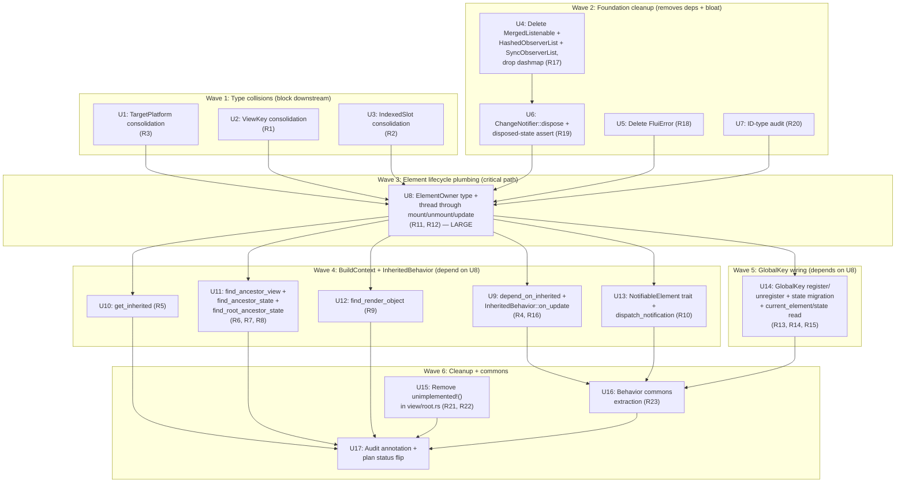

# feat: Framework Spine Repair — BuildContext + GlobalKey + Type-Collision Cleanup

## Summary

Single comprehensive PR repairing the FLUI framework spine. Resolves the parallel-type collisions (`ViewKey`×2 / `IndexedSlot`×2 / `TargetPlatform`×2) that block the public API, wires the seven stubbed `ElementBuildContext` methods to actually walk the Element tree + InheritedView dependent map, plumbs a new `ElementOwner` split-borrow handle through `Element::mount/unmount/update` so `GlobalKey::current_element` / `current_state` read the existing `BuildOwner::global_keys` registry, hooks `InheritedBehavior::on_update` to schedule rebuilds for dependents, deletes zero-consumer `flui-foundation` bloat (`MergedListenable` / `HashedObserverList` / `SyncObserverList` / `FluiError` + the `dashmap` dep), adds Flutter-faithful `ChangeNotifier::dispose` semantics, removes the two `unimplemented!()` calls in [`crates/flui-view/src/view/root.rs:487,494`](../../crates/flui-view/src/view/root.rs), and extracts shared `ElementBehavior` mount/unmount/update/dirty/reconcile boilerplate into free-function helpers. Seventeen atomic commits sequenced so workspace build, clippy, tests, and `port-check.sh` stay green after each.

---

## Problem Frame

The audit [docs/research/2026-05-21-view-tree-foundation-audit.md](../research/2026-05-21-view-tree-foundation-audit.md) (commit `592bc8cf` + post-correction `8432345c`) surfaced the framework-spine layer of FLUI as **structurally promising but functionally hollow**. Three layers of brokenness compound:

1. **The most-used user-facing UI API is stubbed.** `ElementBuildContext` (the FLUI counterpart of Flutter's `BuildContext`) has seven of ten methods returning `None` / no-op with `// Placeholder - needs architectural solution` markers at [`element_build_context.rs:189,213,243,249,254,259,302`](../../crates/flui-view/src/context/element_build_context.rs): `depend_on_inherited`, `get_inherited`, `find_ancestor_view`, `find_ancestor_state`, `find_root_ancestor_state`, `find_render_object`, `dispatch_notification`. Every real `View::build()` implementation that calls `ctx.depend_on::<MyTheme>()` to read inherited data through the ancestor chain silently fails. Tests pass because only `find_ancestor_element` and `mark_needs_build` are exercised — and those happen to be the two methods that are actually implemented.

2. **The second-most-used API is decoration.** `GlobalKey<T>::current_element` / `current_state` carry `// TODO: Implement via GlobalKeyRegistry` markers at [`global_key.rs:78,91`](../../crates/flui-view/src/key/global_key.rs). The `BuildOwner::global_keys: HashMap<u64, ElementId>` registry exists at [`build_owner.rs:65`](../../crates/flui-view/src/owner/build_owner.rs) with full `register_global_key` / `unregister_global_key` / `lookup` plumbing — but `Element::mount` never calls register, and `GlobalKey::current_element` never reads the registry. The full callsite chain is built; nothing fires.

3. **Three parallel-type collisions block any reasonable downstream API.** [`flui-foundation::ViewKey`](../../crates/flui-foundation/src/key.rs) (four impls: `GlobalKey` / `ValueKey` / `UniqueKey` / `ObjectKey`) coexists with a view-local [`flui-view::view::view::ViewKey`](../../crates/flui-view/src/view/view.rs) (zero impls). `View::key()` returns `Option<&dyn` view-local-`ViewKey>` so no concrete key can ever be returned. [`flui-tree::IndexedSlot<I>`](../../crates/flui-tree/src/iter/slot.rs) (the canonical unified-tree home per [`STRATEGY.md`](../../STRATEGY.md) "Behavior loyal, structure Rust-native") collides with [`flui-view::IndexedSlot<T>`](../../crates/flui-view/src/element/slot.rs) — `use flui_view::prelude::*; use flui_tree::prelude::*;` together triggers a glob-import collision. Two `TargetPlatform` enums in [`flui-foundation::platform`](../../crates/flui-foundation/src/platform.rs) vs [`flui-types::platform::target_platform`](../../crates/flui-types/src/platform/target_platform.rs) carry different variants (foundation `Unknown` vs types `Fuchsia`).

Adjacent to the stubs sits foundation bloat that pollutes the public API surface: `MergedListenable` + `HashedObserverList` + `SyncObserverList` have zero workspace consumers and exist purely as speculative pre-emption; the entire `dashmap` workspace dep exists solely for `HashedObserverList`. `FluiError` duplicates `FoundationError` (both zero consumers). `ChangeNotifier` lacks the `dispose` + disposed-state-assertion semantics that production listeners need to detect use-after-free — Flutter has explicit asserts at [`change_notifier.dart:181`](../../.flutter/flutter-master/packages/flutter/lib/src/foundation/change_notifier.dart) + dispose at `:376`. Finally [`view/root.rs:487,494`](../../crates/flui-view/src/view/root.rs) carries two `unimplemented!()` calls in a production path — direct Constitution Principle 6 violation.

The cost is invisible because no test exercises the broken paths. The framework advertises Flutter widget-tree parity, but no real `build()` reading theme data, no `GlobalKey` lookup, no `Notification` bubble, no InheritedView dependent rebuild actually works today.

---

## Requirements

Carries forward from origin (see [origin: docs/brainstorms/framework-spine-repair-requirements.md](../brainstorms/framework-spine-repair-requirements.md)). R1–R23 are functional + structural requirements; R-V1–R-V4 are verification gates that apply across all units. AE1–AE14 from origin exercise the behavioral-conditional requirements.

**Type-system collision resolution (ordered FIRST — block downstream wiring):**

- **R1**: Single canonical `ViewKey` trait at `flui_foundation::ViewKey`. Delete `flui-view::view::view::ViewKey`. Retype `View::key()` to return `Option<&dyn flui_foundation::ViewKey>`. `GlobalKey` / `ValueKey` / `UniqueKey` / `ObjectKey` continue to impl one trait — no API loss.
- **R2**: Single canonical `IndexedSlot` at `flui_tree::IndexedSlot<I>` (per [memory `flui-tree-unified-interface-intent`](../../../../.claude/projects/C--Users-vanya-RustroverProjects-flui/memory/flui-tree-unified-interface-intent.md) + [`STRATEGY.md`](../../STRATEGY.md)). Migrate the `flui-view::ElementSlot = IndexedSlot<Option<ElementId>>` alias to use `flui-tree`'s type. Delete the view-local duplicate.
- **R3**: Single canonical `TargetPlatform` at `flui_types::platform::target_platform::TargetPlatform`. Delete `flui-foundation::platform::TargetPlatform`. Reconcile variant sets: surviving enum carries the union (`iOS`, `Android`, `Linux`, `macOS`, `Windows`, `Fuchsia`, `Unknown`). Migrate `flui-platform` import sites.

**BuildContext functional API (callback form — preserves declarative-build invariant per Constitution Principle 5):**

- **R4**: `ElementBuildContext::depend_on_inherited<T: 'static, R>(&mut self, f: impl FnOnce(&T) -> R) -> Option<R>`. Walks ancestor Element chain finding nearest `InheritedElement<T>`, records caller's `ElementId` in the inherited element's dependent set, invokes `f(&T)` while the inherited element is borrowed, returns `Some(f's return)`. Flutter reference: [`framework.dart:5081`](../../.flutter/flutter-master/packages/flutter/lib/src/widgets/framework.dart).
- **R5**: `ElementBuildContext::get_inherited<T: 'static, R>(&self, f: impl FnOnce(&T) -> R) -> Option<R>`. Same ancestor walk as R4 **without** recording a dependency. Used for one-time reads (settings, theme captured at mount). Flutter reference: `framework.dart:5092` `getInheritedWidgetOfExactType`.
- **R6**: `ElementBuildContext::find_ancestor_view<V: View + 'static, R>(&self, f: impl FnOnce(&V) -> R) -> Option<R>`. Walks ancestor Element chain returning nearest borrowed `&V` by `TypeId` match. Flutter reference: `framework.dart:5122` `findAncestorWidgetOfExactType`.
- **R7**: `ElementBuildContext::find_ancestor_state<V: StatefulView + 'static, R>(&self, f: impl FnOnce(&V::State) -> R) -> Option<R>`. Walks ancestor Element chain returning nearest borrowed `&V::State` by `TypeId` match on the View type. Flutter reference: `framework.dart:5132` `findAncestorStateOfType`.
- **R8**: `ElementBuildContext::find_root_ancestor_state<V: StatefulView + 'static, R>(&self, f: impl FnOnce(&V::State) -> R) -> Option<R>`. Walks all the way to the root, returns the root-most matching state. Flutter reference: `framework.dart:5146` `findRootAncestorStateOfType`.
- **R9**: `ElementBuildContext::find_render_object(&self) -> Option<RenderId>`. Walks ancestor Element chain returning the nearest `RenderId` from a `RenderElement`. Returns `Option<RenderId>` (not callback form — `RenderId` is `Copy`, no borrow concern). Flutter reference: `framework.dart:5160` `findAncestorRenderObjectOfType`.
- **R10**: `ElementBuildContext::dispatch_notification<N: Notification>(&self, n: N)`. Walks ancestor Element chain, downcasts each to `NotifiableElement<N>` via `Any::downcast_ref`, calls `on_notification(&self, &N) -> bool`, stops on first `true` return. Flutter reference: [`notification_listener.dart:67`](../../.flutter/flutter-master/packages/flutter/lib/src/widgets/notification_listener.dart) + `:127` `_NotificationElement` mixin pattern.

**ElementOwner mutation handle (R12 — critical-path; enables R13–R16):**

- **R11**: New `ElementOwner` type living in `flui-view::owner::element_owner` carrying a split-borrow handle to `BuildOwner::global_keys` + `BuildOwner::dirty_elements` + the inactive-elements queue. Thread `&mut ElementOwner` through `ElementBase::mount`, `ElementBase::unmount`, `ElementBase::update`. Net-new type; rationale in Key Technical Decisions §D1.
- **R12**: Every `Element::mount/unmount/update` call site (in `Element<V, A, B>`, every `ElementBehavior` impl, `BuildOwner::build_scope`, `ElementTree::reconcile_children`, `WidgetsBinding::attach_root_widget`, `flui-app::runner.rs:251`, `flui-app::binding.rs:104,206,215`) threads the `ElementOwner` handle.

**GlobalKey registry wiring (depends on R11/R12):**

- **R13**: On mount, if `view.key()` returns `Some(GlobalKey)`, call `ElementOwner::register_global_key(key_hash, element_id)`. Flutter reference: `framework.dart:4571` `_retakeInactiveElement`.
- **R14**: On unmount, push the unmounted element onto `ElementOwner::inactive_elements` (Flutter parity at `framework.dart:2099` `_InactiveElements` + `:4636` `deactivateChild`). Same-frame remount-into-different-parent re-registers via `ElementOwner::register_global_key` after pulling out of `inactive_elements`. End-of-frame `ElementOwner::finalize_inactive` calls `unregister_global_key` for elements still in the queue (Flutter parity: `_inactiveElements.unmount` at end of `WidgetsBinding.drawFrame`).
- **R15**: `GlobalKey<T>::current_element(&self) -> Option<ElementId>` reads `ElementOwner::global_keys`. `current_state(&self) -> Option<&T::State>` chains through `current_element` and downcasts via `Element::state_as::<T::State>()`.

**InheritedBehavior on_update wiring (depends on R4):**

- **R16**: `InheritedBehavior::on_update` walks the dependent set populated by R4. For each `dep_id`, calls `ElementOwner::schedule_build_for(dep_id, dep_depth)`. Flutter reference: `framework.dart:6414` `InheritedElement.notifyClients` walking `_dependents`.

**flui-foundation cleanup:**

- **R17**: Delete [`MergedListenable`](../../crates/flui-foundation/src/observer.rs), [`HashedObserverList`](../../crates/flui-foundation/src/observer.rs), [`SyncObserverList`](../../crates/flui-foundation/src/observer.rs). Drop `dashmap` workspace dep (used only for `HashedObserverList`). Re-export removals at [`flui-foundation/src/lib.rs`](../../crates/flui-foundation/src/lib.rs).
- **R18**: Delete `flui-foundation::FluiError` ([`crates/flui-foundation/src/assert.rs`](../../crates/flui-foundation/src/assert.rs) or wherever it lives). Audit returned zero non-doc-comment workspace consumers; straight delete. `FoundationError` is the single error type.
- **R19**: Add `ChangeNotifier::dispose(&mut self)` matching Flutter `change_notifier.dart:376`. Add disposed-state assertion: `add_listener` / `notify_listeners` / `remove_listener` after dispose fires `debug_assert!(!self.is_disposed, ...)` in debug mode + `tracing::warn!` in release. Flutter parity for the assert at `change_notifier.dart:181`. Modify [`crates/flui-foundation/src/notifier.rs`](../../crates/flui-foundation/src/notifier.rs).
- **R20**: ID-type audit at [`crates/flui-foundation/src/id.rs`](../../crates/flui-foundation/src/id.rs). Keep the in-use set: `ViewId`, `ElementId`, `RenderId`, `LayerId`, `SemanticsId`. Demote to `pub(crate)` or delete any with zero workspace consumers — concrete list resolved during unit execution (Deferred to Implementation §I3).

**`unimplemented!()` removal (Constitution Principle 6 violation):**

- **R21**: [`crates/flui-view/src/view/root.rs:487`](../../crates/flui-view/src/view/root.rs) no longer contains `unimplemented!()`.
- **R22**: [`crates/flui-view/src/view/root.rs:494`](../../crates/flui-view/src/view/root.rs) no longer contains `unimplemented!()`. Either implement (verify `attach_root_widget` plumbing at `binding.rs:563-571` covers the case) or delete the dead legacy path.

**ElementBehavior commons extraction:**

- **R23**: Extract shared `mount` / `unmount` / `update` / `dirty propagation` / `reconcile child` boilerplate from `ElementBehavior` impls (Stateless / Stateful / Inherited / Render / Proxy / ParentData / Animation) into free functions in a new module `crates/flui-view/src/element/behavior/commons.rs`. Free-function shape, not blanket-trait — per Constitution Principle 4 (no `dyn` by default) + Senior Rust expert quality bar (generic explosion control). Each behavior's `mount`/`unmount`/`update` becomes a thin wrapper that calls `commons::perform_mount(...)` + the behavior-specific tail.

**Verification gates (apply per-commit):**

- **R-V1**: `cargo build --workspace` clean after each commit.
- **R-V2**: `cargo clippy --workspace --all-targets -- -D warnings` clean after each commit.
- **R-V3**: `cargo test --workspace --lib` passes after each commit (touched-crate tests + integration tests both).
- **R-V4**: `bash scripts/port-check.sh -v` reports 7/7 institutional refusal triggers ok after each commit.

---

## Output Structure

No new directory hierarchy. Two new files land:

- `crates/flui-view/src/owner/element_owner.rs` (U8) — the new `ElementOwner` split-borrow handle.
- `crates/flui-view/src/element/behavior/commons.rs` (U16) — extracted shared behavior boilerplate.

All other work modifies existing files. The brainstorm's R-IDs map directly to the file-touch surface from the [audit doc Project Map](../research/2026-05-21-view-tree-foundation-audit.md).

---

## High-Level Technical Design

### Unit dependency graph



### ElementOwner shape (directional sketch — not implementation spec)

```rust
// crates/flui-view/src/owner/element_owner.rs
// Carries a split-borrow handle into BuildOwner's mutable surface so
// Element::mount/unmount/update can update the global-key registry,
// schedule rebuilds, and queue inactive elements without holding a
// blanket &mut BuildOwner across the recursive Element traversal.
pub struct ElementOwner<'a> {
    pub(crate) global_keys: &'a mut HashMap<u64, ElementId>,
    pub(crate) dirty_elements: &'a mut BinaryHeap<Reverse<DirtyElement>>,
    pub(crate) inactive_elements: &'a mut Vec<ElementId>,
    pub(crate) current_frame: u64,
    // ...
}

impl<'a> ElementOwner<'a> {
    pub fn register_global_key(&mut self, hash: u64, id: ElementId);
    pub fn unregister_global_key(&mut self, hash: u64);
    pub fn schedule_build_for(&mut self, id: ElementId, depth: usize);
    pub fn push_inactive(&mut self, id: ElementId);
    pub fn finalize_inactive(&mut self) -> impl Iterator<Item = ElementId>;
}

// BuildOwner gains a split-borrow accessor:
impl BuildOwner {
    pub fn element_owner_mut(&mut self) -> ElementOwner<'_> {
        ElementOwner {
            global_keys: &mut self.global_keys,
            dirty_elements: &mut self.dirty_elements,
            inactive_elements: &mut self.inactive_elements,
            current_frame: self.current_frame,
        }
    }
}
```

This pattern is the Rust-native answer to Flutter's `Element._owner` mutable backreference at `framework.dart:2901`. Threading raw `&mut BuildOwner` would force ~30 call sites to acquire the full mutable borrow even when they only need one field; the split-borrow type isolates the surface and lets the borrow checker prove non-aliasing. Frame `current_frame` is `Copy` so the snapshot is harmless.

### BuildContext callback form (directional sketch — not implementation spec)

```rust
// crates/flui-view/src/context/element_build_context.rs
// Callback form preserves "pure declarative build" (Constitution Principle 5)
// AND lets the inherited element borrow be scoped tightly to the closure call,
// avoiding the lifetime extension that reference-returning would force on
// &self and pulling the Element tree into the caller's borrow.
impl ElementBuildContext<'_> {
    pub fn depend_on_inherited<T, R>(
        &mut self,
        f: impl FnOnce(&T) -> R,
    ) -> Option<R>
    where
        T: 'static,
    {
        // Walk ancestor chain to find InheritedElement<T>.
        // Record self.element_id in the inherited element's dependent set.
        // Borrow &T from the inherited element, invoke f, return f's result.
        // Borrow released when f returns; no lifetime escape.
    }

    pub fn get_inherited<T, R>(&self, f: impl FnOnce(&T) -> R) -> Option<R>
    where
        T: 'static,
    {
        // Same walk, no dependency recording, &self (immutable) sufficient.
    }
    // ... find_ancestor_* methods follow the same callback shape ...
}
```

Trade-off relative to the discarded reference-returning shape `fn depend_on<T>(&self) -> Option<&T>`: callbacks slightly less ergonomic for chained reads (`build()` body becomes nested closures rather than chained `?`s) but side-step the lifetime issue where `&T` borrowed from the Element tree pins `&self` across the rest of `build()`. Each call returns its own `Option<R>` so chaining via `let theme = ctx.depend_on::<Theme, _>(|t| t.clone()).unwrap_or_default()` stays clean.

---

## Implementation Units

### U1. TargetPlatform consolidation

**Goal:** Single canonical `TargetPlatform` at `flui_types`, reconcile variant set, migrate `flui-platform` import sites, delete `flui-foundation::platform::TargetPlatform`.

**Requirements:** R3.

**Dependencies:** None.

**Files:**
- Modify: [`crates/flui-types/src/platform/target_platform.rs`](../../crates/flui-types/src/platform/target_platform.rs) (add `Unknown` variant; ensure union variant set is `iOS`, `Android`, `Linux`, `macOS`, `Windows`, `Fuchsia`, `Unknown`)
- Modify: [`crates/flui-types/src/platform/mod.rs`](../../crates/flui-types/src/platform/mod.rs) (re-export check)
- Delete: `flui-foundation::platform::TargetPlatform` (modify [`crates/flui-foundation/src/platform.rs`](../../crates/flui-foundation/src/platform.rs); decide whether the whole module deletes or just the type)
- Modify: [`crates/flui-foundation/src/lib.rs`](../../crates/flui-foundation/src/lib.rs) (remove re-exports of `TargetPlatform` from foundation)
- Modify: every `flui-platform` import site (resolved during execution via `rg 'flui_foundation::.*TargetPlatform'`)
- Test: extend `crates/flui-types/src/platform/target_platform.rs` `#[cfg(test)] mod tests` — variant coverage test

**Approach:** Variant-set reconciliation lands first (additive on `flui-types`). Then a single sweep replacing every `flui-foundation::TargetPlatform` import with `flui_types::platform::target_platform::TargetPlatform` (or via a more concise re-export). Then deletion of the foundation copy. Workspace-compile invariant requires bundling: cannot delete foundation's type before consumers migrate, cannot migrate consumers before survivor has all variants. Single commit.

**Execution note:** Verify dep DAG direction — foundation must NOT depend on types (per CLAUDE.md "Strict Crate Dependency DAG — Dependencies flow downward only"). If foundation imports types' TargetPlatform, that's an upward edge; in that case re-export the type through foundation's prelude rather than direct import, so downstream crates can still write `flui_foundation::TargetPlatform` if they choose.

**Patterns to follow:** Type-collision resolution pattern from PR #82's ClipContext consolidation (single commit, all consumers migrated, deletion in same atomic landing). See `docs/plans/2026-05-20-001-refactor-clipcontext-consolidation-plan.md` U4–U5.

**Test scenarios:**
- Happy path: `TargetPlatform::Linux` and `TargetPlatform::Fuchsia` both compile. Single test asserts all 7 variants exist via exhaustive `match`.
- Covers AE9: `rg 'flui_foundation::.*TargetPlatform' crates/` returns zero hits post-commit.

**Verification:** `cargo build --workspace` + `cargo clippy -p flui-types --all-targets -- -D warnings` + `cargo test -p flui-types --lib` all green. `rg 'flui_foundation::.*TargetPlatform' crates/` returns zero.

---

### U2. ViewKey consolidation

**Goal:** Single canonical `ViewKey` at `flui_foundation::ViewKey`. Delete view-local trait. Retype `View::key()` to return `Option<&dyn flui_foundation::ViewKey>`. Existing impls (`GlobalKey`, `ValueKey`, `UniqueKey`, `ObjectKey`) work unchanged.

**Requirements:** R1.

**Dependencies:** U1 (clean type-collision posture; U2 follows the same pattern).

**Files:**
- Modify: [`crates/flui-view/src/view/view.rs`](../../crates/flui-view/src/view/view.rs) — lines 92, 103, 128 (retype `View::key()` signature)
- Delete: view-local `ViewKey` trait definition in the same file
- Modify: [`crates/flui-view/src/key/*.rs`](../../crates/flui-view/src/key/) — verify `GlobalKey` / `ObjectKey` impls reference `flui_foundation::ViewKey` (most likely already do per audit; verify)
- Modify: [`crates/flui-view/src/lib.rs`](../../crates/flui-view/src/lib.rs) — remove re-export of view-local ViewKey
- Modify: [`crates/flui-view/src/prelude.rs`](../../crates/flui-view/src/prelude.rs) if exists — same removal
- Test: extend `crates/flui-view/src/view/view.rs` `#[cfg(test)] mod tests` — assert `GlobalKey::new()` can be returned from a concrete `View::key()` impl with no `as` cast

**Approach:** Single sweep. Delete the trait definition, retype the trait method, verify all four key types already impl foundation's `ViewKey`. The audit confirmed they do (Project Map line 80: "Two `ViewKey` trait... `GlobalKey`/`ValueKey`/`UniqueKey`/`ObjectKey` all impl the foundation one").

**Patterns to follow:** Same trait-deletion pattern as U1. Single atomic commit. PR #82 ClipContext consolidation reference.

**Test scenarios:**
- Covers AE7: A concrete `View` impl returns `Some(&GlobalKey::<MyState>::new())` from `View::key()` with no `as` cast. Compile-time check.
- Negative: prior view-local `ViewKey` trait references in tests/code must all be migrated; `rg 'view::view::ViewKey' crates/` returns zero.

**Verification:** `cargo build --workspace` + `cargo clippy --workspace --all-targets -- -D warnings` + tests for `flui-view` all green.

---

### U3. IndexedSlot consolidation

**Goal:** Single canonical `IndexedSlot<I>` at `flui_tree::IndexedSlot` (slot.rs:422-530). Migrate `flui-view::ElementSlot = IndexedSlot<Option<ElementId>>` alias to use `flui-tree`'s type. Delete view-local duplicate at `flui-view::element::slot`.

**Requirements:** R2.

**Dependencies:** U2 (same posture; type-collision sweep).

**Files:**
- Modify: alias declaration of `ElementSlot` in `flui-view` (likely in `crates/flui-view/src/element/mod.rs` or `crates/flui-view/src/element/child_storage.rs`)
- Delete: [`crates/flui-view/src/element/slot.rs`](../../crates/flui-view/src/element/slot.rs)
- Modify: [`crates/flui-view/src/element/mod.rs`](../../crates/flui-view/src/element/mod.rs) — remove `mod slot;` declaration
- Modify: every `flui-view` import of the view-local `IndexedSlot` (resolved via `rg 'crate::element::slot::IndexedSlot|element::IndexedSlot' crates/flui-view/`)
- Add `flui-tree` to `flui-view`'s public re-export if needed for ergonomic downstream use
- Test: integration test confirming `ElementSlot` aliased through `flui-tree::IndexedSlot` works with `Option<ElementId>` payload

**Approach:** Audit comment confirms `flui-view` already depends on `flui-tree` for Arity types (Project Map line 129), so adding the IndexedSlot import is just one more dep edge into a crate already in the graph. Verify `flui-tree::IndexedSlot<Option<ElementId>>` exposes the API surface `flui-view` currently uses (constructor, accessors, mutation). If gap exists, extend `flui-tree::IndexedSlot` rather than keep the duplicate.

**Patterns to follow:** Single-atomic-commit. PR #82 ClipContext precedent.

**Test scenarios:**
- Covers AE8: `use flui_view::prelude::*; use flui_tree::prelude::*;` together compiles cleanly; `IndexedSlot` resolves to `flui_tree::IndexedSlot` unambiguously.
- Sanity: `ElementSlot::new(Some(ElementId::new(1)))` constructs and indexes correctly via `flui-tree`'s API.

**Verification:** `cargo build --workspace` + `cargo clippy --workspace --all-targets -- -D warnings` + tests for `flui-view` + `flui-tree` all green. `rg 'crate::element::slot::IndexedSlot' crates/` returns zero.

---

### U4. Delete zero-consumer observer/listenable bloat + drop dashmap

**Goal:** Remove `MergedListenable` + `HashedObserverList` + `SyncObserverList` from `flui-foundation`. Drop `dashmap` workspace dep.

**Requirements:** R17.

**Dependencies:** None (foundation-internal cleanup; can land in parallel with type-collision wave).

**Files:**
- Delete or modify: [`crates/flui-foundation/src/observer.rs`](../../crates/flui-foundation/src/observer.rs) — remove `HashedObserverList` + `SyncObserverList`; keep `ObserverList` (the one with consumers)
- Modify: [`crates/flui-foundation/src/notifier.rs`](../../crates/flui-foundation/src/notifier.rs) — remove `MergedListenable` (per audit at lines 404–509)
- Modify: [`crates/flui-foundation/src/lib.rs`](../../crates/flui-foundation/src/lib.rs) — remove re-exports at lines 139, 145–146, 162, 232, 235, 237, 270, 274, 289, 296, 298, 312–315 (per audit citations)
- Modify: `crates/flui-foundation/Cargo.toml` — drop `dashmap` dependency
- Modify: root `Cargo.toml` `[workspace.dependencies]` — drop `dashmap`
- Test: remove tests that exercised the deleted types

**Approach:** Pre-deletion sweep via `rg 'MergedListenable|HashedObserverList|SyncObserverList' crates/` to confirm zero non-doc-comment workspace consumers (audit already confirmed). Then atomic deletion + re-export removal + Cargo.toml dep drop. Single commit.

**Patterns to follow:** Foundation-internal cleanup pattern. Verify `cargo tree -p flui-foundation` no longer lists `dashmap` post-commit.

**Test scenarios:**
- Covers AE10: `cargo tree -p flui-foundation` does not list `dashmap`. `rg 'MergedListenable|HashedObserverList|SyncObserverList' crates/` returns zero non-doc-comment hits.
- Test expectation: no new tests; removed tests track with the removed types.

**Verification:** `cargo build --workspace` + `cargo clippy --workspace --all-targets -- -D warnings` + tests all green. `cargo tree -p flui-foundation` does not show `dashmap`.

---

### U5. Delete FluiError

**Goal:** Remove `flui-foundation::FluiError`. `FoundationError` is the single error type for the crate.

**Requirements:** R18.

**Dependencies:** U4 (same cleanup wave).

**Files:**
- Modify or delete: [`crates/flui-foundation/src/assert.rs`](../../crates/flui-foundation/src/assert.rs) (delete `FluiError` definition; keep `assert` macro if it has independent purpose)
- Modify: [`crates/flui-foundation/src/lib.rs`](../../crates/flui-foundation/src/lib.rs) — remove `FluiError` re-export
- Test: remove any FluiError-specific tests

**Approach:** Pre-deletion sweep via `rg 'FluiError' crates/` to verify zero non-doc-comment workspace consumers. Audit confirmed zero consumers. Straight delete in one commit.

**Patterns to follow:** Same as U4.

**Test scenarios:**
- Covers AE11: `rg 'FluiError' crates/` returns zero non-doc-comment hits.
- Test expectation: none — pure deletion.

**Verification:** `cargo build --workspace` + clippy + tests green. `rg 'FluiError' crates/` returns zero non-doc-comment hits.

---

### U6. ChangeNotifier::dispose + disposed-state assertion

**Goal:** Add Flutter-faithful `ChangeNotifier::dispose(&mut self)` + disposed-state assertion firing on `add_listener` / `notify_listeners` / `remove_listener` post-dispose.

**Requirements:** R19.

**Dependencies:** U4 (notifier.rs touch posture; both modify the same file).

**Files:**
- Modify: [`crates/flui-foundation/src/notifier.rs`](../../crates/flui-foundation/src/notifier.rs) — add `is_disposed: bool` field, `dispose()` method, debug assertions (lines 116, 158 per audit; add new method)
- Modify: test module in same file — add `dispose_then_listener_panics_debug` test

**Approach:** Mirror Flutter's pattern at [`change_notifier.dart:181`](../../.flutter/flutter-master/packages/flutter/lib/src/foundation/change_notifier.dart) (`debugAssertNotDisposed`) + `:376` (`dispose()`). The disposed-state field is set in `dispose()`; every method that reads/writes the listener list debug-asserts `!self.is_disposed`. Release mode replaces the assert with `tracing::warn!` for observability without panic.

**Execution note:** Test-first. Write the failing test (calling `add_listener` after `dispose` panics in debug mode) before adding the field + assertion, since this is a behavioral guarantee.

**Patterns to follow:** Flutter `ChangeNotifier.dispose` semantics directly. Same `debug_assert!` pattern as elsewhere in `flui-foundation`.

**Test scenarios:**
- Covers AE12: `let mut n = ChangeNotifier::new(); n.dispose(); n.add_listener(...)` panics with `debug_assert!` in debug.
- Covers AE12: Same sequence in release builds emits `tracing::warn!("ChangeNotifier used after dispose")` and is a no-op (no panic).
- Happy path: dispose-then-drop is idempotent (calling `dispose` twice OK).
- Edge case: `notify_listeners` mid-iteration when one listener calls `dispose` — re-entrancy guard. Snapshot-then-fire semantics at notifier.rs:158-163 already handle this; verify the disposed assert doesn't fire mid-snapshot.

**Verification:** Tests for the disposed-state behavior pass. `cargo build --workspace` + clippy + tests green.

---

### U7. ID-type audit

**Goal:** Audit `flui-foundation`'s 30+ ID types. Keep the in-use set (`ViewId`, `ElementId`, `RenderId`, `LayerId`, `SemanticsId`). Demote zero-consumer IDs to `pub(crate)` or delete.

**Requirements:** R20.

**Dependencies:** U4, U5 (same cleanup wave; reduces public surface together).

**Files:**
- Modify: [`crates/flui-foundation/src/id.rs`](../../crates/flui-foundation/src/id.rs) — lines 509–681 per audit citations (selective deletes)
- Modify: [`crates/flui-foundation/src/lib.rs`](../../crates/flui-foundation/src/lib.rs) — remove re-exports of deleted/demoted IDs
- Test: extend `crates/flui-foundation/src/id.rs` tests if any new module-level invariants

**Approach:** During unit execution, run `rg '(AnimationId|FrameId|TaskId|TickerId|...)' crates/ --type rust` for each ID type. Build keep / demote / delete table. Apply table. Concrete deletions deferred to execution time — see Deferred to Implementation §I3.

**Patterns to follow:** Foundation API-surface reduction pattern. Same as U4/U5.

**Test scenarios:**
- Sanity: every retained ID has a working `new(N)` constructor and `get()` accessor (existing tests).
- Test expectation: deletions remove their tests; remaining tests stay green.

**Verification:** `cargo build --workspace` + clippy + tests green. `rg <deleted-id> crates/` returns zero.

---

### U8. ElementOwner type + thread through Element lifecycle

**Goal:** Introduce the new `ElementOwner<'_>` split-borrow handle (per High-Level Technical Design sketch). Thread `&mut ElementOwner` through `ElementBase::mount`, `ElementBase::unmount`, `ElementBase::update` and every call site. **LARGE unit (~30 files touched).**

**Requirements:** R11, R12.

**Dependencies:** U1, U2, U3 (type collisions cleared so threading doesn't get tangled), U6 (foundation cleanup minimizes blast radius — fewer types in the surface to retype).

**Files:**
- Create: `crates/flui-view/src/owner/element_owner.rs` — `ElementOwner<'_>` struct + methods (`register_global_key`, `unregister_global_key`, `schedule_build_for`, `push_inactive`, `finalize_inactive`)
- Modify: [`crates/flui-view/src/owner/build_owner.rs`](../../crates/flui-view/src/owner/build_owner.rs) — add `inactive_elements: Vec<ElementId>` field + `element_owner_mut(&mut self) -> ElementOwner<'_>` split-borrow accessor
- Modify: [`crates/flui-view/src/owner/mod.rs`](../../crates/flui-view/src/owner/mod.rs) — `pub mod element_owner;`
- Modify: [`crates/flui-view/src/element/behavior.rs`](../../crates/flui-view/src/element/behavior.rs) — retype `ElementBehavior::mount/unmount/update` signatures (lines 33–84, 467–507, 535–544)
- Modify: [`crates/flui-view/src/element/unified.rs`](../../crates/flui-view/src/element/unified.rs) — retype `Element<V, A, B>::mount/unmount/update` (lines 167–200, 351–374)
- Modify: [`crates/flui-view/src/element/generic.rs`](../../crates/flui-view/src/element/generic.rs) — `ElementBase` trait surface (lines 467–486)
- Modify: every `ElementBehavior` impl in `crates/flui-view/src/element/behavior/` (Stateless, Stateful, Inherited, Render, Proxy, ParentData, Animation)
- Modify: [`crates/flui-view/src/tree/element_tree.rs`](../../crates/flui-view/src/tree/element_tree.rs) — `ElementTree::reconcile_children` (lines 171–293)
- Modify: [`crates/flui-view/src/tree/reconciliation.rs`](../../crates/flui-view/src/tree/reconciliation.rs) — lines 51, 152, 184
- Modify: [`crates/flui-view/src/binding.rs`](../../crates/flui-view/src/binding.rs) — `WidgetsBinding::attach_root_widget` + `draw_frame` (lines 376, 554, 716, 752)
- Modify: [`crates/flui-app/src/app/runner.rs`](../../crates/flui-app/src/app/runner.rs) — line 251 cascading mount call
- Modify: [`crates/flui-app/src/app/binding.rs`](../../crates/flui-app/src/app/binding.rs) — lines 41, 104, 206, 215 (Box<dyn ElementBase> holdings + dispatch sites)
- Test: add `crates/flui-view/src/owner/element_owner.rs` `#[cfg(test)] mod tests` — split-borrow scenarios, register/unregister round-trip, schedule_build_for + inactive queue lifecycle

**Approach:** Net-new type lands first as standalone (`crates/flui-view/src/owner/element_owner.rs` + `BuildOwner::element_owner_mut` accessor) with no consumers — that's a small compileable sub-commit but **NOT split into a separate commit per workspace-compile invariant**. The entire threading sweep lands in one atomic commit because the signature change cascades synchronously. Pre-execute planning: walk the touch surface with `rg 'fn mount\(|fn unmount\(|fn update\(' crates/flui-view crates/flui-app` and confirm every site is covered.

**Plan-write note:** Plan-write considered splitting U8 into two commits (introduce `ElementOwner` noop + thread through). Rejected because the noop variant would require passing `&mut ElementOwner` arguments with `#[allow(unused_variables)]` — flagged by clippy under `-D warnings`. Single-commit threading is the workspace-compile invariant.

**Execution note:** Characterization-first for the mount/unmount round-trip — write tests against the current `mount`/`unmount` behavior (snapshot the existing tree-state invariants) before retyping signatures, so regressions surface immediately. Document any pre-existing tests that pass on the threaded variant.

**Patterns to follow:** Flutter's `Element._owner` mutable backreference at `framework.dart:2901`. Rust adaptation: split-borrow type instead of mutable backreference (Senior Rust idiom — see *Rust for Rustaceans* "Lifetimes and split borrows"). For the `inactive_elements: Vec<ElementId>` queue, Flutter parity at `framework.dart:2099` `_InactiveElements`.

**Test scenarios:**
- Happy path: mount an element with no key, unmount it. `ElementOwner::global_keys` stays empty.
- Happy path: mount an element with a `ValueKey`, unmount. Same — no global_keys touch (R13 fires only for `GlobalKey`).
- Edge case: split-borrow holds during a deep mount recursion — verify the borrow checker accepts the pattern. Add a doc test showing the split-borrow usage.
- Integration: full `WidgetsBinding::draw_frame` call exercises `ElementOwner` end-to-end (the `attach_root_widget` → recursive mount path). Covers the flui-app cascade.

**Verification:** `cargo build --workspace` + `cargo clippy --workspace --all-targets -- -D warnings` + `cargo test -p flui-view --lib` + `cargo test -p flui-app --lib` all green. Critical: `cargo build -p flui-hot-reload --features app-plugin --all-targets` clean (ABI-shape regression check per PR #82 precedent).

---

### U9. BuildContext::depend_on_inherited + InheritedBehavior::on_update

**Goal:** Implement `ElementBuildContext::depend_on_inherited<T, R>` (callback form) wiring it to the InheritedElement dependent set. Implement `InheritedBehavior::on_update` walking the dependent set to call `ElementOwner::schedule_build_for` on each.

**Requirements:** R4, R16. Covers F1 + F3 + AE1 + AE2.

**Dependencies:** U8 (needs `ElementOwner` threaded through).

**Files:**
- Modify: [`crates/flui-view/src/context/element_build_context.rs`](../../crates/flui-view/src/context/element_build_context.rs) — line 189 (depend_on_inherited) + InheritedElement dependent-set write
- Modify: [`crates/flui-view/src/context/build_context.rs`](../../crates/flui-view/src/context/build_context.rs) — line 100 (BuildContext trait method signature)
- Modify: `crates/flui-view/src/element/behavior/inherited.rs` (or wherever InheritedBehavior lives) — `on_update` method to walk `dependents` field, call `owner.schedule_build_for(dep_id, dep_depth)`
- Modify: InheritedElement-specific storage for `dependents: HashSet<ElementId>` (likely already exists per audit; verify)
- Test: `crates/flui-view/tests/inherited_dependency.rs` or inline tests covering AE1 + AE2

**Approach:** Bundle R4 and R16 because R16 is meaningless without R4's dependent-set writes (Flutter's `_dependents` is populated by `dependOnInheritedWidgetOfExactType` and consumed by `notifyClients` — same coupling here). Callback-form signature per High-Level Technical Design sketch.

**Execution note:** Test-first. Write the AE1 + AE2 acceptance tests as failing tests against the current stub before implementing the wire-up — explicit because these are the most-impactful behavioral guarantees in the entire PR.

**Patterns to follow:** Flutter `framework.dart:5081` (`dependOnInheritedWidgetOfExactType`) + `:6414` (`InheritedElement.notifyClients`). Rust adaptation: callback closure scopes the &T borrow, `TypeId`-keyed ancestor lookup.

**Test scenarios:**
- Covers F1 + AE1: Tree `Root → InheritedView<MyTheme> → Padding → Text`. `Text.build()` calls `ctx.depend_on_inherited::<MyTheme, _>(|t| t.clone())`. Returns `Some(MyTheme{...})` AND the `InheritedElement<MyTheme>` now has the `Text` element's `ElementId` in its dependent set.
- Covers F3 + AE2: From AE1's state, rebuild `InheritedView<MyTheme>` with new value where `update_should_notify(old, new)` returns `true`. `Text`'s element is marked dirty in `ElementOwner::dirty_elements`. Next frame, `Text` rebuilds.
- Edge case: `depend_on_inherited::<T, _>` on a tree with no ancestor `InheritedElement<T>` returns `None`. No dependent-set write.
- Edge case: same element calls `depend_on_inherited::<T, _>` twice in the same `build()`. Dependent-set is `HashSet`, only one entry.
- Edge case: dependent element unmounts before InheritedView updates. `schedule_build_for` for a non-existent ElementId is a no-op (verify ElementTree::contains check or equivalent).

**Verification:** Tests for AE1 + AE2 pass. `cargo build --workspace` + clippy + tests green.

---

### U10. BuildContext::get_inherited

**Goal:** Implement `ElementBuildContext::get_inherited<T, R>` — same ancestor walk as `depend_on_inherited` but without recording a dependency.

**Requirements:** R5. Covers AE3.

**Dependencies:** U9 (uses the same ancestor-walk machinery).

**Files:**
- Modify: [`crates/flui-view/src/context/element_build_context.rs:213`](../../crates/flui-view/src/context/element_build_context.rs)
- Modify: [`crates/flui-view/src/context/build_context.rs:112`](../../crates/flui-view/src/context/build_context.rs) — trait method signature
- Test: extend test module from U9 with AE3 scenario

**Approach:** Extract the ancestor-walk into a private helper in U9; U10 calls it without the dependent-set write. Single-commit.

**Patterns to follow:** Flutter `framework.dart:5092` `getInheritedWidgetOfExactType`.

**Test scenarios:**
- Covers AE3: Same tree as AE1. `Text.build()` calls `ctx.get_inherited::<MyTheme, _>(|t| t.clone())`. Returns `Some(MyTheme{...})` AND the `InheritedElement<MyTheme>` dependent set is **unchanged** (no dependency recorded).
- Edge case: ancestor `InheritedElement<T>` doesn't exist → `None`.

**Verification:** AE3 test passes. `cargo build` + clippy + tests green.

---

### U11. BuildContext::find_ancestor_view + find_ancestor_state + find_root_ancestor_state

**Goal:** Implement the three ancestor-finder methods. All callback-form. `TypeId`-keyed match.

**Requirements:** R6, R7, R8.

**Dependencies:** U8.

**Files:**
- Modify: [`crates/flui-view/src/context/element_build_context.rs`](../../crates/flui-view/src/context/element_build_context.rs) — lines 243 (find_ancestor_view), 249 (find_ancestor_state), 254 (find_root_ancestor_state)
- Modify: [`crates/flui-view/src/context/build_context.rs`](../../crates/flui-view/src/context/build_context.rs) — lines 131, 136, 142
- Test: inline tests covering each method

**Approach:** Shared ancestor-walk helper (already extracted in U9/U10). `find_ancestor_view`/`find_ancestor_state` return at first match; `find_root_ancestor_state` continues to root. Single-commit (three related methods bundled because they share the helper).

**Patterns to follow:** Flutter `framework.dart:5122` (`findAncestorWidgetOfExactType`), `:5132` (`findAncestorStateOfType`), `:5146` (`findRootAncestorStateOfType`).

**Test scenarios:**
- Happy path: tree `Root → MyView → child`. `child.build()` calls `find_ancestor_view::<MyView, _>(|v| v.clone())`. Returns `Some(MyView)`.
- Happy path: stateful equivalent for `find_ancestor_state::<MyStatefulView, _>(|s| s.snapshot())`. Returns the nearest matching `&State`.
- Root finder: tree `MyStatefulView<A> → MyStatefulView<B> → MyStatefulView<A> → child`. `find_root_ancestor_state::<MyStatefulView<A>, _>` returns the outermost A's state, not the inner one.
- Edge case: no matching ancestor → `None`.

**Verification:** All three method tests pass. `cargo build` + clippy + tests green.

---

### U12. BuildContext::find_render_object

**Goal:** Implement `find_render_object(&self) -> Option<RenderId>`. Walks ancestors, returns the first `RenderId` from a `RenderElement`.

**Requirements:** R9.

**Dependencies:** U8.

**Files:**
- Modify: [`crates/flui-view/src/context/element_build_context.rs:259`](../../crates/flui-view/src/context/element_build_context.rs)
- Modify: [`crates/flui-view/src/context/build_context.rs:156`](../../crates/flui-view/src/context/build_context.rs)
- Test: inline test

**Approach:** Non-callback shape (`RenderId` is `Copy`, no borrow concern). Walk ancestors via the same helper as U11, downcast to `RenderElement`, return its `RenderId`.

**Patterns to follow:** Flutter `framework.dart:5160` `findAncestorRenderObjectOfType` — note ancestor walk, not descendant.

**Test scenarios:**
- Happy path: tree with a `RenderView` ancestor. `find_render_object()` returns `Some(RenderId)`.
- Edge case: pure non-render ancestor chain → `None`.

**Verification:** Test passes. Build + clippy + tests green.

---

### U13. NotifiableElement trait + BuildContext::dispatch_notification

**Goal:** Define `Notification` marker trait + `NotifiableElement` opt-in handler trait. Implement `ElementBuildContext::dispatch_notification` walking ancestors via `Any::downcast_ref`.

**Requirements:** R10. Covers F4 + AE6.

**Dependencies:** U8.

**Files:**
- Modify: [`crates/flui-view/src/element/notification.rs`](../../crates/flui-view/src/element/notification.rs) — lines 90–100, 147–160 (existing scaffolding; verify completeness)
- Modify: [`crates/flui-view/src/context/element_build_context.rs:302`](../../crates/flui-view/src/context/element_build_context.rs)
- Modify: [`crates/flui-view/src/context/build_context.rs:208`](../../crates/flui-view/src/context/build_context.rs) — trait method signature
- Test: inline test covering AE6

**Approach:** Trait defs:
```rust
// Marker — opaque, `Any` is the downcast vehicle.
pub trait Notification: Any + Send + Sync + 'static {}

// Opt-in handler on Element behaviors. Default no-op so non-notifiable
// elements don't have to impl. NotifiableElement uses TypeId-keyed match
// rather than dyn for monomorphic per-N performance per Constitution
// Principle 4.
pub trait NotifiableElement<N: Notification>: ElementBase {
    fn on_notification(&self, _n: &N) -> bool { false }
}
```

`dispatch_notification<N>` walks ancestor `Element` chain. For each ancestor, try `Any::downcast_ref::<&dyn NotifiableElement<N>>` — but since we can't directly downcast to a generic trait object, the Element must register an `on_notification` callback in its `ElementBehavior` impl that captures the specific N (closure-based registry). Concrete shape resolved at execution time per Deferred to Implementation §I7.

**Execution note:** Test-first. Write the AE6 test (`Root → NotificationListener<ScrollNotification> → Inner` with `Inner.build()` dispatching) as failing test before implementing the wire-up.

**Patterns to follow:** Flutter [`notification_listener.dart:67`](../../.flutter/flutter-master/packages/flutter/lib/src/widgets/notification_listener.dart) (`Notification.dispatch`) + `:127` (`_NotificationElement` mixin). Rust adaptation: trait-based handler with `TypeId`-keyed runtime match, no `dyn`-everywhere proliferation.

**Test scenarios:**
- Covers F4 + AE6: Tree `Root → NotificationListener<ScrollNotification> → Inner`. `Inner.build()` calls `ctx.dispatch_notification(ScrollNotification::new(...))`. The `NotificationListener`'s `on_notification` is called with `&ScrollNotification`, AND the bubble stops if the listener returns `true`. Root is not notified.
- Bubble-continues: same tree, listener returns `false`. Root's notification handler (if any) fires after.
- Edge case: tree with zero notification handlers — `dispatch_notification` is a no-op.
- Wrong type: `dispatch_notification::<NonMatchingNotification>` with a handler that expects a different `N` — bubble skips the wrong-type handler.

**Verification:** AE6 test passes. `cargo build` + clippy + tests green.

---

### U14. GlobalKey register/unregister + state migration + lookup

**Goal:** Wire `View::key() -> Option<&dyn ViewKey>` returning a `GlobalKey` through `Element::mount/unmount/update` to actually register/unregister in `ElementOwner::global_keys`. Implement same-frame state migration via `inactive_elements` queue. Implement `GlobalKey::current_element` + `current_state` reading the registry.

**Requirements:** R13, R14, R15. Covers F2 + AE4 + AE5.

**Dependencies:** U8 (ElementOwner exists), U2 (ViewKey consolidated so GlobalKey impls foundation's ViewKey).

**Files:**
- Modify: [`crates/flui-view/src/key/global_key.rs`](../../crates/flui-view/src/key/global_key.rs) — lines 78 (current_element), 91 (current_state), 125 (registry read access)
- Modify: [`crates/flui-view/src/element/unified.rs`](../../crates/flui-view/src/element/unified.rs) — mount/unmount calls `owner.register_global_key` / `owner.push_inactive` if `view.key()` returns `Some(GlobalKey)`
- Modify: [`crates/flui-view/src/element/lifecycle.rs`](../../crates/flui-view/src/element/lifecycle.rs) — verify `Lifecycle::Inactive` semantics match Flutter's `_InactiveElements`; add transition if needed
- Modify: [`crates/flui-view/src/binding.rs:376,554,716,752`](../../crates/flui-view/src/binding.rs) — end-of-frame `owner.finalize_inactive` call to actually unregister keys for elements that didn't get re-mounted
- Test: integration test covering AE4 + AE5 (state migration is the harder case)

**Approach:** Mount path: check `view.key()`, downcast `&dyn ViewKey` to `&GlobalKey` via `Any::downcast_ref`, call `owner.register_global_key(hash, element_id)`. Unmount path: `owner.push_inactive(element_id)` (DON'T unregister immediately — wait for end-of-frame so same-frame remount can preserve state). End-of-frame: `owner.finalize_inactive()` returns elements that weren't re-mounted; those get `unregister_global_key`. `GlobalKey::current_element` reads `owner.global_keys.get(&self.hash())`.

State migration (AE4 — parent rebuild moves keyed child to different slot): the child's old `Element` enters `inactive_elements` during reconcile. When the new parent slot mounts a `View` with the same `GlobalKey`, reconcile pulls the inactive element out (Flutter parity: `_retakeInactiveElement` at `framework.dart:4571`) — re-mounts at the new slot with state preserved. The `GlobalKey` hash maps to the same `ElementId` throughout.

**Execution note:** Test-first for AE4 specifically (state migration is the hardest case). Write the failing test before wire-up.

**Patterns to follow:** Flutter `framework.dart:3148+` (`_globalKeyRegistry` + `GlobalKey._currentElement`), `:4571` (`_retakeInactiveElement`), `:4636` (`deactivateChild`), `:2099` (`_InactiveElements`).

**Test scenarios:**
- Covers F2 + AE4: Construct `let k = GlobalKey::<MyState>::new()` before mount. Mount a `StatefulView` carrying `k` as `View::key()`. Assert `k.current_element() == Some(element_id)` AND `k.current_state() == Some(&MyState{...})`.
- Covers AE4: Same-frame parent rebuild moves the keyed child to a different parent slot. `k.current_state()` continues to return the same `&MyState` (state migrated, not recreated).
- Covers AE5: Full unmount, no re-mount in same frame. End-of-frame `finalize_inactive` runs. `k.current_element()` returns `None`. `k.current_state()` returns `None`.
- Edge case: Two `GlobalKey`s with the same hash — registry collision handling (Flutter panics; FLUI should `tracing::error!` + last-write-wins or panic — TBD at execution time, see §I8).
- Edge case: `GlobalKey<T>` where `T` doesn't impl `StatefulView` — `current_state` is a compile error (type bound).

**Verification:** AE4 + AE5 tests pass. `cargo build` + clippy + tests green.

---

### U15. Remove unimplemented!() in view/root.rs

**Goal:** Eliminate the two `unimplemented!()` calls at lines 487 and 494.

**Requirements:** R21, R22. Covers AE13.

**Dependencies:** None (orthogonal to BuildContext/GlobalKey work).

**Files:**
- Modify: [`crates/flui-view/src/view/root.rs`](../../crates/flui-view/src/view/root.rs) — lines 487, 494
- Test: extend root.rs test module if any new behavior is added

**Approach:** Investigation-first. Read the two call sites' context. If `WidgetsBinding::attach_root_widget` plumbing at [`binding.rs:563-571`](../../crates/flui-view/src/binding.rs) covers the case (audit suggests it does — these are legacy paths), delete the dead code. If not, implement the missing logic with proper `Result` returns rather than panic.

**Execution note:** Read first, then decide between delete-vs-implement. Capture the decision in the commit body.

**Patterns to follow:** Constitution Principle 6 — `Result<T, E>` over panic. `tracing::error!` for unrecoverable but non-fatal cases.

**Test scenarios:**
- Covers AE13: `rg 'unimplemented!\(\)' crates/flui-view/src/view/root.rs` returns zero hits.
- Behavioral test only if a new behavior is implemented (not if pure delete).
- Test expectation: deletion case has no new tests; implementation case adds whatever covers the new path.

**Verification:** AE13 grep returns zero. `cargo build` + clippy + tests green.

---

### U16. Behavior commons extraction

**Goal:** Extract shared `mount`/`unmount`/`update`/`dirty-propagation`/`reconcile-child` boilerplate from `ElementBehavior` impls into free functions in `crates/flui-view/src/element/behavior/commons.rs`. Each behavior's `mount`/`unmount`/`update` becomes a thin wrapper.

**Requirements:** R23. Covers AE14.

**Dependencies:** U9, U13, U14 (all the lifecycle paths the behaviors now share have stabilized).

**Files:**
- Create: `crates/flui-view/src/element/behavior/commons.rs` — free functions like `perform_mount_common`, `perform_unmount_common`, `schedule_dirty_self`, `propagate_dirty_to_descendants`, `reconcile_child_at_slot`
- Modify: every `ElementBehavior` impl in `crates/flui-view/src/element/behavior/` (Stateless, Stateful, Inherited, Render, Proxy, ParentData, Animation) — replace shared boilerplate with calls to `commons::*`
- Modify: [`crates/flui-view/src/element/behavior.rs`](../../crates/flui-view/src/element/behavior.rs) — add `mod commons;`
- Test: inline tests in each behavior module continue to pass; tests for the commons module itself (each free function with a minimal Element fixture)

**Approach:** Read each behavior impl post-U14 (so plumbing is stable). Identify shared code paths. Move each path to a free function with a tightly-typed signature. Verify behavior-specific logic stays in the behavior. The end state: ~3-5 free functions in `commons.rs`; each behavior file shrinks by 20-40 LOC.

**Execution note:** Refactor-first — no behavior change. Add tests for the commons functions BEFORE moving, then move, then verify all existing behavior tests still pass.

**Patterns to follow:** Free-function shape (not blanket-trait helpers, not inherent methods on `Element<V, A, B>`) per Constitution Principle 4 + Senior Rust expert quality bar — generic explosion control. Each helper takes the minimal slice of `Element` it needs.

**Test scenarios:**
- Covers AE14: Inspect `crates/flui-view/src/element/behavior/*.rs` — each behavior impl carries only its behavior-specific path. Mount/unmount/update common code lives in `commons.rs`.
- Behavior preservation: existing tests for each behavior (Stateless/Stateful/Inherited/Render/Proxy/Animation) pass unchanged.
- New tests for each `commons::*` free function with a synthetic Element fixture.

**Verification:** All behavior tests pass. AE14 inspection check. `cargo build` + clippy + tests green.

---

### U17. Audit annotation + plan status flip

**Goal:** Annotate the audit doc with completion status for Findings #1, #2, #3, #5, #6, #7, #8. Flip plan frontmatter `status: active → completed`.

**Requirements:** R-V1–R-V4 final check.

**Dependencies:** U1–U16.

**Files:**
- Modify: [`docs/research/2026-05-21-view-tree-foundation-audit.md`](../research/2026-05-21-view-tree-foundation-audit.md) — add completion status block citing the merged PR + all unit commit hashes for Findings #1, #2, #3, #5, #6, #7, #8 (under Part III status annotation)
- Modify: this plan's frontmatter — `status: active → completed`

**Approach:** Same shape as PR #83's audit annotation U12.

**Test scenarios:** None — pure doc.

**Verification:** Final full-workspace gate run: `cargo build --workspace` + `cargo clippy --workspace --all-targets -- -D warnings` + `cargo test --workspace --lib` + `bash scripts/port-check.sh -v` — all green simultaneously.

---

## Verification Matrix

| Unit | R-IDs covered | AE-IDs verified | F-IDs |
|------|--------------|-----------------|-------|
| U1   | R3 | AE9 | — |
| U2   | R1 | AE7 | — |
| U3   | R2 | AE8 | — |
| U4   | R17 | AE10 | — |
| U5   | R18 | AE11 | — |
| U6   | R19 | AE12 | — |
| U7   | R20 | — | — |
| U8   | R11, R12 | — (infrastructure) | — |
| U9   | R4, R16 | AE1, AE2 | F1, F3 |
| U10  | R5 | AE3 | F1 (no-dep variant) |
| U11  | R6, R7, R8 | — (covered by unit tests) | — |
| U12  | R9 | — | — |
| U13  | R10 | AE6 | F4 |
| U14  | R13, R14, R15 | AE4, AE5 | F2 |
| U15  | R21, R22 | AE13 | — |
| U16  | R23 | AE14 | — |
| U17  | — | — | — |

Every R-ID is covered by at least one unit. Every behavioral-conditional AE is exercised by at least one unit's test scenarios. Every F-ID flow is exercised by at least one unit.

---

## Risks & Mitigations

| Risk | Probability | Impact | Mitigation |
|------|-------------|--------|------------|
| **U8 breaks the borrow checker.** Threading `&mut ElementOwner` through recursive mount may surface re-entrancy hazards where one `mount` call borrows while triggering child `mount` calls. | Medium | Large (blocks downstream units) | Use split-borrow pattern as designed; if borrow checker rejects, fall back to a closure-based mutation API (`owner.with_mut(|o| ...)`) per Q3 fallback option. Add re-entrancy test early in U8 execution. |
| **U14 GlobalKey state migration is wrong.** Same-frame state migration via `inactive_elements` queue is the hardest behavioral path; mis-ordering causes state loss or duplicate registration. | Medium | Large (silent bugs in production) | Test-first per AE4 explicit. Cross-reference Flutter at `framework.dart:4571` `_retakeInactiveElement` carefully. Write a stress test that mounts→unmounts→re-mounts at different slot 100x and asserts state identity. |
| **U13 NotifiableElement downcast adds `dyn`.** The concrete trait shape may force `dyn NotifiableElement` to enable ancestor walks across heterogeneous Element types — violating Constitution Principle 4. | Medium | Medium | If single trait approach forces `dyn`, fall back to a `TypeId`-keyed registry inside each Element where notification handlers register themselves. Concrete shape decided at execution time (§I7). |
| **U9 dependent-set growth unbounded.** `InheritedElement::dependents: HashSet<ElementId>` grows monotonically if no removal happens when dependents unmount. | Medium | Medium (memory leak shape) | Add a cleanup hook in `ElementOwner::push_inactive` or end-of-frame `finalize_inactive` that walks all `InheritedElement::dependents` sets and removes IDs no longer in the tree. Add a unit test that mounts a dependent, unmounts it, and asserts the dependent set is empty post-finalize. |
| **U4/U5/U7 deletions break downstream not yet audited.** `MergedListenable` / `HashedObserverList` / `FluiError` / ID types may have callers in `flui-rendering` / `flui-layer` / `flui-interaction` / `flui-semantics` not surfaced by the brainstorm. | Low | Small (compile error, fast feedback) | Pre-deletion grep across ALL `crates/`, not just `flui-foundation`. CI catches anyway via workspace build. |
| **R3 TargetPlatform variant reconciliation breaks platform code.** Adding `Unknown` to types-side or `Fuchsia` to foundation-side may surface exhaustive-match clippy lints in `flui-platform`. | Low | Small | Verify exhaustive `match` arms in `flui-platform`; add new arms where needed. Use `#[non_exhaustive]` on the canonical enum to soften future additions. |
| **U17 atomic-commit invariant breaks somewhere mid-PR.** A commit lands that doesn't compile standalone — undermines git bisect. | Low | Medium | Per-commit verification gate enforcement during execution. If a commit fails the gate, amend or split before push. PR #82's U-bundling pattern is the precedent. |

---

## Key Technical Decisions

### D1. ElementOwner is the mutation-handle shape (R12)

Three options weighed during planning (per brainstorm Outstanding Question on R12):
- (a) Direct `&mut BuildOwner` parameter through every mount/unmount/update call site
- (b) Closure-based: `BuildOwner::with_mut(|owner| ...)` at call sites
- (c) Interior mutability via existing `RwLock<WidgetsBindingInner>`

**Chosen: (a-prime) new `ElementOwner<'_>` split-borrow handle**, a refinement of (a). Rationale:

- (a) raw `&mut BuildOwner` forces ~30 call sites to acquire the full mutable borrow even when they touch one field. Split-borrow proves to the compiler that `global_keys` / `dirty_elements` / `inactive_elements` are non-aliasing; no `RefCell` needed.
- (b) closure-based fights composition — every `ElementBehavior` impl would have to bury the mount logic inside `with_mut` closures, which makes call-site composition awkward when `mount` recursively triggers child mounts.
- (c) interior mutability via the existing `WidgetsBinding::inner: RwLock<...>` would force a `RwLock` write lock across the recursive mount, blocking any concurrent reads (semantics queries, devtools introspection). The Rust idiom here is to make exclusive access explicit via `&mut`, not RwLock.

Senior Rust idiom backing this: split-borrow types are *the* recommended Rust pattern when a struct has multiple independently-mutable fields and recursive consumers need each field for different purposes (see *Rust for Rustaceans* §Lifetimes). Flutter's `Element._owner` mutable backreference at `framework.dart:2901` is the inheritance-language equivalent of this split-borrow.

### D2. BuildContext methods land as callback form, not reference-returning (R4-R10)

Three options weighed:
- (a) Reference-returning: `fn depend_on<T>(&self) -> Option<&T>`
- (b) Callback form: `fn depend_on<T, R>(&self, f: impl FnOnce(&T) -> R) -> Option<R>`
- (c) Guard-returning: `fn depend_on<T>(&self) -> Option<InheritedGuard<'_, T>>`

**Chosen: (b) callback form.** Rationale:

- (a) extends the lifetime of `&self` (which borrows the Element tree) across the entire `build()` body — making it impossible to call other `BuildContext` methods after a read. This is the classic borrow-pollution shape.
- (c) is ergonomically heavy — each call returns a guard, callers have to `.deref()` or `.get()` or pattern-match. The guard's lifetime still extends through the `&self` borrow.
- (b) scopes the borrow tightly to the closure body. `&self` is freed when the closure returns. Multiple `depend_on` / `get_inherited` / `find_ancestor_*` calls can interleave freely.

Trade-off: closures are slightly less ergonomic for trivial reads (`ctx.depend_on::<Theme, _>(|t| t.clone())` vs `ctx.depend_on::<Theme>()?.clone()`). Accepted because the borrow-pollution cost of (a) is far worse for real `build()` bodies that read multiple inherited values.

This decision preserves Constitution Principle 5 (declarative API, imperative internals) — closures execute synchronously during `build()`, no async leakage, no internal mutation visible to the caller.

### D3. NotifiableElement is opt-in trait (not dyn-everywhere) (R10)

Concrete shape: `trait Notification: Any + Send + Sync + 'static {}` marker + per-N `NotifiableElement<N>: ElementBase` with default no-op `on_notification`. `dispatch_notification<N>` walks ancestors via the existing tree traversal, downcasts each Element to `&dyn NotifiableElement<N>` only at the handler call site (single downcast per ancestor, not a `dyn`-everywhere proliferation).

Per Constitution Principle 4 (composition over inheritance, no `dyn` by default). The `dyn` enters only at the dispatch boundary, where downcast is unavoidable for ancestor walks over heterogeneous Element types.

### D4. flui-tree owns `IndexedSlot` (R2)

Migrates `flui-view::IndexedSlot` to `flui-tree::IndexedSlot`. Per [memory `flui-tree-unified-interface-intent`](../../../../.claude/projects/C--Users-vanya-RustroverProjects-flui/memory/flui-tree-unified-interface-intent.md) and [`STRATEGY.md`](../../STRATEGY.md): `flui-tree` is the unified-tree-API home. Consumers migrate to `flui-tree`, not the other way.

This is one tiny step into Finding #4 (the larger flui-tree migration deferred to a separate PR series) — confined to one symbol with a known-equivalent surface in `flui-tree::iter::slot.rs:422-530`.

### D5. flui-types owns `TargetPlatform` (R3)

Survivor decision. Per Constitution "Strict Crate Dependency DAG — Dependencies flow downward only": `flui-foundation → flui-types` would be an upward edge (types depends on foundation already). Therefore types must own the type. Foundation re-exports if needed for downstream ergonomics.

### D6. Behavior commons as free functions, not trait helpers (R23)

Considered:
- (a) Free functions in `commons.rs` taking `&mut Element<V, A, B>` slices
- (b) Inherent methods on `Element<V, A, B>` (`impl<V, A, B> Element<V, A, B> { fn perform_mount_common(...) }`)
- (c) Blanket-trait helpers (`trait ElementBehaviorExt: ElementBehavior { fn mount_common(...) { ... } }`)

**Chosen: (a) free functions.** Rationale: avoids generic explosion in `Element<V, A, B>`'s impl block (currently 200+ generic methods bound); avoids `ElementBehaviorExt`'s blanket impl that would conflict with per-behavior `mount` overrides. Free functions take the minimal slice; each behavior wrapper calls explicitly. Per Senior Rust quality bar (newtype + free-function composition over inherent + blanket-trait sprawl).

### D7. ChangeNotifier::dispose adopts Flutter shape verbatim (R19)

`is_disposed: bool` field + `dispose(&mut self)` + `debug_assert!(!self.is_disposed, "...")` on every mutating method. Release mode degrades to `tracing::warn!` (not silent — disposal-after-use should be visible).

Mirrors Flutter [`change_notifier.dart:376`](../../.flutter/flutter-master/packages/flutter/lib/src/foundation/change_notifier.dart) + `:181` exactly.

---

## Deferred to Implementation

These genuinely cannot be resolved at plan-write time — they depend on runtime / borrow-checker / behavioral outcomes during execution.

- **§I1.** **U8 `ElementOwner` exact `'_` lifetime variance.** Depends on how `BuildOwner::element_owner_mut(&mut self) -> ElementOwner<'_>` interacts with the `Element` tree's own borrow shape. May need `for<'a> Fn(&'a mut ElementOwner<'a>)` HRTB or simpler `&'_ mut ElementOwner<'_>` — settled when the threading is actually compiled.
- **§I2.** **U13 `dispatch_notification` exact downcast strategy.** Whether the `&dyn NotifiableElement<N>` downcast goes through `Any::downcast_ref` directly or through a per-element `TypeId`-keyed callback registry depends on whether the Element types are `'static + Any`-bound (which they are) AND whether the trait object syntax `&dyn NotifiableElement<N>` is downcastable without a `TypeId` intermediary. Settled at execution.
- **§I3.** **U7 concrete ID deletion list.** Audit at execution time runs `rg <id> crates/` for each candidate (`AnimationId`, `FrameId`, `TaskId`, `TickerId`, `TextPaintId`, etc.) and decides keep / `pub(crate)` / delete per zero-consumer check. Plan can't pre-list because consumers may have shifted post-audit.
- **§I4.** **U14 GlobalKey hash collision policy.** Two `GlobalKey`s producing the same hash — Flutter panics in debug; FLUI may follow suit OR use `tracing::error!` + last-write-wins. Decided at U14 execution time based on actual hash collision likelihood (`NonZeroU64` source range).
- **§I5.** **U9 InheritedElement dependent-set cleanup timing.** Whether `ElementOwner::push_inactive` cleans up dependent-set entries, or end-of-frame `finalize_inactive` does, or each `InheritedElement::on_unmount` does — depends on which avoids re-entrancy hazards during the recursive unmount.
- **§I6.** **U15 root.rs:487,494 implement-vs-delete decision.** Inspection at execution time determines whether `attach_root_widget` at `binding.rs:563-571` covers the case (then delete) or whether genuine new logic must land (then implement).
- **§I7.** **U13 closure-vs-trait notification handler registration.** Concrete shape — does the `NotifiableElement<N>` impl carry a closure, or is the `on_notification` method called via `Any::downcast_ref` cast? Resolved during U13 implementation; may need either.
- **§I8.** **U14 `Lifecycle::Inactive` semantics extension.** Whether the existing `Lifecycle::Inactive` variant already carries the equivalent of Flutter's `_InactiveElements` queue semantics, or whether a new `ElementOwner::inactive_elements: Vec<ElementId>` field is the actual storage. Likely the latter (a queue, not a per-element flag), but the per-element `Lifecycle::Inactive` flag stays for `Element::lifecycle()` introspection.

---

## Scope Boundaries

In scope: see Requirements §R1–R23 + verification gates §R-V1–R-V4.

Out of scope (carried verbatim from origin):

- **flui-tree migration TO unified API (audit Finding #4).** Separate multi-PR series after framework spine stable. Production consumers (`flui-rendering`, `flui-layer`, `flui-semantics`) stay on bespoke traversals for now. Exception: U3's `IndexedSlot` migration is one tiny precursor of #4 (one symbol, known-equivalent surface in `flui-tree`).
- **Widget layer materialization.** No new concrete widgets (`Text`, `Container`, `Padding`, `Stack`, …). This PR repairs the abstractions widgets depend on; widget impls come after.
- **Audit Finding #10 defer items.** `BuildScope` nesting beyond what `BuildOwner` already does, `NotificationListener<T>` widget impl (the dispatch path R10 is in scope, but the widget that consumes it is not), `InheritedNotifier`, `InheritedModel`, `FocusManager`, distinct `LabeledGlobalKey` / `GlobalObjectKey` types.
- **Performance optimization of registries.** HashMap-based `BuildOwner::global_keys` stays HashMap. No benchmark-driven swap.
- **New ID types in flui-foundation.** R20 only audits existing surface for deletion candidates; no additions.
- **Telemetry / metrics.** Per `STRATEGY.md` "Not working on": no new `tracing::info!` lifecycle metrics. Existing `tracing::trace!` stays.

### Deferred to Follow-Up Work

These are known and planned, just not for this PR:

- **Audit Finding #4 full flui-tree migration.** Multi-PR series. Migrate `flui-rendering::pipeline::owner` (using raw `usize` at `pipeline/owner.rs:513`) to `flui-tree::Depth`; migrate `flui-layer` + `flui-semantics` + remaining `flui-view` uses. Estimated 3-5 PRs.
- **Widget layer entry.** First concrete widgets (`Text`, `Padding`, `Center`) once spine is stable.
- **InheritedNotifier / InheritedModel sugar widgets.** After widget layer entry.

### ABI / public-API breakage allowance

The project has not shipped. Breaking changes to public API surface (e.g., `View::key` signature, deletion of `FluiError`, deletion of `MergedListenable`) are explicitly OK. Conventional-commit type for those units is `feat!` or `refactor!` per Conventional Commits 1.0 spec.

---

## Dependencies / Assumptions

- **Flutter source** at `.flutter/flutter-master/packages/flutter/lib/src/` (gitignored, at main repo root, not in worktree). All Flutter behavior references cite by `flutter/lib/src/...:NNNN`.
- **Origin documents** are authoritative: [brainstorm](../brainstorms/framework-spine-repair-requirements.md) carries WHAT; [audit](../research/2026-05-21-view-tree-foundation-audit.md) carries the failure surface analysis.
- **Branch base**: `origin/main` post-PR #83 merge (commit `bf8f5223`). Verification gates run from that base.
- **flui-tree's `IndexedSlot` API** is suitable for `flui-view`'s `ElementSlot = IndexedSlot<Option<ElementId>>` use case. Verified during research — `flui-tree::iter::slot.rs:422-530` exposes the generic surface.
- **flui-app cascade is the only downstream blast radius for U8.** Audit confirmed `flui-rendering` / `flui-layer` / `flui-semantics` do not use `ElementBase`. flui-app uses it at `runner.rs:251` + `binding.rs:104,206,215` — all enumerated in U8 Files.
- **Atomic-commit-per-unit workspace-compile invariant** matches PR #81/#82/#83 precedent. Each commit standalone-compiles + tests pass before the next.
