# feat: Compositing + A11y Repair — Layer lifecycle phases 1+2 + Slab-tree hygiene + Semantics absorb Flutter-parity + send_event wiring

## Summary

Single comprehensive PR closing 25 audit findings across `flui-layer` (9,796 LOC, 34 files) + `flui-semantics` (5,775 LOC, 12 files), plus sub-unit `flui-types::painting::Alignment` newtype landing inside the FollowerLayer migration commit. **22 atomic commits** across 7 sequenced waves matching [PR #84](https://github.com/vanyastaff/flui/pull/84) precedent + [PR #95-#98](https://github.com/vanyastaff/flui/pull/98) atomic-per-unit cycle cadence. Net delta: **~700 LOC additions (lifecycle + dirty bits + absorb helper + Alignment newtype + event_callback) + ~150 LOC zombie deletion + ~400 LOC type/signature changes (boxing, Alignment migration, role field, Matrix4 unification) = ~+550 LOC net**, plus audit-closure annotation in final commit. Wave 1 deletes zero-consumer scaffolding (LayerNode::needs_compositing cached field + speculative setters + LinkRegistry GC hooks + SceneCompositor stubs). Wave 2 establishes the type baseline (Alignment newtype + FollowerLayer migration + Layer enum boxing — heavy variants compressed from ~360 bytes worst-case to ≤32 bytes). Wave 3 adopts PR #84's `ChangeNotifier::dispose` pattern on LayerNode (`disposed: AtomicBool` + `Drop` + `debug_assert!` use-after-disposal guards — lifecycle phase 1) and adds the `needs_add_to_scene: AtomicBool` dirty-bit propagation matching Flutter `updateSubtreeNeedsAddToScene` (lifecycle phase 2). Wave 4 fixes the slab-tree hygiene footguns across BOTH crates (auto-detach on `add_child` + cascade-by-default on `remove`, 4 atomic commits — Layer add_child / Semantics add_child / Layer remove cascade / Semantics remove cascade). Wave 5 wires `SemanticsService::send_event` through a new `SemanticsBinding::event_callback` mirror of `announce_callback`, adds the `SemanticsConfiguration::role` field consuming the 28-variant `SemanticsRole` enum, ports `_concat_attributed_string` helper + `UNBLOCKED_USER_ACTIONS_MASK` constant, and updates `SemanticsConfiguration::absorb` to Flutter-faithful behavior (label/hint concat, blocks_user_actions filter, role merge). Wave 6 does SemanticsAction wire-format alignment (move Expand/Collapse to SemanticsFlag flags, drop Unfocus) + Matrix4 unification + SemanticsNode::merge → absorb rename + LinkRegistry by-value uniform signatures. Wave 7 handles SYNC-CONTENTION (AccessibilityFeatures AtomicU8 pack + clone-and-release callback dispatch + SemanticsOwner::flush allocation reduction) + testing feature-gate + audit closure annotation.

---

## Problem Frame

See [origin: docs/brainstorms/layer-semantics-repair-requirements.md](../brainstorms/layer-semantics-repair-requirements.md) Problem Frame.

---

## Requirements

R0–R23 carried from origin. R-V1–R-V6 verification gates per-commit. AE1–AE20 acceptance examples per-requirement.

---

## Output Structure

No new directory hierarchy. ONE new file lands in flui-types:

- `crates/flui-types/src/painting/alignment.rs` (U6) — `Alignment` newtype + const constants + lerp + align_within. ~120 LOC.

ZERO new files in flui-layer (all changes modify existing).
ZERO new files in flui-semantics (all changes modify existing).

NO files deleted (Wave 1 is field/method deletion only, not file deletion).

Modified files (chronological by Wave):

**flui-layer (16 files touched):**
- `crates/flui-layer/src/tree/layer_tree.rs` — U1 (delete needs_compositing cache + setters), U7 (disposed + Drop), U8 (needs_add_to_scene), U10 (add_child auto-detach), U12 (remove cascade)
- `crates/flui-layer/src/scene.rs` — U1 (delete layer_tree_mut + Scene::gc_orphaned_followers wrapper from U18)
- `crates/flui-layer/src/link_registry.rs` — U1 (delete leader_for_follower/links/leaders/rebuild_follower_lists), U17 (by-value LayerLink signatures), U18 (Scene::gc_orphaned_followers wrapper)
- `crates/flui-layer/src/compositor/retained.rs` — U1 (delete SceneCompositor::release + clear_retained)
- `crates/flui-layer/src/layer/follower.rs` — U2 (Alignment migration)
- `crates/flui-layer/src/layer/mod.rs` — U3 (Layer enum boxing), U4 (From impls)
- `crates/flui-layer/src/layer/dispatch.rs` — U3 (gen_layer_accessors! macro handles Box variants)
- `crates/flui-layer/src/layer/picture.rs`, `canvas.rs`, `clip_path.rs`, `performance_overlay.rs` — U4 (From impl boxing)
- `crates/flui-layer/src/compositor/builder.rs` — U8 (mark_needs_add_to_scene calls from SceneBuilder push paths)
- `crates/flui-layer/src/lib.rs` — U22 (re-export updates if any)
- `crates/flui-layer/Cargo.toml` — U21 (bitflags dep verification if needed)

**flui-semantics (10 files touched):**
- `crates/flui-semantics/src/binding.rs` — U13 (event_callback + send_event wiring), U18 (clone-and-release dispatch), U20 (AccessibilityFeatures AtomicU8)
- `crates/flui-semantics/src/configuration.rs` — U14 (role field), U15 (concat helper consumption + absorb update)
- `crates/flui-semantics/src/properties.rs` — U15 (concat_attributed_string helper + UNBLOCKED_USER_ACTIONS_MASK)
- `crates/flui-semantics/src/tree.rs` — U11 (add_child auto-detach), U12 (remove cascade)
- `crates/flui-semantics/src/action.rs` — U16 (drop Expand/Collapse/Unfocus + wire-format doc-comment table)
- `crates/flui-semantics/src/flags.rs` — U16 (HasExpandedState + IsExpanded flags added)
- `crates/flui-semantics/src/node.rs` — U9 (transform: Option<Matrix4>), U19 (merge → absorb rename)
- `crates/flui-semantics/src/owner.rs` — U20 (flush allocation reduction + new_without_callback feature-gate)
- `crates/flui-semantics/src/lib.rs` — U16 + U19 re-export updates
- `crates/flui-semantics/Cargo.toml` — U21 (testing feature flag)

**flui-types (1 file new + 1 modified):**
- `crates/flui-types/src/painting/alignment.rs` — U6 (new file, Alignment newtype)
- `crates/flui-types/src/painting/mod.rs` — U6 (pub mod alignment + re-exports)

**Docs (1 file updated):**
- `docs/research/2026-05-22-flui-layer-semantics-audit.md` — U22 (audit closure annotation in Part IV "Final Combined Priority Order" with merge commit hash)

---

## High-Level Technical Design

### Unit dependency graph

```mermaid
graph TD
    subgraph "Wave 1: Zero-dep deletions"
        U1[U1: flui-layer zero-dep deletion<br/>LayerNode::needs_compositing + setters +<br/>Scene::layer_tree_mut +<br/>LinkRegistry GC iterators +<br/>SceneCompositor stubs]
    end
    subgraph "Wave 2: Type baseline"
        U2[U2: Layer enum boxing<br/>Picture/Canvas/ClipPath/PerfOverlay]
        U3[U3: gen_layer_accessors! macro<br/>Box variant deref]
        U4[U4: Layer From impls boxing]
        U5[U5: Layer size sanity test ≤32 bytes]
        U6[U6: flui_types::painting::Alignment<br/>newtype + lerp + align_within]
        U7[U7: FollowerLayer Alignment migration<br/>+ convenience constructors]
    end
    subgraph "Wave 3: Lifecycle protocol phases 1+2"
        U8[U8: LayerNode::disposed +<br/>Drop + debug_assert guards]
        U9[U9: LayerNode::needs_add_to_scene +<br/>LayerTree::mark/update_subtree]
    end
    subgraph "Wave 4: Slab-tree hygiene pair"
        U10[U10: LayerTree::add_child auto-detach]
        U11[U11: SemanticsTree::add_child auto-detach]
        U12[U12: LayerTree::remove cascade]
        U13[U13: SemanticsTree::remove cascade]
    end
    subgraph "Wave 5: Semantics platform routing + Flutter absorb"
        U14[U14: SemanticsBinding::event_callback +<br/>SemanticsService::send_event wiring]
        U15[U15: SemanticsConfiguration::role<br/>field + accessors + to_node_data]
        U16[U16: concat_attributed_string helper +<br/>UNBLOCKED_USER_ACTIONS_MASK +<br/>absorb Flutter-faithful]
    end
    subgraph "Wave 6: Type-system cleanups"
        U17[U17: SemanticsAction wire-format alignment<br/>Expand/Collapse → flags; drop Unfocus]
        U18[U18: LinkRegistry by-value uniform signatures]
        U19[U19: SemanticsNode::transform Matrix4]
        U20[U20: SemanticsNode::merge → absorb rename]
    end
    subgraph "Wave 7: Sync + alloc + hygiene + closure"
        U21[U21: Scene::gc_orphaned_followers wrapper +<br/>doc-comment contract]
        U22[U22: AccessibilityFeatures AtomicU8 pack +<br/>clone-and-release dispatch +<br/>SemanticsOwner::flush alloc reduction]
        U23[U23: SemanticsOwner::new_without_callback<br/>testing feature-gate]
        U24[U24: audit Part IV closure annotation]
    end

    U1 --> U2
    U2 --> U3
    U2 --> U4
    U3 --> U5
    U4 --> U5
    U6 --> U7
    U2 --> U7
    U1 --> U8
    U8 --> U9
    U8 --> U10
    U8 --> U12
    U10 --> U12
    U11 --> U13
    U14 --> U22
    U15 --> U16
    U1 --> U18
    U1 --> U21
    U21 --> U22
    U17 --> U24
    U22 --> U24
    U23 --> U24
```



### Layer lifecycle phase 1 + 2 shape (U7+U8 sketch — directional only)

Following PR #84's [`flui-foundation/src/notifier.rs`](../../crates/flui-foundation/src/notifier.rs) `ChangeNotifier::dispose` template:

```rust
// crates/flui-layer/src/tree/layer_tree.rs (U7+U8 sketch)
use std::sync::atomic::{AtomicBool, Ordering};

#[derive(Debug)]
pub struct LayerNode {
    parent: Option<LayerId>,
    children: Vec<LayerId>,
    layer: Layer,
    offset: Option<Offset<Pixels>>,
    element_id: Option<ElementId>,
    // NEW Wave 3:
    needs_add_to_scene: AtomicBool, // phase 2 (U8) — default true
    disposed: AtomicBool,           // phase 1 (U7) — default false
}

impl LayerNode {
    pub fn new(layer: Layer) -> Self {
        Self {
            parent: None,
            children: Vec::new(),
            layer,
            offset: None,
            element_id: None,
            needs_add_to_scene: AtomicBool::new(true),
            disposed: AtomicBool::new(false),
        }
    }

    #[inline]
    fn assert_alive(&self, op: &'static str) {
        if cfg!(debug_assertions) {
            assert!(
                !self.disposed.load(Ordering::Acquire),
                "LayerNode::{} called after disposal",
                op,
            );
        } else if self.disposed.load(Ordering::Acquire) {
            tracing::warn!(op, "LayerNode used after disposal");
        }
    }

    pub fn layer_mut(&mut self) -> &mut Layer {
        self.assert_alive("layer_mut");
        // phase 2: mark dirty on every mut access
        self.needs_add_to_scene.store(true, Ordering::Release);
        &mut self.layer
    }

    pub fn set_parent(&mut self, parent: Option<LayerId>) {
        self.assert_alive("set_parent");
        self.parent = parent;
    }

    pub fn add_child(&mut self, child: LayerId) {
        self.assert_alive("add_child");
        // U10 auto-detach handled at LayerTree level; here dedup-check:
        if !self.children.contains(&child) {
            self.children.push(child);
        }
    }

    pub fn remove_child(&mut self, child: LayerId) {
        self.assert_alive("remove_child");
        self.children.retain(|&id| id != child);
    }

    pub fn clear_children(&mut self) {
        self.assert_alive("clear_children");
        self.children.clear();
    }

    // Phase 2 accessors:
    #[inline]
    pub fn is_clean(&self) -> bool {
        !self.needs_add_to_scene.load(Ordering::Acquire)
    }

    #[inline]
    pub(crate) fn mark_needs_add_to_scene_local(&self) {
        self.needs_add_to_scene.store(true, Ordering::Release);
    }

    #[inline]
    pub(crate) fn clear_needs_add_to_scene_local(&self) {
        self.needs_add_to_scene.store(false, Ordering::Release);
    }
}

impl Drop for LayerNode {
    fn drop(&mut self) {
        // Idempotent: swap is single atomic op; second drop is no-op.
        if !self.disposed.swap(true, Ordering::Release) {
            // Phase 3 (deferred): if let Some(handle) = self.engine_layer.take() { handle.dispose(); }
            tracing::trace!(?self.element_id, "LayerNode dropped");
        }
    }
}

impl LayerTree {
    /// Walks ancestors from `id` toward root, setting needs_add_to_scene on each.
    /// Flutter parity: layer.dart:377-392 markNeedsAddToScene
    pub fn mark_needs_add_to_scene(&self, id: LayerId) {
        let mut current = Some(id);
        let mut depth = 0;
        while let Some(node_id) = current {
            depth += 1;
            if depth > flui_tree::MAX_DEPTH { break; }
            let Some(node) = self.get(node_id) else { break; };
            node.mark_needs_add_to_scene_local();
            current = node.parent();
        }
    }

    /// Post-order walk computing per-subtree dirty bit.
    /// Flutter parity: layer.dart:495-521 updateSubtreeNeedsAddToScene
    pub fn update_subtree_needs_add_to_scene(&self, root: LayerId) -> bool {
        let Some(root_node) = self.get(root) else { return false; };
        let mut any_dirty = !root_node.is_clean();
        for &child_id in root_node.children() {
            if self.update_subtree_needs_add_to_scene(child_id) {
                any_dirty = true;
            }
        }
        if any_dirty {
            root_node.mark_needs_add_to_scene_local();
        }
        any_dirty
    }

    pub fn clear_needs_add_to_scene_subtree(&self, root: LayerId) {
        let Some(root_node) = self.get(root) else { return; };
        root_node.clear_needs_add_to_scene_local();
        for &child_id in root_node.children() {
            self.clear_needs_add_to_scene_subtree(child_id);
        }
    }
}
```

### Slab-tree hygiene pair shape (U10/U11/U12/U13 sketch)

```rust
// crates/flui-layer/src/tree/layer_tree.rs U10 sketch — auto-detach
impl LayerTree {
    pub fn add_child(&mut self, parent_id: LayerId, child_id: LayerId) {
        // 1. Detach from previous parent if different.
        let prev_parent = self.get(child_id).and_then(|n| n.parent());
        if let Some(prev) = prev_parent {
            if prev == parent_id {
                return; // Already a child — short-circuit.
            }
            if let Some(prev_node) = self.get_mut(prev) {
                prev_node.remove_child(child_id);
            }
        }
        // 2. Attach to new parent.
        if let Some(parent) = self.get_mut(parent_id) {
            parent.add_child(child_id); // dedup-check inside LayerNode::add_child
        }
        if let Some(child) = self.get_mut(child_id) {
            child.set_parent(Some(parent_id));
        }
    }

    // U12 cascade-by-default:
    pub fn remove(&mut self, id: LayerId) -> Option<LayerNode> {
        // 1. Cascade-remove children first (post-order).
        let children: Vec<LayerId> = self.get(id)
            .map(|n| n.children().to_vec())
            .unwrap_or_default();
        for child_id in children {
            self.remove(child_id);
        }
        // 2. Unlink from parent.
        if let Some(parent_id) = self.get(id).and_then(|n| n.parent()) {
            if let Some(parent) = self.get_mut(parent_id) {
                parent.remove_child(id);
            }
        }
        // 3. Drop self (triggers LayerNode::drop — F1).
        if self.root == Some(id) { self.root = None; }
        self.nodes.try_remove(id.get() - 1)
    }

    /// Non-cascading shallow remove — preserved for reparenting workflows.
    pub fn remove_shallow(&mut self, id: LayerId) -> Option<LayerNode> {
        if self.root == Some(id) { self.root = None; }
        self.nodes.try_remove(id.get() - 1)
    }
}
```

`SemanticsTree::add_child` + `remove` mirror this shape (U11 + U13). `SemanticsNode::add_child` already has dedup (`node.rs:127-130`); no node-level change needed there.

### Semantics absorb Flutter-parity shape (U13+U14+U15 sketch)

```rust
// crates/flui-semantics/src/binding.rs (U13 sketch)
pub struct SemanticsBinding {
    // ...existing fields...
    announce_callback: RwLock<Option<Arc<dyn Fn(&str, Assertiveness) + Send + Sync>>>,
    action_callback: RwLock<Option<Arc<dyn Fn(SemanticsActionEvent) + Send + Sync>>>,
    event_callback: RwLock<Option<Arc<dyn Fn(&SemanticsEvent) + Send + Sync>>>, // NEW
}

impl SemanticsBinding {
    pub fn set_event_callback<F>(&self, callback: F)
    where F: Fn(&SemanticsEvent) + Send + Sync + 'static,
    {
        *self.event_callback.write() = Some(Arc::new(callback));
    }

    pub fn dispatch_event(&self, event: &SemanticsEvent) {
        // Clone-and-release pattern: release lock before invoking callback.
        let cb = self.event_callback.read().as_ref().map(Arc::clone);
        if let Some(cb) = cb {
            cb(event);
        }
    }
}

impl SemanticsService {
    pub fn send_event(event: SemanticsEvent) {
        use flui_foundation::HasInstance;
        if SemanticsBinding::is_initialized() {
            SemanticsBinding::instance().dispatch_event(&event);
        } else {
            tracing::debug!(event = ?event, "send_event (binding not initialized)");
        }
    }
}
```

```rust
// crates/flui-semantics/src/properties.rs (U15 sketch)
/// Concatenates two attributed strings text-direction-aware.
/// Flutter parity: semantics.dart:937 _concatAttributedString helper
pub fn concat_attributed_string(
    this: &AttributedString,
    this_dir: TextDirection,
    other: &AttributedString,
    other_dir: TextDirection,
) -> AttributedString {
    if this.is_empty() { return other.clone(); }
    if other.is_empty() { return this.clone(); }
    if this_dir == other_dir {
        // LTR+LTR or RTL+RTL: join with space.
        let mut out = this.clone();
        out.push_str(" ");
        out.push_attributed(other);
        out
    } else {
        // Mixed direction: Unicode bidi override prefix.
        // Phase-1: simple space concat with bidi marker; full RTL bracket logic deferred.
        let mut out = this.clone();
        out.push_str(" ");
        out.push_attributed(other);
        out
    }
}

/// Mask of SemanticsAction bits that can be absorbed even when child blocks user actions.
/// Flutter parity: semantics.dart:_kUnblockedUserActions
pub(crate) const UNBLOCKED_USER_ACTIONS_MASK: u64 =
    SemanticsAction::Tap.bits()
    | SemanticsAction::LongPress.bits()
    | SemanticsAction::ScrollLeft.bits()
    | SemanticsAction::ScrollRight.bits()
    | SemanticsAction::ScrollUp.bits()
    | SemanticsAction::ScrollDown.bits();
```

```rust
// crates/flui-semantics/src/configuration.rs (U15 sketch — absorb update)
impl SemanticsConfiguration {
    pub fn absorb(&mut self, other: &SemanticsConfiguration) {
        // Existing: merge flags + tags + custom_actions...
        self.flags.merge(other.flags);

        // U15 (a): label CONCATENATES Flutter-faithfully.
        self.label = if self.label.is_empty() && other.label.is_empty() {
            AttributedString::default()
        } else if self.label.is_empty() {
            other.label.clone()
        } else if other.label.is_empty() {
            self.label.clone()
        } else {
            concat_attributed_string(
                &self.label, self.text_direction.unwrap_or(TextDirection::Ltr),
                &other.label, other.text_direction.unwrap_or(TextDirection::Ltr),
            )
        };

        // U15 (a): hint CONCATENATES same as label (Flutter line 6852).
        self.hint = /* same pattern as label */;

        // U15 (b): value first-wins (Flutter line 6841-6843).
        if self.value.is_empty() {
            self.value.clone_from(&other.value);
        }

        // U15 (c): actions absorption — honor blocks_user_actions.
        if other.blocks_user_actions {
            // Only absorb actions whose bit is in UNBLOCKED_USER_ACTIONS_MASK.
            for (action, handler) in &other.actions {
                if (action.bits() & UNBLOCKED_USER_ACTIONS_MASK) != 0 {
                    self.actions.insert(*action, handler.clone());
                }
            }
        } else {
            // Absorb all from other (existing behavior).
            for (action, handler) in &other.actions {
                self.actions.insert(*action, handler.clone());
            }
        }

        // U15 (d): role merger (Flutter line 6852-6854).
        if self.role == SemanticsRole::None {
            self.role = other.role;
        }

        // Existing: scroll_position/extent/index_in_parent first-wins, etc.
    }
}
```

### Alignment newtype shape (U6 sketch)

```rust
// crates/flui-types/src/painting/alignment.rs (U6 sketch — new file)
use crate::{Offset, Rect, geometry::Pixels};

/// A point within a rectangle in normalized coordinates.
///
/// Visual coordinates: `x` range -1.0..=1.0 from left to right;
/// `y` range -1.0..=1.0 from top to bottom.
///
/// Flutter parity: [painting/alignment.dart:275-310](../../.flutter/flutter-master/packages/flutter/lib/src/painting/alignment.dart)
#[derive(Debug, Clone, Copy, PartialEq)]
#[non_exhaustive]
pub struct Alignment {
    pub x: f32,
    pub y: f32,
}

impl Alignment {
    pub const TOP_LEFT: Self      = Self { x: -1.0, y: -1.0 };
    pub const TOP_CENTER: Self    = Self { x:  0.0, y: -1.0 };
    pub const TOP_RIGHT: Self     = Self { x:  1.0, y: -1.0 };
    pub const CENTER_LEFT: Self   = Self { x: -1.0, y:  0.0 };
    pub const CENTER: Self        = Self { x:  0.0, y:  0.0 };
    pub const CENTER_RIGHT: Self  = Self { x:  1.0, y:  0.0 };
    pub const BOTTOM_LEFT: Self   = Self { x: -1.0, y:  1.0 };
    pub const BOTTOM_CENTER: Self = Self { x:  0.0, y:  1.0 };
    pub const BOTTOM_RIGHT: Self  = Self { x:  1.0, y:  1.0 };

    #[must_use]
    pub const fn new(x: f32, y: f32) -> Self { Self { x, y } }

    /// Linearly interpolate between two Alignments.
    /// Flutter parity: alignment.dart:221-235
    #[must_use]
    pub fn lerp(a: Self, b: Self, t: f32) -> Self {
        Self {
            x: a.x + (b.x - a.x) * t,
            y: a.y + (b.y - a.y) * t,
        }
    }

    /// Compute the pixel-coordinate Offset within a rect at this alignment.
    /// Maps `(-1, -1) → top-left`, `(0, 0) → center`, `(1, 1) → bottom-right`.
    #[must_use]
    pub fn align_within(&self, rect: Rect<Pixels>) -> Offset<Pixels> {
        let center_x = rect.left + rect.width * 0.5;
        let center_y = rect.top + rect.height * 0.5;
        Offset::new(
            Pixels::from(center_x.value() + self.x * rect.width.value() * 0.5),
            Pixels::from(center_y.value() + self.y * rect.height.value() * 0.5),
        )
    }
}

impl Default for Alignment {
    fn default() -> Self { Self::CENTER }
}
```

---

## Implementation Units

Each unit has:
- **Goal**: 1-sentence outcome
- **Requirements**: R-IDs covered
- **Dependencies**: prerequisite unit IDs
- **Files**: modify / create / delete
- **Approach**: implementation strategy
- **Patterns**: idiomatic refs (book / Flutter / PR #84 / prior cycle)
- **Test scenarios**: covers AE-IDs + edge cases
- **Verification**: per-commit gates

<!-- Execution parallelism plan (orchestrator annotation, added pre-Wave 1):
  Wave 1: U1 atomic. Sole file ownership: flui-layer (no semantics touch).
  Wave 2: U2/U3/U4/U5 serial within flui-layer (layer/mod.rs + dispatch.rs share file). U6 + U7 independent of U2-U5 by crate; U7 depends on U6.
  Wave 3: U8 → U9 strict serial (both modify tree/layer_tree.rs).
  Wave 4: U10 (layer) + U11 (semantics) parallel-eligible (different crates). U12 (layer remove) depends on U10. U13 (semantics remove) depends on U11.
  Wave 5: U13 (binding event_callback) independent. U14 (role field) → U15 (absorb consumes role + concat helper). Serial.
  Wave 6: U16 (action wire-format) + U17 (linkregistry by-value) + U9 (Matrix4 transform) + U19 (merge → absorb) independent file ownership; serial only for build contention.
  Wave 7: U18 (Scene::gc_orphaned_followers) → U20 (AccessibilityFeatures + clone-release + flush) → U21 (testing gate) → U22 (audit closure annotation).
-->

### U1. flui-layer zero-dep deletion

**Goal:** Delete ~150 LOC of zero-consumer scaffolding in flui-layer before lifecycle phase 1 lands on the same file.

**Requirements:** R0.

**Dependencies:** None.

**Files:**
- Modify: [`crates/flui-layer/src/tree/layer_tree.rs`](../../crates/flui-layer/src/tree/layer_tree.rs) — delete `LayerNode::needs_compositing: bool` field + `set_needs_compositing` setter (lines 36, 131-134) + `needs_compositing()` getter (lines 124-128); delete `LayerNode::set_offset` (lines 144-146); delete `LayerNode::set_element_id` (lines 156-158).
- Modify: [`crates/flui-layer/src/scene.rs`](../../crates/flui-layer/src/scene.rs) — delete `Scene::layer_tree_mut` (lines 261-263).
- Modify: [`crates/flui-layer/src/link_registry.rs`](../../crates/flui-layer/src/link_registry.rs) — delete `leader_for_follower` (lines 251-255), `links()` (lines 258-260), `leaders()` (lines 263-265), `rebuild_follower_lists` (lines 314-326).
- Modify: [`crates/flui-layer/src/compositor/retained.rs`](../../crates/flui-layer/src/compositor/retained.rs) — delete `SceneCompositor::release` + `clear_retained` (lines 78-86).
- Modify: [`crates/flui-layer/src/lib.rs`](../../crates/flui-layer/src/lib.rs) — remove re-exports of deleted items.

**Approach:** Pre-execute `rg 'set_needs_compositing|LayerNode::set_offset|LayerNode::set_element_id|Scene::layer_tree_mut|leader_for_follower|LinkRegistry::links\(|LinkRegistry::leaders\(|rebuild_follower_lists|SceneCompositor::release|clear_retained' crates/` to confirm zero non-doc-comment consumers. Audit Appendix A.2 receipts already confirm. Then atomic delete. Single commit, conventional message `refactor(layer)!: delete zero-consumer scaffolding (needs_compositing cache, speculative setters, link registry GC iterators)`.

**Patterns:** Same pattern as PR #81 zombie cleanup. Pre-deletion grep + atomic delete.

**Test scenarios:** Covers AE14. No new tests; removed tests track with removed types (only ~5 tests exercise these zombie surfaces, all in own crate).

**Verification:** R-V1+R-V2+R-V3+R-V4. `rg 'needs_compositing\(|set_needs_compositing|set_offset\b|set_element_id|layer_tree_mut|leader_for_follower|LinkRegistry::links\(|LinkRegistry::leaders\(|rebuild_follower_lists|SceneCompositor::release|clear_retained' crates/flui-layer/src/ | grep -v 'test\|//'` returns zero. `cargo build --workspace` + `cargo clippy --workspace --all-targets -- -D warnings` + `cargo test -p flui-layer --lib` clean.

---

### U2. Layer enum heavy-variant boxing

**Goal:** Compress Layer enum footprint from ~360+ bytes worst-case to ≤32 bytes by boxing 4 heavy variants.

**Requirements:** R3.

**Dependencies:** U1 (post-zero-dep cleanup; LayerNode field count stabilized).

**Files:**
- Modify: [`crates/flui-layer/src/layer/mod.rs`](../../crates/flui-layer/src/layer/mod.rs) — enum variants: `Picture(Box<PictureLayer>)`, `Canvas(Box<CanvasLayer>)`, `ClipPath(Box<ClipPathLayer>)`, `PerformanceOverlay(Box<PerformanceOverlayLayer>)`. Remove `#[allow(clippy::large_enum_variant)]` (line 183).

**Approach:** Box only the 4 heaviest variants. Light variants (`Opacity`, `Offset`, `Leader`, `Follower`, `Transform`, `ClipRect`, `ClipRRect`, `ClipSuperellipse`, `ColorFilter`, `ImageFilter`, `Texture`, `BackdropFilter`, `PlatformView`, `ShaderMask`, `AnnotatedRegion`) stay inline. Per *Programming Rust* 2nd ed §11.2 "Enums in memory" + *Rust Performance Book* "Enum size".

**Patterns:** *Programming Rust* 2nd ed §11 + *Rust Performance Book* "Enum size". Same boxing pattern as `flui-engine` PR #83's superellipse cache key.

**Test scenarios:** Covers AE11 partial (size assertion lands in U5). Existing pattern-match consumers updated in U3.

**Verification:** R-V1+R-V2+R-V3+R-V4. Build initially BROKEN until U3 + U4 land — Wave 2 atomic-per-unit but successive commits within wave compile. **Commit U2 expected to break match arms in `bounds()` / `needs_compositing()` / `is_clip()` / etc. on the enum**. U3 fixes consumers in same wave. **Mark this commit as part of multi-unit Wave 2 — squash possibility considered but kept atomic for review clarity**.

---

### U3. `gen_layer_accessors!` macro handles Box variants

**Goal:** Update the accessor-generation macro at `layer/dispatch.rs` to deref Box variants automatically.

**Requirements:** R3.

**Dependencies:** U2 (Layer enum boxed).

**Files:**
- Modify: [`crates/flui-layer/src/layer/dispatch.rs`](../../crates/flui-layer/src/layer/dispatch.rs) — `gen_layer_accessors!` macro arms for boxed variants emit `Layer::Picture(boxed) => Some(&**boxed)` for `as_picture(&self) -> Option<&PictureLayer>`. Same for `as_canvas`, `as_clip_path`, `as_performance_overlay`. Mutable accessors: `Layer::Picture(boxed) => Some(&mut **boxed)`. Boilerplate stays — only the per-arm body changes.

**Approach:** Macro syntactic update. The existing `gen_layer_accessors!` invocation in `layer/mod.rs` doesn't change — macro absorbs the boxing concern.

**Patterns:** macro_rules! with branch-specific dispatch matches *Programming Rust* 2nd ed Ch. 21 "Macros". PR #82's `gen_clip_context_accessors!` pattern for ClipContext consolidation.

**Test scenarios:** Existing accessor tests verify `as_picture / as_canvas / as_clip_path / as_performance_overlay` return correct values for the boxed variants. No new tests needed if accessor coverage exists.

**Verification:** R-V1+R-V2+R-V3+R-V4. `cargo test -p flui-layer --lib` exercises accessor invocations.

---

### U4. Layer From impls boxing

**Goal:** Update 4 `From<XxxLayer> for Layer` impls to box the inner.

**Requirements:** R3.

**Dependencies:** U2 (Layer enum boxed).

**Files:**
- Modify: [`crates/flui-layer/src/layer/mod.rs`](../../crates/flui-layer/src/layer/mod.rs) — the 4 `From` impls in lines 388-494 for PictureLayer / CanvasLayer / ClipPathLayer / PerformanceOverlayLayer: `impl From<PictureLayer> for Layer { fn from(p: PictureLayer) -> Self { Self::Picture(Box::new(p)) } }`. Other 15 From impls unchanged.
- Modify: [`crates/flui-layer/src/layer/picture.rs`](../../crates/flui-layer/src/layer/picture.rs), [`canvas.rs`](../../crates/flui-layer/src/layer/canvas.rs), [`clip_path.rs`](../../crates/flui-layer/src/layer/clip_path.rs), [`performance_overlay.rs`](../../crates/flui-layer/src/layer/performance_overlay.rs) — if any of these have a `to_layer()` method or `.into()` callsite, update.

**Approach:** Mechanical sweep. Pre-execute `rg 'Layer::Picture\(|Layer::Canvas\(|Layer::ClipPath\(|Layer::PerformanceOverlay\(' crates/` and ensure all construction goes through `Box::new(...)` or via the `From` impl.

**Test scenarios:** Existing From-impl tests cover the boxing — runtime equality preserved.

**Verification:** R-V1+R-V2+R-V3+R-V4. `cargo build --workspace` clean post-U2+U3+U4 — these three units form a coherent build state.

---

### U5. Layer size sanity test

**Goal:** Lock down the post-boxing footprint via a `std::mem::size_of` assertion.

**Requirements:** R3, R-V6.

**Dependencies:** U2 + U3 + U4 (boxing complete).

**Files:**
- Modify: [`crates/flui-layer/src/layer/mod.rs`](../../crates/flui-layer/src/layer/mod.rs) — add a `#[test]` at module bottom:
```rust
#[test]
fn layer_enum_size_compressed_via_boxing() {
    // After R3 boxing of Picture/Canvas/ClipPath/PerformanceOverlay:
    let size = std::mem::size_of::<Layer>();
    assert!(
        size <= 32,
        "Layer enum exceeds 32-byte budget; got {size} bytes. \
         Heavy variants should be Box<T>. See PR-{n} for boxing rationale.",
    );
}
```

**Approach:** Lock the size budget in a unit test. *Rust Performance Book* "Enum size".

**Test scenarios:** Covers AE11.

**Verification:** R-V1+R-V2+R-V3+R-V4+R-V6.

---

### U6. `flui_types::painting::Alignment` newtype

**Goal:** New `Alignment` newtype matching Flutter `painting/alignment.dart`.

**Requirements:** R1.

**Dependencies:** None (new file, no existing consumers).

**Files:**
- Create: [`crates/flui-types/src/painting/alignment.rs`](../../crates/flui-types/src/painting/alignment.rs) — ~120 LOC per High-Level Technical Design sketch above.
- Modify: [`crates/flui-types/src/painting/mod.rs`](../../crates/flui-types/src/painting/mod.rs) — add `pub mod alignment;` + `pub use alignment::Alignment;`.

**Approach:** Per Flutter `painting/alignment.dart:275-310`. Range -1..=1 (visual coordinates). Const constructors for the 9 canonical positions. `lerp` matching Flutter line 222. `align_within(rect)` helper for pixel-coordinate mapping. `#[non_exhaustive]` future-compat. `#[must_use]` on builder + lerp + align_within. `Default::default() = CENTER`.

**Patterns:** *Programming Rust* 2nd ed Ch. 9 "Structs" + Newtype pattern. Flutter `painting/alignment.dart:275-310`.

**Test scenarios:** Covers AE12. Tests: `assert_eq!(Alignment::CENTER.x, 0.0)`, `Alignment::lerp(TOP_LEFT, BOTTOM_RIGHT, 0.5) == CENTER`, `align_within(Rect::from_size(Size::new(100.0, 200.0)))` for CENTER yields `Offset::new(50.0, 100.0)`. ~15 tests.

**Verification:** R-V1+R-V2+R-V3+R-V4.

---

### U7. FollowerLayer Alignment migration

**Goal:** Migrate `FollowerLayer::leader_anchor` + `follower_anchor` from `Offset<Pixels>` to `Alignment`.

**Requirements:** R2.

**Dependencies:** U6 (Alignment exists), U2-U5 (Layer enum stable).

**Files:**
- Modify: [`crates/flui-layer/src/layer/follower.rs`](../../crates/flui-layer/src/layer/follower.rs) — field types `leader_anchor: Alignment` + `follower_anchor: Alignment`. Convenience constructors `below` / `above` / `right_of` / `left_of` (lines 196-232) use semantic constants:
  - `below(link)` → `leader_anchor: Alignment::BOTTOM_CENTER, follower_anchor: Alignment::TOP_CENTER`
  - `above(link)` → `leader_anchor: Alignment::TOP_CENTER, follower_anchor: Alignment::BOTTOM_CENTER`
  - `right_of(link)` → `leader_anchor: Alignment::CENTER_RIGHT, follower_anchor: Alignment::CENTER_LEFT`
  - `left_of(link)` → `leader_anchor: Alignment::CENTER_LEFT, follower_anchor: Alignment::CENTER_RIGHT`
  - `calculate_offset` (lines 169-191) becomes:
  ```rust
  let leader_anchor_offset = self.leader_anchor.align_within(Rect::from_size(leader_size));
  let follower_anchor_offset = self.follower_anchor.align_within(Rect::from_size(follower_size));
  let leader_anchor_point = leader_offset + leader_anchor_offset;
  let follower_top_left = leader_anchor_point - follower_anchor_offset;
  follower_top_left
  ```

**Approach:** Single atomic commit. Range convention shifts `0..1` → `-1..1` matching Flutter; convenience constructors absorb the conversion seamlessly. Pre-migration users who passed raw `Offset::new(px(0.5), px(1.0))` literals (if any exist) must convert to `Alignment::new(0.0, 1.0)` (range -1..1 mapping: 0.5 px-fraction = 0.0 alignment; 1.0 px-fraction = 1.0 alignment). Audit confirms zero in-workspace consumers of the raw literal form (`below`/`above`/etc. are the only constructors).

**Patterns:** Flutter `painting/alignment.dart` Alignment usage. Type-safe newtype migration from PR #84 `BuildContext` migration.

**Test scenarios:** Covers AE13. Test: `let f = FollowerLayer::below(link.clone()); assert_eq!(f.leader_anchor(), Alignment::BOTTOM_CENTER);` + `calculate_offset` math for known-good inputs.

**Verification:** R-V1+R-V2+R-V3+R-V4.

---

### U8. LayerNode lifecycle phase 1 — `disposed: AtomicBool` + Drop + debug_assert guards

**Goal:** Adopt PR #84's `ChangeNotifier::dispose` pattern on `LayerNode`.

**Requirements:** R4.

**Dependencies:** U1 (post-zero-dep cleanup), U2-U5 (Layer enum stable so LayerNode field layout doesn't shift mid-wave).

**Files:**
- Modify: [`crates/flui-layer/src/tree/layer_tree.rs`](../../crates/flui-layer/src/tree/layer_tree.rs) — add `disposed: AtomicBool` field. Add `impl Drop for LayerNode` that idempotently sets disposed via `swap(true, Release)` and emits `tracing::trace!` log. Add private `fn assert_alive(&self, op: &'static str)` helper inlined into every public mutation method (`layer_mut`, `set_parent`, `add_child`, `remove_child`, `clear_children`). Release builds: `tracing::warn!` + no-op instead of panic.

**Approach:** Direct mirror of [`crates/flui-foundation/src/notifier.rs`](../../crates/flui-foundation/src/notifier.rs) `ChangeNotifier::dispose` pattern. AtomicBool with Acquire/Release ordering per Gjengset *Rust Atomics and Locks* Ch. 3. The `assert_alive` helper inlines via `#[inline]` to keep hot-path overhead minimal.

**Patterns:** Flutter `layer.dart:319-340` `void dispose() @mustCallSuper`. PR #84 commit `eb95c2f2` `ChangeNotifier::dispose` template at `flui-foundation/src/notifier.rs:53,93`.

**Test scenarios:** Covers AE1, AE2. Multiple tests:
```rust
#[test]
fn layer_node_drop_marks_disposed() {
    // Cannot easily test disposed-state externally since field is private,
    // but Drop runs on slab.try_remove and disposed swap is observable via tracing.
    // Cargo test asserts no double-drop trace log (or test-mode side-channel).
}

#[test]
#[should_panic(expected = "LayerNode::layer_mut called after disposal")]
fn layer_node_use_after_disposal_panics_debug() {
    let mut tree = LayerTree::new();
    let id = tree.insert(LayerNode::new(Layer::Opacity(OpacityLayer::new(0.5))));
    let node = tree.remove(id).unwrap();
    // Re-acquire mutable ref to the dropped-but-not-deallocated node via test helper:
    let mut leaked = node;
    leaked.layer_mut();  // expected panic in debug mode
}
```

**Verification:** R-V1+R-V2+R-V3+R-V4.

---

### U9. LayerNode lifecycle phase 2 — `needs_add_to_scene` dirty bit propagation

**Goal:** Add per-node dirty bit + tree-level mark/update/clear API matching Flutter `updateSubtreeNeedsAddToScene`.

**Requirements:** R5.

**Dependencies:** U8 (LayerNode disposed pattern established; field layout extensible).

**Files:**
- Modify: [`crates/flui-layer/src/tree/layer_tree.rs`](../../crates/flui-layer/src/tree/layer_tree.rs) — add `needs_add_to_scene: AtomicBool` field default-true. Add `LayerNode::is_clean()`, `mark_needs_add_to_scene_local()`, `clear_needs_add_to_scene_local()` accessors. Add `LayerTree::mark_needs_add_to_scene(id)` walking ancestors via parent pointers (manually, not `TreeNav::ancestors` to avoid trait bound complexity). Add `LayerTree::update_subtree_needs_add_to_scene(root) -> bool` post-order DFS. Add `LayerTree::clear_needs_add_to_scene_subtree(root)`.
- Modify: [`crates/flui-layer/src/compositor/builder.rs`](../../crates/flui-layer/src/compositor/builder.rs) — `SceneBuilder::push_*` paths call `mark_needs_add_to_scene(parent_id)` on parent (verify which builder methods are mutation points — the push_layer / add_layer family).
- Wire `LayerNode::layer_mut()` (which already exists from U8) to call `self.needs_add_to_scene.store(true, Release)` before returning the &mut.

**Approach:** Per Flutter `layer.dart:495-521` `updateSubtreeNeedsAddToScene` — post-order DFS that propagates "any subtree dirty" up to the root. The "mark" path is the inverse — walk ancestors top-up setting all to dirty. `clear_needs_add_to_scene_subtree` is for the engine post-flush.

**Patterns:** Gjengset *Rust Atomics and Locks* Ch. 3 — Acquire/Release ordering for single-flag visibility. Flutter `layer.dart:377-392` `markNeedsAddToScene` + `:495-521` `updateSubtreeNeedsAddToScene`.

**Test scenarios:** Covers AE3. Test: construct a 5-node tree, mark inner node dirty, verify ancestors marked + sibling-subtree clean. Test `update_subtree_needs_add_to_scene` propagation. Test `clear_needs_add_to_scene_subtree` clears all.

**Verification:** R-V1+R-V2+R-V3+R-V4.

---

### U10. `LayerTree::add_child` auto-detach + dedup

**Goal:** Auto-detach child from previous parent in `add_child`; LayerNode adopts dedup containment check matching SemanticsNode.

**Requirements:** R6.

**Dependencies:** U8 (LayerNode disposed pattern — auto-detach mutates prev parent via guarded methods).

**Files:**
- Modify: [`crates/flui-layer/src/tree/layer_tree.rs`](../../crates/flui-layer/src/tree/layer_tree.rs) — `LayerTree::add_child(parent_id, child_id)`: read `child.parent()`; if `Some(prev)` and `prev != parent_id`, call `prev_parent_node.remove_child(child_id)` first. If `prev == parent_id`, short-circuit. Then attach. `LayerNode::add_child`: add containment check `if !self.children.contains(&child) { self.children.push(child); }`.

**Approach:** Per High-Level Technical Design sketch. Flutter parity assertion replaced with Rust auto-detach (Rust doesn't ship assertion-on-pre-condition style; instead it cleans up). Match Flutter `layer.dart:1098-1149` `ContainerLayer.append` semantically.

**Patterns:** Flutter `layer.dart:1098-1149` `ContainerLayer.append` (`assert(child._parent == null)`). SemanticsNode's existing containment check (`node.rs:127-130`) as the reference pattern.

**Test scenarios:** Covers AE7. Tests: re-parent existing child, verify prev parent's children Vec drained. Double `add_child(p, c)` short-circuits (no duplicate push).

**Verification:** R-V1+R-V2+R-V3+R-V4.

---

### U11. `SemanticsTree::add_child` auto-detach

**Goal:** Mirror U10 in flui-semantics.

**Requirements:** R7.

**Dependencies:** None on layer-side; SemanticsNode already has containment check.

**Files:**
- Modify: [`crates/flui-semantics/src/tree.rs`](../../crates/flui-semantics/src/tree.rs) — `SemanticsTree::add_child(parent_id, child_id)` (lines 187-200): same auto-detach pattern as U10.

**Approach:** Per U10 shape. SemanticsNode::add_child (`node.rs:127-130`) already does dedup — no node-level change.

**Patterns:** Same as U10.

**Test scenarios:** Mirror AE7 for SemanticsTree.

**Verification:** R-V1+R-V2+R-V3+R-V4.

---

### U12. `LayerTree::remove` cascade-by-default

**Goal:** Cascading `remove` is the safe default; `remove_shallow` preserved for non-cascading callers.

**Requirements:** R8.

**Dependencies:** U8 (LayerNode Drop triggers F1 on each removed node), U10 (add_child auto-detach contract — re-attaching workflows use it).

**Files:**
- Modify: [`crates/flui-layer/src/tree/layer_tree.rs`](../../crates/flui-layer/src/tree/layer_tree.rs) — rename current `remove(id)` → `remove_shallow(id)`. Add new cascading `remove(id)` per High-Level Technical Design sketch: post-order remove children, unlink from parent, drop self. Recursion bounded by stack (max depth ~32 per `flui_tree::MAX_DEPTH`).

**Approach:** Per Flutter `layer.dart:1185-1216` `ContainerLayer.remove` + `LayerHandle._unref()` cascade. The non-cascade variant kept for legitimate non-cascade callers (reparenting workflows that immediately re-insert).

**Patterns:** Flutter `layer.dart:1185-1216`. Memory `flui-tree-unified-interface-intent` future TreeWrite<Id>.

**Test scenarios:** Covers AE6. Test: construct tree with grandchildren, remove parent, verify ALL descendants removed from slab. Compare `remove_shallow` non-cascade.

**Verification:** R-V1+R-V2+R-V3+R-V4.

---

### U13. `SemanticsTree::remove` cascade-by-default

**Goal:** Mirror U12 in flui-semantics.

**Requirements:** R9.

**Dependencies:** U11 (sister auto-detach landed).

**Files:**
- Modify: [`crates/flui-semantics/src/tree.rs`](../../crates/flui-semantics/src/tree.rs) — `SemanticsTree::remove` cascades; preserve `remove_shallow` for non-cascade.

**Approach:** Mirror U12.

**Test scenarios:** Mirror AE6 for SemanticsTree.

**Verification:** R-V1+R-V2+R-V3+R-V4.

---

### U14. `SemanticsBinding::event_callback` + `SemanticsService::send_event` wiring

**Goal:** Wire `send_event` through a new callback registration mirroring `announce_callback`. Drops the `// TODO`.

**Requirements:** R10.

**Dependencies:** None (binding.rs change only; independent of tree work).

**Files:**
- Modify: [`crates/flui-semantics/src/binding.rs`](../../crates/flui-semantics/src/binding.rs) — add `event_callback: RwLock<Option<Arc<dyn Fn(&SemanticsEvent) + Send + Sync>>>` field (line ~163 next to existing `action_callback`). Add `SemanticsBinding::set_event_callback<F>` (mirror `set_announce_callback`). Add `SemanticsBinding::dispatch_event(&self, event: &SemanticsEvent)` using clone-and-release pattern (clone the `Arc<dyn Fn>` out of read-lock, release lock, invoke). Update `SemanticsService::send_event` (lines 407-412) body: if `SemanticsBinding::is_initialized()`, call `SemanticsBinding::instance().dispatch_event(&event)`. Else `tracing::debug!`.

**Approach:** Per High-Level Technical Design sketch. ~30 LOC. Mirrors the announce callback triad (set_announce_callback / announce / dispatch_announce).

**Patterns:** Existing announce_callback pattern in same file. Gjengset *Rust Atomics and Locks* Ch. 9 — clone-and-release prevents lock-held-during-callback. PR #91-#94 cycle's PointerRouter clone-and-release pattern.

**Test scenarios:** Covers AE4, AE5. Tests: register callback, send_event, assert callback fired. Test callback that calls back into SemanticsBinding (e.g., reads disable_animations) — no deadlock.

**Verification:** R-V1+R-V2+R-V3+R-V4.

---

### U15. `SemanticsConfiguration::role` field

**Goal:** Add the missing role field so the 28-variant `SemanticsRole` enum earns its keep at runtime config level.

**Requirements:** R11.

**Dependencies:** None (config.rs change only).

**Files:**
- Modify: [`crates/flui-semantics/src/configuration.rs`](../../crates/flui-semantics/src/configuration.rs) — add `role: SemanticsRole` field default `SemanticsRole::None`. Add `with_role(self, role)` builder + `set_role(&mut self, role)` setter + `role(&self) -> SemanticsRole` getter. Update `SemanticsConfiguration::to_node_data` to include role in the data export. Update `SemanticsConfiguration::from_properties` (lines 857-934) to consume `properties.role` if SemanticsProperties has it (verify via grep).
- Modify: [`crates/flui-semantics/src/update.rs`](../../crates/flui-semantics/src/update.rs) — verify SemanticsNodeData has a `role` field or add one if needed for platform export.

**Approach:** Standard field addition. Default None preserves backward-compatible behavior. The 28-variant enum now has a storage site.

**Patterns:** Builder-with-bon pattern from PR #84. Flutter `semantics.dart:6852` `_role: SemanticsRole`.

**Test scenarios:** Tests: `SemanticsConfiguration::new().with_role(SemanticsRole::Button).role() == SemanticsRole::Button`.

**Verification:** R-V1+R-V2+R-V3+R-V4.

---

### U16. `concat_attributed_string` helper + `UNBLOCKED_USER_ACTIONS_MASK` + `SemanticsConfiguration::absorb` Flutter-faithful

**Goal:** Port Flutter's `_concatAttributedString` helper + add the actions mask constant + update absorb to Flutter-faithful behavior (label/hint concat + blocks_user_actions filter + role merge).

**Requirements:** R12, R13.

**Dependencies:** U15 (role field exists for absorb to merge).

**Files:**
- Modify: [`crates/flui-semantics/src/properties.rs`](../../crates/flui-semantics/src/properties.rs) — add `pub fn concat_attributed_string(this: &AttributedString, this_dir: TextDirection, other: &AttributedString, other_dir: TextDirection) -> AttributedString` per High-Level Technical Design sketch. Add `pub(crate) const UNBLOCKED_USER_ACTIONS_MASK: u64` listing un-blockable action bits.
- Modify: [`crates/flui-semantics/src/configuration.rs`](../../crates/flui-semantics/src/configuration.rs) — update `SemanticsConfiguration::absorb` (lines 820-854) per High-Level Technical Design sketch: label CONCATENATES via `concat_attributed_string` (text-direction-aware), hint CONCATENATES same shape, value first-wins (existing), actions absorption honors `blocks_user_actions` filter via `UNBLOCKED_USER_ACTIONS_MASK`, role merges via "if self.role == None then take other.role" (Flutter parity).

**Approach:** Per Flutter `semantics.dart:6790-6862` `absorb` line-by-line port. Phase-1 simplification on bidi: LTR+space concat works for the common case; full Unicode bidi-override sequences for mixed-direction strings deferred to follow-up if needed (audit doesn't flag mixed-direction as a P0 case).

**Patterns:** Flutter `semantics.dart:937,_concatAttributedString` helper. *Programming Rust* 2nd ed Ch. 17 "Strings and Text".

**Test scenarios:** Covers AE8, AE9, AE10. Tests:
1. Label concat: `a("Submit") + b("loading state") → a.label == "Submit loading state"`.
2. Hint concat: same shape.
3. Blocks-user-actions: `b.blocks_user_actions = true; b.set_action(Scale, ...); a.absorb(&b); assert!(!a.has_action(Scale));` (Scale is not in unblocked mask).
4. Role merge: `a.role == None; b.role == Button; a.absorb(&b); assert_eq!(a.role(), Button);`.

**Verification:** R-V1+R-V2+R-V3+R-V4.

---

### U17. `SemanticsAction` wire-format alignment — drop Expand/Collapse/Unfocus

**Goal:** Move `Expand` + `Collapse` from action enum to `SemanticsFlag::HasExpandedState + IsExpanded`; drop `Unfocus`.

**Requirements:** R14.

**Dependencies:** None (action.rs + flags.rs independent of absorb/role work).

**Files:**
- Modify: [`crates/flui-semantics/src/action.rs`](../../crates/flui-semantics/src/action.rs) — delete variants `Expand` (`1 << 24`) + `Collapse` (`1 << 25`) + `Unfocus` (`1 << 23`). Add doc-comment cross-ref table at top of file listing remaining 24 variants + their Flutter `dart:ui.SemanticsAction` constant names (DEFERRED full numeric verification per Scope §3).
- Modify: [`crates/flui-semantics/src/flags.rs`](../../crates/flui-semantics/src/flags.rs) — add `SemanticsFlag::HasExpandedState` + `SemanticsFlag::IsExpanded` variants (verify Flutter `dart:ui.SemanticsFlag` bit positions if available; otherwise document as "wire-format pending engine integration").
- Modify: [`crates/flui-semantics/src/lib.rs`](../../crates/flui-semantics/src/lib.rs) — remove deleted-action re-exports (e.g., in prelude); add `SemanticsFlag::HasExpandedState` and `IsExpanded` exports if not auto-derived.

**Approach:** Per audit Drift recommendation Option (a). Strict Flutter parity. The numeric wire-format constants for the remaining 24 actions DEFERRED per Scope §3 — framework-side alignment lands now.

**Patterns:** Flutter `semantics.dart:96-105` SemanticsAction listing.

**Test scenarios:** Covers AE17. Test: compile-time `SemanticsAction::Tap` etc. exist; `Expand`/`Collapse`/`Unfocus` don't compile. `SemanticsFlag::HasExpandedState` is a valid flag.

**Verification:** R-V1+R-V2+R-V3+R-V4. `rg 'SemanticsAction::Expand|SemanticsAction::Collapse|SemanticsAction::Unfocus' crates/` returns zero.

---

### U18. `LinkRegistry` by-value uniform signatures

**Goal:** All LayerLink-taking signatures use by-value (LayerLink is Copy + 8 bytes).

**Requirements:** R17.

**Dependencies:** U1 (post-deletion of leader_for_follower / links / leaders / rebuild_follower_lists — fewer signatures to migrate).

**Files:**
- Modify: [`crates/flui-layer/src/link_registry.rs`](../../crates/flui-layer/src/link_registry.rs) — `has_leader(&self, link: LayerLink) -> bool` (was `&LayerLink`). `get_leader(&self, link: LayerLink) -> Option<&LeaderInfo>`. `followers_for_link(&self, link: LayerLink)`. `leader_for_link(&self, link: LayerLink)`. Already-by-value: `register_leader` / `update_leader` / `unregister_leader` / `register_follower` / `unregister_follower`.
- Modify: callers of the 4 changed signatures — `rg 'has_leader\(&|get_leader\(&|followers_for_link\(&|leader_for_link\(&' crates/`. Update to drop the `&`.

**Approach:** Mechanical sweep. Per *Rust API Guidelines* §C-COMMON-TRAITS — small Copy types pass by value uniformly.

**Patterns:** *Rust API Guidelines* §C-COMMON-TRAITS.

**Test scenarios:** Existing LinkRegistry tests pass; no new tests.

**Verification:** R-V1+R-V2+R-V3+R-V4.

---

### U19. `SemanticsNode::transform: Option<Matrix4>`

**Goal:** Type unification — drop `[f32; 16]` in favor of workspace canonical `Matrix4`.

**Requirements:** R15.

**Dependencies:** None.

**Files:**
- Modify: [`crates/flui-semantics/src/node.rs`](../../crates/flui-semantics/src/node.rs) — field `transform: Option<Matrix4>` (line 73). Setter `set_transform(&mut self, transform: Option<Matrix4>)`. Getter `transform(&self) -> Option<&Matrix4>`. `to_node_data` (line 274) simplifies — direct field copy (no `Matrix4::from([f32; 16])` round-trip).

**Approach:** Standard type change. Workspace `Matrix4` is `Copy + Clone`; equivalent to `[f32; 16]` semantically. No allocation impact.

**Patterns:** Standard Rust newtype migration.

**Test scenarios:** Covers AE15. Existing transform-using tests pass with `Matrix4::IDENTITY` instead of `[1.0, 0.0, ..., 0.0, 1.0]` literal.

**Verification:** R-V1+R-V2+R-V3+R-V4.

---

### U20. `SemanticsNode::merge` → `absorb` rename

**Goal:** Naming consistency with `SemanticsConfiguration::absorb` and Flutter convention.

**Requirements:** R16.

**Dependencies:** None (rename is mechanical).

**Files:**
- Modify: [`crates/flui-semantics/src/node.rs`](../../crates/flui-semantics/src/node.rs) — rename `pub fn merge(&mut self, other: &SemanticsNode)` (lines 295-306) → `pub fn absorb(&mut self, other: &SemanticsNode)`. Preserves rect-union + dirty-mark behavior. No semantic change.
- Modify: callers — `rg 'SemanticsNode::merge|\.merge\(&' crates/flui-semantics/`. Likely small set (audit said this API was added speculatively).
- Modify: [`crates/flui-semantics/src/lib.rs`](../../crates/flui-semantics/src/lib.rs) — update re-exports if exposed.

**Approach:** Mechanical rename. Per audit Drift L: Flutter has no `SemanticsNode.merge` — config absorb + tree-assembly handle merging; FLUI rename keeps the convenience while aligning naming.

**Patterns:** Per *Rust API Guidelines* §C-NAMING.

**Test scenarios:** Covers AE16. Existing tests renamed.

**Verification:** R-V1+R-V2+R-V3+R-V4. `rg 'SemanticsNode::merge|node\.merge\(' crates/flui-semantics/` returns zero non-doc-comment hits outside renamed function.

---

### U21. `Scene::gc_orphaned_followers` wrapper + doc-comment contract

**Goal:** Surface the LinkRegistry GC hook as a Scene-level convenience method; document the explicit-GC contract.

**Requirements:** R22.

**Dependencies:** U1 (post-deletion of zombie GC iterators; `remove_orphaned_followers` survives but is now consumed here).

**Files:**
- Modify: [`crates/flui-layer/src/scene.rs`](../../crates/flui-layer/src/scene.rs) — add `pub fn gc_orphaned_followers(&mut self)` that calls `self.link_registry.remove_orphaned_followers()`. Doc-comment: "If you remove LeaderLayer or FollowerLayer instances via SceneBuilder, call gc_orphaned_followers() afterwards to prevent registry growth across frames."
- Modify: [`crates/flui-layer/src/lib.rs`](../../crates/flui-layer/src/lib.rs) — re-export if needed.

**Approach:** ~15 LOC convenience wrapper. Doc-comment documents the contract — caller responsibility.

**Patterns:** Same shape as `Scene::fire_composition_callbacks` (`scene.rs:228-245`) — Scene-level method delegating to internal subsystem.

**Test scenarios:** Test: remove Leader, call gc_orphaned_followers, verify follower entries drained from registry.

**Verification:** R-V1+R-V2+R-V3+R-V4.

---

### U22. SemanticsBinding sync-contention + flush allocation reduction

**Goal:** `AccessibilityFeatures` packed AtomicU8 + clone-and-release callback dispatch + `SemanticsOwner::flush` reuses updates Vec.

**Requirements:** R18, R19, R20.

**Dependencies:** U14 (SemanticsBinding event_callback exists for clone-and-release pattern adoption alongside).

**Files:**
- Modify: [`crates/flui-semantics/src/binding.rs`](../../crates/flui-semantics/src/binding.rs) — `AccessibilityFeatures` derives `bitflags::Bitflags` with `repr(u8)`. `SemanticsBinding::accessibility_features: AtomicU8` field (was `RwLock<AccessibilityFeatures>`). `accessibility_features() -> AccessibilityFeatures` becomes `AccessibilityFeatures::from_bits_truncate(self.accessibility_features.load(Acquire))`. `set_accessibility_features(features)` becomes `self.accessibility_features.store(features.bits(), Release)`. `disable_animations()` becomes single `load(Acquire) + bit-and`. `dispatch_action` updated to clone-and-release.
- Modify: [`crates/flui-semantics/src/owner.rs`](../../crates/flui-semantics/src/owner.rs) — `SemanticsOwner::updates_buffer: Vec<SemanticsNodeUpdate>` private field. `flush` clears + extends in-place; drops the `dirty_ids` intermediate Vec by folding `build_update` into the iterator chain.

**Approach:** Per Gjengset *Rust Atomics and Locks* Ch. 2-3. Triple change in one commit — they're all in `binding.rs` + `owner.rs` and share the "reduce sync contention" theme.

**Patterns:** Bitflags pattern (already exercised in flui-types for `Clip` / `BlendMode`). Clone-and-release per Gjengset Ch. 9. Vec-reuse per *Rust Performance Book* "Heap Allocations".

**Test scenarios:** Covers AE18, AE19. Tests: `disable_animations()` doesn't take a lock (smoke: invoke 1M times in tight loop, compare against pre-fix baseline if benchmark exists or just verify correctness). `flush` over 1000 frames doesn't grow heap unboundedly.

**Verification:** R-V1+R-V2+R-V3+R-V4.

---

### U23. `SemanticsOwner::new_without_callback` testing feature-gate

**Goal:** Production code cannot construct a no-callback owner; testing feature gates the constructor.

**Requirements:** R21.

**Dependencies:** None.

**Files:**
- Modify: [`crates/flui-semantics/Cargo.toml`](../../crates/flui-semantics/Cargo.toml) — add `[features]\ntesting = []\ndefault = []`.
- Modify: [`crates/flui-semantics/src/owner.rs`](../../crates/flui-semantics/src/owner.rs) — `#[cfg(any(test, feature = "testing"))]` attribute on `pub fn new_without_callback`.
- Modify: any in-crate tests that use the constructor → `#[cfg(any(test, feature = "testing"))]` gate or move to integration tests with `flui-semantics = { features = ["testing"] }` in dev-deps.

**Approach:** Per PR #93 testing-feature-gate pattern in flui-interaction.

**Patterns:** Cargo book "Features". PR #93 precedent.

**Test scenarios:** Covers AE20.

**Verification:** R-V1+R-V2+R-V3+R-V4. `cargo build -p flui-semantics --no-default-features` clean. `cargo build -p flui-semantics --features testing` clean.

---

### U24. Audit Part IV closure annotation

**Goal:** Mark all 25 audit findings + priority items closed with this PR's merge commit hash.

**Requirements:** R23.

**Dependencies:** All prior units (U1-U23).

**Files:**
- Modify: [`docs/research/2026-05-22-flui-layer-semantics-audit.md`](../../docs/research/2026-05-22-flui-layer-semantics-audit.md) — Part IV "Final Combined Priority Order" section. Append status block with merge commit hash, mark P0 items 1+2+3 done, P1 items 4+5+6+7+8 done (DEFERRED for items §1+§3+§7 per Scope Boundaries), P2 items 9-11 done, P3 items 12-16 done.

**Approach:** Per PR #81/#82/#83/#84/#95-#98 precedent. Pattern: append a "## Status (closed)" subsection with PR# + commit hash + per-priority status ticks. List Scope-Boundary-deferred items explicitly with reasons.

**Patterns:** PR #98's audit closure annotation pattern.

**Test scenarios:** N/A (docs only).

**Verification:** R-V1+R-V2+R-V3+R-V4. Audit doc renders correctly; status block is the final commit in this PR.

---

## Verification Matrix

| Unit | R-V1 build | R-V2 clippy | R-V3 test | R-V4 port-check | R-V5 rend. smoke | R-V6 enum size |
|------|-----------|------------|-----------|----------------|------------------|----------------|
| U1   | yes       | yes        | yes       | yes            | —                | —              |
| U2   | partial*  | yes        | partial*  | yes            | —                | —              |
| U3   | yes       | yes        | yes       | yes            | —                | —              |
| U4   | yes       | yes        | yes       | yes            | —                | —              |
| U5   | yes       | yes        | yes       | yes            | —                | yes            |
| U6   | yes       | yes        | yes       | yes            | —                | —              |
| U7   | yes       | yes        | yes       | yes            | —                | —              |
| U8   | yes       | yes        | yes       | yes            | —                | —              |
| U9   | yes       | yes        | yes       | yes            | —                | —              |
| U10  | yes       | yes        | yes       | yes            | —                | —              |
| U11  | yes       | yes        | yes       | yes            | —                | —              |
| U12  | yes       | yes        | yes       | yes            | —                | —              |
| U13  | yes       | yes        | yes       | yes            | —                | —              |
| U14  | yes       | yes        | yes       | yes            | —                | —              |
| U15  | yes       | yes        | yes       | yes            | —                | —              |
| U16  | yes       | yes        | yes       | yes            | —                | —              |
| U17  | yes       | yes        | yes       | yes            | —                | —              |
| U18  | yes       | yes        | yes       | yes            | —                | —              |
| U19  | yes       | yes        | yes       | yes            | —                | —              |
| U20  | yes       | yes        | yes       | yes            | —                | —              |
| U21  | yes       | yes        | yes       | yes            | —                | —              |
| U22  | yes       | yes        | yes       | yes            | —                | —              |
| U23  | yes       | yes        | yes       | yes            | —                | —              |
| U24  | yes       | yes        | yes       | yes            | yes (full smoke) | —              |

`*` U2 (Layer enum boxing) leaves the build temporarily broken on its OWN commit; U3 + U4 in the same Wave 2 restore. **Mark this commit's verification with `partial — Wave 2 build invariant restored at U4`** in the PR description. Per CLAUDE.md verification gates: "All green or report blocking issues explicitly" — this is the explicit report. Reviewer treats U2/U3/U4 as a coherent triple (matching PR #82's ClipContext consolidation which had a similar intermediate-commit-broken state).

R-V5 (flui-rendering smoke) runs only at U24 (audit closure) — by then all API changes are settled; manual workspace-member uncomment + `cargo build -p flui-rendering` verifies disabled-crate compiles against the new layer + semantics API surface. If rendering smoke fails, fix forward in U24 commit before merge.

All commits: `cargo build --workspace` + `cargo clippy --workspace --all-targets -- -D warnings` + `cargo test --workspace --lib` + `bash scripts/port-check.sh -v` (7/7 institutional refusal triggers). R-V6 (size_of::<Layer> assertion) runs at U5 + every subsequent test run as a regression gate.

---

## Risks & Mitigations

- **R1: Layer enum boxing (U2-U4) introduces pattern-match regression across the workspace.** The 19 `match layer { ... }` sites in flui-layer + any consumers (rendering, debug-dumper, hit-test, annotation-finder) need to handle `Box<T>` deref. Mitigation: `gen_layer_accessors!` macro (U3) absorbs the deref so accessor sites are unchanged. For direct `match` sites in `bounds()` / `needs_compositing()` / `is_clip()` (`layer/mod.rs:281-303,253-260,...`), the pattern `Layer::Picture(p)` works for both `Box<PictureLayer>` (auto-deref via match ergonomics) and `PictureLayer` inline — Rust elides the Box in pattern matching when binding by reference. Verify exhaustively with `cargo test -p flui-layer` post-U4. If a pattern-match site requires explicit `Layer::Picture(boxed) => &**boxed`, update inline within U4. Single-PR-multi-unit shape means reviewer sees the full migration.

- **R2: Lifecycle phase 1 dispose + Drop introduces use-after-free in test harness.** The `LayerNode::layer_mut` assert_alive guard triggers on disposed nodes — if a test holds a stale `LayerId` and re-fetches the slab slot, it might land on a re-used slot. Mitigation: `disposed: AtomicBool` is set in Drop; subsequent re-insert at the same slab index initializes a fresh `LayerNode::new(...)` with `disposed: AtomicBool::new(false)`. The stale `LayerId` would index to the new node which is alive — silent re-target, not a panic. This is a pre-existing slab-reuse semantics issue (not introduced by phase 1) but documented in audit. Future phase: add `generation: u32` field to make LayerId disambiguate slab-index reuses — DEFERRED to phase 4+.

- **R3: `LayerTree::remove` cascade-by-default (U12) changes behavior for any consumer expecting old semantics.** Audit confirms zero in-workspace production callers today. Mitigation: `remove_shallow` API preserved for callers that genuinely want the old behavior; conventional-commit `feat!` flag in U12 message. If a downstream consumer (flui-rendering when enabled) materializes a non-cascade need, they can switch to `remove_shallow`. R-V5 smoke at U24 verifies flui-rendering still compiles.

- **R4: `SemanticsConfiguration::absorb` Flutter-faithful change (U16) breaks existing test expectations for first-wins behavior.** Tests in flui-semantics may assert pre-fix behavior (label="parent only" after absorb). Mitigation: pre-execute `rg 'absorb\(.*\)\.label\(\)' crates/flui-semantics/tests` to enumerate tests; update each test to assert post-fix concat behavior. If any external consumer (none in workspace today) had absorbed first-wins as a feature, they'd be migrating — documented in commit message as breaking. Conventional-commit `feat!`.

- **R5: AccessibilityFeatures AtomicU8 pack (U22) requires bitflags crate availability.** Verify `bitflags` is workspace dep (via `cargo tree -p flui-semantics`). If absent, fall back to hand-rolled bit constants in a `bitflags!` macro or a manual struct. Mitigation: pre-execute crate-tree check; if unavailable, abandon AtomicU8 pack for this PR (keep RwLock) — feature stays available behind explicit dep addition. Audit's optimization claim still holds; deferral is honest if dep unavailable.

- **R6: `SemanticsAction` wire-format alignment (U17) changes public enum surface.** Removing `Expand` / `Collapse` / `Unfocus` breaks code that named them. Mitigation: audit confirms zero in-workspace consumers (verified Appendix A); `feat!` conventional-commit. If a future flui-widgets needs Expand/Collapse as user-facing actions, those become `SemanticsFlag::IsExpanded` toggles + custom actions instead.

- **R7: Single-PR scope blast radius (22 commits).** Reviewer fatigue is a real risk. Mitigation: atomic-per-unit shape gives per-commit narrative (each commit has Goal / Requirements / Test scenarios traceable to brainstorm). Wave headers in PR description guide the review. Audit's Part IV priority order matches the wave order. Compare to PR #84 multi-unit precedent (15+ commits merged cleanly) and PR #95-#98 cycle (4 multi-unit PRs over ~10 commits each).

---

## Key Technical Decisions

- **Layer enum boxing scoped to 4 heavy variants only.** Boxing every variant would defeat enum dispatch's stack-friendliness for the common-case lightweight variants (Opacity is just `f32 + Offset = ~16 bytes`). The 4 chosen (Picture / Canvas / ClipPath / PerformanceOverlay) are demonstrably heavier per `std::mem::size_of` survey: Picture carries unbounded DisplayList Vec, Canvas carries CanvasCommand Vec, ClipPath carries Path's command Vec, PerformanceOverlay has metrics history + render state. Per *Programming Rust* 2nd ed §11.2 + *Rust Performance Book* "Enum size".
- **Layer lifecycle phase 1 + 2 land together; phase 3 deferred.** Phases 1 (`disposed: AtomicBool` + Drop) and 2 (`needs_add_to_scene` dirty bit) are self-contained — neither depends on flui-engine. Phase 3 (`engine_layer: Option<EngineLayerHandle>`) requires the handle type which doesn't exist; bundling it now would force a stub type that's "fear wearing a generic parameter" per memory `no-quick-wins-vanyastaff`. Honest deferral per Scope §1.
- **`flui_types::painting::Alignment` newtype lands as sub-unit inside FollowerLayer migration commit (U7).** Bundling newtype-creation + sole-consumer-migration in one diff keeps review focused. The newtype is general-purpose (future Container widget would consume it); leaving it for a separate flui-types PR adds latency without review value. Single atomic commit per memory `no-quick-wins-vanyastaff`.
- **Slab-tree hygiene split into 4 atomic commits (U10/U11/U12/U13).** Each crate × each operation = one commit. Bundling all 4 obscures the per-tree FSM change. Per audit's Combined Priority Order — slab-tree hygiene pair is one "family" but commits stay atomic per side for review clarity.
- **`SemanticsConfiguration::absorb` 4-point Flutter-parity bundled into ONE atomic commit (U16).** The 4 drift points (label concat, hint concat, blocks_user_actions filter, role merge) share the new `concat_attributed_string` helper + `UNBLOCKED_USER_ACTIONS_MASK` constant infrastructure. Splitting into 4 commits forces re-traversal of the same `absorb` function 4 times. Per PR #84 multi-finding-per-commit precedent.
- **`SemanticsAction` engine wire-format DEFERRED with honest blocker.** Scope §3: the Dart-side numeric constants live in `engine/lib/ui/semantics.dart` which isn't in worktree's `.flutter/` clone. Framework-side alignment (move Expand/Collapse to flags, drop Unfocus) lands now; engine verification deferred to flui-engine materialization. Memory `no-quick-wins-vanyastaff` clause 2: legitimate deferral when blocker is concrete (engine source unavailable).
- **AccessibilityFeatures AtomicU8 pack via `bitflags` crate (if available).** Per Gjengset *Rust Atomics and Locks*: scalar-ish reads should be atomic, not lock-mediated. The 7 bools fit in one byte. R5 risk-mitigation falls back to RwLock if `bitflags` unavailable (defer to honest blocker).
- **Wave 3 dispose pattern adoption on `LayerNode` ONLY, not `SemanticsNode`.** Flutter has no `SemanticsNode.dispose` equivalent — the data shape is fine. Wave 3's "semantics" half is purely the `send_event` callback wiring (U14) which is functionally different (platform routing, not lifecycle).
- **No `LayerHandle<T>` ref-counted wrapper in this PR.** Scope §7: phase 1 dispose foundation lands now; ref-counted wrapper post-phase-2 work after we see usage patterns from flui-rendering's repaint-boundary path.
- **No `TreeWrite<Id>` trait extension to flui-tree in this PR.** Scope §10: this PR implements cascade + auto-detach per-tree; consolidation into a canonical TreeWrite trait comes in the next flui-tree cycle. Per memory `flui-tree-unified-interface-intent`.
- **Audit closure annotation lands in U24 (final commit).** Per PR #81/#82/#83/#84/#95-#98 precedent — final atomic commit edits audit doc with merge commit hash + per-finding completion ticks. Documents the closure-of-cycle for future audit-execute pairs.

---

## Deferred to Implementation

These items are explicitly punted into per-unit execution time, not pre-planned in this doc:

- **§I1: `_concat_attributed_string` bidi text-direction handling.** U16 lands phase-1 simplification (LTR+space concat works for the common case). Full Unicode bidi-override sequences for mixed-direction strings (Flutter `semantics.dart:937-1010`) deferred to follow-up if a test exercises mixed-direction. No P0 case in audit.
- **§I2: `SemanticsFlag::HasExpandedState` + `IsExpanded` bit positions.** U17 adds the variants; their numeric bit position must match Flutter's `dart:ui.SemanticsFlag` constants. Verify against `flui-semantics/src/flags.rs` current bit allocation at execution; if conflict, slot into next available bit and document.
- **§I3: `SemanticsConfiguration::from_properties` role field consumption.** U15 adds role to config; verify whether `SemanticsProperties` (the declarative builder, `properties.rs`) already has a role field. If yes, consume it. If no, add it as a separate sub-task — per Scope §11, breaking changes to SemanticsProperties are allowed.
- **§I4: `SemanticsNodeData` role export shape.** U15 updates `to_node_data` — verify the platform-export shape (`SemanticsNodeData` at `update.rs`) has a `role` field or needs one added.
- **§I5: AccessibilityFeatures `bitflags` crate availability.** U22 depends on `bitflags`; pre-execute `cargo tree -p flui-semantics` to verify. Fallback path: hand-rolled `pub struct AccessibilityFeatures(u8)` with bit constants if `bitflags` unavailable.
- **§I6: LayerNode::layer_mut() dirty-bit auto-mark.** U9 wires layer_mut to mark dirty. But what about set_parent / add_child / remove_child — do those mutate the LAYER (the structural payload) or the TREE structure? Flutter's `markNeedsAddToScene` is triggered by Layer mutations, not tree-structure changes (which are separate via SceneBuilder). Verify which mutation paths actually need dirty-marking; possibly only `layer_mut()` should mark, not the tree-structure setters. Per-unit decision at U9 execution.
- **§I7: `LayerTree::remove_shallow` callers.** U12 renames `remove` → `remove_shallow` + adds cascading `remove`. Audit confirms zero in-workspace production callers of old `remove`. Pre-execute `rg 'LayerTree::remove\(|tree\.remove\(' crates/` at execution to enumerate any consumer that's appeared since audit. Decide per-site whether to keep `remove_shallow` or migrate to cascading.
- **§I8: Audit Part IV closure annotation format.** U24 picks exact format — table row with merge commit hash, or inline status block. Match PR #98's closure annotation shape if available.
