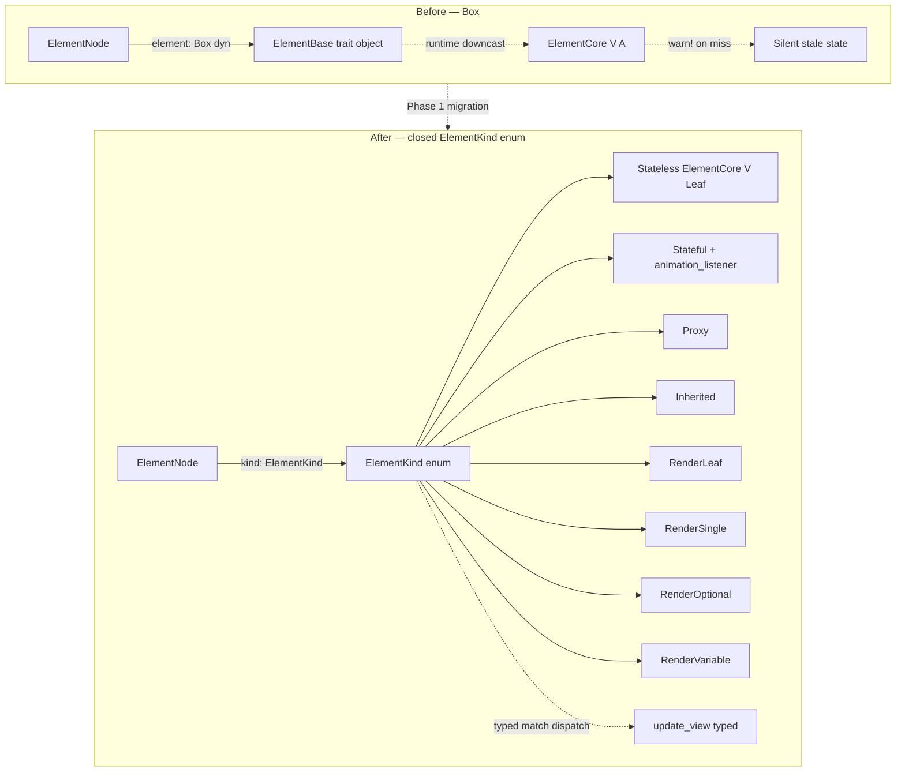
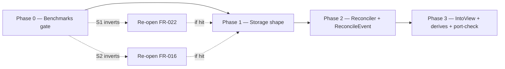

# feat: View / Element / Core Contracts — C2 + C3 + C4 + C6

> Operationalizes [`specs/004-view-element-core/spec.md`](../../specs/004-view-element-core/spec.md) (round-5 verified, 36 FRs / 14 SCs) into an executable 4-phase plan. Phase 0 benchmarks gate Phase 1 storage shape; Phase 2 lands the keyed reconciler + `ReconcileEvent` instrumentation; Phase 3 lands the `impl IntoView` authoring surface, derive macros, and the two new `port-check.sh` greps. Each phase merges to `main` as its own PR; each unit lands as one atomic commit per the [PR #84 framework-spine-repair](2026-05-21-002-feat-framework-spine-repair-plan.md) precedent.

---

## Summary

Locks the bottom of the widget-authoring contract — every future widget in `flui-widgets`, `flui-material`, and `flui-cupertino` commits to this surface at its first line. The four contracts (heterogeneous children, the `impl IntoView` authoring surface, the View trait plus closed `ElementKind` element storage, and Flutter's keyed O(N) linear child reconciliation) are designed together because they share files and propagate constraints across each other, but they land in four sequenced PRs so a defect in any one phase reverts only that phase's PR.

The plan is **Deep**: cross-cutting, contract-locking, high-risk silent-correctness footprint (every list / grid / table currently loses keyed state on reorder without surfacing in any test). The work touches ~30 files across `flui-view`, creates one new crate (`flui-macros`), and adds two new triggers to `scripts/port-check.sh`.

---

## Problem Frame

**The contract surface that every future widget commits to is not yet locked.** Today the code is in a fragile half-applied state:

- The typed `IntoView` trait already exists (`crates/flui-view/src/view/into_view.rs`) but `StatelessView::build` and `ViewState::build` still return `Box<dyn View>`.
- A correct keyed `reconcile_children` already exists (`crates/flui-view/src/tree/reconciliation.rs`, 325 LOC) with prefix-scan and suffix-scan fast paths working, but its keyed middle section is a TODO stub (`reconciliation.rs:91-98`), its tests cover zero keyed cases, and it has **zero production callers** — the actual hot path is `VariableChildStorage::update_with_views` (`crates/flui-view/src/element/child_storage.rs:494-515`, a 21-LOC positional `for (i, view) in views.iter().enumerate()` match).
- Element storage is `Box<dyn ElementBase>` with a runtime `downcast_ref::<V>()` (`crates/flui-view/src/element/generic.rs:271`) that emits `tracing::warn!` on type mismatch and continues with stale state.
- Heterogeneous children rely on a builder-only `Children` API (`crates/flui-view/src/child/children.rs`); no `column!` / `row!` macro path exists, no `ViewSeq` trait exists, no `Vec<BoxedView>` first-class path.
- Widget-authoring is a 3-step ritual (`struct` + manual `impl View` + `impl_stateless_view!`/`impl_stateful_view!`); `bon` is declared in the workspace but unused for widgets; no `#[derive(StatelessView)]` exists.

Shipping the widget catalog on this surface bakes a silent-correctness trap into every list-shaped widget (US1) and a verbose authoring API that suppresses the [`STRATEGY.md`](../../STRATEGY.md) adoption metric at the source (US4). The contracts must lock before [ROADMAP Core.1 — Vertical slice](../ROADMAP.md) starts.

---

## Scope Boundaries

### In scope (this plan, four sequenced PRs)

- **C2** — Heterogeneous children: `ViewSeq` trait with tuple impls `0..=16` and `Vec<BoxedView>` impl, `column!` / `row!` macros, FR-034 friendly compile-error at >16.
- **C3** — Widget-authoring API: `impl IntoView` return on `StatelessView::build` / `ViewState::build`, `#[derive(StatelessView)]` + `#[derive(StatefulView)]` derive macros, `bon` builders for many-field widgets, `flui-macros` crate.
- **C4** — View trait surface (already object-safe, no lifetime — confirmed in current code) + element storage migrating from `Box<dyn ElementBase>` to closed `ElementKind` enum with four `Render*` variants.
- **C6** — Keyed O(N) linear reconciliation: `key: Option<Box<dyn ViewKey>>` field on `ElementNode`, keyed middle section of `reconcile_children` completed, `ElementCore<V, Variable>::update_or_create_children` rewired to invoke it, positional `VariableChildStorage::update_with_views` deleted, `global_key_registry` integrated as an index.
- **Instrumentation:** `ReconcileEvent` structured trace stream (FR-035), `ReconcileEventCollector` Layer fixture.
- **Static-analysis hardening:** `port-check.sh` FR-033 grep (downcast in View-type update path) + FR-036 trigger #9 (sanctioned `dyn`-boundary registry) — total **9 triggers** per SC-005/SC-013.
- **Migration sites:** test impls in `flui-view/tests/`, `flui-app/src/app/runner.rs:628`, `flui-hot-reload/src/plugin.rs:121` doc-example, `examples/android_app/src/lib.rs:81` `impl_stateless_view!` consumer.
- **Orphan deletion:** `crates/flui-view/src/wrappers/render.rs` AND `crates/flui-view/src/traits/render.rs` (both confirmed not declared in `lib.rs`, no production callers).
- **Spec-vs-code naming reconciliation:** four holes resolved inline (see Key Technical Decisions).

### Deferred to Follow-Up Work (this plan's adjacent surfaces, not in scope)

- `Memo<V>` combinator for typed `View::can_update` short-circuit (FOUNDATIONS Part II item 4). The object-safe `can_update(&dyn View)` extended with key-match per FR-028 lands; the typed `Memo<V>` is a post-contract optimization.
- `view_match!` helper macro for conditional `build()` returns (spec Deferred). Spec defers to "may land with C3 if benchmarks show pattern (a) is hit often." No benchmark data yet → defer until Catalog.1 surfaces it.
- `bon`-builder lint enforcement (spec FR-011). Lint-or-convention decision deferred; convention-only for this plan, FR-011 commits `bon` as the dependency.
- Raising tuple `ViewSeq` arity cap from 16 → 32 or 64. Documented as authoring cliff with friendly compile-error at 16; raising the cap is a build-time-cost vs. authoring-ergonomics trade-off for a follow-up change.
- `S4 AnimationListener` closure-capture per-frame cost benchmark (spec Deferred). Plan-phase action lifts to Risk Register as a tracked uncertainty; benchmark runs against Catalog.1 readiness, not against this contract.

### Deferred for later (carried from origin spec § Out of Scope)

- **C1 — Reactivity / state model** (`setState` + `InheritedWidget` + signals-out). Ratified in FOUNDATIONS Part III; implementation independent of this contract.
- **C5 — `BuildContext` `new_minimal` correctness hole.** Cross.H repair, gates Catalog.1.
- **C7 — `build()` error model + `catch_unwind` boundary.** Ratified in FOUNDATIONS; framework-level `catch_unwind` placement is its own follow-up.
- **C8 — async edges.** Already enforced by PORT.md refusal trigger #3.
- **D-1 / D-3 / D-4 stubbed render phases** (layout walk, compositing, paint dirty-flag). Separate Core.0 work items.
- **`flui-app::theme::colors` parallel `Color` deletion** (Cycle 5 V-25). Tracked under Cross.H.
- **Widget catalog** — `flui-widgets` is not in `[workspace.members]`; producing the catalog is Business.1.
- **Refusal triggers #10-#13** — written into `PORT.md` as separate Core.0 work; this plan adds only the FR-033 grep and FR-036 trigger #9.
- **`flui-cli` re-enable + Material-shaped template rewrite** — defers to Catalog.1 when `flui-widgets` / `MaterialApp` / `Scaffold` / `AppBar` / `FloatingActionButton` exist; current templates reference unbuilt crates and are fictional placeholder code.
- **S10 — Content-addressed `ElementId`** (`hash((TypeId, key, parent_path))` instead of Slab-slot offset). Requires Constitution Principle 9 amendment + 5-ID-type consumer migration (ViewId / ElementId / RenderId / LayerId / SemanticsId). FLUI 0.2+ inspiration only.

---

## Key Technical Decisions

### KTD-1 — `ElementKind` shape: four `Render*` variants, not one with inner arity enum

The Render family lands as four separate `ElementKind` variants — `RenderLeaf(Box<dyn RenderElementBase<Leaf>>)`, `RenderSingle(...)`, `RenderOptional(...)`, `RenderVariable(...)`. Spec FR-020 commits to this; plan ratifies. Rationale: an enum variant cannot introduce a generic parameter the outer enum does not carry, so the inner `ElementCore<V, A>` must be boxed regardless. Four variants put the arity discriminant at the outer `match` site (where the reconciler dispatches per child), keeping arity-class dispatch monomorphic. One variant with inner arity enum would force a nested `match` inside the inner data, defeating the per-position monomorphism SC-007 measures.

`Stateless`, `Stateful`, `Proxy`, `Inherited` round out the variant set. `Stateful` carries an optional `animation_listener: Option<AnimationListener>` field per spec FR-020 — `AnimationBehavior` composes `StatefulBehavior` rather than peering it (confirmed by `crates/flui-view/UNIFIED_ELEMENT.md:67`). `AnimationListener { listenable_provider: Box<dyn Fn() -> Arc<dyn Listenable> + Send + Sync>, listener_id: ListenerId }` — the closure is a thunk that captures the listenable handle at `create_element` time (when the typed `V` is statically known: `let provider = move || Arc::clone(&captured_listenable);`). No `&dyn StatefulElementBase` parameter on the closure; no runtime `downcast_ref` needed; the typed-`V` call (`view.listenable()`) happens once at creation, and the stored `Box<dyn Fn()>` is uniform across all `V`.

Enum is `#[non_exhaustive]` per Constitution and SC-011.

### KTD-2 — Element-storage key field: `Option<Box<dyn ViewKey>>` default, `Option<KeyId>` is the Phase 0 S1 fork

Default storage shape per spec FR-022: `key: Option<Box<dyn ViewKey>>` on `ElementNode`. Phase 0 ships an S1 prototype against an `Option<KeyId>` interned alternative (10K-element synthetic mock, 80% unkeyed leaf / 20% keyed branch distribution). If the interned shape wins by a material margin (the spec's 2× memory cost win threshold), Phase 1 re-opens FR-022 against this plan before locking storage shape. Otherwise default holds.

The `Box<dyn ViewKey>` is the existing `ViewKey` trait at `crates/flui-foundation/src/key.rs:315` — `as_any()` + `key_eq(&dyn ViewKey) -> bool` + `key_hash() -> u64` + `clone_key() -> Box<dyn ViewKey>` + `debug_fmt` + `is_global_key() -> bool`. Storable concrete impls today: `ValueKey<T>`, `UniqueKey`, `ObjectKey`, `GlobalKey<T>`. Plan U10 adds `impl ViewKey for Key` so the spec assumption's "five concrete impls" count is honest.

### KTD-3 — Spec-vs-code naming reconciliation (four holes resolved inline)

Repo research surfaced four spec quotes that do not match current code:

| Hole | Spec quote | Code reality | Plan resolution |
|---|---|---|---|
| **N1** — Global-key registry methods | FR-030 names `register_global_key_view` / `register_global_key_state` / `take_global_key_state` | Real surface: `register_global_key(hash, id)` / `unregister_global_key(hash)` / `element_for_global_key(hash) -> Option<ElementId>` at `crates/flui-view/src/owner/build_owner.rs:411-421` | U17 keeps the existing three-method surface as the registry index; reparenting `take` semantics added as `take_global_key_for_reparent(hash) -> Option<ElementId>` (a new method). Spec FR-030's intent (registry → index, not side-channel) executed as written. |
| **N2** — `Key` newtype `ViewKey` count | Assumption "five concrete `ViewKey` impls" including `Key` (NonZeroU64 newtype) | `Key` does not `impl ViewKey` today; real impl count is 4 | U10 adds `impl ViewKey for Key` so the spec assumption holds. Storage trivially supports `Key` from any caller. |
| **N3** — `impl_stateful_view!` parallel macro | FR-010 names only `impl_stateless_view!` for deletion | `impl_stateful_view!` exists at `crates/flui-view/src/view/stateful.rs:151-163`, same `#[macro_export]` shape | U24 deletes BOTH macros; `#[derive(StatefulView)]` covers the stateful emission path. |
| **N4** — `traits/render.rs` orphan | FR-031 names only `wrappers/render.rs` for deletion | `crates/flui-view/src/traits/render.rs` is also orphaned (no `mod traits;` in `lib.rs`, imports the same dead `ViewObject` / `RenderView<P>` surface) | U9 deletes both files. |

**N5 minor** — spec body cites `tracing::warn!` at `crates/flui-view/src/tree/element_tree.rs:522` but the code is `tracing::error!`. Cosmetic; no plan action.

### KTD-4 — Phase 1 legacy-path mechanism: `#[cfg(feature = "legacy-downcast")]`, not `#[deprecated]`

Spec round-5 caught that `#[deprecated]` on the runtime `downcast_ref::<V>()` body would propagate deprecation lints through every transitive caller and break SC-005's `clippy -D warnings`. Plan uses `#[cfg(feature = "legacy-downcast")]` gating instead — the cfg-gated body is conditionally compiled out under default features, and the new `ElementKind` match arms route the active path. **Feature-isolation discipline** (per ADV-4): the cargo feature alone is not sufficient — Cargo features on `flui-view` are public, and workspace resolver-v2 feature unification can re-enable the feature from any workspace member that names it. The cfg-gated body therefore additionally requires a `cfg(__flui_legacy_downcast_internal)` flag (set only by `crates/flui-view`'s own benchmark `[[bench]] rustflags = ["--cfg=__flui_legacy_downcast_internal"]`); if the feature is enabled without the internal cfg, the body is a `compile_error!` that fails the offending consumer's build with a clear message. FR-021's Phase-3 elimination removes both gates.

### KTD-5 — `tracing::event!(target: "flui::reconcile", ...)` stability boundary

Per spec FR-035, the `flui::reconcile` target name is a **stability boundary**: renaming requires a `#[deprecated]` alias period for one release. Emission goes through `tracing::event!(target: "flui::reconcile", tracing::Level::TRACE, ?event)`. The `ReconcileEventCollector` Layer test fixture (in-tree at `crates/flui-view/src/tree/tests/reconcile_event_collector.rs`) holds `Arc<Mutex<Vec<ReconcileEvent>>>` and parses `tracing::Event` fields back into the typed struct. Installed via `tracing::dispatcher::with_default()` (per-thread scope). The reconciler MUST NOT spawn worker threads emitting `flui::reconcile` events; if a future optimization requires parallel reconcile dispatch, the discipline switches to `tracing::dispatcher::set_default()` (global, with cleanup) and SC tests gate behind `#[serial_test::serial]`. Plan ships the per-thread discipline.

### KTD-6 — `flui-macros` crate position and dependency surface

New leaf crate at `crates/flui-macros/`, `[lib] proc-macro = true`. Direct deps: `syn = "2"` (workspace `Cargo.lock` already has `syn 2.0.111` via `bytemuck_derive`, `cosmic-text`, wgpu chain), `quote = "1"`, `proc-macro2 = "1"`. Position upstream of `flui-view` in the DAG (flui-macros has no flui-* deps; flui-view depends on flui-macros). `flui-view::prelude` re-exports the derives via `pub use flui_macros::{StatelessView, StatefulView};` so widget authors write only `#[derive(StatelessView)]` without an extra `use` line.

Build-time cost: zero new lockfile entries (`syn 2.x` + `quote` + `proc-macro2` already pulled transitively). Adding `flui-macros` promotes them from indirect to direct deps of a workspace-owned crate; the resolved set does not change.

### KTD-7 — `column!` / `row!` macro location: `flui-view::macros`

Per spec FR-014, the macros live in `crates/flui-view/src/macros/mod.rs`. `flui-widgets` is not in `[workspace.members]`, and US2/US3 acceptance scenarios must be testable inside this merge unit. When `flui-widgets` is re-enabled (Catalog.1), the macros may be re-homed via re-export; the source stays in `flui-view`.

FR-034 friendly compile-error at >16 children uses a per-arity-arms + catch-all `macro_rules!` shape (17 arms 0..=16 + catch-all emits `compile_error!("column!: more than 16 children exceeds the tuple ViewSeq cap of 16 — use vec![child.boxed(), ...] for >16 children. ...")`). SC-014 verifies via `trybuild` compile-fail test under `crates/flui-view/tests/ui/`.

### KTD-8 — `port-check.sh` marker discipline: two distinct markers

- **`// PORT-CHECK-OK-DOWNCAST: <reason>`** — FR-033 grep, whitelist marker for legitimate non-View-type `downcast_ref` uses (e.g., `&dyn Any → &RenderId` at `crates/flui-view/src/element/unified.rs:313` and `:351`).
- **`// PORT-CHECK-OK-DYN: <reason>`** — FR-036 trigger #9, whitelist marker for sanctioned `dyn`-boundary introductions outside the FR-029 five-point set.

Marker names are deliberately distinct — the two enforce different defect classes (downcast in update path vs. unsanctioned dyn introduction). Marker placement rule: same source line as the matched pattern OR the immediately-preceding non-blank source line. Trigger #9 uses ripgrep multiline mode (`rg -U`) to catch multi-line `Box<dyn\n    Trait>` declarations and a type-alias laundering closure (`type \w+\s*=\s*(Box|&|Arc|Rc)<\s*dyn`).

Bootstrap whitelist estimate: ~50-100 marker sites at Phase 3 landing — `Arc<dyn Any + Send + Sync>` pipeline-owner pattern (`view/root.rs`, `element/{child_storage,generic,unified,render_object_element}.rs`), `Box<dyn Error + Send + Sync>` thiserror chains (`flui-engine/src/error.rs`), `Box<dyn Fn(...) + Send + Sync>` notifier callbacks (`flui-rendering/src/pipeline/notifier.rs`), `type BoxedNotification = Box<dyn Notification>` aliases. Categorically exempt (skipped before marker check): `Pin<Box<dyn Future<...>>>`, `Box<dyn Iterator<...>>`, `&dyn Fn(...)` / `&dyn FnMut(...)` / `&dyn FnOnce(...)` (language-runtime patterns).

---

## High-Level Technical Design

### Element-storage shape transition



*Directional guidance — variant set per spec FR-020. Actual variant data shapes are per-unit design.*

### Keyed reconciliation algorithm (Flutter port, behavior loyal)

Ported 1:1 from `.flutter/flutter-master/packages/flutter/lib/src/widgets/framework.dart` `RenderObjectElement.updateChildren`. The existing scaffold at `crates/flui-view/src/tree/reconciliation.rs` has prefix-scan + suffix-scan + keyed-HashMap-middle shape correct; what's missing:

1. **Phase 3 old-side key storage** (lines 137-146 today fall back to `view_type_id`). Replace with `node.key().map(|k| k.key_hash())` after U7 lands the `key` field on `ElementNode`.
2. **Phase 4 middle-section key equality** (line 153-157 already does `new_view.key().key_hash()`). Add `ViewKey::key_eq` semantic-equality check on hash hit per spec FR-024 work item (c) — defends against hash collisions between distinct keys.
3. **Production wiring** — today `reconcile_children` has zero production callers (`crates/flui-view/src/element/generic.rs:363` calls `VariableChildStorage::update_with_views` instead). U15 reroutes.

```text
reconcile_children(tree, parent, old_children, new_views, owner) -> Vec<ElementId>
├─ Phase 0: fast paths (both empty, all new, all removed)
├─ Phase 1: prefix scan — match from start while can_update_element holds
├─ Phase 2: suffix scan — match from end while can_update_element holds
├─ Phase 3: build old_keyed: HashMap<u64, ElementId> from unmatched middle
│           — KEY SOURCE: node.key().map(|k| k.key_hash())  ← NEW (was view_type_id)
├─ Phase 4: walk new middle, lookup by key_hash, ViewKey::key_eq on hit  ← NEW eq check
│           — emit ReconcileEvent::Reuse | Reorder | Mount per disposition
├─ Phase 5: remove unused old elements
│           — emit ReconcileEvent::Unmount per removed
└─ GlobalKey reparent path:
   on unmatched-by-position keyed child where key.is_global_key():
     owner.element_for_global_key(hash) -> Option<ElementId> (O(1) cross-tree lookup)
     if found AND not in current parent's old_children:
       detach from prior parent, attach here, emit ReconcileEvent::Reparent
```

*Directional grammar — actual control flow is per-unit U12 design.*

### Authoring surface — before / after

**Before (3-step ritual):**

```rust
// Author writes 3 things:
#[derive(Clone)]
struct Greeting { name: String }

impl View for Greeting {
    fn create_element(&self) -> Box<dyn ElementBase> {
        Box::new(StatelessElement::new(self, StatelessBehavior))
    }
    // ... view_type_id, can_update, key boilerplate ...
}

impl_stateless_view!(Greeting);  // macro emits StatelessView impl wrapper

impl Greeting {
    fn build(&self, _ctx: &dyn BuildContext) -> Box<dyn View> {
        Box::new(Text::new(&self.name))
    }
}
```

**After (1 derive + 1 build):**

```rust
#[derive(Clone, StatelessView)]
struct Greeting { name: String }

impl Greeting {
    fn build(&self, _ctx: &dyn BuildContext) -> impl IntoView {
        Text::new(&self.name)
    }
}
```

*Six lines of author-visible code, rustfmt-canonical, matching Flutter's `class Greeting extends StatelessWidget { ... }` (SC-001 ≤ 7 LOC bar).*

### Output structure — `flui-macros` new crate

```text
crates/flui-macros/
├── Cargo.toml                    # proc-macro = true, syn 2 / quote 1 / proc-macro2 1
├── src/
│   ├── lib.rs                    # #[proc_macro_derive(StatelessView)] + StatefulView entry
│   ├── derive_stateless.rs       # StatelessView codegen — impl View + StatelessView boilerplate
│   ├── derive_stateful.rs        # StatefulView codegen — impl View + State handle wiring
│   └── attrs.rs                  # parsing for any future opt-in attributes
└── tests/
    ├── compile_pass.rs           # trybuild — minimum-shape Greeting compiles
    └── ui/                       # trybuild compile-fail tests (none in Phase 1; populated in Phase 3 SC-014)
```

---

## Implementation Sequence

The plan executes the spec's 4-phase Implementation Sequence. Each phase is one PR; each unit is one atomic commit per the [PR #84 framework-spine-repair](2026-05-21-002-feat-framework-spine-repair-plan.md) precedent. Phase 0 lands first; Phase N branches from merged Phase N-1.

Phase dependency graph:



---

### Phase 0 — Spec-validation benchmarks (gates Phase 1)

**Goal**: time-boxed 3 working days. Produce S1 + S2 benchmarks against the synthetic mock specified by the spec. Land bench infrastructure (`crates/flui-view/benches/` does not yet exist). If either benchmark inverts the spec's FR-022 / FR-016 commitment by a material margin, the spec is re-opened against the relevant FR before Phase 1 starts. Phase 0 lands as a separate PR; its outputs gate Phase 1 — do **not** start Phase 1 until the Phase 0 gate report (U4) clears.

**Phase 0 PR exit criteria:** bench code committed at `crates/flui-view/benches/`, gate report committed at `docs/research/2026-05-22-phase0-gate-report.md`, `cargo bench -p flui-view --no-run` succeeds, the gate report carries explicit go/no-go verdicts on S1 and S2.

#### U1. Bench infrastructure for `flui-view`

- **Goal**: create the `crates/flui-view/benches/` directory and wire `criterion = "0.7"` from the workspace dep into `flui-view`'s `[dev-dependencies]`, with a `[[bench]]` declaration that loads. Establish per-crate bench convention mirroring `crates/flui-types/benches/{color,conversions,geometry}_bench.rs`.
- **Requirements**: precondition for SC-006 + SC-012 + Phase 0 S1 / S2 deliverables.
- **Dependencies**: none.
- **Files**:
  - `crates/flui-view/Cargo.toml` (add `criterion = { workspace = true }` to `[dev-dependencies]`, add `[[bench]]` declaration)
  - `crates/flui-view/benches/reconcile_baseline.rs` (smoke bench: empty `reconcile_children` round-trip on 10-element list — proves harness loads)
- **Approach**: criterion 0.7 group convention. No `criterion.toml`; per-crate `[[bench]]` config in `Cargo.toml`. Each `[[bench]]` declaration MUST include `harness = false` (required for criterion's `criterion_main!` macro — without it, rustc compiles in the libtest harness which conflicts). Smoke bench produces a measurable baseline so U2/U3 deltas are interpretable.
- **Patterns to follow**: `crates/flui-types/benches/geometry_bench.rs` + `crates/flui-types/Cargo.toml:63-65` (`[[bench]] name = "geometry_bench" harness = false`), workspace `criterion = "0.7"` declaration at `Cargo.toml:174`.
- **Test scenarios**: harness load is the verification — `cargo bench -p flui-view --no-run` succeeds AND `cargo bench -p flui-view -- --test` exercises the runtime path (catches Criterion version-mismatch panics that `--no-run` does not detect).
- **Verification**: `cargo bench -p flui-view --no-run` exits 0; `cargo bench -p flui-view -- --test` exits 0; `cargo bench -p flui-view -- reconcile_baseline --quick` produces a Criterion HTML report under `target/criterion/`.

#### U2. S1 — `Option<KeyId>` interning prototype vs `Option<Box<dyn ViewKey>>` baseline

- **Goal**: prototype the interned-key storage shape per spec Deferred S1. Implement against a synthetic `ElementNode` storage mock (not against production code — Phase 0 must not modify production storage). Benchmark per-frame reconcile cost AND per-frame memory on a 10K-element synthetic distribution (80% unkeyed leaf, 20% keyed branch). Compare against the `Option<Box<dyn ViewKey>>` baseline shape.
- **Requirements**: spec Deferred S1 resolution. Output gates whether FR-022 storage shape is re-opened.
- **Dependencies**: U1.
- **Files**:
  - `crates/flui-view/benches/s1_key_storage.rs` — criterion bench with two groups (`baseline_box_dyn`, `interned_key_id`)
  - `crates/flui-view/benches/shared/mock_node.rs` — synthetic ElementNode mock holding only `id + kind + key + child_indices`, no real lifecycle
- **Approach**: `KeyId` is a `NonZeroU64` newtype with a `ViewKey` -> `KeyId` interning table (`HashMap<u64 (hash), KeyId>` + reverse `Slab<Box<dyn ViewKey>>`). Bench measures (a) memory size per `ElementNode` (`std::mem::size_of` + heap-allocated `Box<dyn ViewKey>` total via custom allocator counter or a deterministic accounting fixture), (b) per-frame reconcile cost on permutation-reorder workload (full-reverse, single-rotate, swap-first-last). Multi-iteration averaging via criterion's default 100-sample regime.
- **Patterns to follow**: GPUI's `ElementId` lease pattern (cited at `crates/flui-view/src/owner/element_owner.rs:1-40`).
- **Test scenarios**:
  - Bench: `bench_reconcile_box_dyn` — 10K-element mock, 6 permutations, baseline shape.
  - Bench: `bench_reconcile_key_id` — 10K-element mock, 6 permutations, interned shape.
  - Memory accounting: each shape's resident size measured at peak with 80%/20% distribution.
  - Bench: `bench_hash_lookup_box_dyn` vs `bench_hash_lookup_key_id` — narrow latency probe for the hash-table hit path.
- **Verification**: criterion HTML reports show both groups side-by-side; the gate report (U4) carries a verdict — interned wins by ≥2× memory cost reduction on the unkeyed-leaf majority → re-open FR-022; otherwise baseline holds.

#### U3. S2 — Static-path tuple-permutation algorithm sketch

- **Goal**: produce a compile-time-tree-diffing alternative for the static-tuple `ViewSeq` path on a 16-element tuple permutation case per spec Deferred S2. Estimate code-complexity proxy (LOC + cyclomatic) vs the linear keyed algorithm. Judge whether the parity-with-Flutter constraint (FR-016) survives.
- **Requirements**: spec Deferred S2 resolution. Output gates whether FR-016 (both paths share the same algorithm) is re-opened.
- **Dependencies**: U1.
- **Files**:
  - `crates/flui-view/benches/s2_static_path.rs` — criterion bench comparing linear-keyed vs tuple-specialized algorithms on 16-element permutation
  - `docs/research/2026-05-22-s2-static-path-sketch.md` — algorithm sketch document (pseudo-Rust, LOC count, complexity estimate, parity judgment)
- **Approach**: implement a `const fn reconcile_tuple_16<A, B, ..., P>(old: &Element16, new: &View16) -> Reconcile16Action` shape — compile-time pattern match on `TypeId` per position. Bench on 16-tuple full-reverse permutation. Document tradeoff: tuple positions are compile-time fixed, so "reordering" means a different type signature, so a tuple-specialized algorithm could skip the key-lookup HashMap entirely.
- **Patterns to follow**: Xilem's `ViewSequence` algorithm shape (cited in spec § Dependencies).
- **Test scenarios**:
  - Bench: `bench_static_path_keyed_linear` — 16-tuple permutation through `reconcile_children` (the linear path)
  - Bench: `bench_static_path_specialized` — same input through the specialized tuple path
  - Doc: complexity / LOC tabulated for both
  - Doc: parity judgment — does the specialized path break SC-002 (state preservation across permutations), or does it preserve state equally? If equally, FR-016 may be re-opened.
- **Verification**: criterion shows whether specialized path is ≥5× faster (spec's threshold); doc carries explicit verdict that gate report (U4) summarizes.

#### U4. Phase 0 gate report

- **Goal**: synthesize U2 + U3 benchmark results into a written go/no-go gate decision. Document the verdict: which spec FRs (if any) are re-opened; the new storage shape (if changed); the new static-path algorithm (if adopted).
- **Requirements**: closes Phase 0. Phase 1 may not start until this lands.
- **Dependencies**: U2, U3.
- **Files**:
  - `docs/research/2026-05-22-phase0-gate-report.md` — gate-report document with S1 verdict, S2 verdict, FR-022 status (locked / re-opened), FR-016 status (locked / re-opened), **sensitivity analysis section** (per ADV-5: rerun S1 at 60/40, 80/20, 95/5 distributions; if verdict differs across distributions, declare the verdict CONDITIONAL on real-catalog distribution), Phase 1 entry conditions, and **Catalog.1 re-open mechanism** (a documented rebench procedure that runs U2 against the first 50-100 widgets shipped in Catalog.1; if the real distribution falsifies the Phase 0 verdict by a material margin, Catalog.1 commits a follow-up migration PR re-opening FR-022 storage shape)
- **Approach**: a short structured doc. Three sections: (1) S1 results table + verdict, (2) S2 results table + verdict, (3) Phase 1 entry conditions ("Phase 1 may start when this report's verdict on FR-022 and FR-016 is recorded above. If either is re-opened, the spec must be revised before Phase 1 U6/U7 begin.").
- **Patterns to follow**: previous wave-design + receipt doc shape (e.g., `docs/research/2026-05-22-cycle4-wave2-design.md` + `2026-05-22-cycle4-wave2-receipts.md`).
- **Test scenarios**: documentary — no executable tests. Gate is human-judged from the bench data.
- **Verification**: PR review must call out the verdict explicitly. Phase 1 PR description must link this report.

#### Phase 0 verification gate

```text
cargo bench -p flui-view --no-run                    # exit 0
cargo build --workspace                              # exit 0
cargo clippy --workspace --all-targets -- -D warnings # exit 0
bash scripts/port-check.sh -v                        # 7/7 triggers ok (no new triggers yet)
ls docs/research/2026-05-22-phase0-gate-report.md   # exists
```

---

### Phase 1 — Storage shape + key field + `flui-macros` skeleton + self-validation

**Goal**: land `ElementKind` enum (four `Render*` variants), the new `key: Option<Box<dyn ViewKey>>` field on `ElementNode`, the `flui-macros` crate skeleton, the orphan deletions, and the round-trip test that validates FR-022's storage shape independently of Phase 2's reconciler. Active dispatch path routes through new `ElementKind` match arms (identity-shim that delegates back to legacy storage internals until Phase 2's reconciler replaces them); legacy `downcast_ref` gated under `#[cfg(feature = "legacy-downcast")]`.

**Phase 1 PR exit criteria:** `ElementKind` enum in place; `ElementNode.key` field populated at insertion from `View::key()`; `flui-macros` crate compiles + is in `[workspace.members]`; orphan files deleted; key round-trip test passes for all five `ViewKey` variants; default-features build green with no `clippy -D warnings` regressions; the cfg-gated `legacy-downcast` body NOT enabled on default-features.

#### U5. `flui-macros` crate skeleton

- **Goal**: create the empty proc-macro crate. No derives yet — those land in U23. The skeleton compiles, links into `flui-view`'s dependency graph, and exports a no-op placeholder.
- **Requirements**: FR-009 (crate must exist as a precondition for U23).
- **Dependencies**: Phase 0 gate (U4) clear.
- **Files**:
  - `crates/flui-macros/Cargo.toml` (new — `[lib] proc-macro = true`, deps `syn = "2"`, `quote = "1"`, `proc-macro2 = "1"`)
  - `crates/flui-macros/src/lib.rs` (new — `#![allow(dead_code)] // populated in U23`, placeholder `#[proc_macro_derive(StatelessViewPlaceholder)] pub fn _placeholder(_: TokenStream) -> TokenStream { TokenStream::new() }`)
  - `Cargo.toml` (workspace — add `crates/flui-macros` to `[workspace.members]`, declare `flui-macros = { path = "crates/flui-macros" }` in `[workspace.dependencies]`)
  - `crates/flui-view/Cargo.toml` (add `flui-macros = { workspace = true }` to `[dependencies]`)
  - `crates/flui-view/tests/flui_macros_smoke.rs` (new — smoke test importing `flui_macros::*`, asserts crate is linkable)
- **Approach**: leaf-crate convention. Position upstream of `flui-view` in the DAG. `flui-view::prelude` re-export of derive symbols happens in U23 (cannot re-export the placeholder).
- **Patterns to follow**: `ambassador 0.4.2` (workspace's existing proc-macro consumer pattern, declared at `Cargo.toml:80`). `flui-types` `Cargo.toml` for trybuild dev-dep precedent.
- **Test scenarios**:
  - **Compile smoke**: `cargo build -p flui-macros` exits 0; `cargo build -p flui-view` exits 0 (proves dep linkage).
  - **Workspace integration**: `cargo metadata --format-version 1` lists `flui-macros` in workspace members.
  - **No new warnings**: `cargo clippy -p flui-macros -- -D warnings` exits 0.
- **Verification**: `cargo build --workspace` green; `flui-macros` appears in `cargo metadata` output; no clippy regressions.

#### U6. `ElementKind` closed enum + variant data shapes

- **Goal**: introduce the closed `#[non_exhaustive] pub enum ElementKind` (`Stateless` / `Stateful` / `Proxy` / `Inherited` / `RenderLeaf` / `RenderSingle` / `RenderOptional` / `RenderVariable`) with per-variant data shapes. `Stateful` carries `animation_listener: Option<AnimationListener>` field per KTD-1. Variant data: each variant boxes the existing `ElementCore<V, A>` shape so the outer enum stays object-fixed-size.
- **Requirements**: FR-019, FR-020. SC-007 (monomorphic-per-arity-class outer match). SC-011 (non-exhaustive smoke).
- **Dependencies**: U5.
- **Files**:
  - `crates/flui-view/src/element/kind.rs` (new — `ElementKind` enum definition + `AnimationListener` struct)
  - `crates/flui-view/src/element/mod.rs` (export `kind` module)
  - `crates/flui-view/src/element/generic.rs` (add `kind()` method returning `&ElementKind` — read-only for U6; populated in U8)
- **Approach**: per-variant inner data is `Box<dyn StatelessElementBase>` / `Box<dyn StatefulElementBase>` / `Box<dyn ProxyElementBase>` / `Box<dyn InheritedElementBase>` / `Box<dyn RenderElementBase<Leaf>>` / ... / `Box<dyn RenderElementBase<Variable>>`. The arity-parameterized `RenderElementBase<A>` trait keeps arity-class dispatch monomorphic at the outer match — exactly what SC-007 measures. Inner boxing sanctioned by FR-029 point 1.
  - `AnimationListener { listenable_provider: Box<dyn Fn() -> Arc<dyn Listenable> + Send + Sync>, listener_id: ListenerId }`. The closure does NOT take `&dyn StatefulElementBase` — instead, at `create_element` time (where the typed `V` is statically known), the closure CAPTURES the needed listenable handle directly: `let provider = Box::new({ let listenable = view.listenable(); move || Arc::clone(&listenable) });`. This sidesteps the typed-`V`-boundary-via-erased-dispatch problem entirely — the closure is a thunk returning a pre-captured `Arc<dyn Listenable>`, the typed call (`view.listenable()`) happens at creation time when `V` is concrete, and the stored `Box<dyn Fn() -> Arc<dyn Listenable>>` is uniform across all `V`. No runtime `downcast_ref` needed; FR-021 / SC-004 unaffected.
- **Patterns to follow**: `crates/flui-rendering/src/objects/` enum-dispatch shape for arity discrimination. `#[non_exhaustive]` precedent from PR #107 on error enums (`cited in repo research`).
- **Test scenarios**:
  - **Variant construction**: each variant constructible from a representative `ElementCore<V, A>` value in `tests/element_kind_variants.rs`.
  - **Outer match discriminant exhaustivity**: a test function does `match kind { Stateless(_) => 0, Stateful(_) => 1, Proxy(_) => 2, Inherited(_) => 3, RenderLeaf(_) => 4, RenderSingle(_) => 5, RenderOptional(_) => 6, RenderVariable(_) => 7 }` — proves exhaustivity in production with the closed set.
  - **`#[non_exhaustive]` smoke (Covers SC-011)**: separate test crate `tests/element_kind_non_exhaustive_check.rs` performs a `match kind { ... }` without a wildcard arm; cfg-gated behind `cfg(feature = "test-non-exhaustive-smoke")` so a contributor adding a new variant sees the compile error.
  - **`AnimationListener` smoke**: construct an `AnimationListener` with a synthetic closure; assert the closure is callable and returns a non-null `Arc<dyn Listenable>` pointer.
- **Verification**: `cargo build -p flui-view --lib` exits 0; the smoke test crate's `cargo check --features test-non-exhaustive-smoke` exits 0 (placeholder variant absent → exhaustive match holds); `cargo clippy -p flui-view --all-targets -- -D warnings` exits 0.

#### U7. `key: Option<Box<dyn ViewKey>>` field on `ElementNode` + round-trip test

- **Goal**: add the `key: Option<Box<dyn ViewKey>>` field to `ElementNode` per spec FR-022. Populate from `View::key()` at every `tree.insert(...)` call site and copy at every `update(...)` boundary. Existing `registered_global_key_hash: Option<u64>` field reduced to a side-index (computed from `key` at registration time, not stored separately).
- **Requirements**: FR-022. Precondition for U12 (keyed middle section).
- **Dependencies**: U6 (kind module shape).
- **Files**:
  - `crates/flui-view/src/tree/element_tree.rs` (add `key` field to `ElementNode` struct; populate at lines 211-240 mount path; copy in `update` boundary)
  - `crates/flui-view/src/tree/element_tree.rs` (add `key()` and `key_hash()` accessors to `ElementNode` — accessors live alongside the struct, not in a separate file)
  - `crates/flui-view/tests/key_roundtrip.rs` (new — round-trip test per spec Phase 1 self-validation requirement)
- **Approach**: field is `Option<Box<dyn ViewKey>>`. Cloning is via `ViewKey::clone_key()` (`crates/flui-foundation/src/key.rs:340-350`). The `registered_global_key_hash` field stays for backward compat in Phase 1 but is computed from `key.as_ref().map(|k| k.key_hash())` rather than stored separately at the next phase boundary; full elimination is U17's concern.
  - Storage shape: `Option<Box<dyn ViewKey>>` is `16 bytes` (8 bytes pointer + 8 bytes vtable) per node. For a 10K-element tree, ~160 KB of overhead on the unkeyed-leaf majority. Phase 0 S1 verdict determines whether this is acceptable; if U4's gate report verdicts `KeyId` interning, U7 is re-shaped before landing.
- **Patterns to follow**: PR #84 `ElementOwner` split-borrow handle (cited at `crates/flui-view/src/owner/element_owner.rs:1-40`).
- **Test scenarios** (round-trip test for each of the 5 `ViewKey` variants, per spec Phase 1 self-validation requirement):
  - **`Covers FR-022 / key_roundtrip(ValueKey)`**: construct `Greeting { ... }.with_value_key(42_u32)`, insert into tree, retrieve `node.key()`, assert `key_eq` returns true against a fresh `ValueKey(42_u32)`.
  - **`Covers FR-022 / key_roundtrip(UniqueKey)`**: insert with `UniqueKey::new()`, retrieve, assert `key_eq` and `key_hash` round-trip.
  - **`Covers FR-022 / key_roundtrip(ObjectKey)`**: same for `ObjectKey::new(Arc::new(...))`.
  - **`Covers FR-022 / key_roundtrip(GlobalKey<W>)`**: same for `GlobalKey::<TestView>::new("k1")`.
  - **`Covers FR-022 / key_roundtrip(Key)`**: same for `flui_foundation::Key::from_str("k1")` (relies on U10's `impl ViewKey for Key`).
  - **`Covers FR-022 / no_key`**: insert without a key, assert `node.key()` returns `None`.
  - **Edge: remount-copy**: insert, retrieve `id`, simulate a `View::can_update` matching update (same `view_type_id`), assert `node.key()` survives the update.
  - **Edge: GlobalKey is_global**: insert with `GlobalKey<TestView>`, assert `node.key().unwrap().is_global_key()` returns `true`.
- **Verification**: `cargo test -p flui-view --test key_roundtrip` exits 0 with all 7 cases passing.

#### U8. `cfg(feature = "legacy-downcast")` shim + new `ElementKind` match arms

- **Goal**: gate the existing runtime `downcast_ref::<V>()` body at `crates/flui-view/src/element/generic.rs:271` under `#[cfg(feature = "legacy-downcast")]`. Add new `ElementKind` match arms (identity-shim — delegates back to legacy storage internals until Phase 2's reconciler replaces them). On default-features, the new path is active; the cfg-gated body is conditionally compiled out.
- **Requirements**: KTD-4 (`#[cfg]` mechanism replaces `#[deprecated]`); SC-005 (`clippy -D warnings` stays green).
- **Dependencies**: U6, U7.
- **Files**:
  - `crates/flui-view/Cargo.toml` (add `legacy-downcast = []` to `[features]`; document that this feature MUST NOT be enabled in production builds — Phase 3 removes it entirely)
  - `crates/flui-view/src/element/generic.rs` (cfg-gate the existing `update_view` body; add identity-shim match-on-`ElementKind` body for default-features)
  - `crates/flui-view/src/element/dispatch.rs` (new — typed `dispatch_view_update(kind, new_view)` function. Phase 1 ships as identity-shim that delegates to legacy storage; Phase 3 U27 replaces the body with real typed `ElementKind` match dispatch. The module is the long-lived future home of typed dispatch — NOT a temporary file. The Phase-1-shim phrasing communicates the IMPLEMENTATION is provisional, the FILE is permanent.)
- **Approach**: identity-shim means the new path produces the same observable behavior as the legacy path during Phase 1 (no behavior change). Phase 2 replaces the shim with the real reconciler integration. **Feature-isolation discipline** (per ADV-4 cross-workspace-feature-unification analysis): the `legacy-downcast` Cargo feature alone is not sufficient isolation — Cargo features declared on `flui-view` are part of its public API surface, and workspace `resolver = "2"` unifies features across the workspace at build time, so a benchmark, example, or downstream consumer could enable the legacy path inadvertently. Plan adds a SECOND gate: the cfg-gated `update_view` body emits a `compile_error!("legacy-downcast is workspace-internal only — see docs/PORT.md")` unless BOTH `feature = "legacy-downcast"` AND `cfg(__flui_legacy_downcast_internal)` are set. The internal-cfg is only added by `crates/flui-view`'s OWN benchmark `Cargo.toml` (via `[[bench]] rustflags = ["--cfg=__flui_legacy_downcast_internal"]`) for the U2 S1 bench. Any other consumer that enables the feature without the internal cfg fails the build — a downstream `flui-view = { features = ["legacy-downcast"] }` declaration becomes a compile error visible to the offending consumer, not a silent regression of the FR-021 closed defect. Phase 3 U27 deletes both gates.
- **Patterns to follow**: workspace `cfg(feature = "...")` discipline; precedent for sensitive code-path gating.
- **Test scenarios**:
  - **Default-features path active**: `cargo test -p flui-view --lib` with default features — existing tests pass, the identity-shim path is exercised (asserted via a Phase 1 internal `cfg(test)` check that records which path was taken).
  - **Legacy-feature requires internal cfg**: `cargo check -p flui-view --features legacy-downcast` (without the `__flui_legacy_downcast_internal` cfg) FAILS with `compile_error!("legacy-downcast is workspace-internal only — see docs/PORT.md")`. Confirms the feature cannot be enabled by a downstream consumer or by accidental workspace-resolver unification.
  - **Legacy-feature with internal cfg builds**: `RUSTFLAGS="--cfg=__flui_legacy_downcast_internal" cargo check -p flui-view --features legacy-downcast` exits 0 (proves the cfg-gated body still type-checks when both gates are set — important for U2's S1 bench access to the legacy storage shape).
  - **`Covers SC-005`**: `cargo clippy --workspace --all-targets -- -D warnings` exits 0.
- **Verification**: both feature configurations build clean; default-features test suite green.

#### U9. Delete orphan files — `wrappers/render.rs` + `traits/render.rs`

- **Goal**: delete both orphan files. `crates/flui-view/src/wrappers/render.rs` (spec FR-031 names this one) AND `crates/flui-view/src/traits/render.rs` (research-discovered orphan, KTD-3 N4). Both implement parallel `ViewObject` / `RenderView<P>` / `ViewMode` surfaces incompatible with the canonical `crate::view::render::RenderView` at `crates/flui-view/src/view/render.rs:54-88`. Neither is declared in `lib.rs`; both have zero production callers.
- **Requirements**: FR-031 orphan-deletion bullet; KTD-3 N4.
- **Dependencies**: U5 (so the `flui-macros` skeleton is in place — defensive, prevents wrappers/render.rs's deletion racing with macro work).
- **Files**:
  - `crates/flui-view/src/wrappers/render.rs` (delete)
  - `crates/flui-view/src/wrappers/` (delete directory if `render.rs` was the only file; verify before deleting)
  - `crates/flui-view/src/traits/render.rs` (delete)
  - `crates/flui-view/src/traits/` (delete directory if `render.rs` was the only file; verify before deleting)
- **Approach**: `git rm` the files; verify nothing in `lib.rs` references them (it doesn't); verify no production caller via `rg "use crate::wrappers"` and `rg "use crate::traits"` workspace-wide. If anything pops up, the spec's "Re-architecting the parallel `ViewObject` / `RenderView<P>` / `ViewMode` surface is out of scope" rule fires — the offending caller is broken and must be fixed (or itself deleted), not the orphan resurrected.
- **Patterns to follow**: zombie-cleanup precedent in [`2026-05-20-005-refactor-flui-rendering-zombie-cleanup-plan.md`](2026-05-20-005-refactor-flui-rendering-zombie-cleanup-plan.md).
- **Test scenarios**:
  - **Zero callers**: `rg "use crate::wrappers::render"` + `rg "use crate::traits::render"` over workspace return zero matches.
  - **No mod declaration**: `rg "^pub mod (wrappers|traits)" crates/flui-view/src/lib.rs` returns zero matches.
  - **Compile after delete**: `cargo build --workspace` exits 0 post-delete.
- **Verification**: `cargo build --workspace` green; `rg "(wrappers|traits)/render"` workspace-wide returns zero hits.

#### U10. `impl ViewKey for Key` newtype

- **Goal**: add `impl ViewKey for Key` to make spec's "five concrete `ViewKey` impls" assumption honest. `Key` (NonZeroU64 newtype in `flui-foundation`) becomes storable as a key alongside `ValueKey<T>`, `UniqueKey`, `ObjectKey`, `GlobalKey<T>`.
- **Requirements**: KTD-3 N2.
- **Dependencies**: U7 (so the key field on `ElementNode` exists to be exercised against).
- **Files**:
  - `crates/flui-foundation/src/key.rs` (add `impl ViewKey for Key` block — `key_hash()` returns the inner `NonZeroU64::get()`, `key_eq` compares inner `NonZeroU64`, `clone_key()` boxes a `Clone` of self, `debug_fmt` delegates to `Debug`)
- **Approach**: trivial impl. `Key` is `Copy + Clone`, so `clone_key()` is `Box::new(*self)`. `is_global_key()` defaults to `false` (Key newtype is not a global-handoff key). `as_any()` returns `self as &dyn Any` via the standard pattern.
- **Patterns to follow**: existing `impl ViewKey for ValueKey<T>` at `crates/flui-foundation/src/key.rs:433-460`.
- **Test scenarios**:
  - **Round-trip via U7's `key_roundtrip(Key)` case**: `flui_foundation::Key::from_str("k1")` round-trips through `ElementNode.key()`.
  - **Hash determinism**: `Key::from_str("k1").key_hash()` returns the same value across two calls.
  - **`key_eq` reflexivity**: `Key::from_str("k1").key_eq(&Key::from_str("k1"))` returns true; `Key::from_str("k1").key_eq(&Key::from_str("k2"))` returns false.
  - **`is_global_key()`**: returns false.
- **Verification**: `cargo test -p flui-foundation` green; U7's `key_roundtrip(Key)` case passes.

#### U11. `View::can_update` extension — type + key match

- **Goal**: extend `View::can_update(&self, old: &dyn View) -> bool` from today's type-only check (`self.view_type_id() == old.view_type_id()`) to spec FR-028's full semantics (`runtimeType == other.runtimeType && key == other.key`).
- **Requirements**: FR-028. Precondition for U12 (keyed match correctness).
- **Dependencies**: U7, U10 (key field + Key newtype as ViewKey).
- **Files**:
  - `crates/flui-view/src/view/view.rs` (extend `can_update` default impl — type-id check + key-equality check via `ViewKey::key_eq`)
- **Approach**: default impl becomes `self.view_type_id() == old.view_type_id() && key_match(self.key(), old.key())`. `key_match` is a helper: both `None` → match; both `Some` with `key_eq` true → match; otherwise no match. Helper lives next to the trait def.
- **Patterns to follow**: existing object-safe `can_update` shape — same signature, broader body.
- **Test scenarios**:
  - **`Covers FR-028 / type_match_no_keys`**: two `Greeting { name: "x" }` values with no keys → `can_update` returns true.
  - **`Covers FR-028 / type_match_same_keys`**: two `Greeting`s both with `ValueKey(42)` → true.
  - **`Covers FR-028 / type_match_different_keys`**: two `Greeting`s with `ValueKey(42)` vs `ValueKey(43)` → false.
  - **`Covers FR-028 / type_mismatch`**: `Greeting` vs `Padding` → false regardless of keys.
  - **Edge: mixed keyed/unkeyed**: `Greeting { key: Some(...) }` vs `Greeting { key: None }` → false.
- **Verification**: `cargo test -p flui-view --test view_can_update` green; existing reconciler tests that depend on `can_update` semantics still pass.

#### Phase 1 verification gate

```text
cargo build --workspace                                       # exit 0
cargo clippy --workspace --all-targets -- -D warnings         # exit 0
cargo test -p flui-view --lib                                 # all tests pass
cargo test -p flui-view --test key_roundtrip                  # 7/7 cases pass
cargo test -p flui-foundation                                 # green (U10 ViewKey impl)
cargo check -p flui-view --features legacy-downcast           # exit 0 (cfg-gated body type-checks)
cargo build -p flui-macros                                    # exit 0 (skeleton compiles)
bash scripts/port-check.sh -v                                 # 7/7 triggers ok (no new triggers yet)
rg "use crate::wrappers" -t rust                              # zero hits
rg "use crate::traits" -t rust                                # zero hits
```

---

### Phase 2 — Keyed reconciler completion + `ElementCore` rewiring + `ReconcileEvent` instrumentation

**Goal**: complete the keyed middle section of `reconcile_children`, wire `ElementCore<V, Variable>::update_or_create_children` to invoke it, delete the positional `VariableChildStorage::update_with_views`, integrate the `global_key_registry` as an index, and ship the FR-035 `ReconcileEvent` stream + `ReconcileEventCollector` Layer test fixture. Phase 2 lands on the Phase 1 foundation.

**Phase 2 PR exit criteria:** `reconcile_children` is the production hot path for `Variable` child updates; `VariableChildStorage::update_with_views` deleted; SC-002 6-permutation corpus passes; SC-003 GlobalKey reparenting test passes; SC-006 + SC-012 benchmarks pass linearity bound; SC-010 ported Flutter test subset passes; FR-035 `ReconcileEvent` stream emits expected events. `legacy-downcast` feature still cfg-gates the old `downcast_ref` body (eliminated in Phase 3).

#### U12. Keyed middle section — old-side key storage + match

- **Goal**: complete the keyed middle of `reconcile_children` per spec FR-024 work item (a). Replace the TODO stub at `crates/flui-view/src/tree/reconciliation.rs:91-98` (build map of keyed old children) with a real keyed-HashMap build using `node.key()` (from U7) + `ViewKey::key_hash`. Replace the type-id fallback at `reconciliation.rs:142` with the same. Add `ViewKey::key_eq` semantic-equality check on hash hit at `reconciliation.rs:153-157` per FR-024 work item (c).
- **Requirements**: FR-024 work item (a), (c). Precondition for U15 (production rewiring) and U18 (SC-002 corpus).
- **Dependencies**: U7, U11.
- **Files**:
  - `crates/flui-view/src/tree/reconciliation.rs` (replace lines 91-98 stub + lines 137-146 fallback + line 153-157 hash-only match; emit `ReconcileEvent` per disposition — depends on U13 landing first)
- **Approach**: keyed-map build iterates `old_children[old_index..old_end]`, skipping `used_old[i]`. For each remaining old child, fetch `node.key()` (after U7); if `Some(key)`, insert `(key.key_hash(), child_id)` into `old_keyed`. Phase 4 middle-walk: for each new view, compute `key_hash = new_view.key().map(|k| k.key_hash())`; if `Some`, look up in `old_keyed`; on hit, ALSO call `tree.get(old_id).and_then(|n| n.key()).map(|old_k| new_view.key().unwrap().key_eq(old_k))` — only `Some(true)` is a real match. On semantic-mismatch (hash collision between distinct keys), fall through to "create new" path.
- **Patterns to follow**: Flutter `.flutter/flutter-master/packages/flutter/lib/src/widgets/framework.dart` `RenderObjectElement.updateChildren` — algorithm source.
- **Execution note**: characterization tests for the existing prefix/suffix fast paths first (the file's 14 existing tests at `crates/flui-view/tests/reconciliation_tests.rs` cover these), so the keyed middle change is provably additive. Then test-first for new keyed cases (U18 corpus).
- **Test scenarios**:
  - **`Covers FR-024 / keyed_middle_match_reuses_element`**: `[A(k1), B(k2)]` → `[B(k2), A(k1)]`, keyed-middle finds A under k1 and B under k2, both reused, no remount.
  - **`Covers FR-024 / hash_collision_falls_through`**: synthesize two distinct keys with the same `key_hash` (e.g., via a test-only key with controllable hash); assert `key_eq` returns false, the match fails, new element created.
  - **`Covers FR-024 / no_key_falls_back_to_positional`**: unkeyed children take the positional path (already covered by existing tests; assert unchanged).
  - **`Covers FR-024 / mixed_keyed_unkeyed`**: `[A(no key), B(k2), C(no key)]` → `[A, C, B(k2)]`, B moves to its keyed slot, A/C positional.
  - **Edge: empty keyed middle**: prefix + suffix consume everything → middle has zero entries → no `old_keyed` build, no Phase 4 walk.
  - **Edge: keyed child unmatched**: `[A(k1)]` → `[B(k2)]`, no match for A, A unmounted, B mounted.
- **Verification**: `cargo test -p flui-view --test reconciliation_tests` green (existing 14 + new); `cargo test -p flui-view --test reconcile_keyed_middle` green.

#### U13. `ReconcileEvent` struct + `tracing::event!` emission

- **Goal**: define the `#[non_exhaustive] pub struct ReconcileEvent` + `#[non_exhaustive] pub enum ReconcileEventKind` per spec FR-035. Wire emission into the reconciler — `ReconcileEvent::Mount` / `Unmount` / `Reuse` / `Reorder` / `Reparent` at the corresponding sites in U12's middle-walk + the Phase 5 unused-removal + the future U17 reparent path. Stability boundary: `tracing::event!(target: "flui::reconcile", ...)`.
- **Requirements**: FR-035.
- **Dependencies**: U12 (struct definition needed before middle-walk emits events).
- **Files**:
  - `crates/flui-view/src/tree/reconcile_event.rs` (new — struct + enum definitions, both `#[non_exhaustive]`; `Display` + `Debug` impls)
  - `crates/flui-view/src/tree/reconciliation.rs` (add `tracing::event!(target: "flui::reconcile", tracing::Level::TRACE, ?event)` at each disposition site)
  - `crates/flui-view/src/lib.rs` (re-export `ReconcileEvent` + `ReconcileEventKind` in prelude — selection-persistence consumers + future devtools need this)
- **Approach**: struct shape per spec FR-035 verbatim — `kind: ReconcileEventKind`, `parent: ElementId`, `child_key: Option<KeyHash>`, `slot: usize`, `view_type_id: TypeId`, `from_parent: Option<ElementId>` (reparent extension). Enum variants `{ Mount, Unmount, Reuse, Reorder, Reparent }` — five only, no `TypeMismatch` per round-5 doc-review. `KeyHash` is `u64`.
  - Emit shape — typed primitive emission per FEAS-008 (avoids the Debug-string-round-trip fragility of `?event` formatting): `tracing::event!(target: "flui::reconcile", tracing::Level::TRACE, kind = event.kind as u8, parent = event.parent.get() as u64, child_key = event.child_key.map(|k| k as u64).unwrap_or(0), child_key_present = event.child_key.is_some(), slot = event.slot as u64, view_type_id = format!("{:?}", event.view_type_id), from_parent = event.from_parent.map(|id| id.get() as u64).unwrap_or(0), from_parent_present = event.from_parent.is_some())`. Each field emits as a typed primitive (`u8` discriminant for `kind`, `u64` for ID fields, `bool` for Option-present flags) so the `ReconcileEventCollector` `Visit::record_u64` / `record_bool` methods receive typed values directly — no Debug-string parsing in U14. `view_type_id` remains a Debug-formatted string because `TypeId`'s Debug representation is the only stable identifier available (no public `to_u128()` method).
- **Patterns to follow**: existing `tracing::debug!` / `tracing::warn!` usage at `crates/flui-view/src/tree/element_tree.rs`. Constitution Principle 6 (`tracing` only).
- **Test scenarios**:
  - **`Covers FR-035 / mount_emits_mount`**: insert a new child, capture trace via a noop subscriber, assert one `Mount` event.
  - **`Covers FR-035 / unmount_emits_unmount`**: remove an existing child, assert one `Unmount` event.
  - **`Covers FR-035 / reuse_emits_reuse`**: update an existing child in place (same key, same type), assert one `Reuse` event.
  - **`Covers FR-035 / reorder_emits_reorder`**: reorder two keyed children, assert two `Reorder` events with matching `child_key`.
  - **`Covers FR-035 / target_name_stability`**: a no-op subscriber installed only for `target = "flui::reconcile"` receives events; a subscriber installed for `target = "flui::other"` receives none.
- **Verification**: `cargo test -p flui-view --test reconcile_event` green.

#### U14. `ReconcileEventCollector` Layer test fixture

- **Goal**: ship the in-tree `ReconcileEventCollector` `tracing_subscriber::Layer` impl per spec FR-035 test discipline. Holds `Arc<Mutex<Vec<ReconcileEvent>>>`; `on_event` parses `tracing::Event` fields back into the typed struct. Installation via `tracing::dispatcher::with_default()` (per-thread).
- **Requirements**: FR-035 test-discipline mandate. Precondition for SC-002 / SC-003 / SC-008 assertion infrastructure.
- **Dependencies**: U13.
- **Files**:
  - `crates/flui-view/src/tree/tests/reconcile_event_collector.rs` (new — `pub struct ReconcileEventCollector { events: Arc<Mutex<Vec<ReconcileEvent>>> }` + `impl<S: Subscriber> Layer<S> for ReconcileEventCollector` + `pub fn events(&self) -> Vec<ReconcileEvent>` snapshot accessor)
  - `crates/flui-view/Cargo.toml` (add `tracing-subscriber = { version = "0.3", features = ["registry"] }` to `[dev-dependencies]` if not already present)
- **Approach**: the Layer's `on_event` reads field values from `tracing::Event::record()` via a custom `Visit` impl that builds the typed `ReconcileEvent` from the field names. Per U13's typed primitive emission scheme: `kind` ← `record_u64` → cast `u8` → `ReconcileEventKind::try_from(u8)`; `parent` / `slot` ← `record_u64` → `ElementId::new(u64 as usize)` / direct `usize` cast; `child_key` ← `record_u64` for value + `record_bool` for `child_key_present` flag → `Some(key)` or `None`; `from_parent` ← same pattern with `from_parent_present`; `view_type_id` ← `record_debug` (or `record_str`) → store as `format!("{:?}", t)` string in the collector (the typed `TypeId` is not round-trippable from Debug-format; test assertions compare on the Debug-string representation). Snapshot via `events()` clone — test code reads, asserts, releases the lock.
  - **Vacuous-pass guard discipline**: tests using `ReconcileEventCollector` MUST first assert `collector.events().len() >= <expected-positive-count>` BEFORE asserting absence-of-undesired events (per spec FR-035).
- **Patterns to follow**: `tracing_subscriber::Layer` standard impl shape; `tracing::dispatcher::with_default()` per-thread discipline.
- **Test scenarios**:
  - **Collector smoke**: install collector, emit one synthetic `ReconcileEvent::Mount`, assert `collector.events()` returns 1 event with matching fields.
  - **Per-thread isolation**: `std::thread::spawn` running a separate collector; assert events on thread 1 do not leak into thread 2's collector.
  - **Vacuous-pass guard discipline**: a "broken subscriber" test (manually drops the dispatcher mid-test) returns `events.len() == 0` — the assert-positive-first rule rejects the test as not-real-success (i.e., the assertion `collector.events().len() >= 1` fails BEFORE the absence assertion).
  - **Field round-trip**: emit all 5 `ReconcileEventKind` variants, assert each round-trips field-for-field.
- **Verification**: `cargo test -p flui-view --test reconcile_event_collector` green.

#### U15. `ElementCore<V, Variable>::update_or_create_children` rewiring

- **Goal**: replace the call from `ElementCore<V, Variable>::update_or_create_children` (`crates/flui-view/src/element/generic.rs:363-408`) to `VariableChildStorage::update_with_views` with a call to `crate::tree::reconcile_children`. After U15, every production `Variable`-arity child update goes through the keyed algorithm.
- **Requirements**: FR-025 (the positional path MUST be deleted AND `ElementCore` MUST be rewired in the same change).
- **Dependencies**: U12, U13. The rewiring is one half of FR-025; the deletion is U16.
- **Files**:
  - `crates/flui-view/src/element/generic.rs` (replace the `update_with_views` call site with `reconcile_children`)
- **Approach**: signature compatibility — `reconcile_children(tree, parent, old_children, new_views, owner)` takes `&[ElementId]` for old_children and `&[&dyn View]` for new_views. `ElementCore<V, Variable>::update_or_create_children` currently iterates a `Vec<Box<dyn ElementBase>>` directly inside `VariableChildStorage` — the storage shape must be ID-based after U16, OR an adapter converts.
  - **Storage-shape decision (KTD-3 footnote + KTD-9 trait split)**: the `ElementChildStorage` trait splits into two arity-asymmetric impls — this is NOT a signature adapter; it is a fundamental ownership-model change for `Variable` only:
    - **`SingleChildStorage`** (for `Single`, `Optional`, `Leaf` arities) — keeps the existing `Box<dyn ElementBase>` inline ownership and `update_with_view` semantic. Children are accessed only via parent's frame; no `ElementTree` threading needed.
    - **`VariableChildStorage`** (for `Variable` arity only) — becomes ID-based, stores `Vec<ElementId>`. Lifecycle methods (`mount_children`, `unmount_children`, `activate_children`, `deactivate_children`, `propagate_owner`, `perform_build_children`, `visit_children`) take `&mut ElementTree` + `&mut ElementOwner<'_>` parameters so they can dereference IDs and run lifecycle ops on `ElementTree`-owned nodes.
    - **Trait split mechanics**: rename current `ElementChildStorage` trait to `SingleChildStorage`; introduce new `VariableChildStorage` trait (no inheritance — they share no method set). `ElementCore<V, A>::children` is `A::Storage` where `A::Storage = SingleChildStorage` for `A in {Single, Optional, Leaf}` and `A::Storage = VariableChildStorage` for `A = Variable`. Cascading change: every `ElementBehavior::perform_build` impl that calls into child storage methods now passes `&mut ElementTree` for variable storage; the per-arity dispatch is unchanged for single/optional.
    - **Reconciler signature gap**: `reconcile_children` takes `&[&dyn View]` (borrowed); `SingleChildStorage::update_with_view` takes `Box<dyn View>` (owned). The borrowed-vs-owned gap is bridged in U25 by `ViewSeq::for_each` (yields `&dyn View`) — the static-tuple path produces borrows directly; the dynamic path borrows from the `Vec<BoxedView>` value. Variable-arity child updates always route through `reconcile_children` (borrowed); single/optional updates stay on the existing owned-Box path.
- **Patterns to follow**: PR #84 `ElementOwner` split-borrow handle — `&mut ElementOwner<'_>` threaded through `reconcile_children` exactly as through `update_with_views`. Don't introduce a parallel handle.
- **Test scenarios**:
  - **Smoke: rewiring produces same results for positional baseline**: existing `tests/reconciliation_tests.rs` 14 cases all pass identically after the rewire (the existing tests are positional-only; rewiring should not regress them).
  - **Smoke: variable-arity update through ElementCore**: a synthetic `Column` (Variable arity) with three children, update with a new set of three children, assert children are updated in place.
  - **Edge: child storage transition**: assert `VariableChildStorage.children` field is now `Vec<ElementId>` (not `Vec<Box<dyn ElementBase>>`).
- **Verification**: `cargo test -p flui-view --lib` green; `cargo test -p flui-view --test reconciliation_tests` green.

#### U16. Delete `VariableChildStorage::update_with_views` + `ChildStorage` trait split

- **Goal**: delete the positional 21-LOC `update_with_views` at `crates/flui-view/src/element/child_storage.rs:494-515`. Split the `ElementChildStorage` trait so `Single`/`Optional` impls keep `update_with_view` (still meaningful — atomic one-child update) and `Variable` no longer has an `update_with_views` method (it routes through `reconcile_children` directly via U15).
- **Requirements**: FR-025 (deletion half).
- **Dependencies**: U15 (rewiring must precede deletion; without rewiring, the deletion leaves Variable child updates silently inert).
- **Files**:
  - `crates/flui-view/src/element/child_storage.rs` (delete `VariableChildStorage::update_with_views`; split trait or factor out `Variable` impl into a separate type)
- **Approach**: option A — keep one `ElementChildStorage` trait but make `update_with_views` provided-method `unimplemented!()` for the `Variable` arity (with a `#[deprecated]` warning would re-trigger SC-005 — instead, delete the method entirely from the trait, refactor `Single`/`Optional` to a renamed `SingleChildStorage` trait). Option B — leave the trait as is but remove the method body in the `Variable` impl, asserting unreachable. **Plan commits to option A** — cleaner closed set, no runtime asserts.
- **Patterns to follow**: PR #81 zombie-cleanup ([`2026-05-20-005-refactor-flui-rendering-zombie-cleanup-plan.md`](2026-05-20-005-refactor-flui-rendering-zombie-cleanup-plan.md)) — atomic deletion + downstream-caller cleanup in same commit.
- **Test scenarios**:
  - **`Covers FR-025 / no_callers_after_delete`**: `rg "VariableChildStorage::update_with_views"` workspace-wide returns zero matches post-delete.
  - **Smoke: trait split compiles**: `cargo build -p flui-view` exits 0 after the trait split.
- **Verification**: `cargo build --workspace` green; `rg "update_with_views" -t rust` returns zero matches.

#### U17. `global_key_registry` index integration + reparent path

- **Goal**: wire the existing `global_key_registry` (`crates/flui-view/src/owner/build_owner.rs:411-421` — `register_global_key` / `unregister_global_key` / `element_for_global_key`) as an O(1) lookup index the keyed reconciler consults during the middle-section unmatched-by-position path. Add `take_global_key_for_reparent(hash) -> Option<ElementId>` for explicit reparenting semantics. Emit `ReconcileEvent::Reparent { from_parent, parent, child_key, ... }` per spec FR-035.
- **Requirements**: FR-030. SC-003 (test asserts reparenting flows through the reconciler, not via the side-channel).
- **Dependencies**: U12, U13, U15.
- **Files**:
  - `crates/flui-view/src/owner/build_owner.rs` (add `take_global_key_for_reparent` method)
  - `crates/flui-view/src/owner/element_owner.rs` (add `take_global_key_for_reparent` wrapper)
  - `crates/flui-view/src/tree/reconciliation.rs` (in U12's middle-walk, on `unmatched-by-position keyed child` where `key.is_global_key()`, consult `owner.element_for_global_key(hash)`; if found AND `tree.parent_of(id) != current parent`, perform reparent — detach + reattach + emit `Reparent` event)
- **Approach**: cost is O(unmatched-keyed-children) per parent rebuild, NOT O(tree-size) per spec. The dispatch logic branches on the element's current lifecycle state, and the donor-side bookkeeping is updated IMMEDIATELY (not lazily) so subsequent reconcilers in the same frame observe the new ownership. State inside the subtree survives because `ElementId` survives.
  - **Branch by lifecycle state** (per ADV-1 cross-path conflict analysis): when the keyed reconciler's middle-walk finds `owner.element_for_global_key(hash)` returning `Some(candidate_id)`:
    1. **Inactive candidate** (`owner.is_inactive(candidate_id) == true`): route through the EXISTING `try_retake_inactive` path (`element_tree.rs:542-590`, the Flutter-loyal `_retakeInactiveElement` shape). Remove from inactive queue, re-attach at the new parent/slot, call `activate()` to transition `Lifecycle::Inactive → Lifecycle::Active`. Emit `ReconcileEvent::Reparent { from_parent: None, parent: current_parent, child_key, ... }` (no prior active parent — `from_parent: None`).
    2. **Active candidate, different parent** (`!owner.is_inactive(id) && tree.parent_of(id) != current_parent`): route through the new `take_global_key_for_reparent(hash)` method. Cross-parent reparent — emit `ReconcileEvent::Reparent { from_parent: Some(prior_parent), parent: current_parent, child_key, ... }`.
    3. **Active candidate, same parent** (`tree.parent_of(id) == current_parent`): ordinary `Reuse` — no detach/attach needed.
  - **Immediate donor bookkeeping** (per ADV-3 cross-parent ordering analysis): in case (2), the recipient reconciler updates `tree.parent_of(id) = current_parent` IMMEDIATELY (synchronously within the middle-walk), and removes the id from the donor parent's `tree.children_of(donor_id)` list IMMEDIATELY. This guarantees: when the donor parent rebuilds later in the same frame, its `old_children` no longer references the migrated id, so no spurious `Unmount` event fires. The "lazy detach before next layout pass" phrasing from the round-5 spec is REMOVED in favor of immediate-update.
  - **Spec-naming reconciliation (KTD-3 N1)**: the spec's `register_global_key_view` / `register_global_key_state` / `take_global_key_state` triplet is interpreted as "the index that maps `GlobalKey<W>(K).key_hash` to the current `ElementId`, regardless of which parent owns it." That semantic is exactly what the existing `register_global_key(hash, id)` provides. Plan implements the spec INTENT (registry → index) via the existing three-method surface + the new `take_global_key_for_reparent(hash) -> Option<ElementId>` method. The new method has explicit atomic remove-and-return semantics that the two-call sequence `element_for_global_key(hash)` + `unregister_global_key(hash)` does not — the two-call sequence is not race-safe if any other code path mutates the registry between the lookup and the unregister (a real risk in Phase 2 testing infrastructure where multiple parents may rebuild concurrently in test fixtures). The atomic method closes the race window.
- **Patterns to follow**: PR #84 `BuildOwner::register_global_key` machinery (wired in PR #84 U13-U15).
- **Test scenarios**:
  - **`Covers SC-003 / reparent_preserves_state`**: a `Counter` widget with `GlobalKey<Counter>("k1")` mounted under P1, counter at 5; rebuild moves it under P2; assert P2's `Counter` instance shows counter=5, `State::dispose` was not invoked.
  - **`Covers SC-003 / positive_count_guard`**: install `ReconcileEventCollector`; trigger reparent; assert `collector.events().iter().filter(|e| matches!(e.kind, ReconcileEventKind::Reparent)).count() == 1` BEFORE asserting `count(Mount | Unmount) == 0`.
  - **`Covers SC-003 / reparent_event_fields`**: assert the one `Reparent` event has `from_parent: Some(P1)`, `parent: P2`, `child_key: Some(K_hash)`.
  - **`Covers SC-003 / no_mount_unmount_for_reparented_subtree`**: for the reparented subtree, assert zero `Mount` / `Unmount` events (those would indicate state loss).
  - **`Covers SC-003 / inactive_queue_reactivation`** (ADV-1 branch case 1): P1 rebuilds first, removes a `GlobalKey<W>("k")` child via `ElementTree::remove` → child enters inactive queue with `Lifecycle::Inactive`. P2 rebuilds next, mounts the same key. Assert: child's `Lifecycle::Active` after P2's rebuild, single `Reparent` event with `from_parent: None`, zero spurious `Mount`/`Unmount`.
  - **`Covers ADV-3 / cross_parent_ordering_p1_then_p2`**: same-frame rebuild with `GlobalKey<W>("k")` moving from P1 to P2. Rebuild order: P1 first (clears its slot), P2 next (mounts the key). Assert single `Reparent` event (P1 → P2), zero spurious events.
  - **`Covers ADV-3 / cross_parent_ordering_p2_then_p1`**: same scenario, REVERSED rebuild order: P2 first (mounts via reparent — donor still has child in its tree at this moment), P1 next (now sees its `old_children` no longer references the migrated id because U17's immediate-update semantics already cleaned it). Assert single `Reparent` event, zero spurious `Unmount` from P1.
  - **Edge: GlobalKey<W>(K) appears in TWO new parents in the same rebuild**: the FIRST parent's reconciler that runs claims the key (atomic via `take_global_key_for_reparent`); the SECOND parent's reconciler sees `element_for_global_key(K) == None` (now consumed) and emits `debug_assert!` panic in debug (collision-symmetric to two-keys-same-frame at the same parent), `tracing::error!` + Mount with a fresh element in release. The atomic claim closes the race that a non-atomic two-call sequence would expose.
  - **Edge: GlobalKey collision in debug**: register `GlobalKey<Counter>("k1")` twice → `debug_assert!` panics in debug.
  - **Edge: GlobalKey collision in release**: register twice in release → `tracing::error!` + first-wins fallback (existing behavior at `crates/flui-view/src/tree/element_tree.rs:510-533`, unchanged).
- **Verification**: `cargo test -p flui-view --test global_key_reparent` green; `cargo test --release -p flui-view --test global_key_collision_release` green.

#### U18. SC-002 — 6-permutation keyed-reorder test corpus (dynamic `Vec<BoxedView>` path)

- **Goal**: write the keyed-reorder test corpus per spec FR-024 work item (b) + SC-002. Every permutation of `[A(k1), B(k2), C(k3)]` (6 permutations) preserves per-item counter state. Exercised against BOTH the tuple-static `ViewSeq` path AND the dynamic `Vec<BoxedView>` path. ReconcileEvent fixture sequences pre-computed and ship as test fixtures.
- **Requirements**: SC-002. FR-024 work item (b). SC-008 (dynamic-path symmetry).
- **Dependencies**: U12, U14, U17. U25 `ViewSeq` trait must exist for the tuple-static path test — but U25 lives in Phase 3. **Sequencing note**: Phase 2 ships only the dynamic-path side of SC-002 + SC-008. Phase 3 reuses the same corpus against the tuple-static path after U25 lands `ViewSeq`. Plan U18 ships dynamic-path now; Phase 3 picks up tuple-static side in U31's coverage.
- **Files**:
  - `crates/flui-view/tests/reconcile_keyed_permutations.rs` (new — 6-permutation corpus on `Vec<BoxedView>` path)
  - `crates/flui-view/tests/reconcile_event_fixtures.rs` (new — pre-computed expected `ReconcileEvent` sequences per permutation, ported from Flutter's `RenderObjectElement.updateChildren` traversal)
- **Approach**: a `CounterView { id: u32, key: ValueKey<u32> }` test widget with per-instance state. Test parameterized over 6 permutations (`[A,B,C]` → `[A,C,B]`, `[B,A,C]`, `[B,C,A]`, `[C,A,B]`, `[C,B,A]`, `[A,B,C]` identity). Each test (a) builds initial tree, (b) bumps counters to known values, (c) rebuilds with permutation, (d) asserts counters preserved at new positions, (e) asserts `ElementId` identity preserved, (f) asserts `ReconcileEvent` stream matches expected fixture.
  - **Ordering oracle**: expected sequences ported from Flutter `RenderObjectElement.updateChildren` traversal (bottom-up index scan emitting `Reuse` for each matched child + `Reorder` when matched child's new slot differs from its old slot). No `Unmount` / `Mount` in expected sequences (state preserved across permutation). If exact emission order proves non-deterministic across re-runs, the assertion weakens to multiset equality per spec SC-008.
- **Patterns to follow**: existing `crates/flui-view/tests/reconciliation_tests.rs` shape; Flutter's `widgets/key_test.dart` keyed-reorder cases.
- **Test scenarios** (per permutation):
  - **`Covers SC-002 / permutation_<perm>(dynamic)`** × 6: counter-state preservation + ElementId preservation + ReconcileEvent fixture match.
  - **`Covers SC-002 / positive_count_guard`**: `collector.events().len() >= 3` asserted BEFORE per-event assertions (vacuous-pass guard).
  - **Edge: state-bumped-then-reordered**: A.counter = 5, B.counter = 7, reorder → A still 5, B still 7.
  - **Edge: identity permutation**: no-op permutation, zero `Reorder` events expected.
- **Verification**: `cargo test -p flui-view --test reconcile_keyed_permutations` green; all 6 permutations pass.

#### U19. SC-003 GlobalKey reparenting test (consumes U17)

- Already enumerated under U17's test scenarios. U19 ships the test file as a separate atomic commit so a regression in U17 reparent semantics is detected as a U19 test failure independently.
- **Files**: `crates/flui-view/tests/global_key_reparent.rs` (the test file U17 references)
- **Verification**: `cargo test -p flui-view --test global_key_reparent` green.

#### U20. SC-006 + SC-012 criterion benchmarks (linearity bound + reparenting bound)

- **Goal**: ship two criterion benches verifying spec's algorithmic bounds.
- **Requirements**: SC-006 (keyed-reorder linearity), SC-012 (GlobalKey reparenting O(subtree depth + 1)).
- **Dependencies**: U12, U17, U18. U1 bench infrastructure.
- **Files**:
  - `crates/flui-view/benches/sc006_keyed_reorder_linearity.rs` (new — N=10K keyed children, 3 permutation patterns: full-reverse, single-rotate, swap-first-last; assert all three within a constant factor of N)
  - `crates/flui-view/benches/sc012_global_key_reparent.rs` (new — 10K-element tree, 10-node subtree under `GlobalKey<W>("K")`, reparent across parents on each iteration; assert O(subtree depth + 1), NOT O(tree size))
  - `crates/flui-view/Cargo.toml` (add `[[bench]] name = "sc006_keyed_reorder_linearity" harness = false` and `[[bench]] name = "sc012_global_key_reparent" harness = false` — `harness = false` is required for criterion per U1's note)
- **Approach**: criterion `bench_function` per pattern. Use `BatchSize::SmallInput` for the N=10K cases; `BatchSize::PerIteration` for the reparent (mutation per iteration). Linearity assertion: a regression sanity-check that compares time-per-element across three permutation patterns — they should all sit within ~2× of each other and grow linearly with N (not super-linear, not O(shift-distance)).
- **Patterns to follow**: `crates/flui-types/benches/geometry_bench.rs` for criterion `bench_function` shape.
- **Test scenarios**:
  - **`Covers SC-006`**: bench shows N=10K full-reverse, single-rotate, swap-first-last within ~2× of each other; growth from N=1K → N=10K is linear (~10×, not ~100×).
  - **`Covers SC-012`**: bench shows reparent of 10-node subtree under `GlobalKey<W>("K")` in a 10K-element tree completes in O(10) time, independent of the 10K outer-tree size. Verified by comparing reparent-in-1K-tree vs reparent-in-10K-tree wall-clock (~same).
- **Verification**: `cargo bench -p flui-view --bench sc006_keyed_reorder_linearity` and `--bench sc012_global_key_reparent` complete; HTML reports under `target/criterion/` show expected bounds.

#### U21. SC-010 — Port Flutter `key_test.dart` keyed-reconciliation subset

- **Goal**: port the foundation-key tests + keyed-reconciliation tests from `.flutter/flutter-master/packages/flutter/test/foundation/key_test.dart` and `.flutter/flutter-master/packages/flutter/test/widgets/key_test.dart` per spec SC-010. Tests are behavior-faithful Rust ports — not literal translations, but each Flutter test case has a corresponding FLUI test case asserting the same observable behavior.
- **Requirements**: SC-010. Start of parity oracle infrastructure.
- **Dependencies**: U12, U17, U18.
- **Files**:
  - `crates/flui-view/tests/flutter_parity/key_test.rs` (new — corresponds to Flutter's `foundation/key_test.dart`)
  - `crates/flui-view/tests/flutter_parity/widgets_key_test.rs` (new — corresponds to Flutter's `widgets/key_test.dart` keyed-reconciliation subset)
  - `crates/flui-view/tests/flutter_parity/mod.rs` (new — module declaration + helpers shared across parity tests)
- **Approach**: each test case carries a `// Ported from .flutter/flutter-master/packages/flutter/test/<path>:<line>` comment so future maintainers can find the source. Behavior-faithful: same input, same assertion, possibly different syntax (Rust vs Dart).
- **Patterns to follow**: STRATEGY.md "behavior loyal, structure Rust-native" — the parity-oracle is the litmus test.
- **Test scenarios**: each Flutter test case → one FLUI test (case count TBD by reading Flutter source; expected ~15-25 cases across the two source files).
- **Verification**: `cargo test -p flui-view --test flutter_parity` green; all ported cases pass.

#### Phase 2 verification gate

```text
cargo build --workspace                                       # exit 0
cargo clippy --workspace --all-targets -- -D warnings         # exit 0
cargo test -p flui-view --lib                                 # all tests pass
cargo test -p flui-view --tests                               # all integration tests pass
cargo test -p flui-view --test reconciliation_tests           # existing 14 + new keyed tests pass
cargo test -p flui-view --test reconcile_keyed_permutations   # 6/6 permutations pass (dynamic path)
cargo test -p flui-view --test global_key_reparent            # SC-003 passes
cargo test -p flui-view --test flutter_parity                 # SC-010 ported subset passes
cargo bench -p flui-view --no-run                             # exit 0
bash scripts/port-check.sh -v                                 # 7/7 triggers ok (port-check still pre-9-triggers)
rg "VariableChildStorage::update_with_views" -t rust          # zero hits
rg "let _ = \(i, node\)" crates/flui-view/src/tree/reconciliation.rs  # zero hits (stub gone)
```

---

### Phase 3 — `impl IntoView` surface + derive macros + `port-check.sh` triggers

**Goal**: ship the widget-author-facing change set. `StatelessView::build` and `ViewState::build` return `impl IntoView` (FR-007, FR-008). `#[derive(StatelessView)]` and `#[derive(StatefulView)]` derives populate `flui-macros`. Delete `impl_stateless_view!` and `impl_stateful_view!` macros. Delete the runtime `downcast_ref::<V>()` in `update_view` (eliminate `legacy-downcast` feature gate entirely). Land `ViewSeq` trait + tuple impls + `Vec<BoxedView>` impl + `column!`/`row!` macros + FR-034 friendly compile-error. Add the two new `port-check.sh` grep families (FR-033 + FR-036 trigger #9). Migrate all production impl sites.

**Phase 3 PR exit criteria:** SC-001 ≤ 7-LOC `Greeting` widget compiles; SC-007 monomorphism-verified via `cargo-asm`; SC-009 `BoxedView` conditional return compiles; SC-011 `#[non_exhaustive]` smoke green; SC-014 trybuild compile-fail green; `port-check.sh` shows 9 triggers all clean (SC-005, SC-013); no `downcast_ref::<V>()` in update path (SC-004); `legacy-downcast` feature deleted; doc-tests in `flui-hot-reload` green.

#### U22. `StatelessView::build` + `ViewState::build` → `impl IntoView`

- **Goal**: change `StatelessView::build` (`crates/flui-view/src/view/stateless.rs:49`) return type from `Box<dyn View>` to `impl IntoView`. Same for `ViewState::build` (`crates/flui-view/src/view/stateful.rs:116`). `StatelessView` and `ViewState` become non-object-safe — acceptable because no `dyn StatelessView` or `dyn ViewState` use exists.
- **Requirements**: FR-007, FR-008.
- **Dependencies**: Phase 2 merged.
- **Files**:
  - `crates/flui-view/src/view/stateless.rs` (line 49 signature change + downstream `impl_stateless_view!` body update — note U24 deletes the macro entirely)
  - `crates/flui-view/src/view/stateful.rs` (line 116 same)
  - `crates/flui-view/src/element/behavior.rs:223` — the `core.view().build(&ctx)` call site that consumes the new `impl IntoView` return; rewrite as `let child_view = core.view().build(&ctx).into_view(); …` (the blanket `impl<V: View> IntoView for V` makes `.into_view()` idempotent for concrete-type returns; this normalizes the call to a typed `V` value the downstream pipeline can box if needed).
  - `crates/flui-view/src/element/behavior_commons.rs:82` (`finish_single_child_build` function) — current signature `pub(crate) fn finish_single_child_build<V, A>(core: &mut ElementCore<V, A>, child_view: Box<dyn View>, …)`. Rewrite to `…child_view: impl IntoView, …` and box internally with `let boxed: Box<dyn View> = Box::new(child_view.into_view());` at the function head. Symmetric change for any sibling `finish_*_build` helpers in the same file.
  - All production impl sites enumerated in FR-031 (in U28).
- **Approach**: signature change is mechanical. The return type `impl IntoView` requires the impl block be on the concrete type (not in a `dyn` context). Authors who need a typed bound on the return write `-> SpecificView` instead of `impl IntoView`; authors who need dynamic dispatch use `BoxedView` via `.boxed()`.
- **Patterns to follow**: existing `crates/flui-view/src/view/into_view.rs` — `IntoView` blanket impl for all `View`.
- **Test scenarios**:
  - **Smoke: signature compiles**: `cargo build -p flui-view --lib` exits 0 after signature change (presumes U24 + U28 also land in same PR — they do).
  - **Test impls migrate**: existing `crates/flui-view/tests/*` test impls update to new signature without behavioral change.
- **Verification**: `cargo build --workspace` green; `cargo test -p flui-view` green.

#### U23. `#[derive(StatelessView)]` + `#[derive(StatefulView)]` proc-macros in `flui-macros`

- **Goal**: populate the `flui-macros` crate skeleton (U5) with the two derive macros per FR-009. Generated `impl View` block carries `create_element` + `view_type_id` + `key` boilerplate. `#[diagnostic::on_unimplemented]` (or equivalent rustc note attribute) on the generated impl per FR-009 — error message for recursive-widget shape points to canonical `.boxed()`-at-recursion-edge migration.
- **Requirements**: FR-009.
- **Dependencies**: U5, U22.
- **Files**:
  - `crates/flui-macros/src/lib.rs` (replace placeholder with `#[proc_macro_derive(StatelessView)]` + `#[proc_macro_derive(StatefulView)]` entries)
  - `crates/flui-macros/src/derive_stateless.rs` (new — codegen body)
  - `crates/flui-macros/src/derive_stateful.rs` (new — codegen body)
  - `crates/flui-view/src/prelude.rs` (re-export `pub use flui_macros::{StatelessView, StatefulView};`)
- **Approach**: `syn 2.x` `DeriveInput` parse, emit `impl View for <T>` block via `quote!`. The `key()` boilerplate uses `Option<&dyn ViewKey>` return — the derive generates a default `fn key() { None }` in the `impl View for X` block. Widget authors who need their widget to participate in keyed lists override `fn key()` manually with the canonical pattern `impl X { pub fn key(&self) -> Option<&dyn ViewKey> { Some(&self.key) } }` — the derive's generated `fn key()` is shadow-able by the author's own `impl X` block (or the author writes a single-method `impl View for X { fn key() { ... } }` block alongside the derive — the derive generates everything except a method the author explicitly defines). This is the documented escape hatch for keyed widgets at the SC-001 ≤ 7-LOC bar (SC-001 measures the unkeyed `Greeting` case; a keyed widget adds one method but still avoids the full `impl View` block — the US1+US4 junction is honored). The `#[view(key = "expr")]` derive attribute that auto-wires a field-named key is a deferred ergonomics improvement (post-Catalog.1), not gating for Phase 3.
  - `#[diagnostic::on_unimplemented]` annotation lands as `#[diagnostic::on_unimplemented(note = "…helper text directing the author to `.boxed()` at the recursion edge…")]` on the generated `impl View` block. The attribute is stable since Rust 1.78 (the `#[diagnostic]` attribute namespace); workspace MSR is 1.94 (`rust-version = "1.94"`), so the attribute is unconditionally available — no fallback branch.
- **Patterns to follow**: `ambassador` derive macro shape (the workspace's existing proc-macro pattern). Standard `syn 2.x` `DeriveInput` flow.
- **Test scenarios**:
  - **`Covers FR-009 / Greeting_compiles`**: a `tests/derive_smoke.rs` test compiles a `Greeting { name: String }` with `#[derive(StatelessView)]` and uses it as a View.
  - **`Covers SC-001 / line_count`**: a `tests/sc001_loc_golden.rs` test counts the rustfmt-canonicalized line count of the canonical `Greeting` source — asserts ≤ 7.
  - **Stateful variant**: same for `Counter { initial: u32 }` with `#[derive(StatefulView)]`.
  - **`Covers US4 AS2 / bon_stack_compile_pass`**: a `tests/derive_bon_stack.rs` test stacks `#[derive(Clone, StatelessView, ::bon::Builder)]` on a 4-field `Card { title: String, body: String, elevation: u32, on_tap: Option<...> }` struct and verifies (a) the file compiles, (b) `Card::builder().title("t").body("b").elevation(2).build()` call compiles, (c) the resulting `Card` value is usable as a `View`. Validates the attribute-stacking order + per-derive `impl` emission do not conflict — the most-common future authoring pattern for the catalog.
  - **Recursive widget rustc note**: a `tests/ui/recursive_widget_compile_fail.rs` trybuild test triggers the recursive-`impl IntoView` rustc error, asserts the diagnostic text contains the helper note pointing to `.boxed()`.
- **Verification**: `cargo build --workspace` green; `cargo test -p flui-view --test derive_smoke` green; `cargo test -p flui-view --test sc001_loc_golden` green.

#### U24. Delete `impl_stateless_view!` + `impl_stateful_view!` declarative macros

- **Goal**: delete both `#[macro_export]` declarative macros per FR-010 (extended to cover `impl_stateful_view!` per KTD-3 N3). All call sites migrate to `#[derive(StatelessView)]` / `#[derive(StatefulView)]`.
- **Requirements**: FR-010.
- **Dependencies**: U23 (derives must work before macros are deleted).
- **Files**:
  - `crates/flui-view/src/view/stateless.rs` (delete `macro_rules! impl_stateless_view` block at lines 66-75)
  - `crates/flui-view/src/view/stateful.rs` (delete `macro_rules! impl_stateful_view` block at lines 151-163)
  - `examples/android_app/src/lib.rs` (line 81 — replace `impl_stateless_view!(...)` invocation with `#[derive(StatelessView)]` on the struct)
- **Approach**: delete macro; sweep workspace for remaining invocations (`rg "impl_stateless_view!"` and `rg "impl_stateful_view!"`); migrate each.
- **Patterns to follow**: zombie-cleanup precedent.
- **Test scenarios**:
  - **No callers**: `rg "impl_stateless_view!" -t rust` returns zero matches; same for `impl_stateful_view!`.
  - **No `#[macro_export]` declarations**: `rg "macro_rules! impl_state(less|ful)_view"` returns zero matches.
- **Verification**: `cargo build --workspace` green; `cargo test --workspace` green.

#### U25. `ViewSeq` trait + tuple impls `0..=16` + `Vec<BoxedView>` impl

- **Goal**: define the `ViewSeq` trait in `crates/flui-view/src/seq/mod.rs` per FR-012. Macro-generate `impl ViewSeq for (A, B, ..., P)` for tuple arities `0..=16` per FR-013. Add blanket `impl<V: View> ViewSeq for Vec<V>` AND `impl ViewSeq for Vec<BoxedView>` per FR-015.
- **Requirements**: FR-012, FR-013, FR-015, FR-016, FR-018.
- **Dependencies**: Phase 2 merged.
- **Files**:
  - `crates/flui-view/src/seq/mod.rs` (new — `pub trait ViewSeq`)
  - `crates/flui-view/src/seq/tuple_impls.rs` (new — macro-generated tuple impls for 0..=16)
  - `crates/flui-view/src/seq/vec_impls.rs` (new — `impl<V: View> ViewSeq for Vec<V>` + `impl ViewSeq for Vec<BoxedView>`)
- **Approach**: trait methods locked at plan time per spec FR-012:
  - `fn len(&self) -> usize`
  - `fn is_empty(&self) -> bool { self.len() == 0 }` (provided)
  - `fn for_each<F: FnMut(usize, &dyn View)>(&self, f: F)` — per-position type-erase callback. Non-object-safe (generic `F`). Tuple-static impls expand to a sequence of `f(i, &self.i)` calls — each call site is monomorphic per position (the closure inlines, the tuple element is concrete), no nested arity match. The `&dyn View` parameter pays one `dyn`-call per child at the closure boundary; this is the per-child cost SC-007 acknowledges and is sanctioned by FR-029 point 1.
  - `fn into_boxed_vec(self) -> Vec<BoxedView>` — consume into the dynamic-path representation. Used by call sites that need ID-based reconciler input (`reconcile_children` takes `&[&dyn View]`; the call site allocates a `Vec<BoxedView>` once per parent rebuild and borrows from it). This is one allocation per `Variable`-arity rebuild — acceptable, measured in SC-006 linearity bench.
  - Tuple impls macro-generated via `macro_rules!` `impl_view_seq_for_tuple!` in `crates/flui-view/src/seq/tuple_impls.rs` for arities 0..=16. `Vec<V: View>` and `Vec<BoxedView>` impls in `vec_impls.rs`. No proc-macro complexity needed for tuple-arity expansion.
  - **SC-007 dispatch cost model**: outer-match on `ElementKind` (one match arm per variant) is monomorphic; inner `for_each` enumeration on the tuple-static path pays exactly one `dyn`-call per child (the closure callback). Total cost is `N children × 1 dyn-call` = O(N) `dyn`-dispatch, NOT `O(N) dyn-dispatch × O(A) arity dispatch`. This is the per-position monomorphism SC-007 measures.
- **Patterns to follow**: Xilem `ViewSequence` (the source pattern, cited in spec § Dependencies). Rust stdlib's standard tuple-trait cap at 16.
- **Test scenarios**:
  - **`Covers FR-013 / tuple_arity_0`**: `().for_each(|_, _| {})` iterates zero times.
  - **`Covers FR-013 / tuple_arity_1..=16`**: each arity from 1 to 16 has at least one test asserting `len()` and `for_each` iteration.
  - **`Covers FR-015 / vec_homogeneous`**: `vec![Greeting{name:"a"}, Greeting{name:"b"}]` is a `ViewSeq`.
  - **`Covers FR-015 / vec_boxed`**: `vec![Greeting{}.boxed(), Padding{}.boxed()]` is a `ViewSeq`.
  - **`Covers SC-007 / monomorphism_assertion`**: a compile-time test in `crates/flui-view/tests/sc007_monomorphism.rs` that (1) defines `fn render_inner_loop<C: ViewSeq>(c: &C) { c.for_each(|i, v| ::core::hint::black_box((i, v))); }` with `#[inline(never)] #[no_mangle]`; (2) instantiates the function for a 3-tuple type `(Text, Padding<Text>, Greeting)` and for `Vec<BoxedView>`; (3) documents the `cargo-asm` invocation in `crates/flui-view/benches/sc007_check.sh` + `docs/research/2026-05-22-sc007-verification.md` as a manual PR-review procedure: the 3-tuple instance shows 3 inlined-callback bodies (one per position) and no inner arity-discriminant match in the disassembly; `Vec<BoxedView>` shows a single loop body with one `dyn`-call per iteration. SC-007 is satisfied when the 3-tuple disassembly contains no nested arity match.
  - **Edge: tuple of 17 not implements**: a compile-fail test (negative — assert `<(A,B,...,Q)>::len()` does NOT compile).
- **Verification**: `cargo test -p flui-view --test view_seq` green; `cargo test -p flui-view --test sc007_monomorphism --no-run` produces a symbol the asm script can inspect.

#### U26. `column!` / `row!` macros + FR-034 friendly compile-error at >16

- **Goal**: ship `column!` and `row!` declarative macros in `crates/flui-view/src/macros/mod.rs` per FR-014. Each arity 0..=16 expands to the tuple-form `($($e),*,)`. Catch-all arm emits `compile_error!("column!: more than 16 children exceeds the tuple ViewSeq cap of 16 — use vec![child.boxed(), ...] for >16 children. The Vec<BoxedView> path is monomorphism-free (per-child dyn-dispatch); consider splitting into nested sub-tuples (e.g., column![column![a..p], column![q..]]) to retain static-tuple monomorphism for sub-segments.")` per FR-034.
- **Requirements**: FR-014, FR-034.
- **Dependencies**: U25.
- **Files**:
  - `crates/flui-view/src/macros/mod.rs` (new — both `column!` and `row!` macros with 17 arity arms + catch-all)
  - `crates/flui-view/src/lib.rs` (re-export macros at crate root for `flui_view::column!` / `flui_view::row!` invocation)
- **Approach**: `macro_rules!` with per-arity arms. Each arity arm returns the tuple form (which `ViewSeq` is impl'd for). Catch-all uses `compile_error!` for friendly failure. `column!` and `row!` are syntactically identical at this layer — both expand to the same tuple form; widget code (`Column { children: column![...] }` vs `Row { children: row![...] }`) is what distinguishes them. Macros are named differently for authoring-readability symmetry.
- **Patterns to follow**: standard `macro_rules!` per-arity expansion (e.g., Rust stdlib's `vec!`).
- **Test scenarios**:
  - **`Covers FR-014 / column_0`**: `column![]` produces `()`.
  - **`Covers FR-014 / column_3_heterogeneous`**: `column![Greeting{name:"a"}, Padding{child:Text::new("b"), padding:EdgeInsets::all(8.0)}, Greeting{name:"c"}]` compiles and produces a `ViewSeq`.
  - **`Covers FR-034 / column_17_compile_fail`**: a trybuild compile-fail test under `crates/flui-view/tests/ui/column_17_compile_error.rs` invokes `column!` with 17 children; the rustc output is expected to contain the substring `"column!: more than 16 children exceeds the tuple ViewSeq cap of 16"`.
- **Verification**: `cargo test -p flui-view --test macros` green; `cargo test -p flui-view --test ui_column_17_compile_error` (trybuild) green — expected failure matches expected text.

#### U27. `generic.rs:271` `downcast_ref::<V>()` elimination — final removal of legacy path

- **Goal**: delete the runtime `downcast_ref::<V>()` body at `crates/flui-view/src/element/generic.rs:271`. Replace `update_view` with the typed `match self.kind { ... }` dispatch using `ElementKind` arms (no longer identity-shim — actual reconciler integration). Eliminate the `legacy-downcast` feature gate entirely.
- **Requirements**: FR-021. SC-004 (zero `downcast_ref::<V>()` in update path).
- **Dependencies**: U22 (impl IntoView landed), U24 (declarative macros gone), Phase 2 merged.
- **Files**:
  - `crates/flui-view/src/element/generic.rs` (delete the cfg-gated `update_view` body; replace with typed `ElementKind` match dispatch)
  - `crates/flui-view/Cargo.toml` (remove `legacy-downcast = []` from `[features]`)
  - `crates/flui-view/src/element/dispatch.rs` (the identity-shim is replaced with real typed dispatch)
- **Approach**: typed dispatch — `match self.kind() { Stateless(e) => e.update_view(new_view), Stateful(e) => e.update_view(new_view), ... }`. Each `ElementKind` variant's inner element implements its own `update_view(new_view: &dyn View)` (using TypeId equality OR cast-to-specific-V via the typed enum variant — the variant carries the type info statically).
  - **Type-mismatch behavior** (Flutter-correct): if `new_view.view_type_id()` does not match the variant's expected type, return `false` (caller replaces the element via re-mount). No `tracing::warn!`, no silent stale state.
- **Patterns to follow**: STRATEGY.md "behavior loyal" — Flutter's `Element.update` semantics.
- **Test scenarios**:
  - **`Covers FR-021 / typed_match_dispatch`**: smoke test asserts `update_view` dispatches correctly for each variant.
  - **`Covers SC-004 / no_downcast_ref_in_update_path`**: a `tests/sc004_downcast_grep.rs` test invokes `port-check.sh` programmatically OR an in-test `rg` invocation that asserts zero `downcast_ref` in the update path.
  - **`Covers US5 AS1 / type_mismatch_no_warn`**: synthetic test composes parent passing wrong type to child; assert framework replaces element; assert no `tracing::warn!` related to type cast failure was emitted (use a tracing-subscriber that captures `warn` events and assert empty).
- **Verification**: `cargo test -p flui-view --test generic_dispatch` green; `bash scripts/port-check.sh -v` shows the FR-033 grep clean.

#### U28. Production impl-site migration sweep — all `impl StatelessView` / `impl ViewState` blocks updated

- **Goal**: migrate every `impl StatelessView` and `impl ViewState` block affected by U22's signature change. Plan enumerates all sites per FR-031.
- **Requirements**: FR-031.
- **Dependencies**: U22, U24.
- **Files**:
  - `crates/flui-view/src/view/stateless.rs` (canonical trait — declaration only, no impls outside the trait)
  - `crates/flui-view/src/view/stateful.rs` (canonical trait)
  - `crates/flui-view/src/view/inherited.rs` (if any `impl ViewState` here)
  - `crates/flui-view/src/view/proxy.rs` (same)
  - `crates/flui-view/src/view/render.rs` (same)
  - `crates/flui-view/src/view/animated.rs` (same)
  - `crates/flui-view/tests/view_element_conversion_tests.rs` (~24 occurrences of `impl StatelessView`)
  - `crates/flui-view/tests/lifecycle_tests.rs` (impl sites)
  - `crates/flui-view/tests/ancestor_finders.rs` (impl sites)
  - `crates/flui-view/tests/global_key.rs` (impl sites)
  - `crates/flui-view/src/tree/reconciliation.rs` (the in-file `#[cfg(test)] mod tests` impl at line 223-227)
  - `crates/flui-app/src/app/runner.rs:628` (test scaffolding `impl StatelessView` block — `fn build(...) -> Box<dyn View>` → `-> impl IntoView`)
  - `crates/flui-hot-reload/src/plugin.rs:121` (doc-comment example — update return type, otherwise `cargo test --doc` fails)
  - `examples/android_app/src/lib.rs:81` (already covered by U24's macro migration; verify return-type-syntax also migrates)
- **Approach**: mechanical sweep. Each impl: `Box<dyn View>` → `impl IntoView`, body `Box::new(X)` → `X` (the `IntoView` blanket impl wraps automatically).
- **Patterns to follow**: PR #84's `ElementOwner` split-borrow migration — atomic sweep across all call sites in one commit.
- **Test scenarios**:
  - **Compile sweep**: `cargo build --workspace` green after sweep.
  - **Doc-tests**: `cargo test --doc -p flui-hot-reload` green.
  - **All test impls migrate**: `rg "Box<dyn View>" crates/flui-view/tests` returns zero matches.
- **Verification**: `cargo build --workspace`, `cargo test --workspace`, `cargo test --doc --workspace` all green.

#### U29. `port-check.sh` FR-033 grep — `downcast_ref` in View-type update path

- **Goal**: add the FR-033 grep to `scripts/port-check.sh` per spec. Scoped to the body of `ElementCore::update_view` and any function it transitively calls during view-update. Whitelists legitimate non-View-type `downcast_ref` uses (`crates/flui-view/src/element/unified.rs:313` and `:351` for slot attachment) via `// PORT-CHECK-OK-DOWNCAST: <reason>` markers.
- **Requirements**: FR-033. SC-004. SC-005 (port-check exit 0).
- **Dependencies**: U27 (the elimination must land before the grep enforces zero).
- **Files**:
  - `scripts/port-check.sh` (add new `check` invocation — call it `FR-033 downcast_ref grep`, NOT a numbered trigger per Assumptions § "No new refusal trigger #8 needed for SC-004")
  - `crates/flui-view/src/element/unified.rs` (add `// PORT-CHECK-OK-DOWNCAST: &dyn Any -> &RenderId for slot attachment, not View type dispatch` markers at lines 313 and 351)
- **Approach**: grep pattern `downcast_ref::<.*View.*>` (or broader — needs to detect any `downcast_ref` in the update path). Whitelist mechanism: line-comment marker `// PORT-CHECK-OK-DOWNCAST: <reason>` parsed by the script — any hit on the same line OR the immediately-preceding non-blank line as a marker is skipped.
- **Patterns to follow**: existing `port-check.sh` `check` function shape; tracked-outstanding-refactor whitelist precedent (triggers #5, #7 use file-glob exclusions).
- **Test scenarios**:
  - **Clean grep**: `bash scripts/port-check.sh -v` shows the FR-033 grep with zero violations after U27 + U29 land.
  - **Whitelist works**: artificially un-mark `unified.rs:313` → port-check fails; re-add marker → passes.
  - **Outside-scope `downcast_ref` is allowed**: a test-only `downcast_ref` in `crates/flui-view/tests/*` is NOT flagged (scope-glob excludes test files).
- **Verification**: `bash scripts/port-check.sh -v` shows the FR-033 grep clean.

#### U30. `port-check.sh` trigger #9 — sanctioned `dyn`-boundary registry

- **Goal**: add the FR-036 trigger #9 to `scripts/port-check.sh`. Greps `Box<\s*dyn\s+`, `&\s*dyn\s+`, `Arc<\s*dyn\s+`, `Rc<\s*dyn\s+` across framework crates (`flui-view`, `flui-foundation`, `flui-tree`, `flui-engine`, `flui-rendering`) using multiline mode (`rg -U`). Categorically exempts language-runtime patterns (`Pin<Box<dyn Future<...>>>`, `Box<dyn Iterator<...>>`, `&dyn Fn*`). Type-alias laundering closure (`type \w+\s*=\s*(Box|&|Arc|Rc)<\s*dyn`). Marker placement rule (same-line OR immediately-preceding line). Marker name `// PORT-CHECK-OK-DYN: <reason>`.
- **Requirements**: FR-036, SC-013.
- **Dependencies**: U29 (FR-033 marker discipline established first so the two markers' distinct names are well-defined; bootstrap whitelist sites must land in the same PR — sweeping ~50-100 marker additions is part of U30).
- **Files**:
  - `scripts/port-check.sh` (add `check "9" ...` block following existing trigger pattern; trigger #9 uses multiline `rg -U` mode + categorical exempt list + marker check)
  - **Bootstrap whitelist sites** — add `// PORT-CHECK-OK-DYN:` markers to ~50-100 existing legitimate `dyn` sites enumerated in spec FR-036:
    - `crates/flui-view/src/view/root.rs` — `Arc<dyn Any + Send + Sync>` pipeline-owner sites
    - `crates/flui-view/src/element/child_storage.rs`, `generic.rs`, `unified.rs`, `render_object_element.rs` — same pattern
    - `crates/flui-engine/src/error.rs` — `Box<dyn Error + Send + Sync>` thiserror chains
    - `crates/flui-rendering/src/pipeline/notifier.rs` — `Box<dyn Fn(...) + Send + Sync>` notifier callbacks
    - `crates/flui-view/src/element/notification.rs` — `type BoxedNotification = Box<dyn Notification>` alias
- **Approach**: trigger #9 follows the existing 7-trigger shape — `check_multiline` function call + heredoc-comment header explaining scope + scope-exclusions. The existing `check()` function hardcodes `rg --line-number --column "${pattern}" "$@"` without `-U`; per FEAS-006, a sibling `check_multiline()` function is added in U30 with `rg -U --multiline-dotall --line-number "${pattern}" "$@" | grep -Ev ':\s*(//!|///)'` (doc-comment line-prefix filter adjusted to skip multi-line matches whose first matched line is a doc comment). Categorical exempt: pre-filter via `grep -v` for the runtime patterns BEFORE the marker check. Type-alias closure: separate grep for `type \w+\s*=\s*(Box|&|Arc|Rc)<\s*dyn` — alias declarations get their own marker; downstream uses inherit the sanctioning.
  - **Commit split per ADV-2** (atomic-commit-per-unit shape applied INSIDE U30): the bootstrap whitelist sweep does NOT land in one mega-commit. U30 decomposes into **6 sub-commits**, one per FR-029 sanctioned category + one for the trigger #9 enforcement itself, sequenced:
    1. **U30.1 — `crates/flui-view/src/element/*` markers** for the `Arc<dyn Any + Send + Sync>` pipeline-owner pattern (FR-029 point 4). ~15-20 markers; each commit body cites the FR-029 sanctioning text.
    2. **U30.2 — `crates/flui-view/src/view/root.rs` + binding markers** for the same pattern (~5 markers).
    3. **U30.3 — `crates/flui-engine/src/error.rs` markers** for `Box<dyn Error + Send + Sync>` thiserror chains (FR-029 point 5). ~10 markers.
    4. **U30.4 — `crates/flui-rendering/src/pipeline/notifier.rs` + `crates/flui-interaction/src/*` markers** for `Box<dyn Fn(...) + Send + Sync>` callback storage (FR-029 point 5). ~15-20 markers.
    5. **U30.5 — type-alias laundering closure markers** (e.g., `type BoxedNotification = Box<dyn Notification>` at `crates/flui-view/src/element/notification.rs`). ~5 markers.
    6. **U30.6 — Trigger #9 enforcement** — the `port-check.sh` `check_multiline` function + trigger #9 call site. Lands LAST, after all category-commits are reviewed.
  - This commit split makes each ~15-marker bundle reviewable as its own audit unit. A real architectural mistake hidden in any one commit becomes structurally visible because no single commit dumps 50-100 markers at once. If trigger #9 needs to be deferred (split commits expose a real concern), only the U30.6 enforcement is held; U30.1-U30.5 marker discipline lands and the trigger lands in a follow-up Core.0 PR.
- **Patterns to follow**: existing triggers #5, #7 use file-glob exclusions for Friction-log-tracked sites. Trigger #9 uses inline marker-based whitelist instead — new convention for the script.
- **Test scenarios**:
  - **`Covers SC-013 / clean_baseline`**: `bash scripts/port-check.sh -v` shows trigger #9 clean post-bootstrap-marker-sweep.
  - **`Covers SC-013 / unmarked_introduction_fails`**: introduce a new `Box<dyn FooBar>` without a marker; trigger #9 fails; remove → passes.
  - **`Covers SC-013 / type_alias_laundering_caught`**: `type BoxedFoo = Box<dyn Foo>` without a marker fails; with marker passes.
  - **Categorical exempt works**: `Pin<Box<dyn Future<Output=()>>>` without a marker is OK (exempt).
  - **Multi-line `Box<dyn\n    Trait>` caught**: synthetic test with split declaration — trigger #9 catches it.
- **Verification**: `bash scripts/port-check.sh -v` shows all 9 triggers (7 pre-existing + FR-033 grep + trigger #9) clean.

#### U31. SC-001 7-LOC golden test + SC-002 tuple-static path coverage

- **Goal**: ship `tests/sc001_loc_golden.rs` per SC-001 — verifies the rustfmt-canonicalized `Greeting` source is ≤ 7 lines. Also reuse U18's SC-002 corpus on the tuple-static `ViewSeq` path (the dynamic path is already covered in Phase 2 U18 — this commits the tuple-static side of the same SC).
- **Requirements**: SC-001, SC-002 (tuple-static side).
- **Dependencies**: U22, U23, U25, U26.
- **Files**:
  - `crates/flui-view/tests/sc001_loc_golden.rs` (new — reads a canonical Greeting source from `tests/fixtures/greeting.rs`, asserts line count ≤ 7)
  - `crates/flui-view/tests/fixtures/greeting.rs` (new — the canonical 7-LOC `Greeting { name: String }` source)
  - `crates/flui-view/tests/reconcile_keyed_permutations_tuple.rs` (new — same 6-permutation corpus as U18, but uses tuple-static path via `column![A, B, C]`)
- **Approach**: golden test reads source file, asserts post-rustfmt LOC count. Tuple-static SC-002 reuses U18's test structure with `column!` macro.
- **Test scenarios**:
  - **`Covers SC-001 / line_count`**: rustfmt-canonicalized `Greeting` source ≤ 7 lines, no `Box::new` / no `impl_stateless_view!` / no `.into_view()`.
  - **`Covers SC-002 / permutation_<perm>(tuple-static)`** × 6: same scenario set as U18 but on tuple path.
- **Verification**: `cargo test -p flui-view --test sc001_loc_golden` and `--test reconcile_keyed_permutations_tuple` green.

#### U32. SC-009 `BoxedView` conditional return + token-count test

- **Goal**: ship `tests/sc009_boxed_view_conditional.rs` per SC-009 — verifies the conditional `if x { Text("a").boxed() } else { Padding {...}.boxed() }` pattern compiles and the author-side overhead is ≤ 2 tokens per branch (`.boxed()`).
- **Requirements**: SC-009.
- **Dependencies**: U22.
- **Files**:
  - `crates/flui-view/tests/sc009_boxed_view_conditional.rs` (new — compile-pass test + token-count measurement)
- **Approach**: a test function `fn conditional_build(x: bool) -> BoxedView { if x { Text::new("a").boxed() } else { Padding::new(Text::new("b")).boxed() } }` compiles. Token count: a `proc-macro2::TokenStream` parse OR a manual count documented in test comments — `.boxed()` is one identifier + parens, ~2 tokens per branch.
- **Test scenarios**:
  - **`Covers SC-009 / compiles`**: the conditional function compiles.
  - **`Covers SC-009 / token_count`**: documented in test — `.boxed()` is the only author-side overhead per branch, no other syntax additions.
- **Verification**: `cargo test -p flui-view --test sc009_boxed_view_conditional` green.

#### U33. SC-011 non-exhaustive smoke test

- Already enumerated under U6's test scenarios. U33 ships the smoke-test crate as a separate atomic commit alongside the Phase 3 finalization. The feature-flagged stub variant gates the CI smoke test.
- **Files**: `crates/flui-view/tests/sc011_non_exhaustive_smoke.rs` (the test U6 references)
- **Verification**: a CI job (added in U33) builds against `cfg(feature = "test-non-exhaustive-smoke")`; expected to fail when the stub variant is enabled (exhaustivity broken); pass otherwise.

#### U34. SC-014 trybuild compile-fail test — `column!` 17-children friendly error

- **Goal**: ship the trybuild compile-fail test per SC-014. `column!` with 17 children must fail to compile with the FR-034 friendly diagnostic substring `"column!: more than 16 children exceeds the tuple ViewSeq cap of 16 — use vec![child.boxed(), ...]"`.
- **Requirements**: SC-014.
- **Dependencies**: U26.
- **Files**:
  - `crates/flui-view/tests/ui/column_17_compile_error.rs` (new — `column![]` with 17 items)
  - `crates/flui-view/tests/ui/column_17_compile_error.stderr` (new — expected rustc output containing the friendly error substring)
  - `crates/flui-view/tests/trybuild_ui.rs` (new — trybuild driver invoking the `ui/` directory tests)
  - `crates/flui-view/Cargo.toml` (add `trybuild = "1.0"` directly to `[dev-dependencies]` — `trybuild` is NOT in root `Cargo.toml`'s `[workspace.dependencies]` table; declaring directly mirrors `crates/flui-types/Cargo.toml:35`'s pattern and avoids the resolver error `'dependency trybuild not specified in workspace.dependencies'`)
- **Approach**: standard trybuild shape. `trybuild::TestCases::new().compile_fail("tests/ui/column_17_compile_error.rs")`.
- **Test scenarios**:
  - **`Covers SC-014`**: trybuild expects compile failure with stderr containing the friendly error substring.
- **Verification**: `cargo test -p flui-view --test trybuild_ui` green (the test passes when compile fails AS EXPECTED with the right stderr).

#### Phase 3 verification gate

```text
cargo build --workspace                                       # exit 0
cargo clippy --workspace --all-targets -- -D warnings         # exit 0
cargo test --workspace                                        # all tests pass
cargo test --doc --workspace                                  # doc-tests green
cargo test -p flui-view --test sc001_loc_golden               # SC-001 ≤ 7 lines
cargo test -p flui-view --test reconcile_keyed_permutations_tuple  # SC-002 tuple side
cargo test -p flui-view --test sc009_boxed_view_conditional   # SC-009
cargo test -p flui-view --test sc011_non_exhaustive_smoke     # SC-011
cargo test -p flui-view --test trybuild_ui                    # SC-014
bash scripts/port-check.sh -v                                 # 9/9 triggers ok (SC-005 + SC-013)
rg "downcast_ref::<.*View.*>" crates/flui-view/src/element/generic.rs  # zero hits (SC-004)
rg "impl_stateless_view!" -t rust                             # zero hits (FR-010)
rg "impl_stateful_view!" -t rust                              # zero hits (FR-010 + KTD-3 N3)
rg "Box<dyn View>" crates/flui-view/src/view/                 # only sanctioned sites with markers
```

### Cross-phase final verification (after Phase 3 PR merges)

```text
cargo build --workspace                                       # exit 0
cargo clippy --workspace --all-targets -- -D warnings         # exit 0
cargo test --workspace                                        # all green
cargo bench --workspace --no-run                              # exit 0
bash scripts/port-check.sh -v                                 # 9/9 triggers ok
```

All 14 success criteria (SC-001 through SC-014) verified by the above.

---

## Risk Register (per phase)

| Phase | Risk | Likelihood | Impact | Mitigation |
|---|---|---|---|---|
| Phase 0 | **S1 / S2 verdict inverts spec** — `KeyId` interning wins by 2×+ memory cost, or static-path-specialized algorithm wins by 5×+ speed; FR-022 / FR-016 re-open before Phase 1. | Medium | High (delays Phase 1) | Phase 0 is time-boxed to 3 working days. Verdict goes to gate report (U4). If invert, plan is re-opened (Phase 1 PR description must link the report); not a silent override. |
| Phase 0 | **Bench infrastructure fails to load** — workspace `criterion = "0.7"` is incompatible with `flui-view`'s dep graph. | Low | Medium | U1 lands the smoke bench first; if it fails, fix before U2/U3 begin. Workspace `criterion` is already in use by `flui-types`. |
| Phase 1 | **`Option<Box<dyn ViewKey>>` memory cost on unkeyed-leaf majority** (~160 KB on a 10K-element tree). | Medium | Medium (perf only) | Phase 0 S1 measures this directly. If verdict is "interned wins," Phase 1 re-opens before storage shape locks. |
| Cross-phase | **Phase 0 verdict's synthetic 80/20 distribution may not match real Catalog.1 widget distribution** — verdict could be "locked" on synthetic data but "re-open" on real data (ADV-5). | Medium | Medium (locked-on-bad-data) | Phase 0 U4 gate report includes sensitivity analysis (60/40 / 80/20 / 95/5); if verdict is sensitive, declare it CONDITIONAL. Catalog.1 includes a rebench procedure against real widgets; if real distribution falsifies the verdict, Catalog.1 commits a follow-up migration PR. Acceptable cost: one migration PR mid-Catalog.1 vs locking on bad data and discovering downstream. |
| Phase 1 | **`ElementKind` migration breaks downstream callers in `flui-engine` / `flui-rendering`**. | Low | High (rollback) | Phase 1 cfg-gates the legacy `downcast_ref` body so the default-features path is identity-shim — semantic-equivalent to current. Downstream callers see no behavior change in Phase 1. |
| Phase 1 | **`flui-macros` crate addition breaks `cargo build --workspace`** due to feature-resolution interaction with `ambassador 0.4.2` (which pulls `syn 1.x`). | Low | Medium | `syn 2.x` already in lockfile transitively; promoting to direct dep is shape-neutral. U5 lands a smoke test that proves crate-link before any derive work. |
| Phase 2 | **Keyed middle section's hash-collision branch silently merges distinct keys** — defect class US5 closes for the View-type update path, symmetrical risk on the keyed lookup. | Medium | High (silent correctness) | U12 explicitly requires `ViewKey::key_eq` semantic-equality check on hash hit; U18 includes a hash-collision-falls-through test case. |
| Phase 2 | **`ElementCore<V, Variable>` rewiring breaks an existing test silently** — the existing positional `update_with_views` and the new keyed path differ in observable behavior on unkeyed children. | Medium | High | U15 smoke-tests assert the existing 14 reconciler tests pass identically; characterization tests for unkeyed positional cases land first. |
| Phase 2 | **`global_key_registry` integration races** — the index update must be consistent with `ElementTree` mutations under the `ElementOwner<'_>` split-borrow handle. | Medium | High (data race) | U17 explicitly threads `&mut ElementOwner` through the index update. PR #84 split-borrow pattern is preserved — don't introduce a parallel handle. |
| Phase 2 | **`ReconcileEvent` emission cost on default builds** — `tracing::event!(target: ..., TRACE, ...)` even with no subscriber installed has a per-callsite Interest cache lookup. | Low | Low (perf) | Standard `tracing::event!` overhead is amortized; the never-interested-subscriber short-circuits. SC-006 benchmarks measure the perf in-situ. |
| Phase 2 | **`S4 AnimationListener` closure-capture per-frame cost** — at 60fps per `AnimatedContainer` / `Hero` / `Ripple`, the closure dispatch sums to a per-frame indirection cost. | Medium | Medium (perf, surfaces in Catalog.1) | Spec defers as Open Question. Plan does NOT measure in this contract; risk-register entry tracks it. Catalog.1 readiness gate measures. |
| Phase 3 | **`impl IntoView` return-type-position breaks `cargo test --doc`** — doc examples in `flui-hot-reload` etc. that show old `Box<dyn View>` return type fail. | High (FR-031 already calls this out) | Medium | U28 sweeps all doc-comment examples (FR-031 enumeration includes `crates/flui-hot-reload/src/plugin.rs:121`); CI runs `cargo test --doc --workspace`. |
| Phase 3 | **`#[derive(StatelessView)]` recursive-widget rustc note doesn't display** — `#[diagnostic::on_unimplemented]` is stable in recent Rust; if minimum-supported-version doesn't have it, falls back to less-helpful diagnostic. | Low | Low (DX) | U23 verifies the stable attribute exists at the workspace `rust-version` (1.94); fallback documented but not expected to fire. |
| Phase 3 | **`column!` 17-children friendly error breaks if a future tuple-arity-cap raise** (16 → 32) is attempted. | Low | Low (forward compat) | The macro arms are explicitly enumerated; raising the cap is a deliberate plan-phase decision and updates both the macro AND `ViewSeq` tuple impls atomically. |
| Phase 3 | **`port-check.sh` trigger #9 bootstrap whitelist is incomplete** — ~50-100 existing legitimate `dyn` sites need markers; some may be missed. | Medium | Low (CI noise; refusal trigger surfaces them) | U30 sweeps the spec FR-036-enumerated sites; CI surfaces any missed site as a trigger #9 violation, fixed in the same PR before merge. |
| Cross-phase | **Phase 2 → Phase 3 sequencing — Phase 2 ships with `legacy-downcast` cfg-gated; Phase 3 removes it.** Any Phase 2.5 hotfix must respect that legacy is still gated. | Low | Low (operational) | Document the gate's removal target (Phase 3 U27) prominently in the Phase 1 PR description. Time-box Phase 2 + Phase 3 to ≤ 2 working weeks per spec S9. |
| Cross-phase | **S10 — Content-addressed `ElementId`** speculative redirect surfaces during Phase 2 work, distracts implementer. | Low | Low (scope creep) | Spec defers as FLUI 0.2+; plan Out of Scope explicit. Risk-register entry tracks; not active work. |

---

## Dependencies / Prerequisites

- **Cycle 5 PR #119** must be merged to `main` before Phase 0 starts. Confirmed merged at `d96f65dc` (research finding #6). Branch `004-view-element-core` is downstream.
- **Phase 0 gate report (U4)** must clear before Phase 1 starts. If verdict re-opens FR-022 or FR-016, the spec is revised before Phase 1 commits.
- **Phase 1 PR merged** before Phase 2 branches. The cfg-gated `legacy-downcast` feature must be present when Phase 2 work begins.
- **Phase 2 PR merged** before Phase 3 branches. `ReconcileEvent` + `ElementKind` + `ViewSeq`-precondition-pieces (Phase 2 doesn't ship `ViewSeq`; that's Phase 3 U25) must be in place.
- **Spec Round-6 revision** (optional, not blocking) for the four naming holes per KTD-3 — plan executes against the existing code surface; spec body could be revised to match in a separate doc-only commit.

---

## Phased Delivery

| Phase | Scope | Estimated working days | PR target |
|---|---|---|---|
| Phase 0 | U1-U4 (bench infra + S1/S2 prototypes + gate report) | 3 working days | Lands first; gates Phase 1 |
| Phase 1 | U5-U11 (storage shape + key field + flui-macros skeleton + orphan deletion + ViewKey for Key + can_update extension) | 7-10 working days | Branches from `main` post-Phase-0 merge |
| Phase 2 | U12-U21 (keyed reconciler + ReconcileEvent + collector + ElementCore rewiring + storage deletion + global_key index + SC-002/003/006/010/012 tests) | 10-14 working days | Branches from `main` post-Phase-1 merge |
| Phase 3 | U22-U34 (impl IntoView + derive macros + macro deletion + ViewSeq + column!/row! + generic.rs cleanup + impl-site sweep + port-check FR-033 + port-check trigger #9 + SC-001/009/011/014 tests) | 10-14 working days | Branches from `main` post-Phase-2 merge |

Atomic-commit-per-unit shape per [PR #84 framework-spine-repair](2026-05-21-002-feat-framework-spine-repair-plan.md): each unit = one commit, conventional commit subject, body lists what changed + Verification block, trailer `Co-Authored-By: Claude Opus 4.7 (1M context) <noreply@anthropic.com>`. PR-body footer per CLAUDE.md: `🤖 Generated with [Claude Code](https://claude.com/claude-code)`.

---

## Documentation Plan

- `docs/PORT.md` — add `flui::reconcile` `tracing::event!` target-name stability boundary (KTD-5). Add trigger #9 + FR-033 grep documentation alongside the existing 7 triggers.
- `docs/research/2026-05-22-phase0-gate-report.md` — produced by U4, lands in Phase 0 PR.
- `docs/research/2026-05-22-s2-static-path-sketch.md` — produced by U3, lands in Phase 0 PR.
- `crates/flui-view/README.md` — update authoring examples to use `#[derive(StatelessView)]` + `impl IntoView` + `column!` / `row!` macros (FR-031 documentation-example coverage).
- `crates/flui-macros/README.md` — new; document the two derives + diagnostic-attribute behavior + recursive-widget pattern reference.
- `crates/flui-view/UNIFIED_ELEMENT.md` — update behavior taxonomy to reflect `ElementKind` enum landing (post-Phase-1).
- `docs/FOUNDATIONS.md` Part III — annotate C2/C3/C4/C6 as "Locked — see specs/004-view-element-core/spec.md + docs/plans/2026-05-22-005-..." (Phase 3 PR documentation chore).

---

## Operational / Rollout Notes

- The four phases land as four sequenced PRs. Each phase keeps `cargo build --workspace` + `cargo clippy --workspace --all-targets -- -D warnings` + `cargo test --workspace` green after its merge. A defect surfaced in Phase 2 reverts only Phase 2's PR — Phase 1 stands (validated by U7's round-trip test).
- The `legacy-downcast` feature flag is workspace-internal — never document for end-users, never enable in production builds. Removed entirely in Phase 3 U27.
- The `tracing::event!(target: "flui::reconcile", ...)` stream is the stability boundary for downstream consumers (future devtools, selection-persistence systems). Renaming requires a `#[deprecated]` alias period for one release per KTD-5.
- Bootstrap of the FR-036 trigger #9 whitelist sweeps ~50-100 marker additions across `flui-view`, `flui-foundation`, `flui-engine`, `flui-rendering`. If a marker is missed and trigger #9 fires on a legitimate site post-merge, fix as a hotfix PR (add marker; no behavior change) — not a Phase 3 rollback.
- `port-check.sh` runs in CI on every PR (per existing workspace convention). Phase 3 adds 2 new grep families; the script's exit code semantic stays unchanged (non-zero on any violation).
- `cargo bench` runs are NOT part of CI's required gates — they're informational. Phase 0's gate report (U4) is the human-judged go/no-go.

---

## Alternative Approaches Considered

### Alt-1 — Unified atomic merge (rejected per spec round-2)

The earlier round-1 spec considered landing all four contracts as one atomic commit + one PR. Spec round-2 doc-review (ADV-R2-05) rejected this because (a) a defect in any phase reverts the entire 4-contract merge, (b) the rollback granularity is too coarse, (c) Phase 0's benchmark gate has no schedule slot. Plan adopts the 4-PR sequencing per round-2 + round-5 spec resolution.

### Alt-2 — `KeyId` interning storage shape upfront (deferred to Phase 0 verdict)

Spec round-3 ideation S1 proposed `Option<KeyId>` (interned `NonZeroU64`) instead of `Option<Box<dyn ViewKey>>`. Tradeoffs: 2× memory cost reduction on unkeyed-leaf majority, `no_std`-friendly, hot-reload-friendly via content-addressed `KeyId`. Cost: per-key hash-table lookup on access. Plan defers to Phase 0 U2 benchmark verdict; default is `Option<Box<dyn ViewKey>>` per spec FR-022.

### Alt-3 — `flui-macros` vs. blanket-impl `impl<T: StatelessView + Clone + 'static> View for T` (deferred per scope call-out)

Spec round-3 ideation S5 proposed dropping the proc-macro crate and using a blanket impl. Tradeoffs: zero proc-macro build cost, fewer files; lose `bon` builder integration story; standard blanket-impl coherence constraints (no orphan impl for upstream types, single-blanket-only). Plan call-out surfaced this fork at synthesis time; user committed to `flui-macros` per FR-009 locked path.

**Why the S5 plan-phase prototype is not performed in Phase 0** (per SG-003 finding): the spec's S5 "plan-phase action: prototype the blanket-impl path ... defer `flui-macros` creation if ≤ 7 LOC bar holds without the derive crate" is closed at plan-write time by a structural argument, not a benchmark. `bon`-builder integration (FR-011) requires per-struct attribute wiring (`#[derive(::bon::Builder)] struct Card { #[builder(into)] title: String, ... }`) that emits the `Card::builder()` method as part of a `Card`-specific `impl Card` block. A blanket `impl<T: StatelessView + Clone + 'static> View for T` cannot coexist with `bon`'s per-struct emissions in a way that satisfies both Rust's orphan-impl coherence rules AND the StatelessView surface — `bon::Builder` and `StatelessView` must derive on the same struct, and a single blanket impl makes the `View` trait's coherence consume the orphan slot that downstream type extensions would otherwise use. The blanket-impl ergonomic ceiling is therefore strictly below the derive-macro path once `bon` is in the picture, which it is per FR-011. Re-evaluated post-Catalog.1 only if `bon` integration is dropped (not currently planned).

### Alt-4 — One `Render(RenderElementData)` variant with inner arity enum (rejected per spec round-2)

Spec round-2 ADV-R2-04 rejected this. The inner arity-enum approach would force a nested `match` inside `RenderElementData`, defeating the per-position monomorphism SC-007 measures. Four separate `Render*` variants put the arity discriminant at the outer match site — the choice plan ratifies per KTD-1.

### Alt-5 — `view_match!` helper macro for conditional `build()` returns (deferred to Catalog.1)

Pattern (b) in spec Edge Cases. Spec defers to "may land with C3 if benchmarks show pattern (a) is hit often in the catalog." No benchmark data; plan defers per spec Deferred guidance.

---

## Success Metrics

- **SC-001 through SC-014** — all verified by the verification gates above; each phase merges with its corresponding SCs proven green.
- **Atomic-commit-per-unit shape** — each commit independently revertable; the commit log over the 4 PRs reads as ~30 self-contained units.
- **Port-check.sh 9 triggers** — total 9 (7 pre-existing + FR-033 grep + FR-036 trigger #9) clean at every phase merge.
- **`flui-macros` crate adoption** — Catalog.1 widgets use `#[derive(StatelessView)]` / `#[derive(StatefulView)]` as the dominant authoring pattern; `impl_stateless_view!` / `impl_stateful_view!` declarative macros are gone.
- **Behavior parity** — SC-010 ported Flutter `key_test.dart` subset passes against the FLUI implementation; future Flutter test ports use the same `flutter_parity/` directory shape.

---

## Future Considerations (NOT in scope, recorded as design-direction signals only)

- **`Memo<V>` combinator** for typed `View::can_update` short-circuit (FOUNDATIONS Part II item 4). Lands post-contract as a separate extension trait.
- **Tuple `ViewSeq` arity cap raise** (16 → 32 or 64). Build-time-cost vs. authoring-ergonomics tradeoff; deferred to a future ergonomics pass.
- **`view_match!` helper macro** for conditional returns (Alt-5).
- **`bon`-builder lint enforcement** (FR-011 commitment).
- **S10 — Content-addressed `ElementId`** (Constitution Principle 9 amendment required + 5-ID-type consumer migration). FLUI 0.2+ inspiration only.
- **Future `port-check.sh` triggers #10-#13** (separate Core.0 work item per spec Out of Scope).
- **`AnimationListener` closure-capture per-frame cost optimization** (`TypeId`-keyed dispatch table or zero-allocation alternative) — Catalog.1 readiness gate.

---

## Cross-Reference Annotations

- **Origin spec**: [`specs/004-view-element-core/spec.md`](../../specs/004-view-element-core/spec.md) — round-5 verified, 36 FRs, 14 SCs.
- **Spec checklist**: [`specs/004-view-element-core/checklists/requirements.md`](../../specs/004-view-element-core/checklists/requirements.md).
- **Architecture contract**: [`docs/FOUNDATIONS.md`](../FOUNDATIONS.md) Part III contracts C2, C3, C4, C6, C9.
- **Forward roadmap**: [`docs/ROADMAP.md`](../ROADMAP.md) Core.0 phase.
- **Predecessor plan**: [`docs/plans/2026-05-21-002-feat-framework-spine-repair-plan.md`](2026-05-21-002-feat-framework-spine-repair-plan.md) — PR #84 atomic-commit-per-unit shape precedent + `ElementOwner` split-borrow handle.
- **Predecessor audit**: [`docs/research/2026-05-22-flui-painting-view-audit.md`](../research/2026-05-22-flui-painting-view-audit.md) — Cycle 5 verdict on current `flui-view` state.
- **Architecture correction**: [`docs/research/2026-05-22-architecture-correction-plan.md`](../research/2026-05-22-architecture-correction-plan.md) — D-2 (the index-not-key defect FR-024/FR-025 closes).
- **Ideation source**: [`docs/ideation/2026-05-22-001-core-contracts-stress-test.md`](../ideation/2026-05-22-001-core-contracts-stress-test.md) — round-3 6-frame stress-test producing S1/S2/S3/S4/S5/S6/S7/S8/S9/S10 survivors.
- **Flutter algorithm source**: `.flutter/flutter-master/packages/flutter/lib/src/widgets/framework.dart` — `RenderObjectElement.updateChildren`, `Element.updateChild`, `Widget.canUpdate`.
- **Strategy anchor**: [`STRATEGY.md`](../../STRATEGY.md) — "behavior loyal, structure Rust-native"; FR-035's `tracing::event!` grounded in this principle.
- **Constitution**: [`.specify/memory/constitution.md`](../../.specify/memory/constitution.md) v2.3.0 — Principle IV (composition over inheritance, enum dispatch not `dyn` by default), Principle 6 (no `unwrap`/`println!`/`dbg!`), Principle 8 (coverage), Principle 9 (ID offset pattern).
