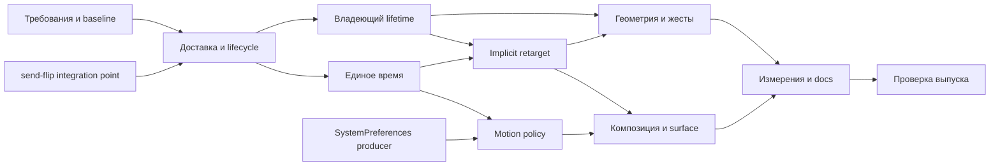

# Animation: план до production ready

- **Дата:** 2026-10-08.
- **Проверенная база:** `91bb1fe1d2a349f62915846303f6f25780ae5c6d`.
- **Статус:** аудит выполнен; план закрытия разрывов подготовлен; реализация следующих волн не начата.
- **Основание:** [аудит](readiness-audit.md), [прогоны](readiness-evidence.md),
  [матрица покрытия требований](readiness-matrix.md), восстановленные 12 тематических спек.
- **Сравнение:** [анимация у конкурентов](animation-competitors.md), включая проверку утверждений
  приложенного архитектурного обзора. Это источник acceptance-сценариев, не автоматическое
  расширение scope и не основание копировать интерфейсы.
- **Определение готовности:** реальные пользователи animation через widgets/runtime получают
  правильные кадры, отмену и освобождение; принятые требования имеют production consumer и
  действующий тест; native/GPU ограничения явно измерены или приняты владельцем.

## Проблема для пользователя

Зелёный обычный CI не запускает 32 красных контракта ядра. Виджет может потерять уведомление,
оставить контроллер живым после удаления, зависнуть при reentry или получить NaN. Улучшенная
математика retarget уже есть, но обычный implicit-виджет ей не пользуется. Системное предпочтение
меньшего движения не достигает анимации. Поэтому дальнейшие косметические улучшения кривых
не снимают главные риски выпуска.

## Подход и альтернативы

**Рекомендуется:** закрывать сквозные сценарии на согласованной owner-local модели send-flip,
переиспользуя уже реализованную математику. Владение и доставка создают основу; затем единое
время и retarget; затем policy и геометрия; в конце проверка всего пути и актуальные измерения.

| Подход | Выгода | Цена/причина выбора |
|---|---|---|
| Согласованные сквозные изменения с владельцами send-flip и platform | Один runtime-контракт, меньше ручных обязанностей у виджетов | Требует общих integration points; рекомендован |
| Продолжать чинить Arc/Mutex/atomic протоколы по одному | Быстрый локальный fix конкретного воспроизводимого дефекта | Повторная миграция и новые гонки; допустим только отдельный срочный fix, не финальная архитектура |
| Считать merged PR достаточными и обновить статусы | Минимальные изменения | Отвергнут: 32 воспроизведённых отказа и отсутствующие consumers |

Это предложение последовательности, а не одобрение новых интерфейсов или частичного send-flip.
Действующая спека send-flip запрещает отдельно вливать части core flip. Сначала её владелец
закрепляет integration point; при иной принятой архитектуре задачам ниже обновляют дизайн,
сохраняя поведенческие критерии и красные доказательства.

## Рабочие пакеты и зависимости

Пакет — область результата, а не обещание одного маленького коммита. Перед исполнением
разделять его на вертикальные PR с конкретным сценарием, production caller и тестом.
На каждый shared-файл один владелец; чужие worktree не редактировать.

| Пакет | Результат | Зависимость | Владелец/изменяемая область | Приёмка |
|---|---|---|---|---|
| A0 | Восстановленные требования, актуальный baseline и scope | — | docs/specs | Этот аудит + актуальная матрица; не потеряны старые owner decisions |
| A1 | Безопасная доставка и lifecycle контроллера | integration point send-flip T6c/T6b/T6a | animation controller/vsync/proxy/switch и общий notifier/scheduler owner | Красные status_delivery + controller_robustness проходят без ignore; первый failure, healthy tail, следующий кадр; Duration::MAX/NaN |
| A2 | Владеющий lifetime анимации у UI | A1, send-flip T4/T6c | animation builder/handle; animated/widgets, navigation, header, indicators/packages | Все 9 ownership rows; unmount из listener; смена Vsync/GlobalKey; один unregister; completion/cancellation при Drop |
| A3 | Единое типизированное время и playback | A1; совместно с A2 для anchors | motion, vsync, controller, scheduler, runtime, testing, devtools | Два окна с разной скоростью; пауза не держит кадры; step один кадр; adopt_vsync и multi-presentation совпадают; TIME_DILATION удалён |
| A4 | C⁰/C¹ retarget в implicit-виджетах | A1–A3, T4 | common implicit machinery + controller run/velocity | Отображаемая позиция и производная при target/curve/duration update; same target без restart; ранний reverse; .spring() consumer; старый путь удалён |
| A5 | Системная и app motion policy | A1–A3; merged SystemPreferences producer | platform owner → realm projection → animation/widgets | Первый кадр и live update; User/Always/Never; Preserve; конечный scale; completion ровно раз; два realm независимы |
| A6 | Согласованная геометрия paint/hit/semantics и жест→settle | A1/A2; motion часть A4 | objects/rendering + Drawer/Dismissible | Loose/tight/RTL/vertical, resize/cancel; экранная скорость; semantics bounds; hit coordinate snapshot; GPU readback и build count |
| A7 | Замкнуть composition и public surface | A2/A4/A5 | animation/macros/sdk/packages | Каждый сохраняемый pub имеет caller или явное принятое решение; cubic-track consumer; derive nested; indicators Preserve; delete/migrate старые экспорты |
| A8 | Измерение готового пути и актуальные docs | A1–A7 | benches, perf scenarios, README/GUIDE/PATTERNS/PERFORMANCE | Same-host baseline vs final, active/idle N, allocation bound, актуальные примеры и усиленные lints |
| A9 | Выпускная проверка | A8 | whole consumer graph + CI/native owners | Ниже приведённый release checklist, SHA и evidence на каждую строку |

## Первые исполнимые срезы

1. **A1: status fan-out.** Начать с `status_listener_panic_finishes_the_round` и
   `reentrant_status_keeps_commit_order`; затем конкурирующая паника, remove/dispose,
   sibling/child Vsync и следующий кадр. Не менять ожидания для получения зелёного результата.
2. **A1: lifecycle.** `disposed_set_value_is_refused`, late listeners, is_animating и bounds;
   отказ до мутации, выбытие captures вне guard, единый observable outcome.
3. **A2: ownership на одном реальном caller.** Общий implicit helper как первый consumer,
   unmount/migrate и last-owner cancellation. После подтверждения мигрировать indicators,
   navigation, scroll/header и packages в рамках общего контракта.
4. **A3: один clock через все adapters.** Runtime, обычный headless, adopted Vsync и дополнительная
   presentation должны получать тот же FrameTick-контракт. Затем devtools rate/pause/step
   и per-animation pause у существующего Snackbar-потребителя из motion-clock спеки.

Подготовка контрактов/документации и воспроизведение могут идти до core flip. Не создавать
вторую временную архитектуру, чтобы обойти зависимость. Срочный локальный fix требует
согласования владения файлами, но его тест остаётся полезным и после смены хранилища.

## Naming и правильная доставка — обязательны в каждом срезе

Уточнение владельца от 2026-10-08: naming и правильная доставка входят в готовность,
а не откладываются на косметическую чистку A8. Метод проверки терминов — Matt
`domain-modeling`: имя сверяется с фактическим контрактом и понятиями владельца подсистемы.
Это критерии ревью; конкретные новые имена типов здесь не утверждаются.

**Naming:**

- Различать описание анимации, один активный запуск, его владельца, регистрацию и подписку.
  По имени и типу caller должен понимать, что он держит и что происходит при освобождении.
- Directional status не означает активный run или достижение endpoint. Не обещать этого
  именем, документацией или predicate; activity, outcome и position проверяются отдельно.
- Clock, timestamp, elapsed time и duration не взаимозаменяемы. Область времени и единица
  должны быть выражены типом/контрактом, без скрытого global time и неоднозначных `now`.
- Не смешивать commit состояния, notification delivery, frame request и presentation.
  `scheduled`/`queued` не должны означать «доставлено» или «показано».
- Stop, cancel, finish, dispose и retirement должны иметь разные, явно описанные эффекты,
  если различаются outcome, доступность объекта или судьба listeners/captures.
- Использовать язык действующих ADR и владельцев слоёв. Не переносить имена Flutter
  автоматически и не вводить общие `Manager`/`Context`/`Handle` без определённой роли.
  Переименование завершено только после миграции callers, reexports, serde, docs и tests;
  один rename без изменения обязанностей не считается архитектурным улучшением.

**Доставка — сквозной контракт A1–A6:**

| Сценарий | Наблюдаемая приёмка |
|---|---|
| Commit → notification | Callback видит уже принятый переход; устаревший результат user code не перезаписывает более новый run |
| Reentrant mutation | Принятые переходы приходят в определённом FIFO-порядке, без recursive reorder; value/status/outcome не противоречат друг другу |
| Remove/dispose/unmount во время раздачи | Снятый listener не вызывается позже в том же раунде; новые подписки следуют явно выбранной политике раунда; teardown не вызывает user code под guard |
| Panic и competing failures | Здоровый хвост раунда/кадра исполняется, первая ошибка остаётся авторитетной, retirement следует failure-custody policy; следующая операция работает |
| Subscribe и catch-up | Между чтением состояния и установкой подписки нет потери последнего изменения; старый catch-up не затмевает новую доставку |
| Failed/missing/replaced frame hook | Принятое состояние и долг доставки различимы; неуспешная отправка не очищает долг, повтор того же значения допускает retry |
| A → B → A при незавершённой доставке | Равенство с прежним значением не теряет обязательный последний кадр/notification |
| Completion/cancellation | Каждый run получает ровно один outcome согласно контракту; замена, zero-duration, Drop и dispose не создают дубль или потерю |
| Изоляция presentation/owner | Событие адресуется живому владельцу; смена Vsync/realm и stale registration не доставляют его чужому объекту |

Не все каналы обязаны сохранять каждый промежуточный value sample: coalescing разрешён
только там, где это явно допускает контракт. Нельзя переносить такую политику на status,
completion/cancellation или стирать невыполненный delivery debt. Гарантию «ровно один раз»
не следует объявлять глобальной для всех callbacks вместо определения каждого канала.

Каждый затронутый путь получает публичный сценарий и red→green доказательство. Проверять
не только получателя, но и healthy tail, освобождение captures и следующий кадр. Runtime
preferences → motion policy и animation → render invalidation включены в эту проверку наряду
с listener registry; исправление одного notifier не закрывает всю доставку.

## Нужные тестовые швы

| Шов, которым пользуется caller | Что проверять | Существующая опора |
|---|---|---|
| Public controller/registry/lifetime | Уведомления, future, отмена, Drop, reentry, dt | `animation_it` и child-process harness |
| HeadlessBinding + mounted widget | Реальное значение/paint, отсутствие rebuild, смена ambient-clock | implicit/transitions/indicator tests, `last_frame_report().build` |
| Presentation frame + system preferences | Policy до окна/первого кадра, смена во время run | runtime frame tests и итоговый producer PR1515 |
| Rendering owner traversal | Один transform для paint/hit/coordinate/semantics | render_object_harness, semantic tree assertions |
| Engine readback | Retained layer действительно перемещает пиксели | существующий GPU harness; точки различают before/after |

Private math tests остаются дополнением. Новый внутренний helper, протестированный без
production caller, не закрывает пользовательское требование. Красный прогон/откат проводится
в изолированном checkout, без конкурентной сборки тех же исходников.

## Scope и решения, которые нельзя потерять

Из [historical-orchestration.md](historical-orchestration.md) сохранены owner decisions
2026-10-06: FLIP сверх Hero, full WAAPI, platform spline decay, OkLCh, discrete opt-in,
preferred frame rate и отдельный cross-fade-флаг вынесены. Additive и phase animator
вынесены **условно**, при доказанном покрытии retarget и keyframes соответственно.
CompoundAnimation предписано удалить, а не оставить без тестов. Builder сохраняется.

Нужно закрыть несогласованности до реализации затронутого пакета:

- M-TIME-12: историческая матрица требует отрицательные rate, более подробный R4 motion-clock
  их отвергает. План следует конечному rate ≥ 0 и явному reverse; обновление матрицы требует
  зафиксировать происхождение уточнения. Не добавлять отрицательный rate по старой строке.
- M-CRV-6: Steps без before flag соответствует принятому отказу от полной WAAPI timing model.
- M-CRV-7/10: piecewise linear и sampled spring curve не найдено; найти позднейшее scope-решение
  либо вынести отдельное решение с потребителем и альтернативами. Самостоятельно закрывать нельзя.
- M-INTP-3: «без 8-битной ступени» не совпадает с текущим u8 Color. Предложение: отдельно оценить
  float paint interpolation и consumer path; не расширять public Color автоматически.
- M-INTP-9: порог покоя на тип проверить отдельно от существующего DPR tolerance скролла.
- Исторические номера ADR 0143–0150 не резервировать заново: сверить реестр; сохранить действующие
  ADR-0149 и ADR-0155, новые номера брать из свободных на момент PR.

Эти пункты оформлены как открытые решения, а не скрытое сокращение scope. Остальные задачи
не обязаны ждать решения о precision цвета или sampled easing.

## Release checklist

- [ ] Naming соответствует реальным ролям, областям времени, состояниям и outcomes; нет
      ложных обещаний в именах и оставшихся callers старого контракта.
- [ ] Матрица доставки выше пройдена для затронутых каналов; FIFO/coalescing, subscribe/catch-up,
      retry debt и failure custody описаны и проверены, включая следующий кадр.
- [ ] 32 исторических красных контракта исполнены и зелёные; соответствующие ignore удалены.
- [ ] Все 110 исходных market-ID имеют актуальный consumer/test/evidence либо принятое scope-решение;
      условные исключения имеют доказательство выполнения условия.
- [ ] A1–A7 проверены через пользовательские швы; future/cancellation, reentry, competing failures,
      unmount, mutation during build и следующий кадр учтены.
- [ ] `cargo xtask check-changed --base <фиксированный-base>` зелёный для implementation PR;
      package/facade, serde, doctests и SDK surface мигрированы.
- [ ] Финальная интеграция прошла требуемые workspace/wasm/cross-typecheck CI на конечном SHA.
- [ ] Windows native и GPU readback имеют датированные прогоны; другие native-пути обозначены
      как выполненные, только compiled или unavailable, без расширения результатов Linux CI.
- [ ] Performance и allocations измерены на одинаковом хосте/профиле; workloads и исходные результаты
      воспроизводимы, параметры не берутся из старых scratch-прототипов.
- [ ] Документация не обещает behavior, которого нет; нужные cross-crate ADR приняты; нового
      unwired public surface нет; deprecated path и старые handoff-заметки убраны после миграции.

## Handoff для следующей сессии

Прочитать этот план, audit/evidence и спецификацию своего пакета. Получить fresh `origin/main`,
зафиксировать новый SHA, проверить merged state PR1515 и send-flip. Повторить узкий красный
сценарий на новом SHA: он мог быть исправлен другим владельцем. На каждый срез записать
требование → production consumer → red → change → green → regression proof → SHA/PR.
Не возобновлять старые агентские ветки или их назначения только по историческим отчётам.

Новых архитектурных решений и реализации в этом проходе не принято: результат — восстановленная
база требований, проверенный аудит и reviewable план. Начинать реализацию следует с A1 на
согласованной ветке владельца core, а не с массовой переписи всего animation.
