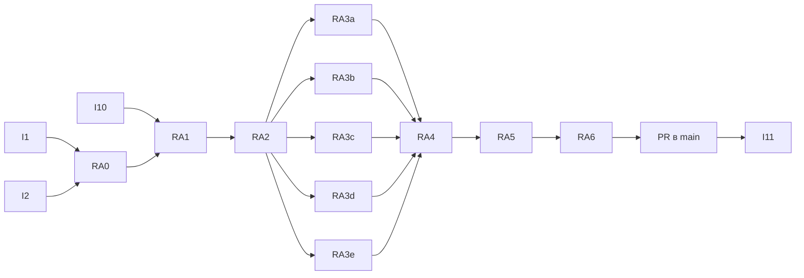

# Распознаватели жестов: API — задачи

- **Статус:** дизайн утверждён; RA0–RA5 интегрированы локально, RA6 ownership-измерения сохранены; итоговый gate и проверка текущей owned-wire базы впереди
- **Дата:** 2026-10-06
- **Design:** [design.md](design.md); требования — [requirements.md](requirements.md); волна —
  [../tasks.md](../tasks.md) «Спека `recognizer-api/`»
- **Старт:** после слияния I1 (`interaction/arena-recognizer-lifecycle`) и I2
  (`interaction/multi-pointer-recognizers`) в `main`, включая поправки C1/C2 (`recognizers/callback_containment.rs`).
  RA1 — после I10. I11 — после RA (меняет поле настроек на `Cell`).
- **Сверка 2026-10-07:** I1/I2 и C1/C2 уже merged (PR #1474, #1472,
  #1494, #1500). RA0 подготовлена в интеграционной ветке; I10 реализована локально,
  lifecycle/property проверки зелёные, итоговый gate и PR ещё впереди. RA1 начата
  после публичных красных тестов слабого владения и дедлайнов. Слабое владение,
  обновление `Weak` перед каждым уведомлением и изоляция запросов дедлайна проверены
  runtime-прогоном `62f61d8c-4f84-4097-9dd3-82532f9bb86a`; единственный красный
  тест этого прогона относится к вложенному закрытию фокуса. Удержание текущего
  последнего владельца уведомления доказано откатом `retain` в прогоне
  `1d9c331f-b05d-4732-bdff-996310af987c` (освобождение 1 вместо 0), затем хунк восстановлен.
  RA2/RA3 и механическая граница вызовов интегрируются атомарно без совместимого
  второго трейта. Новые публичные строки до появления API хранятся невключёнными;
  отсутствие API не считается доказательством поведения.
  Перед baseline RA0 исправляет повторное использование permanently-disposed
  распознавателя в `tap_detector_bench`: иначе после первой итерации измеряется
  отказ допуска вместо жеста.
- **Порядок compiler-проверок:** на базе RA0 существует только
  `recognizer_stays_on_its_thread`. Builder и `RecognizerSet` появляются в RA2,
  поэтому их фикстуры добавляются в RA0, но включаются в harness после появления
  типов. E0432/E0599 от отсутствующего API не считается доказательством `!Send`;
  после RA2 обе фикстуры должны отказать с E0277 на передаче значения в поток.
- **Baseline:** исправленный tap-бенч проверяет реальные контакты и три callback
  вместо повторного использования disposed-объекта. `static` tap и arena baseline
  сохранены на том же хосте/toolchain для сравнения в RA6. `recognizer_stays_on_its_thread`
  выдаёт E0277; dyn-compatible fixture пока выдаёт ожидаемый E0038. Direct arena-member
  fixture включена для проверки снятия маркера. Ни один ожидаемо красный compiler-контракт
  не объявляется готовой реализацией API.
- **Итог:** 11 задач (RA3 — пять `[P]`), ≈ 15 инженеро-дней; критический путь RA0 → RA1 → RA2 → RA3 (самая
  длинная, 1,5) → RA4 → RA5 → RA6 ≈ 10 рабочих дней.

## Правила исполнения

Сверка реализации 2026-10-07 на базе `3cf7329c6`: builder до `Rc`, dyn-compatible
extension points, weak arena members, `RecognizerSet` и production-вызовы через
`Listener` интегрированы. Ложные sealed/legacy extension слои удалены; lasting
решение — ADR-0161. `trybuild_ui` проверяет три `!Send` отказа E0277 и два успешных
extension-контракта. Ранее выполненные ownership-измерения RA6 опубликованы в
`crates/flui-interaction/docs/PERFORMANCE.md`: они предшествуют owned-wire миграции;
изолированный strong-resolution baseline отсутствует и не заменяется eager-conflict
измерением. Итоговые `check-changed`, facade/optional-feature и platform gates
после всех изменений не объявляются пройденными. I11/LY8 здесь не закрываются.

- Интеграционная ветка `interaction/recognizer-api` (worktree `cargo xtask worktree new
  interaction/recognizer-api`), один PR в `main`. Подзадачи — ветки от неё, PR в неё; слияние squash.
  Причина: смена типов распознавателей ломает flui-widgets до RA4, промежуточный `main` был бы красным.
- Подветки RA1–RA3 гейтятся `cargo nextest run -p flui-interaction` (зависимые крейты в них не собираются,
  это ожидаемо и пишется в PR); RA4 и итоговый PR — `cargo xtask check-changed` зелёный.
- **Тесты первыми.** Первый коммит каждой задачи — её строки, красные по assert; строка, которой нужен ещё
  не существующий API, коммитится вместе с ним, а её краснота показывается откатом production-хунка.
  Красноту «не компилируется» показывает только trybuild-фикстура (иначе ломается весь бинарь `interaction_it`).
  Вывод — в PR. «Красный без» ниже — то, что строка обязана показать при откате
  production-хунка в изолированном checkout (не в worktree, где идёт сборка).
- Один владелец общих файлов: `crates/flui-interaction/src/lib.rs`, `tests/main.rs`, `Cargo.toml` крейта,
  facade `src/interaction.rs` — RA0 и RA5; остальные задачи их не трогают.
- Сборки — одна на хост; `CARGO_BUILD_JOBS=6`, `NEXTEST_TEST_THREADS=4`.
- ID задач и требований — только в этом каталоге.

## Граф



## Задачи

| ID | Задача | Требования | Файлы (разрешённые) | Зависит | [P] | Красный без | Дни |
|---|---|---|---|---|---|---|---|
| RA0 | Контракт, который компилируется на базе: trybuild-цель `tests/compile_fail.rs` (тест `trybuild_ui`): `compile_fail` — 3 фикстуры `!Send`, `pass` — `tests/compile_pass/dyn_compatible_extension_points.rs` (`&dyn GestureRecognizer`, `&dyn GestureArenaMember`, `&dyn MultiDragHandle`, сторонний impl через facade-путь крейта); dev-зависимость `trybuild` (`workspace = true`, `Cargo.toml:453`); группа в `.config/nextest.toml:59`; пустые модули `tests/recognizer_api.rs`, `tests/recognizer_lifecycle.rs` в `tests/main.rs` (строки добавляет задача, которая их чинит); бенч-строки `static` и baseline на базе I1+I2 | R2, R3, R13 | `crates/flui-interaction/{Cargo.toml, tests/main.rs, tests/recognizer_api.rs, tests/recognizer_lifecycle.rs, tests/compile_fail.rs, tests/compile_fail/*.rs, tests/compile_pass/*.rs, benches/{tap_detector,gesture_arena}_bench.rs}`, `.config/nextest.toml` | I1, I2 | — | pass-фикстура `dyn_compatible_extension_points` красная на базе (E0038, вывод в PR) и зеленеет в RA2. trybuild-фикстуры `!Send` дают E0277 уже на базе (колбэки — `Rc`): они закрепляют свойство, а не чинят его, и PR говорит это прямо; красными они станут, если кто-то вернёт `Arc` и `Send`-колбэки. Baseline бенча сохранён | 1 |
| RA1 | Арена: `GestureArenaMember` без `Sealed`, `deadline()` + `poll_deadline(now)`; `has_pending_deadlines`/`next_deadline`/`poll_deadlines` через них со сдерживанием по участнику; участники `Rc<dyn>`, слоты/`eager_winner`/`DeadlinePoll` — `Weak`, мёртвый = `reject`, отложенное решение при выходе; `add<M>(&Rc<M>)`; team и signal resolver — механически `Rc` | R7, R10, F10, F13 | `crates/flui-interaction/src/arena/**` | RA0, I10 | — | `dropped_member_without_cancel_leaves_the_arena`: с сильным слотом сброс отдаёт победу уроненному; `custom_member_owns_a_deadline`: blanket теряет дедлайн (не опрашивается); `panicking_deadline_query_does_not_hide_other_deadlines`: без сдерживания второй дедлайн не возвращается | 2 |
| RA2 | Ядро распознавателя: трейт `GestureRecognizer` (D5), `CancelOutcome`, `cancel_all`, `ArenaMembership`, `PrimaryContact`, `ContactId`, `BeginContactError`, `RecognizerSet`; макрос `retire_callbacks!`; удаление `one_sequence.rs`, `primary_pointer.rs`, `RecognizerBase` | R3, R5, R6, R9, F4, F6, F14 | `crates/flui-interaction/src/recognizers/{recognizer.rs, mod.rs, one_sequence.rs, primary_pointer.rs, contact.rs (новый), set.rs (новый), callback_containment.rs}` | RA1 | — | `second_pointer_does_not_replace_the_primary_contact` (перезапись в `start_tracking`); `cancel_all_cancels_every_recognizer_before_resuming_the_first_panic` (без capture второй не отменён); `two_recognizers_panicking_on_one_pointer_keep_the_first_payload` (без capture второй attachment не получил событие); `listener_admits_by_predicate_and_forwards_terminal_events` на уровне набора (гейт на `Up` → распознаватель не завершил) | 2 |
| RA3a | Tap, DoubleTap: builder, `Rc::new_cyclic`, `PrimaryContact`, `TapArenaMember` сильно у tap (I6), `deadline()` у double tap, `Drop`-ретайр, `cancel`, строки F1–F12 | R1, R5, R8, F1–F3, F5, F11, F12 | `src/recognizers/{tap,double_tap}.rs` + их in-`src` тесты | RA2 | [P] | `next_gesture_after_a_callback_panic` (double tap, D1 — если I1 не закрыл; иначе — строка остаётся регрессионной, отмечается в PR); `double_tap_reports_the_device_kind_of_the_down` (без `add_pointer(dispatch)` вид = `Touch`); `dropping_a_recognizer_retires_each_capture_and_resumes_the_first_failure` (D3: drop под `borrow_mut`) | 1,5 |
| RA3b | LongPress, MultiTap: то же; дедлайн long press через `PrimaryContact::arm_deadline` и `deadline()`; `check_timer`/`check_timeout` — подключить к `poll_deadline` или удалить | R1, R7, F3, F5, F7, A9 | `src/recognizers/{long_press,multi_tap}.rs` | RA2 | [P] | `next_gesture_after_a_callback_panic` (multi-tap, D2); `huge_timeout_arms_no_deadline` (без `checked_add` — паника `Instant + Duration`) | 1,5 |
| RA3c | Drag (+ `drag_variants`), MultiDrag: builder (`DragAxis`/`MultiDragAxis` — аргументы `builder`), `MultiDragStartCallback -> Option<Rc<dyn MultiDragHandle>>`, `MultiDragHandle` без `: 'static` | R1, F1, F2, F5 | `src/recognizers/{drag,drag_variants,multidrag}.rs` | RA2 | [P] | `cancel_from_a_callback_drops_the_stale_notices` (без `is_current` — `on_end` после `on_cancel`); строки drag в `tests/interaction_lane.rs:859-944` остаются зелёными | 1,5 |
| RA3d | Scale, ForcePress: builder, `ArenaMembership::join` на каждый указатель, `Drop`-ретайр, `cancel` | R1, F4, F5, F11 | `src/recognizers/{scale,force_press}.rs` | RA2 | [P] | NaN-строки (I2) зелёные через новый путь; `dropping_a_recognizer_retires…` для scale | 1 |
| RA3e | TapAndDrag, Eager: то же; удалить `settings()`/`set_settings()` eager (C2-L) | R1, F5 | `src/recognizers/{tap_and_drag,eager}.rs` | RA2 | [P] | `dropping_a_recognizer_retires…` для tap-and-drag | 1 |
| RA4 | Вызывающие: `Listener::recognizer[_when]`; `GestureDetector`, `BackGestureDetector`, `Draggable` по design §7; тесты flui-widgets; flui-runtime и flui-testing тесты; facade fixture | R4, R6, R6a, F1, F6, F8, R12 | `crates/flui-widgets/src/interaction/{listener,gesture_detector,draggable}.rs`, `crates/flui-widgets/src/navigator/back_gesture.rs`, `crates/flui-widgets/tests/**` (модули существующего `main.rs`), `crates/flui-runtime/src/ui_realm/tests/{pump_transaction.rs, closing_one_presentation_is_invisible_to_siblings.rs}`, `crates/flui-testing/{src/lib.rs, tests/pointer_script_replay.rs, tests/owner_scope.rs}`, `tests/fixtures/facade_extensions.rs` | RA3a–e | — | `clearing_pan_callbacks_mid_drag_still_finishes_the_drag` (сегодняшний гейт `forward`, `gesture_detector.rs:1139`); `unmount_mid_drag_cancels_once_and_hands_the_arena_to_the_rival`; `callback_that_unmounts_its_detector_finishes_the_event`; `custom_recognizer_competes_through_a_listener` (без `Listener::recognizer` не пишется — E0599) | 2 |
| RA5 | Удаление и поверхность: `sealed::{gesture_recognizer, arena_member}`, `CustomGestureRecognizer`, `traits::{GestureCallback, BoxedCallback, GestureRecognizerExt, Disposable}`; реэкспорты `lib.rs`, facade `src/interaction.rs`; пример `examples/custom_recognizer.rs` (сторонний распознаватель через `RecognizerSet`); `README.md`, `docs/{GESTURES,ARCHITECTURE}.md` (доктесты вместо `ignore`); ADR (design §10) + `Superseded-by` в ADR-0086 §4; `changelog.d/recognizer-api.md`; патч `binding.rs:1673,1686` владельцу T6d | R12, D10 | `crates/flui-interaction/src/{sealed,traits,lib}.rs`, `crates/flui-interaction/{examples/custom_recognizer.rs, README.md, docs/GESTURES.md, docs/ARCHITECTURE.md}`, `src/interaction.rs`, `docs/adr/ADR-NNNN-*.md`, `docs/adr/ADR-0086-*.md`, `changelog.d/recognizer-api.md` | RA4 | — | `rg 'CustomGestureRecognizer|GestureRecognizerExt|Disposable|OneSequenceGestureRecognizer|PrimaryPointerGestureRecognizer|RecognizerBase|with_on_|add_pointer_with_kind|add_pointer_down' --type rust` пуст (кроме `docs/plans`); `cargo test --doc -p flui-interaction`; `cargo xtask docs-paths`, `cargo xtask changelog --check` | 1 |
| RA6 | Бенч после + отчёт: `tap_detector_bench` (`handle_event/static` vs `/dyn`), `gesture_arena_bench` (`resolve/strong` vs `/weak`) против baseline RA0, один хост; таблица в PR и в `crates/flui-interaction/docs/PERFORMANCE.md` (S4 владеет файлом — строка через него, если S4 открыт) | R13 | `crates/flui-interaction/benches/**`, `crates/flui-interaction/docs/PERFORMANCE.md` (по согласованию с S4) | RA5 | — | регрессия > 10 % на строку → объяснение или `SmallVec` (design риск 4) | 0,5 |

Итоговый PR интеграционной ветки: `cargo xtask check-changed`; `cargo nextest run -p flui -E 'group(trybuild) |
group(nested-cargo)'` (facade fixture); `cargo nextest run -p flui-interaction --test compile_fail`;
`cargo xtask cross-typecheck` (типы не платформенные, но `flui-widgets` собирается на всех целях);
`cargo xtask wasm-check`.

## Бенч: как снимать

```text
# на базе (main после I1+I2), один раз, RA0
CARGO_BUILD_JOBS=6 cargo bench -p flui-interaction --bench tap_detector_bench -- --save-baseline before
CARGO_BUILD_JOBS=6 cargo bench -p flui-interaction --bench gesture_arena_bench -- --save-baseline before
# на интеграционной ветке, RA6, тот же хост, тот же toolchain
cargo bench -p flui-interaction --bench tap_detector_bench -- --baseline before
cargo bench -p flui-interaction --bench gesture_arena_bench -- --baseline before
```

Строки «до» для `/dyn` и `/weak` на базе отсутствуют по смыслу (сегодня `dyn GestureRecognizer`
невозможен, участник — сильный `Arc<dyn>`): сравниваются `static` до/после (цена `Rc` вместо `Arc` и
`Cell` вместо атомиков), `/dyn` против `static` после (цена набора) и `resolve/weak` после против
`resolve/strong` до.

## Координация

- **send-flip T6e** (`crates/flui-widgets/**`): RA4 ребейзится на ядро send-flip или наоборот; у send-flip в
  `gesture_detector.rs` одна строка (`:711`).
- **T6d:** `binding.rs` тесты (патч), удаление hit-test-трейтов и `sealed.rs` (design §12).
- **I10** до RA1; **I11** после итогового PR (поле `Cell<GestureSettings>`, `set_settings` из
  `did_change_dependencies`, `GestureSettings: Copy`).
- **S1/S2/S3:** RA5 закрывает в них пункты про ложную запечатку, неподключённый `pub` распознавателей и
  `GESTURES.md`; S-задачи их не дублируют.
