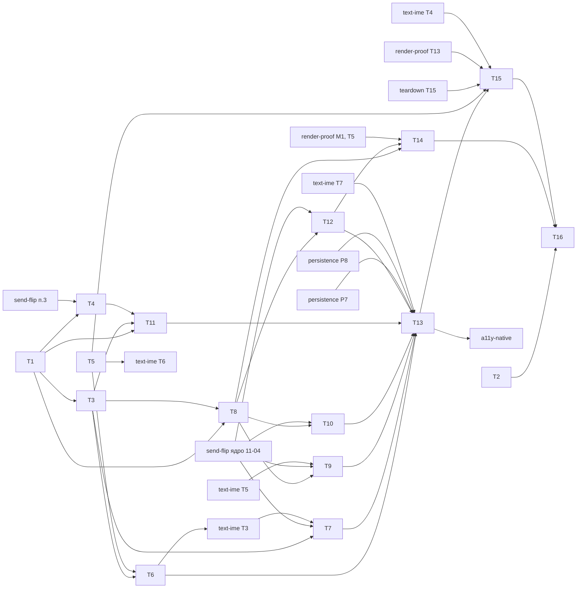

# Фокус и клавиатура в Notes — задачи (уровень 1)

- **Статус:** черновик
- **Дата:** 2026-10-05
- **Design:** [design.md](design.md) («Работы» 1–13); требования — [requirements.md](requirements.md);
  уровень 0 — [../release/requirements.md](../release/requirements.md) R8, R16, [../release/tasks.md](../release/tasks.md)
- **База:** `main` @ `4915054c8`
- **Итог:** 16 задач, 10 из них `[P]`; ≈ 35 инженеро-дней; критический путь 19 д работы,
  по календарю 10-12 → 11-19 (ожидания send-flip, text-ime, teardown)

## Правила исполнения

- Задача = worktree (`cargo xtask worktree new focus/<slug>`) = PR; `cargo xtask check-changed` зелёный
  до ревью. Каждый PR с видимым потребителю изменением добавляет свой `changelog.d/<branch-slug>.md`.
- **Контракт.** T1 вносит типы и сигнатуры с инертными честными телами (`todo!`/`unimplemented!`
  запрещены clippy) и тесты, падающие **по assert**; PR прикладывает красный вывод
  `--run-ignored only`; тесты сливаются под `#[ignore = "contract: <поведение>"]`. Исполнитель снимает
  `ignore`, переносит тест строкой в таблицу семейства (`run_cases`) — это его доказательство.
- **Fix-тест** падает с откатанной production-правкой: изолированный worktree, вывод в PR.
- ID требований и задач — только в этом файле: не в идентификаторах, именах тестов, причинах
  `ignore` и коммитах.
- **Где:** L — Linux remote (CI исполняет); W — Windows host (Win32 в CI только clippy: прогон
  `cargo nextest` на Windows, вывод в PR); N — нативный ручной прогон, датированный.
- **Поправка к design.** По итогам ревью send-flip не трогает `raw_button.rs` (в нём нет
  `Send`/`Arc`) и 33 Material-сеттера `on_*` (они уже принимают `EventCx`): работы 6 и 9 design
  от send-flip **не** зависят. Реальные пересечения — ниже, по файлам.

## Пересечения с send-flip (по списку файлов его design)

| Файл | Что делает send-flip | Задача здесь | Решение |
|---|---|---|---|
| `crates/flui-runtime/src/ui_realm/frame.rs` | 6a: планировщик owner-local, `frame*.rs` | T7 (шаг разрешения в кадре) | после слияния ядра (цель 11-04) |
| `crates/flui-widgets/src/navigator/{modal_route,navigator,page_route}.rs` | п. 3 (`modal_route.rs`, на `main`); 6c/6e: `Arc<ProxyAnimation>`, `add_listener(Arc::new…)` (`modal_route.rs:143-162`, `:355`) | T10 | после ядра |
| `packages/flui-material/src/ink_well.rs` | 6e/рецепт 4: `add_listener(Arc::new…)` (`:318`, `:357`), status listener с `Send + Sync`-захватами (`:527-540`) | T12 | после ядра |
| `crates/flui-widgets/src/text/editable_text.rs` | рецепт 1: `add_listener(Arc::new…)` (`:1334`, `:1523`) | T9 | после ядра и text-ime T5 |
| `crates/flui-view/src/owner/**` | п. 3 (`main`, [P]): `owner/**` целиком | T1 (одна сигнатура), T4 | T4 после слияния п. 3 |

Не пересекаются (проверено `rg 'Send|Arc<'`): `routing/focus{,_scope}.rs` (слушатели уже `Rc`),
`interaction/{raw_button,shortcuts,focus,actions}.rs`, `scroll/{list_view,sliver_list}.rs`,
`flui-objects/src/sliver/{sliver_list,sliver_fixed_extent_list,virtualized_band}.rs`, `theme_data.rs`,
`ui_realm/input.rs` (только `Box<dyn Any + Send>` панического payload, остаётся). T11 не трогает
`scrollable.rs` и `scroll_controller.rs` (их переписывает 6e).

## Граф зависимостей

Кросс-фичевые рёбра: **send-flip п. 3 → T4** (`owner/**`); **ядро send-flip → T7, T9, T10, T12**
(файлы выше); **text-ime T3 → T7** (`frame.rs`), **T6 → text-ime T3** (`input.rs`); **text-ime T5 →
T9** (`editable_text.rs`: blur/dispose); **T5 → text-ime T6** (Win32 `platform.rs`); **persistence
P7 → T13** (`tree.rs`), **P8 и text-ime T7 → T13** (`notes_flow.rs`); **render-proof M1, T5 → T14**
(`flui::testing::gpu`, `pixels`); **teardown T15, render-proof T13 → T15** (`windows_notes.rs`);
**text-ime T4 → T15** (`VK_PROCESSKEY` → `NamedKey::Process`, шаг IME-клавиши); **T13 → a11y-native**.

## Задачи

| ID | Задача | R | Файлы (единственные разрешённые) | Зависит | P | Где | Проверка | Готово, когда | Дн | Статус |
|---|---|---|---|---|---|---|---|---|---|---|
| T1 | Контракт (см. ниже) | сигнатуры всех R; тесты R3, R5, R6, R8, R9, R12, R13c, R14, R15, R17 | см. «T1» | — | — | L | `cargo nextest run -p flui-interaction -p flui-widgets -p flui-material -p flui-sdk --run-ignored only`; `cargo xtask check-changed`; `cargo xtask facade-combos` | 12 тестов красные по assert, сигнатуры = design, остальное зелёное, `rg 'todo!\|unimplemented!'` по диффу пуст | 3 | — |
| T2 | Четыре ADR из design, `Superseded-by` в ADR-0023, ADR-0026, ADR-0056, ADR-0079 | D3, D4, D5; решения (a)–(f) | `docs/adr/ADR-XXXX-*.md` ×4, четыре упомянутых ADR | — | [P] | L | `cargo xtask checks`; `cargo xtask workspace` (уникальность номеров) | номера назначены оркестратором, приняты владельцем до слияния T3 | 1 | — |
| T3 | `flui-interaction`: `Stale` для узлов виджетов, `NotificationInFlight` до мутации (`debug_assert` → `expect("BUG: …")`), `FocusCause`, модальность, реестр нажатий с подъёмом до единицы, `register_traversal_entry`/`EntryTarget`, маркер осиротевшего primary, `settle_orphaned_focus`; перенос теста порядка уведомлений из `src` в `tests/` | R12, R13a, R13c, R14, R15, R16, R17 (ядро) | `crates/flui-interaction/src/routing/{focus,focus_scope,mod}.rs`, новый `routing/key_ledger.rs`, `src/__runtime` (маркер виджета), `tests/{focus_retention,focus_keys}.rs`, `ARCHITECTURE.md` | T1 | [P] | L | `cargo nextest run -p flui-interaction`; `cargo xtask check-changed` | сняты `ignore` с `nested_replacement_publishes_no_stale_edge`, `key_repeats_follow_their_key_down`; обе падают с откатом; закрыт #1040 | 5 | — |
| T4 | `flui-view` + `flui-objects`: аренда `Pin`, `retain_band` не вытесняет, pinned-слот в `RenderSliverList` и `RenderSliverFixedExtentList` (мерка без `set_measured`, якорь и геометрия не меняются, paint/hit-test явно пропускают), шесть harness-строк, `## Mapping decisions` | R6 | `crates/flui-view/src/owner/keep_alive.rs`, `crates/flui-view/tests/` (существующий модуль keep-alive), `crates/flui-objects/src/sliver/{sliver_list,sliver_fixed_extent_list,virtualized_band}.rs`, `crates/flui-objects/tests/render_object_harness.rs`, `crates/flui-objects/ARCHITECTURE.md` | T1, send-flip п. 3 | [P] | L | `cargo test -p flui-objects --test render_object_harness`; `cargo nextest run -p flui-view -p flui-objects` | `harness_pinned_child_*` ×3 на оба sliver (одна строка с `Clip::None`) зелёные; без явного пропуска paint строка `Clip::None` падает; `RENDER_OBJECT_TYPES` не меняется | 4 | — |
| T5 | Win32: `WM_XBUTTONDOWN/UP` → pointer-событие `PointerButton::X1`, ответ `TRUE` без `DefWindowProc`; Win32-unit | R9 | `crates/flui-platform/src/platforms/windows/platform.rs` (только ветка `WM_*BUTTON*`, `:1539-1600`), Win32-unit в том же крейте | — | [P] | W | `cargo xtask cross-typecheck`; на Windows `cargo nextest run -p flui-platform`; ручной XButton1 в Notes | Win32-unit `x_button_is_a_pointer_event_and_suppresses_app_command` падает с откатом; лог прогона в PR | 1 | — |
| T6 | `flui-runtime`, ввод: `note_pointer_input` на pointer-down, X1 → синтетический `BrowserBack` со своим `KeyId`, `forget_pressed_keys` при деактивации окна | R9, R10, R17 | `crates/flui-runtime/src/ui_realm/input.rs`, `ui_realm/tests/addressed_input_routing.rs` | T3, T5 | [P] | L | `cargo nextest run -p flui-runtime -p flui-testing` | строки X1 и деактивации падают с откатом; слит до старта text-ime T3 (10-23) | 1 | — |
| T7 | `flui-runtime`, кадр: `settle_orphaned_focus` после fixpoint build/layout, не более одного повтора до paint | R15 | `crates/flui-runtime/src/ui_realm/frame.rs`, `ui_realm/tests/frame_pipeline_and_vsync.rs`, `crates/flui-widgets/tests/keyboard_focus/removal.rs`, `crates/flui-runtime/ARCHITECTURE.md` | T3, ядро send-flip, text-ime T3 | — | L | `cargo nextest run -p flui-runtime -p flui-widgets` | снят `ignore` с `focus_survives_rebuild_and_moves_on_removal` (+ строка Reload всех ключей: одно ребро, без `None`); падает с откатом | 1 | — |
| T8 | `flui-widgets/interaction`: `on_release`, `ActivationPressIntent`/`BackIntent`/`DismissIntent`, таблица `DefaultFocusTraversal` (Space down/up, Back, Escape, Cmd+[ на Apple), `FocusRing` + `DefaultFocusRingStyle`, `RawButton` (`Focus` + `Actions` + кольцо, фокусируем только с `on_press`), `Focus` (`Assistive`, пометка «узел виджета», возврат аттачмента при `Err`) | R3, R14, R16, R17 | `crates/flui-widgets/src/interaction/{shortcuts,actions,focus,raw_button,focus_ring}.rs`, `tests/raw_button.rs`, `tests/keyboard_focus/{activation,modality,requests}.rs` | T3 | [P] | L | `cargo nextest run -p flui-widgets`; `cargo xtask check-changed` | сняты `ignore` с `raw_button_activates_from_the_keyboard`, `keyboard_activation_matches_click`, `stale_focus_request_is_inert`, строк кольца в `focus_indicator_follows_input_modality`; каждая падает с откатом; `keyboard_continues_after_callback_panic` добавлен | 3,5 | — |
| T9 | `EditableText`: `DismissIntent`/`ActivationPressIntent`/`ActivateIntent` → поглощающий no-op, Alt+Arrow не поглощается вне Apple, пометка «узел виджета» в `dispose` | R3, R9, R14 | `crates/flui-widgets/src/text/editable_text.rs` (обработчик клавиш `:2011-2084`, карта действий, `dispose`), `tests/keyboard_focus/activation.rs` (строки поля) | T8, ядро send-flip, text-ime T5 | — | L | `cargo nextest run -p flui-widgets` | строки «Space-up в поле не активирует предка», «Escape в поле», «Alt+Left из поля» падают с откатом | 0,5 | — |
| T10 | `flui-widgets/navigator`: scope фокусируем только у текущего маршрута, начальный `TopChanged` фокус не берёт, первый фокус push предварителен, restore pop окончателен, `BackIntent` → `maybe_pop`, `DismissIntent` только модальный, doc `page_route.rs:32` | R1, R7, R8, R9, R11 | `crates/flui-widgets/src/navigator/{modal_route,navigator,page_route}.rs`, `tests/keyboard_focus/routes.rs` | T8, ядро send-flip | [P] | L | `cargo nextest run -p flui-widgets` | `first_tab_enters_the_current_route`, `push_moves_focus_into_the_new_route`, `keys_during_transition_reach_only_the_top_route` и снятые с `ignore` `pop_restores_the_opening_element`, `back_keys_pop_only_the_current_page` падают с откатом | 2 | — |
| T11 | `flui-widgets/scroll`: `ListView::focusable` (узел списка, `Role::List`, `semantics_label`, `empty_label`), маркер `ListItemFocus` (проброс ключа, `MergeSemantics` + `ListItem`, `pin`), `ListFocusState`, вход, стрелки, PageUp/Down, Home/End, раскрытие | R5, R6, R8, R13b | `crates/flui-widgets/src/scroll/{list_view,sliver_list,sliver_fixed_extent_list}.rs`, новый `scroll/list_focus.rs`, `tests/keyboard_focus/list.rs` | T1, T3, T4 | [P] | L | `cargo nextest run -p flui-widgets` | сняты `ignore` с `list_keyboard_navigation` (строки таблицы R5, удержание PageDown), `focused_row_is_pinned_while_scrolled_away`; падают с откатом; строки списка в `pop_restores_the_opening_element` готовы для T10 | 4,5 | — |
| T12 | `flui-material` + `flui-sdk`: `ThemeData::focus_ring`, `Theme` ставит `DefaultFocusRingStyle`, `InkWell` (`Focused` = видимый фокус, кольцо, `ActivationPressIntent` → `Pressed`), уровень `Focused` убран из рамп кнопок, ~25 потребителей; Checkbox/Switch/Radio — гало без кольца | R4, R17 | `packages/flui-material/src/{theme_data,theme,ink_well,elevated_button,outlined_button,floating_action_button,tabs,navigation_bar,checkbox,switch,radio}.rs`, `packages/flui-material/tests/{theme,ink_well}.rs` | T8, ядро send-flip | [P] | L | `cargo nextest run -p flui-material -p flui-sdk`; `cargo xtask facade-combos` | снят `ignore` с `theme_installs_the_focus_ring_style`; строка «клик не включает overlay» падает с откатом | 2 | — |
| T13 | Notes: `.focusable(true).semantics_label("Notes").empty_label("No notes")`, `ValueKey` строк, `TextFormField::autofocus(true)`; строки `notes_public_input_flow_matrix`, помощник `assert_a11y_focus_matches_primary` | R1, R2, R5, R7–R12, R13b, R15 | `examples/two_screens/tree.rs`, `tests/fixtures/notes_flow.rs` | T6, T7, T9–T12, persistence P7, P8, text-ime T7 | — | L | `cargo nextest run -p flui -E 'binary_id(flui::facade_consumer)'`; `cargo xtask check-changed` | `tab_order_covers_every_screen`, `held_enter_activates_once`, `window_reactivation_restores_focus` и Notes-строки R5, R7, R8, R11, R15 зелёные; R2, R5, R12 падают с откатом своих ханков | 2,5 | — |
| T14 | GPU readback `focus_indicator_is_painted`: точки на внешней и внутренней полосе и в центре (строка без отступов, кнопка заголовка) × «в фокусе / без фокуса / нажато», контраст по WCAG | R4 | `tests/gpu_readback/focus_indicator.rs` | T8, T12, render-proof M1 и T5 | [P] | W (GPU) | `FLUI_REQUIRE_GPU=1 cargo xtask gpu-test` на WARP и железе | точки различают три состояния; с overlay вместо кольца и с контрастом < 3:1 тест падает (два отката в PR) | 1 | — |
| T15 | Нативный тур: первый Tab, обход экранов (UIA `HasKeyboardFocus`), End/PageDown, удержание Enter на строке, правка `Title`, Enter на `Save note`, Alt+Left и XButton1 с проверкой фокуса, Alt+Tab туда и обратно, Retry | R18; нативные шаги R9, R10, R12 | новый `tools/xtask/src/device/notes_focus_tour.rs`, одна строка вызова в `windows_notes.rs`, `mod` в `device` | T5, T13, teardown T15, render-proof T13, text-ime T4 | — | N | `cargo xtask device windows-notes`; `cargo xtask cross-typecheck` | датированный прогон на SHA (лог в PR); отрицательный контроль на `4915054c8` падает на первом Tab | 2,5 | — |
| T16 | Закрытие: `crates/flui-widgets/ARCHITECTURE.md` (`:1906-1908`, фокус, список, кольцо), сверка «Требование → тест», #1040/#1092 закрыть, строки в `release/tasks.md` | R13a, D5 | `crates/flui-widgets/ARCHITECTURE.md` | T2, T14, T15 | — | L | `cargo xtask checks`; `rg 'contract:' crates packages tests` пуст | у каждого R тест с именем из таблицы; ADR приняты | 0,5 | — |

## T1 — контракт

**Элементы** (инертные тела в скобках). `flui-interaction` → `flui::interaction`:
`FocusRequestOutcome::Stale` + `#[non_exhaustive]` (не возвращается);
`FocusTreeError::NotificationInFlight { node }` (не возвращается); `FocusCause { Programmatic,
Traversal, Assistive }` `#[non_exhaustive]`; `FocusNode::request_focus_with` (= `request_focus`),
`has_visible_focus` (= наличие primary), `register_traversal_entry`/`TraversalEntry`/`EntryTarget
{ Node, Pending, Unit }` (регистрация хранится, обход её не читает); `FocusManager::note_pointer_input`,
`forget_pressed_keys`, `settle_orphaned_focus` (из design; no-op); `pub(crate)`-пометка «узел виджета»
через `__runtime` (no-op). `flui-view`: `KeepAliveHandle::pin` → инертная `KeepAliveLease`.
`flui-widgets` → `flui::widgets`: `SingleActivator::on_release` (флаг хранится, `matches` прежний),
`ActivationPressIntent`, `BackIntent`, `DismissIntent` (без обработчиков), `FocusRing { child,
style: Option<FocusRingStyle> }` + `new`/`style` (строит только ребёнка), `FocusRingStyle`,
`DefaultFocusRingStyle::{new, of}` (`of` → встроенный стиль), `ListView::{focusable, semantics_label,
empty_label}` (хранятся, не читаются). `flui-material`: `ThemeData::focus_ring` (из `ColorScheme`;
`Theme` его не ставит). Реэкспорты: `src/interaction.rs`, `crates/flui-sdk/src/lib.rs`, строки
`crates/flui-sdk/tests/surface.rs`.

**Тесты и как падают сейчас:** `stale_focus_request_is_inert` (`Queued` вместо `Stale`),
`nested_replacement_publishes_no_stale_edge` (`Ok` вместо `Err`), `key_repeats_follow_their_key_down`
(повтор доходит до нового primary), `focus_indicator_follows_input_modality` (видимый фокус после
клика), `keyboard_activation_matches_click` (Space активирует на key-down),
`raw_button_activates_from_the_keyboard` (`on_press` 0 раз), `back_keys_pop_only_the_current_page`
(Alt+Left не снимает страницу), `list_keyboard_navigation` (End: фокус не на строке 9999),
`focused_row_is_pinned_while_scrolled_away` (строка уничтожена), `pop_restores_the_opening_element`
(после смены корневого типа строки фокус на `Settings`), `focus_survives_rebuild_and_moves_on_removal`
(primary = `None`), `theme_installs_the_focus_ring_style` (`of` даёт встроенный стиль).

**Файлы:** `crates/flui-interaction/src/{lib.rs, routing/{focus,focus_scope,mod}.rs}`,
`crates/flui-interaction/tests/{main.rs, focus_retention.rs, focus_keys.rs}`;
`crates/flui-view/src/owner/keep_alive.rs`; `crates/flui-widgets/src/interaction/{shortcuts,actions,
focus_ring,mod}.rs`, `src/scroll/list_view.rs`, `tests/{main.rs, raw_button.rs, keyboard_focus/**}`
(`mod.rs` + `activation`, `modality`, `requests`, `routes`, `list`, `removal` — по файлу на задачу);
`packages/flui-material/src/theme_data.rs`, `tests/theme.rs`; `src/interaction.rs`;
`crates/flui-sdk/{src/lib.rs, tests/surface.rs}`; `changelog.d/<slug>.md`.

## Требование → тест

| R | Тест или прогон | Уровень | Задача | Вид |
|---|---|---|---|---|
| R1 | `first_tab_enters_the_current_route` (+ a11y: имя окна, «Settings, кнопка») | таблица + Notes | T10; T13 | fix |
| R2 | `tab_order_covers_every_screen` | Notes | T13 | fix |
| R3 | `keyboard_activation_matches_click` (+ строки поля); `raw_button_activates_from_the_keyboard` | таблица; `tests/raw_button.rs` | T1 → T8, T9 | fix |
| R4 | `focus_indicator_is_painted` | GPU | T14 | fix |
| R5 | `list_keyboard_navigation` (строки таблицы R5, удержание PageDown, предел построения, a11y позиция) | таблица + Notes | T1 → T11; T13 | fix |
| R6 | `focused_row_is_pinned_while_scrolled_away`; `harness_pinned_child_is_laid_out_outside_the_band`, `harness_pinned_child_leaves_sliver_geometry_unchanged`, `harness_pinned_child_is_skipped_by_paint_and_hit_test` | таблица; harness | T1 → T11; T4 | fix |
| R7 | `push_moves_focus_into_the_new_route` | таблица + Notes | T10; T13 | fix |
| R8 | `pop_restores_the_opening_element` (ключ при смене корневого типа, индекс, пустой список, поздний autofocus) | таблица + Notes | T1 → T10, T11; T13 | fix |
| R9 | `back_keys_pop_only_the_current_page` (+ модальный, XButton1, Alt+Left из поля, IME-клавиша); Win32-unit XButton | таблица + Notes; W | T1 → T10, T9, T6; T5; T13 | fix |
| R10 | `window_reactivation_restores_focus`; шаг Alt+Tab | Notes; N | T13; T15 | хар. |
| R11 | `keys_during_transition_reach_only_the_top_route` | таблица + Notes | T10; T13 | fix |
| R12 | `held_enter_activates_once`; `key_repeats_follow_their_key_down`; удержание Enter | Notes; ядро; N | T13; T1 → T3; T15 | fix |
| R13a | `reentrant_request_during_notification_is_applied_after_and_published_in_order` (из `src` в `tests/`) | ядро | T3 | хар. |
| R13b | `assert_a11y_focus_matches_primary` после каждого шага R2 и R5 | Notes, таблица | T13; T11 | fix |
| R13c | `nested_replacement_publishes_no_stale_edge` | ядро | T1 → T3 | fix |
| R14 | `stale_focus_request_is_inert` (узел виджета) | таблица | T1 → T3, T8 | fix |
| R15 | `focus_survives_rebuild_and_moves_on_removal` (+ Reload всех ключей) | таблица + Notes | T1 → T7; T13 | fix |
| R16 | `keyboard_continues_after_callback_panic` | таблица | T8 (слушатель — T3) | хар. |
| R17 | `focus_indicator_follows_input_modality` (клик, Tab, Assistive, сиротский Alt, Material overlay) | таблица | T1 → T3, T6, T8, T12 | fix |
| R18 | тур `cargo xtask device windows-notes` (+ XButton1, Retry) | N | T15 | fix |

## Владельцы общих файлов

| Файл | Владелец | Правило |
|---|---|---|
| `Cargo.lock`, корневой `Cargo.toml` | persistence P1 (по teardown) | новых зависимостей нет; понадобится — коммит владельца до задачи |
| `crates/flui-widgets/tests/main.rs` | T1 | одна строка `mod keyboard_focus;`; задачи правят только свой файл `keyboard_focus/*` |
| `crates/flui-interaction/tests/main.rs` | T1 | одна строка `mod focus_keys;`; text-ime T2b пишет в существующий `text_input_retirement.rs` |
| `packages/flui-material/tests/main.rs` | text-ime T5 | фокус пишет в существующие `theme.rs`, `ink_well.rs` |
| `crates/flui-sdk/tests/surface.rs`, `src/interaction.rs` | T1 | позже не меняются |
| `RENDER_OBJECT_TYPES`, `render_object_harness.rs` | T4 | новых типов нет, только `harness_*`-строки |
| `editable_text.rs` | text-ime | порядок: text-ime T2a (≤10-17) → T5 (10-23 – 11-04) → ядро send-flip → **T9** → text-ime T9 (11-20+) |
| Win32 `platform.rs` | teardown T3 / render-proof T2 (trace) | порядок: trace → teardown T5 → **T5** (10-15) → text-ime T6 (10-23); T5 — только ветка `WM_*BUTTON*` |
| `ui_realm/input.rs`, `ui_realm/frame.rs` | text-ime T3 | `input.rs`: **T6** (10-22) → text-ime T3; `frame.rs`: text-ime T3 → ядро send-flip → **T7** |
| `tests/fixtures/notes_flow.rs` | teardown T6 | порядок: teardown T6 → T16 → persistence P8 → text-ime T7 → **T13** |
| `examples/two_screens/` | persistence P7 | **T13** после P7; правки только `tree.rs` |
| `tools/xtask/src/device/windows_notes.rs` | teardown T15 | порядок: teardown T15 → render-proof T13 → **T15** (свой модуль + строка вызова) |
| `tests/gpu_readback/main.rs` | render-proof T1 | `mod focus_indicator;` вносит render-proof T1 заранее, иначе одна строка T14 после M1 |
| `docs/adr/ADR-XXXX-*`, ADR-0023/0026/0056/0079 | T2 | номера назначает оркестратор |
| `changelog.d/` | каждая задача | свой `<branch-slug>.md`: T1 (Added), T3, T8, T10, T11, T12 (Changed/Fixed) |

## Критический путь

T1 (3) → T3 (5) → T8 (3,5) → [ядро send-flip 11-04] → T10 (2) → [text-ime T7 11-10] → T13 (2,5) →
[teardown T15 ≈ 11-13] → T15 (2,5) → T16 (0,5) = **19 инженеро-дней**, по календарю **10-12 → 11-19**.
Без внешних ожиданий путь закончился бы ≈ 11-05. Исполнители: L1, L2 — Linux remote, W — Windows host.

| Даты | L1 | L2 | W |
|---|---|---|---|
| 10-12 – 10-14 | T1 | T2 (10-12), ревью T1 | — |
| 10-15 – 10-21 | T3 | T4 (если send-flip п. 3 слит) | T5 (10-15) |
| 10-22 – 10-28 | T8 (до 10-27) | T11 (до 10-28) | T6 (10-22) |
| 10-29 – 11-04 | запас, ревью | запас | — |
| 11-05 – 11-10 | T10 (до 11-06) | T7 (11-05), T9 (11-06) | T12 (до 11-06), T14 (11-09) |
| 11-11 – 11-13 | T13 | — | — |
| 11-16 – 11-19 | T16 | — | T15 (N) |

Риски: (1) ядро send-flip позже 11-04 сдвигает T7, T9, T10, T12 один к одному; если к 11-17 оно не
review-ready (D3 send-flip — переход в 0.3), эти задачи идут в `main` сразу: T13 ≈ 11-20 – 11-24,
T15 ≈ 11-25 – 11-27, до RC 12-01. (2) T4 ждёт send-flip п. 3; при опоздании T11 сдвигается, но запас
до 11-04 — 5 дней. (3) Win32 в CI только clippy: T5 и T15 — датированные прогоны на Windows.
