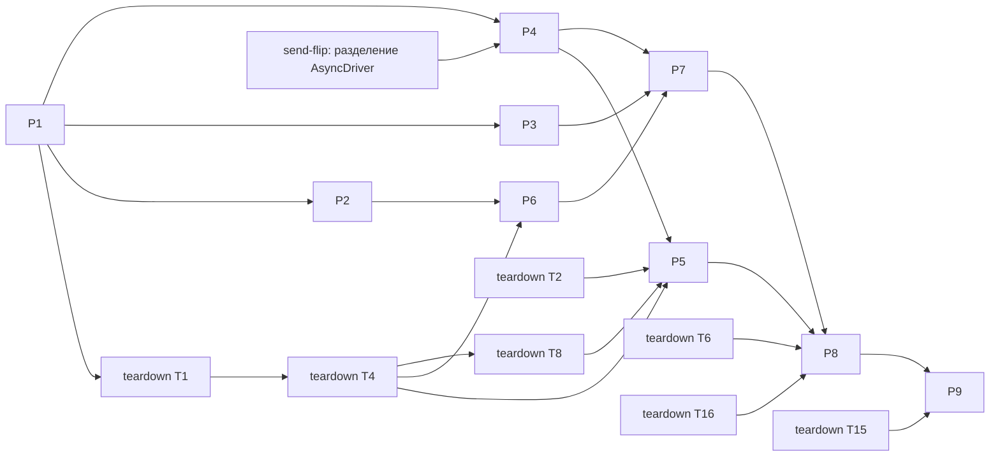

# Persistence — задачи

- **Статус:** черновик
- **Дата:** 2026-10-05
- **Design:** [design.md](design.md); требования — [requirements.md](requirements.md); контракт закрытия —
  [teardown/tasks.md](../teardown/tasks.md) (T1 владеет `CloseGuard`, `FlushRegistry`, защёлкой доставки)
- **База:** `main` @ `4915054c8`
- **Итог:** 9 задач, 5 из них `[P]`; ≈ 26 инженеро-дней; критический путь 27,5 д (20 д до headless-acceptance)

## Правила исполнения

Те же, что в [teardown/tasks.md](../teardown/tasks.md#правила-исполнения): задача = worktree
(`cargo xtask worktree new persistence/<slug>`) = PR, `cargo xtask check-changed` зелёный; контрактные тесты
P1 красные по assert и слиты под `#[ignore = "contract: …"]`, исполнитель снимает `ignore`; fix-тест падает с
откатом (изолированный checkout); имена без номеров задач и требований. P1, P5, P6 добавляют
`changelog.d/<branch-slug>.md`. Где: L — Linux CI; W — Windows нативно; C — consumer через `facade_consumer`
(группа `nested-cargo`, исполняется в L).

Отклонения от design, принятые здесь: реестр сброса — тип `flui-view` по teardown D-L2 (`publish(name, bytes,
base) -> Revision`, статус из `committed`/`outcome`), а не реализация `Storage` в `flui-app`; строка
`a_saving_document_holds_user_close_only` живёт в модуле `persist`, а не в `close_request_matrix`; семейство
`file_store_contract` — отдельный модуль `tests/file_store.rs`, чтобы не делить `tests/contract.rs` с teardown T5.

## Граф зависимостей

Кросс-фичевые блокеры: **send-flip → P4** (owner-local очередь `AsyncDriver`, `FutureBuilder` принимает
`!Send` future; временного `Arc<Mutex>`/`D: Send` нет); **teardown T4, T8 → P5** (состояние guard, реестр,
доставка закрытия, проводка в `RealmServices`, очередь дедлайнов для повтора `Busy`); **teardown T4 → P6**
(`FlushRegistry::new`); **teardown T6, T16 → P8** (порядок правок `notes_flow.rs`); **teardown T15 → P9**
(шаги persistence в `windows-notes`); **teardown T2 → P5** (ADR persistence слит). Обратные: P1 → teardown T1
(типы хранилища в сигнатурах реестра); P5 → teardown T15; P7 → teardown T16.

## Задачи

| ID | Задача | Требования | Зависит | P | Где | Дн | Статус |
|---|---|---|---|---|---|---|---|
| P1 | Контракт persistence (заморозка), манифесты, регистрации | сигнатуры; R35 | — | — | L | 3 | — |
| P2 | `FileStore` в `flui-platform` (фича `storage`) | R18, R19, R21, R22, R23, R32 | P1 | [P] | L, W | 4 | — |
| P3 | Router: `from_stack`, `stack` | R4 | P1 | [P] | L | 1 | — |
| P4 | `Persisted`: путь загрузки | R10, R17, R18, R25, R27, R30, R31, R33 | P1, send-flip | [P] | L | 3 | — |
| P5 | `Persisted`: запись и удержание закрытия | R12, R14–R17, R20, R22, R24, R28–R31, R36 | P4, teardown T2, T4, T8 | — | L | 4,5 | — |
| P6 | `flui-app`: хранилище хоста, корни, реестр на IO-пуле | R19, R23, R33 | P2, teardown T4 | [P] | L | 2 | — |
| P7 | Notes: `NoteId`, документы, восстановление, UI ошибок | R1–R9, R14, R26 | P3, P4, P6 | [P] | L | 4 | — |
| P8 | Notes: acceptance-таблицы | R1–R11, R13, R14, R26, R34 | P5, P7, teardown T6, T16 | — | L, C | 3 | — |
| P9 | Датированный прогон Windows | R1, R12–R15, R18, R21–R23, R32 | P8, teardown T15 | — | W | 1,5 | — |

## Карточки

**P1. Контракт persistence.** Типы: `flui-platform-api` (`src/storage.rs`) — `Storage` (`read`, `publish`),
`StorageFuture`, `StorageName` (`from_static`, `machine_local`, `as_str`), `WriteMode`, `StoredVersion`
(`ABSENT`), `Stored`, `StorageError` (`thiserror`, `#[non_exhaustive]`); `flui-view` (`src/persist/`) —
`Document`, `DecodeError`, `Revision`, `PersistError`, `SaveStatus`, `Persisted<D>` (`open`, `load`, `set`,
`committed`, `status`, `retry`, `start_over`), `LifecycleContext::storage`; `flui-widgets` —
`Router::from_stack`, `RouterError::EmptyStack`, `RouterHandle::stack`; `flui-app` — фича `persist`,
`AppConfig::with_storage_dir`, crate-private `storage_host::host_storage(&AppConfig)` (его зовёт teardown T9);
`flui-testing` — `storage::MemoryStorage` (`put`, `contents`, `hold_writes`, `hold_commits`, `fail_next`,
`fail_reads`, `live_requests`; двойник реализован целиком), `widgets::lay_out_with_storage`. Проводка
`RealmServices::storage` и установка в `BuildOwner` — настоящие.
Минимум: `load()` → `Err(Storage(Unavailable))`; `set` → `Err`, статус не меняется; `committed` → `None`;
`retry`/`start_over` — no-op; `from_stack` берёт только верх; `stack()` → `vec![верх]`; `host_storage` → `None`.
Тесты под `ignore` и как падают сейчас: `a_loaded_document_round_trips_through_memory_storage` и
`saved_status_appears_only_after_commit` (`crates/flui-view/tests/persist.rs`: `Err` вместо документа,
`Saving`/`Clean` не наступают); `from_stack_restores_back_order` и `stack_reads_every_committed_edit`
(`crates/flui-widgets/tests/contracts.rs`: Back ведёт в Home; длина стека 1);
`a_configured_storage_dir_reaches_lifecycle_context` (`crates/flui-app/tests/storage_host.rs`: `None`).
Без `ignore` (проходят): `empty_stack_is_refused`; `compile_fail`-doctests `StorageName::from_static`
(верхний регистр, `con`, пустое, 65 символов); в `ordinary_facade_graph_excludes_test_support` — отсутствие
`serde_json `, `dirs `, `tempfile ` без `persist` (R35; падает, если `dirs` не опционален).
Манифесты (P1 — владелец): `[workspace.dependencies] dirs = "6"`; facade `persist = ["flui-app/persist"]`;
`flui-app` `persist = ["flui-platform/storage"]`; `flui-platform` `storage = ["dep:dirs", "dep:tempfile"]`
вне wasm32 и фича `windows` `Win32_System_Shutdown` для teardown T5; `two_screens` и новый `[[example]]
notes_faults` (заглушка: запускает Notes, неизвестный режим — код 2) с `required-features = ["material",
"persist"]`; `Cargo.lock`; `TEST_FEATURES` += `flui/persist`. Регистрации: `mod persist`, `mod flush_registry`
(файл с `//!`, наполняет teardown T1) в `crates/flui-view/tests/main.rs`; `mod storage_host`,
`mod runner_teardown` (наполняет teardown T9) в `crates/flui-app/tests/main.rs`; `mod file_store` в
`crates/flui-platform/tests/main.rs`. Фасад: строка `persist` в таблице фич `src/lib.rs`, реэкспорт
`storage` в `src/testing.rs`.
Файлы: названные выше и `crates/flui-runtime/src/{realm_services.rs, presentation.rs}`,
`crates/flui-view/src/{lib.rs, context/build_context.rs}`, `crates/flui-platform-api/src/lib.rs`,
`crates/flui-widgets/src/router/{router.rs, handle.rs}`, `crates/flui-app/src/app/{config.rs, storage_host.rs}`,
`crates/flui-testing/src/{lib.rs, storage.rs, widgets.rs}`, `tests/facade_consumer.rs`,
`tools/xtask/src/tasks.rs`. Проверка: `cargo xtask check-changed`, `cargo xtask deps`, `cargo xtask
facade-combos`, `cargo xtask wasm-check`, `cargo test -p flui-platform-api --doc`. Готово: сигнатуры = design,
5 тестов красные по assert и слиты под `ignore`.

**P2. `FileStore`.** Протокол: `create_dir_all`; для `IfUnchanged` — `File::try_lock` на
`.flui-storage.lock` (`Busy`; `Unsupported` → `LockUnsupported`) и сверка версии (`Conflict`); уникальный tmp
в корне, `write_all`, `sync_all`, `std::fs::rename`, `TempPath::keep`, `fsync` каталога на unix; коды 32/33 →
`Busy`, 5 → проба цели; `TooLarge` по `metadata().len()` и `take(limit + 1)`; `data_dirs()` через `dirs`.
Файлы: `crates/flui-platform/src/storage/{mod.rs, file_store.rs, os_error.rs}`, `crates/flui-platform/src/lib.rs`,
`crates/flui-platform/tests/file_store.rs`. Проверка: `cargo nextest run -p flui-platform --features storage
file_store`, `cargo xtask cross-typecheck`, `cargo xtask wasm-check`; W — `read_only_target_is_inaccessible_not_busy`
локально. Готово: строка обрыва падает, если запись идёт прямо в цель; строка конфликта — без блокировки.

**P3. Router.** `crates/flui-widgets/src/router/{router.rs, handle.rs}`, `tests/contracts.rs`; снимает
`ignore` с двух строк P1. Проверка: `cargo nextest run -p flui-widgets contracts`.

**P4. Путь загрузки.** Owner-local задача `load()` в `AsyncDriver`; заголовок `flui-document <name> <version>
<revision>`; `Corrupt`, `ReadOnly(NewerVersion)`, `decode` под `catch_unwind` (`Panicked`), `TooLarge`,
поколение (применяется последняя), отмена при `Drop`, `Unavailable` без хранилища, `UnsavedChanges` при
`Saving`/`Failed`. Doctest: `FutureBuilder` принимает `data.load()`. Файлы: `crates/flui-view/src/persist/`,
`crates/flui-view/tests/persist.rs`. Проверка: `cargo nextest run -p flui-view persist`, `cargo test -p
flui-view --doc`.

**P5. Запись и удержание.** `set`: ревизия +1 (`u64::MAX` → `Exhausted` навсегда), `encode` под `catch_unwind`
без заимствования `RefCell`, `FlushRegistry::publish` (данные — `IfUnchanged(base)`, сеанс — `Replace`);
`committed` и «Saved» — после ответа реестра; повтор `Busy` 50…800 мс по часам realm; немедленная запись на
`Hidden`/`Paused` и запрос закрытия; `hold()` на `Saving`, `require_decision()` на `Failed`/`ReadOnly`/`NotLoaded`
с правками; `retry` публикует актуальное; `start_over` (копия `<name>-corrupt-N`, затем `initial()`); rustdoc о
потере без вето. Файлы: те же, что у P4. Проверка: `cargo nextest run -p flui-view persist`.

**P6. Хранилище хоста.** `host_storage`: `Storage` для чтения через `FileStore` на `spawn_io`,
`FlushRegistry::new` с писателем на IO-пуле, корни `data_dir`/`data_local_dir`, wasm32 → `None`,
crate-private seam корня для тестов. Файлы: `crates/flui-app/src/app/{storage_host.rs, config.rs}`,
`crates/flui-app/tests/storage_host.rs`. Тесты: снимает `ignore` с `a_configured_storage_dir_reaches_lifecycle_context`,
добавляет `a_runner_write_lands_under_the_configured_roots`. Проверка: `cargo nextest run -p flui-app storage_host`,
`cargo xtask wasm-check`, `cargo xtask facade-combos`.

**P7. Notes** (приложение; единственный владелец `examples/two_screens/`). `NoteId(u64)` из `next_id` без
повторного использования, `Route::Note { id: NoteId }`; `NotesData` и `NotesSession` (`serde_json`, сеанс —
`machine_local`, `data_revision`); корневой `FutureBuilder`: данные, затем сеанс; `Router::from_stack`,
`set_pixels` и черновик до первой раскладки; fallback R7; Retry/Reload — `wrapping_add`; экраны `Corrupt`
(с «Начать заново»), `Inaccessible`, только чтение, баннер `Unavailable`; решение при закрытии
(`discard_and_close`/`stay_open`); `with_storage_dir`; README без «restarting resets it»; seam отказов
`save-panic`/`dispose-panic` для teardown T16. Файлы: `examples/two_screens/{tree.rs, store.rs, README.md}`,
`examples/two_screens.rs`. Проверка: `cargo run --example two_screens --features material,persist`;
`notes_public_input_flow_matrix` зелёная.

**P8. Acceptance Notes** (приложение). Таблицы `notes_restart_matrix` и `notes_storage_failure_matrix` в
`tests/fixtures/notes_flow.rs`; `tests/facade_consumer.rs` требует их `... ok`. Проверка: `cargo nextest run -p
flui -E 'binary_id(flui::facade_consumer)'`. Готово: каждая строка падает на Notes до P7 (хранилище не читается).

**P9. Нативный прогон.** Протокол в PR и issue релиза; шаги — в teardown T15. Пункты: R1, R12, R13
(сворачивание → `Hidden`), R14 (файл только для чтения), R18, R21 (`taskkill /F` в цикле записей), R22
(держатель без `FILE_SHARE_DELETE`), R23 (не-ASCII профиль, перенаправленный AppData/OneDrive, путь > 260), R32
(два процесса), завершение сеанса во время Save; эксперимент риска 3 design (повтор ≈ 1,5 с, сброс ≤ 3 с).

## Требование → тест

| R | Тест или прогон | Задача | Где |
|---|---|---|---|
| R1 | `saved_title_survives_restart_and_others_stay`; прогон | P8; P9 | C, W |
| R2 | `compact_rows_survive_restart` | P8 | C |
| R3 | `unsaved_draft_reopens_its_note_without_changing_the_list` | P8 | C |
| R4 | `settings_over_editor_restores_and_backs_out_twice`; `from_stack_restores_back_order`, `stack_reads_every_committed_edit`, `empty_stack_is_refused` | P8; P3 | C, L |
| R5 | `list_offset_and_route_are_restored_on_the_first_loaded_frame` | P8 | C |
| R6 | `failed_data_load_leaves_session_unread_and_unwritten` | P8 | L |
| R7 | `deleted_note_then_crash_drops_the_draft_and_trims_the_stack` | P8 | L |
| R8 | `unreadable_session_starts_home_at_zero` | P8 | L |
| R9 | `first_launch_starts_from_initial_state_without_an_error` | P8 | C |
| R10 | `reload_replaces_a_pending_load` (счёт `live_requests`) | P8 | L |
| R11 | `a_held_write_keeps_typing_and_scrolling_live`; `a_blocked_store_keeps_frames_and_input_live` | P8; teardown T4 | L |
| R12 | `user_close_waits_for_an_in_flight_save`; прогон | P5; P9 | L, W |
| R13 | `hidden_writes_the_session_and_resume_does_not_reread`; сворачивание | P8; P9 | L, W |
| R14 | `close_with_a_failed_write_requires_a_decision`; `a_saving_document_holds_user_close_only`; README о потере без вето (teardown T17); прогон | P8; P5; P9 | L, W |
| R15 | `saved_status_appears_only_after_commit`, `drop_before_commit_loses_only_that_edit`; `taskkill /F` | P5; P9 | L, W |
| R16 | `busy_retry_follows_the_realm_clock` (49 мс — нет, 50 мс — есть; пять `Busy` → `Failed`) | P5 | L |
| R17 | `corrupt_bytes_are_kept_until_start_over` | P5 | L |
| R18 | `inaccessible_is_reported_apart_from_corrupt`; `directory_in_place_of_the_file_is_inaccessible`; прогон | P4; P2; P9 | L, W |
| R19 | `first_write_creates_the_directory`; `a_runner_write_lands_under_the_configured_roots` | P2; P6 | L |
| R20 | `retry_after_failure_publishes_the_latest_value`; `a_failed_write_keeps_its_bytes_until_replaced_or_flushed` | P5; teardown T4 | L |
| R21 | `file_store_interruption_matrix` (in-src); `taskkill /F` в цикле | P2; P9 | L, W |
| R22 | `os_error_classification_table`; `busy_retry_follows_the_realm_clock`; держатель файла | P2; P5; P9 | L, W |
| R23 | `long_non_ascii_path_round_trips`; профиль и OneDrive | P2; P9 | L, W |
| R24 | `no_write_without_a_loaded_base`; teardown R6 | P5 | L |
| R25 | `repeated_retries_apply_exactly_one_result` | P4 | L |
| R26 | `retry_counter_overflow_still_starts_a_load` | P8 | L |
| R27 | `unmount_during_load_releases_requests` | P4 | L |
| R28 | `a_later_edit_supersedes_an_unstarted_one`; `same_writer_edits_rebase_instead_of_conflicting` | P5; teardown T4 | L |
| R29 | `codec_panic_is_contained_first_failure_kept` (паника `encode`, затем `decode`, payload с паникующим `Drop`) | P5 | L |
| R30 | `oversized_file_is_refused_unread`; `full_disk_keeps_memory_and_the_old_file` | P4; P5 | L |
| R31 | `older_version_decodes_or_reports_without_writing`; `newer_version_is_never_written` | P4; P5 | L |
| R32 | `two_threads_interleave_and_exactly_one_conflicts`; два процесса | P2; P9 | L, W |
| R33 | `unavailable_storage_runs_in_memory_with_status`; `cargo xtask wasm-check` с `flui/persist`; README (teardown T17) | P4; P6 | L |
| R34 | `notes_restart_matrix` через `external_notes_showcase_runs_through_the_facade` | P8 | C |
| R35 | `ordinary_facade_graph_excludes_test_support` (+ `serde_json`, `dirs`, `tempfile`) | P1 | C |
| R36 | `two_realms_keep_independent_documents` | P5 | L |

Строки реестра при завершении сеанса (`session_end_during_a_write_writes_the_latest_registry_bytes`,
`session_end_never_blocks_for_work_in_progress`) — teardown T14.

## Владельцы общих файлов (одни на обе фичи)

| Файл | Владелец | Через владельца |
|---|---|---|
| `Cargo.lock`, корневой `Cargo.toml` | P1 | все новые рёбра обеих фич (см. карточку P1) |
| ADR: новые `ADR-XXXX`, отметки в ADR-0035, ADR-0040, ADR-0093 | teardown T2 | ADR persistence из её design |
| `docs/PANIC-POLICY.md` | teardown T2 | строка о codec-панике (R29) |
| `crates/flui-view/tests/main.rs` | P1 | `mod flush_registry` для teardown |
| `crates/flui-app/tests/main.rs` | P1 | `mod runner_teardown` для teardown; модуль render-proof — по порядку слияния |
| `crates/flui-platform/tests/main.rs` | P1 | teardown пишет в существующие модули |
| `crates/flui-testing/tests/main.rs` | teardown T8 | persistence правок не вносит |
| `.config/nextest.toml` | teardown T9 | persistence правок не вносит |
| `src/lib.rs` (фасад) | P1 | teardown правок не вносит |
| `examples/two_screens/` | P7 | seam отказов для teardown T16 |

Порядок по прочим спорным файлам: `tests/fixtures/notes_flow.rs` — teardown T6 → T16 → P8;
`tools/xtask/src/device/windows_notes.rs` — только teardown T15; `tools/xtask/src/tasks.rs` — P1 → teardown T15
(`TEST_FEATURES` правит и render-proof п. 5); `crates/flui-runtime/src/realm_services.rs` — P1 → teardown T8;
`crates/flui-view/src/context/build_context.rs` — P1 → teardown T1; `README.md` — teardown T17.

## Критический путь

P1 (3) → teardown T1 (2,5) → T4 (3) → T8 (4) → P5 (4,5) → P8 (3) = **20 дней** до headless- и
consumer-acceptance. Нативный прогон ждёт teardown T15 (конец ≈ день 26): общий путь P1 → T1 → T4 → T8 → T9 →
T10 → T13 → T14 → T15 → P9 = **27,5 дня**. P4 нужна к дню 12,5: send-flip должен слиться не позже ≈ 10-17,
иначе путь удлиняется на опоздание. Ветка P2 → P6 → P7 → teardown T16 заканчивается ≈ к дню 15,25, запас
≈ 1,75 дня до P8.
