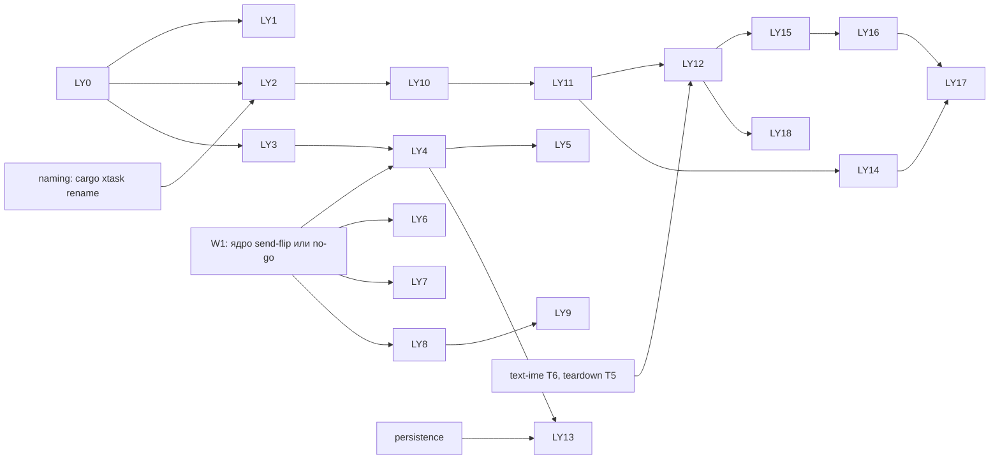

# Платформенный слой — задачи

- **Статус:** черновик, редакция 2; исполнение — после утверждения design.md и ADR-0151…0154
- **Дата:** 2026-10-06
- **Design:** [design.md](design.md); требования — [requirements.md](requirements.md)
- **База:** `main` @ `d56188c14`
- **Итог:** 0.2 — 13 задач (LY0–LY12), 4 из них `[P]`; 0.3 — 6 задач (LY13–LY18); оценки — в
  колонке «Дни», сумма 0.2 ≈ 29,5 дня (P0 — 10,5), 0.3 ≈ 25 дней

## Правила исполнения

Задача = worktree (`cargo xtask worktree new platform-layer/<slug>`) = PR; `cargo xtask
check-changed` зелёный; fix-тест падает с откатом (изолированный checkout); имена кода и тестов без
номеров задач и требований; PR, меняющий поверхность для потребителя, добавляет
`changelog.d/<branch-slug>.md`. Где: **L** — Linux CI; **W** — Windows нативно (локальный запуск);
**T** — только cross-typecheck (так и пишется в PR). Новая публичная поверхность сливается вместе с
первым production-потребителем (R5.6). Ни одна задача не трогает файлы активной ветки без
согласия её владельца.

**Приоритет:** **P0** — должно быть в 0.2.0 (имена и всё, что убирается из Stable до первой
публикации); **P1** — в 0.2.0, если окно позволяет, иначе целиком в 0.3; **0.3** — до первого
крейта возможности.

## Окна по веткам

| Окно | Открывается | Почему |
|---|---|---|
| **W0** | после утверждения | только новые файлы и файлы, которых не касаются активные ветки |
| **W1** | слияние ядра send-flip (~11-09) **или** решение no-go (11-17), что раньше | send-flip владеет `flui-scheduler`, `flui-runtime/src/{realm_services,presentation}.rs`, `ui_realm/*`, `flui-view/src/owner/*` |
| **W2a** | 11-10…11-14 (окно массового переименования naming) | шаг 1 переименования |
| **W2b** | 11-24…11-28, после того как открытые ветки влили W2a | шаг 2 переименования |
| **W3** | после text-ime T6 (go/no-go 11-20) и teardown T5 (~11-17) | держат `text_store/*`, Win32 `text_services`, Win32 `platform.rs` |
| **W4** | последняя задача persistence | persistence держит доставку `Storage` |
| **0.2 cutoff** | 11-28 | publish-конвейер — с 12-01 |

### Путь при no-go send-flip (11-17)

Решение no-go означает: 0.2.0 выходит без flip, ветки send-flip перестают править runtime/view/
scheduler, а храповик `thread-boundary` не пускает новые `Send`-позиции класса flip до 0.3.

- W1 открывается 11-17 на текущем `main`. Шов от flip не зависит: реестр — значение owner-потока,
  а realm живёт на owner-потоке и без flip (ADR-0128, решение D4).
- Новый колбэк `Platform::on_preferences_changed` — класс «platform hook» (хуки `Platform`
  остаются `Send` по спеке send-flip), не класс flip; классифицируется в храповике в том же PR.
- Если к 11-24 посадка шва (LY4) не готова — шов, LY5 и LY8 целиком уходят в 0.3; на `main`
  ничего из них нет (R4.10). P0 от send-flip не зависят.

## Граф

## Задачи 0.2

| ID | Пр. | Задача | Окно | Крейты и файлы | Метаданные / гейты | Тесты | Где | Дни |
|---|---|---|---|---|---|---|---|---|
| **LY0** | P0 | Утверждение design и ADR-0151…0154; ответы Q1, Q3–Q6 (Q2 и Q7 решены); резерв ADR-0151…0154 в `release/tasks.md` (`plans/specs-next`); при принятии — `Superseded-by` в ADR-0035, 0078, 0082, 0084; согласование текста design §11 с владельцами animation и interaction | — | `docs/adr/*`, спеки | `cargo xtask checks` | — | — | 1 |
| **LY1** [P] | P0 | Удалить мёртвое в бэкенде: `LinuxPlatform` (AT-SPI-адаптер остаётся, модуль переименован по смыслу), `window.rs`, `PlatformCapabilities` + `Desktop/Mobile/WebCapabilities` + `Platform::capabilities`. Строки в Win32/macOS `platform.rs` — с согласия владельцев teardown и text-ime | W0 | `flui-platform/src/{lib.rs, window.rs, traits/{platform,capabilities}.rs, platforms/linux/*}`, overrides `capabilities()` в бэкендах | `cargo xtask globals` (уходят записи `WINDOWS_CAPABILITIES`, `MACOS_CAPABILITIES`), `workspace` | существующие; Linux по-прежнему winit | L + T | 1,5 |
| **LY2** [P] | P0 | Карта переименования для `cargo xtask rename` (инструмент — спека naming): целые токены, `--changed-since`, файлы по design §10, проверка «отставное имя»; самотест на временной копии; повторный прогон карты шага на выходе пуст | W0 (до 11-10) | `tools/xtask` (карта), с владельцем naming | `cargo xtask checks` | самотест: `flui-platform-api` не задет шагом 1; повтор пуст | L | 2 |
| **LY3** [P] | P1 | Написать шов на ветке (не сливать отдельно): контракт `capability` (`Capability`, `ProviderContext`, `CapabilityProvider`, `Unsupported`, `UnsupportedReason`), `flui-runtime` `capability/` (`CapabilityRegistry`, `CapabilityRegistrar`, `Plugin`), headless-провайдер clipboard в `flui-testing`, `ClipboardCapability` в `flui-interaction` | W0 | новые файлы: `flui-platform-api/src/capability.rs`, `flui-runtime/src/capability/`, `flui-testing/src/capability.rs` | — | юнит-таблицы реестра (приоритет, конфликт, повтор `NAME`, `NotRegistered`); dyn-пин | L | 3 |
| **LY4** | P1 | **Посадка шва с первым потребителем** (один день слияния с LY3): параметр конструктора realm (в `RealmHostServices` по плану persistence), `BuildOwner`, `capability_erased`, `LifecycleContextExt`; встроенный провайдер clipboard в `flui-app`; `EditableText` через шов; `clipboard_handle` удалён; AGENTS.md «Extending FLUI» и `design/architecture.md` — строка про возможности | W1 | `flui-runtime/src/{realm_services,presentation}.rs`, `flui-view/src/{owner/{build_owner,element_owner}.rs, element/behavior.rs, context/*}`, `flui-widgets/src/text/editable_text.rs`, `flui-interaction/src/clipboard.rs`, `flui-app/src/app/runner/host.rs` | `workspace`, `reach`, `globals`; changelog | ADR-0152 §4: copy/paste через headless; `NotRegistered`; `NotOnThisPlatform` до виджета; trybuild E0599 и E0277 | L | 5 |
| **LY5** | P1 | `Application::plugin`/`capability`, `AppRunError::CapabilityConflict` до окна; fixture-пакет вне зависимостей фреймворка на `flui-sdk` + контракте; `flui-sdk` реэкспорт + строка в `tests/surface.rs` | W1, после LY4 | `flui-app/src/app/application.rs`, `flui-sdk/src/lib.rs`, `tests/fixtures/` | `cargo xtask reach` (fixture не видит бэкенд); changelog | конфликт до окна; fixture регистрирует и получает свою возможность | L | 2 |
| **LY6** | P0 | Haptics из Stable: `PlatformHaptics`, `PlatformWindow::haptics`, `HapticFeedback`, `FakeHaptics`; мёртвые forwarders runtime (`presentation.rs`, `ui_realm/frame_clock.rs`) — с согласия владельца send-flip до W1 или в W1 | W1 (или раньше с согласием) | `flui-platform-api/src/{haptics,haptic_feedback,platform_window,lib}.rs`, `flui-platform/src/platforms/headless/*`, `flui-runtime/src/{presentation.rs, ui_realm/frame_clock.rs}` | `workspace`; changelog (Removed) | существующие | L + T | 1 |
| **LY7** | P1 | `AppLifecycleState` → контракт `lifecycle`, `#[non_exhaustive]`; scheduler реэкспортирует, политика кадров — его extension-трейт; ребро scheduler → контракт | W1 | `flui-scheduler/src/frame.rs`, `Cargo.toml`; `flui-platform-api/src/lifecycle.rs` | `workspace` (S→C, layer 2→1); changelog | существующие тесты lifecycle без правок путей | L | 2 |
| **LY8** | P1 | `SystemPreferences` (тип, builder, `InvalidPreference`), `Platform::preferences`/`on_preferences_changed` в ядре-хосте, headless-производитель; `flui-app` засевает realm и рассылает; `MediaQuery` (масштаб текста, контраст, bold, локали, motion); `AccessibilityFeatures` удалён. Сливается вместе с первыми потребителями (MediaQuery и жесты) | W1 | `flui-platform-api/src/preferences.rs`, `flui-platform/src/{traits/platform.rs, platforms/headless/*}`, `flui-app/src/app/{runtime.rs, runner/*}`, `flui-runtime/src/media_query_root.rs`, `flui-widgets/src/app/media_query.rs`, `flui-semantics/src/accessibility.rs` | `workspace`; храповик thread-boundary (класс «platform hook»); changelog | realm без окна читает настройки; смена `text_scale` перестраивает виджет; валидация builder'а; тест падает без доставки | L | 4 |
| **LY9** [P] | P1 | Потребитель жестов: `GestureSettings` из `SystemPreferences::gestures` через `GestureSettingsScope` (interaction X2 — с владельцем interaction); производители: winit/Linux (default), web (`matchMedia`), AppKit, iOS | W1, после LY8 | `flui-interaction/src/{settings,binding}.rs`, `flui-platform/src/platforms/{web,macos,ios,winit}/*` | `cross-typecheck` | смена `long_press` в headless меняет время распознавателя (падает без доставки); web — `wasm-check`; AppKit/iOS — T | L/T | 3 |
| **LY10** | P0 | **Переименование, шаг 1:** `flui-platform` → `flui-native` по карте LY2, один коммит без ручных правок; включает проверку «отставное имя»; описание PR — инструкция для веток (ниже) | W2a | весь workspace | `workspace`, `reach`, `globals`, `checks`, `check-changed`, `cross-typecheck` | весь набор | L + T | 1 |
| **LY11** | P0 | **Переименование, шаг 2:** `flui-platform-api` → `flui-platform`, снятие проверки «отставное имя» | W2b | весь workspace | то же | весь набор | L + T | 1 |
| **LY12** | P0 | Диета Stable до публикации: `InMemoryClipboard`, `InMemoryTextStore` → `flui-testing` (runtime `test_clipboard` — своя замена под `test-support`); data transfer (`OfferTable`, `ClaimSlot`-обвязка, словарь, кроме `DragDropEvent` и `DataTransferId`), `WindowMode`, `WindowEvent`, `WindowBounds`, `WindowBackgroundAppearance`, `PlatformDisplay`, пиксельные хелперы → ядро-хост; `display`/`window_bounds`/`set_background_appearance`/`mouse_position`/`is_hovered` → `HostWindow`; удалить `offset_from_coords`, `delta_offset_from_coords`, `utf16_range`, `TransferImage` с вариантом `Image` | W3 | `flui-platform/src/*`, `flui-native/src/*`, `flui-testing`, `flui-runtime/src/presentation.rs` | `workspace`, `reach`, `deps`; changelog (Removed/Changed) | существующие + `text_store_kit::assert_conforms`; Win32 — W | L + W/T | 3 |

## Задачи 0.3 (до первого крейта возможности)

| ID | Задача | Зависит от | Крейты | Гейты | Дни |
|---|---|---|---|---|---|
| **LY13** | `Storage` через шов: встроенный провайдер без окна (`FileStore`), headless `MemoryStorage`; `LifecycleContext::storage` удалён (заменяет пункт ADR-0133 о методе) | persistence, LY4 | `flui-view/src/persist/*`, `flui-app/src/app/storage_host.rs`, `flui-testing/src/storage.rs` | changelog | 3 |
| **LY14** | Решение вопроса ADR-0153: повторить опыты A/B на настоящих контракте и пилоте; `cargo-semver-checks` по `Point`, `Size`, `Bounds`, `EdgeInsets`, `DataTransferId` между поездами 0.2; выбрать вариант (своя версия контракта / узкая поправка к ADR-0098 / крейты едут поездом) ревизией ADR-0153; при варианте 1 — kind-правило версии контракта в `cargo xtask workspace` с `--self-test` | LY11, до LY17 | `tools/xtask/src/workspace/*`, ADR-0153 | `workspace` с самотестом | 3 |
| **LY15** | Контракт без `parking_lot` и `tracing` (ADR-0151 §2), оба — в его `reach-forbid`; решение Q5 по машинерии text store | text-ime, LY12 | `flui-platform`, `flui-interaction` или `flui-testing` | `workspace`, `reach`, `deps`; новый ADR, если Q5 = A (заменяет часть ADR-0142) | 4 |
| **LY16** | Мост к хосту (ADR) + класс `capability` в гейтах (ADR-0154: kind-правила, reach-таблица, `--self-test`) + схема деклараций и генерация манифестов в `flui-cli` (ADR) — всё вместе с пилотом LY17 | LY15 | `flui-platform`, `flui-native`, `tools/xtask`, `flui-cli` | `workspace`, `reach` с самотестом | 6 |
| **LY17** | Пилот `flui-location`: Windows (WinRT `Geolocator`) и Android; `PermissionState`/`Denial`; подписка-RAII; симулирующий провайдер; conformance-таблица; декларации | LY16 | `packages/flui-location` | conformance на Windows — W, Android — эмулятор или T | 7 |
| **LY18** | OS-типы ядра-хоста → `pub(crate)`, один модуль `__examples`; проверка по rustdoc JSON с `--document-hidden-items`. Переезд Win32-диалогов в `flui-system` и удаление `BackgroundExecutor`/`Task` — ADR, заменяющий ADR-0039 §2 | LY12 | `flui-native/src/platforms/*`, `examples/*` | проверка поверхности; Win32-диалог — W | 2 |

## Инструкция для открытых веток (LY10 и LY11)

После каждого шага:

1. `git fetch origin && git merge origin/main`.
2. `cargo xtask rename --map platform-layer-<шаг> --changed-since $(git merge-base HEAD origin/main)` —
   переписывает только строки, которые ветка добавила после ветвления. Порядок шагов не менять:
   шаг 2 на ветке — только после того, как ветка влила шаг 1.
3. `cargo xtask check-changed`.

Ветка, которая не может влить шаг 1 до 11-24, сообщает владельцу спеки platform-layer до 11-17;
шаг 2 сдвигается целиком, а не по частям.

## Проверка требований

| Требование | Задачи |
|---|---|
| R1.1, R1.2 | LY10, LY11 |
| R1.3 | уже верно; LY10/LY11 сохраняют `allowed-dependents` |
| R1.4 | LY6, LY12 |
| R1.5 | interaction pointer-vocabulary (вне спеки), затем `reach-forbid` |
| R1.6 | LY18 |
| R1.7 | naming PM4 (владелец — naming) |
| R1.8 | LY1 |
| R1.9 | LY14, LY15 |
| R1.10 | ADR-0151 §3; LY16 |
| R2 | LY7, LY8 |
| R3 | LY8, LY9 |
| R4 | LY3, LY4, LY5, LY13 |
| R5.3 | LY2, LY10, LY11 |
| R6 | LY16, LY17 |
