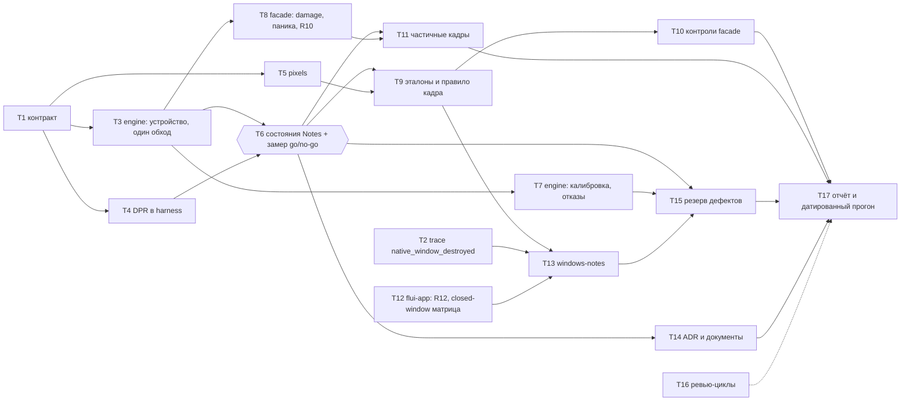

# render-proof — задачи (уровень 1)

- **Статус:** черновик
- **Дата:** 2026-10-05 · **База:** `main` @ `4915054c8`
- **Design:** [design.md](design.md) (раздел «Работы» — исходная разбивка); требования:
  [requirements.md](requirements.md) R1–R16; уровень 0: [../release/tasks.md](../release/tasks.md).
- **Оценки** — инженеро-дни. **[P]** — задача идёт параллельно с другими [P] своей волны: общих
  файлов нет, порядковой зависимости между ними нет. Каждая задача — свой worktree
  (`cargo xtask worktree new render-proof/<slug>`), один PR, `cargo xtask check-changed` зелёный.
- **Порядок слияния.** T1 — первый коммит интеграционной ветки `render-proof/contract`: его
  CI-тесты (R8, R14) красные по замыслу, поэтому в `main` он не идёт один. T4 и T5 вливаются в
  эту ветку; ветка уходит в `main` (точка **M1**), когда CI-тир зелёный. GPU-тесты в CI не
  исполняются (фича `gpu-readback-tests` не входит в `TEST_FEATURES`), поэтому после M1
  остальные задачи идут PR прямо в `main`, а красные GPU-строки до своих задач — ожидаемое
  состояние, записанное в PR T1.
- **Имена.** ID требований и задач живут только в этом файле: ни в идентификаторах, ни в именах
  тестов, ни в сообщениях коммитов их нет.

## Граф зависимостей

Волны: **0** — T1, T2, T12 · **1** — T3, T4, T5 [P] · **2** — T6, T7, T8 · **3** — T9, T11,
T14 · **4** — T10, T13 · **5** — T15 → T17. Ромб — go/no-go: T9, T10 и объём T7 ждут его решения.

## T1 — контракт (подробно)

Добавляет публичные типы и сигнатуры из design «Публичный контракт», минимальные честные
реализации (без `todo!`/`unimplemented!`) и тесты, которые сейчас падают утверждением.

**Элементы.**
- `flui-engine`, только под фичей `testing`: `headless::FrameCapture`,
  `HeadlessRenderer::{adapter_info, frame_capture}`, `FrameCapture::{render, read_rgba}`,
  `headless::gpu_or_skip` (перенос из `#[cfg(test)]` `test_support`; наборы engine переходят на
  него). Минимум: `FrameCapture` оборачивает нынешний обход `render_layer_tree`, `render`
  всегда рисует полностью и возвращает `Ok(None)` — это соответствует документации «`None` —
  кадр отрисован полностью».
- `flui-testing`: `MountOptions::physical`, приватные поля `MountOptions` + миграция всех
  вызовов на конструкторы и `with_capabilities` (сигнатура замораживается сейчас, иначе
  миграция пересекла бы файлы [P]-задач), `widgets::lay_out_with`, `LaidOut::{scene,
  surface_size}`, модуль `pixels` целиком (`Readback`, `SamplePoint`, `FrameRule`, `Check`,
  `Comparison`, `compare`, `ReferenceMode`, `Reference`, `ReferenceError`). Минимум:
  `physical` хранит вариант, но монтирование пока берёт DPR 1.0 (это сказано в doc-комментарии);
  `compare` проверяет `Size`, а `Samples` и `Frame` до T5 считает проваленными (fail-closed:
  ложного успеха нет); `ReferenceMode::from_env` всегда `Verify`.
- `flui` (facade): фича `testing-gpu = ["testing", "dep:flui-engine", "flui-engine/testing",
  "dep:pollster"]`, `gpu-readback-tests = ["testing-gpu", "material"]`, модуль
  `flui::testing::gpu` (`GpuCapture`, `Captured`, `AdapterSummary`, `CaptureError`,
  `skip_unless_gpu`). Минимум: `capture` передаёт полный damage, `Captured::damage` всегда
  `None`, `catch_unwind` нет, `AdapterSummary::test_adapter = "default"`.
- `tools/xtask`: `device/window_snapshot.rs` — захват окна `xcap` (WGC) по HWND и функция crop
  по `DWMWA_EXTENDED_FRAME_BOUNDS` с unit-тестом на арифметику (зелёный). Модуль нужен здесь,
  чтобы ребро `xtask → xcap` и `Cargo.lock` менялись один раз.

**Тесты T1 и как они падают до реализации.**

| Тест | Тир | Падает потому, что | Зеленеет в |
|---|---|---|---|
| `mount_at_dpr_derives_logical_size` | Widget, `flui-testing` | строки 1.5/2.0: логический ≠ физический/DPR | T4 |
| `reference_update_requires_explicit_opt_in` | Widget, `flui-testing` | строка `Update` при успехе: файл не записан | T5 |
| `compare_reports_each_failed_check` | Widget, `flui-testing` | совпадающий кадр даёт `{Samples, Frame}` (fail-closed) | T5 |
| `notes_home_readback_has_the_committed_size` | GPU, `gpu_readback` | строка DPR 1.5: размер = `ceil` логического | T4 |
| `notes_screens_match_their_references` (строка `home_list@1.0`) | GPU | `ReferenceError::Missing` | T9 |
| `notes_partial_frames_match_full_frames` | GPU | предусловие `damage.is_some()` | T8 + T11 |

**Манифесты и регистрации (T1 — владелец).** Корневой `Cargo.toml`: фичи выше, `[[test]]
gpu_readback` (`tests/gpu_readback/main.rs`, `required-features = ["gpu-readback-tests"]`)
вместо `composited_layer_update_readback` (переносится модулем), `xcap` в
`[workspace.dependencies]` (`tools/desktop-mcp` переходит на `workspace = true`), исправленные
комментарии `Cargo.toml:769-775`. `crates/flui-testing/Cargo.toml` (`image`),
`tools/xtask/Cargo.toml` (`xcap`, `cfg(windows)`), `Cargo.lock`. `tests/gpu_readback/main.rs`
регистрирует все модули фичи: `composited_layer_update`, `size`, `notes_states`, `rewrite`,
`measure`, `references`, `controls`, `partial` (будущие — файлы с модульным doc-комментарием и
без тестов). `crates/flui-testing/tests/main.rs`: `mount_at_dpr`, `pixels`. `.config/nextest.toml`:
группа `gpu-readback` получает `binary_id(flui::gpu_readback)`,
`calibration_detects_broken_conventions`, `capture_failure_matrix` и
`a_panicking_capture_is_an_error_and_the_next_is_full`; отдельная запись для дочернего процесса
`notes_readback_without_adapter_is_an_error`. `tools/xtask/src/tasks.rs`: `TEST_FEATURES` +
`flui/testing-gpu`, `gpu_test_plan` на бинарь `gpu_readback`, комментарий `:1048`. `src/lib.rs`,
`src/testing.rs`, `crates/flui-testing/src/lib.rs`. `changelog.d/<slug>.md` (Added/Changed).

## Задачи

| ID | Задача | R | Файлы (единственные разрешённые) | Зависит | Проверка | Где | Готово, когда | Д | Статус |
|---|---|---|---|---|---|---|---|---|---|
| T1 | Контракт (см. выше) | R1, R8, R14 (тесты); R3, R4, R7 (сигнатуры) | см. «T1 — контракт» | — | `cargo xtask check-changed`; `cargo xtask facade-combos`; `cargo xtask reach`; `cargo xtask deps`; `cargo xtask gpu-test` (ожидаемые падения перечислены в PR) | Linux CI (сборка) + Windows GPU | каждый тест из таблицы T1 падает по названной причине, остальное зелёное; `reach` не видит GPU в тире K | 3 | — |
| T2 [P] | Trace `event = "native_window_destroyed"` (`target: "flui.platform"`) в ветке `WM_DESTROY` | R13 (опора) | `crates/flui-platform/src/platforms/windows/platform.rs` (одна строка) | — (общая с `teardown`: делает та, что начнёт первой; вторая только зависит) | `cargo xtask cross-typecheck`; запуск Notes с `FLUI_PROBE_RUST_LOG=flui.platform=debug`, событие в логе | Windows host | событие есть в логе при Alt+F4 и при `close()`; проверка порядка — в T13 | 0.5 | — |
| T3 [P] | Engine: `select_backend()` + `GpuCapabilities::detect` + `request_flui_device` в `HeadlessRenderer::acquire`; `FLUI_TEST_ADAPTER=default\|fallback`; `FrameCapture` через `FrameProtocol::plan/run` → `record_frame_content` с `FontSource::Ordinary`; второй обход удалён, кэш `FrameCapture` по размеру в `render_layer_tree`; разбор пикселей существующих наборов `gpu-test` | R1, R10 (engine) | `crates/flui-engine/src/{headless,adapter,test_support,lib,frame_protocol}.rs`, `renderer.rs` (только видимость `record_frame_content`) | T1 | `cargo xtask gpu-test` на `default` и `FLUI_TEST_ADAPTER=fallback` (WARP); `cargo nextest run -p flui-engine --features testing --lib` в WSL2 (lavapipe); `cargo xtask check-changed` | Windows GPU + WSL2 | `notes_home_readback_has_the_committed_size@1.0` зелёный; `rg record_layer_tree crates/flui-engine/src/headless.rs` — один вызов (через `record_frame_content`); каждое изменение пикселей прежних наборов объяснено в PR, не перезаписано | 4 | — |
| T4 [P] | DPR в harness: `RootSurface`, `mount_root` соблюдает DPR, корневой `TransformLayer` его несёт, `lay_out_with`, `surface_size` | R8 | `crates/flui-testing/src/{bootstrap,realm,widgets}.rs`, `crates/flui-testing/tests/mount_at_dpr.rs`, `changelog.d/<slug>.md` | T1 | `cargo nextest run -p flui-testing mount_at_dpr_derives_logical_size`; `cargo xtask check-changed` | Linux CI | тест зелёный; с откатом вывода логического размера (снова `ceil`) падает строка 1.5 — прогон в изолированном worktree указан в PR | 1.5 | — |
| T5 [P] | `flui_testing::pixels`: порядок Size → Samples → Frame, первые 8 координат, `FLUI_READBACK_DUMP_DIR`, sidecar и `samples.txt`, `Update` с отказом `Refused`, `FLUI_UPDATE_REFERENCES=<glob>` | R3, R4 (логика), R14 | `crates/flui-testing/src/pixels.rs`, `crates/flui-testing/tests/pixels.rs` | T1 | `cargo nextest run -p flui-testing pixels`; `cargo xtask check-changed` | Linux CI | `reference_update_requires_explicit_opt_in` и `compare_reports_each_failed_check` зелёные; с откатом проверки режима файл пишется молча и тест падает (прогон в PR) | 2.5 | — |
| T6 | Состояния Notes для GPU (6 состояний × DPR {1.0, 1.5, 2.0}, обёртка `Directionality` RTL, `settle` на виртуальных часах), мутации D2 (`rewrite`), дампы и гистограммы `measure`; **замер go/no-go** на WARP, железе и lavapipe | R4 (структура и числа), R5 (мутации), R9 (фикстура) | `tests/gpu_readback/{notes_states,rewrite,measure}.rs` | T3, T4 | `FLUI_READBACK_DUMP_DIR=… FLUI_TEST_ADAPTER={default,fallback} cargo xtask gpu-test`; то же в WSL2; `measure` (`#[ignore]`, `--run-ignored only`) читает три каталога | Windows GPU + WSL2 | таблица `max \|Δ\|` и N выше t по парам адаптеров и контролям, с маской и без; выбран (а)/(б)/(в) с константами `channel_tolerance`, `max_differing_pixels`, либо **no-go** с вопросом владельцу (snapping ADR-0098 §6); таблица передана T14 | 3.5 | — |
| T7 [P] | Engine in-src: `calibration_detects_broken_conventions` (строки `calibration`, `calibration_through_intermediate`, `glyph_edge`, `straight_alpha_blend_is_rejected`, `linear_blending_is_rejected`) с `#[cfg(test)]`-переключателями конвейеров; `capture_failure_matrix` (device lost через `device.destroy()`, паника в content, обе подряд, следующий захват на новом renderer) | R5, R6, R11 | `crates/flui-engine/src/{calibration_tests,capture_failure_tests}.rs` (новые, in-src), `mod`-строки в `lib.rs`/`headless.rs`, `#[cfg(test)]`-переключатели в модулях конвейеров painter | T3 | `cargo nextest run -p flui-engine --features testing --lib calibration_detects_broken_conventions capture_failure_matrix` с `FLUI_REQUIRE_GPU=1` | Windows GPU (WARP и железо) | строки зелёные; каждая `*_is_rejected` проваливает названную точку; при no-go T6 сюда переходят краевые точки R8 (объём пересматривается) | 2.5 | — |
| T8 [P] | Facade: damage от production `LayerDiffer`, `catch_unwind` в `capture` с удержанием payload через helper ADR-0127, сброс кэша и `LayerDiffer` после отказа, `AdapterSummary` из `adapter_info` и `FLUI_TEST_ADAPTER`, `GpuUnavailable` без адаптера | R7 (damage), R10, R11 | `src/testing/gpu.rs` (in-src тесты там же) | T3 | `cargo nextest run -p flui --features testing-gpu --lib notes_readback_without_adapter_is_an_error`; `cargo xtask gpu-test` (`a_panicking_capture_is_an_error_and_the_next_is_full`) | Linux CI (R10) + Windows GPU (R11) | оба теста зелёные; без `catch_unwind` паника выходит из `capture`, без сброса кэша следующий кадр частичный, при `Ok` вместо `GpuUnavailable` тест R10 падает — три отката в PR | 1.5 | — |
| T9 | Эталоны и правило кадра: `notes_screens_match_their_references` (строки состояний × DPR + `*_rtl`, краевая точка DPR 1.5 с нечётной шириной), точки из `ThemeData::light()` и layout probe, константы правила из T6, `tests/references/notes/**` (PNG, `.adapter.txt`, `samples.txt`) с ревью каждого PNG | R2, R3, R4, R8 (столбец DPR), R9 | `tests/gpu_readback/references.rs`, `tests/references/notes/**` | T5, T6 (go) | `FLUI_REQUIRE_GPU=1 cargo xtask gpu-test`; съёмка `FLUI_UPDATE_REFERENCES=<glob>` только локально | Windows GPU (эталонный класс по T6; при (в) — WARP) | все строки проходят на эталонном адаптере; каждый PNG указан в PR с причиной и картинкой; повторный прогон без переменной обновления зелёный | 3 | — |
| T10 [P] | `notes_reference_rejects_broken_renders`: девять строк D2 из design, каждая требует, чтобы провалилась названная проверка и прошёл `Size` | R5 | `tests/gpu_readback/controls.rs` | T9 | `FLUI_REQUIRE_GPU=1 cargo xtask gpu-test` на WARP и железе | Windows GPU | все контроли проваливают ровно названную проверку на каждом классе адаптера из T6 | 1.5 | — |
| T11 [P] | `notes_partial_frames_match_full_frames`: захват A до/после локального изменения (компактные строки, ввод в поле), свежий B после; вне damage побайтно, внутри 0 (±2 только с записанной причиной) | R7 | `tests/gpu_readback/partial.rs` | T6, T8 | `FLUI_REQUIRE_GPU=1 cargo xtask gpu-test` | Windows GPU | тест зелёный; предусловие `damage.is_some()` выполнено на обеих строках | 1 | — |
| T12 [P] | `flui-app`: строки fake `RasterBackend` `an_outdated_surface_drops_the_frame_without_presenting`, `a_resize_mid_frame_renders_the_next_frame_at_the_new_size` в `surface_lifecycle_matrix`; `closed_window_surface_matrix` (`cfg(windows)`, `#[ignore]`): `close()` до выхода цикла, device loss после закрытия → `SurfaceTargetUnavailable`, `close()` из callback при арендованной поверхности | R12, R13 (б, в, `close()`) | `crates/flui-app/src/app/runner/surface_lifecycle.rs` (только таблица), `crates/flui-app/tests/{main.rs,closed_window_surface.rs}` | — (сверить с `teardown` п. 7: `flui-app` runner) | `cargo nextest run -p flui-app surface_lifecycle_matrix`; на Windows `cargo nextest run -p flui-app closed_window_surface_matrix --run-ignored only` | Linux CI (R12) + Windows native | строки R12 зелёные, с откатом пропуска кадра fake фиксирует present старого размера; матрица зелёная на Windows; откаты (без probe в `recover()`, без обработки `Lost`) падают — прогоны в PR | 2.5 | — |
| T13 [P] | `windows-notes`: снимок клиентской области (WGC, crop, `IsIconic`/advanced color/несовпадение размера → `CANNOT_VERIFY`), точки из `samples.txt` с геометрией из UIA, `--scale` против `GetDpiForWindow`, лог-файл пробы, `Damage scissor applied` после ввода, `copy_src` и `Selected GPU` в trace, шаг «нет растяжения после resize», порядок `surface_released` < `native_window_destroyed` на Alt+F4, запуск `closed_window_surface_matrix` | R12 (native), R13 (а), R15 | `tools/xtask/src/device/{windows_notes,uia,window_snapshot}.rs` | T2, T9 (`samples.txt`), T12 | `cargo xtask device windows-notes --scale 100`, затем `--scale 150`; `cargo xtask cross-typecheck`; `cargo xtask check-changed` | Windows native, ручной датированный gate | оба масштаба проходят точки, включая средние тона; строка damage и порядок событий найдены в логе; лог приложен к PR | 3 | — |
| T14 [P] | ADR-XXXX «Golden-image proof is a wgpu readback through the windowed frame path» (`Supersedes: ADR-0087` §2), `Superseded-by` в ADR-0087, индекс ADR; `crates/flui-engine/ARCHITECTURE.md` (модульная карта, mapping decision с именем теста), `crates/flui-testing/ARCHITECTURE.md`, `docs/testing.md` («Determinism»: таблица T6, тиры, команды) | все (запись решений) | `docs/adr/ADR-XXXX-*.md`, `docs/adr/ADR-0087-*.md`, индекс ADR, два `ARCHITECTURE.md`, `docs/testing.md` | T6 | `cargo xtask checks` | Linux CI | ссылки и пути проходят `docs-links`/`docs-paths`; числа совпадают с константами T9 | 1 | — |
| T15 | Резерв на дефекты, найденные замером, калибровкой и R15 (края, формат поверхности, damage в реальном окне). Каждый дефект — отдельный worktree, PR и регрессионный тест | по находке | файлы дефекта; владельцы общих файлов — как ниже | T6, T7, T13 | тест дефекта + `cargo xtask check-changed`; GPU/native по месту | по месту | каждый тест падает с откатом исправления (изолированный worktree, прогон в PR) | 4 | — |
| T16 | Ревью-циклы (3 раунда по веткам фичи) и сверка «Требование → тест» с кодом | — | — | идёт рядом с T3–T15 | `gh pr diff`; `rg` имён тестов из таблицы ниже | — | у каждого R есть тест с указанным именем; находки блокирующего уровня закрыты | 2.5 | — |
| T17 | Отчёт R16 (`render_proof_report.rs`, шаг в `gpu_test_plan`): оба адаптера, драйвер, `FLUI_TEST_ADAPTER`, пиксели на строку, итог каждого контроля, масштабы, `copy_src`; `render_proof_report_names_every_field`; датированный прогон на SHA релиза, ссылка в #1043 и в прогон R14 уровня 0 | R16, закрытие #1043 | `tools/xtask/src/render_proof_report.rs` (новый) + `mod`-строка, шаг в `tools/xtask/src/tasks.rs` (после T1, последовательно) | T10, T11, T13, T14, T15 | `cargo nextest run -p xtask render_proof_report_names_every_field`; `FLUI_REQUIRE_GPU=1 cargo xtask gpu-test`; `cargo xtask device windows-notes --scale 100/150` | Linux CI (тест) + Windows GPU + native | отчёт содержит все поля на реальном прогоне; тест падает, если из отчёта убрать любое поле | 1.5 | — |

## Требование → тест

| R | Тест(ы) | Тир | Задача |
|---|---|---|---|
| R1 | `notes_home_readback_has_the_committed_size` (DPR 1.0, 1.5) | GPU, `gpu_readback` | T1 → T3, T4 |
| R2 | `notes_screens_match_their_references` | GPU, `gpu_readback` | T9 |
| R3 | строки R2; `compare_reports_each_failed_check` | GPU; Widget (`flui-testing`) | T9; T5 |
| R4 | строки R2 (константы из замера); `compare_reports_each_failed_check` | GPU; Widget | T6, T9; T5 |
| R5 | `notes_reference_rejects_broken_renders`; строки `*_is_rejected` в `calibration_detects_broken_conventions` | GPU facade; GPU engine in-src | T10; T7 |
| R6 | `calibration_detects_broken_conventions` (`calibration`, `calibration_through_intermediate`, `glyph_edge`) — по design перенесено из facade в engine | GPU engine in-src | T7 |
| R7 | `notes_partial_frames_match_full_frames` | GPU, `gpu_readback` | T1 → T8, T11 |
| R8 | `mount_at_dpr_derives_logical_size`; столбец DPR и краевая точка в `notes_screens_match_their_references` | Widget; GPU | T4; T9 |
| R9 | строки `*_rtl` в `notes_screens_match_their_references`; строка зеркальной раскладки в R5 | GPU | T6, T9, T10 |
| R10 | `notes_readback_without_adapter_is_an_error` (дочерний процесс) | Widget, facade in-src | T8 |
| R11 | `capture_failure_matrix`; `a_panicking_capture_is_an_error_and_the_next_is_full` | GPU engine in-src; GPU facade in-src | T7; T8 |
| R12 | `an_outdated_surface_drops_the_frame_without_presenting`, `a_resize_mid_frame_renders_the_next_frame_at_the_new_size` (`surface_lifecycle_matrix`); шаг resize в `windows-notes` | Unit; native | T12; T13 |
| R13 | порядок `surface_released` < `native_window_destroyed` на Alt+F4 в `windows-notes`; `closed_window_surface_matrix` | native | T2, T13; T12 |
| R14 | `reference_update_requires_explicit_opt_in` | Widget, `flui-testing` | T1 → T5 |
| R15 | шаг снимка окна `windows-notes` (100 % и 150 %) | native, ручной | T13 |
| R16 | `render_proof_report_names_every_field`; датированный отчёт | Widget, xtask in-src; GPU + native | T17 |

## Владельцы общих файлов

| Файл | Владелец | Как другие задачи получают изменение |
|---|---|---|
| `Cargo.lock` | T1 | все новые рёбра (`image` → `flui-testing`, `flui-engine`/`pollster` → facade, `xcap` → `xtask`) входят в T1; новая зависимость позже — отдельный коммит владельца T1 до задачи, которой она нужна |
| корневой `Cargo.toml` (workspace и facade: фичи, `[[test]]`, `[workspace.dependencies]`) | T1 | то же |
| `crates/flui-testing/Cargo.toml`, `tools/xtask/Cargo.toml`, `tools/desktop-mcp/Cargo.toml` | T1 | то же |
| `tests/gpu_readback/main.rs` | T1 | все модули зарегистрированы заранее; задачи меняют только свой файл |
| `crates/flui-testing/tests/main.rs` | T1 | `mount_at_dpr`, `pixels` зарегистрированы в T1 |
| `crates/flui-app/tests/main.rs` | T12 | единственный регистратор в этой фиче; с `teardown` сверяет оркестратор |
| `.config/nextest.toml` | T1 | все имена GPU-тестов и запись дочернего процесса R10 вносятся в T1 |
| `src/lib.rs`, `src/testing.rs` | T1 | `src/testing/gpu.rs` создаёт T1, дальше правит только T8 |
| `crates/flui-testing/src/lib.rs` | T1 | `pub mod pixels` и реэкспорты в T1 |
| индекс ADR, `docs/adr/ADR-XXXX-*`, `ADR-0087` | T14 | номер назначает оркестратор |
| `docs/testing.md` | T14 | таблица замера T6 передаётся в T14 |
| `tools/xtask/src/tasks.rs` | T1, затем T17 | последовательно: T17 добавляет только шаг отчёта после слияния T1 |
| `crates/flui-engine/src/{lib,headless}.rs` | T1 → T3 → T7 | строго последовательно, в одной волне не встречаются |
| `crates/flui-platform/src/platforms/windows/platform.rs` | T2 | общий с `teardown` п. 3: trace вносит первая слитая задача |
| `tests/fixtures/notes_flow.rs` | не правится | общий с `teardown` п. 4; состояния для GPU живут в `tests/gpu_readback/notes_states.rs` |
| `RENDER_OBJECT_TYPES` | никто | новых render objects нет; если дефект T15 его потребует — владелец T15 |
| `changelog.d/` | у каждой задачи свой фрагмент по slug ветки | T1 (Added/Changed API), T4 (Changed: DPR в `MountOptions`) |

## Предпосылки со стороны владельца

- **WSL2 с lavapipe** (Mesa, Vulkan ICD) на хосте Windows — для T3 (сборка и прогон Vulkan-пути)
  и замера T6. Без него замер идёт по двум адаптерам, и решение T6 помечается неполным.
- **Ручное переключение системного масштаба** 100 % ↔ 150 % для T13 и T17; HDR и Auto Color
  Management выключены, окно не свёрнуто.
- **Решение по no-go T6**, если замер его даст: сужение R4 до сравнения внутри класса и вопрос
  о snapping ADR-0098 §6 (меняет объём T7, T9, T10).
- **Одобрение follow-up** на перенос набора в CI (`.github/workflows/`) — вне этого плана.

## Критический путь

T1 (3) → T3 (4) → T6 (3.5) → T9 (3) → T13 (3) → T15 (4) → T17 (1.5) = **22 инженеро-дня**;
ревью T16 перекрывается лишь частично, реалистично **≈ 24 дня**. Сумма всех задач —
**39 инженеро-дней** (design: 36.5; +3 за отдельный контракт T1, −0.5 за слияние
откатных прогонов в критерии задач). При старте 10-12 эталоны Notes (T9) готовы к ≈ 10-29 —
к первому полному потоку showcase (10-26 – 10-31) успевают точки и эталоны, но не нативный R15
и отчёт; полное закрытие ≈ 11-12, до RC (12-01). Если замер выберет (а) и калибровка пройдёт
сразу, T15 сжимается и путь ближе к 19 дням.
