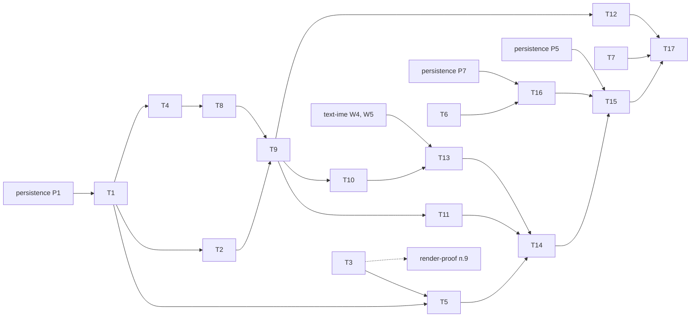

# teardown — задачи

- **Статус:** черновик
- **Дата:** 2026-10-05
- **Design:** [design.md](design.md); требования — [requirements.md](requirements.md); смежная —
  [persistence/tasks.md](../persistence/tasks.md)
- **База:** `main` @ `4915054c8`
- **Итог:** 17 задач, 10 из них `[P]`; ≈ 37,5 инженеро-дня; критический путь 27,5 д

## Правила исполнения

- Задача = worktree (`cargo xtask worktree new teardown/<slug>`) = PR; `cargo xtask check-changed`
  зелёный до ревью. T1, T9, T11, T14 добавляют `changelog.d/<branch-slug>.md`.
- **Контрактные тесты.** T1 вносит типы и сигнатуры с минимальной честной реализацией
  (`todo!`/`unimplemented!` запрещены clippy) и тесты, падающие **по assert**. PR T1 прикладывает
  красный вывод `cargo nextest run … --run-ignored only`; тесты сливаются с
  `#[ignore = "contract: <поведение>"]`. Исполнитель снимает `ignore` и переносит тест строкой в
  таблицу семейства — это его доказательство.
- **Fix** падает с откатанной production-правкой (изолированный checkout, вывод в PR); **хар.**
  (характеризация по design) проходит и на старом коде. В именах тестов, идентификаторах, причинах
  `ignore` и коммитах нет номеров задач и требований.
- **Где:** L — Linux CI; W — Windows нативно (`#[ignore]` или `cargo xtask device windows-notes`,
  датированный прогон); C — дочерний процесс по образцу `opaque_frame_child` (родитель проверяет код,
  маркеры порядка и отсутствие abort; исполняется в L).

## Граф зависимостей

Кросс-фичевые блокеры: **persistence P1 → T1** (сигнатуры `FlushRegistry` используют `StorageName`,
`StoredVersion`, `StorageError`, `Revision`); **text-ime W4/W5 → T13** (хук принятого закрытия,
страховка dispose; W5 по плану 11-04); **persistence P7 → T16** (seam в `tree.rs`); **persistence P5 → T15**
(шаги persistence в `windows-notes`). Обратные: T4, T8 → P5; T4 → P6; T6 → P8; T15 → P9.

## Задачи

| ID | Задача | Требования | Зависит | P | Где | Дн | Статус |
|---|---|---|---|---|---|---|---|
| T1 | Контракт lifecycle (заморозка) | сигнатуры всех R | persistence P1 | — | L | 2,5 | — |
| T2 | ADR обеих фич, PANIC-POLICY | D1, D2, R11 | T1 | [P] | L | 1,5 | — |
| T3 | Trace `native_window_destroyed` (общая с render-proof) | R5; render-proof R13 | — | [P] | W | 0,25 | — |
| T4 | `flui-view`: guard, защёлка, реестр сброса, `detached()` | R3, R6 (реестр) | T1 | [P] | L | 3 | — |
| T5 | `flui-platform`: сеанс Win32, слот `window_proc`, headless-сеанс | R5, R11, R22 | T1, T3 | [P] | L, W | 3 | — |
| T6 | Notes: `DropLedger`, R1 на headless | R1 | — | [P] | L | 1,5 | — |
| T7 | `flui-widgets`: закрытие посреди навигации | R17 | — | [P] | L | 1,5 | — |
| T8 | `flui-runtime`: доставка закрытия, `CallbackPanic`, откат повтора, проводка | R10 | T4 | — | L | 4 | — |
| T9 | `flui-app`: граница owner-turn, терминальный слот, сброс до сервисов | R6, R7, R9, R11–R13 | T2, T8 | — | L, C | 4,5 | — |
| T10 | Характеризация раннера | R1, R2, R4, R10, R15, R16, R18, R20 | T9 | [P] | L | 1,5 | — |
| T11 | `flui-app`: вето с причиной, `PendingClose`, `Program` | R23 | T9 | [P] | L | 1,5 | — |
| T12 | Обход `resume_unwind` из `Drop` (#1165), устаревшие handle | R14, R19 | T9 | [P] | L, C | 3 | — |
| T13 | IME-шаг общей доставки закрытия | R21 | T10, text-ime W4/W5 | — | L | 1 | — |
| T14 | Завершение сеанса в `flui-app` (S1–S6) | R22 | T5, T11, T13 | — | L | 3 | — |
| T15 | `tools/xtask`: live-smoke на Notes, `windows-notes` | R4, R9, R12, R18, R22 | T14, T16, persistence P5 | — | L, W | 3,5 | — |
| T16 | Notes: пример `notes_faults`, строка R8 | R8, R9, R12 | T6, persistence P7 | [P] | L | 0,75 | — |
| T17 | README-матрица, датированный прогон Windows | R24; W-часть R4–R22 | T7, T12, T15 | — | W | 1,5 | — |

## Карточки

**T1. Контракт lifecycle.** Типы: `flui-view` — `CloseReason { User, Program, SessionEnd }`
(`#[non_exhaustive]`), `CloseGuard` (`hold`, `require_decision`, `pending`, `changed`, `can_veto`),
`CloseHold` (`#[must_use]`), `PendingClose` (`reason`, `discard_and_close`, `stay_open`), `CloseChanged`,
`FlushRegistry` (`publish`, `committed`, `outcome`), `FlushState`, `LifecycleContext::{close_guard,
flush_registry}` (по умолчанию `None`), `__runtime::{CloseGuardSource, FlushReport}`, `FlushRegistry::new`,
`flush_within`; `flui-runtime` — `FrameFailureKind::CallbackPanic { message, internal_invariant }`,
`UiRealm::report_contained_panic`; `flui-platform` — `SessionEnd`, `SessionEndAnswer`,
`Platform::on_session_end`, `HeadlessPlatform::simulate_session_end`; `flui-app` — `CloseRequest::reason`,
реэкспорт `CloseReason`; `flui-testing` — `LaidOut::request_close(CloseReason)`, `LaidOut::end_session()`.
Минимум: источник guard не ставит закрытие, `pending()` → `None`, `can_veto` → `false`; реестр хранит
байты, `flush_within` ничего не пишет; `report_contained_panic` пишет только `tracing`;
`simulate_session_end` hook не зовёт; `reason()` → `User`; `request_close` = нынешний `close_lifecycle`.
Тесты и как падают сейчас: `releasing_the_last_hold_queues_one_close` (0 операций вместо 1) и
`a_cancelled_logoff_withdraws_only_the_session_entry` (`pending()` = `None` вместо `User`) —
`crates/flui-view/tests/lifecycle_tests.rs`; `a_registry_entry_published_at_detached_is_written_at_teardown`
— `crates/flui-view/tests/flush_registry.rs`, двойник `MemoryStorage` пуст; `close_delivery_is_idempotent`
— `crates/flui-testing/tests/headless_realm.rs`, Detached дважды; `a_contained_callback_panic_reports_once`
— `crates/flui-runtime/src/ui_realm/tests/frame_failure_containment.rs`, 0 отчётов;
`simulated_session_end_reaches_the_hook` — `crates/flui-platform/tests/headless.rs`;
`a_close_request_carries_its_reason` — in-src `close_request.rs`, `Program` читается как `User`.
Файлы: `crates/flui-view/src/{close_guard.rs, flush_registry.rs, lib.rs, __runtime.rs,
context/build_context.rs}`, `crates/flui-runtime/src/{frame_failure.rs, ui_realm/construct.rs}`,
`crates/flui-platform/src/{traits/platform.rs, platforms/headless/platform.rs}`,
`crates/flui-app/src/{lib.rs, app/close_request.rs}`, `crates/flui-testing/src/widgets.rs`, названные
тест-файлы. Готово: сигнатуры = design, 7 тестов красные по assert и слиты под `ignore`.

**T2. ADR и PANIC-POLICY.** Пять `docs/adr/ADR-XXXX-*.md`: четыре из design teardown (граница
owner-turn и терминальный выход; close guard, причины и реестр сброса; завершение сеанса; drop владельца
завершает наблюдение) и ADR persistence из её design; `Superseded-by` в ADR-0035 и ADR-0040, отметка
шага 8 в ADR-0093; в `docs/PANIC-POLICY.md` — «Callback panics and exit codes» и строка о codec-панике
persistence. Проверка: `cargo xtask checks`. Готово: слит до T9 и persistence P5.

**T3. Trace.** Одна строка `tracing::debug!(target: "flui.platform", event = "native_window_destroyed")`
в ветке `WM_DESTROY` `crates/flui-platform/src/platforms/windows/platform.rs`; отдельный PR, render-proof
п. 9 и T15 его только читают. Проверка: `cargo xtask cross-typecheck`; W — событие одно на окно в логе
Alt+F4.

**T4. `flui-view`.** Состояние guard (запись на причину, отпускание последнего hold — одна операция,
`require_decision` держит), защёлка доставки в `LifecycleSource`, реестр (последние байты побеждают,
одна запись в полёте на имя, перебазирование линии одного издателя, неудача держит байты),
`detached()` в `BuildOwner::drop` (#1126). Файлы: `crates/flui-view/src/{close_guard.rs,
flush_registry.rs, lifecycle.rs, owner/build_owner.rs}`, `tests/{lifecycle_tests.rs, flush_registry.rs,
build_owner_tests.rs}`. Снимает `ignore` трёх тестов T1 уровня `flui-view`; добавляет строки реестра из
таблицы persistence. Проверка: `cargo nextest run -p flui-view`.

**T5. `flui-platform`.** `WM_QUERYENDSESSION`/`WM_ENDSESSION` → `on_session_end`,
`ShutdownBlockReasonCreate/Destroy`, `PostQuitMessage`; не-`BUG:` payload `window_proc` — в слот
owner-состояния Win32 (поле, не `static`), окно отвечает `DefWindowProcW`, `Platform::run` возобновляет
payload; настоящий `simulate_session_end`. Файлы: `crates/flui-platform/src/platforms/{windows,headless}/`,
`tests/{contract.rs, window_callback_unwind.rs, headless.rs}`. Проверка: `cargo nextest run -p
flui-platform`, `cargo xtask cross-typecheck`, `cargo xtask globals`; W — `cargo nextest run -p
flui-platform --run-ignored only win32_`.

**T6. Notes: `DropLedger`** (приложение). Сторожа владения в `tests/fixtures/notes_flow.rs` по образцу
`Readiness::retired`; проверка `cargo nextest run -p flui -E 'binary_id(flui::facade_consumer)'`; сторож,
удержанный нарочно, роняет строку. **T7.** Строки в существующих `crates/flui-widgets/tests/{navigator.rs,
hero_flight.rs, modal_route.rs}`; `cargo nextest run -p flui-widgets`.

**T8. `flui-runtime`.** Общая доставка закрытия (защёлка, место IME-шага, `begin_close`, Detached),
`report_contained_panic`, откат повтора `T·2^min(k−1,6)` с потолком 1 с через очередь дедлайнов
(`checked_mul`, `saturating_add`), обход отката только дискретным вводом; проводка
`close_guard()`/`flush_registry()` в `RealmServices` и `BuildOwner`; headless-хост получает реестр и
настоящие `request_close`/`end_session`. Файлы: `crates/flui-runtime/src/{realm_services.rs,
presentation.rs, frame_failure.rs, ui_realm/{construct.rs, presentation_lifecycle.rs, frame_clock.rs}}`,
`crates/flui-runtime/ARCHITECTURE.md`, `crates/flui-testing/src/{realm.rs, widgets.rs}`,
`crates/flui-testing/tests/{main.rs, headless_realm.rs}`. Снимает `ignore` с `close_delivery_is_idempotent`
и `a_contained_callback_panic_reports_once`. Проверка: `cargo nextest run -p flui-runtime -p flui-testing`.

**T9. `flui-app`, граница.** Per-task catch в `dispatch_platform_realm`, классификация D4, терминальный
слот хоста, catch вокруг `platform.run`, `drop(realms)`/`queued_turns`/`on_quit` под catch, шаг 7
`flush_within` до сервисов (реестр из `storage_host::host_storage`, заморожен persistence P1), `on_close`
без `resume_unwind`, `resume_unwind` → 101; Android — тот же путь (clippy); `# Panics` у
`Application::run`, `run_app`. Файлы: `crates/flui-app/src/app/{application.rs, runner/{realm_dispatch.rs,
desktop.rs, main_window.rs, android.rs}}`, `crates/flui-app/tests/runner_teardown.rs`,
`.config/nextest.toml` (тайм-аут детских тестов). Различает маркер сброса до возобновления, не код 101.
Проверка: `cargo nextest run -p flui-app runner_teardown`, `cargo xtask cross-typecheck`, `cargo xtask globals`.

**T10.** Строки в `crates/flui-app/tests/runner_teardown.rs` (таблица ниже); `the_runner_sleeps_until_the_failure_retry_deadline`
— fix, правка при необходимости в `runner/frame_pacing.rs`. **T11. Вето.** `PendingClose` из `KeepOpen`, `Program` в `AppHandle::request_quit` с отложенным quit,
удаление `with_withdrawal` и `DetachNotifier`. Файлы: `crates/flui-app/src/app/{close_request.rs,
application_control.rs}`. Снимает `ignore` с `a_close_request_carries_its_reason`.

**T12. Обход #1165.** Каждый `resume_unwind`, достижимый из `Drop` в `ui_realm`, `realm_dispatch`,
`element_tree`, `build_owner`, `scheduler`; поля `UiRealm` с пользовательскими значениями — в
`ManuallyDrop`/`Option` с явным уничтожением; итоги в `ARCHITECTURE.md` `flui-runtime`, `flui-app`,
`flui-view`, `flui-scheduler`. Эксперимент риска 1 design: ребёнок с паникой `dispose` и паникующим
`Drop` future — без abort. Тест R19 — в `crates/flui-testing/tests/owner_scope.rs`, строка на тип handle.

**T13. IME-шаг.** Шаг 2 доставки зовёт `complete_composition()` (хук text-ime W4), повтор в dispose —
no-op; `crates/flui-runtime/src/ui_realm/presentation_lifecycle.rs`, `runner_teardown.rs`. **T14. Сеанс.** S1–S6, кэш ответа на одну пачку, `SESSION_END_BUDGET` 3 с, порог 1 с, `SessionEnding`
для извлечённого realm. Файлы: `crates/flui-app/src/app/runner/{session_end.rs, main_window.rs}`,
`close_request.rs`, `runner_teardown.rs`; строки реестра persistence о завершении сеанса.

**T15. xtask.** live-smoke на Notes вместо `sliver_demo` (X11, Wayland; код 0 за ≤ 15 с);
`windows-notes`: программный и двойной close, `notes_faults save-panic` (жив) и `dispose-panic` (101),
сообщения сеанса и перезапуск, `#[ignore]`-тесты T5; шаги persistence (из P9): перезапуск, `taskkill /F`
в цикле записей, файл только для чтения, держатель без `FILE_SHARE_DELETE`, два процесса, сворачивание.
Файлы: `tools/xtask/src/{tasks.rs, device/windows_notes.rs}`, `tools/live-smoke/src/`. Проверка:
`cargo xtask live-smoke` (L), `cargo xtask device windows-notes` (W).

**T16. Notes: `notes_faults`** (приложение). Наполняет заглушку `examples/notes_faults.rs` из
persistence P1 режимами `save-panic`/`dispose-panic` через seam P7; строка R8 в `tests/fixtures/notes_flow.rs`.
**T17. Финал.** README-матрица (R24; строки persistence о потере без вето и о wasm); датированный
прогон Windows по W-строкам, ссылка в #1147. Готово: `rg 'contract:' crates` пусто, протокол в PR.

## Требование → тест

| R | Тест или прогон | Задача | Вид | Где |
|---|---|---|---|---|
| R1 | `notes_close_releases_every_owner_after_navigation`; `last_window_close_releases_the_realm_through_the_runner` | T6; T10 | хар. | L |
| R2 | `closing_with_a_pending_load_retires_the_future_once` | T10 | хар. | L |
| R3 | `dropping_an_owner_with_an_observer_detaches_it_once` | T4 | fix | L |
| R4 | `last_window_close_returns_ok_on_both_routes`; live-smoke Notes; `windows-notes` | T10; T15 | хар.; fix | L, W |
| R5 | `win32_close_drains_platform_map_entry`; прогон | T5; T17 | хар. | W |
| R6 | `a_write_past_the_deadline_leaves_a_whole_file_and_exits_ok` | T9 | fix | L |
| R7 | `teardown_panic_flushes_the_registry_before_resuming` | T9 | fix | C |
| R8 | `a_panicking_note_build_shows_error_view_and_other_screens_work` | T16 | хар. | L |
| R9 | `a_panicking_tap_handler_reports_once_and_the_next_tap_works`, `a_panicking_post_frame_callback_reports_once_and_the_next_frame_builds`; `notes_faults save-panic` | T9; T15 | fix | C, W |
| R10 | `a_repeating_paint_panic_backs_off_but_keeps_retrying`, `a_single_paint_panic_redraws_without_input`, `a_pointer_move_does_not_bypass_the_backoff`, `a_failure_streak_past_thirty_three_keeps_the_one_second_cap`; `the_runner_sleeps_until_the_failure_retry_deadline` | T8; T10 | fix | L |
| R11 | `user_panic_exit_code_matrix`; `a_non_bug_panic_at_the_window_proc_resumes_as_101` | T9; T5 | fix | C, W |
| R12 | `dispose_panic_on_last_window_close_resumes_after_flush`; `notes_faults dispose-panic` → 101 | T9; T15 | fix | C, W |
| R13 | `capture_drop_panic_keeps_the_first_failure_and_still_flushes` | T9 | fix | C |
| R14 | `user_drop_panic_inside_an_unwind_is_retained` | T12 | хар. | C |
| R15 | `close_requested_inside_a_frame_runs_once_on_the_next_turn` | T10 | хар. | L |
| R16 | `a_late_completion_after_close_requests_no_frame` | T10 | хар. | L |
| R17 | `closing_mid_transition_releases_the_route_overlay_and_hero`, `removing_the_observer_mid_flight_ends_the_flight` (#1195), `dropping_the_last_navigator_handle_after_push_clears_the_modal_registry` (#1066) | T7 | хар. | L |
| R18 | `a_second_close_request_tears_down_once`; Alt+F4, затем программный close | T10; T15 | хар. | L, W |
| R19 | `stale_handles_refuse_after_realm_drop` | T12 | хар. | L |
| R20 | `device_loss_on_the_closing_frame_still_exits_ok` | T10 | хар. | L |
| R21 | `closing_during_composition_commits_before_detached`; прогон | T13; T17 | fix | L, W |
| R22 | `session_end_flushes_the_registry_within_the_framework_budget`, `session_end_with_a_checked_out_realm_writes_registry_bytes_and_calls_no_user_code`; сообщения сеанса окну Notes | T14; T15 | fix | L, W |
| R23 | `a_vetoed_close_disposes_nothing`; есть `a_panicking_handler_vetoes_and_stays_registered` | T11 | хар. | L |
| R24 | строка README | T17 | — | — |
| — | `close_delivery_is_idempotent` (T8); `releasing_the_last_hold_queues_one_close`, `a_registry_entry_published_at_detached_is_written_at_teardown` (T4); `a_cancelled_logoff_withdraws_only_the_session_entry` (T4, T14); `the_query_cache_ends_with_its_burst` (T14) | — | fix | L |

## Владельцы общих файлов (одни на обе фичи)

| Файл | Владелец | Через владельца |
|---|---|---|
| `Cargo.lock`, корневой `Cargo.toml` | persistence P1 | `dirs`; фичи `persist`/`storage`; фича `windows` `Win32_System_Shutdown` для T5; `required-features` Notes; `[[example]] notes_faults` с заглушкой для T16; `TEST_FEATURES` |
| ADR: новые `ADR-XXXX`, отметки в ADR-0035, ADR-0040, ADR-0093 | T2 | ADR persistence |
| `docs/PANIC-POLICY.md` | T2 | строка persistence о codec-панике |
| `crates/flui-view/tests/main.rs` | persistence P1 | `mod flush_registry` (наполняет T1) |
| `crates/flui-app/tests/main.rs` | persistence P1 | `mod runner_teardown` (наполняет T9); модуль render-proof — по порядку слияния |
| `crates/flui-platform/tests/main.rs` | persistence P1 | teardown пишет в существующие модули |
| `crates/flui-testing/tests/main.rs` | T8 | T1, T12 пишут в существующие модули |
| `.config/nextest.toml` | T9 | persistence правок не вносит |
| `src/lib.rs` (фасад) | persistence P1 | teardown правок не вносит (`CloseReason` реэкспортирует `flui-app`) |
| `examples/two_screens/` | persistence P7 | seam `save-panic`/`dispose-panic` для T16 |

Порядок по прочим спорным файлам: `tests/fixtures/notes_flow.rs` — T6 → T16 → persistence P8;
`tools/xtask/src/device/windows_notes.rs` — только T15; `crates/flui-runtime/src/realm_services.rs` —
persistence P1 → T8; Win32 `platform.rs` — T3 → T5; `README.md` — T17.

## Критический путь

persistence P1 (3) → T1 (2,5) → T4 (3) → T8 (4) → T9 (4,5) → T10 (1,5) → T13 (1) → T14 (3) → T15 (3,5) →
T17 (1,5) = **27,5 инженеро-дня**. От 10-06 T13 могла бы начаться ≈ 10-30, но ждёт text-ime W5 (11-04): +3 дня,
финиш ≈ 11-17. Почти критичны T16 (≈ день 15) и T11; у T2, T3, T5, T6, T7, T12 запас ≥ 5 дней.
