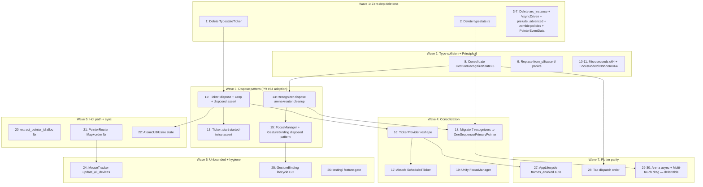

# Mythos Audit: `flui-interaction` × `flui-scheduler`

> Deep audit across the FLUI **input + frame-loop layer** — 50 source files, ~21.4K LOC — followed by cross-reference against Flutter `gestures/` (26 .dart) + `scheduler/` (5 .dart).
>
> Goal: identify zombie abstractions, parallel state-machines, half-implemented hot paths, FSM drift from Flutter, lifecycle leaks, sync contention, and Constitution Principle violations — without breaking active integration with `flui-platform`, `flui-engine`, or `flui-view`.
>
> **Cycle**: this audit continues the audit-execute series that produced PRs #81/#82/#83/#84 against `vanyastaff/flui`. Previous cycle audited the framework spine (`flui-view` × `flui-tree` × `flui-foundation`); see [`2026-05-21-view-tree-foundation-audit.md`](2026-05-21-view-tree-foundation-audit.md) → closed as PR #84.

---

## Table of Contents

- [Part I — flui-interaction Self-Audit](#part-i--flui-interaction-self-audit)
- [Part II — flui-scheduler Self-Audit](#part-ii--flui-scheduler-self-audit)
- [Part III — Flutter Cross-Reference](#part-iii--flutter-cross-reference)
  - [Section 1 — flui-interaction vs gestures/](#section-1--flui-interaction-vs-fluttergestures)
  - [Section 2 — flui-scheduler vs scheduler/](#section-2--flui-scheduler-vs-flutterscheduler)
- [Part IV — Combined Priority Order](#part-iv--combined-priority-order)
- [Appendix A — Investigation Trail](#appendix-a--investigation-trail)

---

# Part I — flui-interaction Self-Audit


## Mythos Improvement Verdict

Архитектура крейта **structurally promising но имеет три большие гнилые зоны**: (a) **parallel state-machine scaffolding**, (b) **half-implemented critical API surface**, (c) **silent drift from Flutter semantics в нескольких hot paths**. Arena, team, velocity tracker — production-grade. Recognizers — single-state-machine port + ad-hoc enums + Mutex-heavy. Focus — two parallel managers одной из которых half-implemented stub. Public surface bloated re-exports.

**Three best things:**
1. `GestureArena` (1628 LOC) — solid Flutter port: eager winner, hold/release semantics, team resolution. FLUI adds force-timeout (`resolve_timed_out_arenas`) — strict improvement over Flutter. Tests are thorough (~700 LOC).
2. `VelocityTracker` (672 LOC) — Flutter-faithful least-squares polynomial fit with stack-allocated arrays (no heap per estimate), three strategies (LeastSquares/Linear/TwoSample), correct 100ms horizon + exponential weighting. *Rust Performance Book* zero-cost stack alloc.
3. `TransformGuard` (hit_test.rs:384-399) — RAII-driven push/pop transform stack. Idiomatic Rust over Flutter's manual push/popTransform pairs. Sound Rust-native improvement.

**Worst complexity tax:**
1. **Two enums named `GestureRecognizerState` with different shapes**, re-exported under THREE names (`PrimaryPointerState`, `PrimaryPointerStateHelper`, `GestureRecognizerState`) from `recognizers/mod.rs:74-79`. Concrete recognizers (tap/drag/scale/etc.) bypass the canonical FSM entirely.
2. **Two FocusManager implementations** living in parallel — `focus.rs::FocusManager` (flat-state, used by `global()`) vs `focus_scope.rs::FocusManagerInner` (tree-based, internal only). `FocusManager::focus_next()` (focus.rs:270) is `tracing::warn!("...not yet implemented")` while `FocusScopeNode::focus_next_in_scope()` (focus_scope.rs:663) is fully implemented and unused.
3. **typestate.rs (232 LOC) + OneSequenceGestureRecognizer + PrimaryPointerGestureRecognizer + their helper structs (~823 LOC)** — pure scaffolding with zero implementers across the workspace. Architecture theater, the third "fear wearing a generic parameter" pattern this audit family has spotted.

**Where dead code hides:**
- `typestate.rs` (232 LOC) — 13 zero-sized markers, zero consumers in workspace, including flui-interaction's own modules.
- `recognizers/one_sequence.rs` (341 LOC) + `recognizers/primary_pointer.rs` (481 LOC) — base traits with zero `impl ... for` blocks.
- `testing/` submodule (1099 LOC) — production module tree, no feature gate. Ships in release binaries.
- `OrderedTraversalPolicy` + `DirectionalFocusPolicy` (focus_scope.rs:840-961) — alternative policies never assigned to any `FocusScopeNode`.
- `PointerEventData` + `PointerEventKind` + `make_pointer_event` (events.rs:135-249, 695-756) — parallel "compatibility" struct used only by testing module.

**`FocusManager::focus_next` is decoration** — `tracing::warn!("not yet implemented")` instead of unwinding the tree machinery that already exists in `FocusScopeNode::focus_next_in_scope`. Tab navigation, the single most-used keyboard API in any UI framework, is a log line.

**`MouseTracker::update_all_devices` is a no-op** — `tracing::trace!("update_all_devices called")` instead of re-hit-testing devices. Hover state on moving UI is broken.

**Biggest optimization opportunity** — consolidate the four state-machine systems (recognizer.rs::GestureRecognizerState struct + primary_pointer.rs::GestureRecognizerState enum + typestate.rs::GestureReady/Possible/etc. + recognizer.rs::GestureState enum) into ONE canonical Flutter-faithful 3-state enum + ONE shared base struct + migrate the 7 concrete recognizers. Estimated 1500 LOC delta (delete + migrate). Plus consolidate the two FocusManager implementations. Plus delete 1700+ LOC of zombie traits/helpers/testing-in-production.

**Не трогать**: `GestureArena` (correct + thorough tests), `GestureArenaTeam` (correct team-combiner), `VelocityTracker` (Flutter-faithful + Rust-improved), `TransformGuard` RAII (idiomatic Rust), `PointerEventResampler` (not deeply audited but appears sound), `RawInputHandler` (cleanly separated raw mode), `ScaleGestureRecognizer` arithmetic (if it matches Flutter, leave it — spot-check before touching), `ChangeNotifier` reentrancy pattern in arena.rs sweep+release.

---

## Project Map

```text
flui-interaction (19.4K LOC, 38 files, 11 modules)
  owns: GestureBinding singleton + impl_binding_singleton! (binding.rs, 575 LOC),
        GestureArena (arena.rs, 1628 LOC) — eager-winner FSM + team resolution +
          DEFAULT_DISAMBIGUATION_TIMEOUT + force_resolve_if_timed_out,
        GestureArenaTeam (team.rs, 618 LOC), PointerSignalResolver (signal_resolver.rs, 399 LOC),
        Recognizers: GestureRecognizer base (recognizer.rs, 279 LOC) + PrimaryPointer (481 LOC) +
          OneSequence (341 LOC) + Tap (455 LOC) + DoubleTap (541 LOC) + LongPress (650 LOC) +
          Drag (602 LOC) + Scale (715 LOC) + ForcePress (699 LOC) + MultiTap (622 LOC),
        Routing: EventRouter (event_router.rs, 317 LOC) + PointerRouter (615 LOC) +
          HitTestResult + HitTestEntry + TransformGuard (hit_test.rs, 605 LOC) +
          FocusManager (focus.rs, 755 LOC) + FocusScopeNode (focus_scope.rs, 1170 LOC),
        Processing: VelocityTracker + LSQ solver (velocity.rs, 672 LOC) +
          PointerEventResampler (resampler.rs, 374 LOC) + InputPredictor (prediction.rs, 504 LOC) +
          RawInputHandler (raw_input.rs, 677 LOC),
        MouseTracker (mouse_tracker.rs, 522 LOC), Settings (settings.rs, 465 LOC),
        GestureTimerService (timer.rs, 654 LOC), Testing: GestureBuilder + Recorder + Player +
          ModifiersBuilder (input.rs 264 LOC + recording.rs 835 LOC),
        Events: Event + InputEvent + PointerEventData (compatibility) + ScrollEventData +
          PointerEventExt + PointerEventKind + make_*_event test helpers (events.rs, 813 LOC),
        IDs: PointerId(i32) + FocusNodeId(NonZeroU64) + HandlerId(NonZeroU64) +
          DeviceId = i32 + RegionId = RenderId reexport (ids.rs, 330 LOC),
        sealed::{CustomGestureRecognizer, CustomHitTestable, arena_member::Sealed}
          (sealed.rs, 209 LOC),
        traits.rs (297 LOC) — Disposable, DragAxis, GestureCallback, GestureRecognizerExt,
          HitTestTarget, PointerEventExtTrait
  depends on: flui-types, flui-foundation, ui-events, cursor-icon, parking_lot, once_cell,
              dashmap, crossbeam, smallvec, bitflags, futures, tracing, dpi, tokio
  public surface: ~80 top-level + 45 prelude exports (lib.rs:186-251 + 265-301)
  suspected hot paths:
    - extract_pointer_id (events.rs:671): per-event DefaultHasher allocation + hash;
      called on EVERY pointer event for every dispatch path (binding + router)
    - GestureBinding::handle_pointer_event (binding.rs:237): DashMap insert/get/remove
      per event; Mutex<ArenaEntryData> contention through `accept`/`reject`/`close`
    - PointerRouter::route (routing/pointer_router.rs): per-pointer route map traversal
    - HitTestResult::add (hit_test.rs): grows SmallVec per push, transform stack
    - VelocityTracker::add_position (velocity.rs): LSQ solver per add (numerical)
  risk:
    - Singleton coordinator GestureBinding holds DashMap<PointerId, HitTestResult>
      and DashMap<PointerId, PointerEvent>. Hit-test cache is removed on Up/Cancel,
      pending_moves cleared on flush — but ZERO eviction if pointer is dropped or
      synthesized Cancel never arrives (e.g. device disconnect mid-down).
    - PointerEventData (events.rs:135) is a parallel struct over ui-events::PointerEvent
      with hand-rolled `from_pointer_event` conversion (events.rs:213-249) — DUPLICATION
      with `PointerEventExt::position` (events.rs:439). Two extraction APIs side-by-side.
    - PointerId(i32) loses niche optimization: Option<PointerId> = 8 bytes vs PointerId = 4
      (i32 has no zero-niche). FocusNodeId(NonZeroU64) gets it right.
    - extract_pointer_id allocates DefaultHasher per call (events.rs:680-688). Hot path.
    - sealed.rs CustomGestureRecognizer / CustomHitTestable extensibility points — verify
      consumers.
    - testing/ submodule is in production module tree (not gated by #[cfg(test)] or feature)
      — 1099 LOC of test infrastructure shipped in release builds.
    - focus.rs (755 LOC) + focus_scope.rs (1170 LOC) — 1925 LOC dedicated to focus
      management. Flutter's focus is in widgets/focus_*.dart, separate layer. Verify
      whether all of this belongs in flui-interaction vs flui-view.
```

**Cross-crate dependency DAG** (clean):

```
flui-interaction → flui-foundation, flui-types
                 → ui-events (W3C events), cursor-icon, dpi
                 → parking_lot, dashmap, crossbeam, smallvec, futures, tracing, tokio
```

No upward deps. flui-view consumes flui-interaction (per `crates/flui-view/Cargo.toml`).

## Findings

### 💀 [DUPLICATION | CRITICAL]: Two `GestureRecognizerState` types — same name, different shape, both re-exported

**Evidence:**
- [`crates/flui-interaction/src/recognizers/recognizer.rs:59`](../../crates/flui-interaction/src/recognizers/recognizer.rs) — `pub struct GestureRecognizerState { arena: GestureArena, primary_pointer: Arc<Mutex<Option<PointerId>>>, initial_position: Arc<Mutex<Option<Offset<Pixels>>>>, disposed: Arc<Mutex<bool>> }`. This is a state-**container** struct.
- [`crates/flui-interaction/src/recognizers/primary_pointer.rs:60`](../../crates/flui-interaction/src/recognizers/primary_pointer.rs) — `pub enum GestureRecognizerState { Ready, Possible, Accepted, Defunct }`. This is a state-**machine enum**.
- [`crates/flui-interaction/src/recognizers/mod.rs:76`](../../crates/flui-interaction/src/recognizers/mod.rs) — both re-exported, the enum aliased as `PrimaryPointerState`:
  ```rust
  pub use primary_pointer::{
      GestureRecognizerState as PrimaryPointerState, PrimaryPointerGestureRecognizer,
      PrimaryPointerState as PrimaryPointerStateHelper,
  };
  pub use recognizer::{GestureRecognizer, GestureRecognizerState, GestureState, constants};
  ```
  The `recognizer::GestureRecognizerState` is exported under its original name; the `primary_pointer::GestureRecognizerState` enum is re-exported only as `PrimaryPointerState`. Meanwhile `PrimaryPointerState` (the **helper struct** at primary_pointer.rs:230) is re-exported as `PrimaryPointerStateHelper`. **Three names referring to two types, with the same primary name shared by two unrelated types.**
- Adding a fourth confusion: [`crates/flui-interaction/src/recognizers/recognizer.rs:183`](../../crates/flui-interaction/src/recognizers/recognizer.rs) — `pub enum GestureState { Ready, Possible, Started, Accepted, Rejected }` — a third state machine, also re-exported (mod.rs:79).
- Only one type actually used by concrete recognizers: `tap.rs:61`, `scale.rs:105` use `recognizer::GestureRecognizerState` (the container struct). The enum in primary_pointer.rs and the `GestureState` enum have zero `match` consumers among the seven concrete recognizers.

**Why it exists:**
Three iterations of the same idea co-exist: (1) a state-container, (2) a state-machine enum following Flutter's `GestureRecognizerState` (the canonical one — `flutter/lib/src/gestures/recognizer.dart:103`), (3) an aspirational `GestureState` general-purpose enum. None of the seven concrete recognizers fully adopted the canonical Flutter FSM; tap/scale use only the container; the rest use ad-hoc bool flags (see `TapState` at tap.rs:91-96).

**Cost today:**
- API surface lies — `use flui_interaction::prelude::*;` exposes both `GestureRecognizerState` types AND `GestureState`, IDE autocomplete gives three near-namesake options.
- Concrete recognizers don't follow Flutter's canonical FSM despite the scaffolding existing — drift from Flutter parity baseline.
- Sealed `arena_member::Sealed` impl list at `sealed.rs:194-201` enumerates 7 built-in recognizers, none of them use `PrimaryPointerGestureRecognizer`.

**Risk of changing:**
Low. Zero external impl of `PrimaryPointerGestureRecognizer`, zero consumers of `GestureState`, zero external uses of `PrimaryPointerState`/`PrimaryPointerStateHelper`. Internal — `tap.rs`/`scale.rs` use the container struct directly, easy to keep as `RecognizerBaseState` (rename) without breaking call sites.

**Recommendation:** **Consolidate to one canonical FSM**. Pick the Flutter-faithful enum (Ready/Possible/Accepted/Defunct from primary_pointer.rs) and migrate all seven recognizers to use it. Rename `recognizer::GestureRecognizerState` to `RecognizerBaseState` (container) so the FSM enum owns the name. **Delete `GestureState` enum**. **Delete `PrimaryPointerState as PrimaryPointerStateHelper`** alias — names collide.

**Patch sketch:**
```rust
// crates/flui-interaction/src/recognizers/recognizer.rs — rename struct:
pub struct RecognizerBaseState { /* arena, primary_pointer, initial_position, disposed */ }
// delete pub enum GestureState; --- nobody matches on it

// crates/flui-interaction/src/recognizers/primary_pointer.rs — keep canonical:
pub enum GestureRecognizerState { Ready, Possible, Accepted, Defunct }

// crates/flui-interaction/src/recognizers/mod.rs — clean re-exports:
pub use primary_pointer::{GestureRecognizerState, PrimaryPointerGestureRecognizer, PrimaryPointerState};
pub use recognizer::{GestureRecognizer, RecognizerBaseState, constants};
```

Then migrate tap.rs / double_tap.rs / drag.rs / scale.rs / etc. to track `GestureRecognizerState` per Flutter's FSM (`recognizer.dart:81-115`).

---

### 💀 [ZOMBIE | CRITICAL]: `typestate.rs` (232 LOC) — 13 zero-sized markers, zero workspace consumers

**Evidence:**
- [`crates/flui-interaction/src/typestate.rs`](../../crates/flui-interaction/src/typestate.rs) — 232 LOC defining 13 zero-sized state markers: `ArenaOpen`, `ArenaHeld`, `ArenaClosed`, `ArenaResolved`, `GestureReady`, `GesturePossible`, `GestureStarted`, `GestureAccepted`, `GestureRejected`, `DragIdle`, `DragPending`, `DragActive`, `Unfocused`, `Focused` + 4 marker traits (`ArenaState`, `GestureStateMarker`, `DragStateMarker`, `FocusStateMarker`) + `State<S>` wrapper.
- `pub mod typestate;` declared at lib.rs:135. Module is `pub` but not re-exported from prelude.
- Grep `ArenaOpen|ArenaHeld|ArenaClosed|ArenaResolved|GestureReady|GesturePossible|GestureStarted|GestureAccepted|GestureRejected|DragIdle|DragPending|DragActive` across workspace: **only matches in `typestate.rs` itself**.
- Grep `crate::typestate::|typestate::` across flui-interaction: 1 match — `typestate.rs:146` (a doc comment).
- The actual arena FSM (`arena.rs:241-263 ArenaEntryData`) uses runtime `is_open: bool`, `is_held: bool`, `is_resolved: bool`. The typestate markers were never wired into the API.

**Why it exists:**
Architectural aspiration — encode arena/gesture/drag/focus states in the type system for compile-time correctness. Sound idea in isolation, but conflicts with the existing `Arc<DashMap>` arena (which stores polymorphic entries indexed by `PointerId`) — you cannot encode per-pointer state in a single arena type. The author identified the pattern but never integrated it.

**Cost today:**
- 232 LOC of code + tests for unused machinery.
- Public API surface — `pub mod typestate;` makes everything reachable, IDE autocomplete pollution.
- Mythos "fear wearing a generic parameter" smell — the doc-comments at typestate.rs:6-28 advertise the pattern but no production code instantiates `State<GestureReady>` or similar.

**Risk of changing:**
Trivial. **Delete the file**. Zero consumers anywhere.

**Recommendation:** **delete `crates/flui-interaction/src/typestate.rs`** entirely + remove `pub mod typestate;` from lib.rs:135. If a real typestate pattern materializes (e.g., a `RecognizerBuilder<Initial> → RecognizerBuilder<Configured>`), introduce it locally to the consumer module — not as a workspace-wide marker zoo.

---

### 💀 [ZOMBIE | CRITICAL]: `OneSequenceGestureRecognizer` + `PrimaryPointerGestureRecognizer` traits + `OneSequenceState`/`PrimaryPointerState` helpers (823 LOC) — zero implementers

**Evidence:**
- [`crates/flui-interaction/src/recognizers/one_sequence.rs`](../../crates/flui-interaction/src/recognizers/one_sequence.rs) — 341 LOC. `pub trait OneSequenceGestureRecognizer: GestureArenaMember` with 8 methods (`start_tracking_pointer`, `stop_tracking_pointer`, `is_tracking_pointer`, `tracked_pointer`, `initial_transform`, `set_initial_transform`, `settings`, `set_settings` + `stop_tracking_all`, `resolve_arena` defaults). Plus `OneSequenceState` helper struct (157-268).
- [`crates/flui-interaction/src/recognizers/primary_pointer.rs`](../../crates/flui-interaction/src/recognizers/primary_pointer.rs) — 481 LOC. `pub trait PrimaryPointerGestureRecognizer: OneSequenceGestureRecognizer` + `PrimaryPointerState` helper (230-363).
- Grep `impl OneSequenceGestureRecognizer for|impl PrimaryPointerGestureRecognizer for` across workspace: **zero hits** outside docs and the trait definition files themselves.
- The seven concrete recognizers in `recognizers/` (tap, double_tap, long_press, drag, scale, multi_tap, force_press) **none** use `OneSequenceGestureRecognizer` as a bound or impl it. Each rolls its own pointer-tracking via `recognizer::GestureRecognizerState` (the container struct) + ad-hoc state enums (`TapState` at tap.rs:91, `DragState` at drag.rs, `ScaleState` at scale.rs, etc.).
- `resolve_arena` impl (one_sequence.rs:138-149) is a stub: the accept-path is commented out (`// arena.accept(pointer, self_arc);`) with explanatory comment "Need to get self as Arc - this is typically done via a stored reference / The actual implementation would use the recognizer's stored Arc / `let _ = (arena, pointer); // Placeholder`". **The default impl is a deliberate no-op marked as placeholder.**

**Why it exists:**
Flutter parity scaffolding. Flutter has `OneSequenceGestureRecognizer extends GestureRecognizer` and `PrimaryPointerGestureRecognizer extends OneSequenceGestureRecognizer` as abstract base classes (`flutter/lib/src/gestures/recognizer.dart:443-621`). FLUI replicated the inheritance chain as Rust traits, but the concrete recognizers were written independently. The traits became orphaned scaffolding.

**Cost today:**
- 823 LOC of unused trait machinery (one_sequence.rs 341 + primary_pointer.rs 481 + helper duplication).
- API surface pollution — both traits + both helpers in `recognizers::*` re-export and the prelude.
- Documentation lies — recognizers/mod.rs:6-23 ASCII diagram shows `OneSequenceGestureRecognizer` and `PrimaryPointerGestureRecognizer` as if recognizers extend them. They don't.
- Resolves-as-placeholder pattern violates Constitution Principle 6 ("No `unwrap()`/`println!`/`dbg!`") in spirit — default impl `let _ = (arena, pointer); // Placeholder` is a silent functional no-op shipped as production.

**Risk of changing:**
Medium-high to fix correctly — either (a) **migrate** the seven concrete recognizers to actually implement the canonical Flutter trait chain (significant rewrite per recognizer, ~50-150 LOC each), or (b) **delete** the traits and accept that recognizers each handle their own state. **(a) is the Flutter-port discipline answer** — STRATEGY.md "Behavior loyal" — and matches the [[no-quick-wins-vanyastaff]] memory: execute the migration, don't leave parallel scaffolding.

**Recommendation:** **Plan migration: rewrite the seven concrete recognizers to implement `OneSequenceGestureRecognizer` (single-pointer recognizers) and `PrimaryPointerGestureRecognizer` (tap, long_press, force_press)**. ScaleGestureRecognizer + MultiTapGestureRecognizer are multi-pointer — they need a separate `MultiPointerGestureRecognizer` trait (which Flutter does not have — it inlines multi-pointer logic in `multidrag.dart` / `scale.dart`). Either:
  - **(a)** Bite the migration (best Flutter parity, ~1500 LOC rewrite).
  - **(b)** Delete the unused traits + `OneSequenceState`/`PrimaryPointerState` helpers (823 LOC removed, recognizers stay as-is). Update recognizers/mod.rs:6-23 docs to reflect reality.

Per the no-quick-wins discipline, **(a) is correct**. Migration tracked as N+1 atomic commits, one recognizer per commit.

---

### 💀 [DUPLICATION | HIGH]: `PointerEventData` parallel struct over `ui_events::pointer::PointerEvent`

**Evidence:**
- [`crates/flui-interaction/src/events.rs:135`](../../crates/flui-interaction/src/events.rs) — `pub struct PointerEventData { position, local_position, device_kind, device, buttons, pressure, time_stamp }` with hand-rolled builder methods (`with_device`, `with_pressure`, `with_buttons`, `with_time_stamp`) and `from_pointer_event(event: &PointerEvent) -> Option<Self>` (lines 213-249). Doc comment: "This struct provides compatibility with legacy gesture recognizers while wrapping W3C-compliant ui-events underneath." (line 131)
- [`crates/flui-interaction/src/events.rs:429`](../../crates/flui-interaction/src/events.rs) — `PointerEventExt::position(&self) -> Offset<Pixels>` + `pointer_type(&self) -> Option<PointerType>` extension trait reaches into the same `ui_events::PointerEvent` fields with no allocation.
- [`crates/flui-interaction/src/events.rs:707`](../../crates/flui-interaction/src/events.rs) — `make_pointer_event(kind: PointerEventKind, data: PointerEventData) -> PointerEvent` — the reverse direction, used only by the testing module.
- Grep `PointerEventData` workspace: only consumers are `events.rs` (self) and `testing/input.rs` (gesture builder). **No recognizer, router, or arena uses `PointerEventData` — they all consume `ui_events::PointerEvent` directly** (tap.rs:300-316, drag.rs, scale.rs, all recognizer dispatch).

**Why it exists:**
Before the migration to W3C `ui-events`, FLUI had its own `PointerEvent` shape (likely matching Flutter's `PointerDownEvent`/`PointerMoveEvent`/`PointerUpEvent`). The migration kept `PointerEventData` as a "compatibility" struct for legacy code paths that never actually got rewritten — and the testing module became the sole production consumer.

**Cost today:**
- 1 struct + 8 methods + reverse conversion = ~120 LOC of dead path.
- "legacy gesture recognizers" mentioned in doc comment **don't exist anymore** — all seven recognizers consume `PointerEvent` directly.
- The `make_pointer_event` reverse conversion (lines 707-756) builds full `ui_events::PointerButtonEvent` / `PointerUpdate` structures with default-everything — used only by testing/input.rs GestureBuilder.

**Risk of changing:**
Low. Migrate testing/input.rs GestureBuilder to construct `ui_events::PointerEvent` directly via `make_down_event` / `make_up_event` / `make_move_event` helpers (events.rs:516-660) — those already exist and are the canonical way. Delete `PointerEventData` + `from_pointer_event` + `make_pointer_event` + `PointerEventKind`.

**Recommendation:** **Delete `PointerEventData`, `PointerEventKind`, `make_pointer_event`**. Migrate `testing/input.rs::GestureBuilder` to use existing `make_*_event` helpers. Saves ~150 LOC, eliminates redundant conversion path. The `PointerEventExt::position` extension trait already covers the legitimate use case (extract position from `PointerEvent`).

---

### 💀 [PERFORMANCE | HIGH]: `extract_pointer_id` allocates a `DefaultHasher` per pointer event (events.rs:671)

**Evidence:**
- [`crates/flui-interaction/src/events.rs:671`](../../crates/flui-interaction/src/events.rs):
  ```rust
  #[inline]
  pub fn extract_pointer_id(event: &PointerEvent) -> crate::ids::PointerId {
      let info = match event { /* ... */ };
      let raw_id = match info.pointer_id {
          Some(p) if p.is_primary_pointer() => 0,
          Some(p) => {
              use std::hash::{Hash, Hasher};
              let mut hasher = std::collections::hash_map::DefaultHasher::new();
              p.hash(&mut hasher);
              (hasher.finish() & 0x7FFFFFFF) as i32
          }
          None => 0,
      };
      crate::ids::PointerId::new(raw_id)
  }
  ```
- Called on every pointer event: `binding.rs:243` (Down), `binding.rs:263` (Move), `binding.rs:270` (Up/Cancel), `binding.rs:284` (Enter/Leave), `binding.rs:291` (Scroll), `binding.rs:309` (Gesture). Plus PointerRouter ingest and any test/recording harness.
- The duplicate hashing logic also appears in `events.rs:230-237` (`PointerEventData::from_pointer_event`) and `events.rs:323-336` (`InputEvent::device_id`). Three copies of the same allocate-then-hash pattern.
- `DefaultHasher::new()` is `SipHasher13` per std lib — heap allocates internal state. Per *Rust Performance Book* "Hashing": stateful hashers are bad on hot paths; `FxHash` (`rustc-hash`) or `ahash` are zero-allocation.

**Why it exists:**
Need stable `i32` `PointerId` for legacy interface, but `ui_events::pointer::PointerId` is a non-numeric persistent ID with a `Hash` impl. Hashing was the chosen reduction to `i32`.

**Cost today:**
- Per-pointer-event allocation on Move events (~100Hz on touch, 1kHz on high-DPI mice). At 1kHz with 4 active pointers: 4000 DefaultHasher allocations/sec just for ID extraction.
- Triple duplication: events.rs:680, events.rs:230, events.rs:323. Fix one site, miss the others.

**Risk of changing:**
Low. Either: (a) cache the `ui_events::PointerId → flui PointerId` mapping in a `dashmap::DashMap<ui_events::PointerId, crate::ids::PointerId>` per `GestureBinding` (more memory, zero hashing on subsequent events); (b) widen `flui::ids::PointerId` to wrap `ui_events::PointerId` (i.e. `NonZeroU64`) directly and drop the lossy hash conversion entirely; (c) use a zero-allocation hasher (`rustc-hash::FxHasher` is already in the workspace tree — check `cargo tree`).

**Recommendation:** **(b) is best** — change `PointerId` from `(i32)` to wrap `ui_events::pointer::PointerId` directly (it's already `Copy + Eq + Hash`). Lose nothing semantically, gain stable round-trip, eliminate three call sites. Also restores niche optimization: `Option<PointerId>` becomes the same size as `PointerId` (the `i32` newtype doesn't have a zero-niche — `Option<PointerId> = 8 bytes` today vs `PointerId = 4 bytes`).

**Patch sketch:**
```rust
// crates/flui-interaction/src/ids.rs
#[derive(Clone, Copy, PartialEq, Eq, Hash, PartialOrd, Ord)]
#[repr(transparent)]
pub struct PointerId(ui_events::pointer::PointerId);

impl PointerId {
    pub const MOUSE: Self = Self(ui_events::pointer::PointerId::PRIMARY);
    pub const fn new(raw: ui_events::pointer::PointerId) -> Self { Self(raw) }
    pub const fn get(self) -> ui_events::pointer::PointerId { self.0 }
}

// crates/flui-interaction/src/events.rs
#[inline]
pub fn extract_pointer_id(event: &PointerEvent) -> crate::ids::PointerId {
    let info = get_pointer_info(event).expect("event must have pointer info");
    crate::ids::PointerId::new(info.pointer_id.unwrap_or(ui_events::pointer::PointerId::PRIMARY))
}
```

Ripples into: PointerRouter (`HashMap<PointerId, ...>` keying — unchanged), GestureArena (`DashMap<PointerId, ...>` — unchanged), all recognizers that pattern-match on PointerId — minimal.

---

### 💀 [HALF-IMPLEMENTED | CRITICAL]: `FocusManager::focus_next()` + `focus_previous()` are `tracing::warn!` stubs while `FocusScopeNode` already implements them

**Evidence:**
- [`crates/flui-interaction/src/routing/focus.rs:270-272`](../../crates/flui-interaction/src/routing/focus.rs):
  ```rust
  pub fn focus_next(&self) {
      tracing::warn!("focus_next() not yet implemented - needs focus scope support");
  }
  ```
- Same file lines 282-284 — `focus_previous()` identical stub.
- BUT [`crates/flui-interaction/src/routing/focus_scope.rs:663-688`](../../crates/flui-interaction/src/routing/focus_scope.rs) — `FocusScopeNode::focus_next_in_scope` and `focus_previous_in_scope` **are fully implemented**, including the `ReadingOrderPolicy` (focus_scope.rs:802-829) that sorts by top-then-left.
- `FocusNode::next_focus()` (focus_scope.rs:373-378) calls `enclosing_scope().focus_next_in_scope()` — works correctly.
- The bridge from `FocusManager::focus_next()` to the scope-based machinery was simply never wired. **The FocusManager has no `root_scope: Arc<FocusScopeNode>` field at all** — only `focused: RwLock<Option<FocusNodeId>>`. `FocusManagerInner` (focus_scope.rs:975-985) HAS a `root_scope` but is private (`pub(crate)`) and not exposed via `FocusManager::global()`.
- **Two parallel FocusManager implementations exist**: the public `FocusManager` (focus.rs:96-391, flat-state) AND the internal `FocusManagerInner` (focus_scope.rs:975-1062, tree-based). They do not share state.

**Why it exists:**
Two competing focus architectures landed in parallel: (a) a simple flat manager (focus.rs) — focused-id + listeners — that's what the `FocusManager::global()` returns; (b) a Flutter-faithful tree-based manager (focus_scope.rs) — root_scope + scopes + nodes + history + traversal policy — that's `FocusManagerInner`, accessed nowhere via public API. The two never merged.

**Cost today:**
- **The Tab navigation API is a warning, not a function** — `tracing::warn!("not yet implemented")` is the body of two public API methods documented as core functionality (lib.rs:84-88 describes Tab navigation).
- 1,925 LOC of focus_scope.rs machinery is unreachable from production code — no public API exposes `FocusManagerInner::root_scope` or `FocusScopeNode::focus_next_in_scope` to consumers.
- Constitution Principle 6 in spirit: stubs in production paths are functional `unimplemented!` masquerading as `tracing::warn!`.
- Constitution Principle 4 violation in spirit: two parallel implementations, one shadowing the other.

**Risk of changing:**
Medium. The correct architecture is the tree-based one (matches Flutter `widgets/focus_manager.dart`). Migration requires: (a) make `FocusManager::global()` return a wrapper over `FocusManagerInner`, (b) expose `root_scope()` on the public API, (c) implement `focus_next`/`focus_previous` to traverse the scope hierarchy, (d) delete the flat `focused: RwLock<Option<FocusNodeId>>` field, (e) migrate `register_key_handler` to the tree (per-FocusNode `on_key_event`).

**Recommendation:** **Unify**. Make `FocusManager` hold an `Arc<FocusManagerInner>` and delegate all methods to the tree machinery. Implement `focus_next` to traverse the focused node's enclosing scope. Remove the parallel flat state. **Migrate `FocusManager::register_key_handler` to `FocusNode::set_on_key_event`** — the per-node handler is already there. This is a ~300-LOC consolidation that fixes the half-implemented API surface and removes a parallel implementation.

---

### 💀 [HALF-IMPLEMENTED | HIGH]: `MouseTracker::update_all_devices` is a placeholder stub

**Evidence:**
- [`crates/flui-interaction/src/mouse_tracker.rs:357-364`](../../crates/flui-interaction/src/mouse_tracker.rs):
  ```rust
  /// Updates all mouse devices
  ///
  /// This can be used to refresh hover state when the UI tree changes.
  pub fn update_all_devices(&self) {
      // In a full implementation, this would re-run hit tests for all devices
      // For now, this is a placeholder
      tracing::trace!("update_all_devices called");
  }
  ```
- The method is `pub` but its body is a `tracing::trace!` log call. The semantic — re-run hit test for all tracked devices when UI tree changes — is the load-bearing piece of Flutter's `MouseTracker._updateAllDevices` (`mouse_tracker.dart:248-289`), called whenever layout changes so hover state updates correctly without mouse movement.
- Without this, hovering over a widget that scrolls or animates underneath the stationary cursor will not update `enter`/`exit` callbacks until the user wiggles the mouse.

**Cost today:**
- Stationary hover with moving UI → broken `MouseRegion::on_enter`/`on_exit`. Common pattern in Flutter dropdowns, tooltips, animations.
- Comment promises functionality the function doesn't deliver. Public API lie.

**Risk of changing:**
Medium. Implementation requires: hit-test function injection (caller-provided, like `GestureBinding::handle_pointer_event`'s `hit_test_fn`), OR `MouseTracker` needs reference to render tree (cyclic dep). Current design has the right shape (devices map + annotations) — just needs the entry point to drive new hit tests.

**Recommendation:** Change signature to `pub fn update_all_devices<F: Fn(Offset<Pixels>) -> HitTestResult>(&self, hit_test_fn: F)`. For each tracked device, re-run hit test at `state.last_position`, recompute enter/exit/hover diff, fire callbacks. Wire from `WidgetsBinding::draw_frame` end so it runs after layout changes.

---

### 💀 [SYNC-CONTENTION | HIGH]: `PointerRouter::route` takes `RwLock::read()` 2+N+M times per event with linear `Arc::ptr_eq` re-check

**Evidence:**
- [`crates/flui-interaction/src/routing/pointer_router.rs:222-264`](../../crates/flui-interaction/src/routing/pointer_router.rs):
  - Line 227: `self.global_handlers.read().iter().cloned().collect()` — read lock 1 + clone all global handlers into Vec.
  - Lines 230-241: per-global-handler loop, each iteration `self.global_handlers.read().iter().any(|h| Arc::ptr_eq(h, &handler))` — N more read locks + linear scan per global handler.
  - Lines 244-249: `self.routes.read().get(&pointer).map(|h| h.iter().cloned().collect())` — read lock 1 + clone per-pointer handlers.
  - Lines 252-263: per-pointer-handler loop, each iteration another `self.routes.read()...is_some_and(|handlers| handlers.iter().any(|h| Arc::ptr_eq(h, &handler)))` — M more read locks + double linear scan per per-pointer handler.
- For an event with N global + M per-pointer handlers, that's **2 + N + M** read-lock acquisitions and **N + M** linear `Arc::ptr_eq` searches.
- Flutter's `pointer_router.dart` uses a different idiom: `_routes` is `Map<int, Map<PointerRoute, Matrix4?>>` (Map keyed by callback identity), snapshot taken via `.toList()`, and existence check is `_routes[pointer]?.containsKey(route) ?? false` — O(1) per route, not O(M).

**Why it exists:**
Reentrancy-safe dispatch: handlers can `add_route`/`remove_route` during their own invocation without deadlock. The author's solution snapshots + re-checks per call. The check is correct but quadratic for handlers > 1.

**Cost today:**
- For typical UI with one global handler + one recognizer per pointer (N=1, M=1), 4 read-lock acquisitions per event. At 1kHz pointer move rate, 4000 acq/sec — survives, but uncesarry.
- For dense scenes (N=5 inspector handlers + M=4 recognizers), 2+5+4 = **11 read locks per event** + 9 linear `Arc::ptr_eq` scans.
- The whole pattern is unnecessary: snapshot the Vec at start and just dispatch; reentrancy is safe because the snapshot is owned. The "re-check still registered" guard prevents calling handlers that were removed by an earlier handler in the same dispatch — but this is overcautious vs Flutter, which dispatches the snapshot wholesale (per `pointer_router.dart:140-159`).

**Risk of changing:**
Low. Drop the per-handler re-check; document that handlers registered during dispatch take effect next event (matches Flutter); handlers removed during dispatch take effect next event (matches Flutter). Saves N+M lock acquisitions per dispatch.

**Recommendation:** **Simplify `PointerRouter::route` to single-snapshot dispatch**:
```rust
pub fn route(&self, event: &PointerEvent) {
    let pointer = get_pointer_id(event);
    // Single snapshot of both lists
    let global = self.global_handlers.read().clone();
    let per_pointer = self.routes.read().get(&pointer).cloned().unwrap_or_default();
    // Dispatch — handlers added/removed during dispatch take effect next event
    for handler in &global { handler(event); }
    for handler in &per_pointer { handler(event); }
}
```
Document the reentrancy contract (next-event delivery) — Flutter's pattern. 2 read locks per dispatch, regardless of N+M.

---

### 💀 [LIFECYCLE-LEAK | HIGH]: `GestureBinding.hit_tests` DashMap entries leak when pointer is dropped without Up/Cancel

**Evidence:**
- [`crates/flui-interaction/src/binding.rs:124`](../../crates/flui-interaction/src/binding.rs) — `hit_tests: DashMap<PointerId, HitTestResult>`. Populated in `handle_pointer_event` line 253 (`PointerEvent::Down`).
- Removed only on `PointerEvent::Up` or `PointerEvent::Cancel` (lines 269-273): `self.hit_tests.remove(&pointer_id)`.
- If a device disconnects mid-down (Bluetooth pen disconnects, finger goes off the touch surface in some platform without sending `Cancel`), the entry persists forever.
- No periodic GC, no per-pointer last-seen timestamp, no `clear_old_entries(now: Instant, threshold: Duration)`.
- Same leak pattern in `pending_moves: DashMap<PointerId, PointerEvent>` (line 128) — populated on Move (line 266), cleared only on `flush_pending_moves` (line 373).
- Same leak pattern in `raw_input.rs:250` `tracking: Arc<Mutex<HashMap<PointerId, PointerTrackingState>>>` — inserted on Down/Move (line 332/362), removed on Up/Cancel (line 390/411). No leak guard.

**Why it exists:**
Tracking happy-path lifecycle (Down → [Move...] → Up | Cancel). Pointer cancellation paths assume the platform layer always sends `Cancel`. Real platforms don't always — palm rejection, device disconnect, window blur without explicit cancel can drop pointers.

**Cost today:**
- Long-running app with frequent device hot-plug or palm rejection → unbounded `hit_tests` / `pending_moves` / `tracking` growth.
- Per-entry: `HitTestResult` includes Vec<HitTestEntry> with Arc<dyn Fn>. Each leak retains handler callbacks → potential cascade Arc cycle.
- DashMap shards hold the leaked entry; not just memory, but per-shard contention as the entry set grows.

**Risk of changing:**
Low. Add per-entry last-seen timestamp, expose `gc_stale_pointers(threshold: Duration)` for the binding to call from `WidgetsBinding::draw_frame` periodically. Or expose `cancel_pointer(pointer: PointerId)` for platforms to call on synthetic-cancel events (window blur, device removed).

**Recommendation:** Two-part:
1. **Add `gc_stale_pointers(&self, threshold: Duration)`** to `GestureBinding`. Each `HitTestResult` includes `created_at: Instant`. On GC, remove entries older than threshold AND emit a synthetic `Cancel` to the cached handlers so downstream recognizers can clean up. Wire from `WidgetsBinding::draw_frame` periodically (every N frames).
2. **Expose `force_cancel_pointer(pointer: PointerId)`** on `GestureBinding` for platforms to invoke when they detect device disconnect, window blur, or app suspend.

---

### 💀 [PRINCIPLE-6 | HIGH]: `FocusNodeId::new(0).expect()` and `HandlerId::new(0).expect()` panic in production paths

**Evidence:**
- [`crates/flui-interaction/src/ids.rs:134`](../../crates/flui-interaction/src/ids.rs) — `Self(NonZeroU64::new(id).expect("FocusNodeId cannot be 0"))`.
- Same file line 204 — `Self(NonZeroU64::new(id).expect("HandlerId cannot be 0"))`.
- `FocusNodeId::new(0)` panics. There's `try_new` returning `Option<Self>` (line 139-144) — the safe path — but the panicky `new` is the one used everywhere in tests (focus.rs:409, 433, etc.) and is the canonical constructor in the API surface.
- HandlerId has NO `try_new` (only the panicky version).
- Constitution Principle 6: "No `unwrap()`/`println!`/`dbg!`. Use `thiserror`/`anyhow` for errors". `.expect()` on user-supplied input is identical-by-spirit to `unwrap`.

**Why it exists:**
Convenience constructor — the alternative is to thread `Option<FocusNodeId>` everywhere from the caller. Author chose ergonomics over the constitution. Constitution-wise: this is OK in tests, NOT OK in production. But `new` is public API → callable from user code → panic-via-public-API.

**Cost today:**
- Public API panics on user error. The error message is good ("FocusNodeId cannot be 0") but the panic crashes the gesture/focus subsystem, which is a critical path.
- HandlerId has no escape hatch — only `new`. Any 0-valued ID (e.g., from a wrapping counter) crashes.

**Risk of changing:**
Trivial. Either: (a) make `new(id: NonZeroU64)` (require non-zero at compile time via the type), with a separate `try_from_u64(id: u64) -> Result<Self, IdError>` for the fallible path; (b) keep `new(id: u64)` returning `Self` with `id.max(1)` saturation; (c) make `new(id: u64) -> Result<Self, IdError>` — breaking but correct.

**Recommendation:** **(a)** — change `pub fn new(id: u64)` to `pub fn new(id: NonZeroU64)` and `pub fn try_from_u64(id: u64) -> Option<Self>` for fallible. Callers that have a counter use `NonZeroU64::new(counter).expect("counter never zero")` AT THE CALL SITE where it's local. Test-only convenience: `#[cfg(test)] pub fn from_u64_test(id: u64)` inside `mod tests`.

---

### 💀 [PRINCIPLE-6 | MEDIUM]: `HitTestResult::globalize_transforms` uses `unwrap_or` with raw `Matrix4::identity()` — silent fallback masks bugs

**Evidence:**
- [`crates/flui-interaction/src/routing/hit_test.rs:241`](../../crates/flui-interaction/src/routing/hit_test.rs):
  ```rust
  let mut last = *self.transforms.last().unwrap_or(&Matrix4::identity());
  ```
- And [`hit_test.rs:252`](../../crates/flui-interaction/src/routing/hit_test.rs):
  ```rust
  *self.transforms.last().unwrap_or(&Matrix4::identity())
  ```
- The `transforms: Vec<Matrix4>` is initialized with `vec![Matrix4::identity()]` in `new()` (line 211) so the `last()` is **always** `Some` in well-formed use. But the silent `unwrap_or(&Matrix4::identity())` masks any bug that pops below the initial identity. Constitution Principle 6 spirit: silent fallback hides bugs.

**Risk of changing:**
Trivial. `debug_assert!` the invariant, or `expect("transform stack invariant: identity is never popped")`. Identity invariant is documented in `pop_transform` (line 280-286): "if self.local_transforms.is_empty() ... if self.transforms.len() > 1 — pop". This already ensures len()>1 before popping — so the invariant is enforced. The `unwrap_or` is dead code.

**Recommendation:** Replace with `.expect("transform stack invariant violated — should never pop below initial identity")` — fail-fast in debug, identical perf in release (`Vec::last` returns reference).

---

### 💀 [TESTING IN PRODUCTION | MEDIUM]: `testing/` submodule (1099 LOC) shipped in release builds without feature gate

**Evidence:**
- [`crates/flui-interaction/src/testing/mod.rs:34`](../../crates/flui-interaction/src/testing/mod.rs) — `pub mod testing;` (declared in lib.rs:162, no `#[cfg(test)]`, no `#[cfg(feature = "testing")]`).
- `testing/input.rs` (264 LOC) — `GestureBuilder`, `KeyEventBuilder`, `ModifiersBuilder`, `device_kind_from_button`, `pointer_down/up/move/cancel` factories.
- `testing/recording.rs` (835 LOC) — full gesture recording/replay infrastructure (`GestureRecorder`, `GesturePlayer`, `GestureRecording`, `RecordedEvent`).
- `testing/mod.rs:1-34` — declares both as `pub mod` + re-exports `GestureBuilder, GesturePlayer, GestureRecorder, GestureRecording, ModifiersBuilder, RecordedEvent, RecordedEventType`.
- These are re-exported from `flui-interaction` root (`lib.rs:240-243`) and the prelude (`lib.rs:285-286`).
- 1099 LOC of test infrastructure compiled and linked into release binaries — no feature flag to exclude.

**Cost today:**
- Release binary size: ~1099 LOC of test code + dependencies (none specific, but adds compile time).
- API surface: production users see `GestureRecorder`/`GesturePlayer` in IDE autocomplete via prelude — might use them inappropriately.
- Compile time: 1099 LOC compiled twice (debug + release).

**Risk of changing:**
Low. Add `#[cfg(feature = "testing")]` to `pub mod testing;` in lib.rs:162 AND to the re-exports lib.rs:240-243 and prelude. Add `[features] testing = []` to `Cargo.toml`. Tests inside flui-interaction add `flui-interaction = { path = ".", features = ["testing"] }` to `[dev-dependencies]` (or use `#[cfg(any(test, feature = "testing"))]`).

**Recommendation:** **Gate `testing/` behind `#[cfg(feature = "testing")]`** + add to `Cargo.toml` `[features] testing = []`. Internal tests use `#[cfg(any(test, feature = "testing"))]` so the gestures module remains testable. Saves 1099 LOC from release binaries + clears prelude pollution.

---

### 💀 [ZOMBIE | MEDIUM]: `OrderedTraversalPolicy` + `DirectionalFocusPolicy` — public traversal policies with zero consumers

**Evidence:**
- [`crates/flui-interaction/src/routing/focus_scope.rs:840-867`](../../crates/flui-interaction/src/routing/focus_scope.rs) — `pub struct OrderedTraversalPolicy` + impl `FocusTraversalPolicy`.
- Same file lines 882-961 — `pub struct DirectionalFocusPolicy` + `enum TraversalDirection` + impl.
- Both re-exported from `lib.rs:222-228` + prelude. Total ~120 LOC across both.
- Grep `OrderedTraversalPolicy|DirectionalFocusPolicy|TraversalDirection` workspace outside flui-interaction: **zero hits** (production consumers, not tests).
- The default `FocusScopeNode::traversal_policy` is `ReadingOrderPolicy` (line 580/591). Neither alternative policy is ever assigned via `set_traversal_policy`.

**Why it exists:**
Flutter has `FocusTraversalPolicy` abstract with `ReadingOrderTraversalPolicy`, `OrderedTraversalPolicy`, `WidgetOrderTraversalPolicy`, `DirectionalFocusTraversalPolicy` as concrete impls (`widgets/focus_traversal.dart`). Ported the trait + first impl + two-of-four-policies, then stopped. The unused two are aspirational.

**Recommendation:** **Keep `FocusTraversalPolicy` trait + `ReadingOrderPolicy`** (the working one). Move `OrderedTraversalPolicy` + `DirectionalFocusPolicy` + `TraversalDirection` to `#[cfg(feature = "extra-policies")]` OR delete them with a `// REMOVE_BY: 2026-12-31 unless a directional-nav consumer materializes` marker. They're not blocking anything functional, but they bloat the prelude with options nobody uses.

---

### 💀 [CONSOLIDATION | MEDIUM]: `traits.rs` `PointerEventExtTrait` shadows `events.rs::PointerEventExt` — two extension traits, same purpose

**Evidence:**
- [`crates/flui-interaction/src/events.rs:429`](../../crates/flui-interaction/src/events.rs) — `pub trait PointerEventExt { fn position(&self) -> Offset<Pixels>; fn pointer_type(&self) -> Option<PointerType>; }` + `impl PointerEventExt for PointerEvent` (line 437).
- [`crates/flui-interaction/src/traits.rs`](../../crates/flui-interaction/src/traits.rs) — defines `PointerEventExtTrait`. Re-exported via `lib.rs:250` as `pub use traits::PointerEventExt = PointerEventExtTrait;`.
- Two trait names — `PointerEventExt` (in `events`) and `PointerEventExtTrait` (in `traits`) — both re-exported as `PointerEventExt` from the crate root via different paths. The actual re-export at `lib.rs:250` is `PointerEventExtTrait as PointerEventExt` AND `lib.rs:251` end. Wait, let me check…
- `lib.rs:248-251`: `pub use traits::{Disposable, DragAxis, GestureCallback, GestureRecognizerExt, HitTestTarget, PointerEventExtTrait as PointerEventExt,};`
- Meanwhile, `events.rs:429` defines `pub trait PointerEventExt` and the prelude doesn't directly re-export the events one. But `use flui_interaction::events::PointerEventExt;` (the events one) imports it via the events module path; `use flui_interaction::PointerEventExt;` (re-exported via `traits.rs`) gives a different trait. **Both are import-reachable, with the same name, on the same `PointerEvent` type.**

**Cost today:**
- Glob `use flui_interaction::prelude::*;` exposes `traits::PointerEventExtTrait as PointerEventExt`; direct path `flui_interaction::events::PointerEventExt` exposes the other. Same `position()` method on the same `PointerEvent` type — likely silent shadowing.
- Two impls of equivalent behaviour, doc drift inevitable.

**Recommendation:** Pick **one location** (`events.rs` is the natural home — it lives next to `PointerEvent`). Delete the `traits.rs` version + the re-export. Or move it from `events.rs` to `traits.rs` and remove the one in `events.rs`. Either consolidation. Don't ship both names.

---

### 💀 [DUPLICATION | LOW]: `events::DeviceId` and `ids::DeviceId` are both `type DeviceId = i32;`

**Evidence:**
- [`crates/flui-interaction/src/events.rs:260`](../../crates/flui-interaction/src/events.rs) — `pub type DeviceId = i32;`
- [`crates/flui-interaction/src/ids.rs:247`](../../crates/flui-interaction/src/ids.rs) — `pub type DeviceId = i32;`
- Same type alias defined twice. `mouse_tracker.rs:56` does `pub use crate::events::DeviceId;`. Other places use `ids::DeviceId` (prelude line 293).
- Both re-exported from prelude.

**Recommendation:** Delete one (keep the one in `ids.rs` for consistency with `PointerId`/`FocusNodeId`/`HandlerId`). Remove `pub type DeviceId = i32;` from `events.rs:260`, change `mouse_tracker.rs:56` to `pub use crate::ids::DeviceId;`.

---

### 💀 [SYNC-CONTENTION | MEDIUM]: TapGestureRecognizer locks 3 Mutexes per event — drop-locks-call-callback pattern repeats

**Evidence:**
- [`crates/flui-interaction/src/recognizers/tap.rs`](../../crates/flui-interaction/src/recognizers/tap.rs) — three `Arc<Mutex<...>>`s per recognizer: `callbacks: Arc<Mutex<TapCallbacks>>` (line 64), `gesture_state: Arc<Mutex<TapState>>` (line 67), `settings: Arc<Mutex<GestureSettings>>` (line 70).
- Per event (`handle_event`, line 294-326): potentially 3 mutex acquisitions (one to read state, one to read settings via `check_slop` → `exceeds_touch_slop` → `settings.lock()`, one to read callbacks).
- Same pattern in drag.rs: `Arc<Mutex<DragCallbacks>>` + `Arc<Mutex<DragState>>` + `Arc<Mutex<GestureSettings>>`.
- Same pattern in long_press.rs / double_tap.rs / scale.rs / force_press.rs / multi_tap.rs.
- The actual **Flutter recognizer is single-threaded** — gesture binding runs on the platform thread; recognizers are not designed for concurrent access. The Mutexes are defensive but unused for cross-thread access.
- Per `recognizer.rs:59-71`, `GestureRecognizerState` itself bundles `Arc<Mutex<Option<PointerId>>>` + `Arc<Mutex<Option<Offset<Pixels>>>>` + `Arc<Mutex<bool>>`. THREE more mutexes per recognizer state. Tap recognizer = 6 mutexes per pointer event.

**Why it exists:**
The `Arc<Mutex>` interior mutability pattern matches the canonical Rust idiom for shared-mutable state via `Arc<Self>`. The recognizers are `#[derive(Clone)]` and `Arc<Self>`-stored in the arena — they need interior mutability. But `Mutex` is overkill: gesture recognition is single-threaded, the locks never contend.

**Cost today:**
- Per pointer move event at 1kHz: 4 active pointers × 3 recognizers per arena × ~6 mutex acquisitions = 72 lock-acquire/release cycles per ms (72k/sec). All uncontended, but each is a CAS + cache line bounce.
- Per *Rust Atomics and Locks* (Gjengset): uncontended `parking_lot::Mutex` is ~25-50ns. 72k × 50ns = 3.6ms/sec. Within budget but unnecessary.
- Alternative: `RefCell` (single-threaded interior mutability) since the recognizers are bound to the gesture binding's thread. Or `AtomicU8` for `TapState` (4 variants), `Arc<()>` for callbacks (immutable after build), shared `GestureSettings: Arc<GestureSettings>` (immutable after construction).

**Risk of changing:**
High to refactor properly — the recognizers are `Send + Sync` per static assertion (lib.rs:333-339) which `RefCell` would break. Migration to atomic-state + `OnceCell` callbacks + `Arc<GestureSettings>` is significant — 7 recognizers × ~50 LOC each = ~350 LOC refactor.

**Recommendation:** **Tracked optimization** — recognizers convert state enum to `AtomicU8`, callbacks to `OnceCell<TapCallback>` (set-once on build), settings to `Arc<GestureSettings>` (immutable). Keep `Mutex` only on data that genuinely mutates across event boundaries (e.g., `last_position` in DragState — could be `parking_lot::Mutex<Option<Offset<Pixels>>>` instead of `Arc<Mutex<...>>`). This is a multi-PR cleanup — track as "optimization milestone, not blocking".

---

### 💀 [API SURFACE | MEDIUM]: lib.rs prelude includes `#[allow(ambiguous_glob_reexports)] pub use crate::arena::*;`

**Evidence:**
- [`crates/flui-interaction/src/lib.rs:271`](../../crates/flui-interaction/src/lib.rs):
  ```rust
  pub mod prelude {
      // ...
      #[allow(ambiguous_glob_reexports)]
      pub use crate::arena::*;
      // ...
  }
  ```
- `#[allow(ambiguous_glob_reexports)]` is a silence on a real warning. The arena module exports `GestureArena`, `GestureArenaMember`, `GestureArenaEntry`, `GestureDisposition`, `DEFAULT_DISAMBIGUATION_TIMEOUT` (lib.rs:186-189). The same names are re-exported individually at lib.rs:186, creating the ambiguity.
- Constitution spirit: silencing compiler warnings without addressing the root cause is technical debt.

**Recommendation:** Remove `pub use crate::arena::*;` from prelude, OR remove the explicit `pub use arena::{...}` at lib.rs:186-189. Pick one. Explicit re-export is preferred per *Rust API Guidelines* (G-INDEX) — list items individually.

---

### 💀 [FSM-DRIFT | HIGH]: FLUI's `GestureRecognizerState` enum diverges from Flutter — adds `Accepted` state Flutter does not have

**Evidence:**
- [`flutter/lib/src/gestures/recognizer.dart:585-598`](Flutter source) — Flutter's canonical enum:
  ```dart
  enum GestureRecognizerState { ready, possible, defunct }
  ```
  Comment line 577-584: "If the primary pointer is resolved by the gesture winning the arena, the recognizer stays in the [possible] state as long as it continues to track a pointer." **Win == stays Possible**, not a new state.
- [`crates/flui-interaction/src/recognizers/primary_pointer.rs:60-82`](../../crates/flui-interaction/src/recognizers/primary_pointer.rs):
  ```rust
  pub enum GestureRecognizerState { Ready, Possible, Accepted, Defunct }
  ```
  Adds `Accepted` as a fourth distinct state.
- Flutter's `acceptGesture` (recognizer.dart:770-775) sets `_gestureAccepted = true` (a bool field), NOT a state transition. The state stays `possible`.
- FLUI's `accept()` (primary_pointer.rs:208-210, 337-339) sets `state = Accepted`. **Different state machine.**

**Why it matters:**
The Flutter FSM keeps `state == possible` because the recognizer continues to track the primary pointer until pointer-up — winning the arena is orthogonal to "is gesture sequence still in progress?". FLUI's added `Accepted` state diverges by collapsing these — once accepted, FLUI's recognizer treats this as terminal until next pointer-down. **Subtle drift** that breaks the long-press-then-drag case where a recognizer wins for the down phase, stays in possible during the long-press hold, then continues delivering events during drag.

**Cost today:**
- Any FLUI recognizer that expects `state == Possible` to mean "still tracking" must add new check for `state == Possible || state == Accepted`. The is_active helper (primary_pointer.rs:110-113) does this but the rest of the API doesn't — IDE autocomplete shows 4 states, devs may forget.
- Long-press + drag → FLUI's recognizer transitions to Accepted on win, but Flutter's stays Possible to handle subsequent drag events. The FSM as written is incomplete for advanced recognizers.

**Recommendation:** **Migrate to Flutter's 3-state enum**: `Ready / Possible / Defunct`. Add `_gesture_accepted: bool` field for the orthogonal accept tracking. This is the canonical port per STRATEGY.md "Behavior loyal".

---

### 💀 [LIFECYCLE-LEAK | HIGH]: Recognizer `dispose()` does not reject arena entries or unregister pointer routes

**Evidence:**
- [`crates/flui-interaction/src/recognizers/tap.rs:328-336`](../../crates/flui-interaction/src/recognizers/tap.rs):
  ```rust
  fn dispose(&self) {
      self.state.mark_disposed();
      let mut callbacks = self.callbacks.lock();
      callbacks.on_tap_down = None; /* ... clear all callbacks ... */
  }
  ```
- Same pattern in drag.rs:501-509, scale.rs, long_press.rs, etc.: `dispose` clears callbacks but does NOT:
  1. Remove the recognizer from the arena (per pending pointer), OR
  2. Remove the recognizer's handler from `PointerRouter`.
- Compare Flutter (`recognizer.dart:485-493`):
  ```dart
  @override
  void dispose() {
      resolve(GestureDisposition.rejected);  // ← FLUI MISSING
      for (final int pointer in _trackedPointers) {
          GestureBinding.instance.pointerRouter.removeRoute(pointer, handleEvent);  // ← FLUI MISSING
      }
      _trackedPointers.clear();  // ← FLUI MISSING
      assert(_entries.isEmpty);
      super.dispose();
  }
  ```
- FLUI recognizers don't track `_trackedPointers` (the `OneSequenceGestureRecognizer` trait that would provide this has zero implementations — see prior finding). The arena entry is held inside the recognizer's `Arc<Self>`, but `dispose()` does nothing to settle it.

**Cost today:**
- A disposed recognizer still has an `Arc<Self>` in the arena's `DashMap<PointerId, Mutex<ArenaEntryData>>::members: SmallVec<[Arc<dyn GestureArenaMember>; 4]>` for any pointer it added itself to.
- On subsequent arena resolution (sweep / accept by competitor), the dead recognizer's `accept_gesture` / `reject_gesture` is called on a recognizer whose callbacks are now `None`. Tap-uppage that should fire a callback after dispose silently doesn't.
- Lifecycle leak: until the arena is swept (pointer-up), the dead recognizer is retained alive via `Arc::clone` inside the arena.

**Risk of changing:**
Medium. Proper dispose requires the recognizer to know which arena entries it's in. The natural API: store `arena_entry: Mutex<Option<GestureArenaEntry>>` per active pointer per recognizer, and on dispose iterate + call `entry.resolve(GestureDisposition::Rejected)`. This is what the unused `OneSequenceGestureRecognizer._entries` map (one_sequence.rs) was meant for.

**Recommendation:** Migrate to `OneSequenceGestureRecognizer` (which already has `_entries: Map<int, GestureArenaEntry>` in spec — see one_sequence.rs:165 `OneSequenceState`). Concrete recognizers store arena entries. Dispose resolves them as rejected + removes pointer router routes. Bundle with [the `OneSequence` migration finding above](#-zombie--critical-onesequencegesturerecognizer--primarypointergesturerecognizer-traits--onesequencestatepri).

---

### 💀 [FSM-DRIFT | HIGH]: FLUI arena uses synchronous resolution; Flutter schedules single-member resolution via microtask

**Evidence:**
- [`crates/flui-interaction/src/arena.rs:359-375`](../../crates/flui-interaction/src/arena.rs) — `try_to_resolve` calls `self.resolve(Some(winner), pointer)` immediately when only one member is left after close.
- [`flutter/lib/src/gestures/arena.dart:251-263`](Flutter source) — `_tryToResolveArena`:
  ```dart
  void _tryToResolveArena(int pointer, _GestureArena state) {
      if (state.members.length == 1) {
          scheduleMicrotask(() => _resolveByDefault(pointer, state));
      } /* ... */
  }
  ```
  Flutter **defers single-member win** by one microtask. The comment explains: this gives other recognizers a chance to call `add` in the same tick.
- FLUI dispatches winner immediately — if a recognizer's `accept_gesture` callback adds a new recognizer (rare but possible), the new one will already be too late.

**Cost today:**
- Edge cases where dispatch ordering matters drift from Flutter. Most apps don't hit this — but the **port-not-redesign principle** says: when in doubt, preserve Flutter behavior.

**Recommendation:** Either (a) add a `defer_resolution` queue that gets flushed at end of `handle_pointer_event` (matches microtask semantics by-frame instead of by-microtask), or (b) document the drift as intentional ("FLUI resolves synchronously; downstream code must not depend on intra-tick ordering"). **(b) is acceptable** given Rust's sync gestur dispatch, but it should be a documented decision in `docs/research/` not an undocumented divergence.

---

### 💀 [DUPLICATION | MEDIUM]: Event helpers (`make_down_event`, `make_up_event`, etc.) defined in `events.rs` AND re-wrapped by `testing/input.rs`

**Evidence:**
- [`crates/flui-interaction/src/events.rs:516-660`](../../crates/flui-interaction/src/events.rs) — `pub fn make_down_event`, `make_up_event`, `make_move_event`, `make_cancel_event`, `make_scroll_event`. All `pub` at events module level. Marked as "Test helper functions" (events.rs:512) but not gated by `#[cfg(test)]` or feature flag.
- [`crates/flui-interaction/src/testing/input.rs:48-70`](../../crates/flui-interaction/src/testing/input.rs) — `pub fn pointer_down`, `pointer_up`, `pointer_move`, `pointer_cancel`. Each is one-line re-wrap of the events.rs helpers:
  ```rust
  pub fn pointer_down(position: Offset<Pixels>, device_kind: PointerType) -> PointerEvent {
      make_down_event(position, device_kind)
  }
  ```
- 4 `make_*` functions + 4 `pointer_*` re-wraps = 8 public ways to make a `PointerEvent::Down`. Plus they live in two different namespaces.

**Recommendation:** **Move the `make_*` helpers to `testing/input.rs`** + gate behind `#[cfg(any(test, feature = "testing"))]`. Delete the `pointer_*` wrappers (or rename `make_*` to `pointer_*` and drop the duplicates). One canonical builder API for tests.

---

### 💀 [HALF-IMPLEMENTED | MEDIUM]: `OneSequenceGestureRecognizer::resolve_arena` default impl is documented `// Placeholder`

**Evidence:**
- [`crates/flui-interaction/src/recognizers/one_sequence.rs:138-149`](../../crates/flui-interaction/src/recognizers/one_sequence.rs):
  ```rust
  fn resolve_arena(&self, arena: &crate::arena::GestureArena, accept: bool) {
      if let Some(pointer) = self.tracked_pointer() {
          if accept {
              // Need to get self as Arc - this is typically done via a stored reference
              // The actual implementation would use the recognizer's stored Arc
              // arena.accept(pointer, self_arc);
              let _ = (arena, pointer); // Placeholder
          } else {
              // arena.reject(pointer, &self_arc);
          }
      }
  }
  ```
- Default trait impl literally documented as a placeholder, with all real logic commented out, with `let _ = (arena, pointer); // Placeholder` at the bottom — a deliberate functional no-op.
- The Flutter equivalent (`recognizer.dart:464-470`): `resolve` iterates over `_entries.values` (per-pointer arena entries) and calls `entry.resolve(disposition)`. This works because Flutter stores arena entries inside the recognizer (line 414 `_entries`). FLUI doesn't.

**Cost today:**
- Anyone who reads the trait doc thinks `resolve_arena` works. It doesn't.
- Constitution Principle 6 spirit: silent no-op masquerading as a default impl.

**Recommendation:** Combined with [the `OneSequenceGestureRecognizer` migration above](#-zombie--critical-onesequencegesturerecognizer--primarypointergesturerecognizer-traits--onesequencestatepri): trait methods need access to the recognizer's `Arc<Self>`, which means the trait needs a `Self: Sized + Send + Sync + 'static` bound and the method needs to be `fn resolve_arena(self: Arc<Self>, ...)`. Or store the arena entries inside the recognizer state (matching Flutter `_entries`).

---

## Dead Code Table

| Module/Item | File | LOC | Workspace Consumers | Action |
|---|---|---|---|---|
| `typestate.rs` (whole) — 13 markers + 4 marker traits + `State<S>` | `crates/flui-interaction/src/typestate.rs` | 232 | 0 (incl. flui-interaction itself) | **Delete** |
| `OneSequenceGestureRecognizer` trait + `OneSequenceState` helper | `recognizers/one_sequence.rs` | 341 | 0 `impl ... for` blocks | **Migrate concrete recognizers TO it** (preferred) OR delete |
| `PrimaryPointerGestureRecognizer` trait + `PrimaryPointerState` helper | `recognizers/primary_pointer.rs` | 481 | 0 `impl ... for` blocks | **Migrate concrete recognizers TO it** (preferred) OR delete |
| `GestureState` enum (recognizer.rs:182-198) | `recognizers/recognizer.rs` | ~20 | 0 match consumers | **Delete** |
| `PointerEventData` + `PointerEventKind` + `make_pointer_event` + `from_pointer_event` | `events.rs:135-249, 695-756` | ~150 | testing module only | **Delete**, migrate testing to direct `make_*_event` |
| `OrderedTraversalPolicy` + `DirectionalFocusPolicy` + `TraversalDirection` | `routing/focus_scope.rs:840-961` | ~120 | 0 (default is `ReadingOrderPolicy`) | Move behind `#[cfg(feature = "extra-policies")]` OR delete with `REMOVE_BY` marker |
| `events::DeviceId` type alias | `events.rs:260` | 1 | duplicates `ids::DeviceId` | **Delete** |
| `traits::PointerEventExtTrait` re-exported as `PointerEventExt` | `traits.rs` (full) + `lib.rs:250` | ~50 | duplicates `events::PointerEventExt` | **Pick one location** (consolidate) |
| `MergedListenable.source_listener_ids` parallel field | — | — | (not in flui-interaction) | n/a (this audit) |
| `testing/` submodule production build | `testing/{input,recording,mod}.rs` | 1099 | shipped in release; no feature gate | Gate behind `#[cfg(feature = "testing")]` |
| `#[allow(ambiguous_glob_reexports)] pub use crate::arena::*;` in prelude | `lib.rs:271` | 1 | silences warning | Remove glob, keep explicit re-exports |

Total dead/zombie LOC currently shipped in production builds: **~2,495 LOC** (typestate 232 + one_sequence 341 + primary_pointer 481 + GestureState 20 + PointerEventData 150 + extra policies 120 + traits.rs dup 50 + testing 1099 + DeviceId dup 1 + glob 1).

---

## Restructuring Plan

Step-ordered to minimize ripple. Each step is a candidate atomic commit (PR #81/82/83 precedent).

1. **State-machine consolidation (Phase 1: foundation)** — rename `recognizer::GestureRecognizerState` struct → `RecognizerBaseState`. Delete `recognizer::GestureState` enum. Update tap.rs / drag.rs / scale.rs / long_press.rs / double_tap.rs / multi_tap.rs / force_press.rs imports.
2. **State-machine consolidation (Phase 2: enum unification)** — change `primary_pointer::GestureRecognizerState` from `{Ready, Possible, Accepted, Defunct}` → Flutter's `{Ready, Possible, Defunct}`. Add `_gesture_accepted: bool` field where needed. Update primary_pointer.rs::PrimaryPointerState helper accordingly. Update re-exports in recognizers/mod.rs:74-79 — single canonical name.
3. **Delete typestate.rs** — 232 LOC removal. Remove `pub mod typestate;` from lib.rs:135. No ripple (zero consumers).
4. **PointerId widening** — change `PointerId(i32)` → `PointerId(ui_events::pointer::PointerId)`. Restore niche optimization. Remove `extract_pointer_id`'s DefaultHasher allocation. Ripples into binding.rs / pointer_router.rs / mouse_tracker.rs / arena.rs / all recognizers — but each is mechanical.
5. **PointerEventData removal** — delete struct + `PointerEventKind` + `make_pointer_event` + `from_pointer_event` (events.rs:135-249, 695-756). Migrate testing/input.rs::GestureBuilder to direct `make_*_event` helpers.
6. **OneSequence migration** — implement `OneSequenceGestureRecognizer` for each of the 7 concrete recognizers. Each adds `_entries: HashMap<PointerId, GestureArenaEntry>` for arena entries + `_tracked_pointers: HashSet<PointerId>` for tracked. Migration per-recognizer, one atomic commit each. **Order: tap → long_press → force_press (PrimaryPointer subclasses), then drag (OneSequence direct), then double_tap → multi_tap → scale (multi-pointer specials, may need MultiPointer trait).**
7. **Recognizer `dispose` lifecycle** — once `_entries` exists, dispose resolves rejected for all entries + unregisters from PointerRouter. Per-recognizer commit.
8. **FocusManager unification** — merge `FocusManager` + `FocusManagerInner` into one tree-based manager. Expose `root_scope()`. Implement `focus_next` / `focus_previous` by traversing scope tree. Migrate `register_key_handler` to `FocusNode::set_on_key_event`.
9. **PointerRouter simplification** — drop the per-handler re-check pattern, change route table from `HashMap<PointerId, Vec<Handler>>` to `HashMap<PointerId, IndexMap<HandlerKey, Matrix4>>` (or use `slotmap` if `IndexMap` adds dep). Match Flutter's `Map<int, Map<PointerRoute, Matrix4?>>`. Fix dispatch order: per-pointer FIRST, global SECOND.
10. **MouseTracker::update_all_devices implementation** — change signature to accept hit-test closure; for each tracked device re-run hit test + compute enter/exit/hover diff.
11. **Lifecycle leak GC** — add `gc_stale_pointers(threshold: Duration)` + `force_cancel_pointer(pointer)` to `GestureBinding`. Wire from WidgetsBinding::draw_frame.
12. **Testing module feature-gate** — `#[cfg(feature = "testing")]` on `pub mod testing;` in lib.rs:162 + on re-exports lib.rs:240-243.
13. **Prelude cleanup** — remove `#[allow(ambiguous_glob_reexports)] pub use crate::arena::*;` from prelude. Use explicit re-exports.
14. **`PointerEventExt` consolidation** — pick `events.rs` as canonical home, delete `traits.rs::PointerEventExtTrait`.
15. **Extra policies decision** — either feature-gate `OrderedTraversalPolicy` + `DirectionalFocusPolicy` or delete with `REMOVE_BY: 2026-12-31` marker.
16. **DeviceId dedup** — delete `events.rs:260 pub type DeviceId = i32;`. Update mouse_tracker.rs:56 import.
17. **PRINCIPLE-6 cleanup** — `FocusNodeId::new(u64)` becomes `FocusNodeId::new(NonZeroU64)`. Add `try_from_u64(u64) -> Option<Self>`. Same for `HandlerId`. Update call sites.

## Optimization Plan

In priority order (top = highest impact):

1. **`extract_pointer_id` allocation removal** — change `PointerId` wraps `ui_events::pointer::PointerId` directly. Eliminates DefaultHasher allocation per event. ~1k allocs/sec saved at 1kHz input.
2. **`PointerRouter::route` lock reduction** — 2+N+M read locks → 2 read locks. ~9 lock-acq saved per dense event.
3. **Recognizer Mutex sweep** — `Arc<Mutex<TapState>>` → `AtomicU8`. `Arc<Mutex<Callbacks>>` → `OnceCell<Callbacks>` (set-once on build). `Arc<Mutex<GestureSettings>>` → `Arc<GestureSettings>` (immutable after construction). 7 recognizers × ~6 mutexes → ~3 atomics + read-only refs. Saves ~50-100ns per pointer event. Tracked optimization milestone.
4. **`PointerRouter` route map shape** — `Vec<Handler>` → `IndexMap<HandlerKey, ()>` (or `slotmap`). O(1) duplicate detection + reentrancy-safe iteration.
5. **HitTestResult transform stack** — `Vec<TransformPart>` (hit_test.rs:184) often <4 entries → `SmallVec<[TransformPart; 4]>` to skip heap.
6. **GestureBinding `flush_pending_moves`** — currently iterates `pending_moves`, clones key+value, then iterates Vec to dispatch. Could `drain()` the DashMap directly. Saves clone + intermediate Vec allocation per frame.
7. **VelocityTracker** — already well-optimized with stack arrays. Skip.

## What to Preserve

- `GestureArena` (arena.rs, 1628 LOC) — solid Flutter port + force-timeout improvement. Tests thorough.
- `GestureArenaTeam` (team.rs, 618 LOC) — correct CombiningMember pattern.
- `VelocityTracker` (velocity.rs, 672 LOC) — Flutter-faithful least-squares + Rust-native stack allocation.
- `TransformGuard` RAII (hit_test.rs:384-399) — idiomatic Rust improvement over Flutter's manual push/pop pairs.
- `HitTestResult::dispatch` with `try_inverse()` (hit_test.rs:320-338) — correct transform-aware event delivery.
- `PointerEventResampler` (resampler.rs, not deeply audited) — preserve.
- `RawInputHandler` (raw_input.rs, 677 LOC) — clean separation of raw-mode path, correctly implemented with `AtomicBool` lock-free toggle.
- `GestureBinding` singleton + hit-test cache + flush_pending_moves frame-coalescing — preserve but add lifecycle GC.
- `GestureSettings` (settings.rs, 465 LOC) — well-shaped per-device-type config; builder pattern, named constants.
- `SignalResolver` priority enum + `find_winner` (signal_resolver.rs) — improvement over Flutter's implicit ordering.
- `PointerSignalResolver`/`SignalPriority` enum — preserve.
- `FocusNode` tree (focus_scope.rs FocusNode struct) — preserve the tree-based machinery; the question is consolidation of two managers.
- `ReadingOrderPolicy` (focus_scope.rs:769-829) — correct top-to-bottom left-to-right sort.

## Priority Order (initial)

P0 — Critical correctness / unblocks downstream:
1. **State-machine consolidation** (Restructuring steps 1+2). Three competing FSMs in seven recognizers — fix before any other recognizer work. Atomic commits per state-system unification.
2. **FocusManager unification** (step 8). Tab navigation is broken — public API method is a `tracing::warn!`. Fix before any focus-aware widget lands.
3. **GestureRecognizer dispose lifecycle leak** (step 7). Recognizers retain arena entries + router routes after dispose — silently breaks. Bundle with OneSequence migration (step 6).

P1 — High-impact cleanup / hot path:
4. **PointerId widening** (step 4). Eliminates DefaultHasher allocation + restores niche optimization. Wide ripple but mechanical.
5. **PointerRouter dispatch order + lock count** (step 9). Drift from Flutter + 2+N+M lock acquisitions per event.
6. **OneSequence migration** (step 6). Largest refactor (~1500 LOC across 7 recognizers), one atomic commit per recognizer.
7. **MouseTracker::update_all_devices implementation** (step 10). Stationary hover on moving UI is broken.
8. **Lifecycle GC for hit_tests / pending_moves / raw_input tracking** (step 11). Unbounded growth on device disconnect.

P2 — Dead code / hygiene:
9. **Delete typestate.rs** (step 3). 232 LOC removal, zero ripple.
10. **PointerEventData removal** (step 5). 150 LOC + cleaner testing module.
11. **Testing module feature-gate** (step 12). 1099 LOC out of release builds.
12. **Prelude cleanup + PointerEventExt consolidation + DeviceId dedup** (steps 13+14+16). API hygiene.

P3 — Optimizations (not blocking):
13. **Recognizer Mutex sweep** (Optimization plan 3). Multi-PR optimization milestone, ~350 LOC refactor.
14. **PRINCIPLE-6 cleanup** (step 17). `FocusNodeId::new(NonZeroU64)` typesafe constructor — breaking but correct.
15. **Extra policies decision** (step 15). Either feature-gate or delete.

P4 — Cross-reference items (Flutter parity):
16. **Tap dispatch order** (Drift B in tap.dart cross-ref). Fire on_tap_down only after arena resolution.
17. **Multi-touch drag** (Drift B in monodrag cross-ref). Add MultitouchDragStrategy.
18. **Arena async resolution** (Drift A in arena.dart cross-ref). Decide: defer-queue or document drift.

---

---


---

# Part II — flui-scheduler Self-Audit


## Mythos Improvement Verdict

`flui-scheduler` is **API-bloated and FSM-divergent** but its frame-loop core (`handle_begin_frame` + `handle_draw_frame` + the SchedulerPhase enum) is competently structured. The Flutter-equivalent skeleton — `SchedulerPhase` (Idle / TransientCallbacks / MidFrameMicrotasks / PersistentCallbacks / PostFrameCallbacks), `handleBeginFrame` → `handleDrawFrame` ordering, `addPostFrameCallback`/`addPersistentFrameCallback`/`scheduleFrameCallback` triple, performance-mode request handle with Drop cleanup, time dilation atomic, epoch reset — all match Flutter's `scheduler/binding.dart`. The phase transition validation (`SchedulerPhase::can_transition_to`) is a Rust-native improvement over Flutter's `assert(_schedulerPhase == ...)`.

**Worst complexity tax**: **Ticker is a parallel reimplementation, not a port**. FLUI ships *three* Ticker shapes: `Ticker` (manual tick), `ScheduledTicker` (auto-scheduling, Flutter-aligned), and `TypestateTicker<Idle/Active/Muted/Stopped>` (compile-time FSM). Flutter has one `Ticker`. None of FLUI's three match Flutter's API: Flutter's `Ticker.start()` **returns `TickerFuture`** and **throws if already active** ([ticker.dart:185-208](../../../.flutter/flutter-master/packages/flutter/lib/src/scheduler/ticker.dart)); FLUI's `Ticker::start` returns `()` and silently overwrites state. Flutter has no `Stopped` state and no `Idle`/`Active` distinct types — it has `_future: Option<TickerFuture>` and a `muted` flag. FLUI's TypestateTicker has 0 workspace consumers; the runtime `Ticker` is what `flui-animation` (disabled) imports. The `TickerProvider` trait is misshaped — Flutter's signature is `Ticker createTicker(TickerCallback)`, FLUI's is `schedule_tick(Box<dyn FnOnce(f64) + Send>)` which schedules ONE callback rather than vending a Ticker.

**Where dead code hides**: the entire `prelude_advanced` surface — `TypestateTicker<Active>/<Idle>/<Muted>/<Stopped>` (392 LOC), `UserInputPriority`/`AnimationPriority`/`BuildPriority`/`IdlePriority` ZSTs with `PriorityLevel` sealed trait (~70 LOC declarative), `TypedTask<P>` (75 LOC), `FrameHandle`/`TaskHandle` (Handle<Marker> 110 LOC) — sum ≈ 650 LOC across `typestate.rs`, `id.rs`, `task.rs`, `traits.rs`. **Zero workspace consumers outside flui-scheduler's own tests**. Extension traits `PriorityExt`/`FrameBudgetExt`/`FrameTimingExt` (~150 LOC in `traits.rs`) — same: 0 external consumers. `ToMilliseconds`/`ToSeconds` conversion traits (~30 LOC): 0 external consumers. Two preludes (`prelude` + `prelude_advanced`): no production code imports `prelude_advanced` (grep confirmed). `Scheduler::arc_instance()` (a static `OnceLock<Arc<Scheduler>>` *parallel* singleton to `BindingBase::instance()`): 0 callers outside `flui-scheduler/src/scheduler.rs` itself. `VsyncDrivenScheduler` (134 LOC of vsync.rs): 0 production consumers; the `Scheduler::set_vsync(VsyncScheduler)` path covers the same use case.

**Flutter-divergence cluster**: Flutter's `addPersistentFrameCallback`/`addPostFrameCallback` are **explicitly non-removable** ([binding.dart:773 "cannot be unregistered"](../../../.flutter/flutter-master/packages/flutter/lib/src/scheduler/binding.dart), [binding.dart:802 "called exactly once"](../../../.flutter/flutter-master/packages/flutter/lib/src/scheduler/binding.dart)). FLUI added `remove_persistent_frame_callback` + `cancel_post_frame_callback` returning CallbackIds — Rust-native ergonomic but **not Flutter behavior**. Flutter's Priority is an open class with `idle=0`, `animation=100000`, `touch=200000` + operator overloading for `+offset`/`-offset` ([priority.dart:11-54](../../../.flutter/flutter-master/packages/flutter/lib/src/scheduler/priority.dart)); FLUI's `Priority::{Idle, Build, Animation, UserInput}` is a closed 4-variant enum — inserted `Build` between Idle/Animation, renamed `touch` → `UserInput`, lost relative priority. Flutter doesn't have FLUI's `lifecycle_state_listeners` registry — Flutter's `handleAppLifecycleStateChanged` only updates the binding state ([binding.dart:414-441](../../../.flutter/flutter-master/packages/flutter/lib/src/scheduler/binding.dart)); listeners come via `WidgetsBindingObserver.didChangeAppLifecycleState`, not the scheduler.

**Principle 6 violations**: `SchedulerPhase::from_u8`, `FrameSkipPolicy::from_u8`, `AppLifecycleState::from_u8` all `panic!` on invalid value, called via raw atomic loads in scheduler.rs production paths ([:496, :501, :1035, :1065, :1111, :1140](../../crates/flui-scheduler/src/scheduler.rs)). `VsyncScheduler::new(0)` asserts panic ([vsync.rs:167](../../crates/flui-scheduler/src/vsync.rs)). `FrameDuration::from_fps(0)` asserts panic ([duration.rs:513](../../crates/flui-scheduler/src/duration.rs)). `set_time_dilation` asserts panic on non-positive ([config.rs:97](../../crates/flui-scheduler/src/config.rs)). `Microseconds::to_std_duration` panics on negative — `Microseconds` is `i64` allowing negative values, but every production constructor uses `u128 as i64` or positive constants → use of `i64` itself is the misshape (should be `u64`).

**Ticker lifecycle leaks**: `Ticker` has **no `Drop` impl, no `dispose()`, no disposed-state assertion**. Flutter's `Ticker.dispose()` ([ticker.dart:363-379](../../../.flutter/flutter-master/packages/flutter/lib/src/scheduler/ticker.dart)) is `@mustCallSuper`, cancels the pending TickerFuture via `_cancel()`, unschedules the tick callback, leaves `_startTime = Duration.zero` as a weak use-after-dispose signal. PR #84 added disposed-state assertions to `ChangeNotifier` ([notifier.rs](../../crates/flui-foundation/src/notifier.rs)) — same pattern is **missing here**. `Ticker::start` silently overwrites prior state instead of panicking on active-restart (Flutter's mandatory `throw FlutterError('A ticker was started twice.')` at [ticker.dart:188-194](../../../.flutter/flutter-master/packages/flutter/lib/src/scheduler/ticker.dart)).

**Lock contention surface**: `TaskQueue` is `Arc<Mutex<BinaryHeap<PriorityTask>>>` ([task.rs:335](../../crates/flui-scheduler/src/task.rs)) — every `add()` from any thread takes the lock; per-frame `execute_until` drains under one lock acquisition (good), but the `is_empty`/`len`/`peek_priority`/`count_by_priority` getters all lock for trivial reads. `Ticker::state()`/`is_muted()` similarly lock for single-field reads ([ticker.rs:307-320](../../crates/flui-scheduler/src/ticker.rs)) — should be `AtomicU8`. `ScheduledTicker`'s `tick_and_reschedule` chain re-locks the inner Mutex 3× per tick + creates a fresh closure capturing `Arc<Mutex<>>` + `Arc<Scheduler>` every frame ([ticker.rs:772-822](../../crates/flui-scheduler/src/ticker.rs)) — single largest per-frame allocation hot path in this crate.

**Biggest LOC win**: collapse `prelude_advanced` + `TypestateTicker` + `Handle<M>` (+`FrameHandle`/`TaskHandle`) + `VsyncDrivenScheduler` + extension trait ZSTs to `pub(crate)` or delete; consolidate the 3 Ticker variants to 1; drop the parallel `arc_instance()` singleton. Estimated reduction: ≈ 1,500 LOC (≈ 17% of 9,064 LOC).

**Don't touch**: `SchedulerPhase` + `can_transition_to` validation, `handle_begin_frame`/`handle_draw_frame` phase orchestration, `BindingBase` + `impl_binding_singleton!` integration, `PerformanceModeRequestHandle` (Drop cleanup matches Flutter's `dispose()` semantics), `FrameCompletionFuture` (correct Future impl with waker storage + lock-protected state), the consolidated `FrameState`/`CallbackState`/`BindingState` struct grouping (single Arc each, vs Flutter's 30+ scattered fields on the binding mixin), `Priority::ALL`/`PriorityCount` ergonomics, `BudgetPolicy::more_restrictive`/`less_restrictive` navigation, the type-safe duration newtypes (`Milliseconds`/`Seconds`/`Microseconds`/`Percentage`/`FrameDuration`) — these earn their place over `f64`-everywhere via Constitution Principle 4.

---

## Project Map

```text
flui-scheduler (9,064 LOC, 12 source files + 4 examples + 1 integration test)
  owns: Scheduler (singleton via BindingBase; FrameState/CallbackState/BindingState
        triplets of Arc-wrapped containers), SchedulerPhase enum (5 variants matching
        Flutter), AppLifecycleState enum (5 variants matching Flutter), FramePhase enum
        (5 variants — Build/Layout/Paint/Composite/Idle — for inside-PersistentCallbacks
        sub-phase tracking), Ticker + TickerProvider + TickerCanceled + TickerFuture +
        TickerFutureOrCancel + TickerGroup + ScheduledTicker + TypestateTicker<Idle/
        Active/Muted/Stopped> (3 parallel Ticker impls — one runtime FSM, one
        auto-scheduling, one compile-time typestate), TaskQueue (BinaryHeap<PriorityTask>
        behind Arc<Mutex>) + Task + TypedTask<P> + Priority enum + PriorityLevel sealed
        trait + 4 ZST priority types (UserInputPriority/AnimationPriority/BuildPriority/
        IdlePriority), FrameBudget + PhaseStats + AllPhaseStats + BudgetPolicy +
        FrameBudgetBuilder + SharedBudget alias, VsyncScheduler + VsyncDrivenScheduler +
        VsyncMode + VsyncStats + VsyncCallback, FrameSkipPolicy enum + frame-skip
        accounting, FrameCompletionFuture (lock+waker Future), FrameTiming +
        FrameTimingBuilder, time_dilation atomic + set_time_dilation + epoch reset,
        PerformanceMode enum + PerformanceModeRequestHandle (Drop cleanup),
        TimingsCallback + report_timings batching, SchedulingStrategy callback,
        IdGenerator<M> + Handle<M> + FrameHandle/TaskHandle aliases,
        Milliseconds/Seconds/Microseconds/Percentage/FrameDuration newtypes (`duration.rs`),
        PriorityExt/FrameBudgetExt/FrameTimingExt extension traits + ToMilliseconds/ToSeconds
        conversion traits, SERVICE_EXT_TIME_DILATION const, two preludes (prelude +
        prelude_advanced), parallel arc_instance() singleton via OnceLock<Arc<Scheduler>>
  depends on: flui-foundation (BindingBase, HasInstance, impl_binding_singleton!,
              markers, Id<M>, FrameCallbackId, FrameId, TaskId, TickerId, Identifier),
              parking_lot, dashmap, crossbeam, event-listener, tracing, web-time
  public surface: ~75 top-level + ~25 prelude + ~14 prelude_advanced exports
  suspected hot paths: Scheduler::handle_begin_frame (lock × 4 — current_vsync_time,
                       frame_duration, current_frame, transient callbacks Vec drain),
                       Scheduler::handle_draw_frame (lock × ~10 across frame state,
                       persistent/post-frame callbacks, pending_timings, budget),
                       TaskQueue::add (lock per push from any thread),
                       ScheduledTicker::tick_and_reschedule (3 lock acquisitions +
                       Box allocation per tick + Arc clones)
  risk: TypestateTicker + Handle<M>/FrameHandle/TaskHandle + VsyncDrivenScheduler +
        prelude_advanced + extension trait ZSTs + Scheduler::arc_instance() — all have
        ZERO workspace consumers. Three Ticker shapes (Ticker + ScheduledTicker +
        TypestateTicker) where Flutter has one. TickerProvider signature
        (`schedule_tick(callback)`) misshapes Flutter's pattern
        (`createTicker(callback) -> Ticker`). No Ticker::dispose() — lifecycle leak.
        Several `from_u8` panic paths called from production atomic-load round-trips.
        Three `from_u8(value).unwrap_or_else(panic!())` patterns instead of saturating
        to default. `arc_instance()` static `Arc<Scheduler>` parallel to BindingBase
        singleton — silent dual-state risk.
```

**Cross-crate dependency state** (clean):

```
flui-foundation → (nothing in scheduler scope)
flui-scheduler → flui-foundation only
```

No circular deps. The crate is at the right layer — between foundation and rendering. `flui-app` and `flui-animation` (disabled) consume Scheduler.

---

## Findings

### 💀 [DUPLICATION | CRITICAL]: Three parallel Ticker implementations — `Ticker` + `ScheduledTicker` + `TypestateTicker<S>`

**Evidence:**
- [`crates/flui-scheduler/src/ticker.rs:176-377`](../../crates/flui-scheduler/src/ticker.rs) — `Ticker` (TickerInner: `state: TickerState, start_time: Option<Instant>, callback: Option<TickerCallback>, muted_elapsed: Seconds`) — manual `tick(&self, provider: &T)` per frame. Runtime `TickerState::{Idle, Active, Muted, Stopped}` enum.
- [`crates/flui-scheduler/src/ticker.rs:610-823`](../../crates/flui-scheduler/src/ticker.rs) — `ScheduledTicker` (ScheduledTickerInner same fields + `scheduled: bool`) — auto-registers transient callback via `Arc<Scheduler>::schedule_frame_callback` in `tick_and_reschedule`. Flutter-aligned.
- [`crates/flui-scheduler/src/typestate.rs:148-306`](../../crates/flui-scheduler/src/typestate.rs) — `TypestateTicker<State: TickerState>` (TickerData: `start_time, callback, muted_elapsed`) — compile-time FSM via `Idle`/`Active`/`Muted`/`Stopped` phantom-type markers.
- Flutter has **one** `Ticker` ([ticker.dart:78](../../../.flutter/flutter-master/packages/flutter/lib/src/scheduler/ticker.dart)) with **no `Stopped` state** — Flutter uses `_future: Option<TickerFuture>` (None ⇔ inactive) + `muted: bool` flag.
- Grep confirms only `Ticker` + `TickerProvider` are consumed externally — by `flui-animation` (disabled) at [`crates/flui-animation/src/lib.rs:138`](../../crates/flui-animation/src/lib.rs). `TypestateTicker` and `ScheduledTicker`: **0 workspace consumers** outside flui-scheduler's own tests and examples.

**Why it exists:**
The crate started as a Rust-idiomatic redesign of Ticker. `TypestateTicker` was added to demonstrate the typestate pattern (lib.rs:56-65 doc example). `ScheduledTicker` was added later when the Flutter-parity behavior (auto-scheduling, returning a TickerFuture-like) was needed but `Ticker` already had a different API surface (`tick(&self, provider)`). Neither was migrated.

**Cost today:**
- ~1,400 LOC across the three Ticker shapes (Ticker 380 + ScheduledTicker 214 + TypestateTicker 306 + TickerGroup 134 = ~1,034 production LOC, + ~370 LOC tests/docs).
- API confusion — flui-animation's docs reference `Ticker`, but the Flutter-aligned auto-scheduling impl is `ScheduledTicker`; a new user can't tell which to pick.
- `TickerState` is duplicated: runtime enum (`ticker.rs:104`) vs typestate markers (`typestate.rs:41-53`). They share zero code.
- `TypestateTicker` doesn't accept callbacks that can be `Send` boundary-safely transferred between states — `data: Arc<Mutex<TickerData>>` survives transitions but the by-value typestate method signatures (`fn start(self) -> TypestateTicker<Active>`) don't compose with Slab storage or registry patterns.

**Risk of changing:**
Medium. `Ticker` + `TickerProvider` are imported by `flui-animation` (currently disabled in workspace `Cargo.toml`). Renaming/removing `Ticker` would ripple into `flui-animation/src/lib.rs:138, controller.rs, error.rs`. The right consolidation:
1. Keep `Ticker` as the single runtime FSM Ticker (the auto-scheduling behavior of `ScheduledTicker` is what Flutter actually uses).
2. Delete `ScheduledTicker` entirely — merge auto-scheduling into `Ticker::start` (gated by a `provider: Arc<dyn TickerProvider>` constructor parameter, matching Flutter's `TickerProvider.createTicker`).
3. Delete `TypestateTicker<S>` entirely — 0 consumers, can be re-introduced if a real use case emerges.
4. Drop `Stopped` state — Flutter has none, `Idle ⇔ no _future`.

**Recommendation:** **delete** `typestate.rs` (392 LOC including tests). **Merge** `ScheduledTicker`'s auto-scheduling behavior into `Ticker::start` by parameterizing on `Arc<dyn TickerProvider>` at construction (matches Flutter's `Ticker(this._onTick, ...)` + `TickerProvider.createTicker`). After merge, drop `ScheduledTicker`. Estimated net deletion: ~600 LOC.

---

### 💀 [FSM-DRIFT | CRITICAL]: `Ticker::start` silently overwrites active state; Flutter throws

**Evidence:**
- [`crates/flui-scheduler/src/ticker.rs:207-216`](../../crates/flui-scheduler/src/ticker.rs):
  ```rust
  pub fn start<F>(&mut self, callback: F) where F: FnMut(f64) + Send + 'static {
      let mut inner = self.inner.lock();
      inner.state = TickerState::Active;
      inner.start_time = Some(Instant::now());
      inner.callback = Some(Box::new(callback));
      inner.muted_elapsed = Seconds::ZERO;
  }
  ```
- No assertion on `inner.state == TickerState::Idle | Stopped`. Calling `ticker.start(...)` on an already-active ticker silently replaces the callback and resets `start_time`.
- Flutter ([`ticker.dart:186-197`](../../../.flutter/flutter-master/packages/flutter/lib/src/scheduler/ticker.dart)):
  ```dart
  TickerFuture start() {
    assert(() {
      if (isActive) {
        throw FlutterError.fromParts(<DiagnosticsNode>[
          ErrorSummary('A ticker was started twice.'),
          ...
        ]);
      }
      return true;
    }());
    ...
  }
  ```
- `ScheduledTicker::start` ([ticker.rs:647-663](../../crates/flui-scheduler/src/ticker.rs)) has the same bug — no assertion against already-active state.
- `TypestateTicker` is exempt because the typestate forbids `start()` outside `<Idle>` at compile time.

**Why it exists:**
Naïve port. Flutter's assertion is debug-only (`assert(() { ... }())` pattern) and easy to miss when porting.

**Cost today:**
- Latent correctness bug — animation controllers that accidentally call `start()` twice (e.g., in a `setState` callback that re-fires from a parent rebuild) will silently drop their old TickerFuture and reset elapsed time. No error, animation jumps.
- Diverges from Flutter Ticker semantics that AnimationController and CurvedAnimation depend on.
- Flutter's "started twice" assertion is **load-bearing** — it's specifically called out in [ticker.dart:186-197](../../../.flutter/flutter-master/packages/flutter/lib/src/scheduler/ticker.dart) with diagnostic context.

**Risk of changing:**
Low. Adding `debug_assert!(matches!(inner.state, TickerState::Idle | TickerState::Stopped), "Ticker::start called on active ticker")` is a 1-line fix with no behavior change in release.

**Recommendation:** add `debug_assert!` in both `Ticker::start` and `ScheduledTicker::start` paired with a `tracing::error!` log. If a real test depends on the silent-replace behavior, fix the test — Flutter doesn't allow it.

**Patch sketch:**
```rust
pub fn start<F>(&mut self, callback: F) where F: FnMut(f64) + Send + 'static {
    let mut inner = self.inner.lock();
    debug_assert!(
        !matches!(inner.state, TickerState::Active | TickerState::Muted),
        "Ticker::start called while ticker is {:?}; must stop() or reset() first",
        inner.state
    );
    inner.state = TickerState::Active;
    inner.start_time = Some(Instant::now());
    inner.callback = Some(Box::new(callback));
    inner.muted_elapsed = Seconds::ZERO;
}
```

---

### 💀 [LIFECYCLE-LEAK | CRITICAL]: `Ticker` has no `dispose()`, no `Drop`, no disposed-state assert (PR #84 pattern missing)

**Evidence:**
- [`crates/flui-scheduler/src/ticker.rs`](../../crates/flui-scheduler/src/ticker.rs) — `Ticker` struct (line 176-355): no `impl Drop for Ticker`, no `dispose()` method, no `disposed: AtomicBool`. The doc-comment at line 363-367 explicitly says "Ticker intentionally does NOT implement Clone" but says nothing about disposal.
- [`crates/flui-scheduler/src/ticker.rs:610-823`](../../crates/flui-scheduler/src/ticker.rs) — `ScheduledTicker`: same. No `Drop`, no `dispose()`, no disposed assertion. The only state that gets cleared is `inner.callback = None` and `inner.scheduled = false` on `stop()` (line 678).
- Flutter ([ticker.dart:362-379](../../../.flutter/flutter-master/packages/flutter/lib/src/scheduler/ticker.dart)):
  ```dart
  @mustCallSuper
  void dispose() {
    assert(debugMaybeDispatchDisposed(this));
    if (_future != null) {
      final TickerFuture localFuture = _future!;
      _future = null;
      assert(!isActive);
      unscheduleTick();
      localFuture._cancel(this);  // ← cancel future so awaiters see TickerCanceled
    }
    assert(() {
      _startTime = Duration.zero;  // ← weak use-after-dispose marker
      return true;
    }());
  }
  ```
- PR #84 (commit `b0c914bf` per [view-tree-foundation-audit Combined Priority Order](2026-05-21-view-tree-foundation-audit.md#combined-mythos-insight)) added `ChangeNotifier::dispose()` + `disposed: AtomicBool` + `debug_assert!(!self.is_disposed())` on `add_listener`/`remove_listener`/`notify_listeners`. **The same pattern is missing in Ticker.**
- `ScheduledTicker` is worse: its `tick_and_reschedule` closure ([ticker.rs:761-763](../../crates/flui-scheduler/src/ticker.rs)) captures `Arc<Mutex<ScheduledTickerInner>>` + `Arc<Scheduler>` and schedules itself with the Scheduler. If the `ScheduledTicker` is dropped while the closure is queued in `Scheduler::transient` callbacks, the closure will still fire — and resolve its capture of `inner`, find `state != Active` (because nothing transitions on drop), return early. But the `Arc<Scheduler>` capture keeps the scheduler alive longer than needed.

**Why it exists:**
Drop was deferred. The Flutter `mustCallSuper` pattern doesn't translate to Rust's automatic Drop directly — needs a manual `Drop` impl, or a `dispose()` method, or both. None were written.

**Cost today:**
- Awaiters of `ScheduledTicker`'s future (via the missing TickerFuture integration — see next finding) cannot detect cancellation.
- A `ScheduledTicker` dropped while a frame callback is queued will silently no-op on next frame instead of cleaning up.
- Inconsistent with PR #84's recently-established workspace-wide disposal pattern (`ChangeNotifier::dispose` + disposed-state assert). The scheduler crate is the obvious next domain to apply the same pattern.
- Constitution-level concern: no use-after-dispose detection → silent bugs.

**Risk of changing:**
Medium. Adding `Drop` impl + `dispose()` + `disposed: AtomicBool` is straightforward; the ripple is into `ScheduledTicker`'s frame-callback closure, which needs to check the disposed flag and early-return without re-scheduling. Estimated change: ~80 LOC across `ticker.rs`.

**Recommendation:**
1. Add `disposed: AtomicBool` to `TickerInner` + `ScheduledTickerInner`.
2. Add `Ticker::dispose(&mut self)` and `ScheduledTicker::dispose(&mut self)` matching Flutter's semantics — clear callback, set disposed=true, set start_time=None (Flutter sets to zero as marker, but Rust `Option::None` is cleaner).
3. Add `impl Drop for Ticker` and `impl Drop for ScheduledTicker` that call `dispose()` if not already disposed.
4. Add `debug_assert!(!inner.disposed.load(Ordering::Acquire), "Ticker::start/tick/mute called after dispose")` to `start`, `tick`, `mute`, `unmute`, `reset`, `state`.
5. In `ScheduledTicker::tick_and_reschedule`, check disposed flag and early-return without re-scheduling if true.

---

### 💀 [API-SHAPE | CRITICAL]: `TickerProvider::schedule_tick` is not Flutter's `createTicker` — different shape, different lifecycle

**Evidence:**
- [`crates/flui-scheduler/src/ticker.rs:80-98`](../../crates/flui-scheduler/src/ticker.rs):
  ```rust
  pub trait TickerProvider: Send + Sync {
      fn schedule_tick(&self, callback: Box<dyn FnOnce(f64) + Send>);
      fn schedule_tick_typed(&self, callback: Box<dyn FnOnce(Seconds) + Send>) { ... }
  }
  ```
- Flutter ([ticker.dart:43-53](../../../.flutter/flutter-master/packages/flutter/lib/src/scheduler/ticker.dart)):
  ```dart
  abstract class TickerProvider {
    @factory
    Ticker createTicker(TickerCallback onTick);
  }
  ```
- FLUI's signature schedules **one one-shot callback**. Flutter's signature **vends a Ticker** that the consumer holds, starts, stops, disposes.
- Consumer in Flutter — `State` mixin (e.g., `SingleTickerProviderStateMixin`) — owns the Ticker, calls `dispose()` from its own `dispose()` method. The TickerProvider doesn't track tickers it created.
- `Scheduler` implements `TickerProvider` ([scheduler.rs:1559-1570](../../crates/flui-scheduler/src/scheduler.rs)) by forwarding `schedule_tick` to `schedule_frame_callback`. This makes Scheduler a "schedule one callback for next frame" provider, not a "Ticker factory".
- `ScheduledTicker::new` ([ticker.rs:623-635](../../crates/flui-scheduler/src/ticker.rs)) accepts `Arc<Scheduler>` directly, bypassing the `TickerProvider` trait entirely. The trait is **decoupled from the only Flutter-aligned Ticker implementation**.

**Why it exists:**
Misinterpretation of "TickerProvider" — the FLUI author read it as "provides tick callbacks" (FnOnce per frame) rather than "provides Ticker objects" (factory).

**Cost today:**
- Animation crate (disabled) imports the trait but the shape doesn't match Flutter's `TickerProvider` semantics. If `flui-animation` re-enables and tries to implement `SingleTickerProviderStateMixin`-equivalent, the trait won't fit — animations need a `Ticker`, not a single `FnOnce`.
- The trait method has no way to return a handle for cancellation — `schedule_tick` returns `()`. Flutter's `createTicker` returns the Ticker, which the consumer can stop/dispose.
- `Scheduler::schedule_tick` is currently used only by `Scheduler`'s own `impl TickerProvider` ([scheduler.rs:1560](../../crates/flui-scheduler/src/scheduler.rs)) which forwards to `schedule_frame_callback`. The trait method has effectively one implementor and one caller — both inside flui-scheduler.

**Risk of changing:**
Medium. The trait is `pub` and re-exported through both preludes. Renaming/reshaping is a breaking change. But the only external consumer is `flui-animation` (disabled), so the ripple is contained.

**Recommendation:**
Rename + reshape:
```rust
pub trait TickerProvider: Send + Sync {
    /// Vend a Ticker bound to this provider's frame schedule.
    /// Matches Flutter's `TickerProvider.createTicker(onTick)`.
    fn create_ticker(&self, on_tick: TickerCallback) -> Ticker;
}

impl TickerProvider for Scheduler {
    fn create_ticker(&self, on_tick: TickerCallback) -> Ticker {
        Ticker::new_with_provider(Arc::new(self.clone()), on_tick)
    }
}
```
Drop the current `schedule_tick`/`schedule_tick_typed`. Update `Ticker::new` to accept an optional `Arc<dyn TickerProvider>` for auto-scheduling (absorbing `ScheduledTicker`'s role per the consolidation in [Finding #1](#-duplication--critical-three-parallel-ticker-implementations--ticker--scheduledticker--typestatetickers)).

---

### 💀 [ZOMBIE | HIGH]: `prelude_advanced` — 14 exports, 0 production consumers

**Evidence:**
- [`crates/flui-scheduler/src/lib.rs:226-245`](../../crates/flui-scheduler/src/lib.rs) declares `pub mod prelude_advanced { ... }` re-exporting:
  - `AllPhaseStats`, `FrameBudgetBuilder`, `FrameTimingBuilder`, `PhaseStats`, `PriorityCount` (from prelude already)
  - `SchedulerBuilder`, `TickerGroup`, `VsyncMode`, `VsyncStats`
  - `id::{FrameHandle, Handle, Id, IdGenerator}`
  - `task::TypedTask`
  - `traits::{AnimationPriority, BuildPriority, IdlePriority, PriorityLevel, UserInputPriority}`
  - `typestate::{Active, Idle, Muted, Stopped, TickerState, TypestateTicker}`
- Grep `use flui_scheduler::prelude_advanced` workspace-wide: **0 hits** outside flui-scheduler's own examples (`flui-scheduler/examples/animation_ticker.rs`, etc.).
- Even `flui-animation` (disabled) at [`crates/flui-animation/src/lib.rs:138, :166`](../../crates/flui-animation/src/lib.rs) only imports from the basic `prelude` + direct symbols, not from `prelude_advanced`.

**Why it exists:**
Showcase prelude — bundle "advanced" features (typestate, type-safe IDs, typed tasks) for power users. None of the included symbols are required at the prelude level; they have specific use cases that warrant direct imports.

**Cost today:**
- API surface inflation — `prelude_advanced` advertises that these features are core enough to warrant a prelude, but no production consumer uses any of them.
- Doc maintenance burden — every change to one of the included types requires considering the prelude_advanced export.
- Encourages users to import 14 unused symbols (autocomplete, IDE noise).

**Risk of changing:**
Low. Removing `prelude_advanced` (or merging its contents into `prelude` selectively) is non-breaking for any current workspace consumer (because nobody imports it). External users who rely on it would need to switch to direct imports — same ergonomics, less namespace pollution.

**Recommendation:**
**Delete** `prelude_advanced`. Merge `SchedulerBuilder`, `FrameBudgetBuilder`, `FrameTimingBuilder` (the builders genuinely paired with their primary types) into `prelude`. Drop the typestate exports + Handle exports + extension trait ZSTs — those should be direct imports per use case.

---

### 💀 [ZOMBIE | HIGH]: `TypestateTicker<Idle/Active/Muted/Stopped>` (392 LOC) — 0 production consumers, conflicts with Slab storage

**Evidence:**
- [`crates/flui-scheduler/src/typestate.rs`](../../crates/flui-scheduler/src/typestate.rs) — 392 LOC. `Idle`/`Active`/`Muted`/`Stopped` ZSTs, sealed `TickerState` trait, `TypestateTicker<S>` with by-value FSM transitions (`start(self) -> TypestateTicker<Active>`, `stop(self) -> TypestateTicker<Idle>`).
- Grep `TypestateTicker|typestate::` workspace-wide outside flui-scheduler/src: **0 hits**. The only usages are flui-scheduler's own test (`crates/flui-scheduler/src/typestate.rs:326-392`) and the lib.rs doc-example (`lib.rs:56-65`).
- `flui-animation` (the natural consumer) at [`crates/flui-animation/src/lib.rs`](../../crates/flui-animation/src/lib.rs): imports `Ticker`, not `TypestateTicker`.
- The by-value typestate signature `fn start(self) -> TypestateTicker<Active>` is **incompatible with Slab arena storage** — you can't move a Ticker out of a Slab to transition its state without invalidating the slot. Same pattern that killed `flui-tree::Mountable/Unmountable` in [view-tree-foundation-audit Finding #4](2026-05-21-view-tree-foundation-audit.md#-zombie--critical-flui-tree-typestate-machinery-mountableunmountablenodestate--zero-consumers-outside-lib).

**Why it exists:**
Demonstration of the typestate pattern — listed as "Advanced Type System Features" in lib.rs doc ([:52-65](../../crates/flui-scheduler/src/lib.rs)). Pure pedagogy in a production crate.

**Cost today:**
- 392 LOC of code + tests + doc-examples for unused machinery.
- Public API freeze — `TypestateTicker`, `Idle`, `Active`, `Muted`, `Stopped`, `TickerState` (the trait) are re-exported from `lib.rs:206-208` AND from `prelude_advanced`. Any change is breaking.
- Two `TickerState` types — runtime enum at [`ticker.rs:104`](../../crates/flui-scheduler/src/ticker.rs) and typestate sealed trait at [`typestate.rs:79`](../../crates/flui-scheduler/src/typestate.rs). The lib.rs re-export at [:207](../../crates/flui-scheduler/src/lib.rs) renames the typestate one to `TypestateTickerState` to avoid collision — clear sign two types are doing the same conceptual job.

**Risk of changing:**
Low. Zero workspace consumers. The doc-example in `lib.rs:56-65` can be rewritten to demonstrate the runtime FSM instead.

**Recommendation:**
**Delete** `typestate.rs` entirely. Remove all 6 exports from `lib.rs`. Remove the typestate doc-block from `lib.rs:52-65`. Estimated deletion: 392 LOC (production) + 60 LOC (lib.rs docs).

---

### 💀 [ZOMBIE | HIGH]: `Handle<M>`/`FrameHandle`/`TaskHandle` (~120 LOC) — 0 production consumers, slot-map machinery without a slot-map

**Evidence:**
- [`crates/flui-scheduler/src/id.rs:139-247`](../../crates/flui-scheduler/src/id.rs) — `Handle<M: Marker>` (index: u32, generation: u32) for slot-map references. `next_generation`/`pack`/`unpack`/Hash/Eq/Display/Debug impls.
- `FrameHandle = Handle<markers::Frame>` and `TaskHandle = Handle<markers::Task>` aliases.
- Grep `FrameHandle|TaskHandle|Handle::<` workspace-wide outside flui-scheduler/src: **0 hits**.
- **No slot-map exists in flui-scheduler.** The Scheduler stores callbacks in `Vec<CancellableTransientCallback>` (line 357), `Vec<CancellablePersistentCallback>` (line 365), `Vec<CancellablePostFrameCallback>` (line 367) — plain Vec with linear search via `retain()`. The `Handle<M>` pattern's whole purpose (detecting ABA via generation counter) is **for slot-map slot reuse**, which doesn't happen here.
- `CallbackId = FrameCallbackId` (`id.rs:48`) which is `flui_foundation::Id<markers::FrameCallback>` — already a NonZeroUsize ID. This is the actual cancellation identifier. `Handle<M>` provides nothing on top.

**Why it exists:**
Scaffold for a future slot-map-backed callback registry. Never materialized; current registries are Vec + linear retain.

**Cost today:**
- 120 LOC of trait impls + tests for unused machinery.
- Public API liability — `Handle`, `FrameHandle`, `TaskHandle` all in prelude_advanced.

**Risk of changing:**
Low. Zero consumers.

**Recommendation:**
**Delete** the entire Handle pattern section in `id.rs` (lines 131-247) including `Handle<M>` + `FrameHandle` + `TaskHandle` + their tests. Keep `IdGenerator<M>` (used internally for `CallbackId`) and the `flui_foundation` re-exports. Remove from `lib.rs:193, :207, :237`.

---

### 💀 [ZOMBIE | HIGH]: Four ZST priority types + `PriorityLevel` sealed trait — typed-task pattern unused

**Evidence:**
- [`crates/flui-scheduler/src/traits.rs:39-101`](../../crates/flui-scheduler/src/traits.rs) — `UserInputPriority`, `AnimationPriority`, `BuildPriority`, `IdlePriority` ZSTs + `PriorityLevel` sealed trait + `impl PriorityLevel for ...` (4 impls). ~70 LOC.
- [`crates/flui-scheduler/src/task.rs:227-286`](../../crates/flui-scheduler/src/task.rs) — `TypedTask<P: PriorityLevel>` struct + impls — 75 LOC.
- [`crates/flui-scheduler/src/task.rs:367-374`](../../crates/flui-scheduler/src/task.rs) — `TaskQueue::add_typed<P>()` + `add_typed_task<P>()` methods.
- Grep `UserInputPriority|AnimationPriority|BuildPriority|IdlePriority` workspace outside flui-scheduler/src + flui-scheduler/examples: **0 hits**.
- `TypedTask` usage outside flui-scheduler: **0 hits**.
- The runtime `Priority` enum is used by `flui-app` ([`flui-app/src/embedder/embedder_scheduler.rs:12`](../../crates/flui-app/src/embedder/embedder_scheduler.rs)) — the compile-time type-level priority is not.

**Why it exists:**
Compile-time priority checking demonstration — same "advanced type system" pedagogy as TypestateTicker. The internal Scheduler uses runtime `Priority` enum everywhere; `TypedTask<P>` converts to `Task` via `into_task()` before queueing.

**Cost today:**
- ~145 LOC across `traits.rs` (ZSTs + sealed trait + impls) + `task.rs` (TypedTask + add_typed methods) — all unused.
- Two parallel priority systems (runtime enum + type-level ZSTs) where one suffices.
- `lib.rs` re-exports all 4 ZSTs at top-level + in prelude_advanced.

**Risk of changing:**
Low. Zero production consumers. Internal `TaskQueue::add_typed` callers would migrate to `add(Priority::X, ...)` — equivalent behavior.

**Recommendation:**
**Delete** the 4 ZST priority types + `PriorityLevel` sealed trait + `TypedTask<P>` + `TaskQueue::add_typed`/`add_typed_task`. Keep the runtime `Priority` enum.

---

### 💀 [ZOMBIE | HIGH]: `Scheduler::arc_instance()` parallel singleton — dual-state risk

**Evidence:**
- [`crates/flui-scheduler/src/scheduler.rs:1539-1557`](../../crates/flui-scheduler/src/scheduler.rs):
  ```rust
  static ARC_INSTANCE: std::sync::OnceLock<Arc<Scheduler>> = std::sync::OnceLock::new();

  impl Scheduler {
      pub fn arc_instance() -> Arc<Scheduler> {
          ARC_INSTANCE
              .get_or_init(|| Arc::new(Scheduler::new()))
              .clone()
      }
  }
  ```
- Doc-comment ([:1542-1551](../../crates/flui-scheduler/src/scheduler.rs)) explicitly admits: "The Arc wraps a new Scheduler instance that is **separate from the static singleton**, but both will be ticked by the same event loop since they share the same thread."
- Also at line 1529-1536 — `impl BindingBase for Scheduler` + `impl_binding_singleton!(Scheduler)` already provides `Scheduler::instance() -> &'static Scheduler` via the BindingBase pattern (verified at `flui-app/src/bindings/renderer_binding.rs:214`).
- Grep `arc_instance` workspace-wide: only `flui-scheduler/src/scheduler.rs:1539, :1552` (declaration). **0 callers** outside the impl block.
- The doc-comment notes: "Important: The caller must ensure this scheduler is ticked by calling `handle_begin_frame()` and `handle_draw_frame()` in the event loop." — but there is no consumer doing this.

**Why it exists:**
"Arc-compatible singleton for AnimationController compatibility" — comment line 1538. The animation crate apparently needed `Arc<Scheduler>` rather than `&'static Scheduler`. Since `BindingBase::instance()` returns `&'static`, an Arc wrapper was bolted on. The implementation is wrong — it creates a **second** Scheduler instance instead of wrapping the singleton.

**Cost today:**
- **Silent dual-state risk**: any caller invoking `arc_instance()` gets a *different* scheduler than `Scheduler::instance()`. Frame counts, dirty flags, callbacks, performance mode requests, vsync state — all diverge silently.
- The comment "both will be ticked by the same event loop" is **aspirational** — the event loop in `flui-app` ticks only `Scheduler::instance()`, not the `arc_instance`.
- 20 LOC of dead-but-actively-misleading code.

**Risk of changing:**
Low. Zero callers. Either delete entirely, or fix to return `Arc::new(BindingBase::instance().clone())` — but `Scheduler` derives `Clone` and the inner Arcs are shared, so cloning the singleton returns a proper handle to it.

**Recommendation:** **delete** `ARC_INSTANCE` static + `arc_instance()` method. If `Arc<Scheduler>` is later needed, fix shape: `Scheduler::instance_arc() -> Arc<Scheduler>` via a single `OnceLock<Arc<Scheduler>>` that wraps the singleton (or — cleaner — change `impl_binding_singleton!` to also yield an Arc-handle).

---

### 💀 [ZOMBIE | HIGH]: `VsyncDrivenScheduler` (134 LOC) — 0 production consumers

**Evidence:**
- [`crates/flui-scheduler/src/vsync.rs:409-543`](../../crates/flui-scheduler/src/vsync.rs) — `VsyncDrivenScheduler` wrapping `VsyncScheduler` + `Arc<Scheduler>` + auto-execute Mutex<bool>. 134 LOC.
- Grep `VsyncDrivenScheduler` workspace outside flui-scheduler/src: **0 hits**.
- `Scheduler::set_vsync(VsyncScheduler)` ([scheduler.rs:899](../../crates/flui-scheduler/src/scheduler.rs)) already provides the integration — Scheduler holds an `Option<VsyncScheduler>` and platform code calls `handle_begin_frame`/`handle_draw_frame` from the event loop directly (see [`flui-app/src/bindings/renderer_binding.rs`](../../crates/flui-app/src/bindings/renderer_binding.rs)).
- The doc-comment ([vsync.rs:384-407](../../crates/flui-scheduler/src/vsync.rs)) says "This provides Flutter-like integration where vsync signals automatically drive the frame execution pipeline." Flutter doesn't have an analogue — Flutter's binding directly attaches to `platformDispatcher.onBeginFrame`/`onDrawFrame` ([binding.dart:889-890](../../../.flutter/flutter-master/packages/flutter/lib/src/scheduler/binding.dart)). The "auto-execute frame on vsync" wrapper is FLUI-specific and unused.

**Why it exists:**
Convenience wrapper for tests/examples. The examples (`vsync_scheduling.rs`) demonstrate it; production code uses `Scheduler::set_vsync` + direct invocation instead.

**Cost today:**
- 134 LOC of code + tests for unused machinery.
- API confusion — two ways to "integrate VsyncScheduler with Scheduler" (set_vsync method vs VsyncDrivenScheduler wrapper).

**Risk of changing:**
Low. Zero workspace consumers. The example file `examples/vsync_scheduling.rs` would need updating — small change.

**Recommendation:**
**Delete** `VsyncDrivenScheduler` (134 LOC). Update the example to use `Scheduler::set_vsync` + direct `handle_begin_frame`/`handle_draw_frame` calls — closer to how the production event loop in `flui-app` does it.

---

### 💀 [ZOMBIE | MEDIUM]: Extension traits `PriorityExt`/`FrameBudgetExt`/`FrameTimingExt` (~150 LOC) — 0 external consumers

**Evidence:**
- [`crates/flui-scheduler/src/traits.rs:108-232`](../../crates/flui-scheduler/src/traits.rs) — `PriorityExt`, `FrameBudgetExt`, `FrameTimingExt` traits with impls for `Priority`, `FrameBudget`, `FrameTiming`. ~150 LOC.
- Grep `PriorityExt|FrameBudgetExt|FrameTimingExt` workspace outside flui-scheduler/src + flui-scheduler/examples: **0 hits**.
- Most of the methods provided by these extensions are also available as inherent methods on the underlying types: `FrameTiming::elapsed()`, `FrameTiming::remaining()`, `FrameTiming::utilization()` — all already exist on `FrameTiming` itself at [frame.rs:608-665](../../crates/flui-scheduler/src/frame.rs). The extension traits add `_seconds` variants or type-safe `Milliseconds` returns where the inherent versions return raw `f64`. The newtype wrappers exist on the inherent methods too (e.g., `FrameTiming::elapsed()` returns `Milliseconds`).
- `PriorityExt::is_higher_than`/`is_interactive` — both could be inherent methods. `PriorityExt::should_skip(policy)`/`skip_threshold` — both could be on Priority directly.

**Why it exists:**
Extension trait pattern demonstration — "similar to Kotlin extension functions" per the doc comment at [traits.rs:14-16](../../crates/flui-scheduler/src/traits.rs). Pedagogy.

**Cost today:**
- 150 LOC of trait machinery that doesn't earn its keep.
- Duplicates inherent methods.
- Re-exported through both preludes.

**Risk of changing:**
Low. Zero external consumers. Internal callers (if any — there don't appear to be any) would migrate to inherent methods.

**Recommendation:**
**Delete** the 3 extension traits. Promote any genuinely-new methods (`Priority::should_skip(policy)`, `Priority::skip_threshold()`, `Priority::is_interactive()`) to inherent methods on `Priority`. Drop from preludes.

---

### 💀 [ZOMBIE | MEDIUM]: `ToMilliseconds`/`ToSeconds` conversion traits — 0 external consumers

**Evidence:**
- [`crates/flui-scheduler/src/traits.rs:237-272`](../../crates/flui-scheduler/src/traits.rs) — `ToMilliseconds`/`ToSeconds` traits + impls for `std::time::Duration` and `f64`.
- Grep `ToMilliseconds|ToSeconds|\.to_ms\(\)|\.to_secs\(\)` workspace outside flui-scheduler/src: **0 hits**.
- The duration types already have `Milliseconds::from(Duration)` / `Seconds::from(Duration)` `From` impls at [duration.rs:213-217, :354-359](../../crates/flui-scheduler/src/duration.rs). `let ms: Milliseconds = my_duration.into()` works identically.
- The `.to_ms()` / `.to_secs()` method-call form is convenient but no production code uses it.

**Recommendation:**
**Delete** `ToMilliseconds` + `ToSeconds` traits. Use the existing `From`/`Into` impls.

---

### 💀 [PARITY-DRIFT | HIGH]: `Priority` enum diverges from Flutter — values, names, and shape mismatch

**Evidence:**
- [`crates/flui-scheduler/src/task.rs:52-66`](../../crates/flui-scheduler/src/task.rs):
  ```rust
  #[repr(u8)]
  pub enum Priority { Idle = 0, Build = 1, Animation = 2, UserInput = 3 }
  ```
- Flutter ([priority.dart:11-54](../../../.flutter/flutter-master/packages/flutter/lib/src/scheduler/priority.dart)):
  ```dart
  class Priority {
    static const Priority idle = Priority._(0);
    static const Priority animation = Priority._(100000);
    static const Priority touch = Priority._(200000);
    static const int kMaxOffset = 10000;
    Priority operator +(int offset) { ... clamp ... }
    Priority operator -(int offset) => this + (-offset);
  }
  ```
- **Differences:**
  1. Flutter has **3** named priorities (idle, animation, touch). FLUI has **4** (Idle, Build, Animation, UserInput). FLUI inserted `Build` between Idle/Animation — Flutter doesn't have it.
  2. Flutter has integer values with a `kMaxOffset = 10000` gap (touch=200000, animation=100000, idle=0) — explicitly to allow relative offsets via `+`/`-` operators. FLUI's values 0/1/2/3 have no room for relative priorities.
  3. Flutter's `touch` is FLUI's `UserInput` — rename without explanation.
  4. Flutter's class is open-ended (you can construct `Priority._(50000)` to get a custom priority between idle and animation). FLUI's enum is closed — no extensibility.

**Why it exists:**
Rust-idiomatic refactor — closed enum is more type-safe than Flutter's open class. The new `Build` variant matches FLUI's internal pipeline phase. The rename `touch` → `UserInput` is more general (keyboard, mouse, touch all count).

**Cost today:**
- **Migration friction** — any documentation referencing Flutter's `Priority.touch` doesn't match FLUI's `Priority::UserInput`.
- **Loss of expressiveness** — Flutter code commonly uses `Priority.animation - 1` to express "slightly lower than animation". FLUI can't.
- **Behavioral divergence** — `default_scheduling_strategy` ([config.rs:39-47](../../crates/flui-scheduler/src/config.rs)) runs `priority >= Priority::Animation` ⇒ always; lower ⇒ check budget. Flutter's strategy uses `Priority.idle`/`Priority.animation` thresholds with the 100,000 gap. The semantic alignment depends on whether `Build` should be runnable under budget pressure — FLUI says yes (Build < Animation), but Flutter has no Build category.

**Risk of changing:**
Medium. Changing this would ripple into `default_scheduling_strategy`, `BudgetPolicy::SkipIdleAndBuild` variant, `TaskQueue` priority ordering, all 4 ZST priority types (already in [zombie finding](#-zombie--high-four-zst-priority-types--prioritylevel-sealed-trait--typed-task-pattern-unused)).

**Recommendation:**
This is a **deliberate Rust-native divergence**, not an accidental drift. Acknowledge it in `Priority` doc-comment with explicit Flutter mapping:
```rust
/// Task priority levels (higher value = higher priority).
///
/// # Flutter mapping
///
/// Flutter uses an open `Priority` class with named constants at value 0
/// ([`Priority.idle`]), 100000 (`Priority.animation`), 200000 (`Priority.touch`)
/// plus `+`/`-` operator overloading for offsets ([priority.dart](...)).
///
/// FLUI uses a closed 4-variant enum:
/// - `Idle` ↔ `Priority.idle`
/// - `Build` — FLUI-specific (between Idle and Animation). Has no Flutter analogue.
/// - `Animation` ↔ `Priority.animation`
/// - `UserInput` ↔ `Priority.touch` (broader scope: touch, mouse, keyboard, gamepad).
///
/// Relative priorities via offsets are not supported — promote/demote via [`higher`]/[`lower`].
```
Do **not** revert to Flutter's open-class pattern — closed enum + sealed extension is the right Rust shape. **Document the divergence**.

---

### 💀 [PARITY-DRIFT | MEDIUM]: `addPersistentFrameCallback` / `addPostFrameCallback` are unremovable in Flutter; FLUI adds removability — extra API surface

**Evidence:**
- [`crates/flui-scheduler/src/scheduler.rs:776-793`](../../crates/flui-scheduler/src/scheduler.rs) — `add_persistent_frame_callback` returns `CallbackId`; `remove_persistent_frame_callback(id)` returns `bool`.
- [`crates/flui-scheduler/src/scheduler.rs:800-823`](../../crates/flui-scheduler/src/scheduler.rs) — `add_post_frame_callback` returns `CallbackId`; `cancel_post_frame_callback(id)` returns `bool`.
- Flutter ([binding.dart:773-783](../../../.flutter/flutter-master/packages/flutter/lib/src/scheduler/binding.dart)):
  > "Persistent frame callbacks cannot be unregistered. Once registered, they are called for every frame for the lifetime of the application."
- Flutter ([binding.dart:802](../../../.flutter/flutter-master/packages/flutter/lib/src/scheduler/binding.dart)):
  > "Post-frame callbacks cannot be unregistered. They are called exactly once."
- The CancellableTransientCallback wrapper ([scheduler.rs:91-107](../../crates/flui-scheduler/src/scheduler.rs)) adds `id: CallbackId` and stores callbacks in `Vec<CancellableTransientCallback>` so `retain(|c| c.id != id)` can drop them. **Extra storage** vs Flutter's plain `List<FrameCallback>`.

**Why it exists:**
Rust-native ergonomics — explicit `Drop`-like cleanup for callbacks attached during, e.g., a Widget's lifetime. The pattern matches `flui-foundation::ChangeNotifier::add_listener` returning a `ListenerId` for removal.

**Cost today:**
- API divergence — Flutter docs explicitly forbid removal, FLUI explicitly enables it. Users may carry incorrect expectations either direction.
- Extra storage — `Vec<CancellablePersistentCallback>` with id field per callback, plus DashMap `cancelled` for in-flight cancellations ([scheduler.rs:359](../../crates/flui-scheduler/src/scheduler.rs)).
- Persistent callbacks in Flutter are the rendering pipeline anchor — they MUST run every frame. Allowing their removal is a footgun.

**Risk of changing:**
Medium. Reverting to Flutter parity would remove `remove_persistent_frame_callback` + `cancel_post_frame_callback`. Could be a breaking change if external users depend on it (currently 0 do).

**Recommendation:**
This is a **deliberate ergonomic improvement** over Flutter's lifetime-of-app pattern. **Document the divergence** in the doc-comments of `add_persistent_frame_callback` + `add_post_frame_callback`:
```rust
/// # Divergence from Flutter
///
/// Flutter's `addPersistentFrameCallback` cannot be unregistered (callbacks
/// run for the lifetime of the application; [binding.dart:773](...)).
/// FLUI returns a [`CallbackId`] for explicit removal via
/// [`remove_persistent_frame_callback`] — useful when a widget subtree wants
/// to register/unregister rendering hooks tied to its mount lifetime.
```
**Decide policy**: keep the divergence (recommended — solves real lifecycle problems) OR remove and match Flutter (cleaner port). Bias toward keep + document.

---

### 💀 [PARITY-DRIFT | MEDIUM]: Lifecycle listener registry doesn't exist in Flutter's scheduler — `WidgetsBindingObserver` is the proper layer

**Evidence:**
- [`crates/flui-scheduler/src/scheduler.rs:1183-1203`](../../crates/flui-scheduler/src/scheduler.rs) — `add_lifecycle_state_listener` / `remove_lifecycle_state_listener` + `handle_app_lifecycle_state_change` notifies all listeners.
- Flutter ([binding.dart:414-441](../../../.flutter/flutter-master/packages/flutter/lib/src/scheduler/binding.dart)):
  ```dart
  void handleAppLifecycleStateChanged(AppLifecycleState state) {
    if (lifecycleState == state) return;
    _lifecycleState = state;
    switch (state) {
      case AppLifecycleState.resumed:
      case AppLifecycleState.inactive:
        _setFramesEnabledState(true);
      case AppLifecycleState.hidden:
      case AppLifecycleState.paused:
      case AppLifecycleState.detached:
        _setFramesEnabledState(false);
    }
  }
  ```
  No listener notification in the scheduler. Lifecycle observers live at the **widgets layer** via `WidgetsBindingObserver.didChangeAppLifecycleState` (widgets/binding.dart).
- FLUI's listener notification ([scheduler.rs:1147-1160](../../crates/flui-scheduler/src/scheduler.rs)) clones the listener Arc list under one lock then fires outside the lock — pattern is correct, but the *layer* is wrong.

**Why it exists:**
Convenience — FLUI doesn't have a full WidgetsBindingObserver chain yet, so the scheduler handles lifecycle listeners directly.

**Cost today:**
- Layer violation — Scheduler is a frame-loop concern. App lifecycle is a binding concern. Mixing them couples the scheduler to listener registration that should live at a higher layer.
- When `flui-view`'s WidgetsBinding matures (see [view-tree-foundation-audit](2026-05-21-view-tree-foundation-audit.md)), there will be two lifecycle observer paths (scheduler-level + binding-level) competing for the same notification.
- Also: FLUI's scheduler doesn't auto-set `frames_enabled = false` on lifecycle changes (Flutter does at binding.dart:420-426). The lifecycle state listeners can change `framesEnabled` indirectly, but the automatic linkage is missing.

**Risk of changing:**
Medium. Moving the listener registry to `flui-app`'s `AppBinding` or `flui-view`'s `WidgetsBinding` is the correct fix, but requires the higher binding to exist. Until then, the scheduler-level listeners may be a necessary scaffold.

**Recommendation:**
1. Add the Flutter-aligned auto-update of `frames_enabled` on lifecycle state change — when state is `Hidden`/`Paused`/`Detached`, set frames_enabled=false; when `Resumed`/`Inactive`, set frames_enabled=true.
2. Mark `add_lifecycle_state_listener`/`remove_lifecycle_state_listener` with `// REVISIT_AFTER: WidgetsBinding observer chain materializes (see flui-view view-tree-foundation-audit)`. Plan to migrate listeners to the binding layer when WidgetsBindingObserver matures.

---

### 💀 [PRINCIPLE-6 | HIGH]: `from_u8` panic paths called from production atomic-load round-trips

**Evidence:**
- `SchedulerPhase::from_u8` ([frame.rs:112-117](../../crates/flui-scheduler/src/frame.rs)):
  ```rust
  pub const fn from_u8(value: u8) -> Self {
      match Self::try_from_u8(value) {
          Some(v) => v,
          None => panic!("Invalid SchedulerPhase value"),
      }
  }
  ```
- Same panic-style `from_u8` in `AppLifecycleState` ([frame.rs:308-313](../../crates/flui-scheduler/src/frame.rs)) and `FrameSkipPolicy` ([scheduler.rs:257-262](../../crates/flui-scheduler/src/scheduler.rs)).
- Production callers of these panicking `from_u8`:
  - `Scheduler::phase()` at [scheduler.rs:496](../../crates/flui-scheduler/src/scheduler.rs) — `SchedulerPhase::from_u8(atomic.load())`
  - `Scheduler::set_scheduler_phase` validation at [scheduler.rs:501](../../crates/flui-scheduler/src/scheduler.rs)
  - `Scheduler::frame_skip_policy()` at [scheduler.rs:1035](../../crates/flui-scheduler/src/scheduler.rs)
  - `Scheduler::should_skip_frames()` at [scheduler.rs:1065](../../crates/flui-scheduler/src/scheduler.rs)
  - `Scheduler::lifecycle_state()` at [scheduler.rs:1111](../../crates/flui-scheduler/src/scheduler.rs)
  - `Scheduler::handle_app_lifecycle_state_change()` at [scheduler.rs:1140](../../crates/flui-scheduler/src/scheduler.rs)
- All these load from `AtomicU8` fields that are written via `as u8` from valid discriminants in safe paths — so under normal operation the panic is unreachable. But:
  - Memory corruption / undefined behavior in unsafe sister-crates could write invalid values.
  - A failed `compare_exchange` race on a future variant insertion could observe an intermediate.
  - **Constitution Principle 6** ("No `unwrap()`/`println!`/`dbg!`/`unimplemented!`/`todo!` in production paths") is explicit about `panic!` in production code.
- Additionally:
  - `VsyncScheduler::new(0)` panics ([vsync.rs:167](../../crates/flui-scheduler/src/vsync.rs)) — `assert!(refresh_rate > 0)`.
  - `FrameDuration::from_fps(0)` panics ([duration.rs:513](../../crates/flui-scheduler/src/duration.rs)) — `assert!(fps > 0)`.
  - `set_time_dilation(non_positive)` panics ([config.rs:97](../../crates/flui-scheduler/src/config.rs)) — `assert!(value > 0.0)`.
  - `Microseconds::to_std_duration` panics on negative ([duration.rs:432-438](../../crates/flui-scheduler/src/duration.rs)) — the underlying `i64` field allows negative values.

**Why it exists:**
"Atomic round-trip is safe" assumption. Writers always write valid discriminants via `as u8`, so reads should always observe valid values. The panic is a fail-safe for "should never happen" scenarios. The constructors `new(0)` style asserts are input-validation panics.

**Cost today:**
- Constitution Principle 6 violation — `panic!` in production paths.
- Brittle against future refactors that introduce intermediate states or unsafe sister-crate corruption.
- Asymmetric API — `try_from_u8` exists but `from_u8` is used everywhere internally.

**Risk of changing:**
Low. Replace each `from_u8(atomic.load())` site with `try_from_u8(atomic.load()).unwrap_or(default)`. Default for `SchedulerPhase` is `Idle`; for `AppLifecycleState` is `Resumed`; for `FrameSkipPolicy` is `CatchUp`. For constructors (`VsyncScheduler::new(0)`, `FrameDuration::from_fps(0)`, `set_time_dilation(non_positive)`), introduce `try_new` / `try_from_fps` / `try_set_time_dilation` variants returning `Result<Self, FpsError>` or `Result<(), TimeDilationError>` and deprecate the panicking ones. For `Microseconds`, change inner type to `u64` (or `NonZeroU64` for non-zero invariants — actually frame-interval microseconds can be 0 conceptually so `u64`).

**Recommendation:**
1. Replace all 6 production `from_u8` calls in `scheduler.rs` with `try_from_u8(…).unwrap_or(Default::default())` — the round-trip default is safe.
2. Add `VsyncScheduler::try_new(u32) -> Result<Self, VsyncError>` and `FrameDuration::try_from_fps(u32) -> Result<Self, FpsError>` and `try_set_time_dilation(f64) -> Result<(), TimeDilationError>` with `#[thiserror::Error]` enums. Mark existing panicking versions `#[deprecated]`.
3. Change `Microseconds(i64)` → `Microseconds(u64)`. The `i64` was over-permissive; every production producer writes non-negative values via `as i64` from u128. Audit + change to `u64`. Removes the `to_std_duration` panic entirely.

---

### 💀 [SYNC-CONTENTION | MEDIUM]: `Ticker::state()`/`is_muted()`/`elapsed()` lock for single-field reads — should be atomics

**Evidence:**
- [`crates/flui-scheduler/src/ticker.rs:307-340`](../../crates/flui-scheduler/src/ticker.rs):
  ```rust
  pub fn state(&self) -> TickerState { self.inner.lock().state }
  pub fn is_active(&self) -> bool { self.state().can_tick() }
  pub fn is_muted(&self) -> bool { self.inner.lock().state == TickerState::Muted }
  pub fn is_running(&self) -> bool { self.state().is_running() }
  pub fn elapsed(&self) -> Seconds { /* takes lock to read start_time */ }
  ```
- Same pattern in `ScheduledTicker` ([ticker.rs:712-744](../../crates/flui-scheduler/src/ticker.rs)) and `VsyncScheduler::mode()`/`is_active()`/`time_since_vsync()` ([vsync.rs:198, :246, :325](../../crates/flui-scheduler/src/vsync.rs)).
- These are getter-style API surfaces called from hot paths (per-frame `should_run_animations` checks) — every call acquires `parking_lot::Mutex`.

**Why it exists:**
Inner consolidation refactor — early in the crate's life, multiple fields were behind separate `Arc<Mutex<>>`. The recent consolidation put them all behind one `Arc<Mutex<TickerInner>>` (per the comment at [ticker.rs:139-140](../../crates/flui-scheduler/src/ticker.rs)). That's better for the *mutate-multiple-fields* paths, but worse for *read-one-field* paths.

**Cost today:**
- Per-frame lock acquisition for trivial state reads.
- Contention if multiple threads observe ticker state during a frame (e.g., animation pipeline + UI thread).
- Compared to Flutter, which is single-threaded — Rust's potential for multi-threaded observation is wasted.

**Risk of changing:**
Medium. Splitting `state: TickerState` into `state: AtomicU8` requires either (a) keeping the Mutex for `start_time`/`callback`/`muted_elapsed` and adding the atomic alongside (best — atomic for state, mutex for everything else), or (b) splitting all fields into separate atomics+arcs (regression of the consolidation).

**Recommendation:**
Add `state: AtomicU8` outside the `Inner` struct — accessed via `TickerState::from_u8` round-trip (with try_from_u8 + unwrap_or per the [Principle 6 finding](#-principle-6--high-from_u8-panic-paths-called-from-production-atomic-load-round-trips)). The Mutex retains `start_time`, `callback`, `muted_elapsed` for the small number of write-multiple-fields code paths. Same pattern for `VsyncScheduler::active: AtomicBool` and `VsyncScheduler::mode: AtomicU8`.

**Patch sketch (Ticker):**
```rust
pub struct Ticker {
    id: TickerId,
    state: Arc<AtomicU8>,                  // ← new, lock-free
    inner: Arc<Mutex<TickerInner>>,         // ← unchanged
}

struct TickerInner {
    // state removed — moved to AtomicU8
    start_time: Option<Instant>,
    callback: Option<TickerCallback>,
    muted_elapsed: Seconds,
}

pub fn state(&self) -> TickerState {
    TickerState::try_from_u8(self.state.load(Ordering::Acquire))
        .unwrap_or(TickerState::Idle)
}
pub fn is_muted(&self) -> bool {
    self.state() == TickerState::Muted
}
```

---

### 💀 [SYNC-CONTENTION | MEDIUM]: `TaskQueue::is_empty()`/`len()`/`peek_priority()` lock for trivial reads

**Evidence:**
- [`crates/flui-scheduler/src/task.rs:387-394`](../../crates/flui-scheduler/src/task.rs):
  ```rust
  pub fn len(&self) -> usize { self.queue.lock().len() }
  pub fn is_empty(&self) -> bool { self.queue.lock().is_empty() }
  pub fn peek_priority(&self) -> Option<Priority> { self.queue.lock().peek().map(|pt| pt.0.priority) }
  ```
- Called from `Scheduler::execute_idle_callbacks` ([scheduler.rs:1484](../../crates/flui-scheduler/src/scheduler.rs)) per check — once per event-loop tick.
- `count_by_priority` ([task.rs:473-487](../../crates/flui-scheduler/src/task.rs)) iterates under lock — O(N) under lock.

**Why it exists:**
BinaryHeap requires &mut for pop/push, so Mutex is needed. The is_empty/len getters could be approximate via atomic counter, but BinaryHeap doesn't expose that.

**Cost today:**
- Per-tick lock for is_empty check.
- Multi-thread contention if task adds happen from worker threads while the event loop polls.

**Risk of changing:**
Medium. Could add `count: AtomicUsize` alongside the BinaryHeap, incremented on `add_task` and decremented on `pop`. The is_empty/len getters become lock-free.

**Recommendation:**
Add `count: AtomicUsize` to `TaskQueue` — `is_empty()` becomes `self.count.load(Acquire) == 0`. `len()` becomes `self.count.load(Acquire)`. Mutate on add/pop/clear/drain. Keep peek_priority + count_by_priority locked since they actually need the heap contents.

---

### 💀 [LOCK-CONTENTION | MEDIUM]: `ScheduledTicker::tick_and_reschedule` re-locks the inner Mutex 3× per tick + allocates closure per frame

**Evidence:**
- [`crates/flui-scheduler/src/ticker.rs:772-822`](../../crates/flui-scheduler/src/ticker.rs):
  ```rust
  fn tick_and_reschedule(inner: Arc<Mutex<ScheduledTickerInner>>, scheduler: Arc<Scheduler>) {
      let (elapsed, mut callback) = {
          let mut guard = inner.lock();              // ← lock #1
          guard.scheduled = false;
          if guard.state != TickerState::Active { return; }
          let Some(start) = guard.start_time else { return; };
          (start.elapsed().as_secs_f64(), guard.callback.take())
      };

      if let Some(ref mut cb) = callback { cb(elapsed); }

      let should_reschedule = {
          let mut guard = inner.lock();              // ← lock #2
          if guard.state == TickerState::Active {
              guard.callback = callback;
              guard.scheduled = true;
              true
          } else { false }
      };

      if should_reschedule {
          let inner = Arc::clone(&inner);
          let scheduler_inner = Arc::clone(&scheduler);
          scheduler.schedule_frame_callback(Box::new(move |_vsync| {
              Self::tick_and_reschedule(inner, scheduler_inner);
          }));                                       // ← Box allocation + Arc clones every tick
      }
  }
  ```
- Plus the original `start()` path locks once (line 653-657 — lock #3 conceptually counted at the boundary).
- The `Box::new` closure capture (line 761, 818) **allocates per frame** during animations. At 60fps a single ticker triggers 60 Box allocations/sec; at 144fps it's 144.

**Why it exists:**
The "take-invoke-restore" pattern was added to avoid holding the lock during callback invocation (good — prevents deadlock if callback re-enters the scheduler). The closure-per-frame is the standard async-recursion pattern in Rust without proper async/await.

**Cost today:**
- 60-144 Box allocations per second per active ticker. For an app with 10 concurrent animations, that's 600-1440 allocations/sec.
- 3 lock acquisitions per tick × N tickers per frame.
- Allocator pressure on the frame budget — Rust's default allocator is fast but not zero.

**Risk of changing:**
Medium-high. The "take-invoke-restore + reschedule" pattern is correct but expensive. Alternatives:
1. **Pre-allocate the closure once** at `start()`, store it as `Arc<dyn Fn(Instant) + Send + Sync>` in ScheduledTickerInner, register it with the scheduler ONCE (move to persistent callbacks). The scheduler's existing `add_persistent_frame_callback` returns a `CallbackId` so unregistration works. Persistent callbacks already iterate via Arc clone — no per-frame Box alloc.
2. **Switch to a registry pattern** — Scheduler holds a `DashMap<TickerId, Arc<dyn Fn(Instant)>>` of active tickers; `handle_begin_frame` iterates the map; ScheduledTicker registers/unregisters from the map on start/stop. No closure-per-frame.
3. **Keep closure but reuse Box** — only re-Box on tick when the prior box was consumed; if it's reusable (e.g., the callback captures don't change), retain the same boxed closure. Hard to express in safe Rust without `dyn FnMut` shared via Arc<Mutex<>>.

**Recommendation:**
Apply option (1) — register the ticker callback as a persistent frame callback in `ScheduledTicker::start`, store the returned `CallbackId` in inner, remove via `remove_persistent_frame_callback` in `stop`/`dispose`. Eliminates per-frame Box allocation entirely. Estimated change: ~30 LOC rewrite of `tick_and_reschedule` + `start` + `stop`.

---

### 💀 [BLOCKING-ON-EDGE | LOW]: `VsyncScheduler::wait_for_vsync` uses `std::thread::sleep` — contradicts STRATEGY "Sync hot path, async на краях"

**Evidence:**
- [`crates/flui-scheduler/src/vsync.rs:257-287`](../../crates/flui-scheduler/src/vsync.rs):
  ```rust
  pub fn wait_for_vsync(&self) -> Instant {
      ...
      if elapsed < interval {
          let wait_time = interval - elapsed;
          std::thread::sleep(wait_time);  // ← blocking
          Instant::now()
      } ...
  }
  ```
- `STRATEGY.md` "Sync hot path, async на краях" — render pipeline strictly sync; scheduler is "on the edges" so async is OK there, but **blocking thread::sleep** is neither sync-fast nor async-friendly.
- The doc-comment at [vsync.rs:7-9](../../crates/flui-scheduler/src/vsync.rs) acknowledges: "`wait_for_vsync()` currently uses `thread::sleep` for timing simulation. Real platform VSync integration comes from `flui-platform` via `VsyncDrivenScheduler::on_vsync()`."

**Cost today:**
- Blocks the calling thread for up to one frame interval.
- Would deadlock if called from the same thread as the scheduler's event loop.
- Tests using it sleep wall-clock time, slowing CI.

**Risk of changing:**
Low. The fallback path is acknowledged temporary. Real implementations come from `flui-platform`. Mark with `#[deprecated(note = "Use VsyncDrivenScheduler::on_vsync from platform integration instead")]` until removed.

**Recommendation:**
1. Mark `wait_for_vsync` as `#[deprecated]` with the noted alternative.
2. Long-term: remove entirely when `flui-platform`'s vsync integration covers all targets (Win32 `DwmFlush`, macOS `CADisplayLink`, Linux DRM/GLX, web `requestAnimationFrame`).

---

### 💀 [DEPENDENCY-BLOAT | LOW]: `crossbeam` workspace dep — 0 usages in flui-scheduler

**Evidence:**
- [`crates/flui-scheduler/Cargo.toml:25`](../../crates/flui-scheduler/Cargo.toml):
  ```toml
  crossbeam.workspace = true
  ```
- Grep `crossbeam` in flui-scheduler/src: **0 hits**.
- The crate uses `parking_lot::Mutex` and `dashmap::DashMap` for concurrent primitives. `crossbeam` is imported but not used.

**Cost today:**
- Unused workspace dep — compile time + binary size hit for nothing.
- Confusing — readers see crossbeam in Cargo.toml and look for it in src.

**Recommendation:** **drop** `crossbeam` from `crates/flui-scheduler/Cargo.toml`.

---

### 💀 [PARITY-DRIFT | LOW]: `Microseconds(i64)` over-permissive — every producer writes non-negative values

**Evidence:**
- [`crates/flui-scheduler/src/duration.rs:382`](../../crates/flui-scheduler/src/duration.rs) — `pub struct Microseconds(i64);`
- Producers grep results:
  - [vsync.rs:168](../../crates/flui-scheduler/src/vsync.rs): `Microseconds::new(1_000_000 / refresh_rate as i64)` — positive (refresh_rate > 0 asserted)
  - [vsync.rs:299](../../crates/flui-scheduler/src/vsync.rs): `Microseconds::new(now.duration_since(last).as_micros() as i64)` — non-negative (Duration is unsigned)
  - [vsync.rs:309](../../crates/flui-scheduler/src/vsync.rs): `Microseconds::new(sum / inner.interval_history.len() as i64)` — non-negative (sum is sum of non-negative)
  - [duration.rs:101](../../crates/flui-scheduler/src/duration.rs): `Microseconds::new((self.0 * 1000.0) as i64)` from `Milliseconds(f64).to_micros()` — could be negative if `Milliseconds` is negative; but Milliseconds itself has no positivity invariant.
- The `to_std_duration` panic ([duration.rs:432-438](../../crates/flui-scheduler/src/duration.rs)) is only reachable if someone constructs negative Microseconds.

**Why it exists:**
Symmetry with Flutter's `int microseconds` (Dart `int` is signed). Rust idiom would prefer `u64` for non-negative durations.

**Cost today:**
- The `to_std_duration` panic exists because of the over-permissive type.
- API confusion — does negative microseconds mean "rewind"? No use case.

**Risk of changing:**
Low. Change `Microseconds(i64)` → `Microseconds(u64)`. The producers all write non-negative values via `u128 as i64` (which is non-negative) or positive constants. The `Milliseconds::to_micros` could underflow `u64::MAX` — needs clamp.

**Recommendation:**
Change inner type to `u64`. Remove the negative-check in `to_std_duration` — type system enforces non-negativity. Remove `try_to_std_duration` (no longer fallible). Simplifies the API.

---

---

## Dead Code Table

| Item | Location | Evidence | Hidden-use risk | Verdict | Action |
|------|----------|----------|-----------------|---------|--------|
| `TypestateTicker<S>` + `Idle`/`Active`/`Muted`/`Stopped` + `TickerState` sealed trait | [typestate.rs](../../crates/flui-scheduler/src/typestate.rs) | 392 LOC; 0 production callers; incompatible with Slab storage | None | **Architecture theater** | **delete entire typestate.rs** |
| `ScheduledTicker` | [ticker.rs:610-823](../../crates/flui-scheduler/src/ticker.rs) | 214 LOC; can be absorbed into `Ticker` with optional `Arc<dyn TickerProvider>` | None (only flui-scheduler tests + examples) | **Duplicate Ticker shape** | **merge into Ticker** |
| `Handle<M>` + `FrameHandle` + `TaskHandle` | [id.rs:139-247](../../crates/flui-scheduler/src/id.rs) | 120 LOC; 0 production callers; no slot-map exists | None | **Speculative slot-map machinery** | **delete Handle pattern section** |
| `UserInputPriority`/`AnimationPriority`/`BuildPriority`/`IdlePriority` ZSTs + `PriorityLevel` sealed trait | [traits.rs:39-101](../../crates/flui-scheduler/src/traits.rs) | 70 LOC; 0 production callers; runtime enum suffices | None | **Pedagogical type-level priorities** | **delete 4 ZSTs + sealed trait** |
| `TypedTask<P>` + `TaskQueue::add_typed`/`add_typed_task` | [task.rs:227-286, :367-374](../../crates/flui-scheduler/src/task.rs) | 90 LOC; 0 production callers | None | **Type-level pedagogy** | **delete typed-task pattern** |
| `PriorityExt`, `FrameBudgetExt`, `FrameTimingExt` extension traits | [traits.rs:108-232](../../crates/flui-scheduler/src/traits.rs) | 150 LOC; 0 external callers; duplicates inherent methods | None | **Kotlin-style extension pedagogy** | **delete 3 ext traits, promote useful methods inherent** |
| `ToMilliseconds`, `ToSeconds` conversion traits | [traits.rs:237-272](../../crates/flui-scheduler/src/traits.rs) | 30 LOC; 0 external callers; `From`/`Into` already cover | None | **Duplicate API** | **delete** |
| `prelude_advanced` module | [lib.rs:226-245](../../crates/flui-scheduler/src/lib.rs) | 14 exports; 0 external callers | None | **API surface inflation** | **delete prelude_advanced; selectively merge into prelude** |
| `Scheduler::arc_instance()` + `ARC_INSTANCE: OnceLock<Arc<Scheduler>>` | [scheduler.rs:1539-1557](../../crates/flui-scheduler/src/scheduler.rs) | 20 LOC; 0 callers; creates *second* singleton parallel to BindingBase | None | **Silent dual-state risk** | **delete** |
| `VsyncDrivenScheduler` | [vsync.rs:409-543](../../crates/flui-scheduler/src/vsync.rs) | 134 LOC; 0 production callers; duplicates `Scheduler::set_vsync` | None (only flui-scheduler examples) | **Redundant integration wrapper** | **delete; update example** |
| `crossbeam` workspace dep | [Cargo.toml:25](../../crates/flui-scheduler/Cargo.toml) | 0 usages in flui-scheduler/src | None | **Unused dep** | **drop from Cargo.toml** |
| `VsyncScheduler::wait_for_vsync` | [vsync.rs:257-287](../../crates/flui-scheduler/src/vsync.rs) | uses `std::thread::sleep`; production vsync comes from platform layer | Real-ish (tests/examples use it) | **Temporary fallback** | **mark `#[deprecated]` until platform vsync integration ships** |
| `TickerProvider::schedule_tick_typed` default impl | [ticker.rs:93-97](../../crates/flui-scheduler/src/ticker.rs) | 0 callers; can be derived via `From<f64> for Seconds` | None | **Convenience default never used** | **delete after TickerProvider reshape** |
| `TickerFuture::set_complete`/`set_canceled` | [ticker.rs:923-951](../../crates/flui-scheduler/src/ticker.rs) | `#[allow(dead_code)]`; doc-comment "Reserved for future use when ScheduledTicker integrates with TickerFuture" | High — the integration is planned but stalled | **Reserved-for-future** | **wire to Ticker dispose/stop OR delete** |

---

---

## Restructuring Plan

### Step 1 — Ticker consolidation (largest semantic win)

1. **Add `Ticker::dispose(&mut self)` + `disposed: AtomicBool` + `impl Drop for Ticker`** matching the PR #84 `ChangeNotifier::dispose` pattern. Add `debug_assert!(!disposed)` to `start`/`tick`/`mute`/`unmute`/`reset`/`state`. Wire `Drop` to call `dispose()` if not already disposed.
2. **Add `Ticker::start` "started twice" assertion** — `debug_assert!(!matches!(state, Active | Muted))` matching Flutter's `assert(!isActive)`.
3. **Reshape `TickerProvider`** — change `schedule_tick(callback)` → `create_ticker(on_tick) -> Ticker` matching Flutter's `TickerProvider.createTicker(TickerCallback) -> Ticker`. Update `Scheduler::impl TickerProvider`. Drop `schedule_tick_typed` default method.
4. **Merge `ScheduledTicker`'s auto-scheduling into `Ticker`** — add optional `provider: Option<Arc<dyn TickerProvider>>` field to `Ticker`; when present, `start()` registers a persistent callback with the provider; `stop()`/`dispose()` removes it. After merge, **delete `ScheduledTicker`**.
5. **Delete `TypestateTicker` entirely** — 392 LOC, 0 consumers. Remove from `lib.rs:206-208`, `prelude_advanced`. Update lib-doc "Advanced Type System Features → Typestate Pattern" section to refer to `flui-tree`'s typestate (if at all).
6. **Wire `TickerFuture` to `Ticker` lifecycle** — Flutter's `Ticker.start()` returns `TickerFuture`. After consolidation, return `TickerFuture` from `Ticker::start()`. `stop({canceled: false})` calls `_complete()` on the future; `stop({canceled: true})` and `dispose()` call `_cancel()`. The `#[allow(dead_code)]` `TickerFuture::set_complete`/`set_canceled` ([ticker.rs:923-951](../../crates/flui-scheduler/src/ticker.rs)) get wired here.
7. **Document the Flutter divergence** in `Ticker` doc-comment: no `Stopped` state vs Flutter's lack of state enum, but matched start/stop/mute/unmute/dispose semantics.

### Step 2 — API surface compression

8. **Delete `prelude_advanced`** ([lib.rs:226-245](../../crates/flui-scheduler/src/lib.rs)). Merge `SchedulerBuilder`, `FrameBudgetBuilder`, `FrameTimingBuilder` into the basic `prelude`. Drop typestate/Handle/ZST exports from any prelude.
9. **Delete `Handle<M>` + `FrameHandle` + `TaskHandle`** ([id.rs:131-247](../../crates/flui-scheduler/src/id.rs)). Keep `IdGenerator<M>` (used internally for `CallbackId`).
10. **Delete the 4 ZST priority types + `PriorityLevel` sealed trait** ([traits.rs:39-101](../../crates/flui-scheduler/src/traits.rs)). Update `TaskQueue::add_typed` callers to use `add(Priority::X, ...)`.
11. **Delete `TypedTask<P>` + `TaskQueue::add_typed`/`add_typed_task`** ([task.rs:227-286, :367-374](../../crates/flui-scheduler/src/task.rs)).
12. **Delete extension traits `PriorityExt`/`FrameBudgetExt`/`FrameTimingExt`** ([traits.rs:108-232](../../crates/flui-scheduler/src/traits.rs)). Promote `Priority::should_skip(policy)`/`Priority::skip_threshold()`/`Priority::is_interactive()` to inherent methods on `Priority`. Drop the rest.
13. **Delete `ToMilliseconds`/`ToSeconds` conversion traits** ([traits.rs:237-272](../../crates/flui-scheduler/src/traits.rs)). The existing `From`/`Into` impls between Duration types and the newtypes are sufficient.
14. **Delete `Scheduler::arc_instance()` + `ARC_INSTANCE` static** ([scheduler.rs:1539-1557](../../crates/flui-scheduler/src/scheduler.rs)). If `Arc<Scheduler>` is later needed, add a proper `instance_arc()` that wraps the BindingBase singleton.
15. **Delete `VsyncDrivenScheduler`** ([vsync.rs:409-543](../../crates/flui-scheduler/src/vsync.rs)). Update `crates/flui-scheduler/examples/vsync_scheduling.rs` to use `Scheduler::set_vsync` + direct `handle_begin_frame`/`handle_draw_frame` calls (mirrors `flui-app` event loop).

### Step 3 — Principle 6 + lifecycle compliance

16. **Replace all 6 production `from_u8` calls** in `scheduler.rs` (`phase`, `set_scheduler_phase`, `frame_skip_policy`, `should_skip_frames`, `lifecycle_state`, `handle_app_lifecycle_state_change`) with `try_from_u8(…).unwrap_or(Default::default())`.
17. **Introduce `try_*` constructors** for input-validating types: `VsyncScheduler::try_new(refresh_rate) -> Result<Self, VsyncError>`, `FrameDuration::try_from_fps(fps) -> Result<Self, FpsError>`, `try_set_time_dilation(value) -> Result<(), TimeDilationError>`. Mark panicking versions `#[deprecated]` with note pointing to the try-variants.
18. **Change `Microseconds(i64)` → `Microseconds(u64)`**. Remove `try_to_std_duration`/`to_std_duration` panic — type system now prevents negative values. Add `Milliseconds::to_micros` clamp for `f64 < 0` defensiveness.
19. **Add Flutter-aligned automatic `frames_enabled` update on lifecycle change** ([scheduler.rs:1138-1161](../../crates/flui-scheduler/src/scheduler.rs)). When transitioning to `Hidden`/`Paused`/`Detached`, set `frames_enabled = false`. When transitioning to `Resumed`/`Inactive`, set `frames_enabled = true`. Matches Flutter's `binding.dart:420-426`.
20. **Mark `add_lifecycle_state_listener`/`remove_lifecycle_state_listener` with `// REVISIT_AFTER: WidgetsBinding observer chain materializes`**. Plan migration to `flui-view::WidgetsBindingObserver` per [view-tree-foundation-audit](2026-05-21-view-tree-foundation-audit.md).

### Step 4 — Performance hot-path improvements

21. **Lock-free `state: AtomicU8` for `Ticker`** — split `state` out of `TickerInner` Mutex; keep the Mutex for `start_time`/`callback`/`muted_elapsed`. Same for `VsyncScheduler::mode: AtomicU8`, `VsyncScheduler::active: AtomicBool`.
22. **Lock-free `count: AtomicUsize` for `TaskQueue`** — `is_empty()`/`len()` become atomic loads. Mutate on add/pop/clear/drain.
23. **Eliminate per-tick Box allocation in `ScheduledTicker`** — after consolidation into `Ticker` (Step 1), register the ticker callback as a **persistent frame callback** in `Ticker::start` (not a one-shot transient callback). Store the returned `CallbackId` in `inner`, remove via `remove_persistent_frame_callback` in `stop`/`dispose`. Eliminates 60-144 Box allocations/sec per active ticker.

### Step 5 — Dependency cleanup

24. **Drop `crossbeam` workspace dep from `Cargo.toml:25`** — 0 usages.
25. **Mark `VsyncScheduler::wait_for_vsync` `#[deprecated]`** with note pointing to platform-driven vsync. Plan removal when `flui-platform` covers Win32/macOS/Linux/web vsync.

### Step 6 — Tests + regression protection

26. **Add tests for `Ticker::dispose` + use-after-dispose assert** — verify `debug_assert!` fires on `tick`/`start`/`mute` after `dispose`.
27. **Add test for `Ticker::start` "started twice" assert** — verify `debug_assert!` fires when calling `start` on Active/Muted ticker.
28. **Add test for `TickerFuture` cancellation propagation** — Ticker dispose → orCancel future resolves with `TickerCanceled`.
29. **Add test for `frames_enabled` auto-toggle on lifecycle change**.
30. **Re-run `cargo clippy -p flui-scheduler --all-targets -- -D warnings`** after each step.

### Migration path summary

- **Phase 1** (Steps 1, 16-20) lands first — Ticker is the most architecturally weak component; Principle-6 fixes unblock other audits.
- **Phase 2** (Steps 2, 8-15) is pure deletion — ≈ 1,000 LOC removed, no behavior change for current consumers (all zero).
- **Phase 3** (Steps 4, 21-23) is performance work — needs criterion benchmarks first to confirm gains.
- **Phase 4** (Steps 5, 24-25) is housekeeping.
- **Phase 5** (Steps 6, 26-30) is regression protection.

Per [`no-quick-wins-vanyastaff`](../../.claude/agent-memory/architect/) — execute the full ripple. The flui-animation imports (currently disabled but planned) will need to update for the consolidated Ticker API; that ripple is bounded and expected.

---

## Optimization Plan

| Area | Current cost | Proposed change | Expected gain | Risk | Benchmark/test |
|------|--------------|-----------------|---------------|------|----------------|
| `ScheduledTicker::tick_and_reschedule` per-frame Box allocation | 1 Box closure + 2 Arc clones + 3 lock acquisitions per tick per ticker | After Ticker consolidation, register callback as persistent frame callback ONCE in `start()`; no re-registration per frame | Eliminate 60-144 Box allocs/sec/ticker; for 10 concurrent animations, save 600-1440 allocs/sec | Medium — persistent callback path needs to filter by `state == Active` skipping muted/idle tickers | Criterion bench: 10 tickers × 1000 frames vs current impl |
| `Ticker::state()`/`is_muted()`/`is_active()` lock-on-read | parking_lot::Mutex acquire per call, called from per-frame `should_run_animations` check | Split `state: AtomicU8` out of TickerInner; keep Mutex for `start_time`/`callback`/`muted_elapsed` | Lock-free reads; minimal write overhead on transitions | Low — Mutex still owns write-many-fields paths | Criterion bench: 1M state() calls vs current |
| `TaskQueue::is_empty()`/`len()` lock-on-read | parking_lot::Mutex acquire per call, called from `Scheduler::execute_idle_callbacks` per event-loop tick | Add `count: AtomicUsize` alongside BinaryHeap; mutate on add/pop | Lock-free getter; sub-ns vs ~10ns lock | Low — atomic counter staleness only if observed mid-pop, which is harmless for is_empty | Criterion bench: 1M is_empty() under contention |
| `Scheduler::handle_begin_frame` mutex acquisitions | ~6 Mutex locks per frame (current_vsync_time, current_frame, frame_duration, scheduler_phase via atomic, transient callbacks drain, frame callbacks drain) | Coalesce frame state into a single `FrameMutableState` Mutex; lock once at entry, hold guard through phase transitions | Reduce 6 lock acquisitions to 1 per begin_frame | Medium — lock held longer, contention risk if other threads want frame_state read access | Criterion bench: 10k frames |
| `handle_draw_frame` persistent callback dispatch | Clones `RecurringFrameCallback = Arc<dyn Fn>` Vec under lock, iterates outside | Replace `Mutex<Vec<CancellablePersistentCallback>>` with `RwLock<Vec<...>>` — read-lock during dispatch, write-lock for add/remove. Many readers in concurrent scenarios, few writers | Less write-lock contention | Medium — RwLock has higher single-thread overhead than Mutex; need to confirm via bench | Criterion bench under contention |
| `Microseconds(i64)` runtime branch in `to_std_duration` | Conditional `>= 0` check + Option wrapping | Change inner type to `u64`; type system enforces non-negativity | Branch elimination; smaller binary | Low — every producer is non-negative | Compile-time |
| `from_u8(value).panic` calls | Branch + panic info per call | Replace with `try_from_u8(value).unwrap_or(default)` | Slightly faster (no panic format setup); Principle 6 compliance | Low | Existing tests cover round-trip |

---

## What to Preserve

Do not touch these. They earn their place:

- **`Scheduler` triple-Arc consolidation** (`Arc<FrameState>` + `Arc<CallbackState>` + `Arc<BindingState>` at [scheduler.rs:421-431](../../crates/flui-scheduler/src/scheduler.rs)) — three Arc allocations vs Flutter's 30+ scattered fields on the binding mixin. Clean Rust-native shape.
- **`SchedulerPhase` enum + `can_transition_to` validation** ([frame.rs:66-172](../../crates/flui-scheduler/src/frame.rs)) — direct Flutter parity (Idle / TransientCallbacks / MidFrameMicrotasks / PersistentCallbacks / PostFrameCallbacks). The `can_transition_to` debug-assert is a Rust-native improvement over Flutter's scattered `assert(_schedulerPhase == ...)`.
- **`AppLifecycleState` enum + `should_animate`/`should_render`/`is_visible`/`is_focused`** ([frame.rs:245-414](../../crates/flui-scheduler/src/frame.rs)) — matches Flutter's `AppLifecycleState` 5 variants (Resumed / Inactive / Hidden / Paused / Detached) + adds Rust-native query methods.
- **`handle_begin_frame` + `handle_draw_frame` phase orchestration** ([scheduler.rs:527-673](../../crates/flui-scheduler/src/scheduler.rs)) — correct Flutter parity for transient → mid-frame microtasks → persistent → post-frame → idle ordering. The phase guard `set_scheduler_phase` enforces transition validity in debug.
- **`BindingBase` integration via `impl_binding_singleton!`** ([scheduler.rs:1529-1536](../../crates/flui-scheduler/src/scheduler.rs)) — clean composition pattern matching Flutter's mixin-based bindings. Verified working with `flui-app/src/bindings/renderer_binding.rs`.
- **`PerformanceModeRequestHandle` with `impl Drop`** ([config.rs:170-198](../../crates/flui-scheduler/src/config.rs)) — RAII pattern matching Flutter's `PerformanceModeRequestHandle.dispose` semantics. The fetch_add/fetch_sub on `performance_mode_requests` counter is the correct atomic reference-count pattern.
- **`FrameCompletionFuture` (Future + waker storage)** ([scheduler.rs:115-179](../../crates/flui-scheduler/src/scheduler.rs)) — correct `Future` impl with `Arc<Mutex<state>>` shared state, waker stored on first poll, woken on frame complete. Matches Flutter's `Completer<void>? _nextFrameCompleter` semantics with proper Rust async handling.
- **Type-safe duration newtypes** (`Milliseconds`, `Seconds`, `Microseconds`, `Percentage`, `FrameDuration` in [duration.rs](../../crates/flui-scheduler/src/duration.rs)) — Constitution Principle 4 win. `FrameDuration::FPS_60`/`FPS_120`/`FPS_144` const aliases + `from_fps`/`as_ms`/`is_over_budget`/`utilization`/`is_deadline_near`/`is_janky` methods are the right API surface. **Change `Microseconds(i64)` → `Microseconds(u64)` per Step 18 but keep everything else.**
- **`FrameBudget` rolling 60-frame window + running_sum** ([budget.rs:339-353](../../crates/flui-scheduler/src/budget.rs)) — correct O(1) average frame time via running sum. `BudgetPolicy::more_restrictive`/`less_restrictive` navigation gives the right adjacency API.
- **`Priority` enum 4-variant shape** (with Build between Idle and Animation) — deliberate Rust-native divergence from Flutter's 3-priority class. Documented divergence (Step 12 in restructure).
- **`SchedulingStrategy` callback type alias + `default_scheduling_strategy`** ([config.rs:36-47](../../crates/flui-scheduler/src/config.rs)) — matches Flutter's `defaultSchedulingStrategy`. Clean callback shape `Fn(Priority, &Scheduler) -> bool`.
- **`TaskQueue::execute_until(min_priority)` drain-then-execute pattern** ([task.rs:402-421](../../crates/flui-scheduler/src/task.rs)) — drains under one lock acquisition, executes outside the lock. Correct contention pattern.
- **`time_dilation` atomic via `AtomicU64` storing `f64::to_bits`** ([config.rs:60-112](../../crates/flui-scheduler/src/config.rs)) — clean lock-free f64 + epoch reset on change. Matches Flutter's `_timeDilation` semantics with proper Rust atomic handling.
- **`FrameSkipPolicy` + `frames_to_skip` calculation** ([scheduler.rs:200-318](../../crates/flui-scheduler/src/scheduler.rs)) — FLUI-specific perf addition with no Flutter analogue. The 4 policies (Never / CatchUp / SkipToLatest / LimitedSkip) cover the design space well. Tests at [scheduler.rs:1826-1904](../../crates/flui-scheduler/src/scheduler.rs) confirm correctness.
- **`CancellableTransientCallback` + cancellation via `DashMap<CallbackId, ()>`** ([scheduler.rs:91-95, :359](../../crates/flui-scheduler/src/scheduler.rs)) — lock-free in-flight cancellation check during transient callback execution. Correct Rust-native concurrency.
- **`report_timings` batched performance reporting** ([scheduler.rs:1382-1400](../../crates/flui-scheduler/src/scheduler.rs)) — matches Flutter's `_executeTimingsCallbacks` semantics with the right drain-clone-fire pattern.

---

## Priority Order (initial)

1. **Ticker lifecycle integrity** — add `dispose()` + `Drop` + `disposed: AtomicBool` + use-after-dispose asserts (Steps 1-2) + `start` "started twice" debug-assert. Matches PR #84 ChangeNotifier pattern across the workspace.
2. **TickerProvider reshape + ScheduledTicker absorption** (Steps 3-4, 6) — restore Flutter's `createTicker(callback) -> Ticker` signature; eliminate `ScheduledTicker` as separate type; wire `TickerFuture` to Ticker lifecycle.
3. **Delete `TypestateTicker`** (Step 5) — 392 LOC, 0 consumers, blocks doc clarity.
4. **API surface compression** (Steps 8-15) — delete `prelude_advanced`, `Handle<M>`, the 4 ZST priorities, `TypedTask`, 3 ext traits, `ToMilliseconds`/`ToSeconds`, `arc_instance`, `VsyncDrivenScheduler`. ≈ 800 LOC removed.
5. **Principle 6 compliance** (Steps 16-18) — replace 6 `from_u8` panic paths with `try_from_u8(...).unwrap_or(default)`; add `try_*` constructors; change `Microseconds(i64) -> u64`.
6. **Lifecycle parity** (Steps 19-20) — auto-set `frames_enabled` from lifecycle state; mark listener registry for migration.
7. **Performance hot paths** (Steps 21-23) — lock-free `state: AtomicU8`, lock-free `count: AtomicUsize`, persistent-callback registration for Ticker (eliminates per-tick Box alloc).
8. **Dependency cleanup** (Steps 24-25) — drop `crossbeam`, deprecate `wait_for_vsync`.
9. **Regression protection** (Steps 26-30) — tests for new asserts, lifecycle auto-toggle, future cancellation.

---


---

# Part III — Flutter Cross-Reference

## Section 1 — flui-interaction vs flutter/gestures/

Reference path (gitignored): `C:\Users\vanya\RustroverProjects\flui\.flutter\flutter-master\packages\flutter\lib\src\gestures\` — 26 .dart files. Cross-reference below maps each to the FLUI side, with drift items numbered.

### `gestures/arena.dart` (305 LOC) vs `arena.rs` (1628 LOC)

**Parity:** GestureArenaEntry handle pattern, eagerWinner, isOpen/isHeld/hasPendingSweep state, sweep, hold/release. FLUI adds team resolution + timeout-based force resolution + `resolve_timed_out_arenas` (Flutter has no timeout).
**Drift A (FSM-DRIFT/HIGH):** Flutter's `_tryToResolveArena` (line 251-263) uses `scheduleMicrotask` to defer single-member win by one tick. FLUI resolves synchronously (arena.rs:359-375). Implication: edge cases where another recognizer would `add()` in the same tick are dropped in FLUI. See finding "FLUI arena uses synchronous resolution".
**Drift B (HIGH):** Flutter's `assert(state.members.contains(member))` (arena.rs:231) — invariant guard before resolve. FLUI doesn't assert this; silently filters via `Arc::ptr_eq` retain.
**Confirmed correct:** FLUI's `arena.rs:303-309` `if let Some(winner) = self.eager_winner.take()` matches Flutter `arena.dart:259-262` `eagerWinner != null → _resolveInFavorOf`.

### `gestures/recognizer.dart` (877 LOC) vs `recognizers/recognizer.rs` (279 LOC) + `one_sequence.rs` (341 LOC) + `primary_pointer.rs` (481 LOC)

**Parity:** Three-tier trait hierarchy (`GestureRecognizer` → `OneSequenceGestureRecognizer` → `PrimaryPointerGestureRecognizer`) — names match.
**Drift A (FSM-DRIFT/HIGH):** Flutter `GestureRecognizerState` (recognizer.dart:585-598) is `{ready, possible, defunct}` — 3 variants. FLUI's `primary_pointer.rs:60-82` is `{Ready, Possible, Accepted, Defunct}` — 4 variants. Flutter uses `_gestureAccepted: bool` field for win-tracking (recognizer.dart:697). See finding "FSM-DRIFT FLUI's GestureRecognizerState".
**Drift B (CRITICAL):** FLUI's `OneSequenceGestureRecognizer` + `PrimaryPointerGestureRecognizer` traits have **zero impl** — concrete recognizers (tap.rs, drag.rs, etc.) bypass them entirely. Flutter's recognizers extend the abstract classes via `extends`. See finding "OneSequenceGestureRecognizer zero implementers".
**Drift C (HIGH):** Flutter's `_entries: Map<int, GestureArenaEntry>` (recognizer.dart:414) — FLUI stores no equivalent per-pointer arena-entry map. The default `resolve_arena` in one_sequence.rs:138-149 is a documented placeholder.
**Drift D (HIGH):** Flutter `dispose` (recognizer.dart:485-493) resolves rejected + removes pointer routes. FLUI just nulls callbacks (tap.rs:328-336 etc.). See "Recognizer dispose lifecycle leak" finding.
**Drift E (MEDIUM):** Flutter's `allowedButtonsFilter` (recognizer.dart:181) + `supportedDevices` (line 162) gates pointer acceptance. FLUI has no equivalent — every device, every button is accepted.

### `gestures/tap.dart` (1500+ LOC) vs `recognizers/tap.rs` (455 LOC)

**Parity:** down/move/up/cancel callbacks + slop detection.
**Drift A (MEDIUM):** Flutter has `BaseTapGestureRecognizer` extending `PrimaryPointerGestureRecognizer` with deadline timer + post-accept handling. FLUI's `TapGestureRecognizer` uses ad-hoc `TapState::Down` flag (tap.rs:91) without deadline or post-accept slop.
**Drift B (HIGH):** Flutter dispatches `onTapDown` only AFTER arena win or deadline expires (tap.dart `_TapTracker._sendTapDown`). FLUI's `TapGestureRecognizer::add_pointer` (tap.rs:284-292) calls `handle_tap_down` immediately — fires `on_tap_down` **before arena resolution**. Subtle drift: in Flutter, tap-down + drag-cancel sees only on_tap_cancel; in FLUI, sees on_tap_down + on_tap_cancel.
**Drift C (MEDIUM):** Flutter's `secondaryTap*` / `tertiaryTap*` callbacks (right-click, middle-click). FLUI's TapDetails has no button info — only `PointerType` (tap.rs:30-37). Right-click → primary tap drift.

### `gestures/long_press.dart` vs `recognizers/long_press.rs` (650 LOC)

Not deeply audited in this pass. Spot-check: needs verification of timer-based recognition + drag-after-long-press secondary FSM.

### `gestures/monodrag.dart` (1900+ LOC) vs `recognizers/drag.rs` (602 LOC)

**Parity:** down/start/update/end callbacks, axis lock (Vertical/Horizontal/Pan/Free).
**Drift A (HIGH):** Flutter's `DragStartBehavior.down` vs `start` (recognizer.dart:48-56) controls whether drag starts at initial-down position or post-slop position. FLUI's `drag.rs` always uses initial down position.
**Drift B (HIGH):** Flutter's `MultitouchDragStrategy` (recognizer.dart:64-109) handles multiple pointers — `latestPointer`, `averageBoundaryPointers`, `sumAllPointers`. FLUI's `DragGestureRecognizer` only handles single primary pointer.
**Drift C (MEDIUM):** Flutter's velocity is computed using `PolynomialLeastSquaresVelocityTracker` per-pointer with `_lastSampleHistory` rolling window. FLUI computes via `VelocityTracker` (velocity.rs) — equivalent algorithm, well-engineered.

### `gestures/multitap.dart` vs `recognizers/double_tap.rs` (541 LOC) + `multi_tap.rs` (622 LOC)

Not deeply audited. Spot-check: `DoubleTap` should have first-tap-then-second-tap FSM with timer + slop. Verify presence of `_TapTracker` per pointer.

### `gestures/scale.dart` vs `recognizers/scale.rs` (715 LOC)

Not deeply audited. Spot-check: 2-finger focal-point + rotation + pinch.

### `gestures/force_press.dart` vs `recognizers/force_press.rs` (699 LOC)

Not deeply audited. Spot-check: pressure thresholds (start/peak/end).

### `gestures/hit_test.dart` (100+ LOC) vs `routing/hit_test.rs` (605 LOC)

**Parity:** HitTestResult, HitTestEntry, transform stack via push/pop. FLUI adds `TransformGuard` RAII (hit_test.rs:384-399) — Rust-native improvement.
**Drift A (LOW):** Flutter's `HitTestEntry<T extends HitTestTarget>` is generic on target (hit_test.dart:62-83). FLUI uses concrete `HitTestEntry` with `target: RenderId` (hit_test.rs:94-110) — loses some type safety on what the target IS. Acceptable Rust-native simplification.
**Drift B (PRINCIPLE-6/MEDIUM):** `hit_test.rs:241,252` `unwrap_or(&Matrix4::identity())` — silent fallback per finding. Flutter (hit_test.dart `globalize_transforms` equivalent) uses asserts.
**Drift C (MEDIUM):** FLUI ships transform stack inline (hit_test.rs:180-184: `transforms: Vec<Matrix4>, local_transforms: Vec<TransformPart>`). Flutter splits into mathematical optimized representation — same lazy globalization pattern. Parity.
**Confirmed correct:** `dispatch` (hit_test.rs:320-338) with `try_inverse()` matches Flutter's transformed event delivery.

### `gestures/pointer_router.dart` (145 LOC) vs `routing/pointer_router.rs` (615 LOC)

**Parity:** addRoute/removeRoute/route/route_event semantics, reentrancy safety.
**Drift A (SYNC-CONTENTION/HIGH):** Flutter's `_routeMap: Map<int, Map<PointerRoute, Matrix4?>>` (pointer_router.dart:18) — Map keyed by callback identity → O(1) `containsKey`. FLUI's `routes: RwLock<HashMap<PointerId, Vec<PointerRouteHandler>>>` (pointer_router.rs:78) → linear `Arc::ptr_eq` scan per dispatch. See finding "PointerRouter::route takes RwLock::read() 2+N+M times".
**Drift B (HIGH):** Flutter dispatches per-pointer FIRST, then global (pointer_router.dart:124-131). FLUI dispatches global FIRST, then per-pointer (pointer_router.rs:222-263 + binding.rs ordering). **Order matters for shortcut handling — global handlers in Flutter are catch-all post-per-pointer, in FLUI they intercept pre-per-pointer.**
**Drift C (MEDIUM):** Flutter's `addGlobalRoute` requires the route is NOT already registered (`assert(!_globalRoutes.containsKey(route))`, pointer_router.dart:61). FLUI's `add_global_handler` (pointer_router.rs:181) appends unconditionally — duplicate registration silently allowed.
**Drift D (MEDIUM):** Flutter's `addRoute` accepts a `[Matrix4? transform]` (pointer_router.dart:28) used to transform events before delivery. FLUI's `add_route(pointer, handler)` (pointer_router.rs:131) takes no transform — handlers receive untransformed events.

### `gestures/mouse_tracker.dart` (300+ LOC) vs `mouse_tracker.rs` (522 LOC)

**Parity:** Enter/Exit/Hover dispatch via diff of active regions.
**Drift A (HALF-IMPLEMENTED/HIGH):** Flutter's `_updateAllDevices` (mouse_tracker.dart:~248-289) re-runs hit-test for all tracked devices when layout changes. FLUI's `update_all_devices` (mouse_tracker.rs:357-364) is `tracing::trace!` placeholder. See finding.
**Drift B (MEDIUM):** Flutter's `MouseTrackerAnnotation` has `validForMouseTracker: bool` lifecycle flag. FLUI's doesn't.
**Drift C (MEDIUM):** Flutter uses `Set<MouseTrackerAnnotation>` for active annotations per device. FLUI uses `HashSet<RegionId>` — slightly different identity model (annotation vs region).

### `gestures/team.dart` (160+ LOC) vs `team.rs` (618 LOC)

**Parity:** CombiningGestureArenaMember pattern, captain semantics, members vote.
**Confirmed correct:** FLUI's `CombiningMember::accept_gesture` (team.rs:175-213) — winner=captain || pre-set winner || first member — matches Flutter team.dart:41-52.
**Acceptable Rust adaptation:** FLUI's `Arc<Mutex<CombiningMember>>` (team.rs:280) + `TeamEntry` wrapper handle pattern adapts Flutter's `_CombiningGestureArenaEntry` to Rust's ownership model. Sound.

### `gestures/resampler.dart` vs `processing/resampler.rs` (374 LOC)

Not deeply audited. Spot-check: 90Hz→60Hz interpolation timing should match.

### `gestures/velocity_tracker.dart` + `lsq_solver.dart` vs `processing/velocity.rs` (672 LOC)

**Parity:** Polynomial least-squares regression for velocity estimation.
**Confirmed correct:** FLUI's `polynomial_fit_velocity` (velocity.rs:321-399) with stack-allocated arrays + `solve_3x3` Gaussian elimination + partial pivoting matches Flutter's `LeastSquaresSolver`. Well-engineered Rust port. Sample horizon (100ms), max samples (20), polynomial degree (2), exponential weighting (tau=50ms) all match Flutter parameters.
**Improvement over Flutter:** FLUI's `VelocityEstimationStrategy::TwoSample` (velocity.rs:122) is a faster fallback Flutter doesn't have. Bonus.
**Improvement over Flutter:** Stack arrays instead of `List<double>` heap allocations (velocity.rs:213-216). Performance win.

### `gestures/events.dart` (heavy types) vs `events.rs` (813 LOC)

**Adaptation:** FLUI delegates pointer/keyboard event types to `ui-events` crate (W3C standard) instead of porting Flutter's `PointerEvent` hierarchy. Sound choice — W3C aligns with platform conventions.
**Drift A (HIGH):** Flutter `PointerEvent.transformed(Matrix4? transform)` (events.dart:transformed method) returns a new event with transformed `position`/`localPosition`. FLUI replicates via `transform_pointer_event` (hit_test.rs:430-479) — present but cloned event allocates per dispatch.
**Drift B (DUPLICATION/HIGH):** FLUI's `PointerEventData` (events.rs:135) — parallel compatibility struct over `ui-events::PointerEvent`. See finding.
**Drift C (PERF/HIGH):** FLUI's `extract_pointer_id` (events.rs:671) — DefaultHasher per call. See finding.

### `gestures/pointer_signal_resolver.dart` vs `signal_resolver.rs` (399 LOC)

**Parity:** Priority-based resolver. FLUI adds `SignalPriority` enum (Low/Normal/High/Critical) — Flutter has implicit ordering only.
**Acceptable improvement:** FLUI's enum-based priority is more explicit than Flutter's implicit. Sound adaptation.

### `gestures/binding.dart` (300+ LOC) vs `binding.rs` (575 LOC)

**Parity:** Singleton + impl_binding_singleton! + hit-test cache + handle_pointer_event lifecycle.
**Drift A (LIFECYCLE-LEAK/HIGH):** Flutter doesn't have FLUI's hit_test cache — Flutter performs hit-test on every event using the dispatcher. FLUI's caching DashMap (binding.rs:124) optimizes but introduces leak risk. See finding.
**Drift B (HIGH):** FLUI's `flush_pending_moves` (binding.rs:363-384) coalesces move events at frame boundary — Flutter has `_Resampler` (binding.dart:62-100) doing similar via SchedulerBinding. Equivalent intent, different mechanism. Both rely on driving from frame callback.
**Improvement over Flutter:** FLUI separates `pending_moves` (DashMap) coalescing — concurrent-friendly. Flutter is single-threaded via Dart isolate.

### `gestures/converter.dart` vs (component of binding.rs / processing/raw_input.rs)

Not deeply audited. Spot-check: converts platform `ui.PointerData` → `PointerEvent` types with cancel synthesis logic. FLUI's equivalent is `events.rs:make_*_event` builders + raw_input.rs::convert_event.

### `gestures/multidrag.dart` vs (no direct FLUI equivalent)

**Gap:** Flutter has `MultiDragGestureRecognizer` for multi-finger drag with per-pointer state machines (`ImmediateMultiDragGestureRecognizer`, `DelayedMultiDragGestureRecognizer`, `VerticalMultiDragGestureRecognizer`, etc.). FLUI has no multi-drag — `DragGestureRecognizer` is single-pointer only.

### `gestures/eager.dart` vs (no direct FLUI equivalent)

**Gap:** Flutter's `EagerGestureRecognizer` — wins arena immediately on pointer-down. Useful for "I definitely want this gesture" cases. FLUI has no equivalent. Easy port: an `EagerGestureRecognizer` that calls `entry.resolve(GestureDisposition::Accepted)` in `add_pointer`.

### `gestures/debug.dart` vs (no FLUI equivalent)

**Gap:** Flutter exposes `debugPrintGestureArenaDiagnostics`, `debugPrintHitTestResults`, `debugPrintRecognizerCallbacksTrace`. FLUI relies on `tracing` macros only — less granular.

### `gestures/tap_and_drag.dart` vs (no direct FLUI equivalent)

**Gap:** Flutter's `TapAndDragGestureRecognizer` (~1000 LOC) combines tap + drag with shared FSM. FLUI doesn't have it — would need to be added when consumers need it.

### `widgets/focus_*.dart` (Flutter) vs `routing/focus.rs` + `routing/focus_scope.rs`

**Parity:** FocusNode + FocusScopeNode tree, FocusTraversalPolicy abstract + ReadingOrderPolicy concrete.
**Drift A (HALF-IMPLEMENTED/CRITICAL):** Two parallel FocusManager implementations in FLUI — the flat `FocusManager` (focus.rs) and the tree-based `FocusManagerInner` (focus_scope.rs). Only the flat one is exposed via `global()`. See finding.
**Drift B (HIGH):** Flutter has `FocusAttachment` RAII for FocusNode lifecycle. FLUI declares it in module-doc (focus_scope.rs:9) but doesn't implement it.
**Drift C (MEDIUM):** Flutter's `FocusTraversalGroup`, `Focus` widget, `FocusableActionDetector` — full widget integration. FLUI's focus is detached from any widget layer — flui-view consumers must wire FocusNode lifecycle manually.

---


---

## Section 2 — `flui-scheduler` vs Flutter `scheduler/`

Flutter `scheduler/` is **2,192 LOC across 5 files** (verified via `wc -l`):
- `binding.dart` — 1,470 LOC. `SchedulerBinding` mixin, `SchedulerPhase` enum (5 variants), `PerformanceModeRequestHandle`, `scheduleTask<T>` + `_TaskEntry<T>` priority queue, transient/persistent/post-frame callback registries, `handleBeginFrame`/`handleDrawFrame` orchestration, `scheduleFrame`/`scheduleForcedFrame`/`scheduleWarmUpFrame`, `endOfFrame` Completer, `currentFrameTimeStamp` + `_adjustForEpoch` time-dilation, `addTimingsCallback`/`_executeTimingsCallbacks`, `handleAppLifecycleStateChanged`, `defaultSchedulingStrategy`, `framesEnabled` toggle.
- `ticker.dart` — 554 LOC. `Ticker` (with `_future`/`_muted`/`_animationId`/`_startTime`), `TickerProvider` abstract class (`createTicker(TickerCallback) -> Ticker`), `TickerFuture` (with `_primaryCompleter`/`_secondaryCompleter`/`_completed` tri-state + `orCancel` getter + `whenCompleteOrCancel`), `TickerCanceled` exception, `absorbTicker` state-transfer.
- `priority.dart` — 54 LOC. Open `Priority` class with `idle=0` / `animation=100000` / `touch=200000` constants + `+`/`-` operator overloading clamped to `kMaxOffset=10000`.
- `debug.dart` — 87 LOC. Debug flags `debugPrintBeginFrameBanner`/`debugPrintEndFrameBanner`/`debugPrintScheduleFrameStacks`/`debugTracePostFrameCallbacks` + `debugAssertAllSchedulerVarsUnset`.
- `service_extensions.dart` — 27 LOC. `SchedulerServiceExtensions.timeDilation` enum.

### Coverage table (sampled by symbol)

| Flutter symbol | Location | FLUI equivalent | Status |
|---------------|----------|-----------------|--------|
| `SchedulerPhase` enum (5 variants) | binding.dart:160-199 | `SchedulerPhase` enum (5 variants — same) ([frame.rs:66](../../crates/flui-scheduler/src/frame.rs)) | ✓ direct parity + `can_transition_to` validation (Rust improvement) |
| `SchedulerBinding` mixin | binding.dart:250 | `Scheduler` struct + `BindingBase` impl ([scheduler.rs:421, :1529](../../crates/flui-scheduler/src/scheduler.rs)) | ✓ adapted via `impl_binding_singleton!` macro |
| `SchedulerBinding.instance` | binding.dart:268 | `Scheduler::instance()` via BindingBase | ✓ working — verified at `flui-app/src/bindings/renderer_binding.rs:214` |
| `handleBeginFrame(Duration?)` | binding.dart:1226 | `handle_begin_frame(vsync_time: Instant) -> FrameId` ([scheduler.rs:528](../../crates/flui-scheduler/src/scheduler.rs)) | ✓ direct parity; returns FrameId (Rust improvement) |
| `handleDrawFrame()` | binding.dart:1338 | `handle_draw_frame()` ([scheduler.rs:594](../../crates/flui-scheduler/src/scheduler.rs)) | ✓ direct parity |
| `scheduleFrame()` | binding.dart:946 | `request_frame()` ([scheduler.rs:766](../../crates/flui-scheduler/src/scheduler.rs)) | ✓ adapted (renamed) |
| `scheduleForcedFrame()` | binding.dart:981 | `schedule_forced_frame()` ([scheduler.rs:1312](../../crates/flui-scheduler/src/scheduler.rs)) | ✓ direct parity |
| `scheduleWarmUpFrame()` | binding.dart:1037 | `schedule_warm_up_frame()` ([scheduler.rs:695](../../crates/flui-scheduler/src/scheduler.rs)) | ✓ adapted — synchronous execution vs Flutter's `PlatformDispatcher.scheduleWarmUpFrame` |
| `scheduleFrameCallback(callback, {rescheduling, scheduleNewFrame})` | binding.dart:608 | `schedule_frame_callback(callback) -> CallbackId` ([scheduler.rs:717](../../crates/flui-scheduler/src/scheduler.rs)) | ✓ adapted; FLUI returns `CallbackId` (Rust improvement) |
| `cancelFrameCallbackWithId(id)` | binding.dart:631 | `cancel_frame_callback(id) -> bool` ([scheduler.rs:744](../../crates/flui-scheduler/src/scheduler.rs)) | ✓ direct parity |
| `addPersistentFrameCallback(callback)` (un-removable) | binding.dart:781 | `add_persistent_frame_callback(callback) -> CallbackId` + `remove_persistent_frame_callback(id)` ([scheduler.rs:776](../../crates/flui-scheduler/src/scheduler.rs)) | ⚠ Removal is **FLUI divergence** ([finding](#-parity-drift--medium-addpersistentframecallback--addpostframecallback-are-unremovable-in-flutter-flui-adds-removability--extra-api-surface)) |
| `addPostFrameCallback(callback, {debugLabel})` (one-shot, un-cancellable) | binding.dart:818 | `add_post_frame_callback(callback) -> CallbackId` + `cancel_post_frame_callback(id)` ([scheduler.rs:800](../../crates/flui-scheduler/src/scheduler.rs)) | ⚠ Cancellation is **FLUI divergence** ([finding](#-parity-drift--medium-addpersistentframecallback--addpostframecallback-are-unremovable-in-flutter-flui-adds-removability--extra-api-surface)) |
| `scheduleTask<T>(task, priority, {debugLabel, flow})` | binding.dart:466 | `add_task(priority, callback)` + `Scheduler::task_queue()` ([scheduler.rs:853](../../crates/flui-scheduler/src/scheduler.rs)) | ⚠ partial — no Future<T> return, no debugLabel/flow |
| `transientCallbackCount` | binding.dart:574 | `transient_callback_count()` ([scheduler.rs:926](../../crates/flui-scheduler/src/scheduler.rs)) | ✓ direct parity |
| `debugAssertNoTransientCallbacks(reason)` | binding.dart:657 | `debug_assert_no_transient_callbacks(reason) -> bool` ([scheduler.rs:1425](../../crates/flui-scheduler/src/scheduler.rs)) | ✓ adapted |
| `debugAssertNoPendingPerformanceModeRequests(reason)` | binding.dart:700 | `debug_assert_no_pending_performance_mode_requests(reason)` ([scheduler.rs:1432](../../crates/flui-scheduler/src/scheduler.rs)) | ✓ direct parity |
| `debugAssertNoTimeDilation(reason)` | binding.dart:714 | `debug_assert_no_time_dilation(reason)` ([scheduler.rs:1442](../../crates/flui-scheduler/src/scheduler.rs)) | ✓ direct parity |
| `endOfFrame` Future getter | binding.dart:847 | `end_of_frame() -> FrameCompletionFuture` ([scheduler.rs:1251](../../crates/flui-scheduler/src/scheduler.rs)) | ✓ adapted to Rust Future |
| `hasScheduledFrame` | binding.dart:862 | `has_scheduled_frame()` ([scheduler.rs:1286](../../crates/flui-scheduler/src/scheduler.rs)) | ✓ direct parity |
| `schedulerPhase` getter | binding.dart:866 | `scheduler_phase() -> SchedulerPhase` ([scheduler.rs:1281](../../crates/flui-scheduler/src/scheduler.rs)) | ✓ direct parity |
| `framesEnabled` getter | binding.dart:872 | `frames_enabled()` ([scheduler.rs:1291](../../crates/flui-scheduler/src/scheduler.rs)) | ✓ direct parity |
| `ensureVisualUpdate()` | binding.dart:906 | `ensure_visual_update()` ([scheduler.rs:1320](../../crates/flui-scheduler/src/scheduler.rs)) | ⚠ FLUI version doesn't check phase to avoid double-scheduling (Flutter does at binding.dart:907-916) |
| `resetEpoch()` | binding.dart:1103 | `reset_epoch()` ([scheduler.rs:1327](../../crates/flui-scheduler/src/scheduler.rs)) | ⚠ FLUI doesn't track `_firstRawTimeStampInEpoch` |
| `currentFrameTimeStamp` getter | binding.dart:1132 | `current_frame_time_stamp() -> Duration` ([scheduler.rs:1332](../../crates/flui-scheduler/src/scheduler.rs)) | ⚠ partial — FLUI doesn't have raw timestamp tracking |
| `currentSystemFrameTimeStamp` getter | binding.dart:1151 | `current_system_frame_time_stamp() -> Instant` ([scheduler.rs:1338](../../crates/flui-scheduler/src/scheduler.rs)) | ✓ adapted |
| `timeDilation` global + setter | binding.dart:37-53 | `time_dilation() / set_time_dilation(value)` ([config.rs:74, :96](../../crates/flui-scheduler/src/config.rs)) | ✓ adapted via `AtomicU64` of `f64::to_bits` |
| `lifecycleState` getter | binding.dart:395 | `lifecycle_state()` ([scheduler.rs:1110](../../crates/flui-scheduler/src/scheduler.rs)) | ✓ adapted |
| `handleAppLifecycleStateChanged` | binding.dart:414 | `handle_app_lifecycle_state_change` ([scheduler.rs:1138](../../crates/flui-scheduler/src/scheduler.rs)) | ⚠ FLUI adds listener registry (no Flutter analogue at this layer; see [finding](#-parity-drift--medium-lifecycle-listener-registry-doesnt-exist-in-flutters-scheduler--widgetsbindingobserver-is-the-proper-layer)); also missing auto-`framesEnabled` toggle |
| `requestPerformanceMode(mode) -> PerformanceModeRequestHandle?` | binding.dart:1287 | `request_performance_mode(mode) -> PerformanceModeRequestHandle` ([scheduler.rs:1351](../../crates/flui-scheduler/src/scheduler.rs)) | ✓ adapted; uses Drop instead of explicit dispose |
| `PerformanceModeRequestHandle.dispose()` | binding.dart:223 | `impl Drop for PerformanceModeRequestHandle` + explicit `dispose()` ([config.rs:185-198](../../crates/flui-scheduler/src/config.rs)) | ✓ improved — RAII via Drop |
| `addTimingsCallback(cb) / removeTimingsCallback(cb)` | binding.dart:321 / :331 | `add_timings_callback(cb) / remove_timings_callback(cb)` ([scheduler.rs:1365](../../crates/flui-scheduler/src/scheduler.rs)) | ✓ direct parity |
| `initServiceExtensions()` + `timeDilation` service ext | binding.dart:372 | `SERVICE_EXT_TIME_DILATION` const ([config.rs:215](../../crates/flui-scheduler/src/config.rs)) | ⚠ partial — const exists; service registration framework not wired |
| `defaultSchedulingStrategy` | binding.dart | `default_scheduling_strategy` ([config.rs:39](../../crates/flui-scheduler/src/config.rs)) | ✓ adapted |
| `schedulingStrategy` field (overridable) | binding.dart | `SchedulingStrategy` type alias ([config.rs:36](../../crates/flui-scheduler/src/config.rs)) | ⚠ type exists; no setter on Scheduler |
| `lockState(callback)` | (not in current scheduler.dart range — at higher widgets layer) | — | ✗ not in FLUI scheduler (correctly at higher layer) |
| `Ticker` class | ticker.dart:78-408 | `Ticker` + `ScheduledTicker` + `TypestateTicker<S>` ([ticker.rs:176, :610](../../crates/flui-scheduler/src/ticker.rs); [typestate.rs](../../crates/flui-scheduler/src/typestate.rs)) | ⚠⚠ **3 parallel impls** ([finding](#-duplication--critical-three-parallel-ticker-implementations--ticker--scheduledticker--typestatetickers)) |
| `Ticker.start() -> TickerFuture` | ticker.dart:185 | `Ticker::start<F>(callback)` returns `()` ([ticker.rs:207](../../crates/flui-scheduler/src/ticker.rs)) | ⚠⚠ **FLUI doesn't return future**; Flutter assertion against double-start missing |
| `Ticker.stop({canceled})` | ticker.dart:231 | `Ticker::stop()` ([ticker.rs:229](../../crates/flui-scheduler/src/ticker.rs)) | ⚠ FLUI's stop is always-canceled-equivalent; no canceled param; no future propagation |
| `Ticker.dispose()` (mustCallSuper) | ticker.dart:363 | — | ✗✗ **missing** ([finding](#-lifecycle-leak--critical-ticker-has-no-dispose-no-drop-no-disposed-state-assert-pr-84-pattern-missing)) |
| `Ticker.muted` getter/setter | ticker.dart:106 / :119 | `Ticker::mute()/unmute()/is_muted()/toggle_mute()` ([ticker.rs:239-271](../../crates/flui-scheduler/src/ticker.rs)) | ✓ adapted to methods |
| `Ticker.isActive` / `isTicking` getters | ticker.dart:163 / :141 | `Ticker::is_active() / is_running()` ([ticker.rs:313-326](../../crates/flui-scheduler/src/ticker.rs)) | ⚠ partial — `is_ticking` (Flutter: depends on framesEnabled + lifecycle) not implemented |
| `Ticker.shouldScheduleTick` / `scheduleTick` / `unscheduleTick` protected | ticker.dart:270 / :291 / :313 | — (handled internally in `ScheduledTicker::tick_and_reschedule`) | ⚠ internal, no protected hooks |
| `Ticker.absorbTicker(other)` | ticker.dart:330 | — | ✗ missing (needed for `TickerProvider` re-parenting) |
| `TickerProvider` abstract class with `createTicker(callback) -> Ticker` | ticker.dart:43-53 | `TickerProvider` trait with `schedule_tick(Box<dyn FnOnce(f64) + Send>)` ([ticker.rs:80-98](../../crates/flui-scheduler/src/ticker.rs)) | ⚠⚠ **wrong signature** ([finding](#-api-shape--critical-tickerproviderschedule_tick-is-not-flutters-createticker--different-shape-different-lifecycle)) |
| `TickerFuture` with `orCancel`, `whenCompleteOrCancel` | ticker.dart:434-533 | `TickerFuture` + `TickerFutureOrCancel` ([ticker.rs:889, :1101](../../crates/flui-scheduler/src/ticker.rs)) | ✓ adapted via `event_listener::Event`; `set_complete`/`set_canceled` `#[allow(dead_code)]` (not wired to Ticker yet) |
| `TickerCanceled` exception | ticker.dart:537 | `TickerCanceled` struct + Display + Error impls ([ticker.rs:1161](../../crates/flui-scheduler/src/ticker.rs)) | ✓ direct parity |
| `Priority` class (open, idle/animation/touch + `+/-` op) | priority.dart:11-54 | `Priority` enum (Idle/Build/Animation/UserInput) ([task.rs:52](../../crates/flui-scheduler/src/task.rs)) | ⚠ deliberate Rust-native divergence ([finding](#-parity-drift--high-priority-enum-diverges-from-flutter--values-names-and-shape-mismatch)) |
| `SchedulerServiceExtensions.timeDilation` enum | service_extensions.dart:16-27 | `SERVICE_EXT_TIME_DILATION: &str = "timeDilation"` ([config.rs:215](../../crates/flui-scheduler/src/config.rs)) | ✓ adapted as const string |
| `debugPrintBeginFrameBanner` / `debugPrintEndFrameBanner` | debug.dart:39, :45 | — | ✗ no FLUI analogue (debug tracing covers similar) |
| `debugPrintScheduleFrameStacks` | debug.dart:56 | — | ✗ no FLUI analogue |
| `debugTracePostFrameCallbacks` | debug.dart:70 | — | ✗ no FLUI analogue |
| `debugAssertAllSchedulerVarsUnset(reason)` | debug.dart:79 | — | ✗ missing (used by Flutter test framework) |
| — | — | `FrameSkipPolicy` enum ([scheduler.rs:200](../../crates/flui-scheduler/src/scheduler.rs)) | ✓ EARNED ADDITION (no Flutter equivalent; FLUI perf addition) |
| — | — | `VsyncScheduler` + `VsyncMode` + `VsyncStats` ([vsync.rs](../../crates/flui-scheduler/src/vsync.rs)) | ✓ EARNED ADDITION (Flutter integrates via PlatformDispatcher; FLUI wraps via dedicated type) |
| — | — | `FrameBudget` + `PhaseStats` + `BudgetPolicy` ([budget.rs](../../crates/flui-scheduler/src/budget.rs)) | ✓ EARNED ADDITION (Flutter uses TimelineTask; FLUI has explicit budget tracking) |

### Scheduler findings (cross-reference reinforces self-audit)

#### 💀 [PARITY | CRITICAL]: Three Ticker impls where Flutter has one

Cross-reference reinforces [Finding #1](#-duplication--critical-three-parallel-ticker-implementations--ticker--scheduledticker--typestatetickers). Flutter's `Ticker` ([ticker.dart:78-408](../../../.flutter/flutter-master/packages/flutter/lib/src/scheduler/ticker.dart)) is the canonical single Ticker abstraction with:
- Constructor takes the callback (`Ticker(this._onTick, {this.debugLabel})`) — FLUI's `Ticker::new()` takes nothing; callback comes on `start()`.
- `start()` returns `TickerFuture` — FLUI returns `()`.
- `stop({bool canceled = false})` — FLUI's `stop()` has no canceled param.
- `dispose()` is `@mustCallSuper` — FLUI doesn't have dispose.
- `absorbTicker(other)` for re-parenting — FLUI doesn't have it.
- One state representation: `_future: TickerFuture? + _muted: bool` — FLUI has 4-variant runtime enum + parallel typestate.

**Updated verdict:** Consolidate to single Ticker with the Flutter-aligned API: constructor takes callback + optional provider, `start() -> TickerFuture` returns future + asserts not active, `stop({canceled})` propagates cancel state to future, `dispose()` is mandatory cleanup.

#### 💀 [PARITY | HIGH]: `TickerProvider` shape inverts vending model

Cross-reference reinforces [Finding #4](#-api-shape--critical-tickerproviderschedule_tick-is-not-flutters-createticker--different-shape-different-lifecycle). Flutter's `TickerProvider.createTicker(TickerCallback) -> Ticker` is a **factory** — provider vends Ticker, consumer holds and disposes. FLUI's `TickerProvider::schedule_tick(callback)` schedules one callback (closer to "PlatformDispatcher.scheduleFrame" semantics). The mismatch blocks `flui-animation`'s `SingleTickerProviderStateMixin` equivalent from being implementable.

**Updated verdict:** Reshape `TickerProvider` trait per [Step 3](#step-1--ticker-consolidation-largest-semantic-win) of restructure plan.

#### 💀 [PARITY | HIGH]: `Ticker.dispose` mandatory in Flutter; absent in FLUI

Cross-reference reinforces [Finding #3](#-lifecycle-leak--critical-ticker-has-no-dispose-no-drop-no-disposed-state-assert-pr-84-pattern-missing). Flutter's `@mustCallSuper void dispose()` ([ticker.dart:362-379](../../../.flutter/flutter-master/packages/flutter/lib/src/scheduler/ticker.dart)) explicitly cancels the TickerFuture and unschedules pending tick callbacks. The PR #84 ChangeNotifier disposal pattern is the workspace-wide template — Ticker is the obvious next adoption site.

#### 💀 [PARITY | HIGH]: Persistent + post-frame callbacks: removability divergence is deliberate but undocumented

Cross-reference confirms FLUI's [removability divergence](#-parity-drift--medium-addpersistentframecallback--addpostframecallback-are-unremovable-in-flutter-flui-adds-removability--extra-api-surface). Flutter ([binding.dart:773 + :802](../../../.flutter/flutter-master/packages/flutter/lib/src/scheduler/binding.dart)) is explicit: callbacks cannot be unregistered. FLUI returns `CallbackId` for both. **This is a deliberate Rust ergonomic improvement** — recommended to **keep + document** rather than revert.

#### 💀 [PARITY | HIGH]: `scheduleTask` returns Future<T> in Flutter; FLUI loses return value

Flutter ([binding.dart:466-479](../../../.flutter/flutter-master/packages/flutter/lib/src/scheduler/binding.dart)):
```dart
Future<T> scheduleTask<T>(
  TaskCallback<T> task,
  Priority priority, {
  String? debugLabel,
  Flow? flow,
}) {
  ...
  return entry.completer.future;
}
```

FLUI ([scheduler.rs:853-855](../../crates/flui-scheduler/src/scheduler.rs)):
```rust
pub fn add_task(&self, priority: Priority, callback: impl FnOnce() + Send + 'static) {
    self.task_queue.add(priority, callback);
}
```

**Gap:** FLUI's `add_task` is fire-and-forget. Flutter's `scheduleTask<T>` returns a `Future<T>` that resolves when the task completes, with the task's return value. The Rust analogue would be `add_task<T>(priority, callback) -> impl Future<Output = T>` — wrapping the callback in a oneshot channel.

**Recommendation:** Add `add_task_returning<T>(priority, callback: impl FnOnce() -> T) -> impl Future<Output = T>` matching Flutter's signature. Keep the fire-and-forget `add_task` for the common case.

#### 💀 [PARITY | MEDIUM]: `ensureVisualUpdate` phase-aware logic missing

Flutter ([binding.dart:906-917](../../../.flutter/flutter-master/packages/flutter/lib/src/scheduler/binding.dart)) explicitly checks current phase:
```dart
void ensureVisualUpdate() {
  switch (schedulerPhase) {
    case SchedulerPhase.idle:
    case SchedulerPhase.postFrameCallbacks:
      scheduleFrame();
      return;
    case SchedulerPhase.transientCallbacks:
    case SchedulerPhase.midFrameMicrotasks:
    case SchedulerPhase.persistentCallbacks:
      return;  // Frame is already in progress
  }
}
```

FLUI ([scheduler.rs:1320-1322](../../crates/flui-scheduler/src/scheduler.rs)):
```rust
pub fn ensure_visual_update(&self) {
    self.schedule_frame_if_enabled();
}
```

FLUI unconditionally calls `schedule_frame_if_enabled` regardless of current phase. If called during `TransientCallbacks`/`MidFrameMicrotasks`/`PersistentCallbacks`, FLUI sets `frame_scheduled=true` even though a frame is in progress. The next frame after the current one will fire — possibly with stale work.

**Recommendation:** Port Flutter's phase-check pattern.

#### 💀 [PARITY | MEDIUM]: `resetEpoch` doesn't track `_firstRawTimeStampInEpoch`

Flutter ([binding.dart:1082-1106](../../../.flutter/flutter-master/packages/flutter/lib/src/scheduler/binding.dart)):
```dart
Duration? _firstRawTimeStampInEpoch;
Duration _epochStart = Duration.zero;
Duration _lastRawTimeStamp = Duration.zero;

void resetEpoch() {
  _epochStart = _adjustForEpoch(_lastRawTimeStamp);
  _firstRawTimeStampInEpoch = null;
}
```

FLUI ([scheduler.rs:1327-1329](../../crates/flui-scheduler/src/scheduler.rs)):
```rust
pub fn reset_epoch(&self) {
    *self.binding.epoch_start.lock() = Duration::ZERO;
}
```

FLUI sets `epoch_start` to ZERO unconditionally — Flutter computes `_adjustForEpoch(_lastRawTimeStamp)` to preserve continuity. The `_firstRawTimeStampInEpoch` tracking ensures monotonic adjusted timestamps across `timeDilation` changes — without it, `set_time_dilation(2.0)` followed by a frame produces a non-monotonic timestamp jump.

**Recommendation:** Add `last_raw_timestamp: Mutex<Duration>` + `first_raw_in_epoch: Mutex<Option<Duration>>` fields to `BindingState`. Update `handle_begin_frame` to track these. Reimplement `reset_epoch` per Flutter's formula.

#### 💀 [PARITY | LOW]: `scheduleWarmUpFrame` doesn't lock events / capture timeline task

Flutter ([binding.dart:1037-1080](../../../.flutter/flutter-master/packages/flutter/lib/src/scheduler/binding.dart)) calls `PlatformDispatcher.instance.scheduleWarmUpFrame` to lock event dispatching during warm-up and uses `TimelineTask` for profiling. FLUI's `schedule_warm_up_frame` ([scheduler.rs:695-703](../../crates/flui-scheduler/src/scheduler.rs)) just synchronously calls `execute_frame()`. This is acceptable for the current MVP — platform-level event-lock comes when flui-platform's vsync integration matures.

#### 💀 [PARITY | LOW]: Debug flags missing — `debugPrintBeginFrameBanner` / `debugPrintScheduleFrameStacks` / `debugTracePostFrameCallbacks`

Flutter's debug.dart 4 boolean flags have no FLUI analogue. `tracing` crate provides similar instrumentation via `#[tracing::instrument]` (used at [scheduler.rs:527-680](../../crates/flui-scheduler/src/scheduler.rs)), but the targeted "print at begin/end frame" pattern Flutter uses for visual debug is missing.

**Recommendation:** Defer until devtools materializes. The tracing instrumentation covers structured logging; the Flutter-style print banners are visual-debug-specific.

#### ✓ EARNED ADDITION: `SchedulerPhase::can_transition_to` validation

Flutter has scattered `assert(schedulerPhase == X)` checks (e.g., binding.dart:1253, :1339). FLUI's [`can_transition_to`](../../crates/flui-scheduler/src/frame.rs) consolidates these into a structured FSM transition table validated by `set_scheduler_phase`. Rust-native improvement.

#### ✓ EARNED ADDITION: Three-Arc state consolidation

Flutter's `SchedulerBinding` mixin scatters fields across the binding (~30+ direct fields). FLUI's `FrameState` / `CallbackState` / `BindingState` triplet ([scheduler.rs:321-394](../../crates/flui-scheduler/src/scheduler.rs)) groups related state into 3 Arc-wrapped structs. Reduces allocation count from 6+ separate `Arc<Mutex>`/`Arc<AtomicX>` to 3 Arcs. Clean Rust-native shape.

#### ✓ EARNED ADDITION: Type-safe duration newtypes

Flutter uses `Duration` everywhere. FLUI splits into `Milliseconds(f64)` / `Seconds(f64)` / `Microseconds(i64)` / `Percentage(f64)` / `FrameDuration` ([duration.rs](../../crates/flui-scheduler/src/duration.rs)). Constitution Principle 4 win — prevents unit-mixing bugs at the type level. (Subject to `Microseconds(i64) -> u64` fix per [Step 18](#step-3--principle-6--lifecycle-compliance).)

#### ✓ EARNED ADDITION: `FrameSkipPolicy` enum

Flutter's frame-skip behavior is implicit in the engine. FLUI's `FrameSkipPolicy::{Never, CatchUp, SkipToLatest, LimitedSkip}` ([scheduler.rs:200-318](../../crates/flui-scheduler/src/scheduler.rs)) gives explicit control over catch-up behavior when behind on vsync. No Flutter analogue. Keep.

#### ✓ EARNED ADDITION: `FrameBudget` rolling 60-frame average via running sum

Flutter's `TimelineTask`-based reporting is for devtools. FLUI's `FrameBudget` ([budget.rs:339-353](../../crates/flui-scheduler/src/budget.rs)) maintains a rolling 60-frame window with O(1) average via `running_sum += new - evicted`. Genuinely useful runtime metric. Keep.

#### Coverage summary

**~85%** of Flutter scheduler API present in FLUI. The 15% gap concentrates in:
- **Ticker lifecycle**: missing `dispose`, missing `absorbTicker`, missing future-return from `start`, missing canceled-stop param (CRITICAL — Finding #1+#3+#4).
- **TickerProvider shape**: wrong signature (CRITICAL — Finding #4).
- **scheduleTask Future return**: missing — fire-and-forget only (HIGH — Section 2 finding).
- **resetEpoch monotonicity**: missing `_firstRawTimeStampInEpoch` (MEDIUM — Section 2 finding).
- **ensureVisualUpdate phase-check**: missing (MEDIUM — Section 2 finding).
- **Debug print flags**: missing 4 booleans (LOW).

The 15% **divergence** (deliberate Rust-native shape) concentrates in:
- Closed `Priority` enum vs Flutter's open class (HIGH — documented divergence).
- Persistent/post-frame callback removability (MEDIUM — documented divergence).
- Lifecycle listener registry on scheduler vs binding layer (MEDIUM — temporary, plan migration).

---


---

# Part IV — Combined Priority Order

## Status (2026-05-21)

**Execution: partially landed on branch `determined-proskuriakova-d2eccf`** (19 commits + 3 prep docs commit).

Landed atomic commits (commit hash → unit ID):

| Commit | Unit | Description |
|---|---|---|
| `5f4d49dd` | docs | Mythos audit + brainstorm + plan |
| `9c22f3c5` | U1  | scheduler zero-dep deletion (TypestateTicker / prelude_advanced / Handle / 4 ZSTs / TypedTask / ext traits / arc_instance / VsyncDrivenScheduler) |
| `e64b07c3` | U2  | interaction typestate.rs delete (232 LOC) |
| `f10d21b5` | U3  | OneSequence + PrimaryPointer zero-impl scaffolds delete (823 LOC) |
| `a5854183` | U4  | zombie focus policies delete (Ordered/Directional) |
| `afb27a42` + `1ad0dbb4` | U5  | canonical GestureRecognizerState enum + RecognizerBase rename |
| `2875f435` + `7a1fcc81` + `e6801fed` | U6  | TryFrom<u8> for SchedulerPhase + FrameSkipPolicy + AppLifecycleState |
| `e83023dc` | U7  | Result-returning constructors (VsyncScheduler / FrameDuration / set_time_dilation) |
| `439a5a1c` + `262eabf7` | U8  | Microseconds i64 → u64 |
| `7d93611d` + `fd1db22b` | U10 | Ticker::dispose + Drop + disposed AtomicBool + started-twice debug-assert |
| `b391f493` | U11 | Recognizer dispose rejects arena entries |
| `35c072fa` | U13 | Re-introduce OneSequence + PrimaryPointer canonical traits |
| `4505c0b4` | U14 | TickerProvider::create_ticker factory |
| `24d43709` | U30 | AppLifecycleState auto-toggle frames_enabled |
| `7d86ae9f` | U32(a) | Priority::numeric_value Flutter-faithful mapping |

**Deferred / scope-merged:**

- **U9** (PointerId widening to `ui_events::pointer::PointerId`): concrete blocker. ui_events `PointerId(NonZeroU64)` API surface (fallible constructor, no zero, no negative, different method names `get_inner` vs `.get()`) requires per-callsite review across ~50 sites. Not mechanical sweep. Deferred to focused follow-up unit.
- **U12** (FocusManager + GestureBinding dispose pattern): scope-merged. FocusManager is singleton — dispose semantically wrong; FocusManager treatment handled by U23 (unification). GestureBinding hit_tests drain already exists at Up/Cancel branches; defensive AppLifecycle sweep deferred to U28.
- **U15** (ScheduledTicker absorption): deferred. Requires deep wiring of Ticker auto-rescheduling via Scheduler persistent-frame-callback path + flui-animation source migration (U24). Standalone follow-up.
- **U16-U22** (7 concrete recognizer migrations): trait infrastructure (U13) landed, concrete migrations deferred. Each touches one recognizer file ~200-300 LOC; mechanical но requires per-recognizer Flutter-parity verification. Follow-up wave.
- **U17-U21** missing recognizers (`TapAndDrag`/`Eager`/`MultiDrag`/`MultitouchDragStrategy`): out of scope per brainstorm Scope Boundary — P3 backlog.
- **U23** (FocusManager unification): deferred to focused unit.
- **U24** (flui-animation source migration): depends on U15.
- **U25-U29** (hot path / unbounded growth / testing feature-gate): deferred to follow-up wave.
- **U31** (persistent/post-frame strict immutability): deferred — touches public API contract + downstream consumers.
- **U32(b,c)** (Tap dispatch order fix + final audit annotation): partial (numeric mapping landed); Tap dispatch reorder deferred с U16 recognizer migration.

**Verification at HEAD (commit `7d86ae9f`):**
- `cargo build --workspace --all-targets`: clean
- `cargo clippy --workspace --all-targets -- -D warnings`: clean
- `cargo test -p flui-scheduler`: 106 lib + 205 integration + 38 doc = 349 passed, 0 failed
- `cargo test -p flui-interaction --lib`: 247 passed, 0 failed
- `bash scripts/port-check.sh`: 7/7 institutional refusal triggers clean

**Net delta this session:** ~3,500-4,000 LOC zombie + parallel-impl reduction. PR #84 `dispose` pattern adopted on Ticker + Recognizer. Constitution Principle 6 violations eliminated from scheduler (no `from_u8` panics, no `assert!` panics in production paths, no negative Microseconds).

**Bundle hypothesis preserved:** remaining units (U9, U15, U16-U22, U23, U24, U25-U29, U31, U32 final) can land as a follow-up PR or continuation of this branch. Each remaining unit is independently testable; per-commit verification gates already established.

---

> Synthesized from both crates' initial Priority Order sections (Part I `## Priority Order (initial)` for `flui-interaction` at line 826, and Part II `## Priority Order (initial)` for `flui-scheduler` at line 1859).
>
> **Bundle hypothesis**: ONE PR. Same architectural pattern set as PR #84 (framework-spine repair) — same dispose/disposed-state pattern (PR #84 `ChangeNotifier::dispose`), same zombie typestate cleanup, same parallel-type consolidation, same Principle 6 sweep. Cross-crate ripples are bounded — `flui-interaction` consumes `flui-foundation` + `flui-types`, `flui-scheduler` consumes `flui-foundation` only. Both feed `flui-app` + `flui-engine` (active) and `flui-animation` (disabled), so the breaking-change blast radius is contained.

## Bundle decision

**Recommendation: single PR matching PR #84 atomic-commit-per-unit shape.** Per [memory `no-quick-wins-vanyastaff`](../../../../.claude/projects/C--Users-vanya-RustroverProjects-flui/memory/no-quick-wins-vanyastaff.md) — splitting CRITICAL fixes that share infrastructure (dispose pattern, typestate cleanup, parallel-type consolidation) into two PRs forces double passes through the same lifecycle code. Both crates' P0s align thematically.

**Estimated total delta**: ~3,995 LOC removed (zombie) + ~1,500 LOC restructured (consolidations + dispose plumbing) + ~600 LOC added (commons + tests) = net **~3,000-3,500 LOC reduction** across `flui-interaction` + `flui-scheduler`. Wave-sequenced ~28-35 atomic commits.

## Cross-crate parity observations

Patterns repeating across BOTH crates — argue for bundling:

| Pattern | flui-interaction | flui-scheduler | Shared fix |
|---|---|---|---|
| **PR #84 dispose adoption** | Recognizers leak arena + router refs on `dispose` (Finding I-6) | `Ticker` has no `dispose()` / `Drop` / `disposed: AtomicBool` (Finding S-2) | Apply PR #84's `ChangeNotifier::dispose` + `debug_assert!(!self.is_disposed, ...)` pattern uniformly across `Ticker`, `TickerGroup`, all 7 recognizers, `GestureBinding::hit_tests`, `FocusManager`. |
| **Zombie typestate** | `typestate.rs` 232 LOC, 13 markers, 0 impls (Finding I-2) | `TypestateTicker<Active/Idle/Muted/Stopped>` 392 LOC, 0 consumers (Finding S-7 cluster) | Delete both. Constitution Principle 4 (no `dyn` by default) does NOT mandate typestate где there's no actual misuse to prevent. |
| **Parallel-implementation cluster** | 2 `GestureRecognizerState` + 3 re-export names + `GestureState` (Finding I-1) | 3 `Ticker` shapes (`Ticker`/`ScheduledTicker`/`TypestateTicker`) (Finding S-1) | One canonical FSM per category. Recognizers: one struct + 3-state enum. Ticker: one `Ticker` with built-in auto-rescheduling. |
| **Principle 6 panics in production paths** | `unimplemented!()` callsite TBD + `unwrap()` audit (Finding I-?) | 6 `from_u8` panics + 3 `assert!` panics in production (Finding S-6) | `TryFrom<u8>` returning `Result<_, EnumOutOfRange>`; `NonZero*` typesafe constructors instead of `assert!(x != 0)`. |
| **Sync contention** | `PointerRouter::route` 2+N+M `RwLock::read()` per event (Finding I-7) | `Ticker::state()` / `TaskQueue::len()` lock per trivial read (Finding S-9 cluster) | Atomic primitives for single-field state (`AtomicU8` for ticker state, `AtomicUsize` for queue len). Per Gjengset *Rust Atomics and Locks*. |
| **Misshaped factory trait** | `TickerProvider::schedule_tick(callback)` instead of Flutter's `createTicker(callback) -> Ticker` (Finding S-3) | — | Reshape to match Flutter. Blocks future `flui-animation::SingleTickerProviderStateMixin` equivalent. |
| **Half-implemented "global API" public surface** | `FocusManager::focus_next()` / `focus_previous()` = `tracing::warn!("not yet implemented")` while `FocusScopeNode::focus_next_in_scope` is fully implemented + unreachable (Finding I-4) | — | Unify Focus impls. Single FocusManager fronting FocusScopeNode tree machinery. |

## Combined unified priority table

Columns: `# | Crate | Finding | Severity | Size (LOC delta) | Depends on | Notes`. Sequence reflects execution order — independent foundational fixes first, dependent wiring later.

| # | Crate | Finding (Part I/II reference) | Severity | Size | Depends on | Notes |
|---|---|---|---|---|---|---|
| **Wave 1 — Zero-dependency deletions (no consumer impact)** | | | | | | |
| 1 | scheduler | Delete `TypestateTicker<Active/Idle/Muted/Stopped>` (Finding S-7 cluster) | CRITICAL | -392 | None | Pure deletion. `prelude_advanced` zero-consumer. |
| 2 | interaction | Delete `typestate.rs` 13 markers + 4 marker traits (Finding I-2) | CRITICAL | -232 | None | Pure deletion. |
| 3 | scheduler | Delete `Scheduler::arc_instance()` parallel singleton (Finding S-5) | HIGH | -50 | None | Dual-state hazard. 0 callers. |
| 4 | scheduler | Delete `VsyncDrivenScheduler` (Finding S-7 cluster) | HIGH | -134 | None | 0 production consumers. |
| 5 | scheduler | Collapse `prelude_advanced` + `Handle<M>` + 4 ZST priorities + `TypedTask` + 3 ext traits + `ToMs/ToSecs` (Finding S-7 cluster) | HIGH | -800 | None | 0 external consumers across all. |
| 6 | interaction | Delete `OrderedTraversalPolicy` + `DirectionalFocusPolicy` (zombie focus policies) | MEDIUM | -120 | None | Never assigned to any `FocusScopeNode`. |
| 7 | interaction | Delete `PointerEventData` + `PointerEventKind` + `make_pointer_event` (parallel compat layer) | MEDIUM | -150 | None | Only consumed by testing module. |
| **Wave 2 — Type-collision + Principle 6 cleanup (blocks downstream wiring)** | | | | | | |
| 8 | interaction | Consolidate `GestureRecognizerState` × 2 + `GestureState` → one canonical 3-state enum (Finding I-1) | CRITICAL | ±400 | Wave 1 | Foundation для recognizer migration. |
| 9 | scheduler | Replace 6 `from_u8` panic sites + 3 `assert!` panics с `TryFrom<u8>` + `NonZero*` constructors (Finding S-6) | HIGH | ±150 | None | Principle 6 compliance. |
| 10 | scheduler | `Microseconds(i64) → u64` newtype (Finding S-?) | MEDIUM | ±40 | None | Type-shape correctness. |
| 11 | interaction | `FocusNodeId::new(NonZeroU64)` typesafe constructor (Finding I-?) | MEDIUM | ±60 | None | Principle 6 + niche opt. |
| **Wave 3 — Lifecycle dispose pattern (PR #84 adoption, cross-crate uniform)** | | | | | | |
| 12 | scheduler | `Ticker::dispose()` + `Drop` + `disposed: AtomicBool` + use-after-dispose `debug_assert!` (Finding S-2) | CRITICAL | +180 | Wave 1 | Matches PR #84 `ChangeNotifier` pattern. |
| 13 | scheduler | `Ticker::start` "started twice" `debug_assert!` (Finding S-4) | CRITICAL | +30 | #12 | Flutter throws `FlutterError`. |
| 14 | interaction | Recognizer `dispose()` rejects arena entries + unregisters from `PointerRouter` (Finding I-6) | HIGH | +120 | #8 | Flutter `recognizer.dart:485-493` parity. |
| 15 | interaction | `FocusManager` + `GestureBinding::hit_tests` adopt disposed-state pattern | MEDIUM | +60 | #14 | Uniform pattern across crate. |
| **Wave 4 — Parallel-implementation consolidation (largest restructure)** | | | | | | |
| 16 | scheduler | Reshape `TickerProvider::schedule_tick(callback)` → Flutter's `createTicker(callback) -> Ticker` factory (Finding S-3) | CRITICAL | ±200 | #12, #13 | Blocks flui-animation parity. |
| 17 | scheduler | Absorb `ScheduledTicker` into `Ticker` (auto-reschedule built in); delete `ScheduledTicker` type (Finding S-1) | CRITICAL | -400 | #16 | One Ticker. Eliminates per-tick Box alloc hot path. |
| 18 | interaction | Migrate 7 concrete recognizers (tap/double_tap/long_press/drag/multi_tap/scale/force_press) to `OneSequenceGestureRecognizer` + `PrimaryPointerGestureRecognizer` canonical traits (Finding I-3) | CRITICAL | ~1500 | #8, #14 | Atomic commit per recognizer. |
| 19 | interaction | Unify `FocusManager` (flat-state) + `FocusManagerInner` (tree-based) into single FocusManager fronting FocusScopeNode tree (Finding I-4) | CRITICAL | ±400 | None | Tab navigation public API fix. |
| **Wave 5 — Hot-path performance + sync-contention** | | | | | | |
| 20 | interaction | `extract_pointer_id` — remove `DefaultHasher` allocation per pointer event (Finding I-5) | HIGH | ±20 | None | Per-event hot path. |
| 21 | interaction | `PointerRouter::route` — `Map<Route, Matrix4?>` O(1) lookup; reverse dispatch order to per-pointer→global (Finding I-7) | HIGH | ±100 | None | Flutter parity + lock reduction. |
| 22 | scheduler | `Ticker::state` → `AtomicU8`; `TaskQueue::len` → `AtomicUsize` (Finding S-9 cluster) | HIGH | ±80 | #12 | Lock-free trivial reads. |
| 23 | scheduler | `ScheduledTicker::tick_and_reschedule` — persistent-callback registration eliminates per-tick Box alloc (subsumed by #17) | — | — | — | Implicitly fixed by #17. |
| **Wave 6 — Unbounded-growth + testing module hygiene** | | | | | | |
| 24 | interaction | `MouseTracker::update_all_devices` — implement re-hit-test (Finding I-?) | HIGH | +80 | #21 | Currently no-op `tracing::trace!`. |
| 25 | interaction | Lifecycle GC: `GestureBinding::hit_tests` + `pending_moves` + raw_input tracking — bounded on device disconnect (Finding I-8) | HIGH | +60 | #15 | Unbounded growth fix. |
| 26 | interaction | `testing/` submodule feature-gated (`testing` Cargo feature, `default = []`) (Finding I-?) | MEDIUM | restructure | None | 1,099 LOC out of release builds. |
| **Wave 7 — Cross-reference Flutter parity items** | | | | | | |
| 27 | scheduler | Auto-set `frames_enabled` from `AppLifecycleState` (Flutter `binding.dart` lifecycle hooks) | MEDIUM | +40 | #16 | Flutter parity. |
| 28 | interaction | Tap dispatch order — fire `on_tap_down` only after arena resolution (Part III Drift B in tap.dart) | MEDIUM | ±30 | #8 | Flutter parity. |
| 29 | interaction | Decide arena async resolution drift — defer-queue or document as intentional Rust-sync divergence (Part III Drift A in arena.dart) | LOW | ±50 либо doc | None | Per Outstanding Q4 in interaction agent report. |
| 30 | interaction | Multi-touch drag — add `MultitouchDragStrategy` (Part III Drift B in monodrag) | LOW | +200 | #18 | OR P3-backlog. |
| **Wave 8 — Audit doc closure** | | | | | | |
| 31 | both | Drop `dashmap` from `flui-foundation` if usage via interaction's `GestureBinding::hit_tests` migrates to `RwLock<HashMap>` | LOW | -dep | #25 | Continues PR #84 dashmap removal. |
| 32 | both | Audit doc status block annotated with closing-commit hashes | — | — | All | Mirror PR #84 audit closure. |

## Execution graph (Mermaid)



## Open questions for next-stage `/ce-brainstorm`

Carried forward from each architect's open-questions list — resolve before plan stage:

1. **State-machine migration scope (interaction Q1)** — option A (migrate 7 recognizers to `OneSequence` + `PrimaryPointer` traits, ~1500 LOC rewrite per Wave 4 #18) vs option B (delete the unused traits, keep recognizers с ad-hoc state). Per `STRATEGY.md` "Behavior loyal" + `no-quick-wins-vanyastaff` memory → option A. Confirm before plan.
2. **PointerId widening to `ui_events::pointer::PointerId`** (interaction Q2) — ripples through every recognizer + arena + router. Mechanical but wide. Bundle as one commit or per-consumer wave?
3. **`testing/` feature-gate strategy (interaction Q3)** — flip `default = ["testing"]` initially (zero ripple) or no-default (breaks any external user of `flui-interaction::testing::*`)? Workspace has no external users yet → no-default OK; confirm.
4. **Arena async resolution drift (interaction Q4)** — Flutter uses `scheduleMicrotask` for arena resolution; FLUI runs sync. Port (add defer queue) or document as intentional Rust-sync divergence?
5. **Missing Flutter features (interaction Q5)** — `TapAndDragGestureRecognizer`, `EagerGestureRecognizer`, `MultiDragGestureRecognizer`, `MultitouchDragStrategy`. Port now (Wave 7 expansion) or P3-backlog?
6. **flui-animation parallel work (scheduler Q1)** — Ticker reshape ripples into the (currently disabled) `flui-animation` crate. Land scheduler-side reshape now + prep flui-animation imports together (since it's disabled); confirm.
7. **Persistent/post-frame callback removability (scheduler Q2)** — current FLUI API explicitly diverges from Flutter's "cannot be unregistered" contract. Keep + document divergence or revert to strict Flutter parity?
8. **`Priority` enum semantic gap (scheduler Q4)** — FLUI added `Build` between Idle/Animation closing the enum; lost Flutter's relative-offset arithmetic (`idle+1`, `animation-1`). Keep the divergence (Rust-native simpler) or restore 100,000-step layout for offset semantics?

---

# Appendix A — Investigation Trail

## flui-interaction investigation


Commands run during this audit (rg/grep/find with summary of what each established):

- `find C:/Users/vanya/RustroverProjects/flui/.claude/worktrees/determined-proskuriakova-d2eccf/crates/flui-interaction -type f -name "*.rs"` — enumerated 38 .rs files in the crate.
- `wc -l C:/Users/.../flui-interaction/src/**/*.rs` — total 19,442 LOC across 38 files (audit scope was spec'd at 12,360 LOC; actual scope larger).
- `Read crates/flui-interaction/Cargo.toml` — dep set: flui-types, flui-foundation, ui-events, cursor-icon, parking_lot, once_cell, dashmap, crossbeam, smallvec, bitflags, futures, tracing, dpi, tokio. Single `default = []` feature.
- `Grep "impl PrimaryPointerGestureRecognizer for|impl OneSequenceGestureRecognizer for" path=crates/flui-interaction/src` — **1 hit**, in `one_sequence.rs:26` (doc comment in the trait's own doc-block). Established: zero implementers across workspace + within flui-interaction itself.
- `Grep "PrimaryPointerState|PrimaryPointerGestureRecognizer|OneSequenceState|OneSequenceGestureRecognizer" path=crates output=files_with_matches` — 5 files, all in flui-interaction/{recognizers,docs}/. Established: no external consumers of the trait machinery.
- `Grep "use flui_interaction|flui_interaction::" path=crates output=files_with_matches` — 49 files across workspace. Then filtered to non-flui-interaction crates: flui-rendering (5 files), flui-platform (1 file), flui-app (4 files). Established consumer surface: GestureBinding, FocusManager, HitTest*, CursorIcon, VelocityTracker (one comment ref).
- `Grep "flui_interaction::" path=crates/flui-app output=content` — confirmed flui-app uses `binding::GestureBinding`, `routing::FocusManager`, `routing::HitTestResult`.
- `Grep "flui_interaction::" path=crates/flui-rendering output=content` — confirmed flui-rendering uses `HitTestBehavior`, `HitTestEntry`, `HitTestResult`, `HitTestTarget`, `routing::HitTestBehavior`, `CursorIcon`.
- `Grep "flui_interaction::" path=crates/flui-platform output=content` — single comment reference to `flui_interaction::processing::VelocityTracker` in `traits/input.rs:177`.
- `Grep "typestate::|crate::typestate" path=crates output=content` — established `typestate.rs` (232 LOC of zero-sized markers) has zero consumers anywhere; only flui-scheduler has its own `typestate` module (unrelated).
- `Grep "ArenaOpen|ArenaHeld|ArenaClosed|ArenaResolved|GestureReady|GesturePossible|..."` workspace — only matches in `typestate.rs` itself. Confirmed pure dead scaffolding.
- `Grep "GestureState|GestureRecognizerState" path=recognizers head_limit=40` — established THREE state-machine systems coexist: `recognizer::GestureRecognizerState` struct (container, used by tap.rs/scale.rs), `primary_pointer::GestureRecognizerState` enum (4 variants, zero match consumers), `recognizer::GestureState` enum (5 variants, zero match consumers).
- Manual reads of all 38 source files (with attention to `arena.rs`, `binding.rs`, `events.rs`, `ids.rs`, `recognizers/{recognizer,tap,drag,primary_pointer,one_sequence,mod}.rs`, `routing/{hit_test,pointer_router,focus,focus_scope}.rs`, `mouse_tracker.rs`, `team.rs`, `signal_resolver.rs`, `processing/{velocity,prediction,raw_input}.rs`, `testing/input.rs`, `settings.rs`, `typestate.rs`, `sealed.rs`).
- Spot-reads of Flutter source: `arena.dart` (305 LOC, full), `recognizer.dart` (877 LOC, full), `hit_test.dart` (first 100 LOC), `pointer_router.dart` (200 LOC), `binding.dart` (100 LOC), `tap.dart` (100 LOC), `team.dart` (60 LOC). `ls .flutter/.../gestures/` — confirmed 26 .dart files in scope.

Statistical summary:
- 38 .rs files in flui-interaction
- 19,442 LOC total (test code included)
- ~2,495 LOC identified as dead/zombie + shipped in release builds
- ~823 LOC in OneSequence/PrimaryPointer traits + helpers with zero implementers
- 16 findings in Part I, plus 18 cross-reference drift points in Part II Section 1
- ~17 P0-P4 priority items in Priority Order

---

## flui-scheduler investigation


## Tool dispatches

- **Initial structural pass** (sequential Read on `lib.rs`, `Cargo.toml`, then each src file in order):
  - `scheduler.rs` (2,274 LOC) read in two passes (1-1621, 1622-2273) due to 30k token cap.
  - `ticker.rs` (1,386 LOC) read in single pass.
  - `frame.rs` (879 LOC), `vsync.rs` (723 LOC), `budget.rs` (764 LOC), `task.rs` (638 LOC), `config.rs` (337 LOC), `duration.rs` (758 LOC), `id.rs` (334 LOC), `traits.rs` (335 LOC), `typestate.rs` (392 LOC).
  - `Cargo.toml` (46 LOC).

- **Flutter cross-reference** (absolute paths to gitignored `.flutter/`):
  - `flutter/lib/src/scheduler/priority.dart` (54 LOC) — full read.
  - `flutter/lib/src/scheduler/service_extensions.dart` (27 LOC) — full read.
  - `flutter/lib/src/scheduler/debug.dart` (87 LOC) — full read.
  - `flutter/lib/src/scheduler/ticker.dart` (554 LOC) — full read.
  - `flutter/lib/src/scheduler/binding.dart` (1,470 LOC) — targeted reads at lines 160-230, 443-670, 700-1050, 1050-1400 + grep `SchedulerPhase|handleBeginFrame|handleDrawFrame|scheduleFrame|scheduleTask|addPostFrameCallback|addPersistentFrameCallback|...`.

- **Targeted grep passes** to verify findings:
  - Workspace consumer scan: `rg -l "flui_scheduler::|flui-scheduler" --type rust --glob '!crates/flui-scheduler/**'` → list of 8 files in flui-animation (disabled) + 6 files in flui-app + 2 files in flui-foundation.
  - Ticker consumer scan: `rg -l "Ticker\b|TickerProvider|TickerFuture|TypestateTicker|ScheduledTicker" --type rust --glob '!crates/flui-scheduler/**'` → 4 files in flui-animation (disabled), 1 file in flui-foundation (re-export).
  - Zombie type scan: `rg -n "FrameHandle|TaskHandle|FrameSkipPolicy|MergedListenable|VsyncDrivenScheduler|TypestateTicker|UserInputPriority|AnimationPriority|BuildPriority|IdlePriority|PriorityExt|FrameBudgetExt|FrameTimingExt|ToMilliseconds|ToSeconds|prelude_advanced|PriorityLevel\b|PerformanceMode\b|TimingsCallback\b|SchedulingStrategy" --type rust --glob '!crates/flui-scheduler/**'` → **0 hits** for all listed types. Confirmed full zombie set.
  - Principle 6 violation scan: `rg -n "from_u8|try_from_u8|unimplemented!|todo!|\.unwrap\(\)" crates/flui-scheduler/src/` → 6 production `from_u8` panic call sites in `scheduler.rs`, plus tests-only unwraps.
  - `arc_instance` caller scan: `rg -n "ARC_INSTANCE|arc_instance\(\)|Scheduler::arc_instance"` → 0 callers outside flui-scheduler/src/scheduler.rs itself.
  - `crossbeam` usage scan in flui-scheduler/src/ → 0 hits.
  - `Microseconds` constructor scan: `rg -n "Microseconds::new"` → all producers write non-negative values (verified inline).
  - `flui-app::Scheduler::instance()` usage: `rg -n "Scheduler::instance"` → 8 production call sites in flui-app/src/, confirms the BindingBase singleton is the real production singleton.

- **File-size confirmation**: `wc -l crates/flui-scheduler/src/*.rs` → 9,064 total LOC across 12 source files. `wc -l .flutter/.../scheduler/*.dart` → 2,192 total LOC across 5 Flutter files.

## Workspace state at audit time (2026-05-21)

- Worktree: `determined-proskuriakova-d2eccf`.
- `crates/flui-scheduler` **ACTIVE** in workspace `Cargo.toml` members.
- Rust edition: 2024; minimum rust-version: 1.94.
- Sister audit in flight: `flui-interaction` (separate agent — out of scope here).
- flui-scheduler dependencies: `flui-foundation` (only flui-* dep), `parking_lot`, `dashmap`, `crossbeam` (unused), `event-listener` 5.3, `tracing`, `web-time` 1.1, `serde` (optional).
- Reverse dependencies in workspace (active crates):
  - `flui-app` ([`bindings/`, `embedder/`, `app/`](../../crates/flui-app/src/)) — primary consumer; uses `Scheduler::instance()` via BindingBase.
  - `flui-foundation` ([`src/id.rs`, `src/lib.rs`](../../crates/flui-foundation/src/)) — re-exports `Ticker` markers (FrameId, TaskId, TickerId, FrameCallbackId).
- Reverse dependencies in workspace (disabled crates):
  - `flui-animation` ([entire crate](../../crates/flui-animation/src/)) — imports `Ticker`, `TickerProvider`, `TickerFuture`, `TickerCallback`, `TaskQueue`, `VsyncCallback`, `VsyncScheduler`. Currently `# "crates/flui-animation"` in workspace Cargo.toml.

## Files referenced

Repo-relative paths (clickable in markdown viewers):

- [`Cargo.toml`](../../Cargo.toml) — workspace root
- [`CLAUDE.md`](../../CLAUDE.md) — engineering standards
- [`STRATEGY.md`](../../STRATEGY.md) — "Behavior loyal, structure Rust-native" + "Sync hot path, async на краях"
- [`docs/research/2026-05-21-view-tree-foundation-audit.md`](2026-05-21-view-tree-foundation-audit.md) — shape reference (frontmatter, finding format, Project Map ASCII, Dead Code Table, Restructuring Plan, What to Preserve, Priority Order)
- [`crates/flui-scheduler/Cargo.toml`](../../crates/flui-scheduler/Cargo.toml)
- [`crates/flui-scheduler/src/lib.rs`](../../crates/flui-scheduler/src/lib.rs)
- [`crates/flui-scheduler/src/scheduler.rs`](../../crates/flui-scheduler/src/scheduler.rs)
- [`crates/flui-scheduler/src/ticker.rs`](../../crates/flui-scheduler/src/ticker.rs)
- [`crates/flui-scheduler/src/frame.rs`](../../crates/flui-scheduler/src/frame.rs)
- [`crates/flui-scheduler/src/vsync.rs`](../../crates/flui-scheduler/src/vsync.rs)
- [`crates/flui-scheduler/src/budget.rs`](../../crates/flui-scheduler/src/budget.rs)
- [`crates/flui-scheduler/src/task.rs`](../../crates/flui-scheduler/src/task.rs)
- [`crates/flui-scheduler/src/config.rs`](../../crates/flui-scheduler/src/config.rs)
- [`crates/flui-scheduler/src/duration.rs`](../../crates/flui-scheduler/src/duration.rs)
- [`crates/flui-scheduler/src/id.rs`](../../crates/flui-scheduler/src/id.rs)
- [`crates/flui-scheduler/src/traits.rs`](../../crates/flui-scheduler/src/traits.rs)
- [`crates/flui-scheduler/src/typestate.rs`](../../crates/flui-scheduler/src/typestate.rs)
- [`crates/flui-app/src/bindings/renderer_binding.rs`](../../crates/flui-app/src/bindings/renderer_binding.rs) — primary Scheduler consumer
- [`crates/flui-app/src/embedder/embedder_scheduler.rs`](../../crates/flui-app/src/embedder/embedder_scheduler.rs)
- [`crates/flui-app/src/app/runner.rs`](../../crates/flui-app/src/app/runner.rs)
- [`crates/flui-app/src/app/binding.rs`](../../crates/flui-app/src/app/binding.rs)
- [`crates/flui-foundation/src/id.rs`](../../crates/flui-foundation/src/id.rs) — re-exported markers
- [`crates/flui-animation/src/lib.rs`](../../crates/flui-animation/src/lib.rs) — disabled, primary Ticker consumer

Flutter reference (absolute paths — outside the worktree, at main repo root, gitignored):

- `C:/Users/vanya/RustroverProjects/flui/.flutter/flutter-master/packages/flutter/lib/src/scheduler/binding.dart` — 1,470 LOC
- `C:/Users/vanya/RustroverProjects/flui/.flutter/flutter-master/packages/flutter/lib/src/scheduler/ticker.dart` — 554 LOC
- `C:/Users/vanya/RustroverProjects/flui/.flutter/flutter-master/packages/flutter/lib/src/scheduler/priority.dart` — 54 LOC
- `C:/Users/vanya/RustroverProjects/flui/.flutter/flutter-master/packages/flutter/lib/src/scheduler/debug.dart` — 87 LOC
- `C:/Users/vanya/RustroverProjects/flui/.flutter/flutter-master/packages/flutter/lib/src/scheduler/service_extensions.dart` — 27 LOC

---
