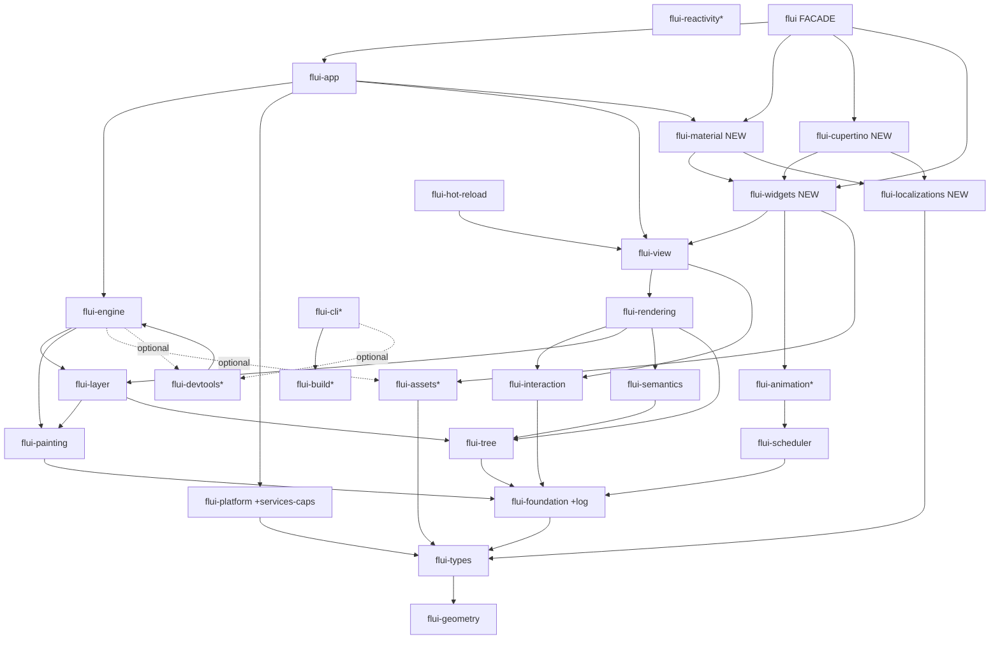

# Crate Decomposition Redesign

> **Scope.** Re-examine the FLUI workspace decomposition from first principles. Do not assume the current 21-crate split is correct. Produce: a per-crate deep/shallow verdict, the `flui-types` god-crate decision, layering-integrity findings, placement for the four new crates, the full target crate graph, an ordered migration delta, and the facade-crate decision. **Read-only research — changes no code.**

---

## 1. Intro & methodology

### 1.1 The question

FLUI is a Flutter→Rust port at ~216k LOC of crate source across 21 crates (15 active, 6 disabled). The render machine is largely built; the user-facing widget/Material/Cupertino layer is ~0%. Before the port ROADMAP finalizes, the foundations layer must answer: **is the workspace decomposed into the right crates?** A crate boundary is not free — it is an API surface, a compile unit, a versioning unit, and a thing an external contributor must understand. The wrong boundaries cost on every axis.

### 1.2 The lens — Ousterhout's deep vs shallow modules

The central tool of this analysis is the **deep/shallow module distinction** from Ousterhout's *A Philosophy of Software Design*:

> "The best modules are those that provide powerful functionality yet have simple interfaces. I use the term *deep* to describe such modules. ... A *shallow* module is one whose interface is relatively complex in comparison to the functionality it provides."

A crate is the largest module Rust has. Ousterhout's tests apply directly:

- **Depth test.** Does the crate hide substantial complexity (algorithms, platform FFI, invariants, internal data structures) behind a small public surface? Deep = keep. Shallow = the interface is roughly the size of the implementation, or the crate is a thin pass-through that adds a name but hides nothing — candidate to merge.
- **"Different layer, different abstraction."** Adjacent layers should not present the same abstraction. A crate that re-exports its dependency with cosmetic changes is a *pass-through* — Ousterhout's explicit anti-pattern ("decomposition that creates more interface than it hides").
- **The dangers of over-decomposition.** "It should be possible to understand each class independently. ... If classes are too small, [the developer] must flip back and forth between them." Twenty-one crates impose twenty-one `Cargo.toml`s, twenty-one dependency-edge decisions, twenty-one places a contributor's mental model must touch. Splitting is only worth it when each piece is independently deep.
- **Information hiding & general-purpose modules.** A crate boundary is justified when it *hides a decision* (a platform API, a GPU backend, a reconciliation algorithm) so consumers do not encode that decision. "Classes should be somewhat general-purpose" — a crate scoped to exactly one caller's exactly-current need is under-general; a crate scoped to a coherent *capability* is right.

The product anchor is `STRATEGY.md`: the success metric is "external PR contributors per quarter ... mental model понятен снаружи (the mental model is understandable from outside)." **The crate graph an external contributor sees IS part of the product.** A 21-crate graph with shallow members and a stale layer table fails that metric before a single widget is read.

### 1.3 How the verdicts were produced

1. **Real DAG** — `cargo metadata --format-version 1 --no-deps`, every `flui-*` edge (not the aspirational `Cargo.toml` comments or the constitution table).
2. **Real sizes** — Python walk over each `crates/*/src/` tree, counting `.rs` lines and crudely partitioning test regions (lines from the first `#[cfg(test)]` onward) so "logic LOC" is separated from "test LOC".
3. **Surface inspection** — read the `lib.rs` of every suspect crate; read the constitution layer table; read `STRATEGY.md` and `docs/crates.md`.
4. **Consumer verification** — for the abstraction-ahead-of-use suspects (`flui-tree`), grepped for actual `impl` sites of the crate's traits across the workspace.
5. **Prior-wave integration** — the four `2026-05-22` research docs are taken as established; this builds on them and states assumptions where it depends on a sibling input.

Measured crate sizes (`src/` LOC, this analysis — the task's figures include `tests/`, `examples/`, `benches/`; `src/`-only is the honest module size):

| Crate | src/ LOC | logic~ | test~ | Status |
|---|---:|---:|---:|---|
| flui-types | 36,213 | 32,184 | 4,029 | active |
| flui-rendering | 23,578 | — | — | active |
| flui-interaction | 19,137 | — | — | active |
| flui-engine | 19,004 | — | — | active |
| flui-platform | 18,970 | — | — | active |
| flui-view | 14,261 | — | — | active |
| flui-layer | 10,718 | — | — | active |
| flui-painting | 8,341 | — | — | active |
| flui-reactivity | 8,078 | — | — | disabled |
| flui-scheduler | 7,902 | — | — | active |
| flui-animation | 7,475 | — | — | disabled |
| flui-cli | 7,338 | — | — | disabled |
| flui-semantics | 6,619 | — | — | active |
| flui-tree | 6,576 | 4,455 | 2,121 | active |
| flui-foundation | 4,799 | — | — | active |
| flui-assets | 4,607 | — | — | disabled |
| flui-build | 4,003 | — | — | disabled |
| flui-app | 3,902 | — | — | active |
| flui-devtools | 2,563 | — | — | disabled |
| flui-hot-reload | 1,066 | 1,066 | 0 | active |
| flui-log | 983 | 901 | 82 | active |

A note on what LOC does and does not prove. Ousterhout is explicit that **size is not the test of shallowness** — a small module can be deep (it hides a hard thing) and a large module can be shallow (it is a god-object exposing everything). LOC is used here only as a *prompt to look*, never as the verdict. The verdict is always "what does the public surface hide?"

---

## 2. Per-crate deep/shallow verdict

For every current crate: DEEP (substantial hidden complexity behind a small surface — keep) or SHALLOW (interface ≈ implementation, or pass-through — merge candidate), with the Ousterhout principle named.

| Crate | LOC | Verdict | Principle | Rationale |
|---|---:|---|---|---|
| **flui-types** | 36,213 | **GOD-CRATE — SPLIT** | "Modules should be deep" *inverted* | Not shallow — it is the *opposite* failure. 36k LOC, 2.7× the next foundation crate, is one flat namespace exposing 8 unrelated families (geometry, styling, painting-values, layout, typography, gestures, physics, platform). A foundation crate this wide is a single module with an enormous interface. §3 is the full analysis; verdict: split out `flui-geometry`. |
| **flui-foundation** | 4,799 | **DEEP — keep** | Information hiding | Hides framework primitives behind small surfaces: `ChangeNotifier`/`Listenable` (notifier.rs, 862), the generic `Id<T: Marker>` system (id.rs, 774), `BindingBase` singleton machinery (binding.rs, 331), `Key` types (key.rs, 869), diagnostics (debug.rs, 1076). Each is a genuine decision hidden from consumers. The most solid crate in the workspace (gap-matrix). Keep. |
| **flui-tree** | 6,576 | **DEEP — keep** | General-purpose module; "different layer, different abstraction" | Investigated as abstraction-ahead-of-use. **It is not.** `cargo` grep confirms all production trees implement the `TreeRead`/`TreeNav`/`TreeWrite` trio: `LayerTree` (flui-layer), `SemanticsTree` (flui-semantics), `RenderTree` (flui-rendering); `ElementTree` is the one pending adopter. The 58%-zombie visitor/diff surface the gap-matrix flagged **has already been deleted** — `lib.rs:41-48` documents the removal of `visitor`/`diff`/`cursor`/`state.rs` (~10k+ LOC). What remains (arity markers, depth system, the trait trio, ancestor/descendant/sibling iterators, `IndexedSlot`) is the load-bearing core, all consumed. It is the deliberate Rust-native unification of Flutter's four bespoke tree traversals — a textbook general-purpose module. Keep. |
| **flui-platform** | 18,970 | **DEEP — keep** | Information hiding (the canonical case) | Hides Win32 / AppKit / winit / headless behind one `Platform` trait. This is the single most important boundary in the workspace — it hides the OS. Deep by construction. Keep. (§4 absorbs the residual `services` responsibilities here.) |
| **flui-painting** | 8,341 | **DEEP — keep** | "Different layer, different abstraction" | `Canvas`/`DisplayList`/`DrawCommand` recording API, deliberately GPU-free (constitution boundary rule). Hides the command-recording model from both widgets above and the engine below. Deep. (~31% zero-consumer dead weight per gap-matrix — a *cleanup* finding, not a boundary finding.) Keep. |
| **flui-layer** | 10,718 | **DEEP — keep** | Information hiding | The compositing layer tree — 19 layer variants, scene building, the compositor input. Hides retained-compositing structure. Flutter keeps this *inside* `rendering/layer.dart`; FLUI's extraction is a sound "different abstraction" split (the layer tree is a different abstraction from the render tree). Keep. |
| **flui-semantics** | 6,619 | **DEEP — keep** | Information hiding | Accessibility tree: nodes, configuration, owner, merge logic. Hides the a11y data model. The OS-bridge half is unbuilt (gap-matrix) but that is a *completeness* gap, not a boundary error. Keep. |
| **flui-interaction** | 19,137 | **DEEP — keep** | "Modules should be deep" (the model citation) | The most complete port in the workspace (~95%, gap-matrix). Hides the entire gesture-recognizer arena, hit-testing, pointer routing, velocity tracking behind a recognizer/hit-test surface. 19k LOC of hidden FSM complexity. The exemplar deep crate. Keep. |
| **flui-scheduler** | 7,902 | **DEEP — keep** | Information hiding | Frame scheduling, `Ticker`/`TickerProvider`, frame phases, priority queue. Hides the vsync/frame-budget machine. Keep. |
| **flui-rendering** | 23,578 | **DEEP — keep** | Information hiding | The render-object machine + protocol. The heart of the port. Hides layout protocol, the pipeline owner, the render-object catalog. Deep. (Catalog only ~15% built — completeness gap.) Keep. |
| **flui-engine** | 19,004 | **DEEP — keep** | Information hiding (hides wgpu) | 17,730 of its 19,004 LOC is `wgpu/`. Hides the entire GPU backend behind a `Scene`-consuming surface. The constitution's "no wgpu leakage" rule is enforced by this boundary. Deep — and the boundary is doctrine. Keep. |
| **flui-view** | 14,261 | **DEEP — keep (surface must be re-shaped)** | Information hiding | The Widget/Element/BuildContext framework spine. Hides the three-tree reconciliation machine. **Deep as a crate** — but its *public surface* is Dart-transliterated (`Box<dyn View>`, `downcast_rs`, `dyn_clone`) per the architectural-contracts doc. That is a *surface-quality* problem (Contracts 2/3/5/6), not a *crate-boundary* problem. The crate stays; its API is fixed by the contracts work. Keep. |
| **flui-app** | 3,902 | **DEEP — keep** | Information hiding | The top-level binding integration — `runApp`-equivalent, the platform→build→layout→paint→present wiring. Small because it is glue, but it hides the *assembly* of the whole stack, which is a real decision. Keep. (Carries a parallel `Color`/`ColorScheme` that must be deleted — a cleanup item, §6.) |
| **flui-hot-reload** | 1,066 | **DEEP — keep** | "Modules should be deep" — small interface, real hidden complexity | The smallest active crate flagged as a merge suspect. **It is deep.** 1,066 LOC, 100% logic, behind a *3-symbol* surface (`scene_plugin!`, `app_plugin!`, `ScenePlugin`/`HotReloadDriver`). It hides: cross-platform `dlopen`/`dlsym`/`dlclose` vs `LoadLibraryW`/`GetProcAddress`/`FreeLibrary` FFI, `Box::into_raw`/`from_raw` ownership transfer across an FFI boundary with no `#[repr(C)]`, mtime-poll reload detection, and a `cdylib` ABI contract. Tiny interface, genuinely hard hidden thing — Ousterhout's *definition* of a deep module. Keep. (Note: it is a DX-track crate; placement is fine, only the layer is slightly off — §5.) |
| **flui-log** | 983 | **SHALLOW — MERGE into flui-foundation** | Pass-through; "different layer, different abstraction" violated | The clearest shallow crate. 983 LOC wrapping `tracing_subscriber` setup. Its interface (`Logger::new().with_filter(...).with_level(...).init()`) is a near-1:1 restatement of what it configures — interface ≈ implementation. It hides almost nothing: a consumer reading `flui-log` learns `tracing` config, the same abstraction one layer down. It does carry *one* real thing — per-platform log sinks (Android logcat, iOS os_log, WASM console) behind `cfg`. That is worth keeping as a *module*, not a *crate*. Merge into `flui-foundation` as `flui_foundation::log`. Justification: a whole crate (its own `Cargo.toml`, its own dependency edge from ~every crate, its own line in every layer diagram) for a `tracing` wrapper is decomposition that adds interface without hiding complexity. §6 details the merge. |

### Disabled crates (verdict applies on re-enable)

| Crate | LOC | Verdict | Rationale |
|---|---:|---|---|
| **flui-animation** | 7,475 | **DEEP — keep, re-enable** | Curves/tweens/controllers/simulations — a full Flutter `animation` port (larger than the 5,283-LOC Dart source). Hides the animation machine. A genuine layer. Keep. |
| **flui-reactivity** | 8,078 | **DEEP as a crate — keep dormant; KEEP OUT of the catalog DAG** | A complete SolidJS-style signal library, zero `flui-` deps. As a *module* it is deep. But per architectural-contracts Contract 1 + ecosystem-lessons R2, FLUI's canonical state model is `StatefulView`/`setState`; signals must NOT enter `flui-widgets`' dependency graph. Verdict: it is a legitimate *optional, post-parity* crate — keep the crate, keep it off the critical path, keep it un-depended-on by the catalog. Not a merge or delete. |
| **flui-assets** | 4,607 | **DEEP — keep, re-enable** | Async asset/font/image loading + cache. Hides IO and decoding. Absorbs Flutter's `services` asset-bundle responsibility. A genuine capability boundary. Keep. |
| **flui-devtools** | 2,563 | **DEEP — keep, re-enable** | Inspector backend / widget-tree viewer / perf overlay. Hides the introspection + overlay machinery. DX-track. Keep. |
| **flui-cli** | 7,338 | **DEEP — keep, re-enable** | `flui new`/`build`/`run` — project scaffolding. A binary crate; hides the CLI surface. Keep. |
| **flui-build** | 4,003 | **DEEP — keep, re-enable** | Async cross-platform build pipeline (Android/iOS/Desktop/Web builders), sealed `PlatformBuilder` typestate. Hides the build machinery. Keep. |

**Summary of verdicts.** Of 21 crates: **1 god-crate to split** (`flui-types`), **1 shallow crate to merge** (`flui-log` → `flui-foundation`), **19 deep crates to keep**. The workspace is, with two exceptions, well-decomposed. The decomposition's problem is not *too many shallow crates* — it is *one over-wide foundation crate* and a *stale layer table*. That is a better-than-expected finding and it should be stated plainly to the FOUNDATIONS doc: do not churn the workspace; fix two things.

---

## 3. The `flui-types` god-crate analysis

### 3.1 What it contains

`flui-types` is 36,213 LOC across 8 top-level families (measured):

| Family | LOC | Contents |
|---|---:|---|
| `geometry/` | 18,919 | `units.rs` (2,461 — the `Pixels`/`Dp`/typed-unit system), `point` (1,707), `vector` (1,479), `size` (1,413), `offset` (1,279), `rect` (1,201), `length` (1,160), `matrix4` (1,040), `transform`, `bounds`, `bezier`, `rrect`, `circle`, `line`, `rsuperellipse`, `corners`, `transform2d`, `traits`, `text_path`, `relative_rect`, `rotation` |
| `styling/` | 4,808 | `color`, `color32`, `hsl_hsv`, `material_colors`, `border`, `box_border`, `border_radius`, `decoration`, `gradient`, `shadow`, `physical_model` |
| `painting/` | 4,251 | `paint`, `path`, `shader`, `canvas`, `clipping`, `effects`, `image`, `blend_mode`, `alignment` |
| `layout/` | 2,363 | `axis`, `alignment`, `constraints`, `flex`, `stack`, `wrap`, `table`, `viewport`, `baseline`, `box`, `fractional_offset` |
| `typography/` | 2,175 | `text_style`, `text_spans`, `text_metrics`, `text_alignment`, `text_decoration`, `text_scaler` |
| `gestures/` | 1,860 | `pointer`, `velocity`, `details` |
| `physics/` | 1,000 | `spring`, `friction`, `gravity`, `tolerance` (the whole Flutter `physics` package) |
| `platform/` | 649 | `target_platform`, `brightness`, `orientation`, `locale` |

It is 88% logic, 12% test. It has **zero `flui-` dependencies** — a true Layer-0 leaf. Every other crate depends on it.

### 3.2 Is this a legitimately deep foundation, or a god-crate?

Both halves of the question have a real answer, and they point in different directions — so the verdict is a *targeted* split, not a blanket one.

**The case that it is deep (the part to keep together).** A value-types crate is, by nature, wide rather than tall — it is a bag of `Copy` structs with `From`/`Add`/`Mul` impls, not a layered machine. `styling` + `painting` + `typography` + `physics` + `platform` (~13k LOC) are exactly that: leaf value types, each small, each used pervasively, none hiding an *algorithm*. Splitting those into five micro-crates would be Ousterhout's over-decomposition anti-pattern — five `Cargo.toml`s, five dependency edges, and a contributor "flipping back and forth" to find where `Color` vs `TextStyle` vs `Brightness` lives, for zero hidden-complexity gain. They are correctly one crate. `flui-types` as the home of *cross-cutting value types* is a legitimate foundation.

**The case that it is a god-crate (the part to split).** `geometry/` is **18,919 LOC — 52% of the crate, 4× the entire `flui-foundation`.** It is not "a few more value types." It is a self-contained computational-geometry library: a typed-unit system (`units.rs`, 2,461 LOC), a full linear-algebra layer (`matrix4` 1,040 + `transform` + `transform2d` + `vector`), Bézier math, superellipse geometry. Ousterhout's god-class warning applies at crate scale: a single module whose interface spans *two unrelated domains* (cross-cutting value types **and** a geometry/linear-algebra library) is over-wide — a consumer that needs only `Color` still compiles, versions against, and rebuilds on every `bezier.rs` edit. And `geometry` *is* a coherent, separable domain with a clean seam: it has zero dependency on `styling`/`typography`/`gestures` — geometry is upstream of all of them.

Two further facts tip the verdict:

1. **The compile-time tax is real and named.** The port-phasing doc's risk R7: at 36k LOC, `flui-types` is a dependency of *everything*, so any edit triggers a full-workspace rebuild; as the workspace grows toward ~700k LOC this is a velocity tax. Splitting `geometry` out means a `bezier.rs` change rebuilds `flui-geometry`'s dependents, not the literal entire workspace. Ousterhout values this: a module boundary that *localizes the blast radius of change* is doing its job.
2. **The `unsafe` violation.** `flui-types` contains `unsafe` SIMD code in exactly two files — `geometry/matrix4.rs` (6 occurrences) and `styling/color.rs` (4). The constitution's Principle III sanctions `unsafe` only in `flui-platform`, `flui-painting`, `flui-engine`. **`flui-types` is not on that list** — this is a live constitution violation. Splitting `geometry` out does not by itself fix it, but it *isolates* the matrix SIMD into a single small crate where a `forbid`/`allow` decision and a SIMD `// SAFETY:` audit is tractable, instead of being buried in a 36k-LOC crate. (The `color.rs` SIMD goes with the `flui-types` remainder; it should be addressed by the architecture-correction sibling — flagged there.)

### 3.3 Verdict: split `flui-geometry` out; keep the rest as `flui-types`

**Split into two Layer-0 crates:**

- **`flui-geometry`** (~19k LOC) — the entire current `geometry/` family: typed units (`Pixels`, `Dp`, `Length`), `Point`/`Vector`/`Offset`/`Size`/`Rect`/`RRect`/`Bounds`, `Matrix4`/`Transform`/`Transform2d`, `Bezier`/`Circle`/`Line`/`RSuperellipse`/`Corners`. Zero `flui-` deps. This is a coherent, independently-understandable computational-geometry library — a deep module by Ousterhout's test (powerful functionality: all of UI geometry; simple interface: value types + operators). Isolates the matrix SIMD `unsafe`.
- **`flui-types`** (~17k LOC remainder) — `styling`, `painting`-values, `layout`-enums, `typography`, `gestures`, `physics`, `platform`. Depends on `flui-geometry` (styling/painting/layout reference `Offset`/`Rect`/`Size`). Stays the home of cross-cutting *non-geometry* value types. Still wide, but now wide over *one* domain (UI value types) rather than two — acceptable for a value-type crate, and ~17k is in-band with `flui-rendering`/`flui-interaction`.

**Do NOT split further.** No `flui-units`, no `flui-styling`, no `flui-typography`, no `flui-physics`. Each would be a micro-crate hiding nothing — over-decomposition. In particular **the no-`flui-physics` decision is confirmed**: `physics/` is 1,000 LOC of pure simulation math, already cleanly folded into `flui-types`; a standalone crate for it would be the textbook shallow crate (the gap-matrix independently reached the same verdict). Folding `physics` into `flui-types` was correct and stays.

**Migration cost: LOW–MEDIUM, mechanical.** It is a directory move (`crates/flui-types/src/geometry/` → `crates/flui-geometry/src/`) plus a re-export shim. Every consumer's `use flui_types::geometry::{...}` becomes `use flui_geometry::{...}`. To make this a non-breaking, incrementally-migratable change: keep `pub use flui_geometry::*;` re-exported from `flui_types::geometry` for one release, so existing imports compile unchanged, then migrate call sites crate-by-crate and drop the shim. ~45 files import from `flui-types`; the change is `sed`-scale per crate. **Best done before the widget catalog** (port-phasing R7 says the same) — trivial now, a 200-widget-wide rewrite later.

---

## 4. New-crate placement

Four new crates are decided (per the task and the prior wave): `flui-widgets`, `flui-material`, `flui-cupertino`, `flui-localizations`. Plus two non-creation decisions to confirm.

### 4.1 Placement table

| New crate | Layer | Depends on (full edge set) | Depended on by | Size estimate | Rationale |
|---|---|---|---|---:|---|
| **flui-widgets** | L6 (new — between `flui-view` and `flui-material`) | `flui-view`, `flui-rendering`, `flui-animation`, `flui-painting`, `flui-interaction`, `flui-semantics`, `flui-types`, `flui-geometry`, `flui-foundation`, `flui-assets`, `flui-tree` | `flui-material`, `flui-cupertino`, `flui-localizations`, `flui-app`, end users | ~50–80k LOC | The user-facing widget catalog (Flutter's `widgets/` minus the framework spine that is already `flui-view`). `Container`, `Row`/`Column`/`Stack`/`Wrap`, `Text`, `Image`/`Icon`, `ListView`/`GridView`, `GestureDetector`, `Navigator`/routing, `Focus`/`Actions`/`Shortcuts`, implicit-animation widgets, `MediaQuery`, `LayoutBuilder`, `FutureBuilder`. Deep by construction. The single largest new crate. |
| **flui-material** | L7 (sibling of `flui-cupertino`) | `flui-widgets` + all of its deps; `flui-localizations` | `flui-app`, end users | ~80–120k LOC logic (+ ~67k icon data) | Material Design 3 catalog: `ThemeData`/`ColorScheme`, all buttons, `Scaffold`/`AppBar`/tabs, `TextField`, dialogs/sheets, `Checkbox`/`Radio`/`Switch`/`Slider`, `Material`/ink. The largest crate in the eventual workspace. Deep. |
| **flui-cupertino** | L7 (sibling of `flui-material`) | `flui-widgets` + all of its deps; `flui-localizations` | `flui-app`, end users | ~25–40k LOC logic (+ ~10k icon data) | iOS catalog: `CupertinoApp`, scaffolds, nav bar, buttons, pickers, dynamic colors, the iOS swipe-back route. Independent sibling of `flui-material` — builds in parallel. Deep. |
| **flui-localizations** | L6 (sibling of `flui-widgets`) | `flui-types` (`Locale`), `flui-foundation` | `flui-widgets`, `flui-material`, `flui-cupertino` | ~3–6k LOC | l10n infrastructure + `material_localizations` + `cupertino_localizations` strings/date-formats. **See §4.2 for the layer-placement subtlety — it is genuinely deep and earns its crate.** |

### 4.2 `flui-localizations` — placement reasoning (the non-obvious one)

`flui-localizations` is small (~3–6k LOC) — is it a shallow crate that should fold into `flui-widgets`? **No, and the reasoning is the Ousterhout "different abstraction" test plus the dependency-edge test.**

- **It hides a real, separable thing.** Localization is a `Locale → (strings, date/number formats, text-direction defaults)` lookup — the `LocalizationsDelegate` resolution machinery, the locale-matching algorithm, the bundled per-locale data tables for Material and Cupertino. That is a coherent capability with a small surface (`Localizations.of(context)`), hiding bulky data and a resolution algorithm. Deep by the definition.
- **The dependency-edge test settles it.** `flui-material` and `flui-cupertino` both need localized strings, and they are *parallel siblings that must not depend on each other*. The shared l10n strings therefore cannot live in either — they need a common ancestor. If l10n folded into `flui-widgets`, then `flui-widgets` would carry every Material and Cupertino locale string — a layering smell (the generic catalog carrying design-system data). A dedicated `flui-localizations` at L6, depended on by `flui-widgets` *and* both design systems, is the clean DAG shape. This is the same structural argument that justifies any shared-leaf crate: when two siblings need the same thing, it goes in an ancestor.
- **Placement: L6.** It depends only on `flui-types` (`Locale`) + `flui-foundation`. It could sit lower (L2), but L6 alongside `flui-widgets` keeps the "user-facing layer" grouped and it is consumed only at L6+. Either is defensible; L6 is recommended for graph legibility (the user-facing band is L6–L7).

Verdict: **create it, L6, deep — confirmed.**

### 4.3 Confirming the two non-creation decisions

**No `flui-physics` — CONFIRMED.** Reasoning given in §3.2/§3.3: `physics/` is 1,000 LOC of pure simulation math (`Simulation`, `SpringSimulation`, `FrictionSimulation`, `GravitySimulation`, `Tolerance`), already in `flui-types/src/physics/`. A standalone crate would hide nothing a module does not — interface ≈ implementation, the definition of a shallow crate. It stays folded into `flui-types`. The only question split-aware: does `physics` go to `flui-geometry` or stay in `flui-types`-remainder? **Stay in `flui-types`-remainder** — physics consumes `Offset` from `flui-geometry` but is a *value/behavior* family like `gestures`, not geometry primitives; grouping it with `gestures` (which also has `velocity`) in `flui-types` is the coherent placement.

**No `flui-services` — CONFIRMED.** Flutter's `services` package (platform channels, text input/IME, clipboard, system chrome, asset bundle, haptics) is a Dart↔engine `MethodChannel` bridge. FLUI deliberately *dissolved* it (the documented `PlatformTextSystem` carve-out): window/input/clipboard → `flui-platform`; asset bundle → `flui-assets`; text shaping → cosmic-text. Creating `flui-services` would re-introduce an abstraction the project chose to delete, and it would be a *shallow* crate — a thin re-bundling of capabilities that already have deep homes. The residual `services` responsibilities (IME/text-input, system chrome, haptics) attach to `flui-platform` as **new capability traits** — `PlatformTextInput`, `PlatformSystemChrome`, `PlatformHaptics` — extending an already-deep crate rather than spawning a shallow one. This is "add depth to an existing module" over "create a new shallow module" — exactly Ousterhout's guidance. Confirmed: no `flui-services`; it is a *capability gap inside `flui-platform`*.

---

## 5. Layering-integrity findings

The strict downward DAG was checked against `cargo metadata` (the real edges, §1.3). Findings:

### F-1 — The DAG is acyclic and downward-correct (PASS)

Every measured edge flows down. No circular dependency. `flui-engine` and `flui-rendering` are correctly *siblings* (neither depends on the other; they communicate via the `Scene` value type) — a good divergence from Flutter, where `rendering` and the C++ compositor are conceptually merged. The core DAG is sound. This is worth stating positively to the FOUNDATIONS doc: the *edges* are fine; the problems are a stale *table* and one mis-scoped *crate*.

### F-2 — The constitution layer table is STALE and contradicts the code (FIX — recommend amendment)

The constitution v2.2.0 layer table (`constitution.md:45-66`) is wrong in three ways the code disproves:

1. **It attributes "Geometry, colors, text styles" to `flui-foundation`.** False. Geometry/color/text-style value types are all in `flui-types` (`flui-types/src/geometry/`, `styling/`, `typography/`). `flui-foundation` contains `ChangeNotifier`, the `Id` system, `BindingBase`, `Key` types, diagnostics — *framework primitives*, not geometry. The table has the two foundation crates' responsibilities swapped/garbled.
2. **It lists crates that do not exist and omits crates that do.** It lists `flui-widgets` as if present (it is not — it is the largest missing crate). It does not reflect the disabled set accurately.
3. **It states "Edition 2021 / Minimum Rust 1.91"** while the workspace `Cargo.toml` is `edition = "2024"`, `rust-version = "1.94"`.

This matters beyond pedantry. The constitution table is the *canonical* layer reference (`docs/crates.md:104` instructs contributors to update it when adding a crate). An external contributor — the `STRATEGY.md` success metric — who reads the constitution to learn the architecture is *misled about where geometry lives*. A stale canonical map is worse than no map. **Recommendation:** the FOUNDATIONS doc should mandate a constitution amendment (MINOR bump) that replaces the layer table with the §6 target table, fixes the edition/rust-version line, and from then on treats the table as a tested artifact (the migration delta below produces the corrected table).

### F-3 — `flui-log` is depended on too widely for a shallow crate (FIX via the §2 merge)

`flui-log` is depended on by `flui-view`, `flui-app`, and others, and is intended to be usable everywhere. A logging facility *should* be universally available — but a *shallow* crate that is universally depended-on is the worst combination: it adds a dependency edge to nearly every crate while hiding nearly nothing. Merging it into `flui-foundation` (already a near-universal dependency and a *deep* crate) removes ~20 dependency edges from the graph and costs nothing — `flui-foundation` is depended on by everything that needs logging anyway. This is the §6 merge; it is also a layering-integrity improvement (fewer edges, same reach).

### F-4 — `flui-hot-reload` sits one layer too low for what it depends on (MINOR — note, low priority)

`flui-hot-reload` depends on `flui-view` + `flui-rendering` + `flui-layer` (it hosts a widget/scene plugin) yet `docs/crates.md` places it at "Layer 5" *below* `flui-view` (Layer 6). The real edges put it *above* `flui-view`. This is a table error, not a code error — the build works because Cargo resolves real edges. Corrected in the §6 target table (it belongs at L6+, with the DX-track crates). Low priority — it is a documentation correction folded into the F-2 amendment.

### F-5 — `flui-engine`'s optional edges into disabled crates are latent, not broken (NOTE — no action)

`cargo metadata` shows `flui-engine → flui-assets` and `flui-engine → flui-devtools`, both disabled crates. These are feature-gated/optional edges; `flui-engine` builds today because the deps are optional. Not a layering violation — but the FOUNDATIONS doc should note that re-enabling `flui-assets`/`flui-devtools` must verify these latent edges still compile. No structural change needed.

**Net layering verdict:** the DAG itself is healthy. The integrity problems are (a) a stale constitution table — fix by amendment, (b) one shallow widely-depended crate — fix by the `flui-log` merge, (c) two documentation-only placement errors — fold into the amendment. No crate is at a structurally illegal layer.

---

## 6. The TARGET crate graph

### 6.1 Target layer table

The target workspace: **24 crates** (current 21, minus `flui-log` merged away, plus `flui-geometry` split out, plus `flui-widgets`/`flui-material`/`flui-cupertino`/`flui-localizations` created → 21 − 1 + 1 + 4 = 24), **plus the `flui` facade crate** = **25 publishable crates**, of which the facade is a re-export shell with ~no logic.

New crates in **bold**. `*` = re-enabled-from-disabled.

| Layer | Crates | Notes |
|---|---|---|
| **L0 — Foundation** | `flui-geometry` **(new, split from flui-types)**, `flui-types`, `flui-reactivity*` (dormant, no deps) | `flui-geometry` is the geometry/linear-algebra library; `flui-types` is the cross-cutting value-types remainder (depends on `flui-geometry`). `flui-build` was a no-`flui`-deps L0 leaf — see L6. |
| **L1 — Framework primitives** | `flui-foundation` (absorbs `flui-log`) | `ChangeNotifier`, `Id`, `BindingBase`, `Key`, diagnostics, **and now `flui_foundation::log`**. Depends on `flui-types`. |
| **L2 — Substrate** | `flui-tree`, `flui-platform`, `flui-scheduler`, `flui-painting`, `flui-interaction`, `flui-assets*` | The render/platform substrate. `flui-tree` unified-tree traits; `flui-platform` gains `PlatformTextInput`/`SystemChrome`/`Haptics` capability traits (absorbed `services`). |
| **L3 — Compositing / a11y / animation** | `flui-semantics`, `flui-layer`, `flui-animation*` | — |
| **L4 — Render machine** | `flui-engine`, `flui-rendering` | Siblings; communicate via `Scene`. |
| **L5 — Framework spine + inspector** | `flui-view`, `flui-devtools*` | `flui-view` = Widget/Element/BuildContext (surface re-shaped per the contracts doc). |
| **L6 — User-facing catalog + DX tooling** | **`flui-widgets` (new)**, **`flui-localizations` (new)**, `flui-hot-reload`, `flui-cli*`, `flui-build*` | `flui-widgets` is the generic widget catalog; `flui-localizations` the shared l10n; the rest is the DX track. |
| **L7 — Design systems** | **`flui-material` (new)**, **`flui-cupertino` (new)** | Parallel siblings, neither depends on the other. |
| **L8 — Application** | `flui-app` | The top-level binding. |
| **Facade** | **`flui` (new role — formalize existing root crate)** | Re-exports the public surface; carries the prelude. Depends on the public-API crates. §7. |

### 6.2 Target DAG (mermaid)

(Edges shown are the structurally significant ones; each crate also carries the transitive foundation edges. `*` = re-enabled from disabled. `flui-reactivity` is intentionally an island — no edges into the catalog DAG, per Contract 1.)

### 6.3 Crate-count summary

- **Current:** 21 crates (15 active + 6 disabled), no formal facade.
- **Target:** **24 crates** + **1 facade** = **25 publishable units**.
  - Removed: `flui-log` (merged into `flui-foundation`). −1.
  - Added: `flui-geometry` (split from `flui-types`), `flui-widgets`, `flui-material`, `flui-cupertino`, `flui-localizations`. +5.
  - `flui` facade: the existing root crate, formalized into a pure re-export shell. (Counts as the +1 facade.)
  - Net crate delta vs current: 21 − 1 + 5 = **25 minus the facade = 24 library crates**; with the facade, 25.

The count grows by 4 net — but every added crate is independently deep (a god-crate split into two deep crates; three large user-facing catalogs; one deep l10n crate), and one shallow crate is removed. **The decomposition gets *better*, not just bigger** — average crate depth rises.

---

## 7. The facade / prelude decision

### 7.1 The question

`STRATEGY.md`'s product metric is "external contributors find the mental model understandable." An app author should not have to reason about a 24-crate graph to write a button. **Which crates does an app author actually `use`, and should there be a `flui` facade crate that re-exports the public surface so they depend on one crate, not fifteen?**

### 7.2 What an app author actually touches

In the target graph, an app author writing a normal Material app touches: `flui-material` (the widgets they build with), `flui-widgets` (generic widgets — `Padding`, `Row`, `Text`), `flui-app` (`runApp`), `flui-types` + `flui-geometry` (`Color`, `EdgeInsets`, `Size`), `flui-view` (`StatelessView`, `BuildContext`, `State`), `flui-animation` (`AnimationController` for explicit animations), `flui-painting` (`BoxDecoration`-adjacent), `flui-foundation` (`Key`, `ChangeNotifier`), `flui-interaction` (gesture types), `flui-semantics` (a11y annotations). **That is ~11 crates for a single app** — and the author must know which name holds which type. That directly fails the `STRATEGY.md` legibility metric.

### 7.3 The fact that settles it: the facade already exists

The root `Cargo.toml` `[package] name = "flui"` already declares a crate that re-exports `flui-app`, `flui-engine`, `flui-foundation`, `flui-hot-reload`, `flui-layer`, `flui-painting`, `flui-platform`, `flui-types` (verified via `cargo metadata` — `flui -> [flui-app, flui-engine, flui-foundation, flui-hot-reload, flui-layer, flui-painting, flui-platform, flui-types]`). FLUI **already has a facade crate**; it is just *incomplete* (it predates the widget layer, so it re-exports engine/platform internals an app author should not see, and omits the widget/material crates that do not exist yet) and *not formalized as the public surface*.

So this is not a "should we add a facade" decision — it is "formalize and re-scope the facade that exists." That is a strictly easier and lower-risk decision, and the precedent is universal: GPUI's `gpui` crate, every Linebender `xilem`/`masonry` split where `xilem` is the user-facing re-export. A facade crate is the Rust-ecosystem-standard answer to "deep workspace, one user dependency."

### 7.4 Recommendation: formalize `flui` as the facade + prelude crate

**Decision: YES — formalize the existing root `flui` crate as the single user-facing dependency.** Concretely:

1. **`flui` re-exports the *public* surface, not the internals.** It re-exports `flui-widgets`, `flui-material`, `flui-cupertino` (likely behind `material`/`cupertino` feature flags so an app pays only for the design system it uses), `flui-app`, and the *user-facing* parts of `flui-view` (`StatelessView`, `StatefulView`, `BuildContext`, `State`), `flui-types`/`flui-geometry` (value types), `flui-animation`, `flui-foundation` (`Key`, `ChangeNotifier`). It does **not** re-export `flui-engine`, `flui-platform`, `flui-rendering`, `flui-layer`, `flui-tree`, `flui-painting` internals — those are framework-internal; an app author never names a wgpu type or a `RenderObject` directly (the constitution already forbids the former). The current facade re-exporting `flui-engine`/`flui-platform`/`flui-layer` is the *pre-widget-layer* shape and should be narrowed.
2. **`flui` carries the prelude.** `flui::prelude::*` brings the ~40 names a widget file needs (`StatelessView`, `BuildContext`, `Widget`, `Container`, `Row`, `Column`, `Text`, `Color`, `EdgeInsets`, the `column!`/`row!` macros from Contract 3, etc.). One glob import, Flutter's `package:flutter/material.dart` ergonomics.
3. **`flui` has near-zero logic.** It is a re-export shell — Ousterhout would note a facade is a *deliberately shallow* module, and that is correct *here*: its entire job is to *be a simple interface over a deep system*. A facade is the one place shallowness is the goal, because the depth lives in the crates behind it. The distinction from `flui-log`: `flui-log` was shallow *and pretended to be a capability*; `flui` is shallow *and honestly is an aggregator*.
4. **Framework/plugin authors still depend on individual crates.** Someone writing a custom render object depends on `flui-rendering` directly; someone porting a platform backend depends on `flui-platform`. The facade serves *app authors*; the granular crates serve *framework contributors*. Both audiences are served — this is the GPUI/xilem model exactly.
5. **Internal crates do NOT depend on the facade.** `flui-material` depends on `flui-widgets`, never on `flui`. The facade is a leaf *above* the entire graph (it is at the very top, alongside or above `flui-app`), depended on only by end-user app crates. This keeps the facade from creating a cycle and keeps internal build times unaffected by it.

**Verdict: formalize `flui` as the facade + prelude crate.** It already exists; the work is *re-scoping* it (drop the internal re-exports, add the widget/material re-exports as they are built, write the prelude) — not creating it. This is the single highest-leverage move for the `STRATEGY.md` "understandable from outside" metric, and it is cheap because the crate is already there.

---

## 8. The migration delta — current → target

Ordered operations, each with breaking-change cost and rationale. Ordered by dependency-correctness (do upstream structural moves before downstream) and by "cheap structural cleanups before the catalog exists" (the recurring port-phasing principle: every structural change is trivial at 0 widgets and a catalog-wide rewrite later).

| # | Operation | Breaking cost | When | Rationale |
|---|---|---|---|---|
| **M-1** | **Merge `flui-log` → `flui-foundation`** as `flui_foundation::log` (move the 4 modules incl. the per-platform `cfg` sinks; delete `crates/flui-log/`; remove from `[workspace.members]`). | **LOW.** ~20 crates change `flui_log::Logger` → `flui_foundation::log::Logger` + drop the `flui-log` dep line. Mechanical; a one-line import change per crate. | **Now** (before catalog). | §2/F-3: shallow crate, removes ~20 dependency edges, `flui-foundation` is already a near-universal *deep* dep. No reason to wait. |
| **M-2** | **Split `flui-geometry` out of `flui-types`** (move `crates/flui-types/src/geometry/` → `crates/flui-geometry/src/`; new `Cargo.toml`, L0, no `flui` deps; `flui-types` gains a `flui-geometry` dep; add `pub use flui_geometry::*` shim in `flui_types::geometry` for one release). | **LOW–MEDIUM.** ~45 files import from `flui-types`. With the re-export shim, *zero* break on day one; migrate `use flui_types::geometry::` → `use flui_geometry::` crate-by-crate, then drop the shim. Mechanical. | **Now** (before catalog — port-phasing R7). | §3: god-crate; isolates the matrix SIMD `unsafe`; localizes the compile-time blast radius. Trivial now, 200-widget-wide later. |
| **M-3** | **Amend the constitution layer table** — replace `constitution.md:45-66` with the §6.1 target table; fix `flui-foundation` vs `flui-types` responsibilities; fix `edition 2021/1.91` → `2024/1.94`; correct `flui-hot-reload` placement (F-4). MINOR version bump (additions + corrections). | **NONE** (documentation). | **Now** (with M-1/M-2 — the table must reflect them). | F-2/F-4: the canonical layer map is stale and actively misleads contributors about where geometry lives. |
| **M-4** | **Add `services` capability traits to `flui-platform`** — `PlatformTextInput` (IME), `PlatformSystemChrome`, `PlatformHaptics`. New traits + per-backend impls; no new crate. | **LOW** (additive — new trait surface on an existing crate). | Before `flui-app` parity (port-phasing Phase 5). | §4.3: confirms no-`flui-services`; deepens an existing deep crate instead of creating a shallow one. |
| **M-5** | **Re-enable `flui-animation`** — add to `[workspace.members]`; verify it compiles against the post-M-2 `flui-geometry`/`flui-types` and post-M-1 `flui-foundation`. | **LOW** (re-enable; the architectural-contracts/port-phasing docs cover the integration repair). | Port-phasing Phase 2 (before `flui-widgets`). | On the critical path — every animated widget needs it. |
| **M-6** | **Re-enable `flui-assets`** — add to `[workspace.members]`; resolve the latent `flui-engine` optional edge (F-5). | **LOW** (re-enable). | Port-phasing Phase 3 (with `flui-widgets` — needed for the `Image` widget). | The `Image` widget + font loading need it. |
| **M-7** | **Create `flui-localizations`** — new crate, L6, deps `flui-types` + `flui-foundation`. | **NONE** (new crate). | Before `flui-material`/`flui-cupertino` need localized strings (port-phasing Phase 4 entry). | §4.2: shared l10n must live in a common ancestor of the two design-system siblings. |
| **M-8** | **Create `flui-widgets`** — new crate, L6, full edge set per §4.1. | **NONE** (new crate). | Port-phasing Phase 3 (after the render-object catalog + animation). | §4.1: the user-facing catalog; the largest new crate; gates both design systems. |
| **M-9** | **Create `flui-material` + `flui-cupertino`** — two new crates, L7, parallel siblings. Prerequisite: delete `flui-app`'s parallel `Color`/`ColorScheme` (§5 note / the contracts doc's V-25) so Material theming is defined on `flui-types::Color`. | **LOW** (new crates; the `flui-app` `Color` deletion is a small breaking cleanup). | Port-phasing Phase 4 (after `flui-widgets`). | The design-system catalogs. |
| **M-10** | **Re-scope the `flui` facade crate** — narrow the root `flui` crate's re-exports to the *public* surface (drop `flui-engine`/`flui-platform`/`flui-layer` internal re-exports; add `flui-widgets`/`flui-material`/`flui-cupertino` behind feature flags as they land); write `flui::prelude`. | **LOW–MEDIUM** for any existing example/app importing the *internal* re-exports `flui` currently exposes — they move to depending on the granular crate directly. App-facing imports become *more* stable, not less. | Incrementally — narrow now, add widget/material re-exports as M-8/M-9 land. | §7: formalize the existing facade as the single app-author dependency; the `STRATEGY.md` legibility metric. |
| **M-11** | **Re-enable the DX cluster** — `flui-devtools`, `flui-build`, `flui-cli` back into `[workspace.members]`. | **LOW** (re-enable). | Parallel DX track (port-phasing Phase 7) — not on the critical path. | Completeness; the DX track. `flui-reactivity` stays disitled/dormant — re-enable is post-parity and optional (Contract 1). |

**Ordering rationale.** M-1, M-2, M-3 are *now* — they are cheap structural cleanups (a shallow-crate merge, a god-crate split, a doc fix) and every one is dramatically cheaper before the ~200-widget catalog exists than after. M-4..M-11 thread into the port-phasing doc's existing phase order (this doc does not re-derive that — it defers to `2026-05-22-port-phasing-dependency-order.md` for the construction sequence and only places the *structural* operations onto it). The facade re-scope (M-10) is incremental — narrow first, grow as the catalog lands.

**Assumptions stated (sibling-dependent).** This delta assumes (a) the architecture-correction sibling owns the *quality* fixes inside crates (the `flui-view` `dyn`-surface re-shape, the keyed reconciler, the empty-body constraint propagation, the `flui-app` `Color` duplication, the `color.rs` SIMD `unsafe` audit) — this doc only moves *crate boundaries*; (b) the technology-adoption sibling owns the `bon`/macro/dependency decisions; (c) the port-phasing doc owns the phase sequencing — M-5..M-11 are placed *onto* its phases, not re-sequenced here.

---

## 9. Summary

- **The decomposition is healthier than the 21-crate count suggests.** Of 21 crates, **19 are DEEP** (substantial hidden complexity behind a small surface — Ousterhout's keep criterion). Only **2 need structural change**: one god-crate to split, one shallow crate to merge. The headline message for the FOUNDATIONS doc: **do not churn the workspace — fix two things and a stale table.**
- **`flui-types` is a GOD-CRATE — split it.** 36,213 LOC spanning two unrelated domains (cross-cutting value types **and** a 19k-LOC computational-geometry library). Split out **`flui-geometry`** (L0, ~19k); keep **`flui-types`** as the ~17k value-type remainder. This isolates the matrix-SIMD `unsafe` (a live constitution Principle III violation), localizes the compile-time blast radius, and gives each crate one coherent domain. Do **not** split further — `styling`/`typography`/`physics`/`platform` as micro-crates would be over-decomposition. **No `flui-physics`** (physics is 1k LOC of math, correctly folded into `flui-types`) — confirmed.
- **`flui-log` is SHALLOW — merge into `flui-foundation`.** A `tracing` wrapper whose interface ≈ its implementation; a whole crate (and ~20 dependency edges) for it is decomposition that hides nothing. Its one real asset — per-platform log sinks — survives as a *module*. **`flui-hot-reload`, despite being the smallest active crate (1,066 LOC), is DEEP** — a 3-symbol surface over real cross-platform FFI/ABI complexity; keep it. **`flui-tree` is DEEP** — not abstraction-ahead-of-use; all production trees implement its trait trio, and the 58%-zombie surface was already deleted; keep it.
- **No `flui-services`** — Flutter's `services` stays dissolved; its residue (IME/text-input, system chrome, haptics) becomes **capability traits on `flui-platform`** — deepening an existing deep crate over spawning a shallow one. Confirmed.
- **Facade: YES — formalize the existing `flui` root crate.** FLUI *already has* a facade crate (the root `flui` package re-exports 8 crates); the decision is to *re-scope* it — narrow it to the public surface, add `flui-widgets`/`flui-material`/`flui-cupertino` re-exports + a `flui::prelude` — so an app author depends on **one** crate, not eleven. This is the single highest-leverage move for `STRATEGY.md`'s "understandable from outside" metric, and it is cheap because the crate exists.
- **Target graph: 24 library crates + 1 facade = 25 publishable units** (current 21 − `flui-log` + `flui-geometry` + `flui-widgets` + `flui-material` + `flui-cupertino` + `flui-localizations`). Every added crate is independently deep; one shallow crate is removed — **average crate depth rises**. The DAG is acyclic and downward-correct; the only layering-integrity defects are a stale constitution table and one over-wide crate, both fixed by the §8 migration delta.
- **Do M-1 (merge `flui-log`), M-2 (split `flui-geometry`), M-3 (amend the constitution table) NOW** — before the widget catalog. They are cheap structural cleanups today and catalog-wide rewrites later. The remaining operations thread onto the port-phasing doc's existing phase order.
