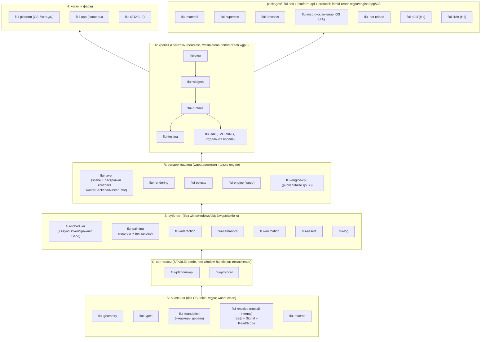

# FLUI: целевая глобальная архитектура (воркспейс, крейты, рантайм, экосистема)

*Снимок: main @ `cab06137d`, 2026-09-25. Ревью только на чтение: репозиторий не менялся. Утверждения о коде приводятся как `path:line` или как команда с выводом. Непроверенное помечено **(гипотеза)**. Основа документа: синтез шести проектных вариантов, три судейских вердикта и четыре линзы проверки (топология, инварианты и контракты, конкурентность и производительность, реальность плана и DX). Все блокирующие и major-замечания проверки применены: в каждом месте сказано, исправлено решение или снято. Сводка в §13. crates.io MCP не подключился, поэтому доступность имён крейтов не проверена.*

---

## 1. Резюме

**Направление бесспорно.** Все шесть вариантов и все три судьи сходятся в одном наборе: выделить `flui-platform-api`, извлечь `flui-runtime` с одной транзакцией кадра, курировать фасад с каталого-нейтральным prelude, сделать сигналы realm-scoped и каноническими, ввести растровый контракт с CPU-бэкендом, до H3 перевернуть UI-трейты в `!Send`, открыть шов `PlatformCapability`, поставить гейты globals/reach/module-DAG, вынести Material/Cupertino в пакеты. Владелец может считать этот набор решённым и спорить только о дельтах ниже.

**Что меняем резко сейчас (H0, до первой публикации) и почему.**

1. **Слои становятся тирами с фактами достижимости** (`V → C → S → R → K → H → packages`). Рядом с `layer` появляется ключ `tier-kind = stable | evolving | internal | official | tool`, и его проверяет `cargo xtask workspace`. Сегодня 11 числовых слоёв (`Cargo.toml:92-104`) не поймали то, что один `use flui_platform::traits::PlatformTextInput` (`crates/flui-interaction/src/text_input.rs:27`) тянет winit/tokio/windows в interaction, rendering, objects, view, widgets и testing (`cargo tree -i flui-platform -e normal`).
2. **Один шов для плагинов и один для авторов пакетов.** Для плагинов это `flui-platform-api` (Stable, без OS-типов). Для авторов пакетов это **`flui-sdk`**: Evolving, версионируется отдельно, без хоста. Официальные пакеты зависят от `flui-sdk`, **а не от фасада**. Фасад тянет `flui-app`, `flui-engine`, wgpu и naga (`cargo tree -p flui -e normal`: 191 уникальный крейт против 127 у `flui-material`), поэтому правило «пакеты зависят от `flui`» было бы регрессией сборки для каждого пакета. Кроме того, при опциональных фичах фасада оно даёт цикл (см. п. 7).
3. **Одна транзакция кадра** в `flui-runtime` (тир K, **над** `flui-widgets`). Её гоняют `flui-app` (платформенные часы и растровая линия), `flui-testing` (виртуальные часы) и perf-харнесс. Вторая реализация, `HeadlessBinding::pump_frame` (`crates/flui-testing/src/lib.rs:955`), удаляется.
4. **Реактивный граф принадлежит realm и лежит ниже рендера.** Ядро графа и хэндл `Signal<T>` переезжают в новый внутренний крейт `flui-reactive` (тир V). Трейт `ReadScope` делает `BuildContext` его подтрейтом. Сигналы перестают быть фичей. `Writer` сужает запись до колбэков, но **рантайм-гард ADR-0074 остаётся** страховкой. Эффекты идут через ADR-0075.
5. **Семвер-обещание честно считается в элементах, а не в крейтах.** Stable-крейтов три (`flui`, `flui-platform-api`, `flui-protocol`), Evolving-контракт один (`flui-sdk`). Реальный объём заморозки равен транзитивному замыканию публичных типов Stable-модулей фасада и измеряется cargo-public-api **до** W1, а не утверждается.
6. **Гейты раньше рефакторинга.** Каждый гейт приходит в одном PR с обоснованным allowlist, который потом только сокращается. Среди них счётчики работы кадра как ratchet: без них извлечение рантайма и `!Send`-переворот нечем мерить.
7. **Никаких фич фасада, которые тянут пакеты.** `devtools`, `hot` и `material` перестают быть фичами фасада, а ребро `flui-app → flui-hot-reload` удаляется в том же PR, где hot-reload уходит в пакеты. Проверка воспроизвела ошибку `cyclic package dependency` на минимальном воркспейсе, где опциональное ребро выключено.

**Что сознательно не делаем.** Не сливаем крейты ради счётчика (geometry→types, animation→scheduler, semantics→rendering, backends→app). Не создаём `flui-text` до замера после Parley. Не делаем параллельный layout внутри realm. Не удаляем HeadlessRenderer, StateCell, CLI test/analyze и hot-reload до появления замены. Не переносим OS-бэкенды в `flui-app`.

**Отступления от плана владельца, предлагаемые на решение (не принятые).** `packages/` в этом репозитории вместо отдельных репо (plan.md: «flui-* в отдельных репо, один релизный поезд»). Пересмотр ADR-0041/0078/0027/0045/0080 делается явными суперсессиями (§10).

---

## 2. Текущее состояние

### 2.1 Цифры

- 27 крейтов плюс фасад, 7 инструментов в `tools/`. Размеры без тестов (context.md): widgets 82.7k, engine 74.0k, rendering 57.8k, view 54.4k, platform 50.4k, app 44.5k, interaction 41.3k, objects 38.3k, material 26.9k; самые мелкие: localizations 0.3k, macros 0.9k. Проверка перемерила `flui-platform` в 46,302 строки, `flui-app` в 52,092 (`realm_dispatch.rs` 7,149), `raster_owner.rs` в 4,365.
- 145 рукописных пинов `=0.2.0-dev` (`grep -rhoE 'version = "=0.2.0-dev"' crates/*/Cargo.toml | wc -l`).
- Фасад: `default = ["material"]` (`Cargo.toml:598`). Целиковые реэкспорты крейтов (`src/lib.rs:126-152`), включая `flui_app::android_activity` (`src/lib.rs:157`).
- `runtime-internals` включают `flui-app`, `flui-testing` и `flui-hot-reload` (`crates/flui-app/Cargo.toml:90`). Через унификацию фич он включён в каждом приложении.
- Файла `runtime-contract.toml` в git нет (`git ls-files` не находит). Ratchet ambient-reach, на который ссылается roadmap, исчез.
- `deny.toml:103` содержит `multiple-versions = "allow"`: 67 дублирующихся имён.
- `bench-collect` пропускает бенчи с `required-features` (`tools/xtask/src/bench.rs:36-38`), так что базовая линия ADR-0061 (2901 µs полный кадр против 56 µs с damage) не собирается.

### 2.2 Сильные стороны (подтверждены проверкой)

- **Слоистость реальна и проверяется** (`cargo xtask workspace`, TREE_FACTS в `tools/xtask/src/tasks/facade.rs:49-90`). Её нужно обобщить, а не заменять.
- **Идентичность частично уже зрелая.** `ElementId` генерационный `NonZeroU64` (`crates/flui-foundation/src/id.rs:1163`), `RenderId`/`RealmId` уже `GenId`.
- **Швы для запечатанных контекстов уже есть.** `BuildContext` запечатан (`build_context.rs:106`), `LifecycleContext: BuildContext` (`:377`). Паттерн расширяющего трейта с blanket-impl уже используется: `BuildContextExt` (`:569`, `:840`). Шов для capability повторяет готовую форму.
- **Растровая линия уже mode-agnostic по протоколу** (`crates/flui-app/src/app/raster_lane.rs:1-13`): «threading the lane later changes who calls pump, not what a frame is».
- **GPU-свободная часть движка отделима.** `layer_walk`, `layer_render`, `dispatch`, `command_renderer` и `damage` содержат 0 упоминаний wgpu. `LayerRender` обобщён по `R: CommandRenderer + LayerStateStack` (`layer_render.rs:32`) и импортирует только flui_layer/flui_painting/flui_types.
- **Derive-макросы уже переносимы в пакеты**: `flui-macros` резолвит путь через `proc_macro_crate` с фолбэком на `flui` (`crates/flui-macros/src/runtime_path.rs:21-24`).
- **Material/Cupertino лезут во внутренности умеренно**: widgets 233, types 200, view 120 обращений; rendering 26, painting 9, objects 5, interaction 3, scheduler 2. Короткий, перечислимый список, так что порт на `flui-sdk` реалистичен.
- `SignalSender` уже даёт межпоточную доставку (`reactive/mod.rs:810-820`). `Signal<T>` уже `Copy` (`:656-661`).

### 2.3 Структурные проблемы

| # | Проблема | Доказательство | Следствие |
|---|---|---|---|
| П1 | Утечка бэкендов в безголовый стек | `flui-interaction/src/text_input.rs:27` | wasm/headless чистота случайна; каждая правка Win32 пересобирает UI-стек |
| П2 | Две транзакции кадра | `flui-testing/src/lib.rs:955` `pub fn pump_frame` | тесты проверяют не прод-путь (нарушение S1) |
| П3 | Рантайм размазан по `flui-app` | `realm_dispatch.rs` 7,149 строк; `ui_realm/attach.rs:6` импортирует `FocusRoot, GestureArenaScope, VsyncScope` из widgets | нет места для embedder/test/perf-драйвера |
| П4 | Граф сигналов per-presentation | `ui_realm/commands.rs:450-455` → `presentations.rs:357-358` (`primary().widgets()`) | **дефект соответствия ADR-0074** (ADR говорит «realm-scoped»): запись из окна B идёт в граф основного окна |
| П5 | Глобальное состояние | `FONT_SYSTEM` (`flui-painting/src/text_layout/layout.rs:124`), `TIME_DILATION: AtomicU64` (`flui-scheduler/src/config.rs:43,94`), `AssetRegistry::global` (`flui-assets/src/registry/mod.rs:83`), `APP_RUNTIME` (`flui-app/src/app/runner/host.rs:25-47`), `PENDING_SECONDARY_WINDOW_*` (`secondary_window.rs:459,469`), `REQUEST_REBUILD` (`flui-hot-reload/src/dispatch.rs:24`), `REGISTRY_STACK` (`flui-view/src/key/registry.rs:204`), `NAVIGATOR_COMMAND_TARGETS`, 24 atomic static | нарушение принципа 3; ломает Subsecond, мульти-окно и детерминизм |
| П6 | Замки на пути кадра | `ChildManagerRegistry` = `Arc<Mutex<HashMap<.., Arc<Mutex<dyn ChildManager>>>>>` (`flui-view/src/element/child_manager.rs:56`); `LayoutConstraintsCell` (`flui-objects/src/layout/layout_constraints_cell.rs:96`); планировщик: 70 упоминаний Mutex в `scheduler.rs` (`:743-760`) | конкуренция и риск дедлока на каждом кадре |
| П7 | Противоречивые Send-границы | `RenderObject<P>` без `Send` (`flui-rendering/src/traits/render_object.rs:178`), но `RenderView::RenderObject: Send + Sync` (`flui-view/src/view/render.rs:451`), `ViewportOffset: Send + Sync` (`viewport_offset.rs:57`), `metadata() -> Arc<dyn Any + Send + Sync>` (`render_box.rs:485`) | после заморозки убрать bound означает сломать каждого реализатора |
| П8 | Всегда полная перерисовка | `raster_lane.rs:354` всегда `DamageRegion::Full`; paint выдаёт свежие id слоёв каждый кадр | цели B2 (partial repaint) и H2 недостижимы без смены контракта paint→layer |
| П9 | Закрытое множество capability | ADR-0078 «a new capability is a method on LifecycleContext» + запечатанность | exit H1 («5 плагинов вне репо») невозможен |
| П10 | Платформенные колбэки требуют `Send` | `flui-platform/src/traits/platform.rs:319-698` (`Box<dyn Fn.. + Send>`); `host.rs`: «the platform callback surface still requires `Send`, so the `!Send` realm this holds remains in owner TLS» | `!Send`-realm живёт в TLS; OwnerHost не может просто заменить его |
| П11 | Фичи как переключатель видимости и no-op фичи | `runtime-internals`; `flui-platform` `desktop = ["dep:winit"]` имеет 0 cfg-мест | внутренняя граница фиктивна |
| П12 | Push-only IME | `traits/text_input.rs:24-45`; macOS отвечает nil на `attributedSubstringForProposedRange` (`macos/text_input.rs:430-446`); в Win32 нет `WM_IME` | японский IME из exit B1 невозможен без смены контракта |
| П13 | Движок запрещает второй растеризатор | `crates/flui-engine/ARCHITECTURE.md:8-14`; уже расходящийся второй обходчик `headless.rs:15-27` | нет CPU-golden (E7), нет fallback (H2) |
| П14 | Счётчиков работы нет | grep `pump_counted|layout_count|nodes_laid_out|PipelineStats` находит только flui-devtools и `build_owner.rs` | бюджеты производительности не проверяются |
| П15 | Реэкспорт pre-1.0 типов наружу | `accesskit = "0.25"` (`Cargo.toml:144`), `ui-events = "0.3"` (`:301`), `android_activity` в фасаде | заморозка H3 оказалась бы привязана к чужим релизам |

---

## 3. Целевая глобальная архитектура

### 3.1 Принципы

Семь принципов владельца сохраняются. Добавленные принципы указывают своего исполнителя.

| # | Принцип | Чем обеспечен |
|---|---|---|
| P1 | Ментальная модель священна: View → Element → Render, ключи, lifecycle (`create_state` → `init_state` → `did_change_dependencies` → `build`), constraints down / sizes up | conformance-киты lifecycle и render |
| P2 | Один язык, один toolchain, **один растровый контракт**. wgpu в проде; CPU-растеризатор является равноправной реализацией того же контракта (golden, CI без GPU, fallback). Суперсессия `flui-engine/ARCHITECTURE.md:8-14` | растровый conformance-сьют |
| P3 | Никакого глобального состояния. Иммутабельная общая инфраструктура (коллекция шрифтов, GPU-устройство, кэш пайплайнов) может быть app-scoped, но передаётся явно. **Именованный постоянный класс исключений**: трамплины OS-колбэков (AppKit, Win32 WndProc, UIKit-делегат, Android JNI) достигают ровно одной TLS-ячейки хоста | `cargo xtask globals` (§8) |
| P4 | Всё машиночитаемо; DevTools, тесты и агенты разделяют словарь и схему | `flui-protocol` как единственный крейт схемы |
| P5 | Доказательство, а не утверждение: структурированные записи `docs/evidence/*.toml` | xtask рендерит BETA.md из записей |
| P6 | Ломаем явно: ADR с `Supersedes:` и правило `flui migrate` как данные | проверка front matter ADR |
| P7 | Рынок перед решением | — |
| S1 | Одна реализация на контракт: одна транзакция кадра, один BuildContext, одна растровая редукция, один граф, одна схема протокола | удаления из §9 |
| P8 | Крейт стоит денег: новый крейт требует ADR, называющего второго потребителя или шов компиляции/семвера | ревью ADR и `cargo xtask workspace` |
| P9 | Шов существует, только когда вторая реализация проходит его conformance-кит. Неподключённая `pub`-поверхность удаляется в следующем миноре | киты и diff снимка public-API |
| P10 *(переформулирован)* | **В Stable-сигнатуре нет апстрим-типа, чей мажор меняется чаще нашего Stable-цикла**, кроме исключений, **поимённо** записанных в ADR тиров вместе с ценой («мажор апстрима означает мажор этого модуля») | cargo-public-api снимок транзитивного замыкания |
| S2 | Привязка к потоку является типом: realm-состояние `!Send` и без замков; `Send` только на границах линий (`Scene`, mailbox, `WindowHandle`, `SignalSender`, IO-результаты) | `assert_not_impl_any!`, clippy `disallowed_types` |

### 3.2 Тиры и крейты

У каждого тира есть правило направления, **факт недостижимости** (`forbid-reach`: список крейтов, которых не должно быть в нормальном графе тира; обобщение TREE_FACTS) и объявленный порядок внутри тира.



**Почему рантайм над widgets.** `ui_realm/attach.rs:6` импортирует `FocusRoot, GestureArenaScope, VsyncScope`, `media_query_root.rs:9` импортирует `MediaQuery`, `commands.rs:8` импортирует `NavigatorCommand`. 22 файла `flui-app/src` импортируют `flui_widgets`. Извлечение над widgets не требует предварительных переносов. `NavigatorCommand` в командном канале позже заменяется каталого-нейтральным навигационным намерением (маршрут/URL).

**Правило для типов, которые «принадлежат рантайму», но достижимы через `LifecycleContext`** (исправление по проверке). `LifecycleContext` живёт в `flui-view` и не может назвать тип из `flui-runtime`. Поэтому **тип** лежит на уровне view или ниже, а рантайм владеет только **экземпляром**. `AsyncDriver` и `Spawner` остаются в `flui-scheduler` как `!Send` (сегодня `build_context.rs:406` возвращает `crate::AsyncDriver`, определённый в `flui-scheduler/src/async_driver.rs:463`). `GlobalKeyScope` остаётся в `flui-view`, `FontContext` в `flui-painting`. Альтернатива: трейт в view/foundation плюс `Rc<dyn Trait>`.

### 3.3 Судьба каждого из 27 крейтов

| Крейт | Судьба | Тир / вид | Причина и доказательство |
|---|---|---|---|
| flui-geometry | **Оставить, сократить ~3.5k строк** | V / internal | Неиспользуемая GPUI-лексика (`length.rs`, `transform2d.rs`, `bezier.rs`, `text_path.rs`, kurbo-мост), no-op фича `mint`. Исправить несогласованность Eq/Hash у Pixels (`units.rs:91,575-596`: ±0.0 равны, но хэшируются по-разному). Слияние с types отклонено: types пересобирают 24 крейта |
| flui-types | **Оставить, сжать** | V / internal | Удалить physics (дубль `flui-animation/src/simulation.rs:31`), дублирующий `BoxConstraints`, `MaterialColors`; правило «≥2 потребителя». Color как f32 плюс цветовое пространство до публикации (`color.rs:25`) |
| flui-foundation | **Оставить, поглотить маркеры дерева** | V / internal | Идентичности протокола рантайма (FrameStamp, PresentationAddress, ClaimSlot, OwnerAffinity) уходят в `#[doc(hidden)] runtime` (`affinity.rs:11-13`). Удалить ListenerRegistry, ViewId. Реактивное ядро **сюда не кладём**: foundation имеет 17 зависимых flui-крейтов в графе фасада (`cargo tree -p flui -e normal -i flui-foundation`), а граф в W3 будет часто меняться |
| flui-macros | **Оставить, расширить** | V / internal | Derive: RenderView, Store, Catalog, Route. Атрибуты `flui::main`, `flui::test`. trybuild-тесты через фасад |
| flui-tree | **Слить** Arity/Slot/Depth в foundation; **удалить** трио TreeRead/Nav/Write и `bon` | — | 8 impl (RenderTree, LayerTree, SemanticsTree), нет обобщённого потребителя `T: TreeNav`; места вызова (`flui-semantics/src/owner.rs:561`, `flui-rendering accessors.rs:1101`) становятся inherent-методами |
| flui-platform | **Разделить** на `flui-platform-api` (C) и бэкенды (H) | H / internal | Единственный прод-импорт ниже app (`text_input.rs:27`); ещё тестовый харнесс widgets (`src/testing/harness.rs:157,170`). Удалить `desktop = ["dep:winit"]` (0 cfg-мест), `LinuxPlatform`, второй `Window` (`src/window.rs`), `PlatformEmbedder`, `PlatformCapabilities`, `BackgroundExecutor`. `PlatformAccessibility` **остаётся здесь**, у единственного потребителя |
| flui-scheduler | **Оставить, облегчить** | S / internal | Владелец-локальное ядро плюс `Send`-waker вместо ~20 Mutex (`scheduler.rs:743-855`). `AsyncDriver`/`Spawner` **остаются здесь** как `!Send`, экземпляром владеет рантайм. `TIME_DILATION` переходит в часы презентации |
| flui-painting | **Оставить** | S / internal | FONT_SYSTEM становится внедрённым per-realm `FontContext` над общей коллекцией; обернуть `fontdb::Family` (`lib.rs:87`). `flui-text` не выделяем до замера после Parley |
| flui-interaction | **Оставить** | S / internal | Зависит от `flui-platform-api`. TLS-реестр `InteractionLane` (`interaction_lane.rs:738-742`) становится явным хэндлом. Арена и распознаватели переходят с `Arc<Mutex>`/DashMap на `Rc`/`RefCell` |
| flui-assets | **Оставить, отвязать от рантайма** | S / internal | Удалить `AssetRegistry::global()` и собственный tokio-рантайм (`bridge.rs:42-66`); поглотить кэш декодирования из widgets (`decode_cache.rs:96`) |
| flui-log | **Оставить** | S / internal | Только корни композиции; слияние с app не закрывает ни одного exit |
| flui-layer | **Оставить, вырастить** | R / internal | Берёт GPU-свободную редукцию движка, `LayerStateStack`, **а также `RasterBackend`, `PresentDisposition` и wgpu-свободный `RasterError`** (§4.7). Стабильная идентичность, differ, `DamageRegion::Partial`, `Layer::External`, conformance-сьют |
| flui-semantics | **Оставить** | S / internal | Action-таргеты на линии владельца вместо `Arc<dyn Fn + Send + Sync>` (`action.rs:217`) |
| flui-animation | **Оставить** | S / internal | `!Send` контроллер (`controller.rs:177-208`), одни часы на презентацию |
| flui-rendering | **Оставить, ужесточить** | R / internal | Транзакционный API топологии; `render_tree_mut` приватный (`accessors.rs:348`, 26 мест вызова в flui-view). Убрать знание каталога (`owner/semantics.rs:1003-1008`, `context/intrinsics.rs:13,316`) и 57 мест `testing`-cfg, меняющих форму `PipelineOwner` (`owner/mod.rs:251-257`) |
| flui-objects | **Оставить** | R / internal | Харнесс становится первым клиентом conformance-кита вместо строкового реестра (`render_object_harness.rs:151`) |
| flui-engine | **Оставить, сузить** | R / internal | wgpu-бэкенд контракта; убрать `pub use ::wgpu` (`lib.rs:229`). `RasterOwner` **остаётся здесь в H0** (перенос см. §4.7). `HeadlessRenderer` живёт, пока engine-cpu не пройдёт conformance |
| flui-view | **Оставить, перерезать** | K / internal | Публичный протокол элементов снимает рёбра на objects/animation (`sliver_adaptor.rs:58`); LayoutBuilder, ленивые слайверы и async-билдеры уходят в widgets. Удалить `ElementBuildContext` (`element_build_context.rs:39`). `runtime-internals` становится `#[doc(hidden)] __runtime`. **Удалить `BuildContext::reactive()`** (`build_context.rs:132`). `WidgetsBinding` уходит в рантайм |
| flui-widgets | **Один крейт** (решение 2026-09-23 в силе) | K / internal | Гейт module-DAG (обещан, но не существует: `tools/xtask/src/tasks/checks.rs:100-120`). Raw-примитивы переезжают из Material вниз; Router, Form, подложка токенов. Удалить `__private`. **22 unit-тестовых модуля переезжают в `crates/flui-widgets/tests/`** (§4.1) |
| flui-testing | **Переместить над рантаймом** | K / internal (dev) | Гоняет настоящую транзакцию; поглощает `flui_widgets::testing` (2,144 строки); ребро widgets→testing (`flui-widgets/Cargo.toml:89`) удаляется |
| flui-hot-reload | **`publish = false` сейчас; переписать на Subsecond как официальный пакет** | package | Задокументированный остаточный риск UB в dlopen-дизайне. Шаблон из 3 крейтов, `--scene` и 5 примеров удалить только после spike. **Ребро `flui-app → flui-hot-reload` удаляется в PR переноса**; рантайм выставляет `DevReloadHook` |
| flui-material | **Официальный пакет** | package | Сегодня 10 внутренних зависимостей (`crates/flui-material/Cargo.toml:25-69`); цель: `flui-sdk` |
| flui-cupertino | **Официальный пакет** | package | То же; получает фокус и клавиатурную активацию от Raw-примитивов |
| flui-localizations | **Удалить** | — | 281 строка в собственном слое. RTL-таблица в `flui_widgets::localization`, строки в пакетах, ICU4X в `flui-i18n` (H1) |
| flui-app | **Сжать до раннеров** | H / internal | Realm, кадр, линии, semantics-host и удержанный ввод переезжают в рантайм. `realm_dispatch.rs` растворяется. Цель < 15k строк. Держит **единственную** TLS-ячейку трамплинов (P3) |
| flui-cli | **Продукт, независимая версия** | tool-product | `mcp`, `devtools`, `test --golden --accept` с NDJSON по тесту, `catalog`; поглощает web-server |
| flui-devtools | **Официальный пакет** (in-process сервер протокола) | package | 0 прод-потребителей (`lib.rs:18-24`); не сливается с `flui-protocol`: схема и сервер раздельно |

**Новые крейты.** Каждый проходит P8, то есть назван второй потребитель или шов.

| Крейт | Тир / вид | Шов, который он покупает |
|---|---|---|
| `flui-platform-api` | C / stable | Плагины зависят от ~30 крейтов, а не от всего стека (гипотеза по количеству; проверить `cargo tree`) |
| `flui-protocol` | C / stable (Evolving до H3) | Общая схема для `flui-testing`, `flui-devtools` и `flui-mcp` |
| `flui-reactive` | V / internal | Подписчики Layout/Paint в rendering/animation без нового ребра вверх. Фан-аут меньше, чем у foundation. Сворачивается в foundation, если `cargo build --timings` не покажет разницы (критерий в ADR эффектов) |
| `flui-runtime` | K / internal | Одна транзакция кадра для app, testing и perf |
| `flui-sdk` | K / **evolving** (отдельная версия) | Поверхность авторов пакетов без хоста; ломается без мажора `flui` |
| `flui-engine-cpu` | R / internal, `publish = false` до golden-API в B3 | Второй бэкенд растрового контракта (goldens, CI без GPU, fallback H2) |

**Итог.** Ядро на поезде: geometry, types, foundation, reactive, macros, platform-api, protocol, scheduler, painting, interaction, semantics, animation, assets, log, layer, rendering, objects, engine, engine-cpu, view, widgets, runtime, testing, sdk, platform, app, плюс фасад `flui`. Это 26 крейтов плюс фасад (engine-cpu не публикуется до B3), CLI версионируется отдельно. Счётчик крейтов из exit B0 («26 крейтов») совпадает случайно; предлагаю заменить его критерием «тир-гейт зелёный» (вопрос владельцу, §14).

### 3.4 Ядро, официальные пакеты, сообщество, tools

- **Ядро** является поездом: `cargo publish --workspace`. Внутренние рёбра получают точные пины, сгенерированные из `[workspace.dependencies]` (вместо 145 рукописных). Semver-checks запускаются на `flui`, `flui-platform-api` и `flui-protocol`. `flui-sdk` проверяется в advisory-режиме, пока он Evolving.
- **Официальные пакеты** (*предложение владельцу, а не решение*): `packages/` в этом репозитории, **отдельный cargo-воркспейс**. Пакеты зависят от `flui-sdk` по версии; `[patch]` на путь только для локальной разработки. CI собирает `packages/` против **последнего опубликованного поезда**. Только так доказательство «Material собирается на sdk» совпадает с опытом внешнего автора пакета. Нормальные in-repo зависимости официального пакета: `flui-sdk`, `flui-platform-api`, `flui-protocol`. **Ребро official→official разрешено только объявленным** (пример: `flui-a2ui → flui-material` не нужно, см. §5). Отдельный репо для пакета появляется, когда его каденция разойдётся с поездом.
- **Новая проверка `cargo xtask workspace`:** ни один крейт ядра не называет крейт с `tier-kind = official`, даже опционально. Именно это закрывает цикл из п. 7 резюме.
- **Сообщество:** бейджи `flui verify` из conformance-китов (собирается против текущего поезда, харнесс зелёный, семантика объявлена, бюджет unsafe объявлен). Это модель pub-points вместо курирующего комитета, который проект с bus factor 1 не укомплектует.
- **Tools** (`publish = false`, никогда не зависимость): `xtask`, `live-smoke` (сценарный раннер поверх драйвера `flui-mcp`), `decoy-face`. `web-server` удаляется. `device-checks` портируется на Rust по одной проверке при следующем касании. `text-spike` архивируется после spike.

### 3.5 Политика фич

1. Фичи аддитивны, каждая опциональная зависимость объявлена как `dep:`. **Фича с 0 cfg-мест проваливает `cargo xtask workspace`** (удаляет `desktop/android/ios/web/debug-overlay/performance-overlay` в app, `desktop/web/wayland/x11` в platform, `mint`, `simd`).
2. **Фича не бывает переключателем видимости.** `runtime-internals` становится `#[doc(hidden)] pub mod __runtime`; единственный флаг Experimental-тира `unstable` (плюс `unstable-<area>`).
3. **Фича не меняет раскладку прод-типа.** Per-crate `testing`-фичи становятся реестрами хуков, которые ставит харнесс; `static_assertions` пинит размер `PipelineOwner`.
4. Бэкенды выбираются целью, а не пользовательской фичей. a11y-адаптеры Windows и macOS являются безусловными target-зависимостями; Linux AT-SPI идёт как `a11y-linux` (по умолчанию включён, можно выключить).
5. **Сигналы не являются фичей** (сегодня `signals` в `crates/flui-view/Cargo.toml:123` и `Cargo.toml:645`).
6. **Фасад:** `default = []`; фичи `images`, `network-images`, `serde`, `unstable`, dev-only `dynamic-linking`. **Фич `material`, `cupertino`, `devtools` и `hot` у фасада нет** (исправление блокирующего замечания). Devtools и hot-reload приложение добавляет напрямую; шаблон `flui create` кладёт их в `[target.'cfg(debug_assertions)'.dependencies]` либо подключает через `flui run --hot`.
7. **Цена удаления `material` из фасада** (было упущено): примеры с Material переезжают в `packages/flui-material/examples` (или корень получает dev-зависимость на `flui-material`, dev-цикл Cargo допускает); `cargo xtask facade-combos` и правило `[[example]] required-features` в AGENTS.md переписываются; README и rustdoc `src/lib.rs` обновляются в том же PR.

### 3.6 Фасад, SDK, prelude

```rust
// flui (Stable): только курированные модули; нет `pub use flui_x as x` (убирает src/lib.rs:126-152)
pub mod prelude;   // перечисленный, каталого-нейтральный, со снимком; без tracing-макросов и BuildOwner
pub mod view;      // StatelessView, StatefulView, ViewState, InheritedView, RenderView, ключи, контексты
pub mod state;     // Signal, Computed, Effect, Store, Writer; state::low = StateCell/StateHandle
pub mod widgets;   // базовый каталог + Raw-примитивы + Router + Form
pub mod rendering; // авторинг RenderBox/RenderSliver, ViewportOffset, LayerLink
pub mod painting; pub mod interaction; pub mod animation; pub mod geometry;
pub mod platform;  // реэкспорт flui-platform-api
pub mod testing;   // WidgetTester, finders, goldens, conformance-киты
pub use flui_sdk as sdk; // Evolving, собственная версия; фасад пинит её точно
#[cfg(feature = "unstable")] pub mod unstable;
#[doc(hidden)] pub mod __runtime;
```

- `flui-sdk` (Evolving) содержит ровно то, что импортируют Material, Cupertino и devtools: `Surface`, post-frame, токены, `RealmObserver`, `InspectHook`, `DevReloadHook`, плюс перечислимые внутренности (`RenderPhysicalShape`, `RenderTable`, `DrawOp`, `Canvas`, `RenderUpdateImpact`, `LocalPostFrameHandle`, …). **Он не входит в Stable-обещание `flui`.** Поломка sdk означает бамп sdk; фасад пинит точную версию и в своём мажоре не обещает стабильность `flui::sdk`.
- **Реальный Stable-объём** определяется как транзитивное замыкание публичных типов Stable-модулей `flui`. Пример: `RenderBox` тянет `PaintCx`, `BoxHitTestContext`, `CursorIcon`, `SemanticsConfiguration`, `RenderInvalidationHandle` (`render_box.rs:3-9,359,508,589`), `Size`, `Matrix4`, `Diagnosticable`, `Arity`. Изменение «внутреннего» крейта, чей тип попал в замыкание, ломает `flui`. **D8 переформулирован: «три крейта, N элементов», где N измеряется spike cargo-public-api до W1.**
- Приложения с Material импортируют два prelude: `flui::prelude::*` и `flui_material::prelude::*`.

### 3.7 Порядок публикации

Порядок генерируется из тиров и порядка внутри тира: V (geometry, types, macros, foundation, reactive) → C (platform-api, protocol) → S (log, scheduler, painting, interaction, semantics, animation, assets) → R (layer, rendering, objects, engine) → K (view, widgets, runtime, testing, sdk) → H (platform, app, flui). Пакеты публикуются отдельным поездом после. Восходящие dev-зависимости становятся путевыми без версии. CI-джоб `cargo xtask release-check` делает dry-run `cargo package` по порядку и semver-checks против последнего тега (сегодня `release.yml:17`: «Publishing to crates.io is not done here»).

---

## 4. Рантайм

### 4.1 Деревья и идентичность

- Пять деревьев остаются. **ElementId не трогаем** (он уже генерационный). **LayerId и SemanticsId становятся `GenId`**: сегодня это переиспользуемые slab-индексы (`id.rs:640-715`), небезопасные по ABA, как только на них начнут ключеваться кэши и хэндлы агентов. Строка AGENTS.md «ID offset» (1-based `NonZeroUsize`, `id.get() - 1`) противоречит коду и исправляется.
- Конфигурации View разделяются (`Rc`) или перемещаются, а не глубоко клонируются на каждом уровне (`view/into_view.rs:178-184`, `element/behavior.rs:1071`, `dispatch.rs:145`).
- **Топологией владеет дерево, которое её хранит:** `PipelineOwner<Idle>::set_children(parent, &[RenderId])` и `move_subtree` проверяют арность и глубину. Глобальный `synchronize_render_children` (`element_tree.rs:1428-1520`) становится debug-верификатором.
- **Постройка внутри layout** (исправление major-замечания). Сейчас между проходами работает `service_child_requests_between_passes` (`build_owner.rs:2233-2264`) с лимитами `MAX_LAYOUT_BUILD_PASSES=10` и `MAX_LAZY_BAND_PASSES=6` (`layout_builder.rs:64,74`), потому что `PipelineCell` = `Rc<RefCell<PipelineOwner>>` (`cell.rs:51`) заимствован мутабельно во время layout. Целевой механизм следует контракту invokeLayoutCallback из Flutter: токен `LayoutCallbackScope` на `PipelineOwner<Layout>` разрешает `set_children` **только в поддереве раскладываемого родителя**, а сторону элементов достигает через объектно-безопасный хэндл `ChildManager`, который ставит рантайм (без ребра вверх). **Бюджет формулируется как «проходов ≤ N, цель 1»**, пока тест «ленивая полоса сходится за 1 проход» не станет зелёным.
- **Слоевое дерево сохраняет идентичность:** каждая repaint-граница является `Arc`-поддеревом с ключом `RenderId` (уже проставлен, `flui-layer/src/tree/layer_tree.rs:38`). Прививка стоит O(1), damage становится diff по указателям.
- **Тесты flui-widgets** (исправление major-замечания). Если `flui-testing` окажется над `flui-widgets`, unit-тесты внутри `src/` соберут вторую копию widgets: корневые scope из одной копии, lookup по TypeId из другой **(гипотеза о симптоме; механизм дублирования при dev-цикле документирован Cargo)**. Решение: 22 модуля, использующих `crate::testing` (`grep -rln 'crate::testing' crates/flui-widgets/src`, без `src/testing`), переезжают в `crates/flui-widgets/tests/`. Там библиотека линкуется одной копией. Тесты, которым нужны приватные элементы, получают доступ через `#[doc(hidden)] __runtime` или остаются чистыми unit-тестами без харнесса. Гейт: `flui_testing` запрещён в `src/` любого крейта ниже рантайма. Работа занимает отдельный PR в W2.

### 4.2 Realm и потоки

```text
App (раннеры flui-app) ── одна TLS-ячейка трамплинов OS (P3, именованное исключение)
 └─ OwnerHost (flui-runtime)
     ├─ Realm (!Send): ReactiveGraph, GlobalKeyScope, CapabilityRegistry, FocusCoordinator,
     │                 SchedulerCore, Spawner, FontContext, хэндл кэша изображений, RealmObserver
     │   └─ Presentation × N: ElementTree+BuildOwner, PipelineOwner, FrameClock(DemandMask),
     │                        Vsync, SemanticsHost → FrameSink
     └─ SharedEngineServices: GpuContext, fontique Collection {shared: true}
```

- **Один owner-поток на процесс с N изолированными realm, от H0 до H2.** ADR-0027 правится: realm «изолированы, но не конкурентны» (сегодня единственная `thread_local! APP_RUNTIME` хостит всех, `host.rs:25-47`). Per-realm owner-потоки на Win32/Linux проверяются spike в H2 за трейтом `OwnerExecutor`.
- **OwnerHost не «заменяет TLS», а сужает её до одной ячейки.** Пока платформенные колбэки требуют `Send` (`platform.rs:319-698`), `!Send`-realm живёт в TLS. Снятие `Send` с колбэков идёт отдельной поэтапной работой по бэкендам (§11, W1b). Трамплины AppKit/Win32 сохраняют доступ к одной ячейке навсегда, и это записано как класс исключений.
- **Параллельный layout внутри realm не является целью, и это записано.** Сегодня его исключает `PipelineCell` = `Rc<RefCell>` (`cell.rs:51`), **а не типы render-объектов**: на них как раз висят `Send + Sync` bound (`render.rs:451`, `viewport_offset.rs:57`, `render_box.rs:485`), и их снимает `!Send`-переворот (§11).

### 4.3 Одна транзакция кадра

`Realm::pump(&mut self, clock: &mut dyn FrameClockSource, sink: &mut dyn FrameSink) -> FrameOutcome` задаёт порядок: применение ввода → слив build → **эффекты** (фаза ADR-0075) → layout (ленивые дети через `LayoutCallbackScope`) → compositing → paint (удержанные слои) → semantics (инкрементально) → diff слоёв → damage → `SceneSnapshot` → post-frame. Этот метод гоняют flui-app, flui-testing (`ManualClock` плюс headless/CPU-sink) и perf-харнесс (счётчики).

### 4.4 Планирование и спрос

У каждой презентации один авторитет спроса: `FrameClock::mark_demand(reason)` с классами INPUT, CONTINUOUS_INPUT, ANIMATION, BACKGROUND. Сегодня носителей пять, плюс общий на все realm `needs_redraw` (`runtime.rs:727`, #1172). Виртуальные часы на каждую презентацию; путь Ticker с настенными часами выводится из эксплуатации. `TIME_DILATION` становится свойством часов презентации.

### 4.5 Линии и async

- **Растровая линия:** ADR-0045 **явно пересматривается**, а не просто принимается. Новый критерий приёмки задаётся по платформам: Win32/Linux threaded; macOS inline с записанной причиной (пин wgpu-hal #653); wasm inline. Web переходит на линию, `DirectSink` удаляется (`runner/web.rs:85`).
- **Владение атласами** (исправление major-замечания): **один растровый поток на `GpuContext` обслуживает все презентации** (H0–H2). Глиф- и image-атлас имеют единственного владельца и обходятся без замков. Per-window линии с поокопной подготовкой атласа и слиянием загрузки остаются вариантом spike «одно окно зависло» (§12), где счётчик конкуренции за атлас является метрикой. Сегодня линия на окно (`raster_lane.rs:1-40`, тесты `:586-768`).
- **IO и compute:** `Spawner` берётся в `init_state` и отменяется при unmount. Futures на линии владельца `!Send`, пуловые `Send`; результаты приходят командами во фазу ввода следующего кадра через `SignalSender`. **У tokio один владелец**: исполнитель рантайма по умолчанию за фичей, хост может внедрить свой (ADR-0047 `HostExecutors`). Рантаймы в `flui-platform` (`executor.rs:66`) и `flui-assets` (`bridge.rs:66`) удаляются.

### 4.6 Состояние

- **Размещение:** ядро графа (arena, push-pull Clean/Check/Dirty с интрузивными ссылками, owner-disposal, журнал записей, path-триггеры для stores), **хэндл `Signal<T>` и трейт `ReadScope`** (текущий подписчик и хэндл графа) лежат в `flui-reactive` (V). Сегодня `Signal::get(self, cx: &dyn crate::BuildContext)` (`reactive/mod.rs:752`) является inherent-методом на типе flui-view. Inherent impl можно писать только в крейте-владельце, поэтому переносится **тип хэндла**, а не только ядро. `BuildContext: ReadScope` (upcast в местах вызова); render-контексты layout/paint реализуют `ReadScope` в `flui-rendering`. **Прототип переноса проводится до W3** (§12).
- **Экземпляр** принадлежит realm. Это исправляет **дефект соответствия ADR-0074** (П4); сначала пишется тест, падающий сегодня: сигнал, записанный из окна B, перерисовывает читателя в окне B.
- **Подписчики по фазам:** `Element(presentation, ElementId)` → rebuild; `Layout(RenderId)` → needs_layout; `Paint(RenderId)` → needs_paint. Первыми идут Element-подписчики; render-подписчики появляются по замеру **(гипотеза: нужны для скролла и drag)**. `Arc<Mutex>` Listenable (`notifier_generic.rs:41-45`) становится `Rc`-адаптером.
- **Создание сигналов:** идиома ADR-0074 сохраняется. `create_state(&self)` без контекста (`stateful.rs:76-84`), сигналы создаются в `init_state` (`cx.signal(v)` через `BuildContextExt`, `build_context.rs:569-583`, с рантайм-паникой `CreatedDuringBuild`). **Новый хук `create(cx)` не вводится**: он слил бы createState и initState, расширил бы список хуков ADR-0078 и потерял бы `&View`. Эргономичный слот `Signal::uninit()`/`Lazy` снимает `Option<Signal>`.
- **Запись:** `Writer` выдаётся колбэкам, эффектам и продолжениям задач. `Signal::set/update(w, ..)` из `build` не компилируется, **но `Writer` является эргономичным сужением, а не заменой рантайм-гарда**: записи из computations (`WrittenDuringCompute`, ADR-0075 треб. 4) и из вложенных синхронных колбэков во время build по-прежнему ловит гард (ADR-0078:70 называет его авторитетным). `BuildContext::reactive()` удаляется в том же PR, иначе `build` получает `set`.
- **Эффекты и видимость** оформляются ADR-0075 (сейчас Proposed). В нём явно записано, какие постройки внутри layout могут увидеть запись эффекта (треб. 6: слив в LayoutBuilder-scope в том же кадре). Значение видно синхронно, инвалидация коалесцируется покадрово.
- **Коллекции (A8):** `#[derive(Store)]` с path-триггерами, keyed-доступ по тем же ключам, что у реконсилятора, `Patch` для bulk/A2UI. **Один тип пропса** `impl Into<Bind<T>>`.
- **Нижний уровень:** `StateCell/StateHandle` переезжают в `flui::state::low`. Непривязанная мутация даёт debug-панику с подсказкой (`state_cell.rs:48-60`).
- **Текстовое поле:** `TextFieldState` на графе с транзакцией `edit(|buf| ..)`, трансформами и undo; заменяет `Arc<Mutex<ControllerInner>>` (`text/controller.rs:263`).

### 4.7 Рендер, текст, движок

- **Растровый контракт** в `flui-layer::lower`: порядок обхода, дисциплина clip/opacity, декомпозиция эффектов в нейтральные шаги, `CommandRenderer`, `LayerStateStack`, differ, conformance-сьют. **Подготовительный шаг, которого не было в синтезе:** `RasterBackend` (`flui-engine/src/raster.rs:100-111`), `PresentDisposition` и wgpu-свободный `RasterError` переезжают в `flui-layer`; `flui-engine` отображает свой `EngineError` (18 упоминаний wgpu в `error.rs`) в этот тип. Только после этого `RasterOwner` (4,365 строк) **может** переехать в рантайм с `forbid-reach = ["wgpu"]`. В H0 он остаётся в engine; перенос планируется в W6 как необязательный.
- **Внешний контент:** один открытый вариант `Layer::External { id: ExternalContentId, rect }` с типизированными реестрами. `DrawOp` и `Layer` в остальном закрыты. Ничего не делающий обработчик `PlatformViewLayer` (`layer_render.rs:381-384`) удаляется.
- **Damage:** differ удержанных деревьев выдаёт `DamageRegion::Partial` с фолбэком на `Full`. У wgpu нет buffer age (wgpu#682), поэтому презентер рендерит в удержанный target и затем делает blit. **Удержанный target включается условно:** при Full-damage или damage выше порога рендер идёт прямо в swapchain, потому что blit на tile-based мобильных GPU стоит полосы пропускания **(гипотеза, мерить в spike)**. Трейт `Presenter`: #1 swapchain, #2 OS-композитор (spike H1). Сначала работы над runtime и platform-api, контракт закрывается до H3; exit B2 требует partial repaint.
- **Текст:** ADR-0077 (Parley) и B1 (per-realm шрифты) объединяются в один ADR. Общая иммутабельная после загрузки `Collection { shared: true }`; per-realm `FontContext`/`LayoutContext` без замка; атлас на `GpuContext`, растеризация на растровой стороне; ключи глифов несут идентичность блоба шрифта, а не процесс-глобальный ключ cosmic (`glyphs.rs:23`). **Нейтральный контракт shaped-run** (id блоба, glyph id, размер, вариации, subpixel bin) и трейт `GlyphRasterizer` заменяют `Arc<cosmic TextLayout>` в DisplayList (`display_list/command.rs:167-174`). ICU4X становится единственным источником Unicode. Скан системных шрифтов уходит в асинхрон: встроенные шрифты доступны в первом кадре, системные приходят событием realm.
- **GPU:** один `GpuContext` на приложение (instance, adapter, device, queue, `wgpu::PipelineCache`, закрытый каталог эффектов с прогревом, атласы). Surfaces создаются из того же instance; на окно одна `Presentation`. Сегодня каждое окно создаёт свои Instance и Device (`renderer.rs:1140-1168`). Бэкенды dx12/metal/vulkan, при отсутствии GPU engine-cpu.

### 4.8 Платформы и IME

- `flui-platform-api` содержит: owner-affine `!Send` окна плюс `Send`-прокси `WindowHandle` с закрытым набором глаголов; единую машину состояний lifecycle; обёрнутую лексику ввода (P10); общий owner-loop (admission, deferred open, quit fence, exit policy, wake deadline) за маленьким трейтом `NativeLoop` (сегодня реализован 4–6 раз); шов минтинга бэкендов (#560); conformance-кит бэкендов, обобщённый из `tests/contract.rs`.
- **Один бэкенд на ОС:** Win32, AppKit, UIKit, Android, web, winit как **тот самый** Linux-бэкенд. `LinuxPlatform` (все методы `unimplemented!`) удаляется.
- **IME:** pull-модель, то есть синхронная read-only поверхность text-store (текст в диапазоне, выделение, composing, rect для диапазона, индекс по точке) на owner-потоке. Её реализует `TextFieldState` плюс Parley. **Windows с первого дня использует TSF (`ITextStoreACP`) плюс UIA TextPattern/ValuePattern.** Суперсессия ADR-0030 §1.

### 4.9 Доступность

- **Включена по умолчанию** (адаптеры Windows/macOS безусловны, AT-SPI включён с возможностью выключить); `accesskit_android/ios` в H1; `tree_id` для мульти-окна.
- **Включение является capability realm:** refcount `SemanticsHandle`, общий для AT, агентов и devtools. Сегодня `expect(dead_code)` (`semantics_host.rs:30-50`), и агент видит дерево только при запущенном Narrator.
- Action-таргеты на линии владельца убирают паттерн AtomicBool-mailbox (`gesture_detector.rs:446-570`).
- **Семантика входит в definition of done виджета:** сгенерированный тест перечисляет каталог и падает на виджете без конфигурации и без явного «нет». Первыми идут EditableText, Scrollable, ModalRoute/Overlay, Image. Перед включением по умолчанию: бенч `publish_cost` на Notes и на 100k-списке.
- **Граница accesskit (исправление P10):** `PlatformAccessibility` остаётся во внутреннем `flui-platform`. `flui-protocol` задаёт собственные `Role`/`Action` с именами, совпадающими с AccessKit, и протестированным отображением 1:1. Словарь в плане владельца остаётся словарём AccessKit, но Stable-крейт не привязан к релизам accesskit 0.x.

---

## 5. Точки расширения по горизонтам

| Горизонт | Точка расширения | Шов (крейт) | Вторая реализация (P9) | Conformance-кит |
|---|---|---|---|---|
| H0 | Сторонние RenderBox/RenderSliver | `flui::rendering` (Stable) + `#[derive(RenderView)]` + публичный протокол элементов | `flui-objects` плюс **внешняя фикстура фасада с кастомным `RenderSliver`** (в `tests/fixtures/*.rs` сегодня 0) | `flui::testing::rendering::check_box/check_sliver`: dry layout = layout, интринсики конечны и монотонны, baseline внутри size, hit-test в границах, идемпотентный relayout, семантика стабильна два кадра |
| H0 | Растровые бэкенды | `flui-layer::lower` | wgpu + engine-cpu | растровые conformance-сцены |
| H0 | Агентный/devtools-протокол | `flui-protocol` поверх MCP (ADR-0080 в силе) | UIA-бэкенд (`flui-mcp`) + in-process (`flui-devtools`) | **нормализованная проекция** outline (роли свёрнуты к подмножеству, выразимому в UIA, OS-хром отфильтрован) совпадает на обоих бэкендах |
| H0 | Каталог как данные | `#[derive(Catalog)]` | Raw-примитивы + Material-компоненты Notes | примеры как тесты, round-trip схемы |
| H1 | `PlatformCapability` | `flui-platform-api` + реестр рантайма | clipboard (сегодня `expect(dead_code)`, `runtime.rs:1632-1638`), haptics (`presentation.rs:866-893`), диалоги файлов | headless-фейк + типизированный `Unsupported` |
| H1 | Темы как данные | serde-карты токенов в `flui_sdk::tokens` + InheritedView + FieldMask; `ThemeData::from_tokens` в пакете | Material + Cupertino | round-trip |
| H1 | Генеративный UI | `flui-a2ui` (official, Evolving): контроллер surface, **каталоги как значения, которые передаёт приложение** (`App::catalog(flui_material::catalog())`), JSON-Pointer-проекция stores, `A2uiTransport`, **без LLM-клиента в ядре** | — | тесты согласования каталога |
| H1 spike → H2 | Внешний GPU-контент | `Layer::External` + capability `TextureRegistry` на `GpuContext` + `Presenter`; fence-контракт в пересмотренном ADR-0045 | swapchain + OS-композитор | readback через реальный путь приложения |
| H2 | Custom shaders | `DrawOp::Custom(ProgramId)` регистрируется при сборке приложения (WGSL + uniforms + опциональная CPU-реализация), входит в прогрев | wgpu + CPU | — |
| H3 | Протокол v1 | `flui-protocol` версионируется независимо, с зарезервированным пространством имён расширений MCP | — | снимок схемы |
| H4 | Каталоги, бэкенды, embedders сообщества | `flui verify`; шов #560; трейт `Host` для своего event loop | сообщество | все киты |

**Регистрация (было не специфицировано).** В Rust нет авторегистрации при линковке без `inventory`/`linkme`, а у тех есть оговорки на wasm и static-lib. Поэтому регистрация всегда явная и занимает одну строку на плагин: `App::new(root).plugin(flui_camera::Plugin::default())`. Плагин ставит `CapabilityProvider` по умолчанию из своих `[target.'cfg(..)'.dependencies]`, а приложение переопределяет его через `.capability::<Camera>(my_provider)` (хук переопределения есть с первого дня; у Flutter его до сих пор нет, flutter#80374). A2UI получает каталоги значениями, поэтому ребро `flui-a2ui → flui-material` не нужно.

**Внешний GPU-контент навсегда Evolving.** Интероп с wgpu живёт в модуле `flui_sdk::gpu`, который на каждом поезде перепиннивает мажор wgpu. Его нет в Stable `flui`. Это записано в exit H2.

**Как архитектура эволюционирует без переписывания.** Каждый горизонт добавляет реализации за контрактами, которые вторая реализация доказала раньше. В H1 мобильные хосты становятся раннерами `PlatformHost` над тем же рантаймом, плагины добавляются поверх platform-api, WebGL2 идёт тем же путём wgpu, и ни один контракт ядра не меняет формы. В H2 threaded-линия является переключением режима, кэши садятся на существующую идентичность, fallback является engine-cpu, render-подписчики появляются по замеру. В H3 замораживается измеренное замыкание трёх Stable-крейтов, cargo-semver-checks переходит из advisory в gating. В H4 работают бейджи и `Host`.

---

## 6. API и DX: до и после

Сравнение честное: новый counter не короче сегодняшнего. Выигрыш в том, что запись проверяется на этапе компиляции, корнем может быть любой View, одна точка входа и нет клонов.

### 6.1 Counter

**До** (`examples/counter.rs`, сокращено):

```rust
#[derive(Clone, StatelessView)] struct CounterApp;           // обёртка: run_app требует StatelessView + Clone (runner/mod.rs:214-216)
#[derive(Clone, StatefulView)] struct CounterView;
struct CounterState { count: StateCell<usize> }
impl StatefulView for CounterView {
    type State = CounterState;
    fn create_state(&self) -> Self::State { CounterState { count: StateCell::new(0) } }
}
impl ViewState<CounterView> for CounterState {
    fn init_state(&mut self, ctx: &dyn LifecycleContext) { self.count.bind(ctx); }
    fn build(&self, _: &CounterView, _: &dyn BuildContext) -> impl IntoView {
        let count = self.count.clone();
        Column::new(column![
            Text::new(self.count.get().to_string()),
            ElevatedButton::new(Text::new("Increment")).on_pressed(move || count.update(|n| n + 1)),
        ])
    }
}
fn main() { run_app(CounterApp); }
```

**После:**

```rust
use flui::prelude::*;

#[flui::main]                                   // заменяет run_app / run_app_android / _ios / ...
fn main() -> App { App::new(Counter) }          // корень: любой View

#[derive(Clone, StatefulView)]
#[state(CounterState)]                          // derive выводит type State; create_state = Default
struct Counter;

#[derive(Default)]
struct CounterState { count: Signal<u32> }      // Signal::default() = неинициализированный слот

impl ViewState<Counter> for CounterState {
    fn init_state(&mut self, cx: &dyn LifecycleContext) {
        self.count = cx.signal(0);              // ADR-0074: создаётся здесь, не в build
    }
    fn build(&self, _: &Counter, cx: &dyn BuildContext) -> impl IntoView {
        let count = self.count;                 // Copy
        Column::new((
            Text::new(count.get(cx).to_string()),
            RawButton::new(Text::new("+")).on_press(move |w| count.update(w, |n| *n += 1)),
        ))
    }
}
```

### 6.2 Todo с формой

```rust
#[derive(Store, Default, Clone)]
struct Draft { title: String, due: Option<Date> }

#[derive(Default)]
struct TodoState { draft: Store<Draft>, items: Store<Vec<Todo>> }

impl ViewState<TodoPage> for TodoState {
    fn init_state(&mut self, cx: &dyn LifecycleContext) {
        self.draft = cx.store(Draft::default());
        self.items = cx.store(Vec::new());
    }
    fn build(&self, _: &TodoPage, cx: &dyn BuildContext) -> impl IntoView {
        let (draft, items) = (self.draft, self.items);
        Column::new((
            Form::new(draft, (
                TextField::bound(draft.title()).validator(validators::non_empty()),
                RawButton::new(Text::new("Add")).on_press(move |w| {
                    if draft.validate(w) {
                        let d = draft.take(w);
                        items.update(w, |v| v.push(Todo::from(d)));
                    }
                }),
            )),
            ListView::keyed(items, |t| t.id, |t, _cx| TodoRow::new(t.clone())), // ключи реконсилятора = ключи Store
        ))
    }
}
```

До этого Form, валидации, `Store` и keyed-коллекций не было (roadmap: «нет Form/многострочного редактора»); сегодня это собиралось бы вручную из `StateCell` плюс `TextEditingController` (`Arc<Mutex<..>>`).

### 6.3 Два экрана с навигацией

```rust
#[derive(Route, Clone, PartialEq)]
enum AppRoute { #[route("/")] Home, #[route("/note/:id")] Note { id: NoteId } }

fn main() -> App {
    App::new(Router::new(|r: &AppRoute, _cx| match r {
        AppRoute::Home => Home.boxed(),
        AppRoute::Note { id } => NoteView(*id).boxed(),
    }))
}

struct HomeState { router: Option<RouterHandle<AppRoute>> }
impl ViewState<Home> for HomeState {
    fn init_state(&mut self, cx: &dyn LifecycleContext) {
        self.router = Some(Router::<AppRoute>::handle(cx)); // ближайший предок: позиция в дереве известна
    }
    fn build(&self, _: &Home, _cx: &dyn BuildContext) -> impl IntoView {
        let router = self.router.clone().expect("BUG: router handle acquired in init_state");
        RawButton::new(Text::new("Open"))
            .on_press(move |w| router.push(w, AppRoute::Note { id: NoteId(1) }))
    }
}
```

Исправление по проверке: `Router::of(w)` не реализуем, потому что у `Writer` нет позиции в дереве. Хэндл разрешается в `init_state`, и навигация всегда идёт к **ближайшему предку**-Router (контракт `Navigator.of(context)`). Это же устраняет маршрутизацию через «основную презентацию» (`NAVIGATOR_COMMAND_TARGETS`). До: ~30 вариантов push/pop у `Navigator` (`navigator.rs:1706-2300`) и страницы без URL.

### 6.4 Плагин

```rust
// crate flui-haptics-api (зависит только от flui-platform-api)
pub struct Haptics;
impl PlatformCapability for Haptics { type Handle = HapticsHandle; const NAME: &'static str = "flui.haptics"; }

// crate flui-haptics (app-facing; flui-sdk + провайдеры по target)
pub struct Plugin;
impl flui_sdk::Plugin for Plugin {
    fn install(&self, app: &mut AppBuilder) {
        #[cfg(target_os = "android")] app.capability::<Haptics>(android::Provider);
        #[cfg(target_os = "ios")]     app.capability::<Haptics>(ios::Provider);
    }
}

// в приложении
fn main() -> App { App::new(Root).plugin(flui_haptics::Plugin) }

impl ViewState<Root> for RootState {
    fn init_state(&mut self, cx: &dyn LifecycleContext) {
        self.haptics = cx.capability::<Haptics>().ok();   // Ext-трейт; Err(Unsupported) на desktop
    }
}
```

Шов объектно-безопасен:

```rust
pub trait LifecycleContext: BuildContext /* sealed */ {
    #[doc(hidden)]
    fn capability_erased(&self, id: TypeId) -> Result<Rc<dyn Any>, Unsupported>;
}
pub trait LifecycleContextExt: LifecycleContext {
    fn capability<C: PlatformCapability>(&self) -> Result<C::Handle, Unsupported> {
        self.capability_erased(TypeId::of::<C>())
            .map(|rc| rc.downcast_ref::<C::Handle>().expect("BUG: registry type mismatch").clone())
    }
}
impl<T: LifecycleContext + ?Sized> LifecycleContextExt for T {}
```

`&dyn LifecycleContext` встречается **136 раз** (`grep -rn '&dyn LifecycleContext' crates src examples --include=*.rs | wc -l`). Обобщённый метод прямо на трейте сломал бы объектную безопасность. `NativeContext` даёт per-OS типизированные аксессоры в cfg-модуле `flui_platform_api::native` (Evolving). Единственное поимённое исключение P10 здесь `raw-window-handle` (без хэндл-указателей наружу там, где есть типизированный аксессор).

### 6.5 Кастомный render object и тест

```rust
#[derive(Clone, RenderView)]
#[render(object = RenderBadge, protocol = Box, update(set_color = color))]
struct Badge { color: Color, #[view(child)] child: BoxedView }   // заменяет impl_render_view! (render.rs:510-545)

#[flui::test] // сидированный исполнитель, виртуальные часы, CPU-бэкенд
fn signup_rejects_bad_email(t: &mut WidgetTester) {
    t.mount(Signup);
    t.find(Query::role(Role::TextInput).label("Email")).type_text("nope");
    t.find(Query::role(Role::Button).label("Sign up")).act(Action::Invoke);
    t.expect(Query::role(Role::Text).label_contains("invalid email"));
    t.golden_semantics("signup_error");   // формат outline = ответ агента
}
```

**Конвенции** (каждая с линтом): длины как `impl Into<Pixels>` (сегодня 132 функции с `f32`); UI-колбэки никогда не `Send`; виджеты являются `#[non_exhaustive]` билдерами; `View` для `Option<V>` и `Either`; `column!`/`row!` уходят в пользу кортежей; `Theme::of` с дефолтом вместо паники. Переименование Flutter-имён (`WidgetsBinding`, `FlutterError`) идёт внутри курирования фасада; `flui-testing` не переименовывается.

**Генерируется из кода, а не пишется руками:** каталог G6, каталог A2UI, llms.txt (сегодня учит `flui_app::run_app`), индекс каталога в AGENTS.md `flui create`, `docs/crates.md`, карта концептов, индекс ADR. Примеры книги включаются из скомпилированных файлов.

---

## 7. Производительность

**Инвариант: стоимость пропорциональна изменению.** Детерминированные счётчики на виртуальных часах гейтятся на каждый PR, настенное время является ночным трендом по ОС.

| Инвариант | Нарушение сегодня | Исправление |
|---|---|---|
| Rebuild ∝ dirty × размер конфига | глубокий `dyn_clone` на уровень | `Rc`/move-конфиги |
| Топология ∝ изменённые родители | глобальный проход (`element_tree.rs:1428`) | локальные коммиты |
| Layout ∝ переразложенные узлы | скан всего slab на dirty-корень (`storage/tree.rs:82-110`); HashMap-арена на проход (`subtree_arena.rs:161,523-543`) × до 10 проходов; некоалесцированные отметки (#1042) | непересекающаяся индексация, постоянная арена, эпохи, `LayoutCallbackScope` |
| Paint ∝ dirty-границы | корень не удерживается | `Arc`-поддеревья |
| Raster ∝ damage | всегда Full | differ + условный удержанный target |
| Idle = 0 кадров | 5 носителей спроса | один DemandMask |
| Нет per-node замков | `child_manager.rs:56`, `layout_constraints_cell.rs:96`, ScrollPosition (`viewport.rs:1057`) | `!Send`-переворот |
| Промах глифа не зависит от UI | общий FONT_SYSTEM (`painter/mod.rs:167`) | §4.7 |
| Логи на горячем пути | `info!` на каждый mount (`behavior.rs:1059,1090`) | понижение уровня + модульный гейт |

**Бюджеты:**

| Сценарий | Гейт на PR | Тренд (exit H2) |
|---|---|---|
| Idle 10 с | 0 кадров на презентацию | wakeups/s |
| 10k статический список, экран скролла | узлов layout ≤ видимые + полоса кэша; проходов ≤ N (цель 1) | p99 < период панели |
| 100k fling | построенных строк ≤ дельта полосы | p99, max |
| Одно изменение текста | элементов ≤ 3; damage ≤ бокс текста + AA-поле | время GPU |
| Анимация opacity | 0 rebuild, 0 relayout, 1 патч слоя | — |
| Холодный старт | счётчики фаз; скан шрифтов вне критического пути | < 300 мс (шрифты, adapter, пайплайны, первый build) |
| Нажатие клавиши в редакторе 1 МБ | shaped runs ∝ изменённому абзацу | p99 |
| Мульти-окно (spike) | счётчик конкуренции за атлас | зависшее окно не выводит другое из бюджета |

**Как мерить (теперь с местом в плане).** Счётчики фаз в `PipelineOwner`/`BuildOwner` плюс `cargo xtask perf` со сценариями idle и 10k-списка **входят в W1** как ratchet: записываются текущие значения, разрешено только уменьшение. Извлечение рантайма и `!Send`-переворот меряются против них. `bench-collect` перестаёт пропускать бенчи с `required-features`, и базовая линия ADR-0061 оживает. **Время компиляции тоже бюджет:** до и после каждого разреза запускается `cargo build --timings`. Цифра «правка Win32 пересобирает 3 крейта» не заявляется, пока не измерена. **Гипотеза:** per-crate `testing`-фичи компилируют верх стека несколько раз за `cargo xtask test` (проверка: считать хэши `libflui_rendering-*.rlib`).

---

## 8. Безопасность и чистота кода

Гейты вводятся **гейт-первыми**: каждый приходит одним PR с обоснованным allowlist, который потом сокращается. Каждый является командой `cargo xtask` **и** шагом джоба `checks`.

| Инвариант | Гейт | Сегодня |
|---|---|---|
| Нет нового процесс-глобала | `cargo xtask globals`: syn-скан **каждого** `static` (включая `Atomic*` с конфигурацией вроде `TIME_DILATION`) и `thread_local!`; исключения: чистые монотонные ID-счётчики и одна именованная TLS-ячейка трамплинов. **Allowlist засевается фактическим сканом**, а не прозой | гейта нет; список П5 + 24 atomic static |
| Достижимость | `forbid-reach` в манифестах, проверка `cargo tree -e normal`; для пакетов: wgpu, flui-engine, flui-app, OS-крейты (исключение `flui-mcp`) | только TREE_FACTS hot-reload |
| Ядро не называет official | проверка в `cargo xtask workspace` | ребро `flui-app → flui-hot-reload`, фича фасада `hot-reload` (`Cargo.toml:630`) |
| UI-состояние `!Send` | `assert_not_impl_any!`; clippy `disallowed_types` (Mutex, RwLock, DashMap) в frame-path крейтах, allowlist для mailbox | ~398 Mutex/RwLock в прод-коде |
| Нет замков в публичных сигнатурах | фильтр снимка public-API | `ElementBuildContext::tree()` (`element_build_context.rs:128-135`) |
| Harness не опускается ниже рантайма | запрет `flui_testing` в `src/` крейтов ниже runtime | — |
| Unsafe в именованных островах | ledger-ratchet на модуль; `undocumented_unsafe_blocks` включается помодульно (сейчас `allow`, `Cargo.toml:398`); Miri на `subtree_arena`; для PR в неисполняемые бэкенды нужно свидетельство живого запуска | ~309 платформенных мест, которые CI не исполняет |
| Паники классифицированы | syn-линт: литерал `expect`/`panic!` начинается с `BUG:` или называет `try_`-двойника; `guarded_call(node, phase, f)` оборачивает также hit-test, интринсики, семантику | ~255 не-BUG литералов; неохраняемые `accessors.rs:710`, `query.rs:491`, `semantics.rs:941` |
| Eq/Hash согласованы | property-тест | нарушено (`units.rs:575-596`) |
| Детерминизм | realm-scoped ID для сериализуемого; per-realm шрифты; сидированный исполнитель в `#[flui::test]` | ~20 статических ID-счётчиков **(гипотеза: часть попадает в снапшоты)** |
| Devtools не является поверхностью атаки | сервер только в debug-сборке пакета; named pipe / Unix socket с токеном запуска; `flui mcp` через stdio | н/п (CVE-2025-49596 в MCP SDK) |
| Документы не врут | валидация front matter ADR (enum статуса, симметричный Supersedes); regex процесс-маркеров (`Cargo.toml:33` «Catalog.1 slice») | свободный текст |
| Зависимости | `multiple-versions = "warn"` со списком обоснованных пропусков, ratchet | `allow` (`deny.toml:103`) |

**`!Send`-переворот** является одним ломающим изменением до H3 и затрагивает: `RenderView::RenderObject: Send + Sync`, `ViewportOffset: Send + Sync`, `metadata() -> Arc<dyn Any + Send + Sync>`, `Send + Sync` на Listenable (`notifier.rs:78`), Animation (`animation.rs:68`), CustomPainter, delegates, ScrollPhysics, ViewKey, HitTestTarget, semantics-колбэк (`flui-widgets/src/semantics/mod.rs:354`), `Arc<dyn Curve + Send + Sync>` в `page_view.rs`. Он выполняется **вместе** с миграцией сигнатур колбэков (§11 W5).

---

## 9. Удалить, слить, заменить готовыми крейтами

| Удалить / слить | Чем заменить |
|---|---|
| flui-tree (трио трейтов, `bon`) | маркеры в foundation |
| flui-localizations | модуль widgets + строки в пакетах + `flui-i18n` (ICU4X, H1) |
| `ElementBuildContext`, `__private`, мёртвые варианты `ElementKind`, ListenerRegistry, ViewId, `SemanticsSnapshot`, семейство `src/window.rs`, `PlatformEmbedder`, `PlatformCapabilities`, `LinuxPlatform`, `BasicVelocityTracker`, EventRouter/InputPredictor/OneEuroFilter/RawInputHandler, заглушка embedder, мёртвые фичи, `BuildContext::reactive()` | — |
| physics, `BoxConstraints`, MaterialColors в types; GPUI-лексика в geometry | владельцы в animation/rendering |
| `HeadlessBinding::pump_frame` | транзакция рантайма |
| обходчик HeadlessRenderer (после conformance engine-cpu) | любой бэкенд с рендером в target вызывающего |
| cosmic-text + FONT_SYSTEM + unicode-segmentation | Parley / fontique / HarfRust / ICU4X; glifo на оценке |
| dlopen hot reload, шаблон из 3 крейтов, `--scene` (после spike) | Subsecond: правка логики сохраняет state, правка типа State перезапускает realm |
| рукописный CPU-референс | vello_cpu или tiny-skia за контрактом (spike) |
| tools/web-server (axum + wasm-pack) | `flui run --device browser` |
| tokio-рантаймы в platform и assets | единственный исполнитель рантайма |
| самописный спрос кадров | классы в стиле frameclock (возможно, сам крейт) |
| четыре драйвера desktop-автоматизации (COM-UIA в xtask device, desktop-mcp, live-smoke, Python/Swift-проверки) | библиотека драйвера `flui-mcp` |
| роль-enum, скопированный в desktop-mcp (`tools/desktop-mcp/src/a11y/role.rs:17`) | `flui-protocol::Role` с отображением 1:1 на AccessKit |
| `flui test/analyze/format` как немые обёртки (`runner.rs:166-168` под `--json` теряет вывод) | настоящий NDJSON по элементу; **без удаления до замены** |
| `runtime-contract.toml` (исчез) | `cargo xtask globals` |

**Явно сохраняется** (вопреки предложениям удалить или слить): flui-assets, flui-log, flui-semantics, flui-animation, flui-geometry, StateCell/StateHandle (понижены), HeadlessRenderer (до conformance), flui-hot-reload и flui-devtools (до замены), CLI test/analyze, OS-бэкенды в отдельном крейте.

---

## 10. Решения (ADR-кандидаты)

| # | Контекст | Решение | Альтернативы (отклонены) | Последствия | Supersedes / статус |
|---|---|---|---|---|---|
| D1 | Один импорт тянет бэкенды в headless-стек | `flui-platform-api` (C, Stable) + бэкенды (H); `forbid-reach`. Два шага: (a) механический перенос трейтов с реэкспортом; (b) снятие `Send` с колбэков по бэкендам | бэкенды внутри flui-app (90k строк, unsafe вперемешку с рантаймом); крейт на бэкенд (рано до #560) | Плагины и headless без OS-крейтов; фан-аут пересборки меряется | Новый; суперсессия пункта ADR-0037 о рёбрах |
| D2 | Тесты гоняют вторую транзакцию | `flui-runtime` (K) **над widgets**; OwnerHost с одной TLS-ячейкой трамплинов | runtime ниже widgets; в flui-view | Корневые scope остаются в widgets; `NavigatorCommand` становится намерением; 22 тест-модуля widgets уходят в `tests/` | **Суперсессия** гейта ADR-0041 («нет runtime до двух точек входа»). Обоснование: дублированная транзакция. Измеримое снижение: flui-testing перестаёт реализовывать кадр (`lib.rs:955-1079`) |
| D3 | Множество capability закрыто | `capability_erased` + `LifecycleContextExt` + `CapabilityProvider` + явная регистрация `App::plugin` + хук переопределения | generic-метод на трейте (136 `&dyn`); linkme-авторегистрация | Открытое множество, трейт запечатан, безопасность фазы build сохранена | Суперсессия ADR-0078 п.1; заменяет отсрочку ADR-0031 |
| D4 | Граф per-presentation; два реактивных примитива | `flui-reactive` (V, internal): ядро, `Signal<T>`, `ReadScope`; `BuildContext: ReadScope`; экземпляр в realm; подписчики по фазам; `Writer` как сужение; гард остаётся; `BuildContext::reactive()` удалён; сигналы всегда включены | ядро в foundation (фан-аут 17 крейтов в период частых правок); оставить в flui-view; новый хук `create(cx)` | Render/animation могут подписываться; Listenable становится адаптером | **Дефект соответствия** ADR-0074 исправляется кодом с падающим тестом; уточняется фраза «lives beside BuildOwner»; FOUNDATIONS C1 и комментарий `Cargo.toml:72-77` правятся |
| D5 | Движок запрещает второй растеризатор | Растровый контракт в flui-layer, включая `RasterBackend`/`RasterError`; engine-cpu как равный | Vello-замена; CPU-режим внутри flui-engine | goldens, CI без GPU, fallback H2 | Суперсессия позиции `flui-engine/ARCHITECTURE.md` |
| D6 | Нет damage, свежие ID слоёв | Удержанная идентичность границ + differ + условный удержанный target; контракт до H3, работа после D1/D2 | damage как ломка №1 в H0 | Открывает кэши и внешний контент | Поправка к ADR-0061 |
| D7 | Слои поставки противоречат друг другу | **Предложение владельцу:** `packages/` как отдельный cargo-воркспейс в этом репо, зависимость от `flui-sdk` по версии, CI против опубликованного поезда; репо разделяются по каденции | отдельные репо сейчас | Один CI, граница API проверяется как у внешнего автора | Поправка plan.md (если принято) и ADR-0028 (Raw-примитивы вниз) |
| D8 | Семвер-поверхность ~6k элементов | Stable: `flui`, `flui-platform-api`, `flui-protocol`; Evolving: `flui-sdk`; остальное internal. **«Три крейта, N элементов»**, N = замыкание, измеряется до W1 | ~8 Stable-крейтов; один крейт | Заморозка H3 честно оценена; sdk ломается без мажора `flui` | Новый ADR тиров (с перечнем исключений P10) |
| D9 | Realm описаны как конкурентные | Один owner-поток, N изолированных realm; без параллельного layout внутри realm (исключает `PipelineCell`) | per-realm потоки сейчас | Честная документация; параллелизм через линии | Поправка ADR-0027 |
| D10 | Push-only IME | Pull-протокол text-store; TSF на Windows | IMM32; winit на Windows | Exit B1 достижим; H1 мобильный готов | Суперсессия ADR-0030 §1 |
| D11 | `runtime-internals` включён везде | `#[doc(hidden)] __runtime` | unstable-фича | Настоящая внутренняя граница | — |
| D12 | Глобальный mutex текста | Parley + per-realm контексты + общая коллекция + растеризация на растровой стороне + контракт shaped-run; один ADR с B1 | `flui-text` сейчас; OS-текст в проде | threaded-линия возможна | Принимает ADR-0077 с расширенными критериями |
| D13 | Растровая линия только inline | **Пересмотренный ADR-0045**: критерий приёмки по платформам; один растровый поток на `GpuContext`; fence-контракт внешнего контента; `RasterOwner` в рантайм только после D5 | «принять» сменой статуса; схлопнуть mailbox | macOS/wasm inline с записанной причиной | Ревизия ADR-0045 (не смена статуса) |
| D14 | Навигация | Router первичен, derive-маршруты, URL как истина, хэндл ближайшего предка, Navigator заморожен | builder-маршруты; именованные маршруты в prelude | Deep links, восстановление, web-history | Новый Router ADR |
| D15 | Hot reload | Subsecond через `DevReloadHook`; dlopen удаляется после spike; нет ребра ядро → пакет | сохранить dlopen; фича фасада `hot` (цикл) | Сброс thread-local требует сначала D-globals | Суперсессия дизайна hot-reload |
| D16 | Агентный протокол | **ADR-0080 в силе:** MCP как транспорт, AccessKit как словарь. `flui-protocol` является типизированной схемой того, чего нет в MCP (Query/Action/outline/каталог/журнал), общей для тестов, devtools и `flui-mcp`; решается in-process транспорт; нормализованная проекция outline | «свой протокол первичен, MCP как проекция» (это реверс ADR-0080, снят); MCP внутри приложения (Slint) | Тесты и агенты разделяют артефакты без смены контракта | Дополняет ADR-0080 (закрывает его открытый пункт), без суперсессии |
| D17 | Фасад тянет хост в пакеты; фичи фасада создают циклы | `flui-sdk` как host-free поверхность пакетов; у фасада нет фич, ссылающихся на официальные пакеты | `runtime`-фича фасада с `default-features = false` (хрупко, пакеты легко её включат) | Пакеты не тянут wgpu/app; нет циклов | Часть ADR тиров |

---

## 11. План миграции

WIP-лимит: 2 трека (A, B) + 1 платформенный слот (P). Порядок задан зависимостями. Каждый шаг: размер PR (S ≤ 500 строк логики, M ≤ 2k, L > 2k или серия), крейты, критерий приёмки командой, риск и откат. У каждого трека первым идёт его гейт.

### W0 (до кода): измерения, от которых зависят решения

| Шаг | Размер | Критерий | Риск / откат |
|---|---|---|---|
| Spike cargo-public-api по глубине реэкспорта фасада (замер N для D8) | spike | снимок детерминирован и ревьюится; N записано в ADR тиров | если нечитаем, ADR тиров фиксирует модульные снимки |
| Прототип `ReadScope` + перенос `Signal` (D4) | spike | `cargo check -p flui-view -p flui-rendering` на ветке прототипа; `count.get(cx)` компилируется на месте вызова | если upcast неэргономичен, extension-трейт в prelude |
| Прототип шва capability (D3) | 1 день | `cargo check --workspace --all-targets` зелёный; внешний крейт вне воркспейса регистрирует и получает capability | — |

### H0

| Волна | Трек A | Трек B | Слот P | Веха |
|---|---|---|---|---|
| W1 | Гейты: тир-метаданные, `forbid-reach`, globals (скан-засев), module-DAG, feature-cfg, маркеры, «ядро не называет official»; **счётчики фаз + `cargo xtask perf` (ratchet)** | D1a: механическое разделение platform-api (перенос трейтов + реэкспорт) | TSF spike | B0 |
| W2 | D2: извлечение `flui-runtime`, одна транзакция; flui-testing наверх; **22 тест-модуля widgets в `tests/`** | Извлечение `flui-protocol`; desktop-mcp → библиотека `flui-mcp` | TSF реализация; D1b Win32: снять `Send` с колбэков | B0 |
| W3 | Курирование фасада + `flui-sdk` + пакеты (Material/Cupertino в `packages/`), удаление tree/localizations, **удаление ребра app→hot-reload** | D4: `flui-reactive`, realm-граф, сигналы всегда, `Writer`, `Bind`, `Store`, эффекты по ADR-0075 | Windows live + Narrator | B1 |
| W4 | Router, Form, `#[flui::main]`, `App::new(any View)`, `#[derive(RenderView)]` | Parley + per-realm текст + shaped-run + IME text-store | D1b AppKit | B1 |
| W5 | `!Send`-переворот **+ миграция сигнатур 92 колбэков** на `Fn(&mut Writer, ..)` с данными `flui migrate` | Subsecond (после сокращения globals) | Linux live; D1b winit | B1/B2 |
| W6 | Идентичность слоёв + damage + engine-cpu + растровый контракт (с `RasterBackend`/`RasterError` в layer) | Шов capability; clipboard/haptics/диалоги | clipboard/диалоги по ОС; D1b UIKit/Android | B2 |
| W7 | Чистка значений (GenId для LayerId/SemanticsId, Color, Rect/Axis, Pixels Eq), удаление мёртвой поверхности | devtools-сервер + `flui mcp` + goldens (семантика, CPU) | Web | B3 |
| W8 | release-check, public-api gating на 3 Stable, генерация docs | Notes с crates.io вне репо | — | B4 |

**Детали шагов (приёмка командой):**

| Шаг | PR | Крейты | Приёмка | Риск | Откат |
|---|---|---|---|---|---|
| Гейты W1 | 7 × S | tools/xtask, манифесты | `cargo xtask checks` зелёный с allowlist; `cargo xtask workspace` падает на искусственном нарушении (тест в xtask) | ложные срабатывания syn-скана | сузить шаблон, allowlist |
| Счётчики + perf | M | rendering, view, testing, xtask | `cargo xtask perf` пишет базу; `cargo nextest run -p flui-testing perf_` | счётчики на горячем пути | `cfg(debug_assertions)`/atomic-free поля |
| D1a | M | platform, platform-api, interaction, widgets | `cargo tree -p flui-interaction -e normal -i winit` пуст; `cargo xtask check-changed`; `cargo xtask cross-typecheck` | нет | реэкспорт остаётся |
| D1b (по бэкенду) | M × 6 | platform, app | `cargo xtask cross-typecheck` + свидетельство живого запуска (`cargo xtask device windows-input`) для Win32/AppKit | не исполняется в CI | колбэк-обёртка с `Send`-адаптером на бэкенд |
| D2 | L (серия 4–6 PR) | app, runtime, testing, widgets | `cargo xtask test` зелёный; grep `pub fn pump_frame` в flui-testing пуст; `cargo tree -p flui-runtime -e normal -i wgpu` пуст | регрессии порядка фаз | фича-флаг выбора драйвера на один минор |
| Протокол | M | protocol, tools/desktop-mcp | сценарий агента на windows-latest: нормализованная проекция совпадает на UIA и in-process | нестабильная проекция | advisory-джоб |
| Фасад/sdk/пакеты | L | flui, sdk, material, cupertino, xtask, README | `cargo xtask facade-combos` (переписан); `cargo tree -p flui-material -e normal -i wgpu` пуст; снимок prelude | объём sdk больше ожидаемого | sdk за `unstable` |
| D4 | L | reactive, view, rendering, app | тест «окно B» зелёный; `cargo build --timings` фан-аут записан; trybuild: `set` в build не компилируется | эргономика `ReadScope` | extension-трейт |
| `!Send` + колбэки | L | все UI-крейты, material, cupertino | `assert_not_impl_any!`; гейт `Rc`-захвата для каждого `pub fn on_*`; `flui migrate` применён к examples | масштаб ломки | делать до первой публикации, иначе нельзя |
| Damage | L | layer, engine, app | readback-тест различает исправленный и сломанный код; бенч ADR-0061 в `bench-collect` | stale pixels (гипотеза) | `Full`-фолбэк по флагу |

**Exit H0:** чистый консьюмер собирает Notes (сигналы, Router, Form) из `flui` и `flui-material` с crates.io на трёх десктопах и web; агент проходит сценарий через `flui mcp`, те же finders проходят в `flui test`, нормализованная проекция совпадает на двух бэкендах; allowlist globals зафиксирован; release-check зелёный.

**H1–H4:** см. §5, «как архитектура эволюционирует».

---

## 12. Спайки

| Spike | Тайм-бокс | Метрика успеха |
|---|---|---|
| cargo-public-api по реэкспорту фасада | 2 дня (W0) | стабильный ревьюируемый снимок; N элементов Stable-замыкания |
| `ReadScope` + перенос `Signal` | 2 дня (W0) | компиляция мест вызова без изменения синтаксиса `count.get(cx)` |
| Шов capability | 1 день (W0) | 136 мест `&dyn LifecycleContext` компилируются; внешний крейт регистрирует capability; `Unsupported` типизирован |
| `LayoutCallbackScope` | 3 дня | ленивая полоса сходится за 1 проход без двойного заимствования `RefCell` |
| Растеризация Parley в атлас ADR-0067 (glifo vs skrifa) | 1 неделя | oracle-тесты глифов зелёные; нет процесс-глобального состояния шрифтов; растеризатор вне shaping-замка |
| TSF на Win32 | 2 недели (слот P) | японская композиция, реконверсия, Win+H диктовка; Narrator читает значение; свидетельство записано |
| Subsecond на Windows/macOS/Android | 1 неделя | правка логики сохраняет state; правка типа State перезапускает realm; нет остаточных TLS/static поломок |
| engine-cpu (vello_cpu vs tiny-skia) | 1 неделя | conformance-сцены бит-идентичны на трёх ОС с закреплённым SIMD; список эффектов, исключённых из pixel-golden |
| Удержанная идентичность слоёв + differ | 1 неделя | damage одного изменения текста ≤ бокс + поле; 64-слойный бенч стремится к 56 µs против 2901; **стоимость blit и память на окно записаны** |
| Stale pixels при scissor в swapchain | 2 дня | readback подтверждает или опровергает на dx12 и vulkan |
| Разбивка холодного старта | 1 день | цифры по шрифтам, adapter, пайплайнам, первому build на 3 ОС |
| Двойная сборка из-за `testing`-фич | 1 день | число различных хэшей `libflui_rendering-*` до и после |
| Стоимость always-on семантики | 2 дня | `publish_cost` на Notes и 100k-списке |
| Совместимость с egui_inspection | 2 дня | kittest-инспектор читает FLUI-realm либо записана несовместимость |
| Per-realm owner-потоки и per-window растровые линии (H2) | 2 недели | одно окно зависло, другое в бюджете на Win32/Linux; счётчик конкуренции атласа; решение ADR |

---

## 13. Что проверка опровергла или ослабила

**Блокирующее (исправлено):**
- Фичи фасада `devtools`/`hot` при пакетах, зависящих от `flui`, дают цикл Cargo даже с выключенной фичей (воспроизведено: `cyclic package dependency`, exit 101). **Исправлено:** фичи сняты, ребро `flui-app → flui-hot-reload` удаляется в PR переноса, добавлен гейт «ядро не называет official», пакеты зависят от `flui-sdk`.

**Major (исправлено или снято):**
- Перенос `flui-testing` над widgets ломает 22 unit-тест-модуля widgets. **Исправлено:** перенос в `tests/`, гейт, отдельный PR в W2.
- Перенос только «ядра графа» в foundation не работает, потому что `Signal::get` является inherent-методом с `&dyn BuildContext`. **Исправлено:** `ReadScope` и хэндл в `flui-reactive`, `BuildContext::reactive()` удаляется, прототип в W0.
- `AsyncDriver`/`Spawner` «в рантайме» инвертирует слои. **Исправлено:** типы в scheduler, экземпляр в рантайме, общее правило §3.2.
- Перенос `RasterOwner` тянет wgpu в K. **Исправлено:** сначала `RasterBackend`/`RasterError` в layer; перенос необязателен и не входит в H0.
- P10 противоречил Stable-статусу `flui-platform-api`/`flui-protocol` с типами accesskit. **Исправлено:** `PlatformAccessibility` во внутреннем крейте, собственные Role/Action с отображением 1:1, raw-window-handle как поимённое исключение; P10 переформулирован по каденции мажоров (wgpu 30.0 не pre-1.0).
- «Семвер-обещания падают с 28 до 3» было перемаркировкой. **Ослаблено:** «три крейта, N элементов», N измеряется; `sdk` вынесен в отдельный Evolving-крейт; `metadata()` с `Send + Sync` переворачивается до заморозки.
- W1 недооценивал снятие `Send` с платформенных колбэков. **Исправлено:** D1a/D1b; извлечение рантайма не ждёт D1b, TLS сужается до одной ячейки.
- Новый хук `ViewState::create(cx)` не существует и нарушал P1/ADR-0078. **Снято:** идиома `init_state` из ADR-0074.
- `Writer` как «замена гарда компиляцией» и эффекты как решённый вопрос. **Ослаблено:** `Writer` является сужением, гард остаётся, эффекты идут через ADR-0075.
- Гейт globals не ловил `TIME_DILATION` (atomic), инвентарь был неполон, «OwnerHost заменяет TLS» без механизма. **Исправлено:** скан всех static, засев сканом, именованное исключение трамплинов.
- Пакеты на `flui` тянут wgpu/engine/app. **Исправлено:** `flui-sdk` + `forbid-reach` для пакетов.
- «Ленивые дети внутри sliver layout, 1 проход» противоречили `PipelineOwner<Idle>`. **Исправлено:** `LayoutCallbackScope`, бюджет «≤ N, цель 1» до теста.
- Общий атлас при per-window threaded-линиях давал неучтённый замок. **Исправлено:** один растровый поток на `GpuContext` в H0–H2, альтернатива в spike.
- Счётчики производительности не существовали и не планировались. **Исправлено:** W1, ratchet.
- Регистрация плагинов и каталогов A2UI не была специфицирована. **Исправлено:** явная `App::plugin`/`App::catalog`, каталоги как значения.
- Миграция сигнатур колбэков отсутствовала. **Исправлено:** отдельный шаг W5 вместе с `!Send` (92 `pub fn on_*`: `grep -rhoE 'pub fn on_[a-z_]+' crates/flui-widgets/src crates/flui-material/src crates/flui-cupertino/src | wc -l`; вариант с `\(` даёт 91).

**Minor (исправлено):** `Router::of(w)` заменён хэндлом из `init_state`; D16 больше не реверсирует ADR-0080; «идентичные outline» заменены нормализованной проекцией; ADR-0045 ревизуется, а не «принимается»; ADR-0041 суперсидируется с обоснованием; ADR-0074 оформлен как дефект соответствия; §4.2 ссылается на `PipelineCell` как реальное исключение параллелизма; удержанный target условный; цена удаления `material` из фасада учтена; 136 вместо 122; D7 подан как предложение владельцу, CI пакетов против опубликованного поезда; интероп внешнего GPU навсегда Evolving.

**Подтверждено проверкой:** позиция рантайма над widgets; перенос GPU-свободной редукции в flui-layer; разделение platform-api касается одного прод-импорта; `__private` без внешних потребителей; 145 пинов; удаление трио flui-tree дёшево; форма шва capability (Ext-трейт); существование второго драйвера кадра; ID-факты и противоречие строки AGENTS.md; сериализация realm в одной TLS; замки на пути кадра; FONT_SYSTEM; `DamageRegion::Full`; базовая линия ADR-0061.

---

## 14. Непроверенное и вопросы к владельцу

**Непроверенное:**
- доступность имён крейтов на crates.io (`flui-sdk`, `flui-reactive`, `flui-protocol`, `flui-platform-api`, `flui-runtime`, `flui-engine-cpu`): MCP crates.io не подключился;
- статус Subsecond на Windows;
- цифры фан-аута пересборки («правка Win32 пересобирает N крейтов», «плагин зависит от ~30 крейтов»): не мерились, помечены как цели;
- симптом TypeId-рассинхрона при dev-цикле widgets↔testing: механизм известен, но не скомпилирован;
- попадают ли статические ID-счётчики в семантические снапшоты;
- stale pixels при scissor в swapchain, стоимость blit удержанного target на мобильных GPU;
- эргономика `ReadScope`/upcast в местах вызова (закрывается прототипом W0);
- что cargo-public-api даёт читаемый снимок при текущей глубине реэкспорта.

**Вопросы к владельцу:**
1. **Слои поставки (D7):** принять `packages/` как отдельный cargo-воркспейс в этом репо вместо «отдельных репо» из plan.md? Нужна однострочная поправка плана.
2. **`flui-sdk` как отдельный Evolving-крейт:** согласны, что авторская поверхность пакетов не входит в Stable-обещание `flui` до H3 (и, возможно, после)?
3. **Исключения P10:** подтвердить, что `raw-window-handle` является единственным поимённым исключением, а словарь AccessKit в `flui-protocol` оформлен собственными enum с отображением 1:1 (а не типами `accesskit`).
4. **Exit B0 «26 крейтов»:** заменить счётчик критерием «тир-гейт и `forbid-reach` зелёные»? Итоговое число совпадает, но не является целью.
5. **`flui-reactive` отдельным крейтом** на время W3 с последующим решением о сворачивании в foundation по `cargo build --timings`: приемлемо по P8?
6. **Фасад без Material по умолчанию:** `cargo add flui` перестаёт давать Material, как сейчас обещает README. `flui create` добавляет `flui-material` явно. Подтвердите.
7. **Сигнатуры колбэков `Fn(&mut Writer, ..)`:** вариант с параметром меняет 92 сеттера; альтернатива `Writer` из контекста события меньше ломает, но хуже проверяется типами. Какой выбрать до W5?
8. **Живое свидетельство Windows IME + Narrator как H0-гейт для плагинов** (предложение судьи app/plugin): включать?
