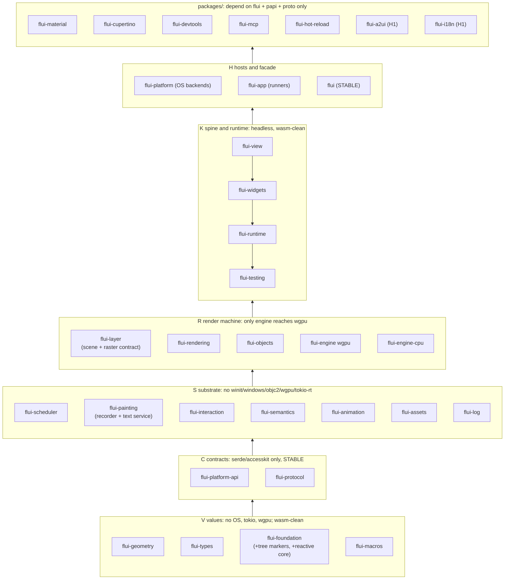

# FLUI target global architecture: synthesis

*Snapshot: main @ `cab06137d`, 2026-09-25. This is a read-only review with no repository changes. Code claims are cited as `path:line`. The judges verified most of these; the rest I re-checked in this pass, noted where relevant. Claims marked **(hypothesis)** have not been measured. The crates.io MCP server did not connect, so I could not check crate-name availability.*

**Sources and how the conflicts were settled.** I started from **ecosystem_evolution_first**. Two of the three judges named it the winner, and all three named it the best topology. I then applied **safety_correctness_first**'s mechanics, which the engineer judge rated highest: an object-safe capability seam, "one implementation per contract", gate-first ratchets, and a `Writer` token. From **performance_first** I took work counters, the retained layer identity contract, and bus-factor sequencing. From **ai_native_first** I took the runtime placement above widgets, `#[derive(Catalog)]`, and one query model shared by tests and agents. From **dx_first** I took `#[flui::main]`, `App::new(any View)`, typed routes, `__runtime` in place of a feature, and generated docs. From **minimalist** I took P8 and P9. Every design rejected by at least two judges is dropped. The resolutions are stated in each section and collected in §15.

---

## 1. Principles

The owner's seven principles are kept. Two are reworded and five are added. Each added principle names what enforces it, because a principle with no gate has already decayed once in this repo: the ambient-reach ratchet that `roadmap.md:224,743` relies on no longer exists (`git ls-files` finds no `runtime-contract.toml`).

| # | Principle | Enforced by |
|---|---|---|
| P1 | **The mental model is sacred.** View → Element → Render, keys, lifecycle, constraints down and sizes up. Everything underneath may change. | Render-object and element-lifecycle conformance kits, not prose |
| P2 *(reworded)* | **One language, one toolchain, one raster contract.** wgpu is the production rasteriser on every platform. A CPU rasteriser is a peer implementation of the *same* contract, used for goldens, CI without a GPU, and the software fallback. This supersedes `crates/flui-engine/ARCHITECTURE.md:8-14` ("nothing here exists to make one pluggable"), which contradicts E7 and H2 and has already produced a diverging second walker (`crates/flui-engine/src/headless.rs:15-27`). | A raster conformance suite run against every backend |
| P3 | **No global state.** Everything belongs to a realm or is passed in explicitly. Immutable shared infrastructure (font collection, GPU device, pipeline cache) may be app-scoped, but only if it is handed down explicitly and never reached ambiently. | `cargo xtask globals` with an allowlist that can only shrink (§9) |
| P4 | **Everything is machine-readable.** DevTools, tests and agents are clients of one protocol with one vocabulary (AccessKit). | `flui-protocol` is the only schema crate |
| P5 | **Proof, not claims.** Evidence is stored as structured records (`docs/evidence/*.toml` written by `xtask device` and protocol runs), not prose in BETA.md. | xtask renders BETA.md from the records |
| P6 | **Break explicitly.** Every break gets an ADR with `Supersedes:` and a `flui migrate` rule shipped as data by the crate that breaks. | ADR front-matter check in xtask |
| P7 | **Look at the market before deciding.** | — |
| **S1** | **One implementation per contract.** One frame transaction, one BuildContext, one raster lowering, one reactive graph, one protocol schema. Tests drive production code paths. | Deleting duplicates (§13) |
| **P8** | **A crate is a cost.** A new crate needs an ADR naming its second consumer or the compile or semver seam it buys. | ADR review; `cargo xtask workspace` |
| **P9** | **A seam exists only once a second implementation passes its conformance kit.** Unwired `pub` surface is deleted at the next minor unless the PR names the follow-up that wires it. | Conformance kits; public-API snapshot diff |
| **P10** | **No pre-1.0 upstream type in a Stable signature.** Examples: accesskit 0.25, ui-events 0.3, parley, wgpu 30, android-activity. Today the facade re-exports `flui_app::android_activity` (`src/lib.rs:157`). | cargo-public-api snapshot of the 3 Stable crates |
| **S2** | **Thread affinity is a type.** Realm-owned state is `!Send` and lock-free. `Send` exists only at lane boundaries: `Scene`, mailboxes, `WindowHandle`, `SignalSender`, IO results. | `assert_not_impl_any!`, clippy `disallowed_types` on frame-path crates |

**Where this departs from the plan, with evidence:**

- **"Official packages in separate repos, one release train"** (plan.md, delivery layers). This contradicts itself: separate repos imply independent cadence. Flutter merged its engine back into a monorepo in December 2024, and Slint keeps Material in the same repo as a separate workspace. **Decision:** `packages/` in this repo, depending on `flui` with caret requirements. The repo splits per package only when that package's cadence diverges. plan.md needs a one-line amendment.
- **ADR-0041's "no flui-runtime until two entry points"** is already satisfied. `HeadlessBinding::pump_frame` (`crates/flui-testing/src/lib.rs:955-1079`) is a second entry point that re-implements the frame transaction. Superseded.
- **ADR-0078's "one method per capability"** makes the H1 exit ("5 plugins built outside the repo") impossible, because `LifecycleContext` is sealed (`crates/flui-view/src/context/build_context.rs:106,377`). Superseded; the replacement is in §7.
- **ADR-0027's "multiple realms may execute concurrently"** is not what the code does. N realms are serialized in a thread-local (`crates/flui-app/src/app/runner/host.rs:25-47`). Amended to "realms are isolated, not concurrent".
- **ADR-0074's placement** puts the graph per `BuildOwner`, which in practice means per presentation (`build_owner.rs:444,722`), so `SignalWrite` always targets the primary window (`ui_realm/commands.rs:450-455`). The graph moves to the realm, with its core below rendering.
- **The 2026-09-23 decision to keep flui-widgets as one crate stands.** Its promised import-direction gate does not exist (`tools/xtask/src/tasks/checks.rs:100-120`) and becomes an H0 gate.

---

## 2. Workspace and crate topology

### 2.1 Tiers

Eleven numeric layers (`Cargo.toml:92-104`) are replaced by six named tiers. Each tier has a direction rule plus a **reach fact**: a list of crates that must not appear in the tier's normal dependency graph. This generalises the existing TREE_FACTS (`tools/xtask/src/tasks/facade.rs:49-90`). Intra-tier order is also declared, so that `interaction → platform` cannot hide inside "L2" again.

A second, orthogonal manifest key, `tier-kind = stable | internal | official | tool`, sits next to `layer`. `cargo xtask workspace` enforces it:

- `stable` crates are semver-checked and may not name pre-1.0 upstream types in public signatures.
- `internal` crates are published, exact-pinned, carry an "internal, no semver" banner, and are not semver-checked.
- `official` crates may have exactly these normal in-repo dependencies: `flui`, `flui-platform-api`, `flui-protocol`.
- `tool` crates are `publish = false` and are never a dependency.



**Why the runtime sits above widgets.** `crates/flui-app/src/app/ui_realm/attach.rs:6` imports `FocusRoot, GestureArenaScope, VsyncScope`, `media_query_root.rs:9` imports `MediaQuery`, and `commands.rs:8` imports `NavigatorCommand`, all from flui-widgets (re-verified in this pass). Placing `flui-runtime` above widgets means the extraction needs no preparatory widget moves. dx_first and minimalist placed the runtime below widgets without accounting for those imports. Safety placed it below but did state the move; that is the costlier path and is rejected. Two consequences:

1. `NavigatorCommand` in the runtime command channel is replaced by a catalog-neutral navigation intent (a route or URL) when the Router lands, so the runtime and the agent protocol never name Navigator.
2. The root-scope inherited views may move down to `flui-view` later if an embedder needs a runtime without the catalog. That is an H4 option, not an H0 requirement.

### 2.2 Target crate list

**Core (on the train).** This is 25 units including the facade. The CLI is a separately versioned product.

| Crate | Tier / kind | Responsibility | Public surface |
|---|---|---|---|
| `flui-geometry` | V / internal | Unit-typed 2D math. One `Rect`, one `Axis`, Point plus Offset. | via facade |
| `flui-types` | V / internal | Values shared by at least 2 tiers: Color (f32 plus colour space), TextStyle, spans, layout enums, Path/Paint | via facade |
| `flui-foundation` | V / internal | IDs, keys, callbacks, diagnostics vocabulary, `observe`, **tree markers** (Arity/Slot/Depth, from flui-tree), **reactive graph core** (data structures only), `#[doc(hidden)] runtime` module for protocol identities | via facade |
| `flui-macros` | V / internal | View / RenderView / InheritedData / Store / Catalog / Route derives, `#[flui::main]`, `#[flui::test]` | via facade |
| `flui-platform-api` **(new)** | C / **stable** | `PlatformCapability`, `Unsupported`, `NativeContext`, the IME text-store protocol, `PlatformAccessibility`, lifecycle state machine, input vocabulary (wrapped ui-events), backend minting seam (#560), backend conformance kit | Plugin authors |
| `flui-protocol` **(new)** | C / **stable** (Evolving until H3) | ADR-0080 wire types, AccessKit role and action vocabulary (via `accesskit::Role`), outline serializer, `Query`/`Action`, error codes, catalog descriptor schema, event envelope, replay log | Agents, tests, devtools |
| `flui-scheduler` | S / internal | Phases (with a named effects phase), owner-local `!Send` core plus `Send` waker, FrameClock demand authority | via facade |
| `flui-painting` | S / internal | DisplayList recorder, **text service** (realm-injected `FontContext`, Parley after the spike), a shaped-run contract | via facade |
| `flui-interaction` | S / internal | Gestures, focus, keys, hit-test values. Depends on `flui-platform-api` only. | via facade |
| `flui-semantics` | S / internal | Semantics model, AccessKit translation, owner-lane action targets | via facade |
| `flui-animation` | S / internal | Curves, tweens, sole owner of simulations, `!Send` controller | via facade |
| `flui-assets` | S / internal | Runtime-agnostic loaders on an injected IO spawner, decoded-image cache (moved from widgets), wasm fetch loader | via facade |
| `flui-log` | S / internal | Subscriber assembly, composition roots only | app authors |
| `flui-layer` | R / internal | Scene, retained LayerTree with stable boundary identity, **raster contract** (walk, `CommandRenderer`, LayerStateStack, effect decomposition, damage differ), `Layer::External`, conformance suite | via `flui::sdk` |
| `flui-rendering` | R / internal | RenderBox/RenderSliver protocol, typestate pipeline, topology transaction API, build-during-layout cells, virtualizer, render conformance kit | via `flui::rendering` |
| `flui-objects` | R / internal | First-party render catalog, catalog parent data, delegates, `ScrollPosition` | via facade |
| `flui-engine` | R / internal | wgpu rasteriser, `GpuContext` (one per app) plus a per-window `Presentation`, pipeline cache and prewarm | minimal; wgpu interop behind `unstable-wgpu-interop` |
| `flui-engine-cpu` **(new)** | R / internal | CPU rasteriser of the flui-layer contract (vello_cpu or tiny-skia, decided by spike). Goldens, CI without a GPU, H2 software fallback. | none |
| `flui-view` | K / internal | Authoring traits, elements, reconciliation, public element protocol; `#[doc(hidden)] pub mod __runtime` | via `flui::view` |
| `flui-widgets` | K / internal | Base catalog, **Raw primitives**, Router, Form, token substrate; module DAG gate | via `flui::widgets` |
| `flui-runtime` **(new)** | K / internal | `Realm`, `Presentation`, **the single frame transaction**, lanes, execution/`Spawner`, capability registry, `RealmObserver`/`InspectHook`, `DevReloadHook`, GlobalKey scope | `App` builder via facade |
| `flui-testing` | K / internal (dev) | `WidgetTester` with finders over `flui-protocol` queries, virtual clock, semantic and pixel goldens, replay, perf counters | via `flui::testing` |
| `flui-platform` | H / internal | OS backends only (Win32 + TSF, AppKit, UIKit, Android, web, winit on Linux) | none |
| `flui-app` | H / internal | Thin `PlatformHost` runners, window/surface/device recovery. Target under 15k LOC. | via facade |
| `flui` | H / **stable** | Curated modules, enumerated catalog-neutral prelude, `sdk`, `unstable` | apps and packages |
| `flui-cli` | product | `create run build test devices doctor devtools mcp`; later `migrate publish` | typed NDJSON schema |

**Official packages** (`packages/`, `tier-kind = official`, caret on `flui`): `flui-material`, `flui-cupertino`, `flui-devtools` (in-process protocol server), `flui-mcp` (promoted from `tools/desktop-mcp`: OS driver library plus stdio MCP binary), `flui-hot-reload` (rewritten on Subsecond). H1 adds `flui-a2ui`, `flui-i18n` (ICU4X), `flui-net-image`, and `flui-plugin-*` (camera, geo, notifications).

**Tools** (`publish = false`): `xtask`, `live-smoke` (becomes a scenario runner over the `flui-mcp` driver library), `decoy-face`. `web-server` is deleted. `device-checks` is ported to Rust one check at a time as each is next touched. `text-spike` is archived when the spike closes.

### 2.3 Fate of all 27 current crates

| Current crate | Fate | Reason (evidence) |
|---|---|---|
| flui-geometry | **Keep, trim ~3.5k lines** | Unused GPUI vocabulary: `length.rs`, `transform2d.rs`, `bezier.rs`, `text_path.rs`, the kurbo bridge, and the no-op `mint` feature. Fix the Pixels Eq/Hash/Ord inconsistency (`units.rs:91,575-596`), where ±0.0 compare equal but hash differently, which breaks H2 cache keys. Move geometry tests out of flui-types. **The merge into types is rejected**: types is rebuilt by 24 crates, and no exit item needs the merge. |
| flui-types | **Keep, shrink** | Delete physics (duplicated in `flui-animation/src/simulation.rs:31`), `BoxConstraints` (duplicate), `MaterialColors`, and orphan types. Move gesture details to interaction. Rule: an item needs at least 2 consuming crates. Decide Color as f32 plus colour space before publishing (`color.rs:25`). |
| flui-foundation | **Keep, absorb tree markers and the reactive core** | Runtime-protocol identities (FrameStamp, PresentationAddress, ClaimSlot, OwnerAffinity) move to a `#[doc(hidden)] runtime` module. They sit here only because of a CI gap (`affinity.rs:11-13`). `ChangeNotifier` becomes an `Rc` adapter over the graph. Delete ListenerRegistry and ViewId. |
| flui-macros | **Keep, grow** | Add derives: RenderView, Store, Catalog, Route. Add attributes: `flui::main`, `flui::test`. Add facade-only trybuild tests. |
| flui-tree | **Merge** Arity/Slot/Depth into foundation; **delete** the TreeRead/Nav/Write trio and `bon` | The trio has no generic consumer, and ElementTree does not implement it (`tree/element_tree.rs:394`). ai_native's "give it a job" is rejected because it is speculative abstraction. |
| flui-platform | **Split** into `flui-platform-api` (C) and backends (H) | One import, `crates/flui-interaction/src/text_input.rs:27`, pulls winit, tokio and windows into rendering, view and widgets. Delete the no-op `desktop = ["dep:winit"]` default (`Cargo.toml:300,303`), `LinuxPlatform`, the second `Window` trait (`src/window.rs`), `PlatformEmbedder`, `PlatformCapabilities`, and `BackgroundExecutor`. **Backends stay in their own crate**, not inside flui-app (minimalist's 90k-line crate is rejected), which keeps a clear unsafe and CI boundary. |
| flui-scheduler | **Keep, slim** | Owner-local core plus a `Send` waker, replacing about 20 Mutexes (`scheduler.rs:743-855`). `AsyncDriver` moves to the runtime and drops `Send` (`async_driver.rs:102`). `TIME_DILATION` (`config.rs:43`) moves to the presentation clock. The merge into scheduler is rejected. |
| flui-painting | **Keep** | FONT_SYSTEM (`text_layout/layout.rs:124`) becomes an injected realm `FontContext` over a shared collection. Wrap `fontdb::Family` (`lib.rs:87`). **No `flui-text` crate in H0.** Extract only if the Parley spike and a `cargo build --timings` measurement show that shaping separates cleanly from recording (§5.3). |
| flui-interaction | **Keep** | Depends on platform-api. The `InteractionLane` TLS closure registry (`interaction_lane.rs:738-742`) moves to an explicit owner-lane handle in the runtime. Arena and recognizers move from `Arc<Mutex>`/DashMap to `Rc`/`RefCell`. |
| flui-assets | **Keep, de-runtime** | Delete `AssetRegistry::global()` (`registry/mod.rs:83`) and the owned tokio runtime (`bridge.rs:42-66`). Absorb the widgets decode cache (`decode_cache.rs:96`). **Removing assets from core is rejected**, because there is no replacement IO/image seam. |
| flui-log | **Keep** | Composition-only and clean. Allowed-dependents list `flui-cli` (`Cargo.toml:66`), but the CLI has 0 uses (re-checked here). Keep the allowance for later CLI use; folding the crate into app is churn without an exit item. |
| flui-layer | **Keep, grow** | Takes the engine's GPU-free lowering modules: `layer_walk`, `layer_render`, `dispatch`, `command_renderer`, `damage` (0 wgpu references, verified), plus `LayerStateStack` (comments only). Adds stable identity, the differ, `DamageRegion::Partial`, `Layer::External`, and the conformance suite. |
| flui-semantics | **Keep** | AccessKit-native action set 1:1. Owner-lane action targets replace `Arc<dyn Fn + Send + Sync>` (`action.rs:217`). The merge into rendering is rejected. |
| flui-animation | **Keep** | `!Send` controller (`controller.rs:177-208` records the pending flip). One clock per presentation. |
| flui-rendering | **Keep, tighten** | Topology transaction API; `render_tree_mut` becomes private (`accessors.rs:348`, 26 flui-view call sites). Remove the catalog knowledge (`owner/semantics.rs:1003-1008`, `context/intrinsics.rs:13,316`). Remove the 57 `testing`-cfg sites that reshape `PipelineOwner` (`owner/mod.rs:251-257`). |
| flui-objects | **Keep** | Receives catalog parent data, delegates and ScrollPosition. The build-during-layout cells move down into rendering. The harness becomes the first client of the conformance kit, replacing the string registry (`render_object_harness.rs:151,14440-14485`). |
| flui-engine | **Keep, narrow** | Becomes the wgpu backend of the contract. Drop `pub use ::wgpu` (`lib.rs:229`). `raster_owner` moves to the runtime. `WgpuPainter` becomes crate-private. `HeadlessRenderer` **stays until engine-cpu passes conformance**; the safety design's early deletion would make CI need a GPU. |
| flui-view | **Keep, re-cut** | Drops the objects and animation edges (`sliver_adaptor.rs:58`) through a public element protocol; LayoutBuilder, lazy slivers and async builders move to widgets. Delete `ElementBuildContext` (`element_build_context.rs:39`, test-only). `runtime-internals` becomes `#[doc(hidden)] __runtime`. The signal graph moves to foundation and the realm. `WidgetsBinding` moves to the runtime. |
| flui-widgets | **Keep one crate** | Module DAG gate. Pulls the Raw primitives down from Material. Router, Form, token substrate. Delete `__private` (no external consumer). |
| flui-testing | **Move above runtime** | Drives the real transaction. Folds in `flui_widgets::testing` (1.6k+0.5k lines). The widgets → testing normal edge (`flui-widgets/Cargo.toml:89`) is removed. |
| flui-hot-reload | **`publish = false` now, rewrite on Subsecond as an official package** | The dlopen design has documented residual UB risk (`lib.rs` header). Delete the 3-crate template, `--scene`, and the 5 example members only after the spike passes; the dx and ai_native designs deleted too early. |
| flui-material | **Official package** | Currently depends on 10 internal crates (`crates/flui-material/Cargo.toml:25-69`) and reaches into objects, scheduler and rendering (`material.rs:83`, `scaffold_messenger.rs:212`). Target: `flui` plus `flui::sdk` only. |
| flui-cupertino | **Official package** | Same. It gains focus and keyboard activation from the Raw primitives (`button.rs:34-43`). |
| flui-localizations | **Delete** | 281 lines in its own layer. The RTL table moves to `flui_widgets::localization`, strings to each design package, and ICU4X to the H1 `flui-i18n`. |
| flui-app | **Shrink to runners** | Realm, frame, lanes, execution, semantics host and held input move to the runtime or their subsystems. `realm_dispatch.rs` (7,149 lines) dissolves. The embedder stub and dead features are deleted. |
| flui-cli | **Product, independent version** | Adds `mcp`, `devtools`, `test --golden --accept` with per-test NDJSON, `catalog`. Absorbs web serving. |
| flui-devtools | **Repurpose as an official package** (in-process protocol server) | Zero production consumers today (`lib.rs:18-24`). It stays a server package and is **not** merged into `flui-protocol`, which would mix wire types with a server (the engineer judge's objection to performance_first). |

**Totals.** Deleted: tree, localizations. Moved to packages: material, cupertino, devtools, hot-reload. New: platform-api, protocol, runtime, engine-cpu, plus flui-mcp promoted from tools. That gives 24 core crates plus the facade on the train, 3 of them semver-promised. Crate count is not what drives maintenance cost; semver promises are, and they drop from 28 potential units to 3.

### 2.4 Core, official, community, tools

- **Core** is the train. It is published with `cargo publish --workspace` (Rust 1.90). Internal edges carry exact pins generated from `[workspace.dependencies]`, replacing 145 hand-written `=0.2.0-dev` pins in `crates/*/Cargo.toml` (the owner judge's count). Semver-checks run only on `flui`, `flui-platform-api` and `flui-protocol`.
- **Official** packages live in `packages/`, carry their own version, use caret requirements on `flui`, and are Evolving-tier. Material ported to `flui` plus `sdk` is the H0 proof that the seam holds.
- **Community** crates get `flui verify` badges computed from conformance kits: builds against the current train, harness passes, semantics declared, unsafe budget declared. This replaces a curation committee a bus-factor-1 project cannot staff (the pub-points model).
- **Tools** are never dependencies and are listed in `tools/` with `tier-kind = tool`.

### 2.5 Feature policy

1. Features are additive. Every optional dependency is `dep:`. **A feature with zero cfg sites fails `cargo xtask workspace`.** This deletes flui-app's `desktop/android/ios/web/debug-overlay/performance-overlay`, flui-platform's `desktop/web/wayland/x11`, geometry's `mint`, and types' `simd`.
2. **A feature is never a visibility switch.** `runtime-internals` is on for every app through unification (`crates/flui-app/Cargo.toml:90`), so it is replaced by `#[doc(hidden)] pub mod __runtime`. One `unstable` facade feature (plus `unstable-<area>` per crate) marks the Experimental tier.
3. **No feature changes a production type's layout.** The per-crate `testing` features become harness-installed hook registries. A `static_assertions` size check pins `PipelineOwner`.
4. Backends are selected by target, not by user feature. The a11y adapters for Windows and macOS are unconditional target dependencies. Linux AT-SPI is `a11y-linux`, on by default with an opt-out.
5. **Signals are not a feature.** They are the canonical state layer. ecosystem_evolution_first's default list, which kept `signals` as a feature while calling signals canonical, is inconsistent.
6. Facade: `default = []`. Opt-in features: `images`, `network-images`, `serde`, `devtools` (implied in debug by the CLI), `hot`, `unstable`, and a dev-only `dynamic-linking` (Bevy's biggest iteration lever). Material is not a facade feature. The CLI template adds `flui-material` as a dependency.

### 2.6 Facade and prelude

```rust
// flui (Stable) — curated modules only; no `pub use flui_x as x` (removes src/lib.rs:126-152)
pub mod prelude;    // enumerated, catalog-neutral, snapshot-tested; no tracing macros,
                    // no BuildOwner/ElementTree (removes flui-view/src/lib.rs:252,278-285)
pub mod view;       // StatelessView, StatefulView, ViewState, InheritedView, RenderView, keys, contexts
pub mod state;      // Signal, Computed, Effect, Store, Writer; `state::low` = StateCell/StateHandle
pub mod widgets;    // base catalog + Raw primitives + Router + Form
pub mod rendering;  // RenderBox/RenderSliver authoring incl. slivers, ViewportOffset, LayerLink
pub mod painting; pub mod interaction; pub mod animation; pub mod geometry;
pub mod platform;   // re-exports flui-platform-api capability surface
pub mod testing;    // WidgetTester, finders, goldens, conformance kits
pub mod sdk;        // Evolving: what a design system needs — Surface, post-frame, tokens,
                    // RealmObserver, InspectHook (exactly what Material/Cupertino/devtools import)
#[cfg(feature = "unstable")] pub mod unstable;
#[doc(hidden)] pub mod __runtime;
```

Apps using Material glob two preludes: `flui::prelude::*` and `flui_material::prelude::*`. That is deliberate, so that no app import breaks when Material leaves the train.

### 2.7 Publish order

The order is generated from tier and intra-tier order, never hand-maintained:

V (geometry, types, macros, foundation) → C (platform-api, protocol) → S (log, scheduler, painting, interaction, semantics, animation, assets) → R (layer, rendering, objects, engine, engine-cpu) → K (view, widgets, runtime, testing) → H (platform, app, flui) → packages (material, cupertino, devtools, mcp, hot-reload).

Upward dev-dependencies become version-less path dependencies. A `cargo xtask release-check` CI job runs `cargo package` dry-runs in order plus semver-checks against the last tag. None exists today; `release.yml:17` says "Publishing to crates.io is not done here".

---

## 3. Runtime model

### 3.1 Trees and identity

The five trees stay: View → Element → Render → Layer, with Semantics alongside. Changes:

- **ElementId stays as it is.** It is already a generational `NonZeroU64` (`crates/flui-foundation/src/id.rs:1163`). Re-packing it into `GenId` "for uniformity" is rejected. **LayerId and SemanticsId become `GenId`**, because today they are reusable slab indices (`id.rs:614-760`) that become ABA-unsafe once caches and agent handles key on them. The AGENTS.md "ID offset" row, which describes 1-based `NonZeroUsize` with `id.get() - 1`, contradicts the code and is corrected.
- **View configurations are shared, not deep-cloned.** Children move into child elements or are `Rc`-shared. Today every level does a `dyn_clone` (`view/into_view.rs:178-184`, `element/behavior.rs:1071`, `dispatch.rs:145`).
- **Topology is owned by the tree that stores it.** `PipelineOwner<Idle>::set_children(parent, &[RenderId])` and `move_subtree` enforce arity and depth, mark dirty, and evict captures. flui-view submits per-parent diffs. The global `synchronize_render_children` pass (`element_tree.rs:1428-1520`) becomes a debug verifier.
- **The layer tree keeps stable identity.** Each repaint boundary is an `Arc` subtree keyed by `RenderId` (already stamped, `flui-layer/src/tree/layer_tree.rs:38`), so a graft is O(1) and damage becomes a pointer-level diff. Today paint mints fresh ids each frame (`paint.rs:1383-1425`) and every frame is `DamageRegion::Full` (`raster_lane.rs:354,486`).

### 3.2 Realms and threads (decided)

```text
App (flui-app runners)
 └─ OwnerHost (flui-runtime; owned value, replaces thread_local APP_RUNTIME, host.rs:46)
     ├─ Realm (!Send): ReactiveGraph, GlobalKeyScope, CapabilityRegistry, FocusCoordinator,
     │                 SchedulerCore, Spawner, FontContext, image-cache handle, RealmObserver
     │   └─ Presentation × N: ElementTree+BuildOwner, PipelineOwner, FrameClock(DemandMask),
     │                        Vsync, SemanticsHost → FrameSink (raster lane)
     └─ SharedEngineServices: GpuContext (one device/queue/pipeline cache/glyph atlas),
                              fontique Collection {shared: true}, immutable after load
```

- **One owner thread per process hosting N isolated realms, for H0 through H2.** On AppKit, UIKit and wasm the owner thread *is* the main thread. Per-realm owner threads on Win32 and Linux are an H2 spike behind an `OwnerExecutor` trait, not a promise.
- **Intra-realm parallel layout is a non-goal, recorded now.** The types already exclude it: `RenderObject` is not `Send` (`traits/render_object.rs:178`) and `PipelineCell` is `Rc<RefCell>`. Leaving the question open keeps `Arc<RwLock>` shapes alive in public API right before the freeze. Parallelism goes into lanes (raster, IO, compute, shaping of large paragraphs) and across realms.

### 3.3 One frame transaction (S1)

`Realm::pump(&mut self, clock: &mut dyn FrameClockSource, sink: &mut dyn FrameSink) -> FrameOutcome` is the only frame driver:

input apply → build drain → **effects** (named phase) → layout, with lazy children built *inside* sliver layout, replacing the up-to-10/6-pass fixpoint (`flui-view/src/owner/layout_builder.rs:64,74`) → compositing → paint (retained layers) → semantics (incremental) → layer diff → damage → `SceneSnapshot` → post-frame.

flui-app drives it with the platform clock and the raster lane. flui-testing drives it with a `ManualClock` and a headless or CPU sink. The perf harness drives it with counters. HeadlessBinding's re-implementation is deleted.

### 3.4 Scheduling and demand

Each presentation has one demand authority: `FrameClock::mark_demand(reason)`, with frameclock-style demand classes (INPUT, CONTINUOUS_INPUT, ANIMATION, BACKGROUND). The scheduler, AsyncDriver, Vsync, input and `request_visual_update` only mark demand. Today there are five carriers plus a loop-wide `needs_redraw` shared across realms (`runtime.rs:727`, #1172). There is one virtual-capable clock per presentation, and the wall-clock Ticker path is retired.

### 3.5 Lanes and async

- **Raster lane.** ADR-0045 is accepted as mode-agnostic. `Inline` is permanent on macOS (wgpu-hal pin #653) and wasm. The lane is threaded on Win32 and Linux once text no longer shares a mutex with glyph rasterisation (§5.3). Web moves onto the lane and `DirectSink` is deleted (`runner/web.rs:85`). `RasterOwner` moves from engine to runtime, since it is scheduling topology, not rasterisation.
- **IO and compute lanes.** A `Spawner` capability is acquired in `init_state` and cancelled on unmount. Owner-lane futures are `!Send` (local variant). Pool futures are `Send`, and their results return as commands in the next frame's input phase. **Tokio has one owner**: the runtime's default executor, behind a feature, with hosts able to inject their own (ADR-0047 `HostExecutors`). This deletes the runtimes in flui-platform (`executor.rs:66`) and flui-assets (`bridge.rs:66`), leaving one where there are up to four today.

---

## 4. State and reactivity

**Decision.** Signals are canonical and always on. The graph core is a **data-structure-only module in `flui-foundation`**; its instance is a **realm resource**; its subscribers are **phase-typed**.

- **Placement.** Four options were on the table: a new `flui-reactive` crate (safety, dx), `flui-state` (ai_native, roadmap.md:766), foundation (performance, ecosystem, minimalist), and flui-view (today). Foundation wins. flui-rendering and flui-animation already depend on it, so a paint or layout subscriber needs no new edge, and P8 is satisfied without a new publish unit. The core holds no realm type: arena, Clean/Check/Dirty push-pull with intrusive slab links, owner disposal, write journal, and path-keyed triggers for stores. Blast radius is measured with `cargo build --timings` when it lands. If the core outgrows foundation, extracting it later costs one PR.
- **Subscriber kinds:** `Element(presentation, ElementId)` → rebuild; `Layout(RenderId)` → needs_layout; `Paint(RenderId)` → needs_paint. This is Compose's per-phase read tracking, and it answers the plan's "element-level or render-level" question with "both, in one graph". Element subscribers ship first. Render subscribers ship behind measured need, such as animation-rate values **(hypothesis: needed for scroll and drag)**. The `Arc<Mutex>` Listenable repaint path (`notifier_generic.rs:41-45`) becomes an `Rc` adapter over the graph.
- **Realm ownership** fixes cross-window signals and `SharedRealm`.
- **The write rule becomes a type.** A `&mut Writer` (spelled `w` in sketches) is supplied only to callbacks, effects, and task continuations. `Signal::set/update(w, ..)` therefore cannot be called from `build`, which turns ADR-0074's run-time guard into a compile error. **Signals are never created in `build`.** They are created in `create_state`/`init_state` through `LifecycleContext`, or as realm stores. The minimalist and ecosystem sketches (`cx.signal(0)` inside `build`) contradict ADR-0074 and are rejected.
- **Visibility semantics** (recorded in the effects ADR): the value is visible synchronously, and invalidation is coalesced per frame. The frame boundary already provides Solid 2.0's determinism for invalidation.
- **Collections (A8):** `#[derive(Store)]` produces path-keyed triggers. Parents and children are notified, siblings are not. Keyed collection access uses the same keys as the reconciler and virtualizer, and there is a `Patch` diff-on-assign for bulk and A2UI data.
- **One prop type:** `impl Into<Bind<T>>` accepts a value, a Signal, or a projection. It is defined in core before Material and community catalogs grow.
- **Escape hatch.** `StateCell`/`StateHandle` move to `flui::state::low` (setState level), **not deleted** (the minimalist deletion is rejected). An unbound `StateCell` mutation becomes a debug panic with a fix hint instead of silently scheduling nothing (`state_cell.rs:48-60`).
- **The write journal** (slot, writer, frame) is exposed to `RealmObserver`. It feeds devtools, `flui mcp` and record/replay, recovering iced-style time travel without Elm ceremony **(hypothesis)**.
- **Text field state** is a `TextFieldState` backed by the graph, with an `edit(|buf| ..)` transaction, input and output transforms, and undo. It replaces `Arc<Mutex<ControllerInner>>` (`text/controller.rs:263`), following Compose's TextFieldState lesson.

---

## 5. Rendering, text and engine

### 5.1 The raster contract

`flui-layer::lower` holds the backend-neutral lowering: walk order, clip and opacity discipline, the effect decomposition (backdrop, shader mask and follower become neutral steps rather than `Renderer` methods), `CommandRenderer`, `LayerStateStack`, the damage differ, and the conformance suite. `flui-engine` (wgpu) and `flui-engine-cpu` implement it. HeadlessRenderer is then replaced by "any backend rendering to a caller target", once engine-cpu passes. Custom content enters through **one** open variant, `Layer::External { id: ExternalContentId, rect }`, backed by typed registries (textures, and custom shader programs in H2). `DrawOp` and `Layer` otherwise stay closed, which fulfils the plan's "custom layers" extension point in a safe form. The no-op `PlatformViewLayer` handler (`layer_render.rs:381-384`) is deleted until the presenter work lands.

### 5.2 Damage and presentation

The producer diffs consecutive retained trees: `Arc::ptr_eq` on pictures, deltas on transform, opacity and clip, and structure changes. It emits `DamageRegion::Partial`, falling back to `Full`. wgpu has no buffer age or present regions (wgpu#682, closed as not planned), so the default presenter renders into a **persistent retained target plus a blit**. **Hypothesis to verify before E1:** today's scissor straight into a rotating swapchain image (`renderer.rs:2290-2330`) would leave stale pixels once a producer exists. A `Presenter` trait (the Subduction shape) sits between the scene and the OS. Implementation #1 is the swapchain presenter. Implementation #2 (DirectComposition, CoreAnimation, SurfaceControl) is the H1 compositor spike and the only route to real OS partial present and zero-copy video.

**Sequencing (owner judge).** Retained identity and damage settle the paint→layer contract **before H3**, but the work is scheduled *after* the runtime and platform-api cuts. B2's exit already requires partial repaint.

### 5.3 Text

- ADR-0077 (Parley) and B1 (per-realm fonts) become **one ADR**. It defines: a shared, immutable-after-load fontique `Collection { shared: true }`; per-realm `FontContext`/`LayoutContext` with no lock; a glyph atlas owned per `GpuContext`, with rasterisation on the raster side outside any shaping lock; and glyph keys that carry font-blob identity rather than process-lifetime cosmic keys (`glyphs.rs:23`).
- The DisplayList crossing becomes a **neutral shaped-run contract**: font blob id, glyph id, size, variation coordinates and subpixel bin, plus a `GlyphRasterizer` trait. It replaces `Arc<cosmic TextLayout>` (`display_list/command.rs:167-174`). Both the wgpu atlas and engine-cpu consume it, so goldens use the same glyph path by construction.
- ICU4X arriving with Parley becomes the single Unicode source, and the separate `unicode-segmentation` dependency is dropped.
- The host font scan becomes asynchronous. Bundled faces are available for the first frame, and system fonts arrive as a realm event that relayouts text. The same event fixes the missing invalidation on `register_font`.
- **Crate decision:** no `flui-text` in H0; the text service is a module of flui-painting. performance_first's crate would be justified by rebuild fan-out (cosmic-text reaches 17 crates through painting), and that is to be *measured* after Parley lands, not assumed.
- **Spike scope expanded:** evaluate glifo against hand-written skrifa→atlas glue, and require "no process-global font state" in the acceptance criteria.

### 5.4 GPU

There is one `GpuContext` per app (instance, adapter, device, queue, `wgpu::PipelineCache`, a closed prewarmable effect catalog, glyph and image atlases), created first, with surfaces created from the same instance. There is one `Presentation` per window. Today each window builds its own Instance and Device (`renderer.rs:1140-1168`), and `SharedRealm` with content is refused (`secondary_window.rs:741`). Device loss is recovered per `GpuContext`. Backend set: dx12, metal, vulkan, with engine-cpu as the fallback where no backend exists. Today there is no GLES and no fallback (`crates/flui-engine/Cargo.toml:105-112`).

---

## 6. Platform, plugins and accessibility

### 6.1 Contract and backends

`flui-platform-api` contains:
- owner-affine `!Send` window objects, plus a `Send` `WindowHandle` proxy with a closed verb set (redraw, close, title, and so on) routed through a mandatory per-backend transport. This removes most of the 26 `unsafe impl Send/Sync` and the documented `request_redraw`-from-any-thread violation (#949);
- one lifecycle state machine that every backend emits (app lifecycle, execution state, surface status, visibility, appearance), so runners become thin;
- the input vocabulary, wrapped under P10;
- `PlatformAccessibility` (takes an `accesskit::TreeUpdate`, a clean seam today);
- a shared owner-loop state machine (admission, deferred open, quit fence, exit policy, wake deadline) driven by a small `NativeLoop` trait. Today this is re-implemented 4 to 6 times;
- the backend minting seam (#560) and a backend conformance kit generalised from `tests/contract.rs`.

**One backend per OS**, recorded in an ADR: native Win32, AppKit, UIKit, Android, web, and winit as *the* Linux backend (renamed from "fallback"). The winit option is removed from Windows and macOS production. `LinuxPlatform`, whose methods are all `unimplemented!`, is deleted.

### 6.2 IME: pull-based text store

The two-method push trait (`traits/text_input.rs:24-45`) cannot serve TSF, NSTextInputClient, UITextInput or InputConnection. macOS already answers `attributedSubstringForProposedRange` with nil (`macos/text_input.rs:430-446`). The replacement is a synchronous, read-only **text-store query surface**: text in a range, selection, composing range, rect for a range, index for a point. The backend pulls on the owner thread. It is implemented by `TextFieldState` plus the Parley layout, which is why it is designed together with ADR-0077. **Windows uses TSF (ITextStoreACP) plus the UIA TextPattern and ValuePattern from the start, not IMM32.** Flutter shows that treating IME and UIA as two contracts cost six years (flutter#182876). The shipping Win32 backend has no IME code at all (grep for `WM_IME` finds nothing), and a Japanese IME is in the B1 exit. This supersedes ADR-0030 §1.

### 6.3 PlatformCapability: an object-safe seam

`LifecycleContext` is taken as `&dyn` at 122 sites and is sealed through `BuildContext` (`build_context.rs:106,377`). A generic method declared on the trait itself, as in dx_first, performance_first, minimalist and ecosystem, would make the trait non-object-safe and break all 122 call sites. The seam is instead an erased method plus a typed extension trait:

```rust
// flui-platform-api (Stable)
pub trait PlatformCapability: 'static {
    type Handle: Clone + 'static;           // owner-local, !Send allowed
    const NAME: &'static str;               // stable, listed by the protocol (P4)
}
pub trait CapabilityProvider<C: PlatformCapability>: 'static {
    fn attach(&self, native: &mut NativeContext<'_>) -> Result<C::Handle, Unsupported>;
}
#[derive(Debug, thiserror::Error)]
#[error("{capability} unsupported: {reason}")]
pub struct Unsupported { pub capability: &'static str, pub reason: UnsupportedReason }

// flui-view: trait stays sealed and object-safe
pub trait LifecycleContext: BuildContext /* sealed */ {
    #[doc(hidden)]
    fn capability_erased(&self, id: TypeId) -> Result<Rc<dyn Any>, Unsupported>;
    /* existing handles become sugar over the registry */
}
pub trait LifecycleContextExt: LifecycleContext {
    fn capability<C: PlatformCapability>(&self) -> Result<C::Handle, Unsupported> {
        self.capability_erased(TypeId::of::<C>())
            .map(|rc| rc.downcast_ref::<C::Handle>().expect("BUG: registry type mismatch").clone())
    }
}
impl<T: LifecycleContext + ?Sized> LifecycleContextExt for T {}
```

- **`NativeContext`** exposes per-OS handles (HWND and NSWindow via raw-window-handle, JNI VM and Activity, UIViewController) and is available on the owner thread only. Owner-thread work reaches a plugin as a typed `OwnerTask` trait object, never a closure channel, which respects ADR-0039.
- **Registration:** `App::new(root).capability::<Camera>(provider)`. The endorsed default comes from `[target.'cfg(..)'.dependencies]` of the plugin's app-facing crate, and the **override hook exists from day one** (Flutter still lacks one, flutter#80374).
- **The first three clients are built in** and serve as P9's proof: clipboard (installed but `expect(dead_code)` at `crates/flui-app/src/app/runtime.rs:1632-1638`; wiring it gives EditableText copy and paste), haptics (dead, `presentation.rs:866-893`), and file dialogs (Win32-only, no caller).
- The unused `PlatformCapabilities` boolean table is deleted to avoid the name clash.
- **Build-phase safety is kept.** `capability` exists only on `LifecycleContext`, which only `init_state` and `did_change_dependencies` receive, so ADR-0078's guarantee survives while the capability set becomes open.

### 6.4 Accessibility

- **Default on.** The Windows and macOS adapters are unconditional; AT-SPI is default-on with an opt-out. `accesskit_android` and `accesskit_ios` are H1 items. `tree_id` (AccessKit 0.25.1) is used for multi-window and embedded foreign content.
- **Enablement is a realm capability.** A refcounted `SemanticsHandle` is shared by assistive technology, agents and devtools. Today it is `expect(dead_code)` (`semantics_host.rs:30-50`), so no in-process agent can see the tree unless Narrator is running.
- **Owner-lane action targets** replace `Send + Sync` handlers. This removes the AtomicBool mailbox pattern (`gesture_detector.rs:446-570`) and unblocks the onFocus action (ADR-0079).
- **Semantics is part of the widget definition of done.** A generated test lists every catalog widget and fails on any that neither publishes a configuration nor declares that it has none. EditableText (TextInput role, value, SetText and SetSelection), Scrollable, ModalRoute/Overlay (scopes_route, BlockSemantics) and Image come first.
- **Cost gate before default-on:** the `publish_cost` bench on Notes and on a 100k virtualised list.

---

## 7. Extension points per horizon

| Horizon | Extension point | Seam (crate) | Second implementation (P9) | Conformance kit |
|---|---|---|---|---|
| **H0** | Third-party render objects and slivers | `flui::rendering` (Stable) + `#[derive(RenderView)]` + public element protocol for lazy and layout-builder elements | `flui-objects` plus an **out-of-tree facade fixture with a custom `RenderSliver`** (there are none today in `tests/fixtures/*.rs`) | `flui::testing::rendering::check_box/check_sliver`: dry layout equals layout, intrinsics finite and monotone, baseline within size, hit-test within bounds, idempotent relayout, semantics stable over two frames, paint counts |
| **H0** | Raster backends | `flui-layer::lower` | wgpu plus engine-cpu | Raster conformance scenes |
| **H0** | Agent / devtools protocol | `flui-protocol` | desktop UIA backend (`flui-mcp` library) plus in-process backend (`flui-devtools`) | The same scenario produces identical outlines on both |
| **H0** | Catalog as data | `#[derive(Catalog)]` in flui-macros | Raw primitives plus the Material components Notes uses | Examples compile as tests; schema round-trip |
| **H1** | `PlatformCapability` | `flui-platform-api` + runtime registry | clipboard, haptics, dialogs | Headless fake plus typed `Unsupported` on unsupported targets |
| **H1** | Themes as data | serde token maps in `flui::sdk::tokens`, resolved through InheritedView plus FieldMask; `ThemeData::from_tokens` in each package; `WidgetStateProperty` gets a serialisable per-state-map form | Material plus Cupertino | Round-trip tests |
| **H1** | Generative UI | `flui-a2ui` (official, Evolving): surface controller, the catalog registry, JSON-Pointer projection of stores, named catalog functions, `A2uiTransport` adapter, **no LLM client in core** (GenUI's May 2026 lesson) | — | Catalog negotiation tests |
| **H1 spike, H2 insert** | External GPU content | `Layer::External` + `TextureRegistry` capability bound to `GpuContext` + `Presenter` trait. The fence contract is an ADR-0045 addendum written before the lane is threaded. | swapchain presenter plus OS-compositor presenter | Readback through the real app path |
| **H2** | Custom shaders | `DrawOp::Custom(ProgramId)` registered at app build (WGSL + uniforms + optional CPU impl), joins the prewarm set | wgpu plus CPU | — |
| **H3** | Protocol v1 freeze | `flui-protocol` versioned independently of AccessKit, with a reserved namespace for MCP extensions | — | Schema snapshot |
| **H4** | Community catalogs, backends, embedders | `flui verify` badges; the #560 minting seam; a `Host` trait for a bring-your-own event loop | community | All kits above |

---

## 8. Public API and DX

**Hello world.** Signals are created in state construction, written through the callback's `Writer`, the root can be any view kind, and there is one entry macro. Today `run_app` requires `StatelessView + Clone` (`runner/mod.rs:214-216`), which forces a wrapper type.

```rust
use flui::prelude::*;

#[flui::main]                                  // replaces run_app_android/_ios/run_app_* (8 entry points)
fn main() -> App { App::new(Counter) }

#[derive(Clone, StatefulView)]
struct Counter;

struct CounterState { count: Signal<u32> }     // Copy handle, realm-owned

impl ViewState<Counter> for CounterState {
    fn create(cx: &dyn LifecycleContext) -> Self { Self { count: cx.signal(0) } } // NOT in build
    fn build(&self, _: &Counter, cx: &dyn BuildContext) -> impl IntoView {
        let count = self.count;                // Copy: no clone noise
        Column::new((
            Text::new(format!("{}", count.get(cx))),
            RawButton::new(Text::new("+")).on_press(move |w| count.update(w, |n| *n += 1)),
        ))
    }
}
```

**Routes and forms.** `Navigator` becomes the Router's internal stack. The roughly 30 push/pop variants (`navigator.rs:1706-2300`) leave the prelude. Every `push` produces a URL-addressable entry, so there are no pageless routes.

```rust
#[derive(Route, Clone, PartialEq)]
enum AppRoute { #[route("/")] Home, #[route("/note/:id")] Note { id: NoteId } }

fn root() -> impl IntoView {
    Router::new(|r: &AppRoute, _cx| match r {
        AppRoute::Home => Home.boxed(),
        AppRoute::Note { id } => NoteView(*id).boxed(),
    })
}

// in a state struct: `signup: Store<Signup>` created in `create`
Form::new(signup, (
    TextField::bound(signup.email()).validator(validators::email()),
    RawButton::new(Text::new("Sign up"))
        .on_press(move |w| if signup.validate(w) { Router::of(w).push(AppRoute::Home) }),
))
```

**Capabilities and async:**

```rust
fn create(cx: &dyn LifecycleContext) -> Self {
    let clip = cx.capability::<Clipboard>().ok();                 // Ext trait, object-safe
    let hits = cx.signal(Vec::new());
    let task = cx.spawner().io(async move { fetch_hits().await }) // cancelled on unmount
                  .then(move |w, r| hits.set(w, r));               // delivered next frame, !Send ok
    Self { clip, hits, _task: task }
}
```

**Custom render object:**

```rust
#[derive(Clone, RenderView)]
#[render(object = RenderBadge, protocol = Box, update(set_color = color))]
struct Badge { color: Color, #[view(child)] child: BoxedView }
// replaces impl_render_view! (view/render.rs:510-545); CustomPainter: Any drops as_any
```

**Tests share the agent's query model**, so a failing agent scenario and a failing test are the same artifact:

```rust
#[flui::test] // seeded executor, virtual clock, CPU backend
fn signup_rejects_bad_email(t: &mut WidgetTester) {
    t.mount(Signup);
    t.find(Query::role(Role::TextInput).label("Email")).type_text("nope");
    t.find(Query::role(Role::Button).label("Sign up")).act(Action::Invoke);
    t.expect(Query::role(Role::Text).label_contains("invalid email"));
    t.golden_semantics("signup_error");   // outline file == agent reply format
    t.golden_pixels("signup_error");      // opt-in, engine-cpu + bundled font
}
```

**Conventions** (one page, each backed by a lint):

- Widget lengths take `impl Into<Pixels>`. Today 132 widget functions take `f32` and 4 take `Pixels`.
- UI callbacks are never `Send`. A gate compiles an `Rc` capture against every `pub fn on_*`; today `page_view.rs:502` and `draggable.rs:299` reject one.
- Widgets are `#[non_exhaustive]` builders. Struct literals are reserved for pure data.
- `View` is implemented for `Option<V>` and `Either`, so conditionals do not have to box.
- `column!`/`row!` are dropped because they collide with std; tuples are taught instead.
- `Theme::of` falls back to a default instead of panicking.

**Renaming Flutter-branded names** (`WidgetsBinding`, `FlutterError`) happens *inside* the facade curation work, not as a separate H0 priority (the app/plugin judge's objection to dx_first). `flui-testing` keeps its name, because the rename is churn (owner judge).

**Generated, not hand-written.** From code: the G6 catalog JSON, the A2UI catalog, llms.txt (which today teaches `flui_app::run_app`), the compressed catalog index in the `flui create` AGENTS.md (Vercel evals: passive context 100% vs 79% for skills), `docs/crates.md`, the concept→module map, and the ADR index. Book examples are included from compiled files and tested.

---

## 9. Performance model and budgets

**Invariant: cost is proportional to what changed.** Deterministic counts are gated per PR on the virtual clock. Wall time is a nightly per-OS trend.

| Invariant | Current violation | Fix |
|---|---|---|
| Rebuild ∝ dirty × config size | deep `dyn_clone` per level | shared or moved configs |
| Topology ∝ changed parents | global pass (`element_tree.rs:1428`) | local commits |
| Layout ∝ relaid nodes | whole-slab scan per dirty root (`storage/tree.rs:82-110`); HashMap arena per pass (`subtree_arena.rs:161,523-543`) × up to 10 passes; uncoalesced marks (#1042) | disjoint indexing, persistent arena, epoch coalescing, lazy children built inside layout |
| Paint ∝ dirty boundaries | root never retained; graft clones the capture | `Arc` subtrees, retained root |
| Raster ∝ damage | always `Full` | differ plus retained target |
| Idle = 0 frames | 5 demand carriers | one DemandMask |
| No per-node locks on the frame path | ChildManager `Arc<Mutex>` (`child_manager.rs:56`), cells (`layout_constraints_cell.rs:96`), ScrollPosition in viewport layout (`viewport.rs:1057`) | `!Send` flip |
| Glyph miss independent of UI | shared FONT_SYSTEM (`painter/mod.rs:167`) | §5.3 |
| Hot-path logging | `info!` per mount (`behavior.rs:1059,1090`) under default `info` | demote plus a module-level log gate |

**Budgets:**

| Scenario | Gated per PR | Trend (H2 exit) |
|---|---|---|
| Idle 10 s | 0 frames per presentation | wakeups/s |
| 10k static list, one screen of scroll | layout nodes ≤ visible + cache band; 1 layout pass | p99 < panel period |
| 100k fling | rows built ≤ band delta; 1 pass | p99, max |
| One text change | elements built ≤ 3; damage ≤ text box + AA margin | GPU time |
| Steady opacity animation | 0 rebuild, 0 relayout, 1 layer patch | — |
| Route push | layers only for the route | first-frame time |
| Cold start | phase counts; font scan off the critical path | < 300 ms, split into font, adapter, pipelines, first build |
| 1 MB editor keystroke | shaped runs ∝ edited paragraph | p99 |

**Tooling.** `cargo xtask perf` runs these scenarios on `flui-testing` with `pump_counted()`. `bench-collect` stops skipping `required-features` benches (`tools/xtask/src/bench.rs:36`), which revives the ADR-0061 damage baseline (2901 µs full vs 56 µs damaged). A Flutter-mirror scenario suite is designed in H1.

**Compile time is a performance budget.** Target rebuild fan-out: a Win32 backend edit rebuilds only platform, app and the facade (16 crates today). Measure with `cargo build --timings` before and after each cut. **Hypothesis to measure:** per-crate `testing` features compile the upper stack several times per `cargo xtask test` (count the `libflui_rendering-*.rlib` hashes).

---

## 10. Safety model

The gates are adopted **gate-first**: each lands with a reasoned allowlist in the same PR and the allowlist then shrinks. Every gate is one PR that fits one WIP slot, and each is a `cargo xtask` command *and* a step of the `checks` CI job (AGENTS.md rule).

| Invariant | Gate | Today |
|---|---|---|
| No new process global | `cargo xtask globals`: syn scan for `static` of Mutex/RefCell/OnceLock/LazyLock types and for `thread_local!`; allowlist of (item, reason, horizon). Pure ID counters are allowlisted. | No gate. FONT_SYSTEM, decode CACHE, ERROR_VIEW_BUILDER (`view/error.rs:41`), TIME_DILATION, `AssetRegistry::global`, APP_RUNTIME, NAVIGATOR_COMMAND_TARGETS, lanes, REGISTRY_STACK |
| Reach | `forbid-reach` manifest facts checked with `cargo tree -e normal` | Only the hot-reload TREE_FACTS |
| UI state is `!Send` | `assert_not_impl_any!`; clippy `disallowed_types` (parking_lot/std Mutex, RwLock, DashMap) in foundation, scheduler, interaction, layer, rendering, objects, view, widgets, runtime, with an allowlist for mailboxes | About 398 Mutex/RwLock in production code. Send+Sync on Listenable (`notifier.rs:78`), Animation (`animation.rs:68`), CustomPainter, delegates, ScrollPhysics, ViewKey, HitTestTarget, `RenderView::RenderObject` (`view/render.rs:451`) |
| No locks in public signatures | public-API snapshot filtered for Mutex/RwLock | `ElementBuildContext::tree()` (`element_build_context.rs:128-135`) |
| Unsafe in named islands | per-module ledger ratchet; `undocumented_unsafe_blocks` enabled per module as annotation lands (it is `allow` at `Cargo.toml:398`); Miri on `subtree_arena`; live-run evidence required for PRs that touch unexecuted backends; a scheduled macOS runner | About 309 platform sites that CI never executes |
| Panics classified | syn lint: an `expect`/`panic!` literal starts with `BUG:` or names a `try_` twin; one `guarded_call(node, phase, f)` also wraps hit-test, intrinsics and semantics; repeated paint poison produces an error-box picture | About 255 non-BUG literals (upper bound); hit-test, query intrinsics and semantics are unguarded (`accessors.rs:710`, `query.rs:491`, `semantics.rs:941`) |
| Eq/Hash consistency | property test `a == b ⇒ hash(a) == hash(b)` | Violated (`units.rs:575-596`) |
| One implementation per contract | deletions in §13 | Two of each |
| Determinism | realm-scoped IDs for anything serialised; per-realm fonts; seeded executor in `#[flui::test]` | About 20 static ID counters **(hypothesis: some reach snapshots)** |
| Devtools is not an attack surface | server only with the `devtools` feature **and** `cfg(debug_assertions)`; named pipe or Unix socket with a per-launch token; `flui mcp` over stdio | n/a (MCP SDK DNS-rebinding advisories, CVE-2025-49596) |
| Docs do not lie | ADR front matter (status enum, symmetric Supersedes) validated; process-marker regex (`Cargo.toml:8-38` still carries "Catalog.1 slice") | Free text |
| Dependencies | `multiple-versions = "warn"` with a reasoned skip list, ratcheted (67 duplicate names; `deny.toml:103` is `allow`) | allow |

**The `!Send` flip** is one breaking change before H3, done mechanically: land the check with an allowlist, then shrink it. Removing a supertrait after the freeze breaks every implementor.

---

## 11. AI-native surface

**One contract, three consumers** (plan.md, "Взгляд на 2030"):

1. **Vocabulary.** AccessKit, stored natively in `flui-protocol`. desktop-mcp's hand-copied role enum (`tools/desktop-mcp/src/a11y/role.rs:17`) and the unused `SemanticsSnapshot` are deleted. The internal semantics model keeps its Flutter-shaped builders but maps actions 1:1.
2. **Protocol.** `flui-protocol` is primary, and MCP is a projection of it, following the egui_inspection/egui_mcp and Dart DTD precedents. The MCP 2026-07-28 spec removed sessions, Sampling and Logging, so FLUI builds only on tools, structured output and resources, with backend-owned handle tables. MCP stays out of the framework graph: no rmcp in core, which rejects Slint's in-app MCP.
3. **Reads are bounded:** scope, depth, max nodes, `truncated`, concise or detailed. This applies to the element, render and layer trees, diagnostics and traces, not only semantics. Every action returns the post-action outline or diff.
4. **The outline is the golden format.** One node per line, deterministic IDs, sorted properties.
5. **Stable names.** `#[derive(Catalog)]` emits a `const NAME` that replaces `TypeId` in `TreeObserver` events (`view.rs:460`), plus a JSON Schema, examples-as-tests and a registry entry. From that one source come G6, the A2UI catalog (URI catalogId), prompt text, llms.txt and the `flui create` AGENTS.md index. rustdoc JSON is nightly-only and serves as enrichment at most.
6. **Telemetry.** Per-frame counters, traces and the write journal are protocol streams, so agents can run measure-fix-remeasure loops the way they do with Chrome DevTools MCP.
7. **Backends.** In-process `flui-devtools` (on `RealmObserver`) and OS-level `flui-mcp` (UIA now, AX and AT-SPI next). The `flui-mcp` driver library replaces the four current drivers: xtask device's hand-rolled COM UIA, desktop-mcp, live-smoke, and the Python/Swift checks.
8. **CI.** An agent scenario runs on windows-latest against both backends and must produce identical outlines. Today the protocol never runs in CI (`ci.yml:638-643` is Linux-only).
9. **Open hypothesis:** co-design the wire format with egui_inspection (GetTree, HandleEvents, Screenshot) so AccessKit-generic inspectors such as kittest work against FLUI unchanged. Time-boxed in §17.

---

## 12. Delete, merge, replace

| Delete or merge | Replace with |
|---|---|
| flui-tree (trait trio, `bon`) | markers in foundation |
| flui-localizations | widgets localization module plus per-package strings; `flui-i18n` (H1) |
| `ElementBuildContext`, `__private`, the dead `ElementKind` variants and `A` arity parameter, ListenerRegistry, ViewId, `SemanticsSnapshot`, `src/window.rs` Window family, `PlatformEmbedder`, `PlatformCapabilities`, `LinuxPlatform`, `BasicVelocityTracker`, EventRouter/InputPredictor/OneEuroFilter/RawInputHandler, `SharedEngineServices`' empty seam (becomes real per §3.2), the embedder stub, dead features | — |
| flui-types physics, `BoxConstraints`, MaterialColors; the GPUI vocabulary in geometry | owners in animation and rendering |
| `HeadlessBinding::pump_frame` | the runtime transaction |
| HeadlessRenderer's walker (after engine-cpu conformance) | backend rendering to a caller target |
| cosmic-text + FONT_SYSTEM + unicode-segmentation | Parley/fontique/HarfRust/ICU4X; glifo under evaluation |
| dlopen hot reload, 3-crate template, `--scene` (after the spike) | Subsecond with a stated contract: logic edits keep state, State-type edits restart the realm |
| a hand-written CPU reference | vello_cpu or tiny-skia behind the contract |
| tools/web-server (axum + wasm-pack) | `flui run --device browser` |
| the tokio runtimes in platform and assets | the runtime's single executor |
| bespoke frame demand | frameclock-style classes, possibly the crate itself |
| `flui test/analyze/format` as silent wrappers (`runner.rs:166-168` drops output under `--json`) | real per-item NDJSON, or removal. They are **not deleted without a replacement** (the minimalist deletion is rejected). |
| `runtime-contract.toml` (gone) | `cargo xtask globals` |

**Explicitly kept, against proposals to delete or merge:** flui-assets, flui-log, flui-semantics, flui-animation, flui-geometry (separate from types), StateCell/StateHandle (demoted), HeadlessRenderer (until conformance), flui-hot-reload and flui-devtools (until their replacements pass), and the CLI test/analyze commands.

---

## 13. Decision records

| # | Context | Decision | Alternatives rejected | Consequences | ADR |
|---|---|---|---|---|---|
| D1 | One trait import pulls every backend into the headless stack (`text_input.rs:27`) | Split `flui-platform-api` (C, Stable) from backends (H). Add `forbid-reach` facts. | Backends inside flui-app (minimalist: 90k-line crate, unsafe mixed with runtime); per-backend crates (premature before #560) | Plugins depend on about 30 crates, not about 198; a Win32 edit rebuilds 3 crates | New; supersedes ADR-0037's edge clause |
| D2 | Tests run a second transaction | Extract `flui-runtime` (K), **above widgets** | runtime below widgets (dx, safety); in flui-view (minimalist) | Root scopes stay in widgets; `NavigatorCommand` becomes an intent | Supersedes ADR-0041's gate |
| D3 | Capability seam is closed | `capability_erased` + `LifecycleContextExt` + `CapabilityProvider` + override hook | generic method on the trait (breaks 122 `&dyn` sites) | Open set, sealed trait, build-phase safety kept | Supersedes ADR-0078 clause 1; replaces ADR-0031 deferral |
| D4 | Graph per presentation; two reactive primitives | Graph core in foundation (data structures only); realm-owned instance; phase-typed subscribers; `Writer` token; signals always on | new `flui-reactive`/`flui-state` crate (P8); keep in flui-view | Render and animation can subscribe; Listenable becomes an adapter | Supersedes ADR-0074 placement; FOUNDATIONS C1 and the `Cargo.toml:72-77` comment fixed |
| D5 | Engine forbids a second rasteriser | Raster contract in flui-layer; engine-cpu peer | swap to Vello; a CPU mode inside flui-engine | Goldens, CI without a GPU, H2 fallback | Supersedes the engine ARCHITECTURE stance |
| D6 | No damage, fresh layer IDs | Retained boundary identity plus differ plus retained-target presenter; contract before H3, scheduled after D1/D2 | damage as breaking change #1 in H0 (performance) | Unlocks caches and external content | Amends ADR-0061 |
| D7 | Delivery layers contradict each other | `packages/` in this repo, caret on `flui`; repo split per package only when cadence diverges | separate repos now | One CI, correct API boundary | New; amends plan.md and ADR-0028 (Raw primitives move down) |
| D8 | Semver surface is about 6k items | Three Stable crates (flui, platform-api, protocol); everything else internal | about 8 Stable crates (safety); one (minimalist) | Small H3 freeze; plugins get a contract crate | New tier ADR |
| D9 | Realms described as concurrent | One owner thread with N isolated realms; no intra-realm parallel layout | per-realm threads now | Honest docs; parallelism through lanes | Amends ADR-0027 |
| D10 | Push-only IME | Pull text-store protocol; TSF on Windows | IMM32; winit on Windows | B1 exit feasible; mobile H1 ready | Supersedes ADR-0030 §1 |
| D11 | `runtime-internals` enabled everywhere | `#[doc(hidden)] __runtime` | unstable feature | Real internal boundary | — |
| D12 | Text global mutex | Parley plus per-realm contexts plus shared collection plus raster-side rasteriser, one ADR with B1 | `flui-text` crate now; OS text in production | Threaded lane possible | Accepts ADR-0077 with expanded criteria |
| D13 | Raster lane is inline only | ADR-0045 accepted as mode-agnostic; `RasterOwner` moves to runtime | collapse the mailbox | macOS and wasm stay inline for good | ADR-0045 accepted |
| D14 | Navigation | Router is primary, typed derive routes, URL is the truth, Navigator frozen | builder routes; keep named routes in the prelude | Deep links, restoration, web history | New Router ADR |
| D15 | Hot reload | Subsecond through a `DevReloadHook`; dlopen deleted after the spike | keep dlopen | Thread-local reset requires D-globals first | Supersedes the hot-reload design |
| D16 | Agent protocol | `flui-protocol` primary, MCP a projection, AccessKit vocabulary | MCP in-app (Slint) | Tests and agents share artifacts | Amends ADR-0080 (in-process transport decided) |

---

## 14. Breaking changes (pre-publish, ordered by what they unblock)

1. Tier metadata plus `forbid-reach` plus the globals, module-DAG, feature-cfg and marker gates, each with an allowlist.
2. The platform-api split. Drop the `desktop` winit default.
3. Extract `flui-runtime`, one transaction, OwnerHost replacing the APP_RUNTIME TLS. flui-testing moves up.
4. `flui-protocol` extraction; desktop-mcp becomes the `flui-mcp` library.
5. Facade curation: catalog-neutral prelude, `default = []`, `sdk`, `__runtime`, no re-export of `android_activity`. Public-API snapshot on the 3 Stable crates.
6. Material and Cupertino move to `packages/`, compiled against `flui` plus `sdk`. Raw primitives move down. Delete tree and localizations.
7. Reactive core moves to foundation and becomes realm-owned. Signals always on. `Writer`, `Bind<T>`, `Store`, effects phase.
8. Router ADR. Navigator frozen. `#[flui::main]`, `App::new(any View)`, `#[derive(RenderView)]`.
9. The `!Send` flip across UI-side traits and callbacks.
10. Capability seam; clipboard, haptics and dialogs as its first clients.
11. Parley plus per-realm text plus the shaped-run contract. IME text-store plus TSF.
12. Retained layer identity, differ, `Layer::External`, engine-cpu, the raster conformance suite.
13. `GenId` for LayerId and SemanticsId. Color f32 plus colour space. One Rect/Axis. The Pixels Eq fix. Dead-surface deletion.
14. Subsecond; delete dlopen.

Each item gets an ADR with `Supersedes`, a CHANGELOG entry, and `flui migrate` data.

---

## 15. Evolution H0 → H4

**H0 under the WIP limit** (2 tracks plus 1 platform slot). Tracks are ordered by exit dependency. Each track's gate lands first, as performance_first proposed and the owner judge asked for.

| Wave | Track A | Track B | Platform slot | Milestone |
|---|---|---|---|---|
| W1 | Gates (item 1) | platform-api split (2) | Windows TSF spike | B0 |
| W2 | runtime extraction (3) | protocol extraction (4) | Windows TSF impl | B0 |
| W3 | facade + packages (5, 6) | reactive core + signals (7) | Windows live + Narrator | B1 |
| W4 | Router, Form, entry points (8) | Parley + per-realm text + IME protocol (11) | — | B1 |
| W5 | `!Send` flip (9) | Subsecond (14) | Linux live | B1/B2 |
| W6 | layer identity + damage + engine-cpu (12) | capability seam (10) | clipboard/dialogs per OS | B2 |
| W7 | values cleanup (13) | devtools server + `flui mcp` + goldens | Web | B3 |
| W8 | release-check, public-api, docs gen | Notes from crates.io | — | B4 |

**H0 exit** (the plan's, made concrete):
- A clean consumer builds Notes with signals, Router and Form from `flui` plus `flui-material` published on crates.io.
- An agent runs the scenario through `flui mcp`, and the same finders pass in `flui test`, with identical outlines from the in-process and UIA backends on windows-latest.
- The globals allowlist is at a fixed count.
- release-check is green.

**H1.** Plugins are additive against platform-api: 5 external crates, with clipboard, haptics and dialogs as the proven pattern. Mobile hosts are `PlatformHost` runners over the same runtime, with no new frame path. accesskit_android/ios. `flui-a2ui` reads the existing catalog. Tokens as data. `flui-i18n`. Compositor spike as a second `Presenter`. WebGL2 through the same wgpu path. **No core contract changes shape.**

**H2.** The threaded lane is a mode switch. The IO lane already exists. Layer and raster caches sit on existing identity. engine-cpu is enabled at run time as the fallback. Multi-window uses the shared `GpuContext` and realm signals. Render-level signal subscribers land if measurements call for them. Count gates become budgets. The per-realm owner-thread spike is decided by ADR, and "no intra-realm parallel layout" is re-validated at 100k rows.

**H3.** The freeze covers the 3 crates snapshotted since H0. cargo-semver-checks switches from advisory to gating. Packages evolve on their own trains. `flui migrate` consumes per-crate data. A repo split is mechanical for any package whose cadence diverged, since those packages already depend only on `flui`.

**H4.** Community catalogs verified by conformance kits (`flui verify`). Embedders through the `Host` trait and the #560 seam. Vello GPU evaluated as another contract backend if lyon loses. MCP extensions in the protocol's reserved namespace.

The invariant across horizons: each horizon adds implementations behind contracts that a second implementation already proved in an earlier horizon (P9).

---

## 16. Conflicts resolved (summary)

| Conflict | Winner | Why |
|---|---|---|
| Base design | ecosystem topology + safety mechanics | 2 of 3 judges; the only designs with an object-safe seam and a tier encoding |
| Capability API shape | erased method + Ext (safety) | object safety at 122 `&dyn` sites |
| Runtime position | above widgets (ai_native) | root-scope imports at `attach.rs:6`, `media_query_root.rs:9`, `commands.rs:8` |
| Reactive core home | foundation module | P8; rendering and animation already depend on foundation |
| Semver promises | 3 crates | bus factor 1 |
| flui-text crate | no (module) until measured | owner judge; no exit item behind it |
| CPU raster | `flui-engine-cpu`, internal, unpublished until B3 golden API | second consumer is real (goldens + fallback + CI) |
| HeadlessRenderer | keep until conformance | avoids a GPU requirement in CI |
| Protocol placement | core C tier, not a package | flui-testing consumes it |
| flui-devtools | official server package, not merged into protocol | wire types and server stay separate |
| flui-log | keep | its merge has no exit item |
| Minimalist merges (geometry→types, animation→scheduler, semantics→rendering) | rejected | fan-out and churn |
| Separate repos | later, per cadence | Flutter 2024 remerge; Slint precedent |
| Damage timing | contract before H3, work after runtime and platform-api | owner sequencing; B2 exit |
| Flutter-name removal, flui-testing rename | folded into curation / rejected | cosmetic |

---

## 17. Spikes (time box and success metric)

| Spike | Box | Success metric |
|---|---|---|
| Capability seam prototype | 1 day | `&dyn LifecycleContext` compiles at all 122 sites; a plugin crate outside the workspace registers and resolves a capability; `Unsupported` is typed |
| Parley rasterisation into the ADR-0067 atlas (glifo vs skrifa glue) | 1 week | Oracle glyph tests pass; no process-global font state; rasteriser runs on the raster side outside the shaping lock |
| TSF on Win32 | 2 weeks (platform slot) | Japanese IME composition, reconversion and Win+H dictation into a FLUI field; Narrator reads the value; recorded as evidence |
| Subsecond on Windows, macOS, Android | 1 week | Logic edit preserves state; State-type edit restarts the realm; no residual TLS/static breakage after the globals burn-down |
| engine-cpu choice and determinism (vello_cpu vs tiny-skia) | 1 week | Conformance scenes bit-identical across Win, macOS, Linux with pinned SIMD; list of effects excluded from pixel goldens |
| Retained layer identity + differ | 1 week | One-text-change damage ≤ box + margin; the 64-layer bench approaches 56 µs vs 2901 µs full |
| Swapchain scissor stale pixels | 2 days | Readback proves or refutes the hypothesis on dx12 and vulkan |
| Cold-start phase split | 1 day | Numbers for font scan, adapter, pipelines, first build and present on 3 OSes |
| Duplicate upper-stack builds from `testing` features | 1 day | Distinct `libflui_rendering-*` hash count before and after |
| cargo-public-api over the facade's re-export depth | 2 days | A stable, reviewable snapshot for the 3 Stable crates |
| Always-on semantics cost | 2 days | `publish_cost` on Notes and a 100k list; decides the debug default |
| egui_inspection wire compatibility | 2 days | kittest inspector reads a FLUI realm unchanged, or a documented incompatibility |
| Per-realm owner threads (H2) | 2 weeks | Two windows with one stalled; the other stays within budget on Win32 and Linux; ADR decision |

---

**Unverified in this pass:**
- crates.io name availability (the MCP server failed to connect).
- Subsecond status on Windows.
- Crate-size and rebuild fan-out numbers other than those the judges re-measured.
- Whether static ID counters reach semantic snapshots.

Input files: `C:\Users\vanya\AppData\Local\Temp\claude\D--flui\bbb28042-f972-4a10-8e94-731819e26161\scratchpad\context.md`, `plan.md`, `roadmap.md`.
